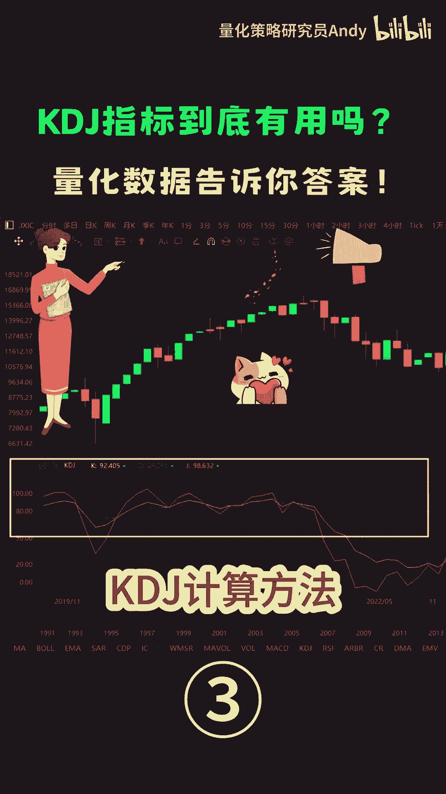
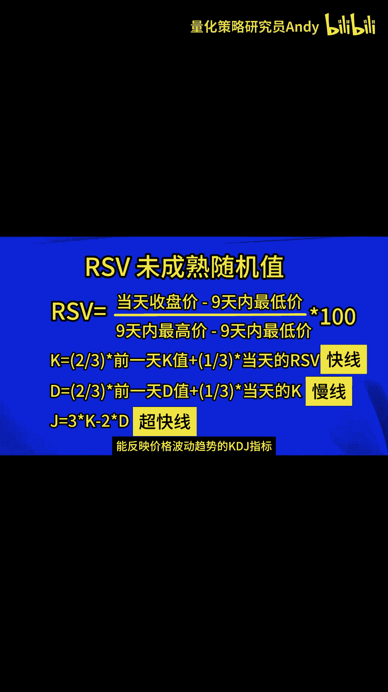

# 【技术分析入门】KDJ指标的计算方法 - P1 - 量化策略研究员Andy - BV16w4m1e7bA

K值是等于前一天的K值乘以23，加上今天的rs v乘以13，D值是等于前一天的地值乘以23，加上今天的K值乘以13，以此类推，最后的G值就是等于当天的K值乘以三，减去当天的D值乘以二。

K值的作用是对rs v做平滑处理，而D值是通过进一步平滑K值来得到的，K线通常被称为快线，D线是慢线，而由于G线的计算中，K值被加全了三倍，而D值被减去了两倍，这使得G线对市场变化的反应速度。

比K线和D线都要快，我们可以称之为超快线，总的来说，随机指标KDJ是以最高价，最低价及收盘价为基本数据进行计算得出的，K值，D值和G值分别在指标的坐标上形成的一个点，连接无数个这样的点位。

就形成一个完整的。

