# 【数据分析之量化案例】五天学会python金融量化数据分析 - P15：day04-2.双均线策略-金叉&死叉 - 计算机老油条 - BV14VBCYqEcn

那么我们接着看下一个需求哈，下一个需求需要我们分析输出，所有的金叉日期和死差日期，这块涉及到两个专业的名词，叫做金叉和死叉，OK吧，在咱们的双均线策略当中，金叉跟死叉是我们的核心对吧。

那首先咱们就来看一下什么叫做金叉，什么叫做死叉，那这块呢我也写了，在我们的股票技术分析当中呢，这个金叉跟死叉简单的解释就是如下啊，那就是说分析指标中的两根线，那么目前咱们在上图当中是不是画出了两根线。

一根线表示的是我们的5日均线，一根线表示的是不是我们的30日均线呀，对吧，算时均线啊，那在这的话你看一根为短时间内的指标线，另一根为较长时间的指标线，那这个短期均线指的就是短时间内的指标线。

那么我们的ma5就被称之为短期均线，ma30称之为长期均线吧，OK吧好，那看下边啊，如果短期均线啊，像短期均线方向拐头向上，并且穿过了较长的这个呃，这个这个这个什么指标线，这种状态叫做经济差，那就是说。

如果我们的短期均线上穿长期均线对应的，这个交点附近的位置就叫做金叉，那反之如果短期均线下穿长期均线。

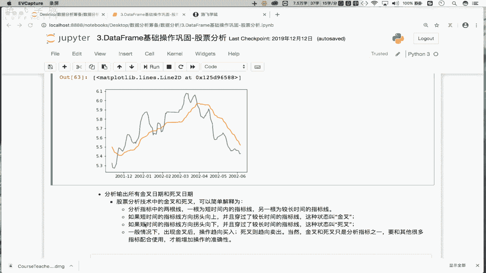

那么焦点位置的附近就叫做死叉，OK吧，比如说在这我们去画一个例子啊，画一个图啊，你看在这的话，比如说我们有一个坐标啊，有一个坐标在这先画一个坐标吧，好然后呢在这我画两条线。

比如说首先是这样的一条曲线是吧，它就是我们的MA5，可以吧，ma5是不是称之为短期均线对吧，然后再换一个颜色，比如说这个是ma30，那么它就是我们的长期均线，那我们来找一下哈，找一下，那我们来看一下。

那首先你看这有一个交点吧，对吧好，这也有一个交点好这也有一个交点，是不是有三个交点啊对吧，那么我们的金叉和死叉指，就是说如果你看黑色为短期均线吧，短期黑色的这个均线如果上穿长期均线。

你看这个黑线是不是上穿了长期均线，那么这个点啊，这个点或这个点的附近，我们被称之为叫做金叉对吧，你看这个点是不是我们的短期均线，下穿红色的长均线，那么这个点或这个点的附近我们叫做死叉。

那这个点呢是不是黑色的，短期均线上穿长期均线，那么这个点还是我们金叉吧，那么这三个交点分别是有两个金叉，跟一个死叉吧对吧，就这样去找我们所谓的金叉和死叉。

OK吧，那么一般情况下金叉出现后操作趋向于买入。

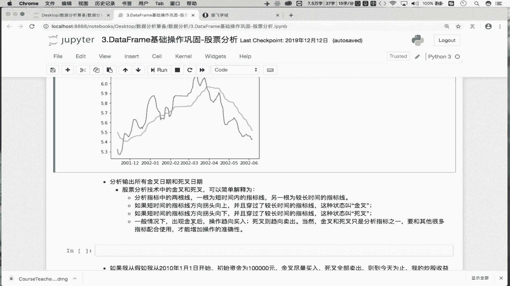

死叉则趋向卖出，OK吧，那就是说我们如果根据双均线去买卖股票的话。

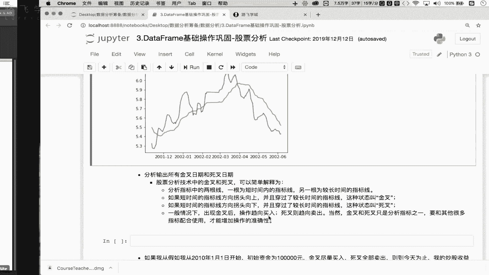

那么金叉出现的时候一定要去买股票OK吧，那么死叉出现的时候一定要把股票给抛出去。

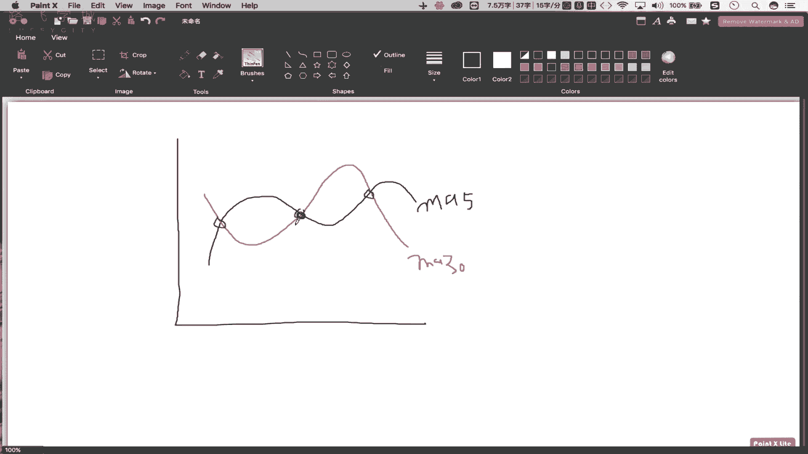

这样的话可以可以让我们的一个收入比较可观，OK吧，这个是双均线的核心，根据咱们的金叉和死叉，进行股票买卖的一个制定，是不是，OK吧好你看，那么你看这个啊，这个坐标系的图，跟我这画的是不是差不多一样啊。

就是两条线吧，那么你看这块的话。

X轴表示的是时间，你看这块啊，X轴这块对应的是不是我们的时间对吧，叫做T吧对吧，那么这一块的话。

那么我们的Y轴对应的是什么呢，Y轴这块哈，你看Y轴这块我们所对应的在这ma5看一下。

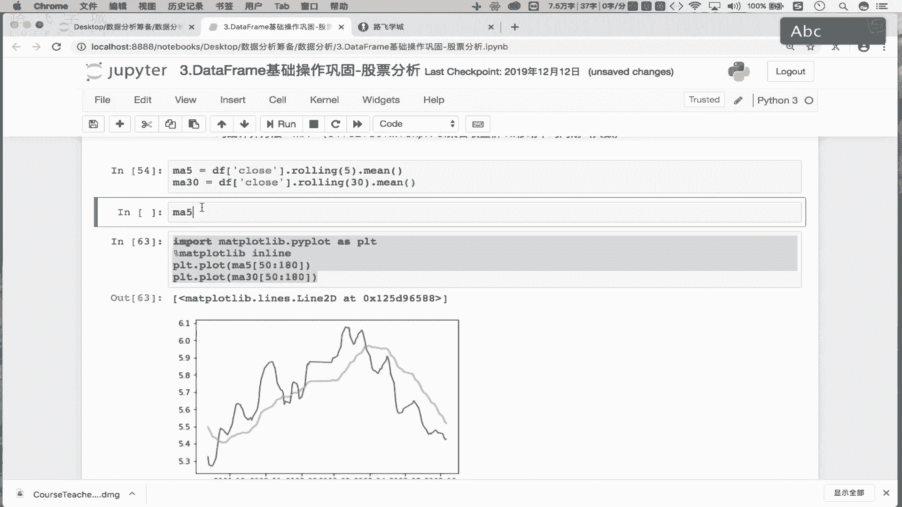

Y轴所对应的是我们算出来的均值，OK吧，这块是我们的均值，我写一下，就是我们计算出来的均值OK吧，均值啊好，那就是说这个均值指的是不是我们的这个，比如说呃，5日均值指的是我们平均移动五天。

对五天对应收盘价的均值啊，30均值就是说平均移动就移动30天，对应的收盘价对应的一个均值啊对吧，所以说我们的Y轴是我们的这个均值，X轴是我们的时间。

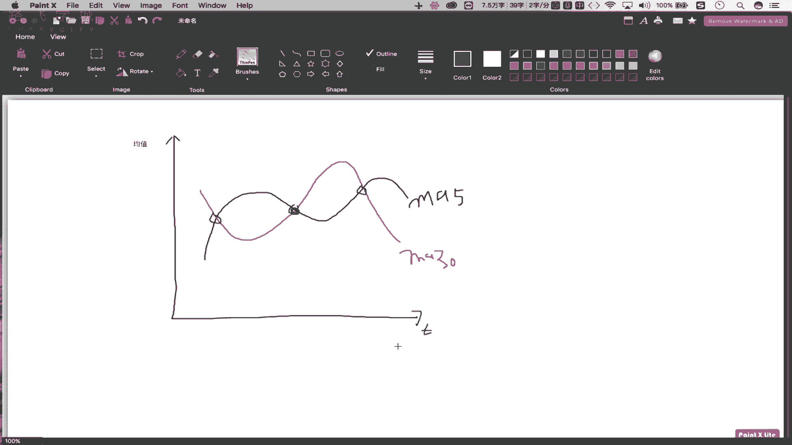

对不对，是我们的时间，那现在的话这两个坐标啊，这两个这个坐标我们能看懂之后的话，那在这金叉跟叉，我们是不是也能够知道是什么意思了对吧，但是我们现在的需求是说，要求我们能够找出金叉跟死叉的日期对吧。

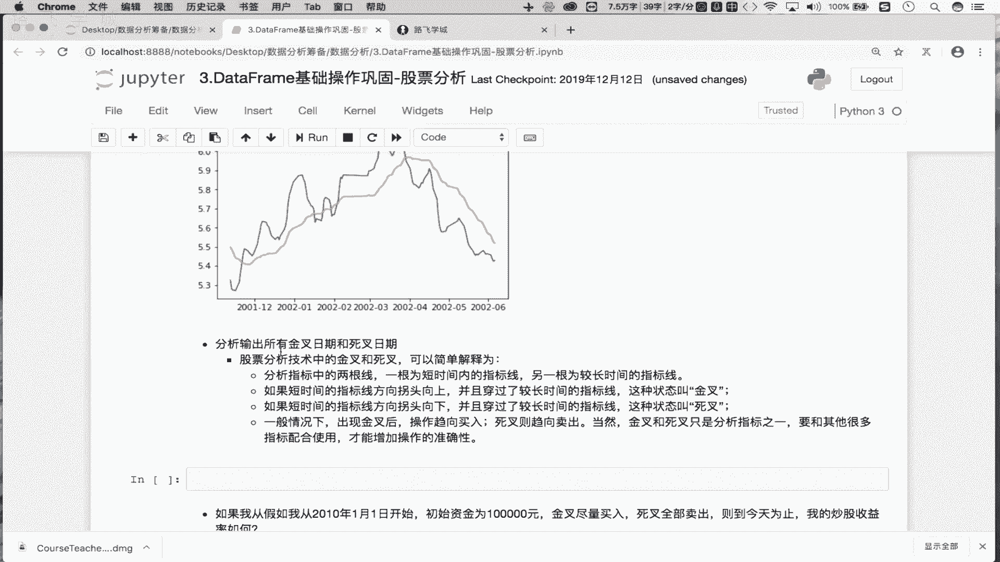

就找出金叉跟死叉的时间吧，你比如说啊你看在这块的话，比如说这两个点是不是金叉，我们是需要把金叉对应的时间给找到啊，对吧是吧，将金叉跟死叉对应的时间，就是将它的这个X轴对应的值，是不是求出来就可以了对吧。

要找出这两个时间就是我们的金叉时间啊对吧，而这个时间就是我们的什么呢，一个死叉的时间吧，对不对，那么金叉跟死叉的时间怎么去找呢，OK吧，那这块的话我们就不再去给大家逐步的引入了，这直接告诉大家方法啊。

这个方法可以把它视为是一个固定的方法，可以帮我们求出所谓的金叉跟死叉日期，OK吧好，那分析一下这样的一个图，我们在这可以看到啊，你看这个点是金叉对吧，金差这个点就是我们的长期均线跟短期均线。

交点对应的这个点吧对吧，那交点的位置所表示的是不是说在同一时间，ma5跟ma30这两个均值是一样的，对不对，你看在这个点的左侧，你看啊，在这个点的左侧和这个点的右侧，我们来看一下，看在这个交点的左侧。

是不是我们的这个ma5，就是短期均值要小于长期均值啊，你看是不是这个黑线是低于我们的红线的对吧，我们就以我们就看一下，你看比如说这个点跟这个点，比如说这两个点是同一个时间段对应哪个点呗。

你看那同一个时间段对应这两个点，针对于Y轴，我们来看一下，是不是这个点它的Y值要大于这个点的Y值啊，对不对，所以说你看在这个交点左侧，是我们的ma5是不是小于ma30，在这个交点右侧。

是不是我们的ma5就是黑线是不是高于红线，是不是ma5大于ma30啊，对对，是有这样的一个大小关系啊对吧，那你看左侧啊，左侧是M5小于M30，右侧是ma5大于M30。

那正中间是不是ma5等于ma30啊对吧，那能不能通过这样的特性，咱们去找出这些个交点呢，你看这个交点左侧是不是ma5大于MA30，这焦点右侧是不是ma5小于MA30对吧。

那中间的就是ma5等于ma30呗，能理解吗，所以说在这咱们来根据这个什么呢，ma5跟MA30大小的关系。

来找到咱们的这个镜片跟查17吧，比如说你看ma5ma5走，看ma5里边存的是啥，存的是不是都是我们的这个价钱呢。

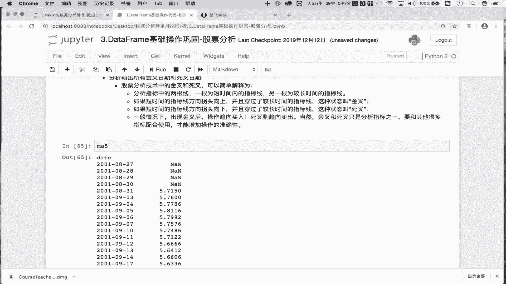

对不对，你看都是五块七，五块七毛六，就这个值不就是我们的均值吗对吧。

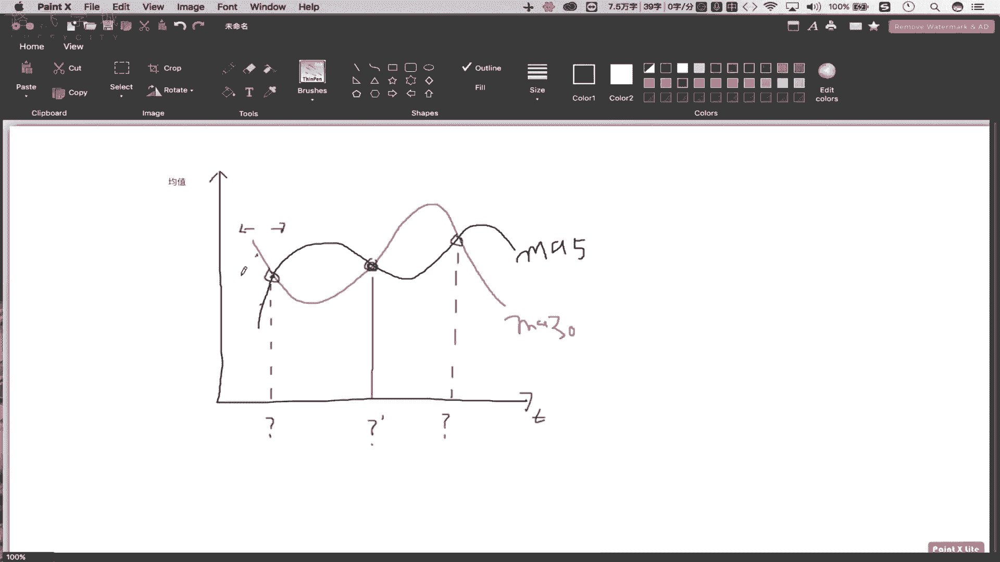

都是我们的均值吧，那ma30里边啊存的是不是也是我们的均值啊。

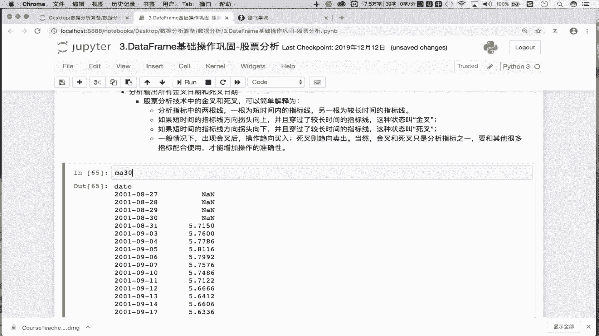

对吧，所以说MA5跟M30它的大小关系，就是可以通过什么，通过我们的这个坐标能够分析出来吧对吧，焦点左侧是吧，是ma5小于M30，焦点右侧是ma5大于M30，这个大小我们针对的是不是均值啊。

均值对应的不就是我们坐标当中的Y轴吗。

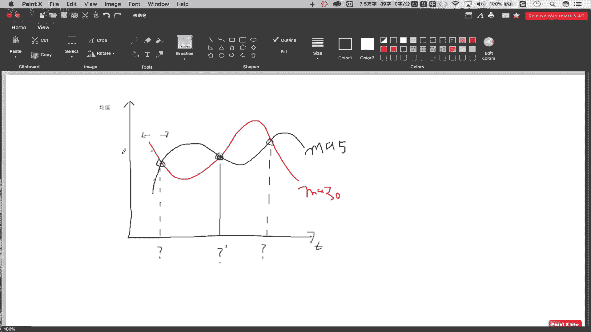

OK吧好，那么这块的话咱怎么去计算呢，看一下我们这的一个计算方式哈，计算方式，那首先这我们要找出这个，金叉跟死叉的一个日期是吧，金叉跟叉日期，那首先我们就可以这样去玩啊，这样去玩，你比如说哈在这的话。

我们先设定一个条件，MA5小于ma30，我们先做这样的一个判断，可以吧，OK吧叫做S1，先做这样一个判断，那么在这S2就是ma5大于ma30，30哈，30OK吧，不在这让他们进行一个大小关系的比较啊。

你看ma5是不是serious，ma30是不是也是serious，是不是让这两个series进行大小比较啊，啥意思呢，比如说那ma5看第一个值是多少，是不是有空啊对吧，空跟ma30的第一个值去比较吧。

空和空谁大谁小呢对吧，空和空是一样的，不分大小吧，就是空和空式没法比较，是不是，那咱们是不是可以把这些空先给它过滤掉啊，对吧，过滤掉，那怎么过滤呢，那在这的话我们就是让MA5，我们在这就让它切一下吧。

谢谢啊，就让他从哪提到哪呢，ma5因为他前五个值是空值吧，我们就让它从第30个切到最后吧，ma30也让它，从第30个笑到最后，为啥呢，是因为你看ma30，他是不是前29个数都是空啊对吧。

ma5前五时空为什么这不切成五到最后呢，是因为你看如果啊，如果我们的ma5是五到最后的话，那么意味着我们让ma5和ma30去比的话，那么ma30对吧，ma30它是不是就没有什么呀。

ma5前五个数对应的时间了对吧，那在这的话我们就统一的把这个时间啊，把这个时间从30开始给切分吧对吧，那这样统一一下之后走，你我们再来看一下吧，你看ma5还有空吗，没有了吧。

他是不是从10月15号开始的呀对吧，ma30也没有空，是不是也是从10月15号开始的呀，就保证了MA5跟MA30这两个serious，它们的索引都一样吧，我们说serious的索引一致之后。

才能够进行这个算数运算吧，对不对好，那么接下来在这我们就会拿到S11跟S2吧，对吧，一和S2，你想S1S2分别是什么呢，你看这是不是逻辑判断表示啊，对不对，那返回的一定是真和假吧。

那意味着我们的S1和S2里边存的，是不是都是我们所谓的布尔值啊对吧，你看S1是布尔值吧对吧，然后S2也是布尔值吧，对不对，那么这些布尔值当中的true和false各表示啥意思呢，对吧，你看S1走。

你看这个true，你看10月15是true，那么意味着在10月15号这一天，ma5是不是小于MA30啊对吧，那false的话就说明ma5是不是大于M30，OK吧，那么现在这的一个大小关系。

咱们就可以计算出来了吧对吧，并且用布尔值来表示了吧对吧。

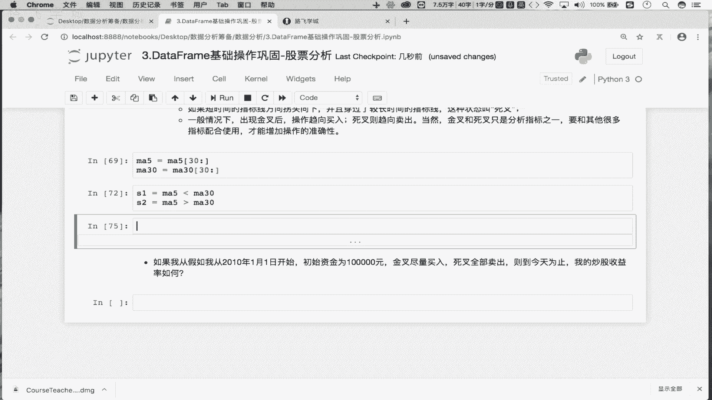

并且用布尔值来表示啊，那么在这咱们来看一下啊，就是说首先我们可以看一下，那么这个点是不是我们的金叉是吧，这个点也是金叉吧，这个点是死叉，我们就来看一下金叉跟死叉ma5和ma32。

它的大小关系是怎么算的啊，你看这个金叉左侧是不是ma5小于M30，对不对，好这个金叉左侧是ma5小于ma30对吧，金叉右侧是不是ma5大于ma30呢，那死叉呢死叉左侧是ma5大于ma30。

死叉右侧是不是ma5小于ma30对吧，那我们来这看一下，你比如现在啊，现在我们这是不是得到了IC呀，比如说我这啊看一下这儿的话，有一个啊我这样写吧，假如说哈这个是S1啊，S1指的是谁呢，先写出来这个啊。

好S1是ma5好吧。

ma5是什么。

小于ma30吧，OK吧好那么S2是什么，是ma5大于ma30啊对吧，先把这两个表达式呢我先写到这，让你知道ma5和ma30分别是什么吧，那现在比如说你看啊，我这有S1，那S1对应的不就是一组布尔值吗。

对吧，比如说我S1对应的这组布尔值分别是什么呢，True，True false，False，True，可以吧，这是我们S1对应的这两个值吧，那么S2对应的就是刚好是S1的相反的值，是不是对吧。

S1取反就是我们的S2吧对吧，你看一下，然后的话这块是我们的这个S2啊，那S2啊，S2比对的就是什么，就是我们的false false true true false呗，对吧，那先看啊，先看这啊。

你看一下，那就是说在S1表示是ma5小于M30吧对吧，你看这块啊，这个点这个点的左侧，刚好就是我们的ma5小于M30吧，这个点的右侧是ma5大于M30啊，对不对，但是你看啊。

你就说你看这个true这个true分别表示什么，分别表示ma5小于M30，false马上表示的不就是ma5大于了M30吗，那你看下，那么这个true跟false的一个过渡。

不是刚好对应的是我们的这个交点啊，对不对，或者对应的是焦点最附近的一个位置吧对吧，那么意味着你看这块的话，我们处啊处过渡到F啊，true过渡到F这对应的是不是一个金叉，能理解吧，因为你看在这个金叉。

它是个金叉的点吧，这个点左侧是不是都是ma5小于M30啊，那么在S1当中，ma5小于ma30表示是不是处表示啊，对吧，那么这个交点的右侧是不是ma5大于ma30，对吧。

对应的是不是我们SE1当中的false啊对吧，那么你看这块的话都是什么呀，这块的话都是true吧，这块的话是不是都是false啊，那true跟false的过渡是不是刚好对应的是一个进差，对不对。

刚好对应的是进差，那这我们就写出来啊，那就是说我们这个在S1当中T是吧，过渡到什么呢，false啊，它所对应的是一个金叉，OK吧，金叉，那我们再来看一下那false过渡到T呢，你看这个点。

这个点这个点左侧是不是ma5大于ma30啊，那在SC当中，ma5大于M30是不是用false表示啊，对不对，这个点的右侧是不是MA5小于M30，是不是用true表示啊，那这个点的左侧是不是false啊。

这个点的右侧是不是true啊，那么false过渡到true就是false过渡到true，那么这个过渡对应的点应该是我们的死叉吧，对不对，所以说在这啊F啊，F过渡到什么呢，过渡到我们的T对应的是死叉。

OK吧对应是死叉，那么意味着在这根据我们的S1，它所返回的这组布尔值，我们在这一组布尔值当中，根据T跟false，false跟T的一个过渡，就可以找到咱们的金叉和死叉吧，对不对，找到金叉跟子叉啊。

大家你看我的S1。

它所对应的布尔值不止这么五个吧，是不是有很多个呀，一共有多少个不。

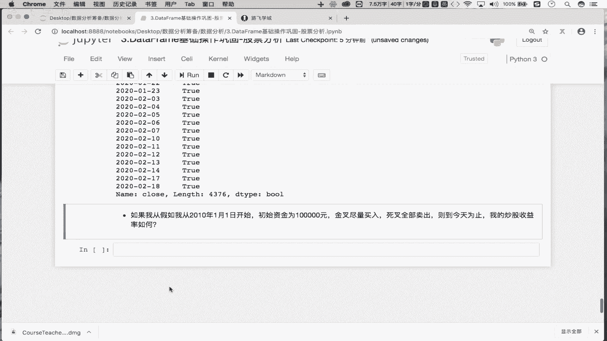

一共有这个4000多个呀对吧，一共有4000多个啊，那所以说那这块的话咱们不能手动的去找吧，不一定得通过一个算法去找啊对吧，那么这块咱们怎么通过算法，可以找到SEE当中的T的FF到T的过度呢，怎么找的。

你看我们这么去玩一下试试啊，比如说那现在我让S2哈，S2是serious吧，我让S2向右移位，原先S2是几啊，不应该是S1的反，这个这个取反的值啊是吧，然后再向右移位，不就是我们的false吗，Fs。

T，t false对不对，你看那么f f t t false不就是TTFFT取反吗，对吧，那这个是S2吧，S2我向右移位就变成了FFTTF了吧，怎么向右移位。

是不是讲过我们说series向下移位或向上移位，是不是可以用我们的shift呀，shift1向下移位，shift-1是不是向上移位啊对吧，然后呢，现在我们干啥呢，我们现在啊让我们的S1OK吧。

S1在这的话和S2向右移位就是S2，是不是点这个shift呀，对吧，shift shift等于一，是不是向右移了一位对吧，shift啊写的有点丑啊，打开看一下，我们现在这样去写啊，这样去写。

我现在来表示一下S1是吧和S2点shift，一看一下，那现在我让S1跟S2shift1做一个什么操作呢，我在这让他做一个逻辑与的操作，它会得到怎样的一个结果吧对吧，看会得到怎样的一个结果啊。

那首先我们看一下吧，你看S2向右移位之后，你看这个位置不就是空了吗，对外就空了啊，空我们就不让他跟我们的true跟false去逻辑语了吧，对吧，我们就让它对齐的位置进行逻辑语吧对吧。

那这样的话得到什么结果呢，你看T与上false返回的是什么呀，是不是false啊对吧，false与上false还是false吧是吧，F与上T是什么false吧，T与上T呢是不是T啊对吧。

那在这的话我们是不是找到了什么呀，写一下啊，写一下这块返回的值，首先看一下啊，T与上false得到的值是什么，false吧，false与上false呢，false好。

false与上T呢false是不是减啊，T与上T呢是不T啊，你看我让S1与上S2之后是得到一个T，这个T刚好不就是我们SE当中，F过渡到T的这个位置吗，对吧，那就是说我如果将这组布尔值代入到原数据。

作为原数据的行索引的话，不可以取出T所对应的这一行，那T所对应这行是不是就是我们的什么呀，F过渡到T你看F过多T不是死叉吗，是不是可以得到死叉的这个时间啊，这是得到死叉所对的行数据啊，对不对。

那就是说我现在让X1与上S2，点shift1返回一组布尔值，那这组布尔值是吧，当中的T如果作为原数据的行索引的话，是不是可以取出T所对应的行数据，那T所对应的行数据，不就是我S1F过渡到T的这个位置吗。

我们知道刚才总结出的规律，F过多T是不是刚好是死叉。

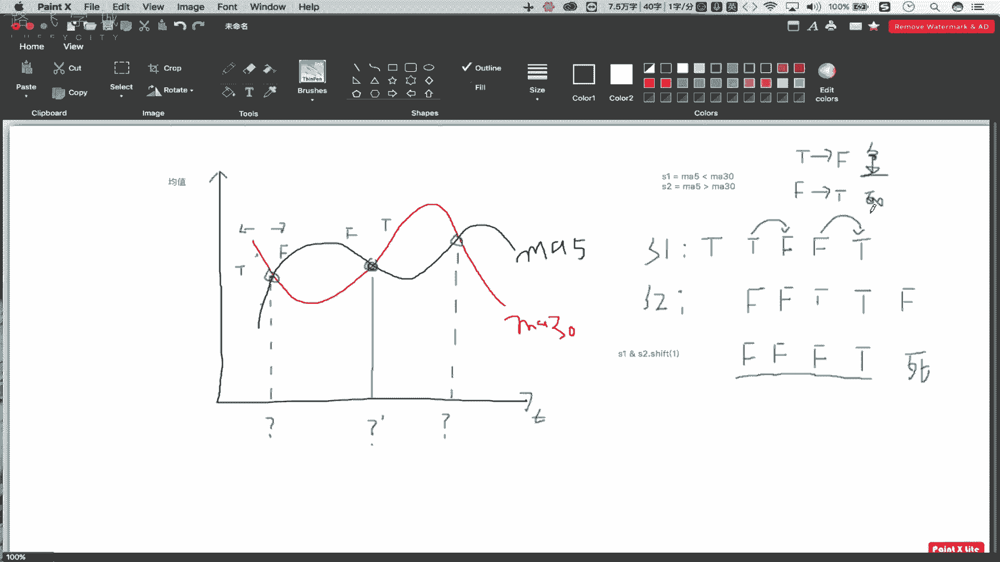

那么意味着就可以找到死叉，所对应的行数据了吧，对不对，试一把呗，试一把，首先我们是不是让S1是不是与上，是我们的S2点shift1啊对吧，是不是拿到一组布尔值，那将这一组布尔值作为原数据的行索引吧对吧。

我们写一下，这个就是我们的一个death杠杠，ex是我们判定死差的条件啊对吧，这个是啊，判定死，死叉的条件，这个条件返回的是一组布尔值是吧，这组布尔值代入到原数据，做原数据的行索引吧对吧。

我们的原数据是谁，是不是我们的DF啊，看一下是不是我们DF啊，对吧，这是我们的原数据吧，是我们DF啊，好那在这的话就是DF点lock，将我们的带s ex放进去，那这返回的是不是我们的什么呀。

死叉对应的行数据啊，EXO这返回的是组布尔值吧是吧，布尔值是可以作为原数据的行索引的呀，没错啊，I lock，有问题哈，看下这问题是什么啊，我们来分析一下啊，分析一下，首先这个是DX杠ex吧是吧。

代X杠X这返回的是这样的一组值，是不是这样的组织，是不是false false，true跟true啊对吧，你看这儿的这个什么呢，你看这的索引呢，它是不是从10月15开始的呀对吧。

那咱们原数据看一下原数据，它的这个时间看是不是从10月15开始的吧，不是吧，是不是不是啊，所以咱们在这啊需要改变一下我们DF，DF就等于DF，我们也让它从多少呢，是不是从10月15开始啊。

那么之前我们的ma5和MC，是不是都是从30不到最后啊，不DF也得从30到最后啊，对不对，那现在这改了之后的话，我们接下来啊，接下来再在这获取死叉所对应的行数据啊，获取死CHA对的函数序，再试一下走。

那这还不行啊啊lock啊，是获取了对吧，现在这就获取了我们死叉所对应的行数据了吧，对不对，获取了啊，那这获取了之后的话，那我们最终要的是死叉的时间呀，那这个行数据的行索引，不就是我们死叉的时间吗。

对吧好，最终我们在这的话干啥呢，好拿一下他的什么呢，行索引吧对吧，这个就是我们的什么呢，death杠data不是死叉所对应的时间，等你时间都拿到了吧对吧，死叉所对应的时间是不是都有了对吧，都有了啊。

好那然后的话，那么接下来啊，接下来我们看一下金叉怎么去获取吧对吧。

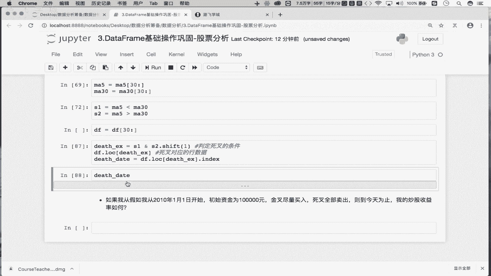

金叉怎么获取啊，好那么这块金叉的话，我们再次来看一下啊，还是有S1跟S2吧对吧，我接下来干什么，我接下来让S1或上S2点十，S1看返回的是什么啊，在这是什么，是S1，S1让他获上S2点shift1。

OK吧，看他得到的是什么结果吧，OK吧，那写一下，那首先T或上F返回的是不是T啊，对不对，F或者F呢返回是不是F啊对吧，然后F换上T呢T吧，T或者T呢T吧是吧，现在这得到三个T1个F吧。

刚好你看这个F对应的SC不就是T过渡F吗，那T过渡的F不就是刚好是进叉吗对吧，那么意味着你现在看我们这就是我们的什么呀，判定金差的一个条件吧，但是你想如果把这组布尔值放到原数据，作为原数据和索引的话。

值值值是不是只保留T所对应号，而忽略false所对应行啊，对不对，那所以说咱们最终想要的不就是false所定的行吗，那怎么办，那能不能对前边的SC1或上S2的，是不是一再取个反啊，取反的话。

这返回的不就是我们的F，T，F了吗对吧，那将取反之后的结果作为原数据的行索引，这判定的不就是我们静差的条件吗，对吧，这是判定金差的条件吧，OK吧对吧，就是说对他取一个反。

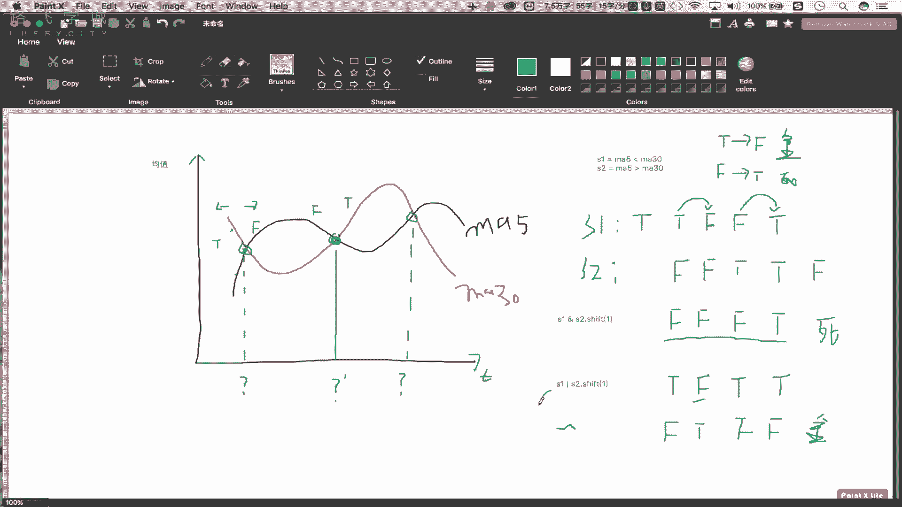

是不是取个反啊，那这我们来写一下写一下啊，首先是我们的是这个S1，就是或上S2点S2点shift它一，然后对齐取个反，是不是好取反运算符加个括号啊，好那这样的话咱们就取反了。

那将这一组布尔值数作为原数据的行索引啊，对吧，这是golden好gold的杠，ex这个是我们判定金叉的条件吧对吧，判定金差的条件有了吧对吧，那接下来咱们就可以获取金差所定的行，数据了吧。

DF点lock好，将这个条件是不是放进去对吧好，最终我们想要的是时间点index，是不是拿到行索引啊，这是不是我们金叉的时间对吧，叫做勾的，杠data好，那现在我们就获取了进差的时间了吧，金叉的时间。

那至此的话，我们的金叉跟死叉的时间是不是都获取了是吧。

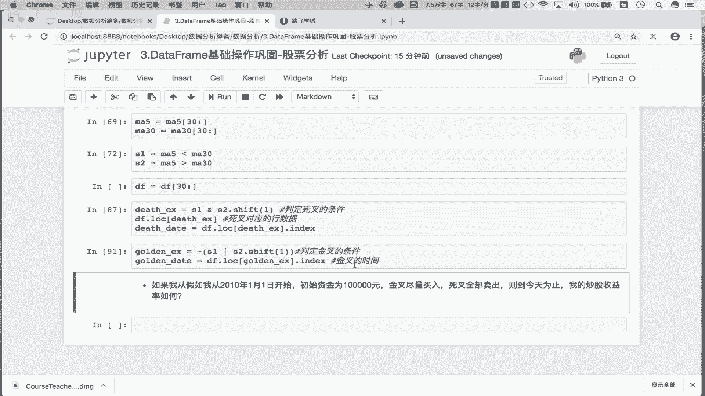

都获取了吧，好那么这个图的话咱们保留一下。

可以吧。

OK吧，那这一小节咱们就将金叉跟死叉所对应的日期，都找到了，OK吧，那最后的话只剩下最后一个需求了。

