# 【数据分析之量化案例】五天学会python金融量化数据分析 - P4：day01-04 numpy爆破属性 - 计算机老油条 - BV14VBCYqEcn

那这一小节咱们继续讲解。

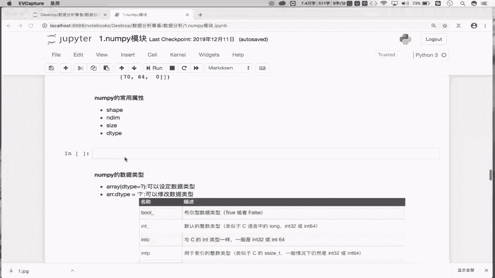

NIPPP模块的一个使用啊，好，那么接下来的话，咱们来看一下NIKE数组相关的一些个常用的属性。

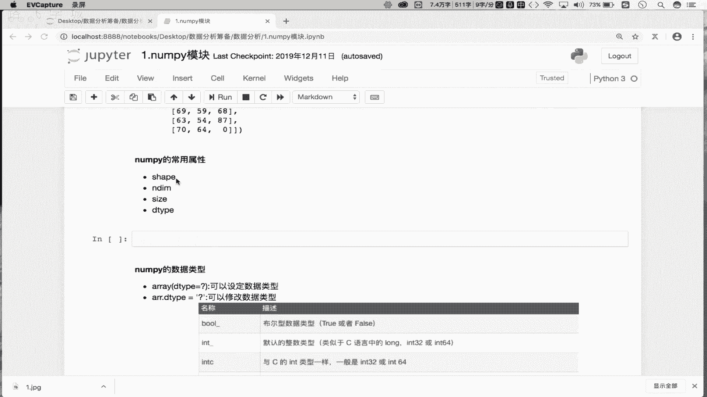

那么刚才咱们介绍的都是nip数组当中。

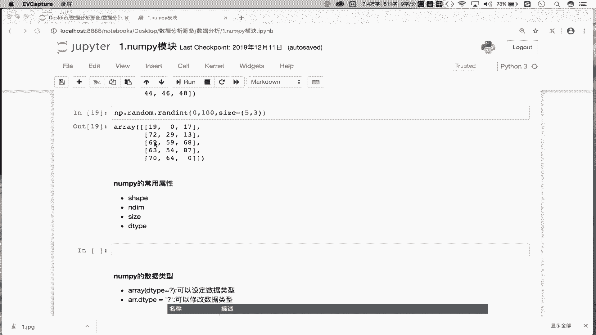

对应方法的一个使用吧对吧，那除了方块之外，还有这么几个常用的属性，我们来看一下啊，首先在这的话我们先去创建一个IP数组吧，NP点random点random int可以吧，好从0~100之间好。

size size等于一个五行六列可以吧。

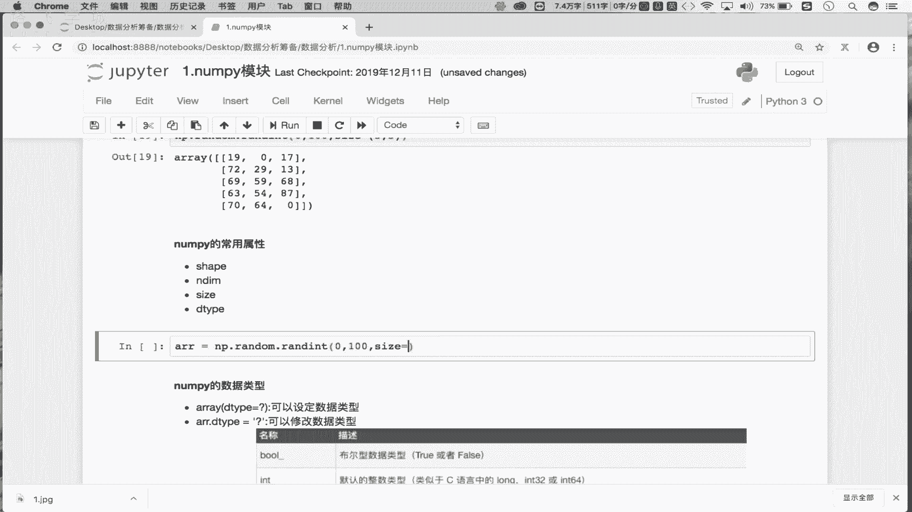

那现在error就是一个五行六列的二维数组，数组的元素是从0~100随机生成的。

是不是好，那现在的话我们的数组就创建好了，创建好之后。

那么接下来看一下我们这几个属性的使用，第一个叫做shift啊。

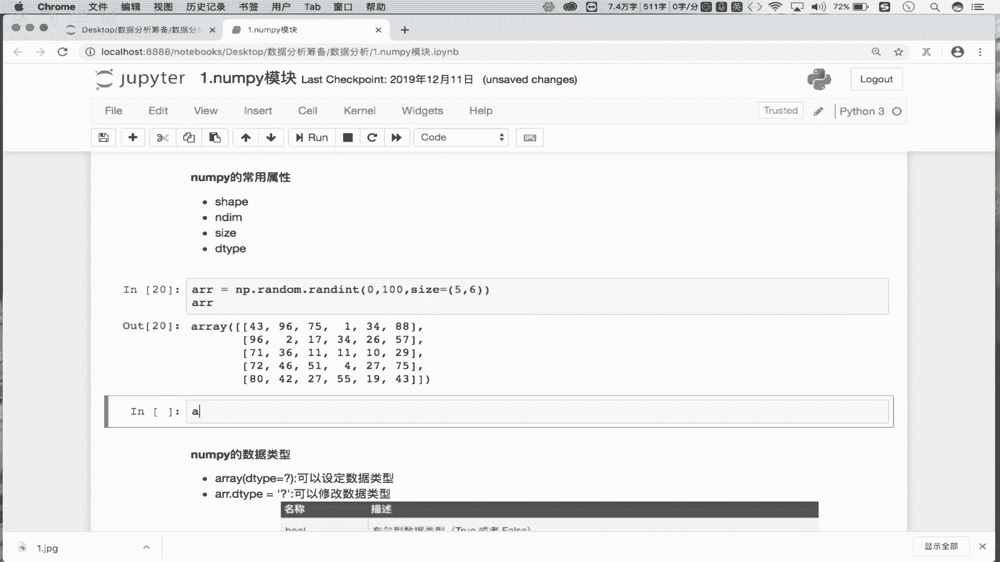

error点shift这个shift返回的是什么呢，看一下走返回的是不是五六啊对吧。

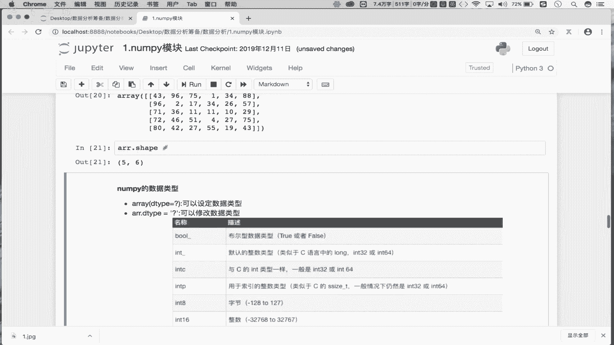

那这个sheep我们知道是形状的意思，那么意味着sheep返回的是谁呢，数组的形状吧对吧，是一个五行六列的啊。

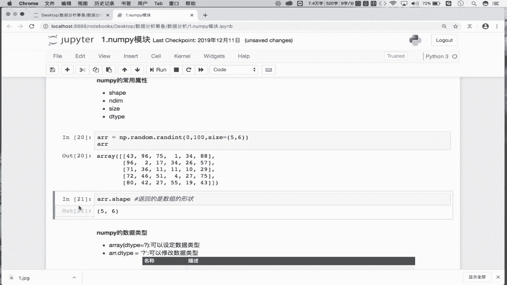

好除了shift之外还有什么呢，还有ending me啊，error点n dim zy返回的是一个二。

是不是二，啥意思呢，ENEM是维度的意思，那么这块返回的是数组的维度吧对吧。

数组维度啊，好除此之外还有谁呢。

这还有一个叫做size跟detail，是不是好，error点r size走，你那这返回的是30，30是什么，30是返回我们数组元素的个数啊对吧，好返回数组元素的个数吧。

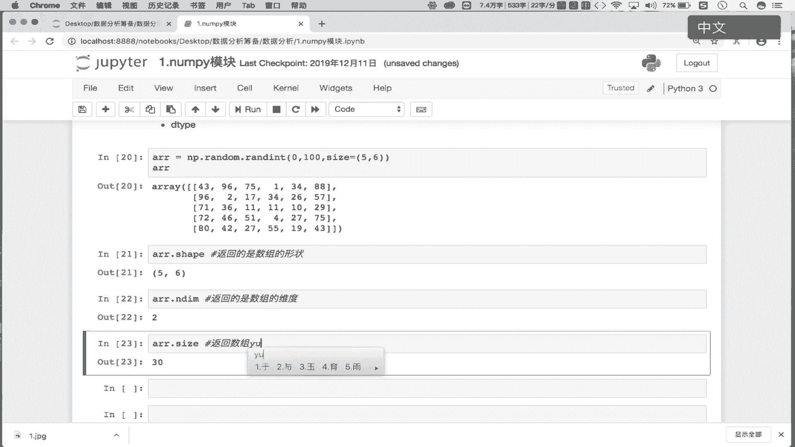

好最后一个叫做DETAPE，是不是啊。

DETAPE啥意思呢，error点第type走，你这返回的是不是一个int64的一个类型啊，那这一块返回的啊，返回的是数，返回的是数组元素的类型，是数组元素类型，OK吧。

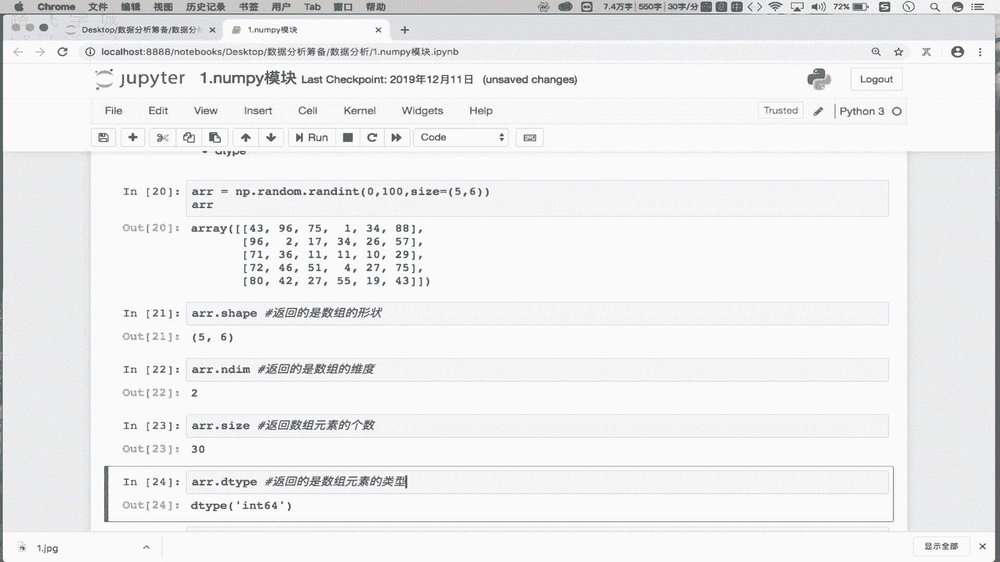

不是我们数组类型吧，你想看一下我们的数组是什么类型，怎么看，Type error，这儿查看的是数组的数据类型的。

都你返回的是一个nip点n nd array，那么意味着nd array是我们创建好，NT数组所对应的数据类型吧。

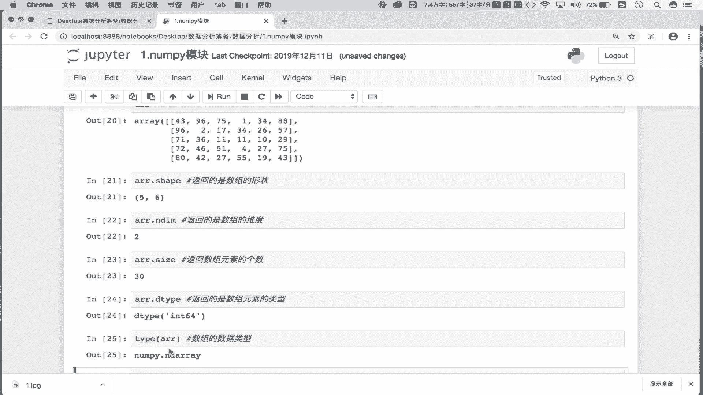

OK吧好，那么这就是我们所常用的nip数组。

对应的属性吧对吧，nap数组对应的属性啊，然后的话这块我们重点来说一下。

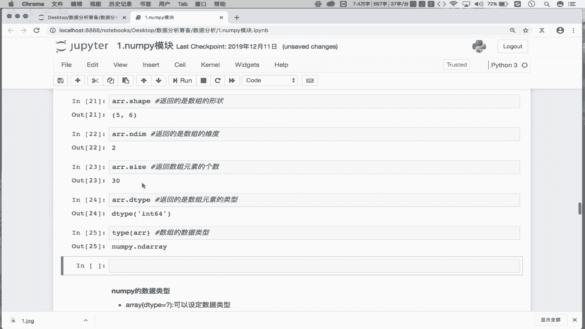

这个nap数组的数据类型啊，说一下navy数组的数据类型。

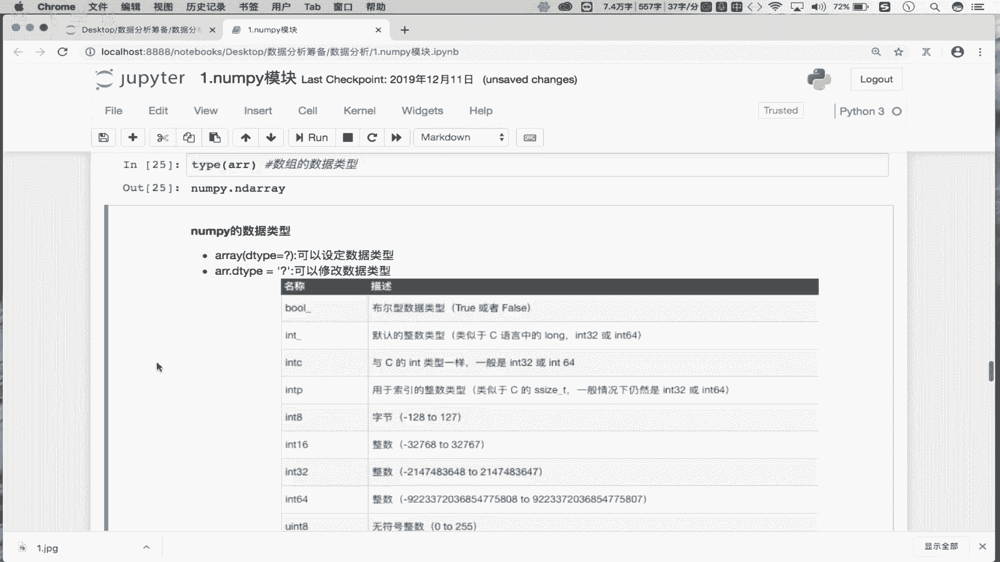

那首先哈首先我们在这去写一下，比如说我想创建一个数组，可以吧，N p d r array，n peter array啊，好比如说我给他123，那我在这是不是创建了一个一维的数组啊，是吧。

里边所存储的是整形的123，是不是，那我们在这看一下它的d type属性，所返回的是int64这样的一个数据类型啊，对吧好，那在这我接下来干啥呢，在这啊，接下来我想在这创建一个什么呢，一个数组。

然后的话指定数组元素类型为int32，行不行可以，那怎么做呢，NP点array好，这里边是123，然后第一种方式可以使用下什么呢，DETAPE吧是吧，它就可以等于int32好创建好了之后的话。

我们在这呢接收一下。

再次看下error点第type走，现在这返回的就是int32了吧，那咱们在这是通过d type这样的一个参数，指定了数组元素类型，OK吧，那除此之外还可以怎么做呢，你比如说我在这啊。

error点DETAPE是吧，我们刚才不是拿到DETAPEDETAPE的返回值啊，就在这我还可以去修改它，比如说改成int改成u INT8，可以吧，走那执行完了之后，我们再次看一下error。

点DETAPE就被修改成了UINT8了吧，那么意味着可以调用用d tape属性给其赋值，通过这种方式，是不是也可以修改数组的数组的元素类型啊，对不对啊，int32表示我所创建的这样的一个数组。

它每一个数组元素所占据的内存，是不是32位啊对吧，u INT8是无符号的八位，是不是啊，这些的话在我们的这个计算机科学基础当中，应该是涉及过吧，对吧啊，我们就不说这些了啊。

那在这我们就可以通过这些方式对吧。

去修改咱们数组元素的数据类型吧对吧。

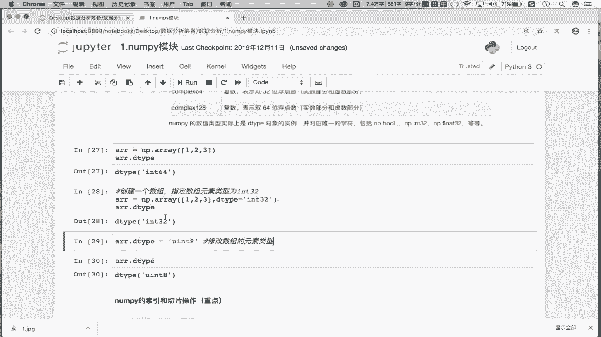

那为什么去修改呢，比如说哈我现在想在这创建一个数组吧，比如说这个数组里边存了500万个整形的数值，那如果你的d tape不设定的话，默认返回的每一个数组元素，所占据的内存是64位呀，对不对。

你想64位对应的是一个数组元素，那我这个error里面存了500万个数组啊，数组元素，那么意味着是需要创建一个500万×64，这么多位的一个内存对吧，那如果你想缩减内存开支怎么办。

就可以通过这些方式对吧，去修改咱们的什么呢，数组元素类型吧，给它改成UINT8，是不是让每一个元素占据的内存18位，就是一个字节，那这样的话就会大大缩减咱们的数据。

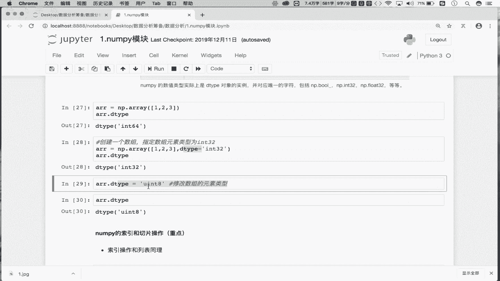

所占用的一个内存吧，OK吧OK好。

