# 【比刷剧还爽！】Python量化交易+机器学习大数据全套教程，入门到精通 2024B站最好的量化交易课程！（数据挖掘分析／大数据／投资／金融／股票／算法） - P5：5.4-亚马逊股价趋势 - AI课程搬运工 - BV1ps421T7ez

刚才啊咱们已经做出来了一个基本的模型。那下面呢我们要做的就是怎么样让怎么样能让这个模型看起来能够更好一些做这样件事。还是那些库啊，就是这些库啊，大家都之前都有按过了。那这回呢还是把他们导进来啊。

就是我们继续来做这个事儿。然后这回呢我们换个股票吧，换一个亚马逊的股票，看一看是不是也是呈现出来这样一个事啊，然后这个亚马逊的这个股票就是AMZN然后这个这些股票我觉得就更牛逼了，这个股票就更牛逼了。

因为他那个老总啊毕竟也是登顶过全球首富类人嘛，现在走是谁啊，我不太清楚啊，反正之前有段时间啊就是亚马逊的老总吧，他们创始人，然后登顶过那个首富吧，所以说这个股票啊还是蛮有发展的。这个股票还还是蛮狠的。

再来看一下它的个情况吧。😊，这个情况他是从这个9几年，他是呃我看一下最低价，最低价是97年5月22号。然后现在呢最高价是这个1月23啊，这是我1月23号那天执行的。然后呢，它的收盘价是1362。54。

这个反正对股票来说啊，我我对这个股票价格的概念不太特别清楚。我也不知道这个1362。在这个行业当中算这个高价呢，应该算高价吧。觉着备注是一个应应该已经登顶了价格，这个呢就是它股票整体趋势。

这个就不给大家划了，这个东西咱都看过，咱就不看了。😊。

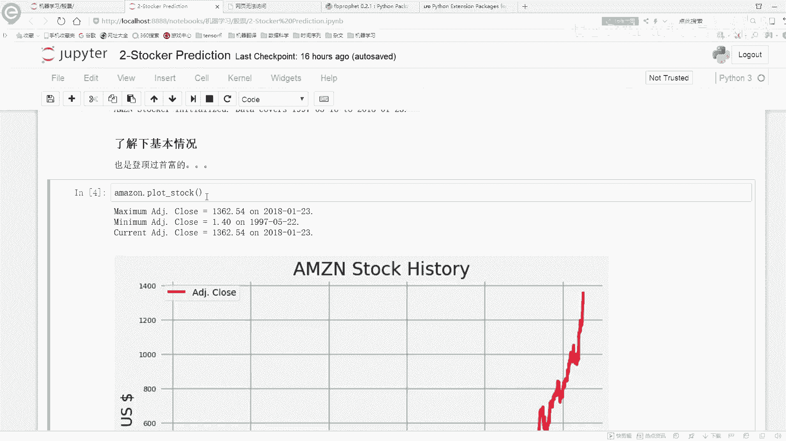

然后呢，又看了一下它的浮动的一个情况，这个浮动情况看起来还是蛮大的。因为在这里你看它有时候上上升下降，上升下降，但是总幅度还是进行一个上升的一个趋势的。😊。

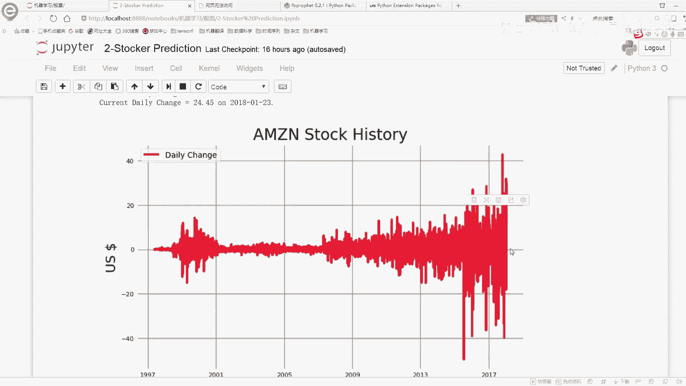

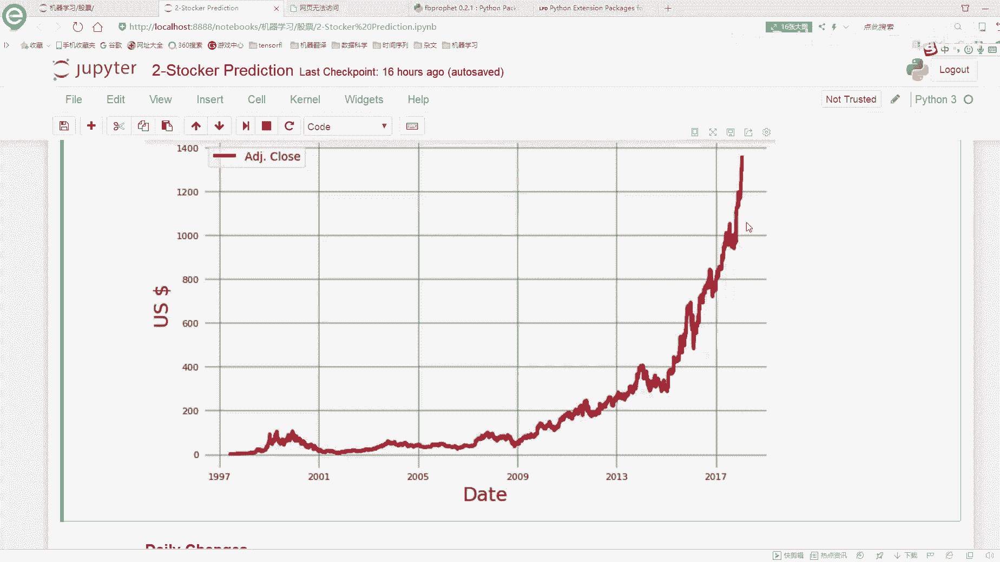

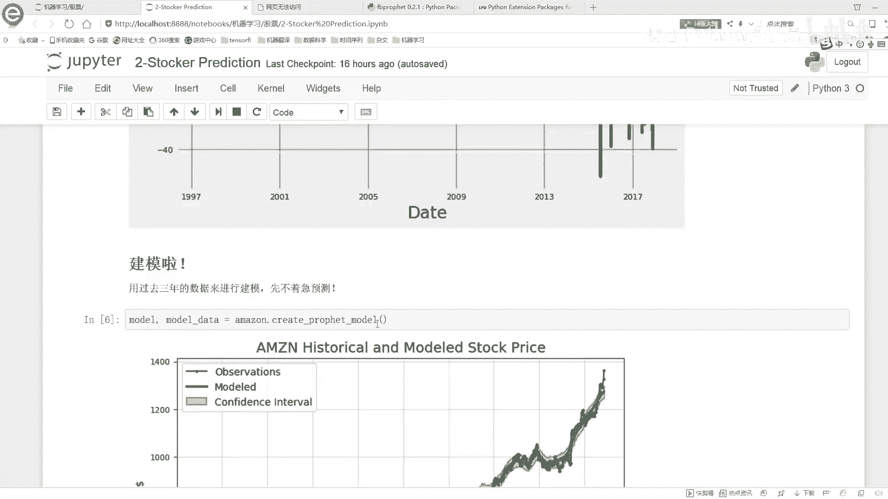

这里呢还是啊构造一个基本的模型，基本模型啊它是长这个样子的，这个样子是没什么问题的。然后呢还是啊这个黑色点是真实的这个这个绿色点是咱们预测的。其实大家发现发现这样一个事儿啊。

它真实的模型啊可能来说就是嗯就是那个突变点更多一些，但是咱们预测出来模型呢普遍来说啊都是咱们更均衡更平稳一些。这个呀也是我们暂时希望的一个思路，就是我们希望这个模型啊别太去过拟核。

因为一旦你把所有突变的点都找到了，那可能就完全过拟核了，这个趋势可能就不太对了。我们要预测出来模型啊，可能还得就是朝着平稳一些这样的一个方向，更把握一些的。😊。

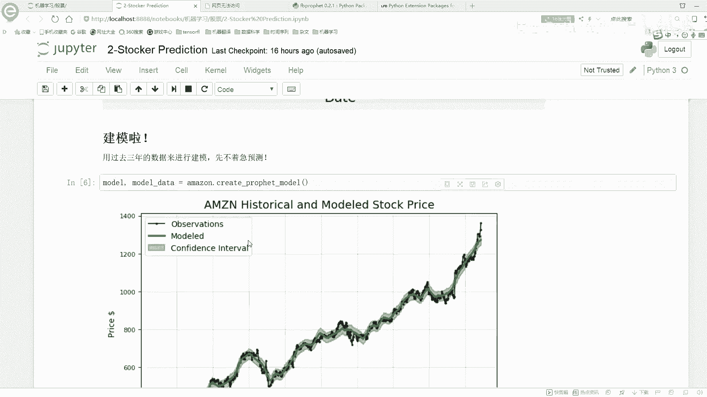

然后这些啊都是一样，这些咱们也不想要去分析了，我们也不关心这个股价到底怎么样，也不去买股票，这些就不看了。给大家着练说它有哪些功能。然后呢，我们要去预测，我要去预测未来90天的。

在这里啊就是我先随便的建立一个模型，在这里我们什么参数不调，只写一个d等于90。在这里呢当你写了一个dase啊等于90之后。😊。

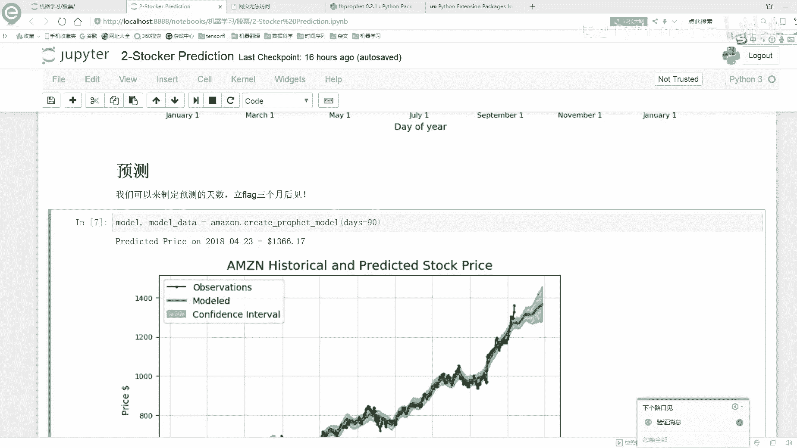

在这里啊，就是当你写了一个d等于90之后啊，然后呢我们得到的结果什么样？我们得到的结果就是你看这个绿色是它预测的，它明显应该是一个上升的。但是呢它这个东西啊却是一个比较平稳上升的一个模型。

你看这个绿色是它预测出来的结果。然后呢，它预测值啊，在这个4月24号，反正今天今天是今天反正是3个月之后吧，预测3月之后是1366。我不知道大家到时候看视频的时候是哪天，要是真超过了4月24号。

那这个时候啊就是你这样，你可以把那个4月24号，那天数据拿出来看看看看是不是这个1366，估价肯定是跟这个数有一定偏差的。😊。

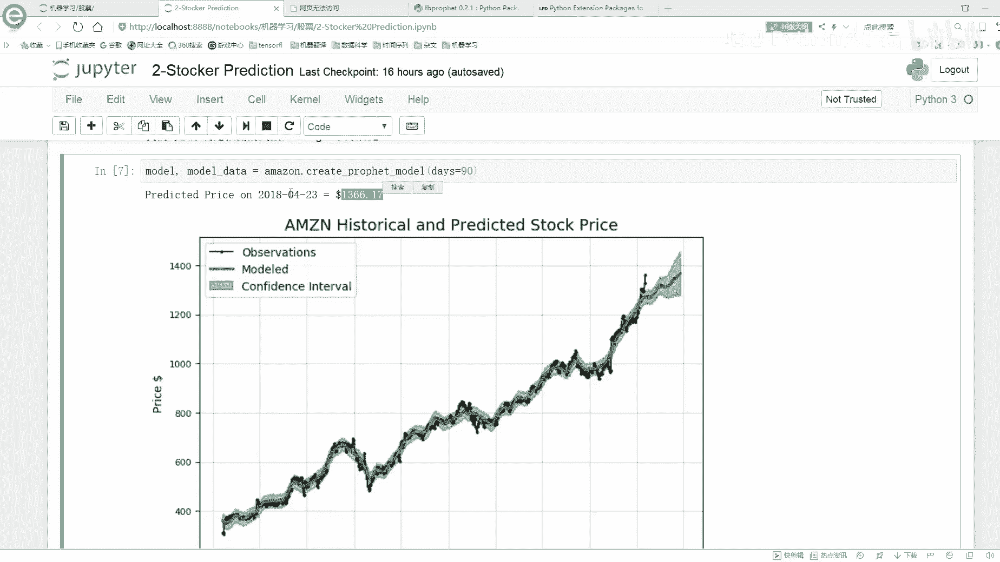

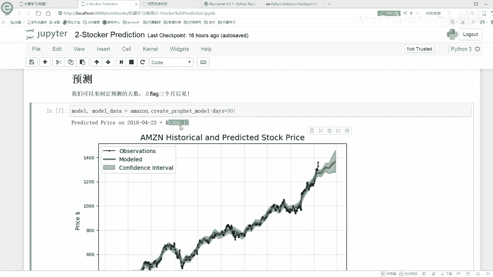

然后现在咱们预测完这个模型之后，这是基础模型。预测完之后啊，发现这样一个事儿。我模型怎么样，它是更保守一些的吧。其实呢它这个应该是明显往上穿的，我估计要穿的更高一些。

因为今年这个东西它是这个公司可能越来越牛逼了吧。反正我我对这个公司也不是特别了解啊，没上买个东西啊，因为国内也很难去上这些网站的。然后这里呢就是应该明年往上穿的，它是它更保守了。

所以说我们发现模型更保守了。但是呢它会降低一些离群点，还有这样一个突变点，对我结果的一个影响的。在这里呢咱们先提出来这一点，就是我的一个模型的一个评估。😊，模型的评估啊。

咱们这里说你说我要去怎么去评估这个事儿啊，咱们来想现在要去评估。哎呀，这里我现在就是往简单来说，咱们这么评估。比如说我预测值是一个值，真实值是一个值。我预测值和真实之间，我会有这样的一个误差吧。

就会有这样一个差异。那现在呢比如说我在这里我选我来我选一部分，就选这个17年吧，17年之前我当训练级，然17年之后我当测试级。这样呢我就可以看训练级，它的个误差是有多大，测试级，它的误差又是有多大。

这些误差啊，我都是可以自己的实际的算出来吧，就是真实值和咱们实际值之间误差，说白了就是这样一个绝对值嘛，这个值可以可以看出来。这是第一点，我们要看一个误差。第二点我要看什么。第二点我要看的就是。😊。

当前这个指标啊，如果说它实际的是一个上升趋势，那我们预测的它是不是一个上升的趋势。如果说它实际它是一个下降的趋势，我预没预测出来它这个下降的趋势。也就是说在我评估的时候，第二点要考虑的就是这个趋势。

我们预测没预测对，在这里呢有上升趋势，还有下降的趋势。我要看一下上升和下降趋势分别都做没做对这个事儿。😊。

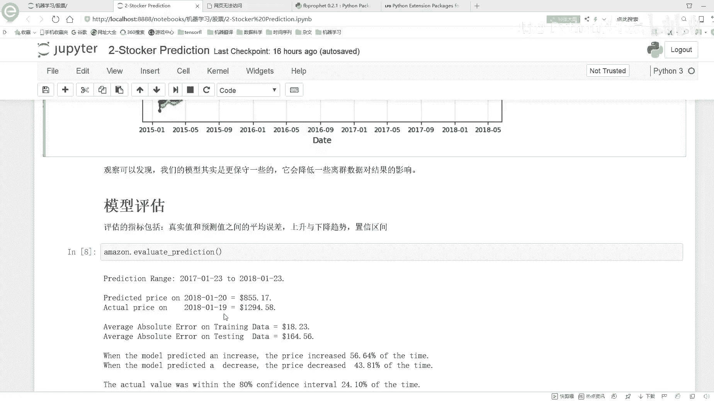

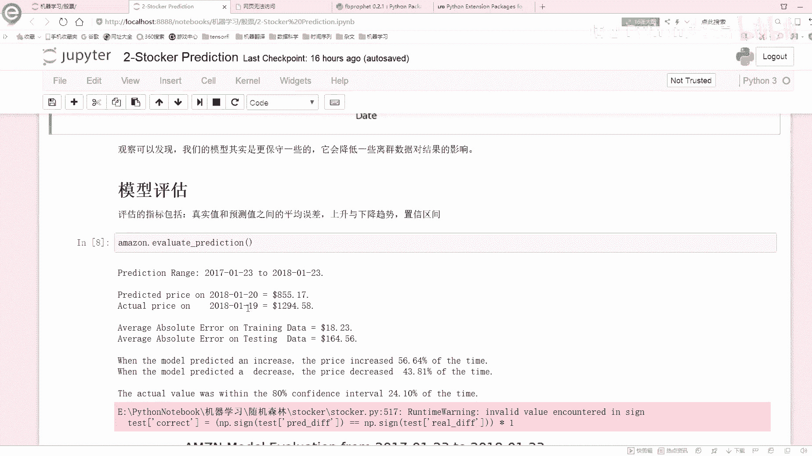

然后呢，在这里啊就是我们还是来debug啊，这个咱们也debug完了。然后这里这里呢你看这里啊我写的比较少，这里我写的比较少来看一下哦，给我先看一下这里，我看一下，把这个直接复制过来吧。😊。

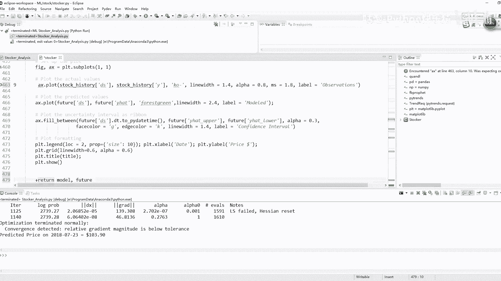

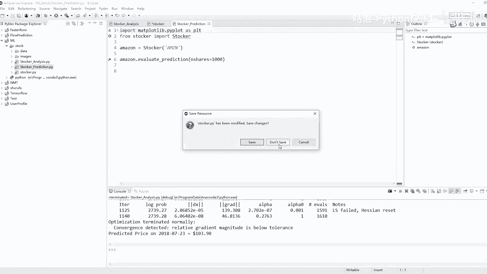

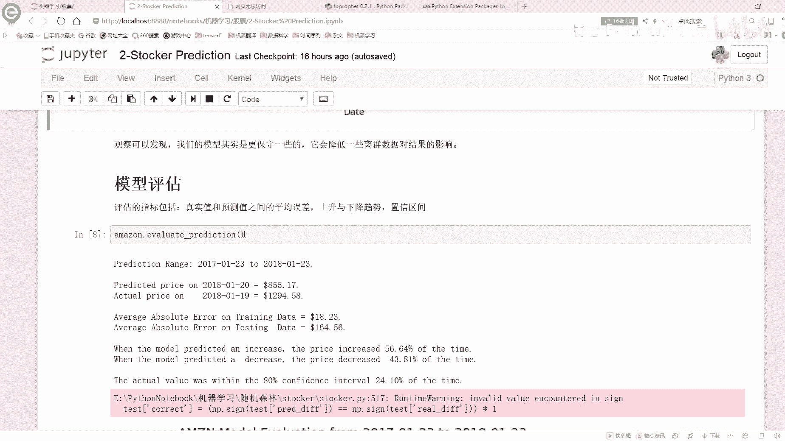

这里我先去构造一个模型。

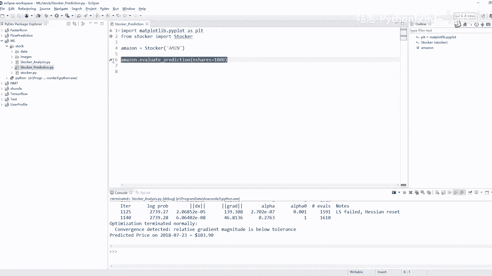

哎，我看直接跳直接跳这里可以吧，前面东西又复制过来吗？前面东西不行，前面东西我还得去把这个东西啊模型先构造出来，把股票拿到手，然后构建模型，然后去评估啊，这个没问题了。然后这个第二第二咱就不看了。

建模一样的，咱们直接来看评估这一块，还是第八个一项。😊。

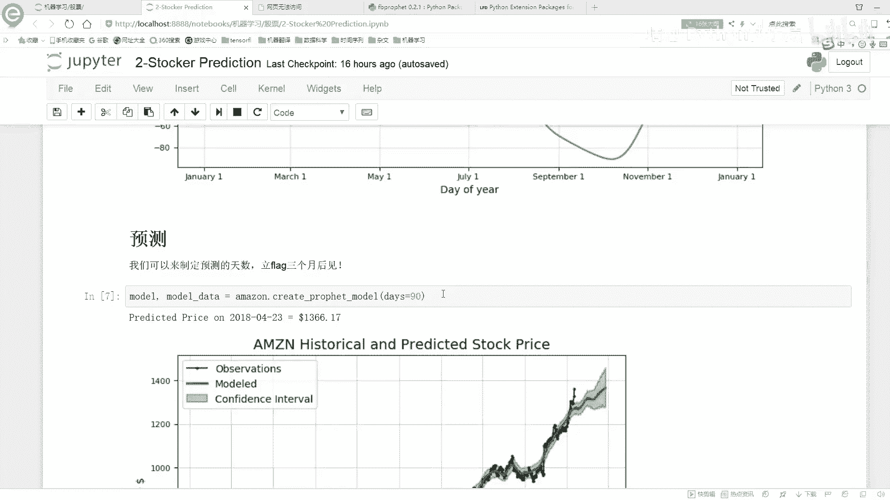

这个这个已经把我帮完全当成是我的一个就是讲课给大家去演示了一个debug的功能了。因为我都是这么觉得，就是你自己看它这个代码，其实我之前我我带过一些线下班，线下班时之前同学去看代码的时候。

他们一般情况下都是从到尾去看，然后看我觉得这个东西啊能看出什么，还是觉得比较难理解吧，最好呢就是能bug一遍，你看bug时候，你看一下这个值多少那个值多少，本来这个代码其实挺难懂的那你就是你看代码。

你不知道啥意思。那你看值，我觉得十有八九你也才能猜出来的吧。因为我去看别人代码的时也是这样的，别人代码其实很多啊也不一定我第一遍直接看函数，你直接看函数也不一定能看懂吧。一般情况下从到尾bug一遍。

自己走一遍走一遍之后，经理差不多就有一个数了。😊，哎呦，给大家尬聊这么长时间，他还没有去给我泡完。😊，咱咱咱还得再尬聊尬聊一分钟啊。😊，这个东西看起来蛮慢的。然后我这个CPU是8700K啊，已经87。

但我估计大家呢可能没有我这个高一小。因为我当时是我这个不是服务，我这个还不是专门用来当服务器的，只是放到我这个家里啊给大家做这样的一个演示的一个功能的。😊，哎呀，又尬掉了又尬聊这么半天。

还是没有还是没有跑完。这影呢可能就是这个数据。😊，嗯，怎么说呢？怎么说呢？怎么说，我也不知道怎么说，他就是比较慢，还没有到我这个断点上。那咱再稍微等会儿吧。😊，哎。

我看这块他这块怎么已经预测出来结果了呢？这后打印出来预测那天结果，但是没有给我跳到这个评估里边。

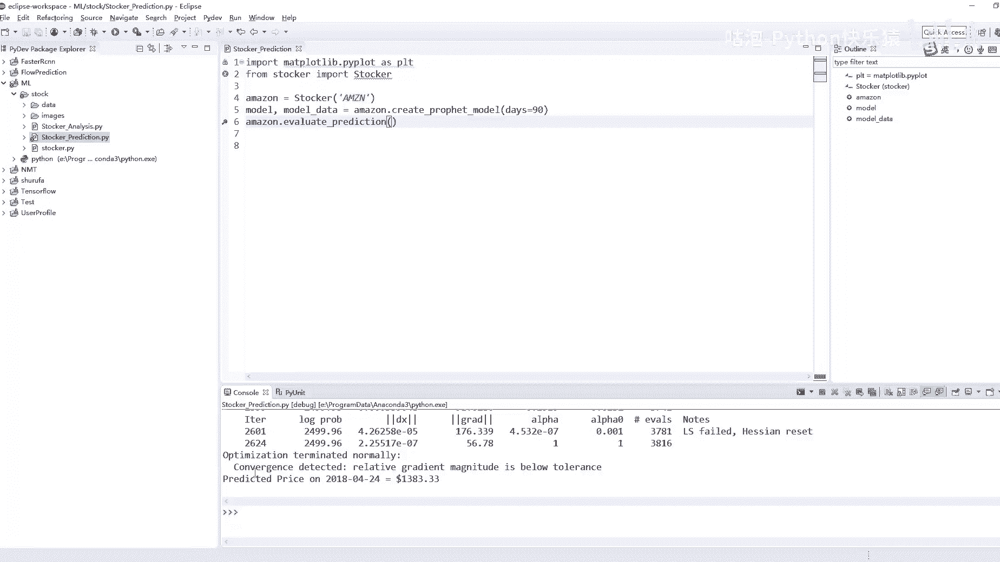

这么对吧，咱先看咱看结果吧，咱看结果，然后再来说它这个模型。

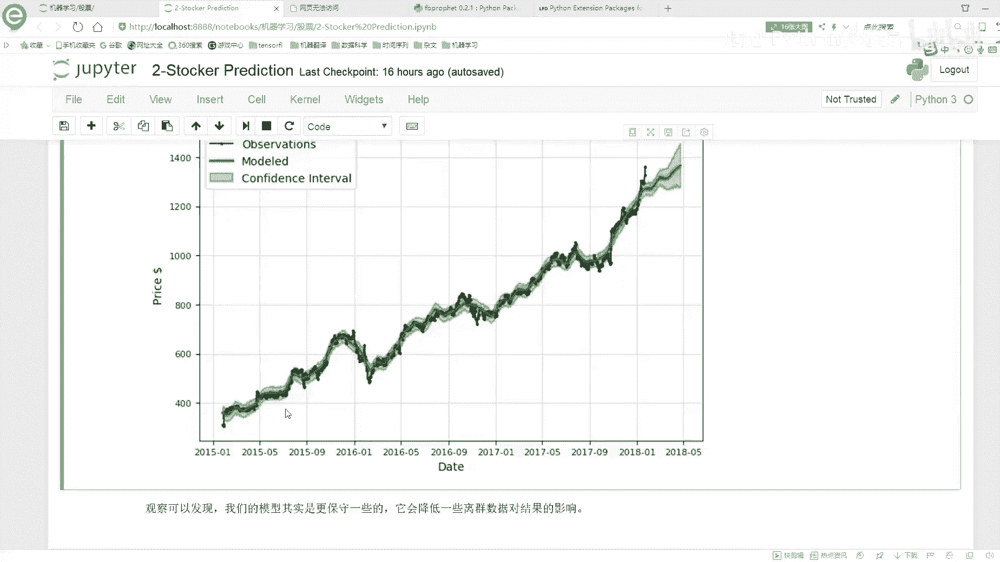

哦哎呀我我二了这块专业店这样，就是他会给你画出个图，你需要先把这个图给它关上，他会才能继续往下给你运行。我这个图一直没关，我还啥等着呢，尬聊半天然后给关上，这个他就进来了，是吧？大家注意点，就是在里边。

是至要这块他会跳出来图，跳出来图之后他会等着。等着你把这个图关上，关之后，他才会肯定往下去跳。我就说这个尬聊这么长时间，怎么还没给我读完。😊。

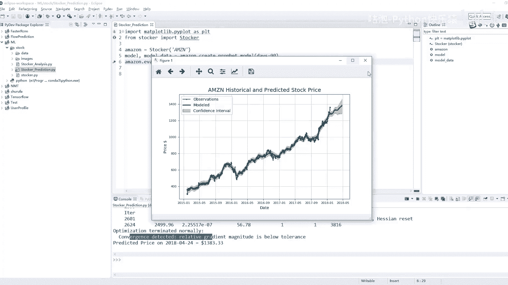

首先一样啊，还是给你找这个起始和终止日期啊，你看17年哎star起始日期怎么怎么这么这往前，起始日期啊，它是一个一我看一下这块啊，因为这块我只我只选择了一个一年啊，这块一个我只选了个year等于一年。

所以说我现在起始时间是这个2017年1月24号，终止时间是2018年1月24号，拿这部分时间啊，当成是我要接下来处理的一个日期。😊，然后春呢对于我的一个训练数据啊，训练数据我是取的是三年的。

就是14年到17年。然后测试就是训练数据，14年到17年这么3年。然后测试数据啊是这个17年到18年这么一年，就是三年三年的时间来当成是一个训练，一年时间当成测试。

但不要忘一点啊这个测试集一定是要有真实的一个指标的。所以说测试集只能是从今天开始往前推这么一年。然后训练集呢就是往前推那么4年，往前推四年，代表人取三年嘛，这个意思。😊。

然后分别啊把我的一个训练数据测试数据按照日期都拿到好吧。拿好之后啊，然后这里我还是去先去建立一个模型，来fit一下我当前的一个训练数据。😊，训列完单元数据之后呢，然后接下来要预测吧。接下来预测的时候。

你在这里指定个365，什么意思啊？你要预测出来接下来的365天吧，所以说这块feature我们把这个东西拿到手，它是从17年一直到这个18年的1月23，所以说这是咱们当前的一个指标。

然后呢我去在这里又去。😊，projectect一下，就是实际的去进一个预测吧。这块啊这块又稍微等，哎，这块蛮快的，是预测出后预测预测完了。然后最终呢我就得到18年结果了。然后呢。

把我当前预测完的结果给他握着进来，就是把我的结果拿到手，出的结果呢也给他拿到手。😊，这回呢咱们就来看吧，咱们先算这个东西啊，先算一个这个difference。

这个difference它的意思啊就是说呃我按照我前就是按照今天减去昨天这样的一个这样的一个指标去进行一个计算。他这个意思说白了就是我这么一减得到一个正数，说明就是我是一个上升的趋预测的是上升的趋势。

我一减它这个负数，那不就是预测它是一个下降的趋势嘛。这里就是通过这个differ一个函数啊，帮我去看一下，在当前这个当前咱这个幅度啊，它是一个上升，还是一个下降的一个幅度的这块呢我没有去打印值啊。

如果说大家不清楚的情况下，你可以去打印一下di之后结果。说白了就是我拿今天跟昨天去比较。然后把每一天和前一天的差异值拿到手，拿到的是这样的一个差异值啊。😊。

然后这块SHGN啊这个函数它的意思就是说嗯大于零的情况下，它是就是等于一的，小于零的情况下，它就是等于0，就是等就是等于零的。它是这个意思。给大家来看一下这个函数吧，这个函数大家当大家就是读的时候。

如果说你遇到哪个函数，你不太了解，不太了解的时候怎么办呢？比如这个函数啊，我现在也不会了，我这个函数也不会了，我就百度一下吧，是吧？这个n派直接定它的文档当中，它就会告诉你，如果说当前它小于零的时候。

它是等于-一的，大于零的时候呢，它是。😊。

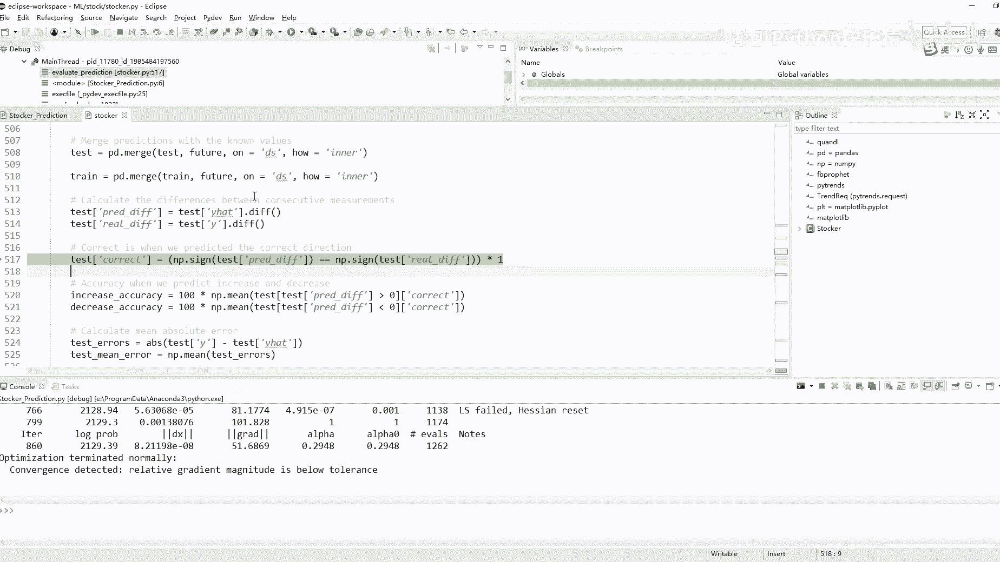

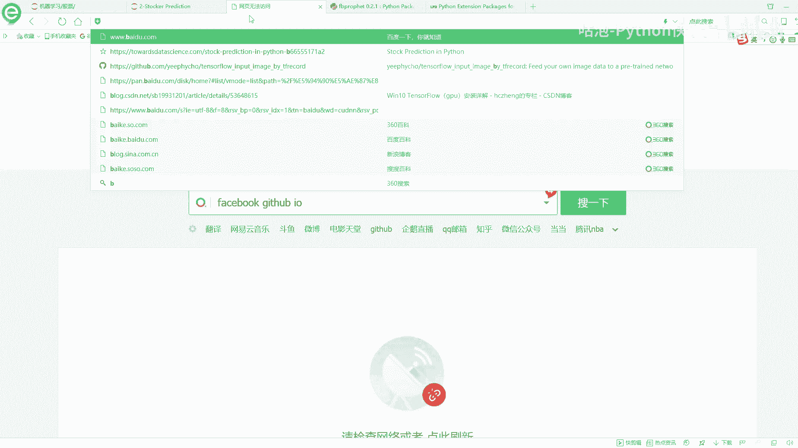

大于零的时候，它是等于一的，等于零的时候呢，它是等于零的，忘了这个东西啊，不要紧啊，这个这些函数啊，我也容易忘忘了之后怎么办呢？忘了就代表不确定。你看刚才我刚才我我刚才我想什么来着。

我认为它是小于零的时候等于0呢，那不确定自己查一下，查一下这个函数啊，你就查这个nad的一个光文档，你在这里去查一些函数，我们都可以找一个结果吧。这里就是说遇到哪些东西啊，不会了，实际查一下。

我也经常查你说整这么多东西啊，我一天记的东西其实也蛮多的，我能记住吗？大部分情况下都记不住的，记不住怎么办啊，用的时候现查呗，但你知道这个东西啊，它是怎么一回事，然后一看呢你就明白起来。

这就是我们得反复去查，因为每天啊你都在忘一些东西的。😊。

呃，这块看什么，这块算啊，就是我的一个上升的趋势来说，我预测对了百分之多少，这块预测对了56%吧。这块去又统计了一下上升的趋势，你预测对了多少这块呢，就是在我的一个。😊，预测里啊。

我看了一下它的一个大于0，然后算了一下它的值，然后它的一个实际情况。你看这里它是算了它的一个实际情况吧。实际情况就是预测的和真实的是不是一样的。如果说它俩是一样的，那你预测对了，不是一样，预测错了吧。

道底一样的。这里呢就是你这个增幅预测对了多少个。然后这个降幅预测对了百分之多少。你看这56%，这个43%，这看起来很低是吧？相当于就是50%左右，就是相当于蒙嘛，这个数你蒙大概能蒙对多少。

我估计现在来说对于股票咱现在当前那个模型来说啊，做的其实还不好还是在蒙。😊，然后test的一个 error，然后算它那个me error值，然后纯 error算纯那个me error值，这个都好算吧。

就是。一个Y，它真实值减Y hat值就是真实值和预测值之间的差异值。然后你可以选你可以看这个train的 error，还有test error。这两个呢我们都可以去给它指定的。😊，然后呢，指定完之后啊。

这里我们最终要干什么？最终呢我们要算一个range值吧，这个range值啊就是我的一个最呃 upperer值和lower值之间的一个就是中间的一个差异值。最后呢我们再来看，最后啊就是我去打印这些指标了。

打印这些指标，然后我去。😊。

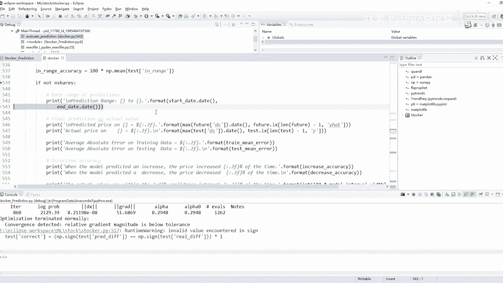

画这个图画这个图比较简单啊，咱直接就是跳最后了，我去收一下这个图，这就完事儿了。那这块呢呀这块直接直接干没了，直接干没了，这块我没往去粘代码，这么的吧，咱回来看吧，回来看这个图。😊。

你看这块就显示出来结果了，然后咱来看一下吧。我预测的是这个从17年1月23到这个18年1月23预测这么一年啊，然后预测到的1月20号的一个值是800多，但是这么一天啊。

它实际的一个值是1000多1200多。所以说就是预测值和认值之间啊，在咱们当前这个模型上是差异比较大的。咱们来看这里咱们平均的一个差异啊。平均的一个差异就是我训练级，它平均的一个差异大概是18块多。

然后测试级它平均的差异大概是160多。那看起来这个东西啊还是蛮大的是吧？然后呢下面打印刚咱刚才那张值啊，就是你上升的有多大有56%预测出来了下降的趋势有43。81%预测出来了。然后呢。

在我的知金区上大概是有20%多的一个数据。那下面就是我当前这个图。😊。

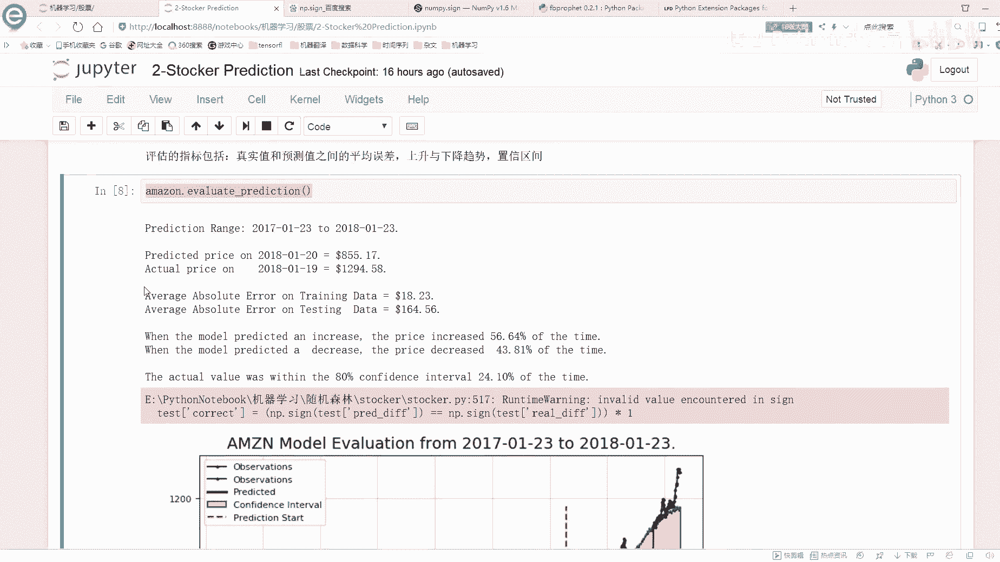

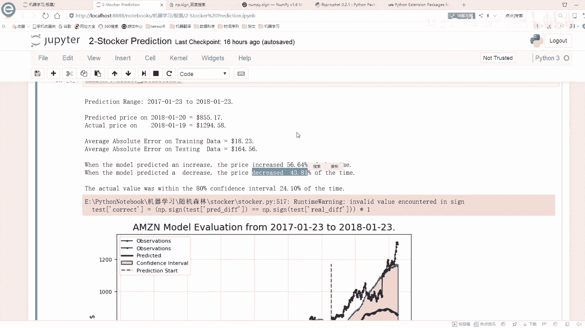

当前这个图啊，红色这条线啊就是说我从哪开始去预测到，从这个2017年1月份开始去预测到这条红色线表示这个意思。然后呢咱来看吧，这里有几条线啊，这条蓝这这深蓝色能能看清吧。

这深蓝色对于深蓝色的线是我实际的预测值。然后对于这个黑色的是它真实的一个走势。那这里咱们来看现在这个情况啊来说嗯是一个明显趋势什么？预测值和真实之间啊差的比较大吧，这差的太多了，其实差了好几百了。

那这里明显趋势是什么？你看咱这个模型走的稍微来说是看起来有些平缓是吧？但是上面的实际情况，它没那么平缓，那我们怎么样能够捕捉到这个信息啊，所以说接下来我们的目标就是。😊，现在这个模型不太好。

那我该怎么调参能让这个模型做的更好呢？它能抓到它这个上升的趋势啊，能把这些突变点，能把这些上升下降预测的更准确一些。这个呢就是我们一会儿啊要做的一件事儿，怎么把这个模型啊进行一个调整啊。

看一下改一下什么参数，能去优化一下这个东西。😊。

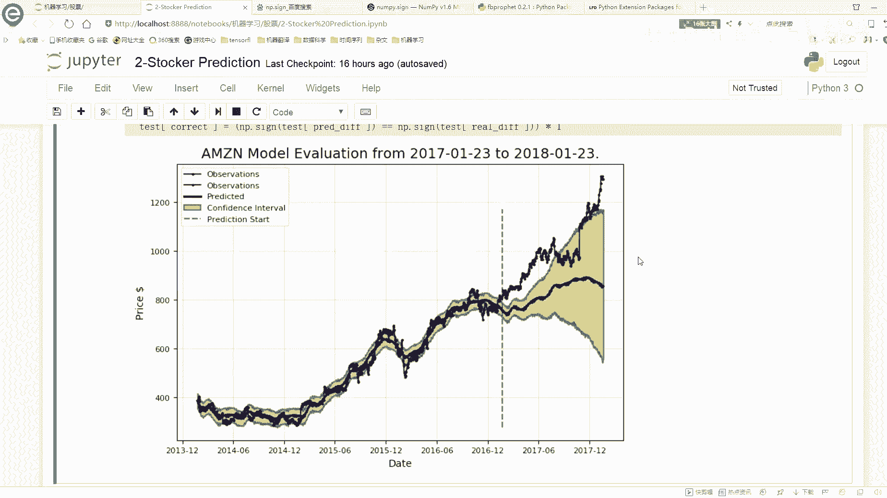

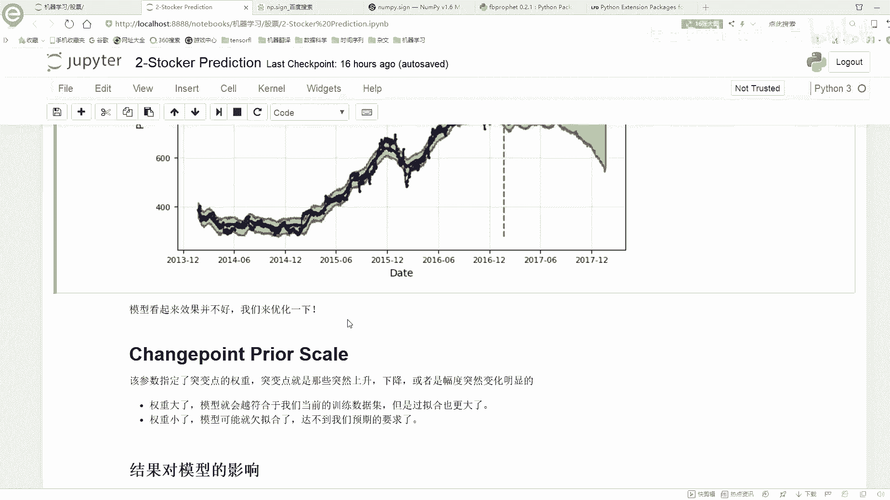