# 【比刷剧还爽！】Python量化交易+机器学习大数据全套教程，入门到精通 2024B站最好的量化交易课程！（数据挖掘分析／大数据／投资／金融／股票／算法） - P6：6.5-突变点调参 - AI课程搬运工 - BV1ps421T7ez

接下来啊咱们就来看一下哪些参数啊会对我结果产生一个影响。咱们先来说最主要的就是这个ch point point在这里我们可以来进行有一个指标来进行衡量它这个指标呢叫做一个值啊，它的意思大家解释一下。

就是说这个参数啊它指定了我突变点的一个权重。你这里写这个参数它说的是突变点的一个权重。那权重什么意思啊？那是不是说当你给一个突变点较大的权重，模型就会更重视它这个意思啊？

那所以说现在呢如果说我当我把权重甚至大了一些模型呢就会更符合于我当前的训练的一个数据吧。因你看啊就是模型当中我就这个图吧，模型当中这个突变点，我给它较大权重，咱们的模型就非常重突变点。

就去学这样的一个突变的一个趋势吧。那这个时候你可以想当你训练的时候去学了这些非常非常多的一个突变的一个事情，而且呢你给它赋予了较大权重，那明显发生一件事是什么？这个时候你在训练的时候，你的一个。😊。

盒风险太大了吧，因为咱们啊是完全按照训练集当中这些突变点去训练当前这个模型的。所以说呢还有这样一个问题，哎呀，权重大了，咱们现在是能够更符合于我的数据集。但是呢这个固体盒风险啊，它就更高了一些。

这是第一个问题。那你说权重小了呢，权重小了呀，模型可能就嵌顶盒了，它可能就是比较保守的。你看这个这个就是说嗯这里啊就是我用这个facebook它这个框架里边它是有个默认值啊，这个突变点，它的权重。

我看了一下这个代码默认的是设置成了0。05默认设置0。05还是比较小的一个值啊，就说明它这里哎对突变点没有那么敏感，没有那么敏感情况下，它当前咱们去。😊，做这个训练。

它就可能有一些突变信息啊没有把握的那么多。那接下来它这个模型的一个趋势还是比较平稳的一个趋势。你看我就是我这块做一些实验，我发现了，就是你这个突变点如果说设置的比较大，那它可能就是哎它跟你这个模型啊。

它吻合程度非常高。但是呢它这个过拟盒风险也很大。但是如果说你把这个突变点设置比较小，它这个过拟盒程度啊没有那么大，但是呢它这个模型始终比较保守啊，就是这个意思。😊，然后呢，为了给大家解释这个事儿啊。

咱就实际来看一下吧。这块呢我就是选了四组参数啊，咱来看一下这四组参数啊，对结果影响怎么样，就是咱们的这个陈point它的一个权重值。然后呢，有什么0。001、0。0050。10。2啊，这几个值。

然后把这样代码我得去给它拿过来。😊，为大家在这里啊，咱还是按照咱这个思路啊，还得去debug来看一遍。然后我看一下这个东西，这个东西就不要了。然后再看一下呃，这这这个东西还要，然后就就这几个来说吧。

debug一下。然后这块它debug，然后这块我不跟大家尬聊了，然后看一下咱这个图啊，这个图当中啊就是画出来这样一个趋势啊，就是你看这个黑色的还是我的一个真实点。然后呢分别有几种不同线条啊。

都画出来了咱的一个就是最终的一个预测值。因为在这里相当于我建立四个模型啊，每个模型它的结果都是不一样的。因为他们选择的参数是不一样的。有这个比较大的一个有比较大的一个就是权重点权重，也有比较小的权重啊。

咱们来先给大家说一下它的代码怎么做的。然后咱们来分析一下这个图。😊，首先呢这个都一样的，就是还是啊把我的一个宣练数据集给它拿到手。从这个15年到这个17年的嘛。然后这里就是我写复庸环。

对于每一种这个权重，每一种权重不同的时候，我们要干什么？我们在这里去设置一下当前我的一个权重量，等于我接下来复制这个指标。复制完之后呢，然后我再去cate一下这个model，c model的时候。

它就会帮我去用新的一个呃参数来进行一个复值。然后呢，在这里就是我呃make一下，就是我去指定一下，咱接下来预测180天的一个数据。😊，然后呢去预测一下吧，这样可能会稍微慢一些。哎呀，这块稍微等一下啊。

然后预测完之后预测完之后啊，在这里就是呃我去把当前的一个预测结果，然后往里去填充，然后一步一步的去填充。填充完之后呢，这是完成第一个，然后这个复习完咱就不看了。

它的第二个第三个第四个这个意思啊就是说在这里我们就一一个一个参数去建立模型，一个参数一个参数去得到我最终的一个结果，得到最终结果之后，然后你看什么在这块就是先是整体的把我要画的图啊都给它画出来。

先把这个就是真实的情况，称的一个结果把它画出来，就是我这个观测值嘛，这是一个真实的情况。然后呢我接下来不是画了4个模型嘛，复习完当中啊，有几个模型就画几个呗，这不就一样的嘛。

照样画我这个图照样画咱当前的这个区间。然后呢把这个结果显示出来，这块还在执行。最后呢我就把这个图返回去，这就完事了吧。所以说啊在这里没有什么太多的操作，只是说。😊，看我看一下这些就挑哪儿。

这块就算咱就不等它了，不等他这块去执行了，只给大家看这个结果吧。直接看下结果，这块说要运行完了，直接看一下这个结果。其实这点啊执行也一样的。下面你看就到了这个画图这块操作了嘛，复学当中你画几个图啊。

最终它就是不断去迭代完事就完了。你看一共四个图吧，然后收一下。😊，这个数还没显示出来，那咱在这看吧。在这看吧，就是这几个图嘛，咱们来对比一下，先看这个蓝色的，蓝色的是非常小的一个这个这个突变点权重。

你看啊非常小的一个突变权重。你看它整体的一个趋势啊，这个蓝色的整体一个趋势长什么样子，它这个整体趋势啊，是不是说它就是你看一些突变点，它根本就没有表现出来吧。而且这块明显它是下降了。

这块它预测确实上升的。所以说就是当你用一个小的突变点权重的时候啊，最大的一个问题就是在这里它没办法去捕捉到咱完整的一个训练集当中信息是长什么样子。你看这对于一个小的突变点权重，你看它是这个样子。

没有去捕捉到太多的信息，那最终预测的结果呢，你看它也是非常平稳的一个趋势吧，就像这一条线似的。所以说非常小的值啊，像我刚才说的，它是一个。😊，圈太小了，模型可能嵌顶盒就达不到咱们预期的一个要求了。

然后再稍微大点呢，看这个红色的红色的是不是你看这个拧合效果是不是咱就来拿拿这个顶盒效果来说，这个蓝色的感觉是非常差的吧。红色的你看这个红色的0。05，唉，默认值是0。05，稍微好一些吧。

你看红色稍微好一些。但是呢最终结果也是没有直线的往上升上去，然后呢再大一点，这个灰色的，还有这个黄色的，就看这个黄色的吧，比较大的。😊，比较大的情况，你看这个黄色了，它明显的一个趋势啊。

就是跟其他线条相比啊，它就是你看这这个点来说，红色的它上升到最高点了吗？没有吧，黄色的上升到最高点了，就是它在捕捉你训练集的时候，它会捕捉的更强烈一些，尤其是它会更好的去发现你这些突变点在什么位置。

那这里呢你看它可以把咱们的整个的训练集当中啊，所有点基本上都能捕捉到。然后呢按照这个趋势，它接下来去预测，你看红色的预测的更高一些。因为它发现了当前这块突变的这样一个趋势，它会预测的更高一些。

这个呢就是咱们当前给大家说了一下我的一个chanpoint啊，它这个参数啊，对结果的一个影响。其实这个参数啊对结果影响是非常大的。在这里我们也主要调节的就是这个参数。😊。

最明显你就看这个蓝色和这个黄色吧，太明显了吧。这个蓝色的不咋地，这个黄色的拟合的非常好，但是呢它可能会有些过拟合的问题。在这里啊我就看了啊，默认参数给大家说了，它是0。05。

它是在这些之间的蓝色的线和黄色的线啊，它们都是一个呃比较比较特别的啊，一个是铅拟盒，一个是可能有一些过拟盒这样的一条线。😊，然后呢我们来进行一个评估吧。

来进行个评估的时这块这个这个就不不跳往里边跳给大家看了，这个一样的，其实这里就算了这样一个事啊，就是这个CPS啊就是 points个 points就代表CPS它分别有2几个值吧。

我看它的 error它的个 error东西咱们的一个就是一个之间一个差异值这个咱们先不管啊，咱们就看这个 error error就行了。其实主要关心的就是t error。

为 error对我来说可能没那么重要。因为我要预测的是一个时间序列嘛，时间序列的可能就是那么重要。但是我关心的一是est明显的一个趋势什么。😊，t error明显要比这个t要小很多吧。

这也是时间序列问题啊，本身就难解决的一件事儿。因为你要预测的是用字回归模型啊，预测咱之后的一个时间点这个东西啊，我就就是从我就是一一听我就觉得这个东西可能不太靠谱。

所以说咱这个t error相对来说都是偏高一些的，这个都是蛮蛮正常的，比t error高一高一些的话。😊，来看吧，随着我这个CPS值增加增大，那这个 error肯定出现一种趋势什么？CPS值越大。

100%的这个 error值会越来越小。因为CPS代表着你的一个过敏就是越大就是权重负越多咱能更好的去拟合这个训练数据吧。

这是咱家呈现出来这种情况然后这个t error这t error看这里呢它也渐降低的吧。那这里你说对于这几个参数来说，你选择哪个比较合适啊，我肯定选2的为什么因为0。

2的对应的一个t error它是等于127。60的这个t error值啊它是比较低的。所以说呢在这里我们是选择咱们t error最低的那个参数的，它相当于啊就帮我进行了一个评估这样一个操作。你看。😊。

在这里画了一个图，tri error这出 error下降多明显是吧？然后呢，这个t error它也是在进行一个下降的吧。然后这块它可能还进行有一个稍微点的一个上升啊，这个趋势都蛮正常的。

咱只需要找最终的一个t error值最低的那个就可以了，拿最低的当成是一个当前的指标。😊，那现在我看的一个趋势好像是它没准就是当我把这个呃CPS值啊，就chprint值再增大的时候，它没准还能下降是吧？

那一会儿我们再来看一下，我们再增大点，它还能不能再下降一些。😊，在这块呢，咱们来试一下更大的，咱们来看一下，就是更大的一些CP值。你看我从0。20。25开始啊，0。250。4，然后一直干了0。8。

这些值都比较大。再来看一下它的一个结果啊。然后这里咱们来画一下这个图啊，然后还是进行预测啊，这个道理都是一样的。这里咱们就不给大家多说了。然后CP值对应着一个tra error。

你看都是比较低的traer还在下降。然后呢这个t error。😊，从这个114一直下降到了67是吧，最低可能66，可能到这儿呢去于一个差不多的一个位置了。在这里咱们就来看吧。

我的一个t error最低是中间这个是00点是等于多少是0。7，这个吧，最低是0。7这个吧。也就是说现在呢当我调参的时候发现了。我选择这样一些值啊都会达到不同的效果。但是呢达到这个0。7的时候。

当前效果应该是最好的。现在咱那个指标值是等于66，也就是说达到一个历史最低点吧。这样啊我们就把最终的一个呃参数结果选出来了，我们选什么呢？就选这个0。7就可以了吧。

这个就跟大家说了一下咱们的这幻这个参数该怎么调，以及呢它会对我的结果产生着一个什么样影响的。😊，然后呢，我们再来评估一下模型吧。在评估模型的时候啊，就是还是这一天啊，就是你看当我选择一个新的参数的时候。

原来咱们的一个预测值1263，真实值呢1294，这个东西啊差的怎么样？差的就是没有那么多了吧。所以说啊这个就是说当我们用一个新的参数的时候啊，我们去测试的时候，哎，咱们效果是比之前能够强一些的。

达到了这样一个结果。😊，然后呢，填些之后啊可以画这样一个图，画这一个图之后呢，这个是我们从头开始去预测啊，咱当前的一个结果值是等于多少的。然后这块我们有啊这块我们是用一个U。

从这个U23到这个18年的1个U23得到了这样最终的一个结果值。然后呢P完模型之后啊，咱们主要是调这个生串子。然后接下来再大家看一个好玩的一个事儿吧。这个呢就是在这里啊。

我们就是给大家准备了这样一个函数，这个函数啊就是说我们可以去玩一个小的游戏。那这个模型呢就给大家先强调这里。然后就是如果说大家对模型当中啊，有哪些知识。哎。

我们就是可以说就是哎这里啊只给大家概述了一下这个模型我们基本上的一个使用的方法，以及呢我们这样的一个案例啊，咱们是怎么去做的预测最终的一个结果值。如果大家还是想把这个东西做的更深。

想去深入了解其中的每一个细节。那最好的方法在哪里呢？最好的方法就在它的一个官网当中，最开始的时候给大家给出来它的一个ge那个。😊，kitabub的一个链接吧，那里面呢它有详细的介绍，给你讲每一个参数。

每个功能是什么样。其实这些东西哪来的？这些东西啊也都是从那个它的官网当中啊去介绍来的。这个模型你说让我自己从到尾到尾去用，我哪会用这个东西啊，我也不知道它是什么。我也都是在这个官网当中啊一步一步去看的。

所以说大家啊在使用的时候，最好呢结合它的官网一步一步看，他就告诉你每个指标什么意思。😊，告诉你完什么意思之后啊，那你说你怎么能知道他这个东西说的是不是这么意思啊，他实际表达什么样啊。

我们自己动手实验的试一试不就知道了吗？最好实际动手参考它的文档，我们自己实际动手去做一些小例子，小demo，然后就能掌握这个库啊，咱们该怎么去用的。😊。

然后这块就是 want to play a game啊，这里就是我是比较愿意看那什么，我是比较愿意看那个那个那个什么那个叫什么那个那个哎呀电剧惊魂啊，就想了半天没想起这个名，惊魂是吧，总爱说这句话。

电视魂8我还没来得及去看，之前那个第一部到第七部啊，我之前有一段时间啊，就是实在是没事干，一天看一部，今天看一明天看二，后天看三一步一步看看了一7部之后，然后然后过下个月又没啥看了，再头到底看一遍吧。

我就觉着自己看这东西啊，感觉蛮爽的。我也不知道我这个心里是不是有病啊。然后再来看这么个事啊，就是说如果说我现在要预测呃一个我买股票能不能挣到钱。😊，这个时候怎么办呢？这个时候咱们来试一下吧。

如果我们预测是一个涨，那我就当咱们这么玩，就是说如果说我预测涨，那我就赚到这天差价。如果说我预测错了，那我就赔了。我预测涨，我就是相当于预测，我就是去挣这个钱，预测错，我预测赔，我就是没赚这个钱。

就是这个意思。我们是一天一天的去赚这个差价的这个也不给大家在代码当中实际去看了，这相当于是一个小玩具啊。😊，就到这里，我们就指定了从这个17年哎。

不不不从这个啊对从这个17年1月23到这个18年1月23，我们在这里预测了一下，我有57。92%预测的是涨预测对了，47。69%预测低，预测对了。这里就是我们的一个差异还是接近于50%是吧？

所以说股票这个东西啊，到底它是可不可以预测的这个东西啊，我看好多研究金融人啊都在研究这个东西，能不能构建一个自动化的一个交易模型，然后帮你挣这个钱，我觉得是不太可能的这个东西啊一旦要做出来了。

我觉得这个市场啊没准它就已经是要倒闭了，这个东西而且这个东西你估计你也预测不了太准，基本上还是有一些瓶颈，有些局限的。😊。

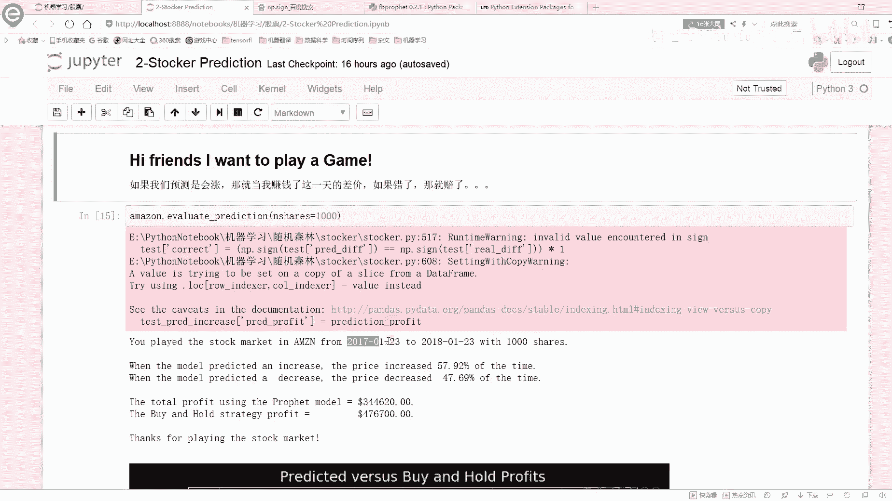

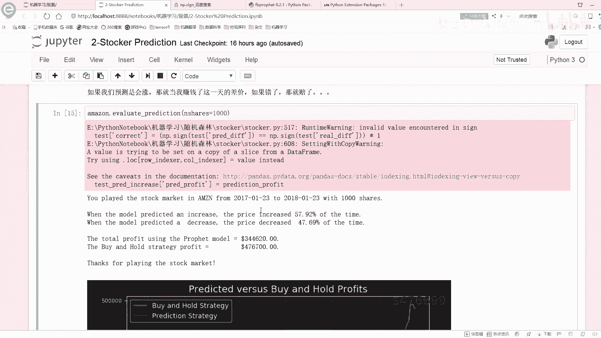

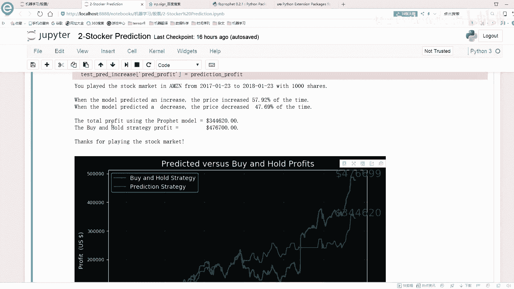

然后这里咱们来看吧，比如说在这里我可以按照我的一个缩对货率ban后的就是我买然后卖买卖，然后预测涨我就买预测跌，我就我我就我就给他卖了，就是不留了。今天这样呢我可以得到一个利润啊。

就是在这一年当中能赚多少钱给大家总共的去看了一下当前的这样的一个结果。所以呢咱们就可以把这个预测的情况和真实情况，给他给他画出来是吧？给他画出来之后啊，就可以来去预测我实际的一个指标啊是涨什么样子了。

😊。

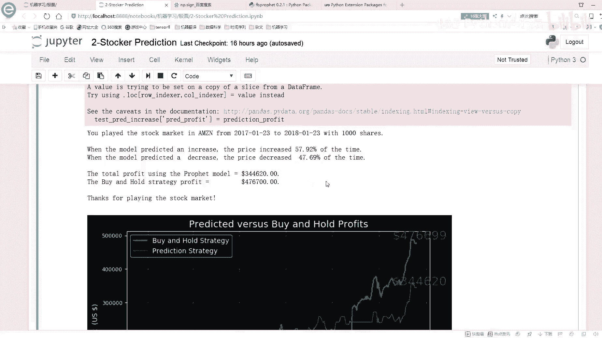

第绿色呢是我的一个预测的一个趋势。黄蓝色呢是我的一个版啊，就是买，然后并且保留下来的这样的一个方法。这样呢我都可以赚样钱。两种方案啊，就是大家可以在代码当中啊。

拿这个或者偏差自动手看一遍这个东西啊是怎么去做的。最终呢我就得到了一个结果的一个值这块简单给大家说吧，这没什么太多技术这些东西啊，这块就是我们呢也能挣钱。在这个17年到18年你去买能挣钱。

那换时间点呢08年到09年呢，你要买它就是个赔钱的一个趋势了。这个就给大家说了一下，咱们的一个还有这样一个小工具啊，我们可以预测一下，按照时间点来说，可以这是指买多少份股票啊。

它是能挣钱还是能赔钱这样一个意思。😊。

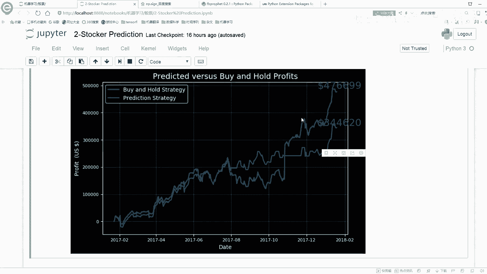

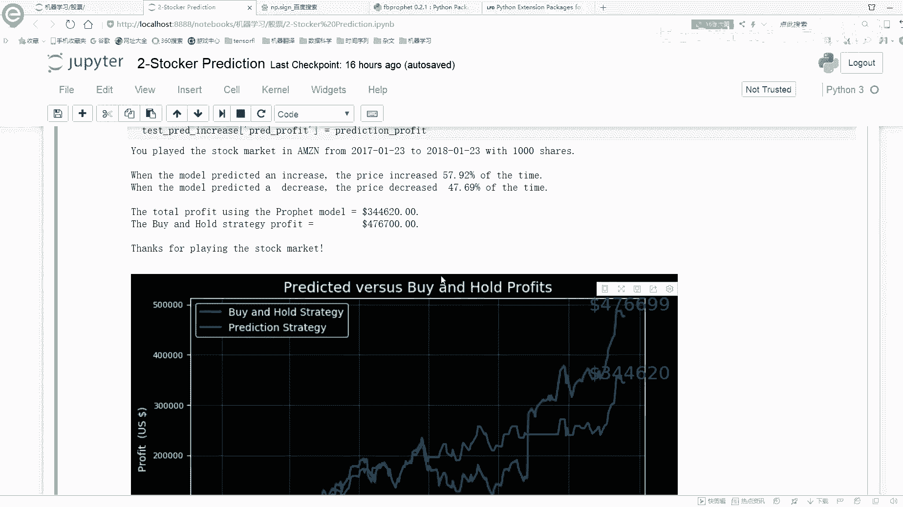

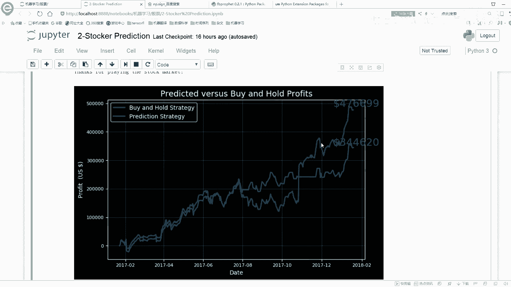

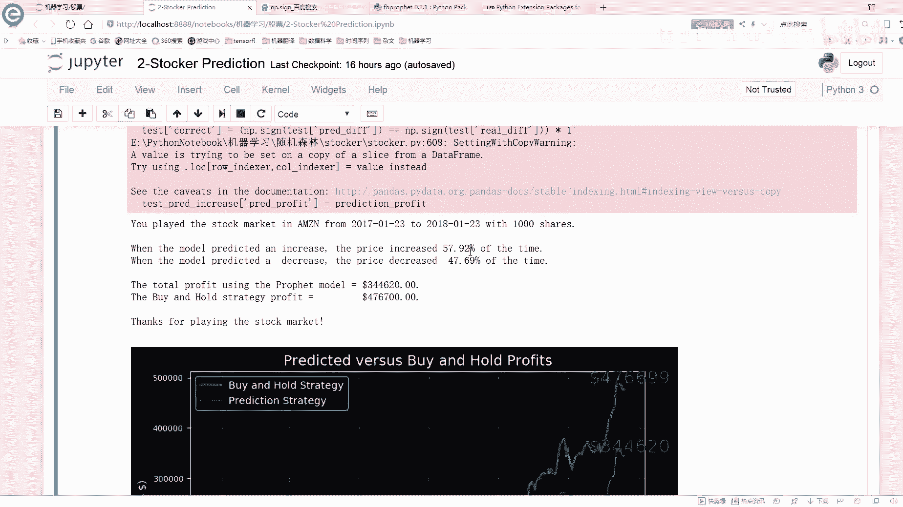

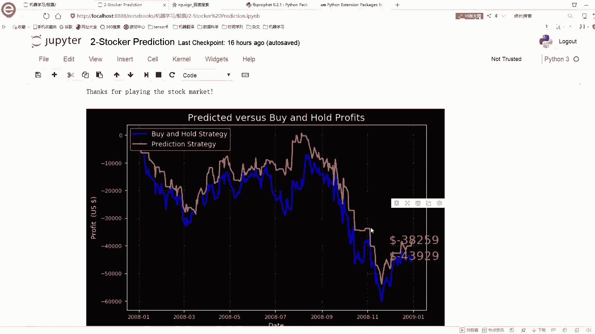

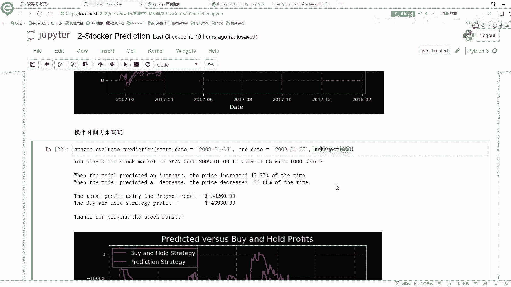

然后呢，预测未来10天的一个价格，这也很简单啊，你把这个dase指定下去，它就会帮你预测出来接下来的一个10天的一个价格嘛。你看这块它又帮你预测出来了一个10天的价格。

然后是它又它有一个 hat一个lower height的一个就是一个uper，还有这样一个lower，就是两个时间点嘛，以及 height实际的一个指标值。😊。

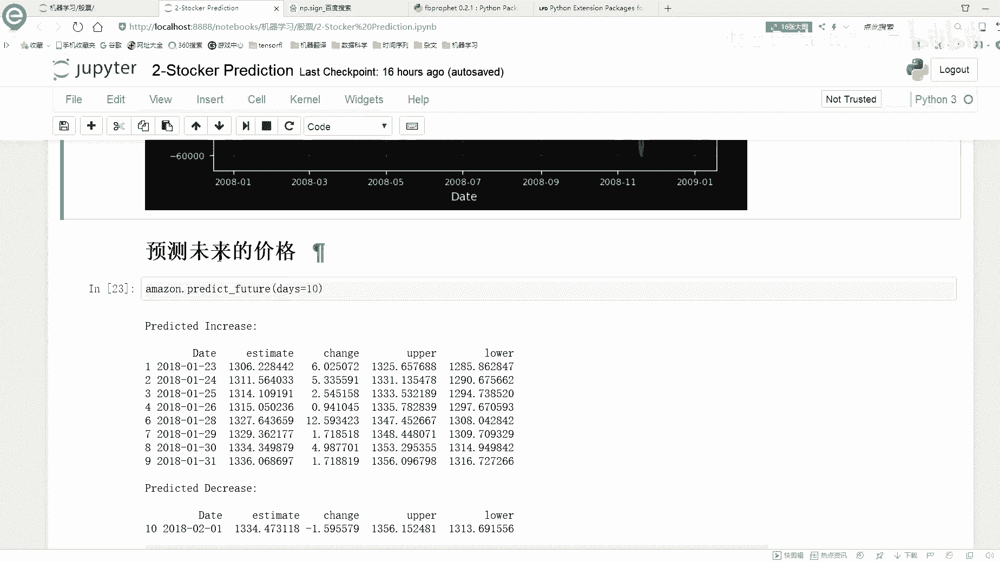

这些啊就是我们预测的一个结果，预测未来的一个价格。然后下面呢我们还可以预测的更多一些啊，预测更多一些。我们可以你看这预测多少，一直到这个20预测3个月，预测3个月，你可以把这个东西都画出来吗？

都画出来之后啊，其实随着时间的一个推移。越来你肯定这个模型是越来越不确定咱当前这个值到底是取多少了。这个呢就跟大家说了一下，咱们当前啊就是。😊。

这个啊facebook它的这个模型它是怎么样帮我从头到尾啊去完成这样一个时间序列的一个预测。在这里呢我们是拿一个股票数据集啊来给大家进行个分析的。如果说大家呢有其他数据集。

其他数据集可能来说我还没没找到一些数据集啊，反正这里用股票数据集，我觉着还是蛮好的。因为它时间也不用处理了，数值也有了，而且比较方便就能获取到，这个里就是我们可以直接用一个股票数据。来反而这样一个事儿。

如果说你有其他数据题呢，照相啊你都可以来试一下。因为我当前这个框架能不能帮我把这个时间序列啊预测的还不错。然后给大家又简单说了一下它的一个参数啊该怎么调，这是point子，主要是这个属性。

它会对我结果产生一个什么样影响。那关于啊这个股票分析啊，还有预测的这个工作啊，就给大家先说到这里了。😊。

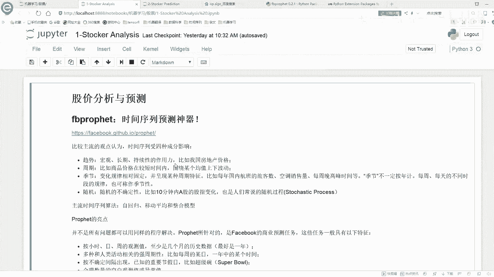