# 【比刷剧还爽！】Python量化交易+机器学习大数据全套教程，入门到精通 2024B站最好的量化交易课程！（数据挖掘分析／大数据／投资／金融／股票／算法） - P8：8.2-时间序列重采样操作 - AI课程搬运工 - BV1ps421T7ez

接下来啊咱们再来看这个重采样，还有时间窗口操作。重采样，咱们之前说过了，就是正常数据啊，它是按照以天为单位的，或者是以其他为单位的。现在呢我们想把这个单位啊做一个调整。比如说之前你是按天统计的。

等是先我换一个吧，我说我换照以这个呃以周为统计的，以年为统计的，以月为统计的，是不是可以啊，直接啊对咱们这个data做什么对一个reem操作resemble完之后啊，咱们就相当于哎得到了这个重采的结果。

重采样的过程当中啊，你需要给我指定啊最少一个参数，就是你告诉我以什么为单位是吧？那好了，以周为单位，以周为单位，两周为单位是不都行啊，以周为单位的时候啊，那你说显示的时候，你是显示个均值呢？

还是第一个值还是周位数呢还是什么指标呢？自己来指定什么指标都行，指定指标之后啊，然后来指定一个head，然后咱看一下结果。

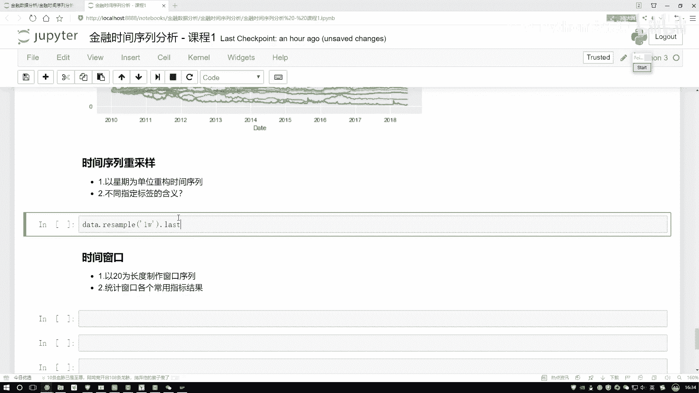

你看这里哎呀，你看这块啊，它是直接1月10号了，咱看一下为什么是1月10号，因为原始数据当中，哎，这一块前面都没有吧。所以说啊我做了一个总采样，相当于一周一周是这样一个窗口。

我看看12呃哎大大大概是这样一个窗口吧。把这个窗口做完之后，咱得到了当前的一个结果啊，这是我们现在做了一个以周为重采样之后得到的一份结果。那其实啊就是不光啊就是一周7天7天往上涨。

那其实我们不光能以周的那还可以什么？

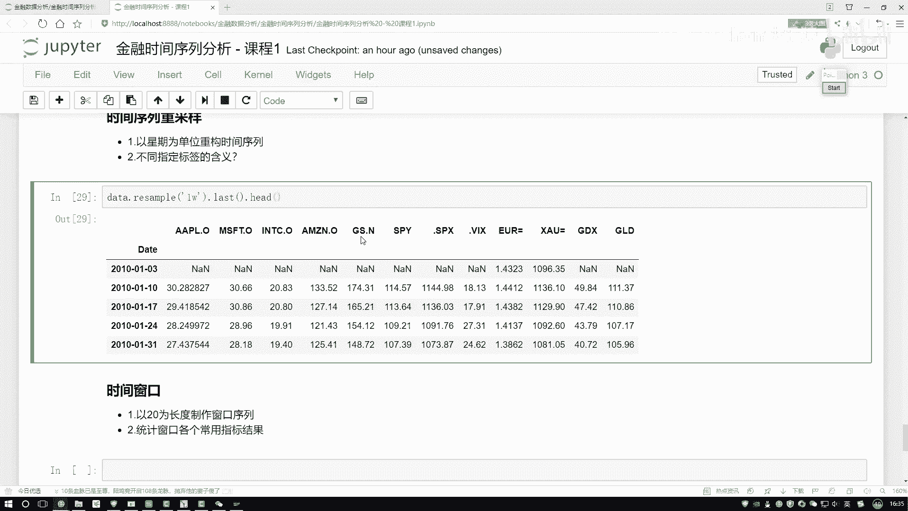

再换一下吧。比如说哎我现在不以这个周，然后我以这个月吧，一个月行吧，是不是也能得到一个结果啊？但是这里啊大家是要注意一点啊，你看这块我第二点也说了，咱可以用什么不同的一个标签，什么叫不同的一个标签呢？

给大家来看一看，就拿第二事来说吧，这里我们还可以再加进了一个参数，呃，比如说这里我这块写的是呃这么一个月是吧？然后呢，我在这个label当中。

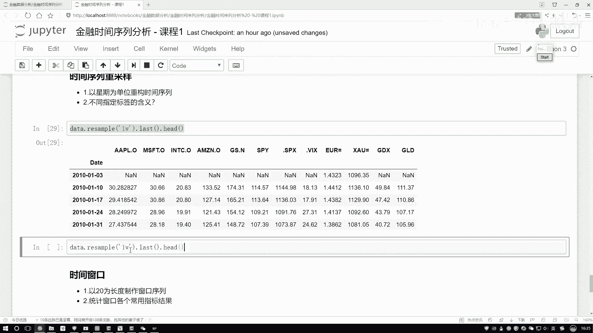

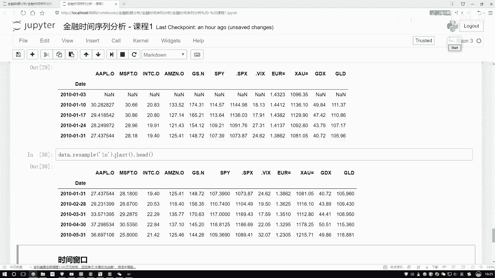

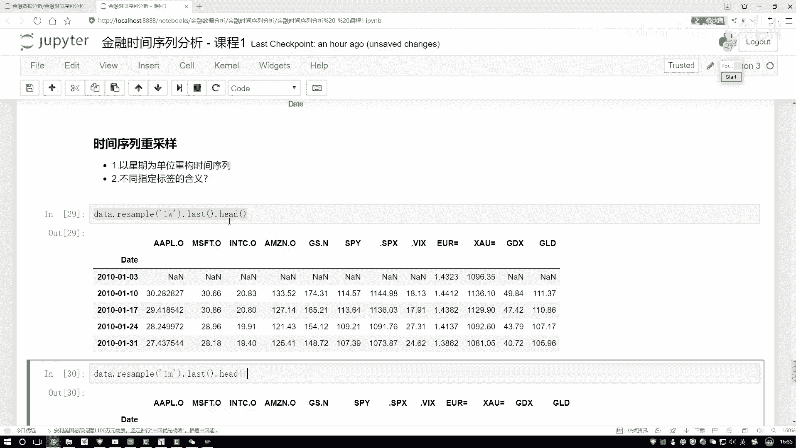

laable里边我说给它加这些变换吧，加什么？你可以把这个标签放到一个左边，或者说我给它放到一个右边。什么叫这个左边，还有这个右边，咱们来看一下这个la当中，你看啊，就是如果说我指定成一个left吧。

刚默认是一个right，咱指定个left，咱来看一看。

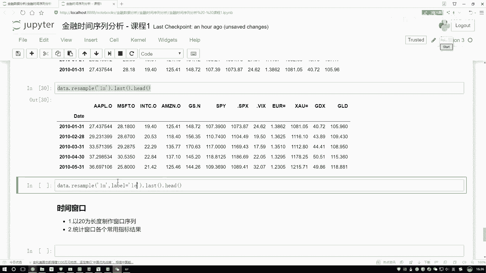

你看这个结果什么？哎，原来第一个数据啊，是这个1月31号，但是现在这个数据是12月31号，哎，看起来数值不是那个统计，怎么多统计一个月啊，这里是1月31号啊，但是你看数值，你看这里1月31号这个数值。

和这里这个12月31号这个数值，哎，大家对比一下，你说是不是一模一样啊，是不是一模一样的东西啊，那他们之间什么意思呢？他说这样一件事，就是。😊，现在啊你虽然说这是一个月数据，统计完之后。

你要以哪一天为命名吧，left就是第一天right就是最后一天啊，用哪一天来当做当前这个数据，它的一个命名或者当做它的一个索引名字吧，或者将做一个日期名字。这里就根据你不同任务来去选了。

那比如说现在你觉着用前面的合适，那你就只自己指定一个left，你觉得right合适，你就指定那个right是不是可以了，不要忘记啊，这块还有一个指标叫做啊一个不同的标签，一般就是left和right。

你自己选看一看什么值合适。我估计大部分情况下还都是一个right的吧。因为就是你看啊你当你指定成一个以左边的时候，那数据当中都没有31号，你还出现一个31号，这是不太靠谱的这样一个意思啊。

那下面这个值呢下面这个值1月31号，它其实描述是什么，描述是从它开始2月份的一个情况吧。所以说啊你最好指定成一个就是right形式是符合呀。😊。

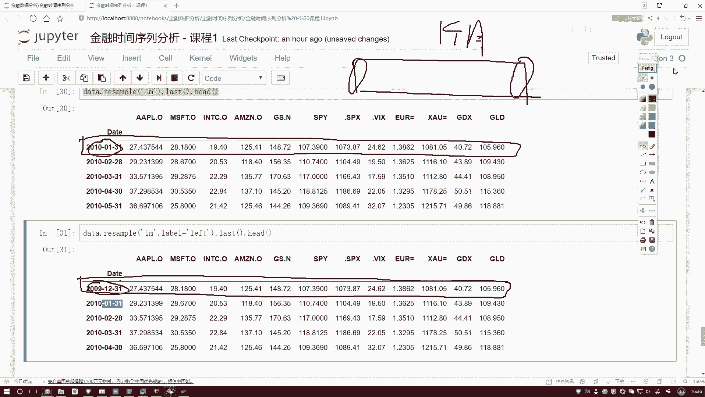

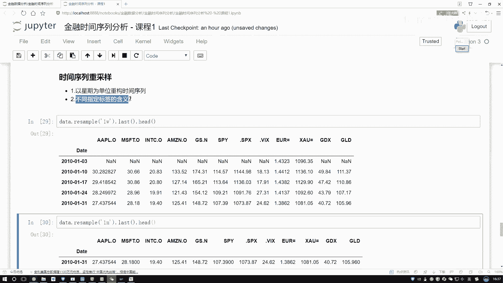

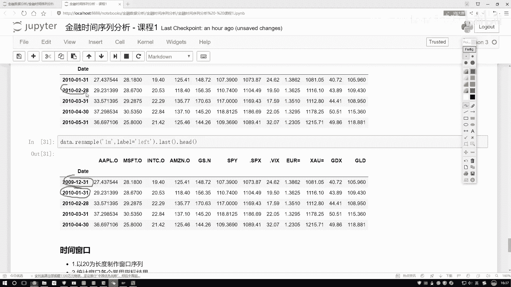

我们观察的一个逻辑啊，当然可能不同任务啊，大家做法的需求可能不太一样。这个就是一个时间序列的中材样啊，也是比较简单的。直接啊咱就可以把这个数据啊按照你想要结果啊做很多中材料的方法。

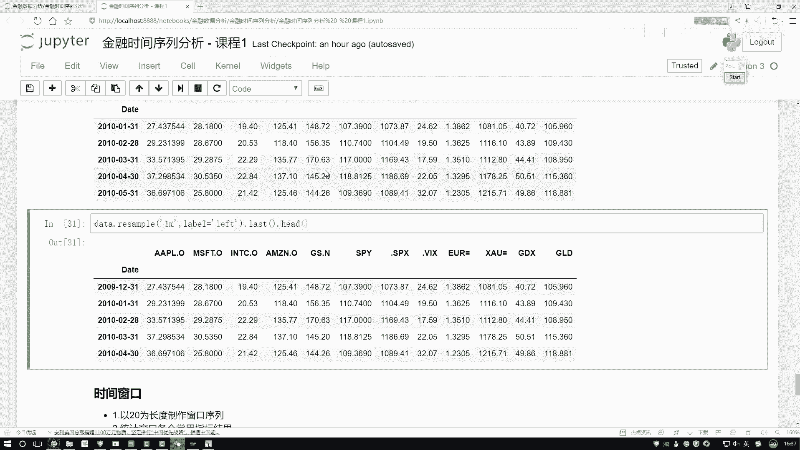

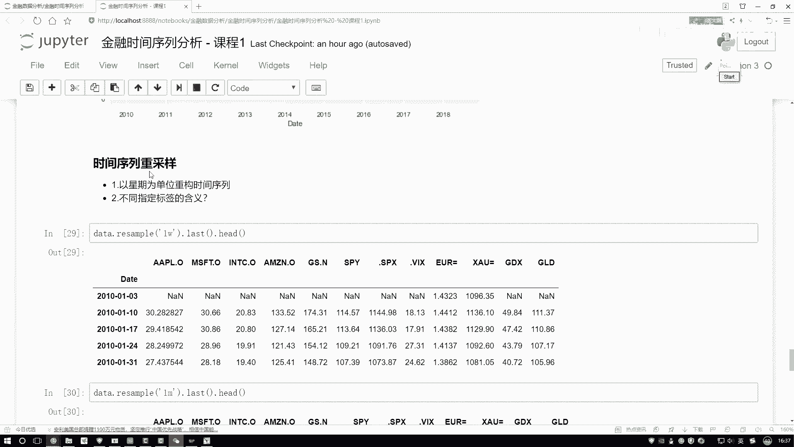

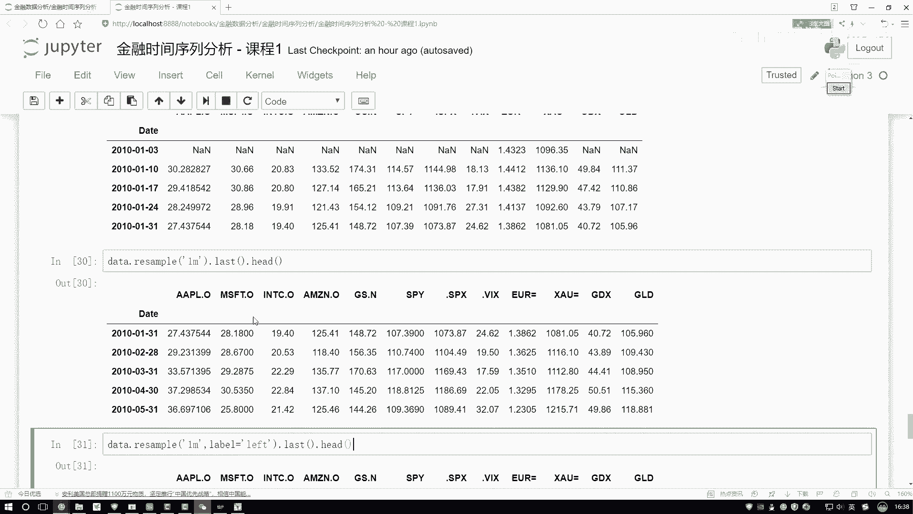

好接来。接来就是我现在呃不光要做这个重采样，啊，不是不是做这个重采样，我要做一个窗口。什么要一个窗口呢？我是这样，现在啊我说我这是有一批数据，行吧。好了，在我这批数据当中啊这样。

我说现在我这个数据当中啊呃我要做很多个序列出来，那这个数据列可能不是不不是一天，那什么意思呢？这里方有100天数据行吧？好了，我说我去截我说我截第一个窗口是这样，我说我截了这个10天可能画有点大了。

我说这是10天数据，行吧，截完这10天之后呢，我说下我再截10天，我说这个是一个一号数据啊，是这10天的，然后呢，我说我再截个2号数据，二号数据它可能是从第二天到第11天的，可以吧？然后呢。

我说我再截个三号数据，三号数据呢可能是这个不光到这个11天到这个三第三天到这个第12天可以吧？我可以啊10天时间去截每一个10天呢，往后像是滑动窗口似的，移了一个单位可以吧？这个东西啊。

你叫做滑动窗口或者叫时间窗口都行啊，我们要做这样一件事儿。😊，行了，咋做呀？这个东西给大家看一下吧，咱们现在怎么样去做这件事儿。呃，首先第一步还是。😊，把我们的数据拿过来，然后呢。

你可以指定啊这样的一个window，就是我们的一个窗口。比如说咱的一个窗口是等于10的，可以吧。然后呢，接下来对我的数据啊执行这样一个操作吧。窗口是10data当中所有数据，那数据当中选一列吧。

就选这一列得了。

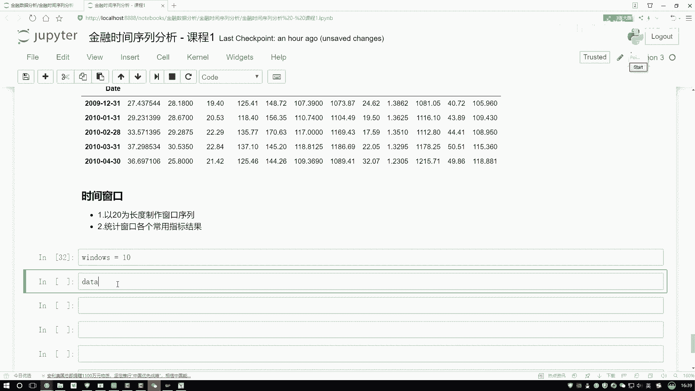

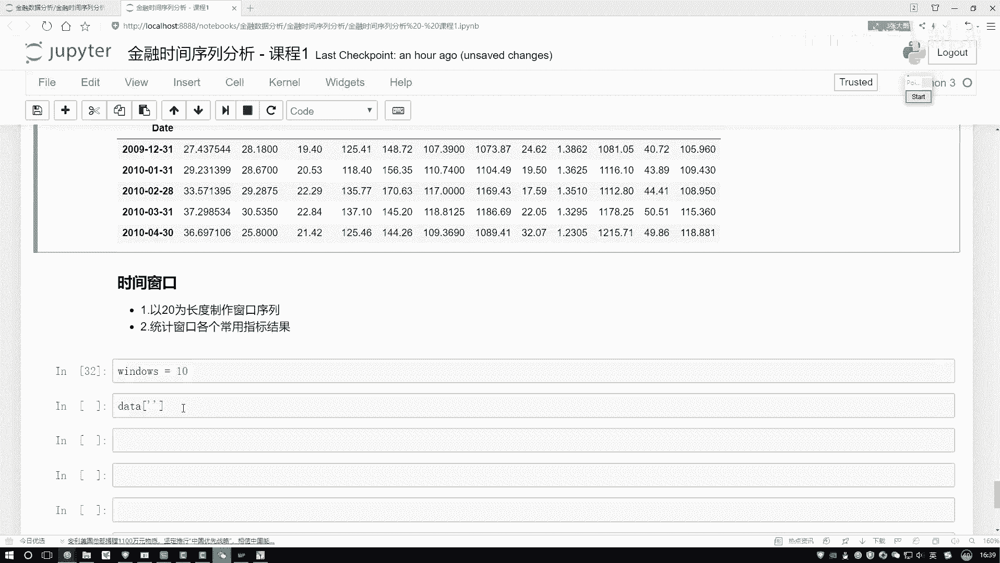

数据当中咱选择某一列指标，然后呢对这个鼠标怎么样？我做一个roing操作，就该说的，哎，你要做好多个窗口做滑动了。然后呢，这里边有有个参数啊。

就是一个windowwindow当中啊你自己指定它的window等于多少，这块我自己指定了，就等于我这个window得了。这个window等于我window可以吧。然后呢统计完之后你看统计完之后啊。

它现在啊这个结果展示的不是特别舒服。因为现在它是好多个序列，咱可能展示的不是特别好看。这样吧，我给这个序列，我算每个序列当中它的一个最小值，可以吧，相当于我第一个窗口最小值，第二个窗口最小值。

第三个窗口当中最小值可以吧，这就能展示出来了，做一下啊，前几个前几个都是NN值啊，因为这里边它是我们得有有10个才能做当前这样的一个展示吧。好了，这里边就是我当前画出来的一份结果，这个结果不太好。

这个结果比较闹心。因为数据当中啊，但凡一个窗口当中。

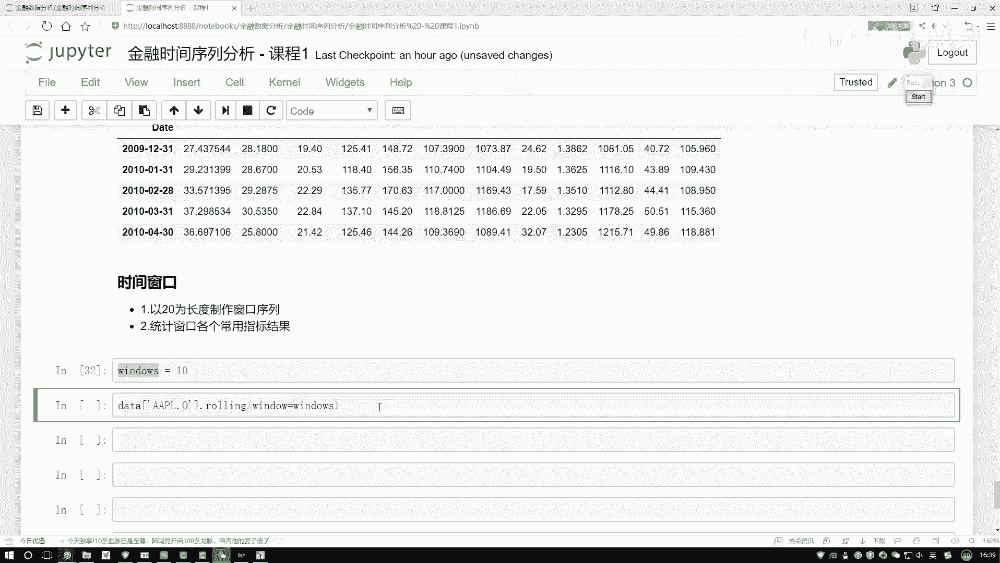

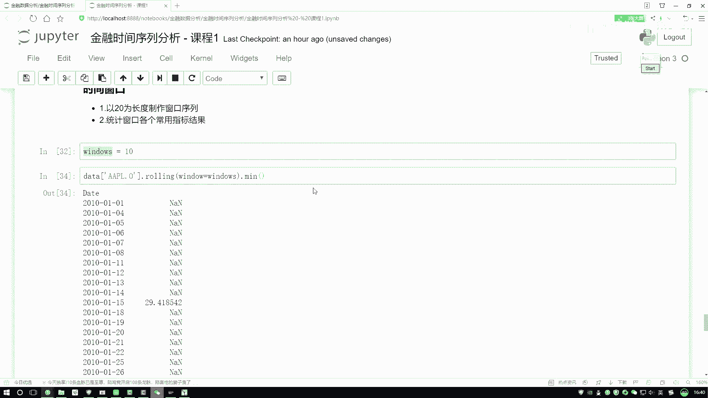

存在这个AN值呃，这这些很多东西都展示不出来。这样咱先得先对我数据做预处理吧。这块大家到时候做着做出下一步吧，得先对我数据做预处理，你得先把这个缺失值哎给它剔除掉，要不然不行。

在这里第一在第一把这个data重新的构建一下。我说我的data等于我当前的d frame当中啊去jo一下啊，jo1个NA就是我去做一个确实值吧。然后我写个data2吧。data2等于data点召回A。

然后呢，我把这个东西都拿做data2来去做。行了啊，这回咱就有了。你看这回咱下面的都不是空值了吧。因为上面啊上面就是空值正常的，因为窗口还没透那个长度，是不是？然后下面你看之前咱算有AN值。

现在怎么样就都没有了吧，这样我就得到了，哎，这是一某这都第几个有的部署了，这是第多少窗口，然后它的一个最小值，第多少窗口，它的一个最小值，咱是不是能把所有结果全部的给它算出来啊啊。

这块咱把这个结果得到手了。那如果说呢你想对好多个窗口啊都执行这样一些统计的操作，该怎么办呢？

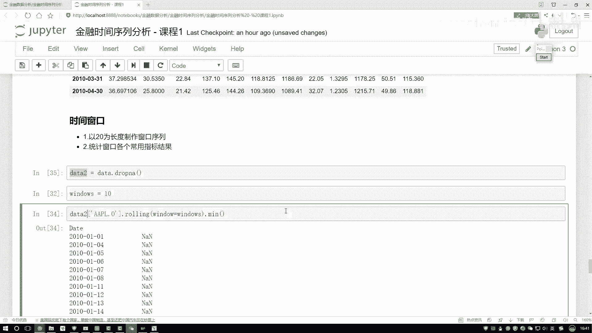

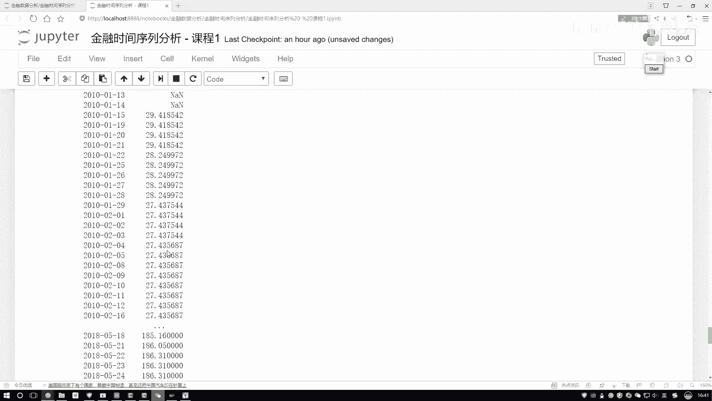

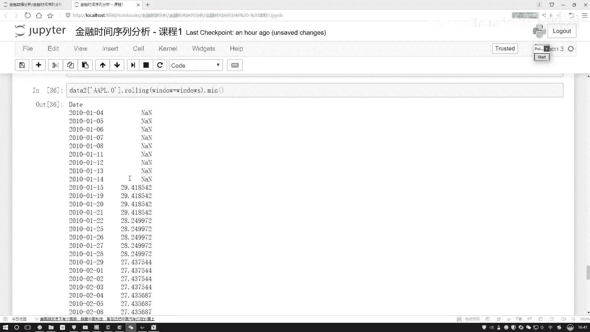

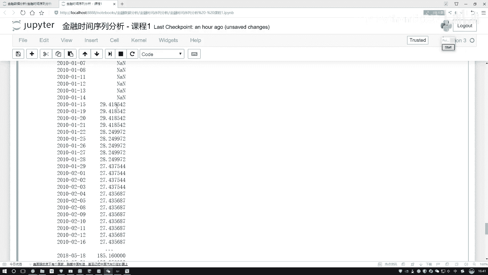

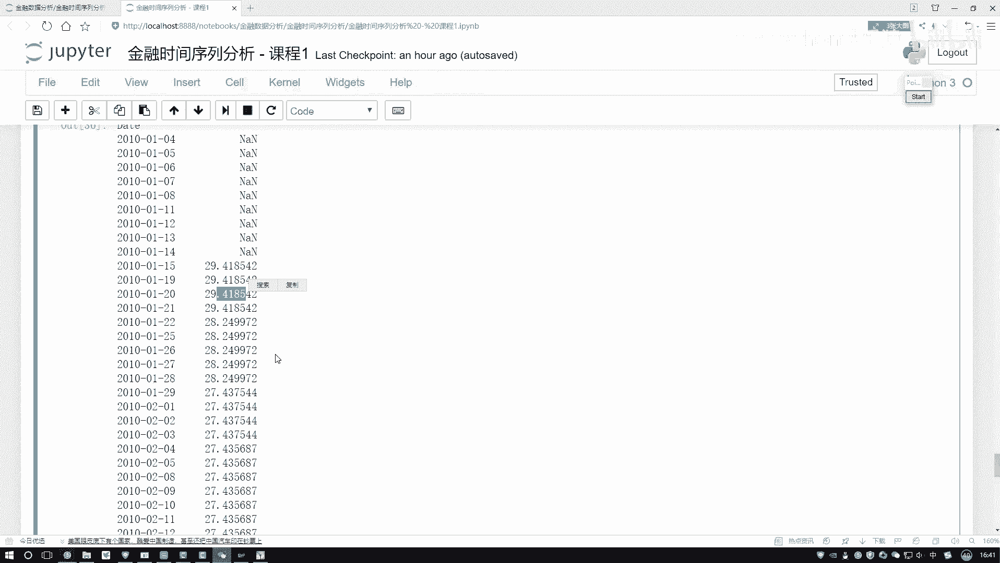

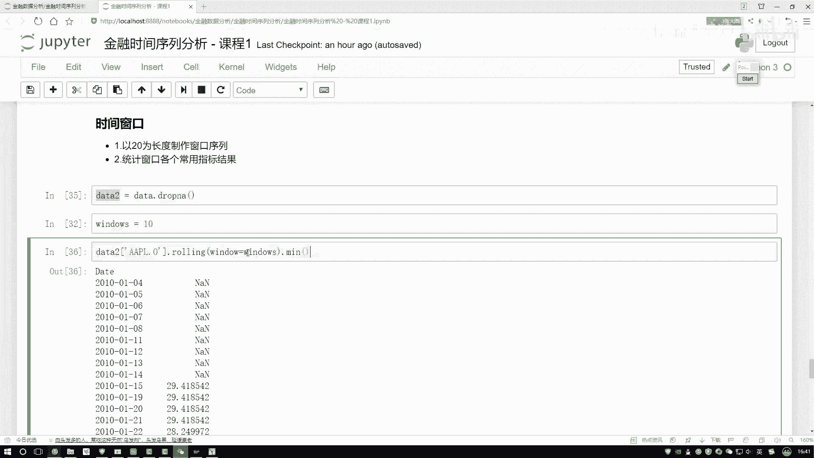

咱可以把这个序列啊都可以加一加。呃，我来这块写一写。我说现在啊这个呃重新的我构建一个data吧。我说这个data当中我加上一些列呃，data2当中我加上一些列。

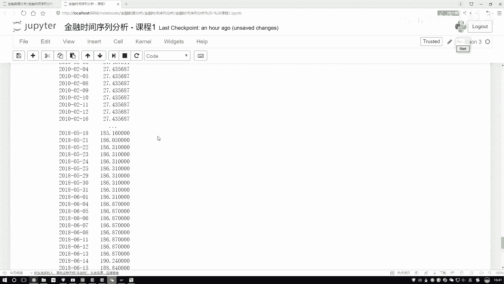

加上一些什么列呢？我说这块它是一个最小值是吧？好了，我指定一个，这是一个最小值，然后等于它的一个最小值。然后呢可以再讲啊，这块不光有最小值，我也可以统计它的一个最大值，然后这就是一个最大值。

然后再写几个吧，再写一个均值和1个ST得了。😊。

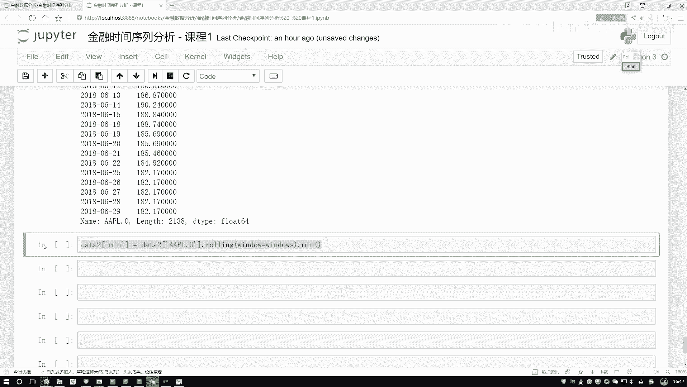

命值，然后这块1个STD这块也是点密一下，然后这里是点STD下就行了。然后指定完之后，我把这个呃数据还是给大家打印来看一下，点h一下。

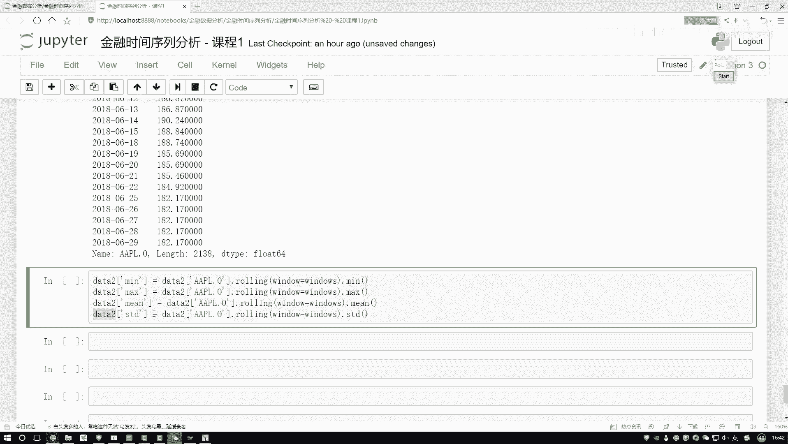

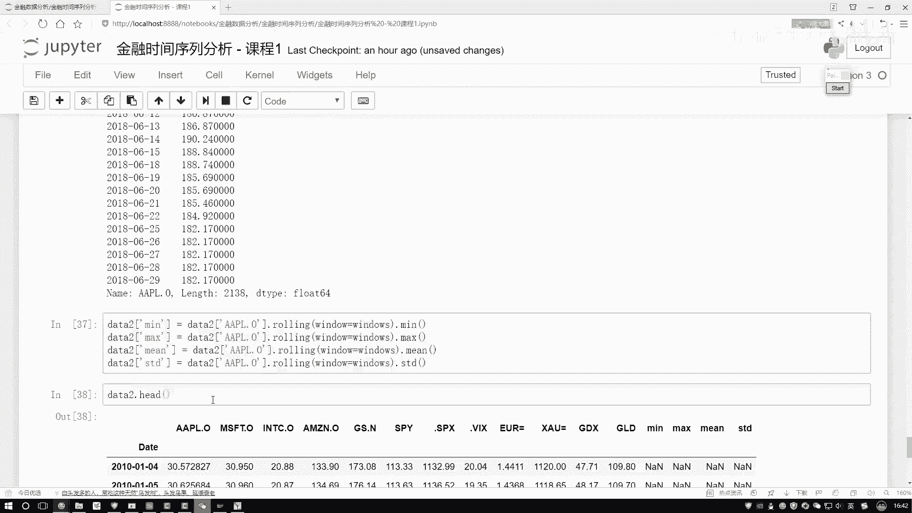

行了，看后面几个指标吧，这块怎么样，是不是哎呦这个点不行。嗯这么的吧，你点t一下吧，点t当中是不是这个结果咱就给它算出来了啊，这块就是咱当前的一份结果，不光我们把这个呃前面节指标写出来了，还有什么？

基于当前这个窗口当中最小值的最大值，还有它就是符合它的个序列，符合它这个窗口当中所有的一些统计值，咱是不是全部给它画出来了。基于窗口来去画的，相当于呃是以这样一个范围来去统计当前的我的一些结果啊。

这就是我们的一个时间窗口或者是时间序列啊，怎么去做，以及呢我们可以对这个时间序列啊执行的一些操作，不要忘记一点啊，就是你对这些窗口在做操作的时候啊，先做一个预处理，你得把这些。😊。

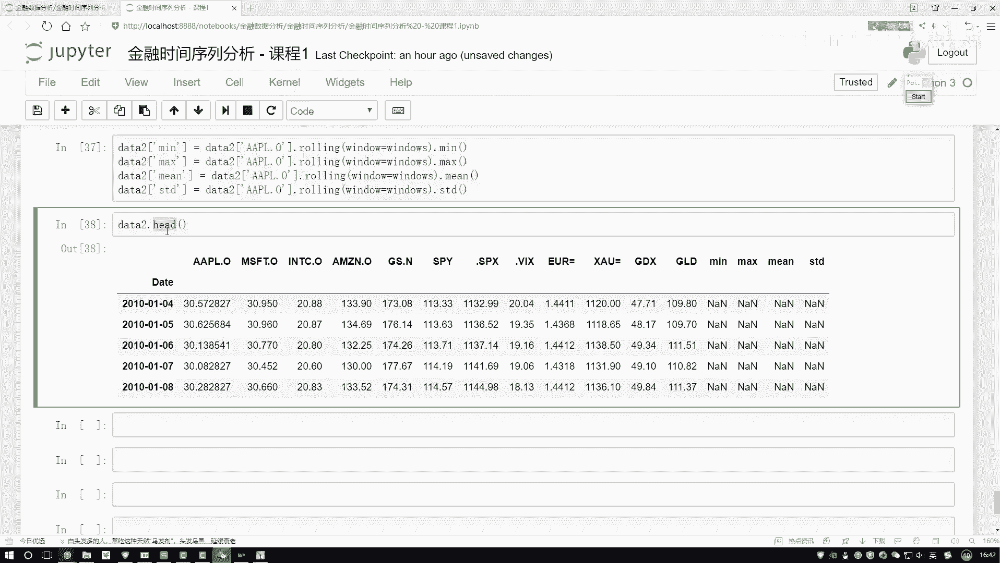

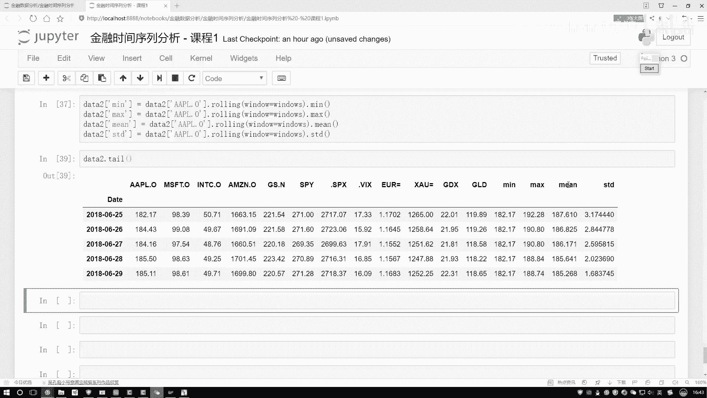

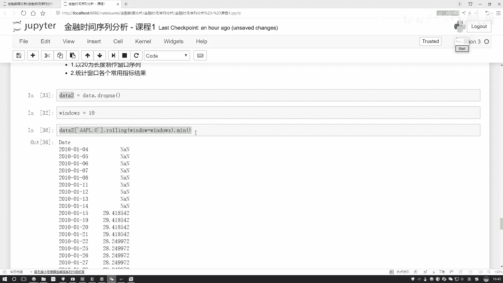

确失值给去掉。因为刚才给大家演示的时候，我刚刚就忘了，如果你没去掉这个确失值，它这块怎么样会出现好多AN吧。所以说第一步啊，咱得先把这个数据做好预处理，这可能是很多数据分析任务当中。

我们第一步吧啊先做我们的一个预处理的操作。

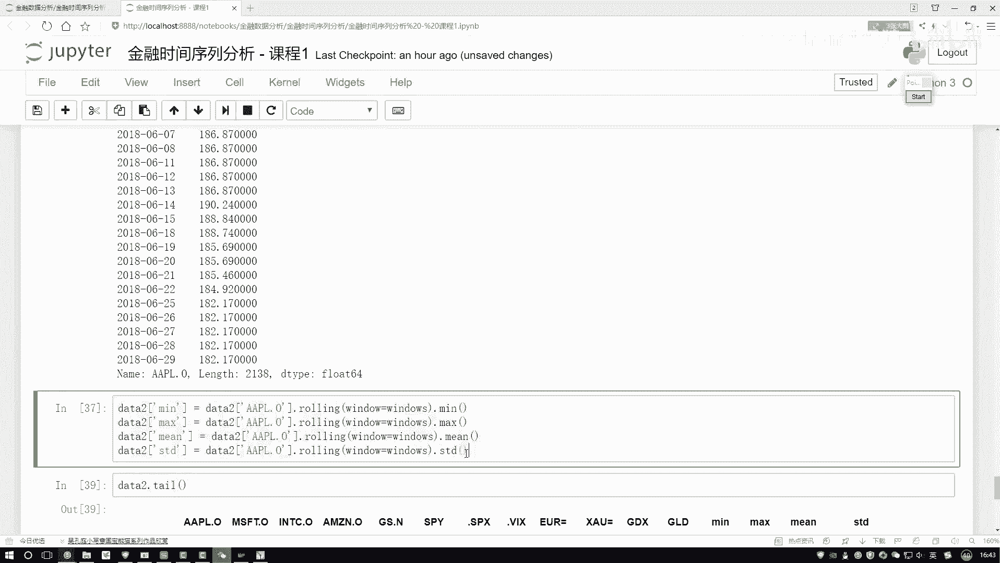

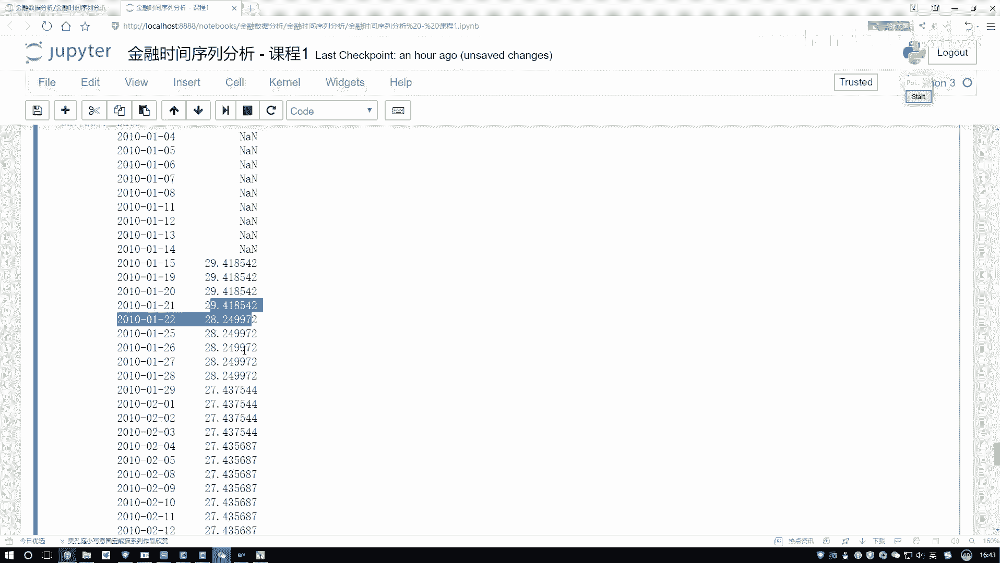

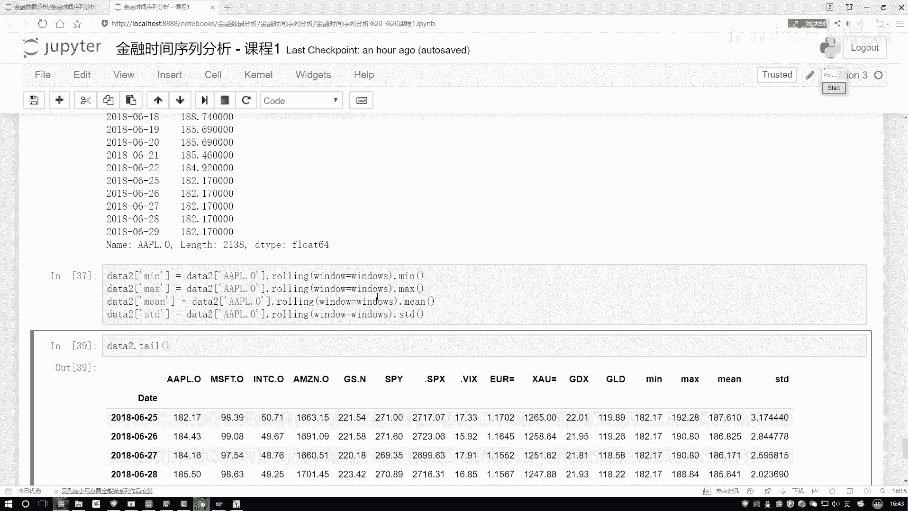