# 【比刷剧还爽！】这太完整了！AI量化交易实战课程，全程干货无废话 入门到精通一步到位！（数据挖掘分析／大数据／可视化／投资／金融／机器学习／算法） - P16：第一十六章： 量化交易前沿 - 机器学习教程 - BV1Km421G7nH

Hello，同学们，我们稍微等一下，07：30的时候，准时开始，OK唉同学们大家晚上好，然后今天我们呃要讲的主题是啊，基于随机最优控制的一个套利交易，然后现在在我给大家打开的是，工商银行跟建设银行的。

两个股票的这样一个走势图，那么然后呃上面的这个K线图部分，是日级别的一个价差的图，然后大家显然是可以看到的时候，就是说两个作为两个两个，首先股票都是属于是国有的银行股票。

他们的走势具有非常大的这样一个相似度，但是呃在呃就是在整个过程当中，其实还是发现他们价差会有偏离的，这样一个情况，那么套利交易要做的事情，就是说我们是试图能够去找到，然后并且去寻找到。

首先是两个或者是多个相关的品种，然后是在做的事情，是能够判断出当前的价差，处于一个什么样的合理范围之内，那么当价差突破这样的合理范围之内，我们可以去我们可以进行切个两者，就是说两者的价差偏离均值的时候。

那我们会认为他们的价差长期是会回归均值，那这个时候就可以进行额，就可以就可以进行一个所谓的套利交易，但事实上就是说从20年到22020年以来，半年多的时间，还是能够发现有多次交易机会的对呃整个的图。

尤其是就是在股票的价格大幅波动的时候，那么在这种情况下的时候，我们还是能够看到就是有比较明显的教育机会，那么套利交易其实就是要去呃，相相对于说我们趋势的单边交易，其实就要去尝试去解决呃。

去解决就是说我们如何是发现呃，如何是发现品种之间的相关性，然后发现它相关性的变化，然后呃对，以及说如何判断当前品种的价差，是处于什么样的范围，那么嗯这嗯那么今天我们要讲的讲呃。

要讲的主题是说是利用随机随机最优控制出来。

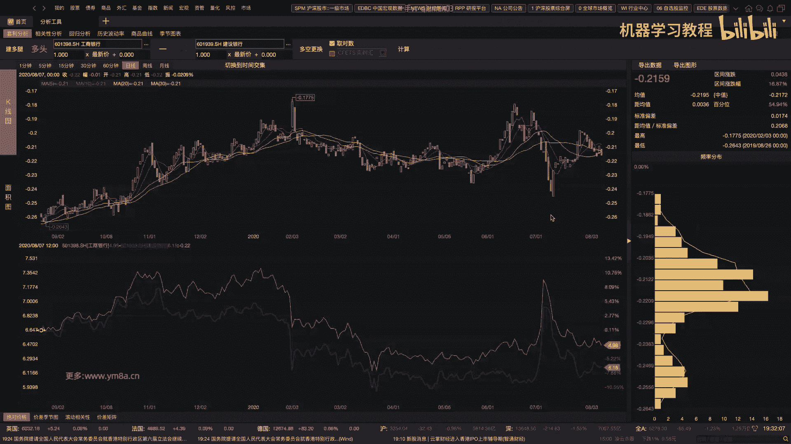

解决这样的一个问题，那么就是说随机最优控制的话嗯，为什么是说要引入一个随机的sycastic control，Approach，就说这个事其实是想跟大家去聊一聊，我我觉得这个是比较有意思的一个问题。

或者说他其实涉及到，就是说关于我们对于市场的最重要的一个认知，就是说市场是不是随机性的，对对就是说因为就是曾经是就是有效市场。

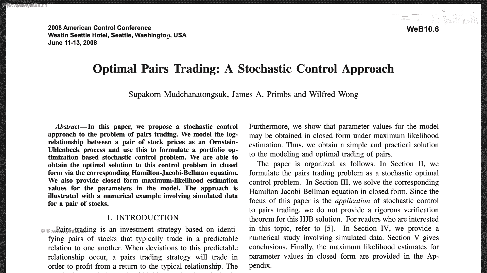

有效市场理论的话就说认为是说市场是很市场，就是说股票呃，总是按照它公允的价值去进行交易哦，然后就是说，如果股票按照它的公允价值去交易的话，投资者是无法获得超额的回报，那嗯有效市场假说。

他就是说认为我们市场的这样一个价格，是反映了嗯所有的可用信息，那么但是事实上呢说嗯，嗯随着就是说行为金融学的引入吧，后来我们会有就是说是适应性的市场假设，就AMH，那么我们会认为就是说呃。

这这这个里面最基本的假设是，如果是一个成功的投资者，那么他们就会说持续的去运用，他们现有的一个投资策略，然后呃直到直到这样的投资策略是失效，或者说是被市场淘汰，对就是说在这个里面的时候。

我们会认为说投资者既不是，既不是说是完全理性，也不是说是非理性，就是说他们的行为，其实也是在随着市场是不断的进行演变，那在这种情况下，那在这种情况下的时候，我们就要考虑，就是说他也就是说有这样的一个呃。

那可能我们就会有以下的一些推论了，那么首先就是说嗯，我我们试图说之前交易的时候，是说我们能够找到稳定的风险跟回报比，但事实上就是说市场不是完全有效，那就可能说是风险跟回报之间这个关系，它不是稳定的。

那么呃不是稳定的，那接下来我们就自然而然就可以，推导出我们的交易策略，如果说我们是找到了一个一定的交一定的模式，想要去进行交易，那么这样的模式随着时间的变化，他也有可能会去，他也有可能会去。

也有可能就是说是失效，那么所以说就也就是说我们在整个这样一个呃，就是说适应性的市场价，市场假说告诉我们，我们唯一能做的事情，就是说是要在市场当中要去生存下去，根据市场去不断的去适应和创新。

然后最基本的这样一个推论，就是说没有任何策略会一直有效，不要说是说是呃双均线策略会一直有效，OK呃我觉得这个事情是不存在，有人说是也就是说是双均线打天下，那么我觉得这个事情说可能七。

上个世纪七八十年代还可以，但是现在的话嗯即使是双均线，可能也要考虑说是加入不同的参数，以及在什么样的情形下应用什么样的均线对吧，可能已经已经不是说是简单的。

就是说simple movie average，OK然后嗯就是有嗯，既然这既然说是市场，不是说是完全假，不是完全有效的话，那么我们就要就要就要去考虑说，我们怎么才能可能说是暂时。

暂时性的说去击败这样一个市场，对，然后呃对，然后刚刚给大家，还有这边还有这样一个就是NST。

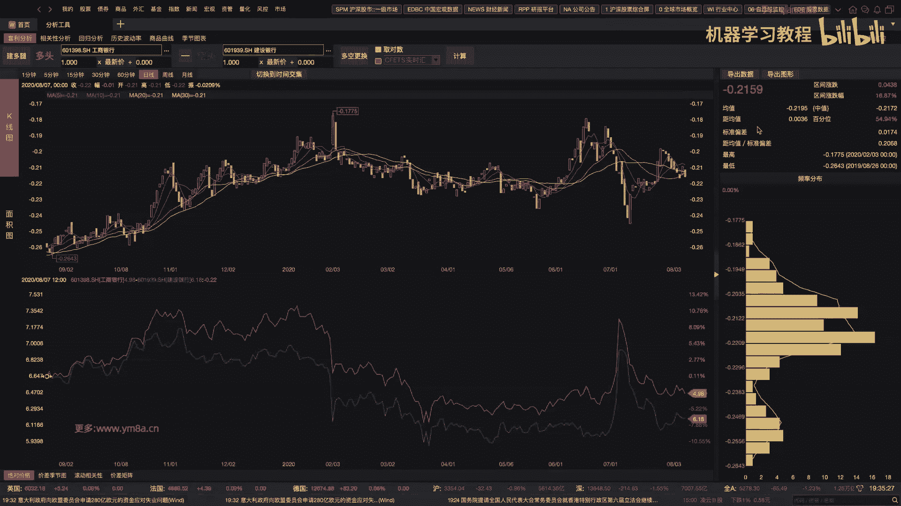

就是national institute of standards and technology，这个里面，这个paper里面是讲了一个很很有意思的，一个通用的工具。

就说其实其实就是说我们在考虑问题之前，是我们首先是要思考，就是说市场是不是真的是随机的，所以说大家可以简单的去测试一下，就是说嗯我不用均线，我可能就是简单的随机的去多空，那么我可能很有可能就是说呃。

我跑出来一条曲线就能打败我们的基准，比如说是沪深300的这样一个净值，很有可能是比很多的基金经理还要去好，或者说让猴子随意的去买卖，去交易，对，那这样，这样就是说是，就是说这这个里面是有一个什么问题。

就是说我们想要去随机的做出一个回测，然后模拟一条超过指数的这样一个净值曲线，其实相对来说是没有那么难度的，因为你只要去过拟合，或者是我随机性的去跑测试，那么总归会有一两条。

一两条曲线能够超过我们的benchmark，那这个里面就带来一个问题，就是说大家要去思考，就说我们把我们的benchmark作为指，我们把指数作为我们的我们的benchmark，是不是合理。

就是说我们的目标是打败沪深300，那么就是说我们在选股的时候，把沪深300作为一个指数作为一个基准，是不是合理，那很有可能就是说呃，既然发现是说我在随机的优化的时候，都有可能去超过沪深300。

那也有可能说是沪深300，这个这个benchmark其实不是那么合理的，那么更合理的，我认为一种方式是说是什么呢，我们是用随机模型作为基准测试，比如说我们是随机的去很呃，对我们是随机的。

就是说是拿一个模型去交易，然后把这个结果，然后我们把这个结果作为一个benchmark，那么这个很有可能是比指数的，就是啊指数的这指数作为基准是更为合理的，因为还有一个就是还有一个问题。

就是说嗯大家其实可以测试一下呃，在指数，因为指数沪深300的指数它是怎么编制呢，它是依靠市值来去加权，那么肯定也就是说前面几个大的股票，就会占据比较大的这样一个数值，比如十个股票可能占了25%。

但事实上我们有300只股票对，那么很有可能就是说OK嗯，那么这样，那就是说嗯我们在测试的时候，就是做benchmark的时候，可以说是比如说不用说是按照市值权重，我考虑说是等权重。

或者甚至说我随机的这样一个权重，那都可以去测试啊，这个里面是也是有一个有一个paper，是大家可以去阅读一下，是在呃我可以给大家找一下，这个paper里面，应该是呃，下载量。

应该是到目前在SSRN上排的是比较高的，Ua quantitative，Acquantitative，Approach to tactical，这个里面就是说他会对他这个里面会有。

就是说嗯它里面其实思路比较简单，我可以就是说如果转换到沪深300当中，说时候我们可能会怎么做呢，比如说我们把当天的收盘价跟我们的沪深呃，跟我们的200日均线均线进行比较对。

然后那这个里面就是说很简单的说，我这个时候我我的仓位怎么选呢，我我们之前有提到过，我们有用OLMAR的方式去选选仓位，那么这个里面很简单，我就去跑一个等权重的仓位，然后他的那那我是。

那它的结果都有可能就是打败我们的，沪深300的这样一个指数，这个paper我建议大家可以去抽空去读一下，那么那么就是说嗯之前我们有提到过，就是说就是说要去判断啊，就是说呃首先就是说我们像先要做一个。

就是刚刚这个paper里面，这篇paper里面讲的就是一个是随机性的检验，它其实里面检验了有很多很多的方式，就是说呃他有应该刚开始有frequency，frequency检验，就是说判断我的啊。

就是判断我的嗯，我的这样一个序列里面，是不是说比如说一一和零这种东西，是不是说是完全唉还完全类似的，然后接下来还有各种，还有接下来还有各种各样的这样一些检验，那么这个这个这个具体的内容。

我不会在这节课去介绍，我建议大家是可以课后去看一下，因为呃当然要注意的一个问题，就是说我们怎么把我们的这样一个市场去，就是因为我们得到的是一个价格序列，我们要把是价格序列去转化成嗯转嗯，转化成这样一个。

它可以去呃离散的这样一个呃bit，就是零和一这样一个bit，然后去进行测试，它是不是是不是一个随机的变量呃，OK那其实简单的来说，就是说呃有一个有一个比较简单的办法。

就是说呃嗯就是说我们当我们的和回报回报，第二天的，就是说不管你，你可能是日日级别或者是分钟级别，那其实很简单，就是说我们第二个周期相比于第一个周期，如果我们回报大于零的话。

我们把就是说这个这一这一段标成一，然后小于零的话标成零，然后如果是0。0的话，那你就把它标成零呃，呃就是把标成零一，就是说我正好是不亏不赚，就是零一，那么那么就是通过这样的方式。

我可以把我的一个时间序列，转化成一和零的这样一个信号，那在这个时候我们可以去，就是它可以去按照这边以下的方法去，可以去测试啊，它是不是符合呃，呃他是不是符合，就是这一系列的这样一个随机化呃。

它是不是符合一系列的随机变量对，那这个里面还是我觉得，还是内容还是比较多的对，所以额这个之后大家可以去看一下对，然后的话对嗯，那这个里面就是说嗯就是说呃，我我觉得就是做这样的一个测试。

是比较重要的一个问题，就是说嗯可能就是说很多技术分析的嗯，也就是说在技术分析的这样一个眼呃，人我们的人眼里，我们会认为，就是说我抛硬币跟市场的这样一个价格，走势之间是没有区别。

就是说他都是他都是随随机的对，但是但是这个这个意思就是说在统，但是我们就说如果我们是从统计检验的角度下，就是说是不是要认为抛硬币跟市场的价格，这样走势之间没有区别呢，呃但是呃这个这个问题就是说。

我我我是留给大家去测试一下，就是说呃如果说是真的说是随机的市场，市场的价格真的是随机的话，那么按理来说的话，我们是完全可以通过这篇paper里面提到的，14个一个随机性的测试。

但是大家可以自行去对比一下，就是说我我拿一个真的是苏do random number generator，生成的一个随机的序列，跟我们用市场价格，按照我们之前所提到的一个方法，去生成的随机序列。

大家可以去对比一下，两者是不是真的都能通过，或者是不能通过这样的随机性的检测，但事实上我可以告诉大家说啊，我生成的随机数序列当然可以，但是市场的价格序列是通不过以上所提到的。

这么多的随机性随机性的检测的，就是说呃，所以所以就是说，为什么我们不能单纯的用技术分析的角度来看，就是说技术分析的人可能认为说OK，我抛硬币产生的价格序列跟真实的市场价格，觉得两个都是一样的。

但事实上如果我们通过以上严格的检测，去可以去来去研究的话，大家应该可以应该可以发现的是，真实的市场价格，它并不是一个完全随机的序列，所以这个这这个时候这是一个我觉得是比较方。

AMENTAL比较重要的一个问题，是值得大家去思考的，对啊，具体的代码的话，我相信Python应该也有相应的就是开源包，或者你任用任何一个语语言N去写起来，应该都不是很麻烦。

每一个测试大概也就是几行的这样一个程度，对OK嗯，就是说呃首首先是要帮助大家，就是建立一个一个认知，就是说市场并不是完全并不是随机的，或或许说我们的市场价格序列，可以通过以上一些测试。

但是它应该不可能通过完全的这样一个测试，所以所以就是说市场不是一个不是一个随机的，那么那么就是说在现代的时候，现代交易的时候，大家会用机器学习的方法去自动去学习，市场相关的这样一个数据。

然后去探寻它的分布规律，对对但是就是说还想还是想强调一下，就是说机器学习，可能就是模型会存在的一些问题对，首先就是说大家都知道，就是说如果我想找到一个呃找到机器学习，就是说会有一个问题啊。

就是说啊我如果我们是一个静态的假设，然后我参数是固定的话，那这个模型迟早会是失败，所以说我们可能会有一系列方法，比如说呃就是滚动的训练，这，这这这是在一定程度上去缓解了这样一个问题。

对然后另外一个就是说还是大家比较关心的，可能就是说深度学习，是不是可以从深度学习里面去打了，用到金融投资领域，尤其大家知道最近那个GBT3这个模型对，大概是是多少，1700亿参数，如果我没记错的话。

对对，但是但是这个里面就是很多paper里面会，就说用深度学习来研究呃，来研究量化交易的时候，可能注意的一个问题就是他忽略了一个问题，就是数据是一个实变的，因为他不是一个就是ID的这样一个，时间序列对。

所以说金融数据跟我们的之前的深度，更深度学习的图像数据，或者说是其他的方式呃，或者自然语言的数据，那可能是挺不呃，就是不太一样的，那就是说，对可能大家就是说在去研究的时候，都会注意说我的是我的数据。

是不是说在分布上是有偏差的，是不也是对，但是但是大家可能都会忘记一点，就是说我这个分布，即使说我把这个分布的偏差给处理了，但是他这个分布本身也是随着时间会去变化的，对然后另外一点就是说是样本量的问题。

嗯就单呃即即使说是tick级别的数据，但是呃相对于我们想想要训练出的，一个模型来说，整体的金融数据是相对来说是一个比较低，信噪比，那么那么这个时候就说我的数据集，相对我的想要出想要预测的结果。

相对来说是比较小的，然后另外一个典型的例子就是说金融危机，因为总共历史上也没有发生过多次金融危机，那么我从就是从金融危机过程当中，可以找到的呃，这整个的金融危机的样本其实是比较少的。

那么我想要去说拿这些数据去预测，接下来是不会发生金融危机，那其实这个是会比较难的对，然后，对然后还有一个问题就是说是这样的，就是一个本身交易，是一个非常复杂的一个问题啊。

然后JPMORGAN曾经是做过一篇paper，是讲深度强化学习应用到市场当中的，还发了挺好的一个呃paper，OK哦，J p morgan，然后是NITS2018，对这篇。

对他这个讲的是一个就是说是数据驱动的学习。

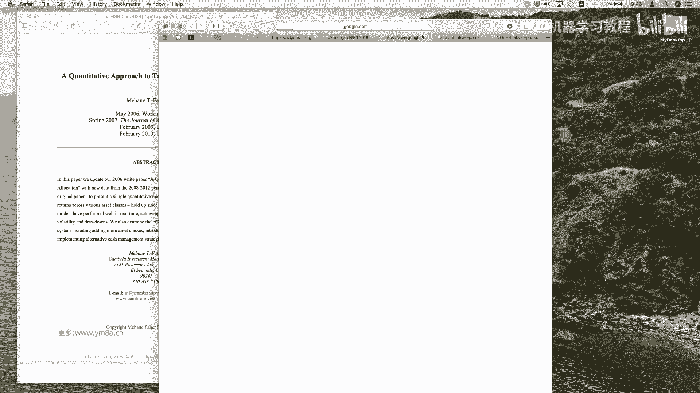

在电子教育当中的特质和难题对，然后就本质上来说，就是说嗯主要是说他是说是一个就是自动交易，交易系统的复杂度，是基本上他们是难以去进行处理，嗯对呃，主要是因为就是说嗯就是在面临一个。

就是在在电子交易过程当中，然后你可以认为你的每一个动作，都是你一系列的子订单的集合，就比如说是哦，然后就是说我们肯定就有不同的特征，比如说价格，然后我的订单的类型。

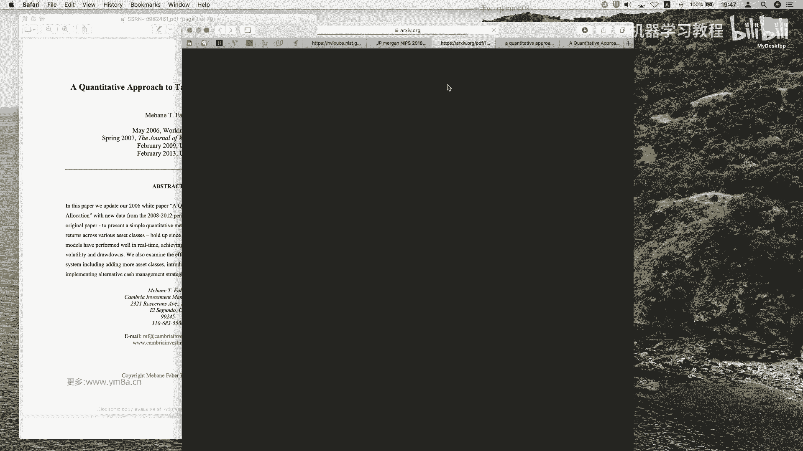

我到底是限价单还是市价单还是FA kill，然后还有一个问题就是说是我的规模，我的订单的数量，那么事实上这三个呃，然后这这这这是每一个订单都可能有，就是有这三个特征，但事实上我还会有多个并发订单。

那么多个并发订单，还有一种可能是说是我在交易的过程当中说，如果一个订单成交了，那么我另外一个订单需要立刻去处理，这是很简单的套利交易，对不对，比如说呃，呃就是我一个单的111。1条腿成了。

我先把另外一条腿也去跟上对，但是但事实上这个市场是比较复杂的，往往可能是说你一条腿去成了之后，另外一条腿并不一定能有很好的价格去呃，去成交，所以所以说就是说，刚刚举了这样一个简单的例子。

就是想说是整个整个就是说用深度学习去抹去，训练的过程当中，事实上他的动作会比较多的，因为大家知道强化学习的话，你可能就是说我这边可能就是，如果我只是买和卖的话，那相对能捕捉到的程度是比较有限。

但是如果想要真的用用来去呃，去模拟一个中等频率的这样一个系统，那我要考虑的要素是比较多的，就是我的我的decision弱的话，那我可能要考虑是是比较多，对你肯定要考虑要以什么样的价格买，你要买多少手。

然后对，并且你只是一个单个一个单个的agent，那么多个agent的组合在一起的时候，那这个名的规则相对来说就会是比较复杂，所以这个里面是比较一个麻烦的问题，对以上刚刚我们讲了这么多。

就是说其实是想着说是，就是说我们呃呃这个问题其实是会比较类似，就是说比如说航空航天导弹制导的过程当中，或者说是船舶的运动轨迹，事实上在engineering领域的话，已经有这些类似的问题。

就是大家都会有很强的随机性对，但是我们都想要说是去控制，他们处于一定的范围，比如说啊我希望我的导弹沿着既定的轨迹啊，或者说我希望航空航天把卫星送上既定的位置，虽然我会有随机性。

但是我仍然要去就是control，所以这个这个这个本质上是一个呃，就是一个随机的最优控制的问题，叫stochastic ical optimal control，这是一个比较呃，就是控制领域当中。

算是一个比较经典的这样一个领域，对他们目标就是说是针对不确定性，那这个其实也是非常符合我们就是说再去做呃，随机性的量化交易的这样一个过程对啊，就是说在这个就是说我们在我们在设计这样。

一个随机控制这样一个系统的时候，我们会假设说我们影响状态，随机变状态变量的这样一些随机噪声，它的概率分布是一致的，然后我们的目的就是说，我们要在噪声存在的情况下设计一个呃，相对来说是啊受控呃。

就是说设计一个设计一个，比如说我们这样一个呃随着时间变化的轨迹，比如说船舶运动的轨迹，卫星运动的轨迹，或者说是我们的trading pl，也是随着时间变化的轨迹，然后那我们就要是说在最小的成本情况下。

或者说是那这个时候就要考虑，就是说在不同领域我的成本不一样，那在确定的领域可以说是我的cost最小，然后是我的pl最大，然后我们要去完成我们的maximize，我们的预期的pl这样一个任务。

OK呃当然这个里面，然后然后要强调的是说这个随机控制领域，其实我们是可以用在离散的时间系统，也可以用在连续的时间系统，离散的时间系统，你可以理解为是说我们的市场不是，如果不是连续交易的话，呃。

但是我们我们市场当然你可以，现在是一个连续的交易状态，当然你要把它采样成嗯，一个个离散的点的话也是可以的，就是说相对来说它的应用领域会是比较广，Ok，所以说这部分领域就是说我建议大家。

如果以后就是想要去接着去研究这个研究，就是金融投资的话，其实是可以考虑参考呃，然后呃就是随机随机控制的这样一个领域，那么今天我们就是要讲的这样一篇paper的话，也是讲了一个是随机控制领域的呃。

就是把随机控制应用到嗯，应用到我们的套利交易的过程当中去，而这种paper可能会相对来说是整个课程里面，就是公式最多的一个paper，但我觉得大家可能也不用特别关心，然后只要就是说大概知道他的。

就是它整个的建模过程是什么样的，然后我们可以把它去怎么用，用到我们的市场当中去，我觉得这个是比较关键的，然后至于大家对于里面的就是过程比较呃，比较有呃，Sorry，比较比较啊，感兴趣的话。

那之后是可以花比较多的功夫是去来去理解的，OK那今天就是，然后接下来我们就正式进入这样一个领域，对所以刚刚刚刚扯，先再就再总结一下，刚刚扯了那么多的，就是说主要是讲到一点，就是说呃首先是说哦。

金融市场并不是说是完全随机的，我们可以通过随机性的检验去证明这一点，第二点就是说是machine learning在处理金融领域的时候，会涉及到许许多多的问题，所以是即使大家就之前。

即使之前我们提到了各种各样的方式，那么真正在应用的时候，尤其是就说是像嗯是呃，就是强化学习这一部分的时候，可能会遇到一些问题，是需要大家去注意的，然后第三点也就是说是其实是optimal。

Optimal petrading，就是optimal stochastic control，其实是非常好的一个approach，可以让我们去解决呃交易过程当中的一些问题，那么就看到就说嗯。

相对来说就是说这个整个的这个paper，其实是比较偏，就是传统的呃模型的就是pricing，就是ping就是P框这样一个部分，因为怎么说呢，就是说它我们还是会对市场会有一些，基本的一些假设。

比如说是嗯就是几何布朗运动这些对，当我觉得这个是比较经典的一些假设，OK那么正式的过程当中，就是说我们先来讲一下，就是说这篇文章他其实想要做的是什么问题呢，就简单来说他是把我们的就是说股票的。

股票的对数价差去模拟去呃，去去构造一个OO过程，那么在个就是说它本质上来说，这个OU过程就是一个平稳的，就是呃高斯马尔可夫的过程，然后他就说他是一个数学期望为零，然后并且以指数函数作为核函数。

然后然后这个文章比较厉害的一点，他是说把我们动态投资组合优化的一个问题，转化成一个随机控制的问题，大家要注意说，之前我们其实讲各种各样配备也可看，也是要去关注的，说作者是怎么来去怎么用呃。

怎么来去处理投资过程当中问题，转化到他相应比较熟悉的这样一个领域，记住我们这篇这篇文章，他是说是把我们这个动态投资组合问题，转化成一个随机呃随机额控制的这样一个问题。

对K就是说其实这个里面最本最基本的假设，就是说我们的投资者是可以呃，基于价差进行交易，然后就是就是说我呃，我是买入或者是卖出这样的一个股票，或者说把我的股票放到一个呃，放在一个无风险的资产当中。

然后那那接下来就是说，我们要去找到我们最终的一个资产净值，然后呃根据这样，然后我们希望去找到，我们去麦在最大化我们的这样一个期望值呃，资产净值过程当中去找到一个解析解，能够去帮助我们去进行交易。

OK他说这边paper尔他举的，其实提到他这边举的例子是coke cola和PEPSI，也是说人家说这两个股票是比较是highly，Correlated，那么嗯对其实是说嗯。

然后套利交易其实也是说是整个交易过程当中，是比较经典的一部分，呃，就是比较经典的一部分交易策略，一个是股票当中的统计套利，还有一个是商品期货之间可也有也有存在啊，不同的商品期货之间有相关性对额。

OK然后的话，OK我们接下来就是比较重要的一部分，是来看它的problem formulation，我们怎么来形容这样一个问题的，而这首先是呃就是无风险资产，然后这是一个无风险资产。

然后是无风险利率是R，然后他是可以不断的compact，就是对就是可以连续计算，然后就是说所以呢就是嗯就是DMT啊，等于r mt乘以DT，那这个是就是它的一个动力学的这样一个方程。

那么然后是我们有两个A和B的，这样一个股票的价格，然后是符合一个几何布朗运动，然后这个里面的话缪就是它的，就是他一个漂移项，然后西格玛是它的波动率，然后这个ZT是一个标准的呃布朗呃。

解就是不标准的布朗运动，然后对这一块儿呃，如果不是特别熟悉的话，可以稍微看一点，就是随机过程的东西，然后相信大家也可以就去可以理解这个，理解这个过程，或者是张浩的那本书里面其实也提到了对。

也提到了这个类似的公式，然后他就说是我们用XT来表示，两个股票的这样一个价差，然后他说当然他是log来哎表示，然后这个是里面它最基本的最重要的一个假设，就是说两个价差是符合一个OU的过程。

那么第一项就是说k theta减XT表示是什么呢，就是说可以说在呃T时刻，我预期的一个瞬时价差变化的漂移项，就是它类比上一个人，它也是一个漂移项对，因为它是随着T是人，就是它是随着T是去变化的。

但是它表示的是说在T时刻预期的瞬时价差，然后那这个K的大小其实就反映了这样一个呃，看均值回复的这样一个速度，那么显然就是说K是要大于零的，因为如果K小于零的话，那就是说可能价差额价差差的越额价差差的。

你如果是就是说真的真的，价差越越正的价差的话，然后他价差还会越来越扩大，那显然又不是说符合我们一个均值，回复的速度对，要注意，大家要注意说，我们统计套路里面最重要的一个假设，就是说我们认为他们两个股票。

两个两个S之间的价格差会最终会均值回归，OK然后还有一个这样的一个AAA的话，参数其实反映了它的一个就是波动性嗯，然后这边wt的话是标准的标准的布朗运动，然后还有一个呃。

OK然后还有一个roll的话是表示Z和呃，就是这边Z和W都是一个呃，都是标准的布朗运动，但它们是两个，OK然后roll的话是表示Z和W之间的一个嗯，嗯嗯Z和W之间的一个相关性，对，就是说呃。

也就是说是取DWT和DZT的这样expectation，然后他们的呃他们就等于row乘以DT，OK这部分可能是就是也要学会一点，所以就微积分，可能同学们会理解起来会比较清楚。

但是这边呃我觉得就是大家先就是没关系，就是跟着我去follow，把整个的它的过程去理解出来，然后然后他应用了伊藤伊藤定理，然后伊藤引理，然后把234去联系起来，就是说他这样就可以得到一个。

关于资产A价格变化的一个，动态的这样一个方程，然后这个刚刚我们提到这个是一个correlation，这是两个呃随机运动的一个，这两个其实两个部件，两个布朗运动标准，布朗运动的一个correlation。

然后这个时候就可以去嗯，然后这个里面它引入了两个，一个是H，一个是h tilt，它表示的是什么呢，它表示的是股票A和B在T时刻的这样一个，投资的这样一个权重啊。

Portfolio weight for stocks a and b，然后呃，然后我们这个时候就是说，我们这个时候我们会只允许，就是说是A和B配对交易，那什么意思呢，就是说我嗯只能是说买一只。

然后是卖一只，我不可以说是同时买卖啊，这sorry不是说是同时买A或者是同时买B，那么那么并且同时要注意的，就是说他的资金是养的，就是equequ a dollar among。

就是说我买和买A和卖币的资金是一样的，OK然后所以这个时候这个是这两个是啊，对相反数的关系，那这个就是说这个是对于任何的T都是成立的，另外然后那这个时候我们就可以写成T时刻的。

这样一个资金投资组合这样一个净值变化对吧，额就是说因为一个就是说是A的变化，然后一个是嗯就A的仓位乘以A的变化，然后B的仓位乘以B的变化，然后还有一个是呃，这是我就是存存开始无风险无风险利率对，然后嗯。

然后就是把125这几个式子再带进去的话，就可以得到这样的一个啊model的这样一个过程对，就是我可以把我的投资组合在T时刻的净值，就是写成这样一个可以写成这样一个公式，OK这部分大家没有问题吧。

就是说嗯可能你不需要去理解，就是说你现在就说不知道，就说几何布朗运动是什么意思，或者他有什么样的性质也没有关系，但是说这这部分，我觉得大家是相对来说比较可以理解，因为我就是就是三部分嘛。

一一部分是投资A1部分投资币，另外一部分是啊投资到就是cash里面去，在对这个里面其实就是他呃，就是说这这篇论文的微导它还是比较典型的，就是随机微积分这样一个过程，它可能刚开始的时候对它呃。

看起来就是说模型会有点复杂，但事实上就是说我们去啊，再去解这个模型的时候，其实就是说呃相对来说整个过程会比较简单，对他是相对来说是比较重建模，但是对对于就是说数据的特征，其实我们没有特别的去关注。

比如说大家在整篇论文里面，我们可能都没有涉及到，比如说A股票和B股票的波动率，甚至说对他们的甚至考虑他们基本面，没有考虑到任何因素，我们单纯的只是从A和A和B的股票的价格，去符合这样一个要几何布朗。

那就是标准标准的这样一个布朗运动，对，仅仅是这样的一个假设，OK第一部分是就是把我们的这样就构造，我们的这样一个投资组合的问题，那第二部分要做的事情，就是说是我们怎么从最优控制的这个。

这样一个角度来去解决这样一个呃，投资组合的问题，那formulation as a stochastic control problem，OK就是说嗯就是说他这个里面是把配对交易。

然后表示成一个随机最优控制的问题，然后这个里面我们要引入了一个叫utility function，叫效用函数，就是投资者的偏好，把它用效用函数来表示，然后这个里面是X呃，要就是就是E除以伽马。

然后X的伽马次方，然后X大于等于零，然后伽马小于一，那么这样的一个就是说，我们显然就是说我们的目标是嗯在最终的时刻，capital t在大T的时刻，我们希望让我们预期的效用最大化，也就是说是去。

我们就是要是去最大化，我们的在T时刻的时候，V t，大家看到这是T时刻的这样一个portfolio的value，在这边这边是VT，然后我们希望这样的一个效用函数是去最大化，OK嗯。

这样的话就是说OK就是说，所以说这是作者的这样一个思路，我们需要去就是说把投资者这样preference去表，表示成这样一个方法，这样一个呃这样一个这样一个函数，对大家注意说它为什么不用说是说仅仅是。

仅仅说是考虑嗯，我们到最后是去钱多哎，就是最大化的嗯，就是一个VT，而不是说有接下来的这样一些呃，这样这样一些这样一些参数对，那这个这个里面其实就是说是因为是效用函数，就是说如果说是中间涨到100%。

而就翻了倍，又亏50%，那那那其实可能不一定是说是，不一定说是符合作者这样一个预期，所以这边注意是效用函数，而不是说我们用最终的呃，我们的portfolio value。

然后这个里面要引入的就是说有几个边界条件，比如说是V0，然后X0，然后然后然后要注意，就是说这个是系统状态是符合什么样的，这是我们之前前面推导的对，就是一个是一个是DXT，然后还有一个是DBT。

那这两个是表示什么意思呢，就是说第一个第一个是说是说我们的投资额，投资第一个就是说是呃第一个约束是呃，就是说我们的投资组合的净值，这是我们的初始净值是V0，然后我们的初始的价差是X0对。

就是因为我们任何两个交易标里都会有，这样我们都会有初始的cash，然后和初始的就是两个S2之间的价价差，那第二个约束是表示的，就是说是我们的价差是需要符合什么样的状态，然后第三个表示的是我们的静止动态。

是需要符合什么样的这样一个状态，然后呃OK嗯就是这边他所说的对，然后接下来的话他会是去呃，这边的话他会去构造一个，就是说然后我设的这样一个gt的话，是就是说顶流，然后接下来就是说他怎么来提到一个解析解。

而这部分的可能直接就呃带着大家去，我觉得可能就跳过吧，不用去呃，不用去知道大家怎么不用去怎么去解析，去知道怎么去解析解对，就本质上就是说他是解决，就是说呃就是说咳，首先就是说它对应的这样随机控。

这样一个随机控制的问题，它会对应一个就是HGB的这样一个啊，HJB的这样一个方程，然后他通过一系列的简化，让得到了一个简化的时候，然后就是说，然后我不是说要去求这个式子最大值吗。

在求这样一个最大最大值的时候，那显然就是说我们要去考虑它，而且sorry不是最大值，是极大值，我们要去取极大值的时候，就求它的一阶导数，一阶导数的话让令它的一阶导数为零，我们可以得到这个式子。

然后可以去解到的，相相应的这样一个HH的这样一个star，然后再把这个式子再返回去，再带到呃，带到这个里面去，我就可以就是额得到了这样一个啊，偏微分的这样一个方程，注意这个下标是它是指偏导数。

这个是对T，然后是就是呃这个是对V对，然后这个是两次，所以然后嗯在论文的最后的部分，它是给了那个啊，也不是不是在最后就是说这这，然后接下来这部分，就是说是去有这样一个求解的这样一个过程啊，巴拉巴拉巴拉。

这个我觉得可能大家感兴趣的话，就是可以自行去看，嗯OK然后最终最终的话我们就会呃，OK这就是就是说通过这边一系列复杂的操作，我们最终是可以得到额，最终的当前时刻的最优资金权重。

的这样一个solution，就是说H是等于这样一个公式，那么在这个里面，就是参数会比较比较比较多了对，然后呃，对反对，在这个里面就是比较多的话，可能就是说要去大家要注意，就是说这个里面会引入了哪些啊。

哪些参数呢，就是说是一个是阿尔法呃，对就是这个这个模型的参数会比较多，然后就是然后西格玛，然后包括我们的，因为阿尔法里面其实还包含着其他的贝塔，然后然后还有包括就是两个之间的这样一个，Roll，OK嗯。

我们直接来看到额，直接来看到，就是说也就是说这个里面就是说呃，先是看到这个式子就是要阿尔法，然后要有贝塔和H，因为理论上来说我们是得到了这三个，这就是说这三个这三个式子，然后接下来就是说这样一个问题。

就是说我们要怎么来去估计，这样一个模型的参数，那么在这个里面，作者他所用的方法是就是说是用maximum lucky who，就是最大自然法，然后我是从历史的数据当中去估计这些参数。

他做了这这里有有几个假设，就是说是一个是说是那就是s st，s st的话是就是我们的这样一个价格是符合呃，符合高斯呃，符合高斯分布，那么同时它的就是价差的，XT的话也是符合这样一个高斯分布。

然后他再去算两个的协方程，然后再去算就是价格呃，就是ST跟XT的这样一个协方差，你也是可以把它去表示出来，然后呃在这个里面的话是，所以在这边，然后然后接下来就要注意的是，我们这个时候YT的话。

它是表示成两个价格的一个时间序列呃，就注意它是一个二维的，然后然后OK那这个时候就可以得到，就是然后我们假设可以得到，就是说N加一七的这样一个历史的数据啊，要要注意的是。

要注意的是说是它我们会增加一个假设，是YT是具有mar可复性的，然后我就可以把这样一个呃，这样一个就是自然lucky hood，这样一个自然函数去把它去那去，就可以简化成这样的一个形式。

然后然后在这边哒哒哒哒对，然后以及这一部分的话，大家可以自行去看一下，就是我通过这三个式子，我可以去联立去最终去解我这样的模型参数对，就是相对来说啊，就这块，然后就是解到我们的M截到我们的PQ。

然后V和C对这一块的话，就可以得到我们这样的呃，就是说这个里面就是想说什么，是我的模型参数呃，虽然就是说它是一个解析解，所以说我们的模型参数是可以从历史的数据，是唯一去求解出来的。

因为因为我不是说是这里面有随机性，我是根据我既有的历史数据，去求到相应的这样模型的参数，那么得到了这样模型参数之后，我就可以去再去决定我的我的historical，这样一个POS。

就是这样一个我历史上每一个时刻的position，我要怎么去做，我就拿到对应的历史数据，然后去算相应的模型参数，然后去得到这样一个optimal的这样一个position，Ok。

其实这这就是整篇文章的这样一个，比较重要的一个东西对，然后具体的推导细节的话，可能就是要去看的话，大家可能需要花一些时间，但是但是就是说嗯，这个会有点像我们之前再去做呃。

期其实期权里面也会有类似的这样一个问题，就是说比如我们去用SABR或者是HASTM，模型的时候，可能他推导会非常复杂，但是但是其实我我我们再去真正去交易的时候，你其实并不care中间的这个是怎么解的。

当然你知道怎么解的话，可能对于你来说，接下来调整模型会有更好的优势，你其实真正关心的是什么，我真正关心的是我要怎么去implement这些函数对，而且其实其实其实我最后去上模型的时候。

我需要的仅仅就是这些东西，因为根据这些东西，我就可以得到相应的这样一些，得到相应的这样一些我模型的参数，得到模型的参数，我再带回去，我就可以得到我历史的这样一个仓位，这这就是典型的就是比较。

就是说偏偏Q框的一些方式讲一些paper，就是说如果同学们对于中间推导过程，不是特别理解，但是没有关系，我我们你你需要看懂的是，我最终怎么去算我这些参数，以及根据我这些参数，怎么去得到我对应的交易决策。

只要是掌握这两点，对一个是散的速算参数，然后是根据参数，因为因为算参数过程当中，这个是解析解，是比较好的，因为有的人那更多的情况下，你可能要去就是去解一个就是用Python，就是你要去做做数值解。

就是用优化包调优化包，不管是用用JULIA，用Python matlab或者是还有各种各样的优化包，对你都要去尝试去把这个优化包得解到，得到你这样的一个参数，然后把参数带引到相应带到相应的模型里。

这是典型的，就是说是根据Q框里一些paper，能够去实现教育策略常见的一些思路对，OK所以讲到这部分的话，同学们每个大概明白整个paper在做什么事情，本质上来说，他就是说他在对两个价格序列去建模。

然后建完模之后呃，两个数加差去建模，然后建建完模之后，然后我通过随机最优控制的方式去把它去求解，就他设计了一个叫utility function，我要怎么去最大化最大化我的这样一个效用。

然后然后我们去寻找它的它的解析解啊，根据我们这样解析解去，然后去根据历史数据去得到解析解相关的参数，去celebrate，这是一个拟合的过程，然后根据这样的一个拟合过程，我就可以得到我接下来的时候。

交易决策要怎么去做，这是整个paper这样一个流程，然后同学们还有什么问题吗，这篇paper对，然后具体的细节，我觉得可能就是说如果没有相关基础的话，包括不知道HJB方程是什么。

然后呃包括如果最前面的伊藤引理不清楚的话，那可能得花点时间去了解一下，但我觉得了解一下，我觉得还是比较比较比较有意思的，对对他可能跟现在大家用machine learning的方式不太一样。

但是它反映的是呃，我觉得还是就是说最典型的，就是资产定价的这样一个模型，我觉得可能对于大家长远来说，了解一下还是比较有好处的，OK然后下节课就呃我们大家可以先休息一下，课间去理解一下啊，下节课就是解。

其实其实其实很快就可以看一下，就是说怎么去implement，然后呃根据这样的一个价格序列那个，然后然后根据这样的一个模型，我们把它去算出来，算出来之后去回测一下，就是历史的这样一个交易会怎样。

那其实非常简单对，总共可能就额不到100行代码对对，但但是其实做出来结果还是比较漂亮的，然后我们再回去简单的谈一谈，这个模型可以怎么去改进，然后我们应用到我们的A股跟呃，期货市场可以大家怎么来去操作。

对好的，那我们先休息一下，然后大家可以paper之前已经发到群里，大家可以去看一下，比如说呃太多细节没有掌握不要紧，但是我还是说关键的是，你要知道怎么去要根据这些式子去inf模型，这个我觉得是作为一名。

就是要去做量化交易的时候，比较基本的这样一个素质，对。

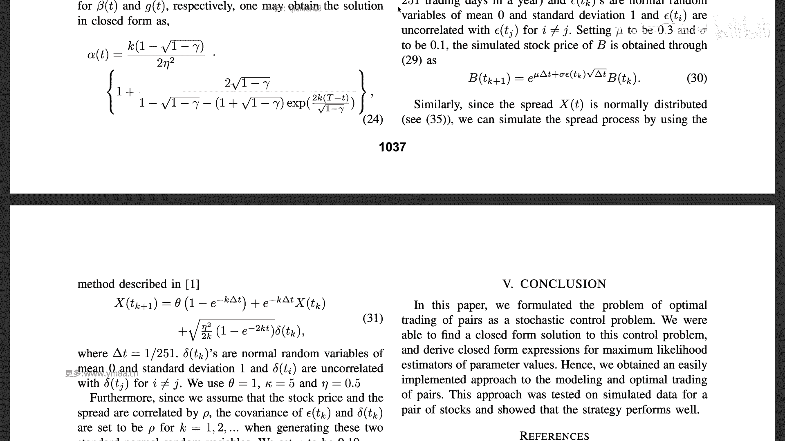

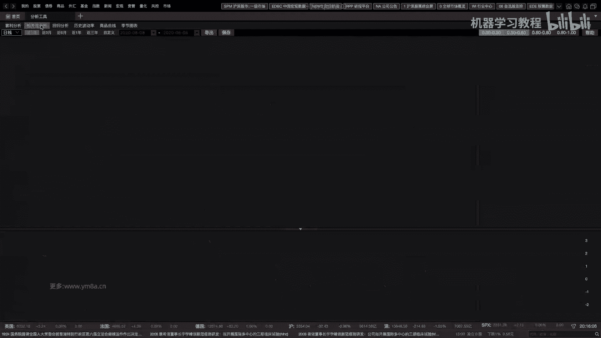

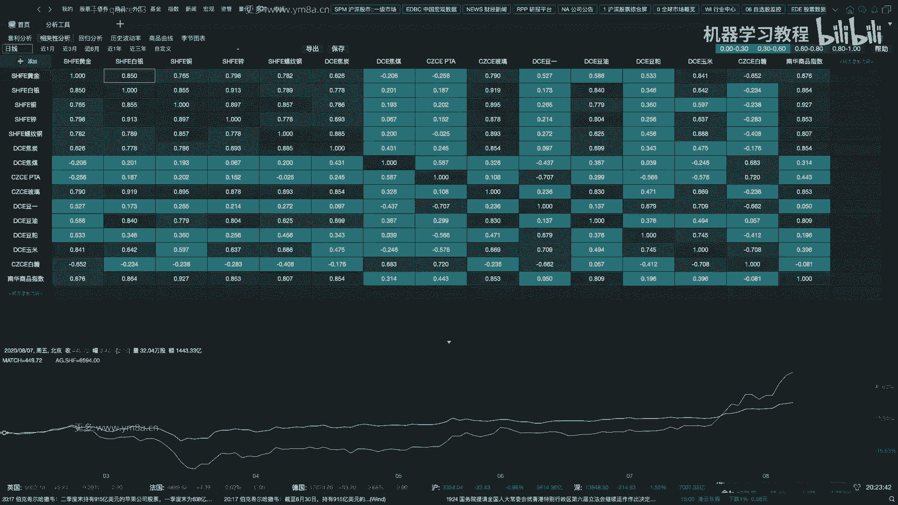

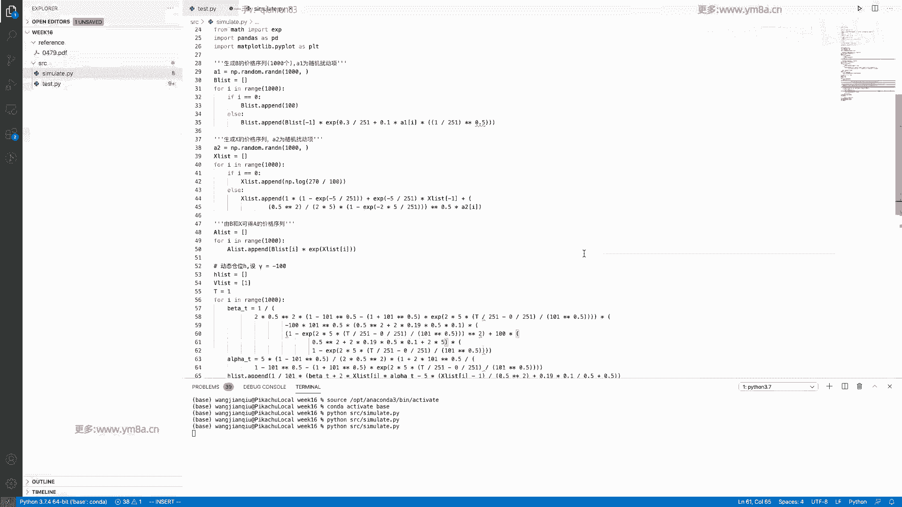

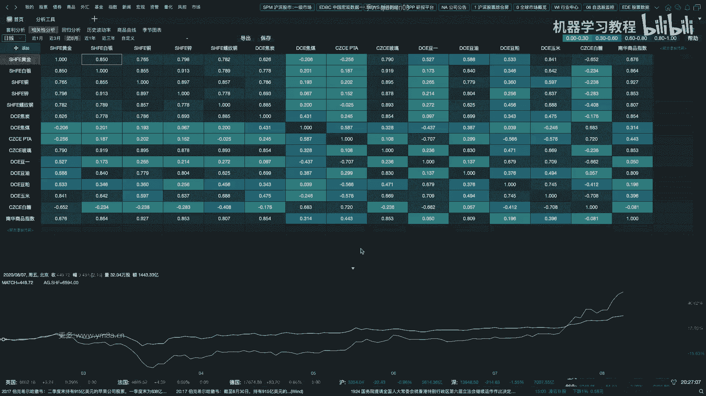

哎OK同学们呃，这篇paper大家看的怎么样，然后OK我刚刚说过，就是说其实你中间的很多推导细节，如果暂时还没有搞明白，没有没有关系，但事实上我们我们关注的是说啊，一个是嗯H到底你是什么。

H到底是怎么来去求解这样一个仓位的对吧，是这样一个公式，我们要看明白这个公式是什么意思，另外一个是这里面的参数阿尔法贝塔，然后thea it这些东西是怎么来的，怎么来算的，我们只要搞懂这两个。

然后我们看看，就是说我们生成两个这样一个具有相关性的，这样一个随机序列，它是怎么来去做逃离的，就是说这个里面是OK一个是生成随机数，然后然后呃大家注意的是，就是一个值A就是A的初始价格是270。

然后B的价格是100，然后然后然后这个是里面的这样一些参数，然后这个是就是B股票的这样一个assumption，是呃一个是对数正态分布，然后它的漂移项，然后他的那就是西格玛，然后包括。

然后我们是设一年是一百二二百五十一天，OK然后的话就是我们先先是有这一段代码，是生成两个X的这样一个呃，就生成A和B的这样一个随机随机序列，然后注意的是说你看A和B之间的相关，是通过这样的关系来去构造。

就是说生成一个额嗯，然后生成一个呃X项，然后X里面，然后又通过B乘以X，我们就得到A和B这样一个随机序列，那么我们刚刚说是我们要去关注这个里面的，这些式子怎么求解的，其实其实也就很简单。

就是你真的不需要就是说那么复那么复杂，首先就知道就是说呃，呃首先是这个阿尔法和贝塔，我们看一下，其实仔细去就是对定义的话，你其实发现它没有那么复杂，ok so阿尔法是我们这边有K，前面应该都定义好了。

K等于五，然后呃呃伽马是，伽马应该是伽马是看一下啊，OK这个是51乘以对根号根号下，然后伽马是-100，我们这边应该是在前面是吧，定义的是-100，在哪儿是，哎所以我都忘记了，那边要-100。

但是OK大家可以之后，就是大家可以自己去看一下嘛，对呃我看一下伽马是，就是说我是想说的意思是说，其实就是你在implement的时候，就你almost要做的事情，就是如果你懂得基本的四则运算。

开根号exponential，你就可以去implement，把这样的就是这些数值给写进去，但事实上就是我觉得这这边肯定写的不是很好，就因为你之后可能如果涉及到调参过程。

最好还是就是说把字母就是给写进去了，就是字母去写进去，而不是说是用这个对用就是用好用，直接的数字会点进去，因为这样可能会给大家就是会引来一些麻烦，之后对，但是整体的就是这个是前面的，就是K除以乘以这个。

然后除以两倍的ea的平方对吧，然后再去乘以后面这个是花括号，这里面这一项对花括号里面的这一项是在这，然后1+2倍的，这是这个是分子对分子两倍的根号下，然后伽马是-100的话对，然后就是101。

然后这个是分，然后下面是分母，然后一减去一百一百零一根号下，然后是然后是一加根号伽马这一项，然后这个是explanation，Explanation，25乘以capital t然后减去T这样的一个方式。

OK然后贝塔其实也是同理对呃，大家仔细去看一下，其实完全发现本质上要做的事情，就是去抄个公式，当然贝塔有点长对吧，就是去抄公式，你只要能看懂公式，你就知道阿尔法和贝塔怎么去求。

然后你就可以去算我们的H对吧，然后你有了H之后，A和B的价格你也知道，然后根据我们刚开始的呃，刚开始就是两个portfolio对吧，一个始终是一个始终是正的，一个始终是完全等价的负的。

你就可以算出我们这样的一个portfolio value，然后大家可以看一下，因为因为因为这个数据构造的是比较好，非常符合我们的assumption，那么那么显，而这个这个这个收益应该是非常不错的。

对大家可以看一下，OK首先，这这个是跑出来的就是一个净值曲线，这个是非常夸张的一个曲线，因为A和B之间是对，完全是完全是按照这样的规则去进行构造，所以对，所以跑下来就这样的结果是非常就符合。

非常符合模型的假设对，然后这个里面就是这个是我们的A，然后这个是我们的，这个是我们的B，就按照就初始价格一个是100，一个是270，然后按照这样的这样的序列去进行，去按照这样一个随机的序列。

去模拟出来的一个价格序列，然后按据根据这样的模型，我们算出来的这样一个position去进行去trade，就是说我什么时候去多多A然后空B对，所以所以又是就是说嗯，就是说面对这些复杂的paper。

其实就是大家刚开始，就是包括之后在工作当中要去做的事情，就是说可能是你需要去呃，你可能即使没有搞得懂，它里面有很多的assumption，或者说他求解过程是什么，但是你至少也知道我拿到这样一个结果。

怎么去把它转化成我的代码，但事实上这个代码是比较简单的，就对，就是虽然这个这个相对于我们之前的代码，是比较简单的，虽然就是说它整个的求解过程会比较复杂，但是我希望大家就是说不要去害怕。

真的就是静下心来去看待嘛，然后把这个去实现起来，其实就没有那么难，然后然后还要提一下，就是说这个里面，就说这个这个是不是真真的这么理想，就是一个是一个是就是说很自然的一个问题。

如果A和B之间价差不回归怎么办，那么这个大家可以去找一段A股，去找一找一个数据去测试一下，那事实上就是说，如果价差序列出现单边的这样一个趋势的时候，那这个时候模型模型成这样。

我们calibrate时就这样一些参数，可能就不是特别影响了，对那这个时候我们这边K是库固定的嘛，是拿体数据，这样是固定的，那么这个这个如果之后的参数的话，我们肯定要去改进我们这个参数K怎么去做对。

然后对还有一个就是说一个特点，就是说嗯因为这个模型是适合于，就是说配对的价差是符合均值回归的情形，就是说啊如果是相似的行业的股票，比如说啊我们刚举了两个银行的例子。

那或者说是就相似的产业链的这样一个期货，合约是会具有呃这样的特性，但是嗯，然后嗯就是说事实上就是说一个可行的思路是，我们现在是拿日记别的数据，那么事实上你可以拿越高品质的数据试试。

你能够发现的趋势是应该是越符合倾向的，其实这个时候你可以考虑，把相应的模型先往高频上去做，对额这部分就是想要提的两点，一个是说大家要去注意的时候，就是说当我用的数据不符合这样的假设的时候，呃。

对不符合这样的假设的时候，你要去做怎样的这样一个改进，就是模型参数的估计的问题呃，事实上就是啊我们在就前面的期权波动率套利，这样模型一个hasten和SAB2的模型的时候，也涉及到类似的这样一个问题。

那么这个里面可能就涉及到比较tricky的问题，对当然这个比较好的是，这个里面没有涉及到太多的优化的这样一，部分问题，所以指定input input ment这个模型的话，相对来说是会比较方便。

OK然后注意啊对所以这篇paper的话，大家还有什么问题吗，我相信就是说你只要看得懂阿尔法和贝塔，然后包括它的H呃，这个关于这个这个这个公式，你你你你我们就应该知道就是怎么去求解了。

对你这个H里面H的公式我们是implement，在这边总共其实你用到的真的要去呃去回测，你用到实上就这三个公式，对那中间的过程是帮助你辅助去理解。

包括对你当然这个应该是closed form solution，所以其实还比较好，如果是中间是有涉及到像之前一些问题，涉及到一些数值解的话，肯定要想就是要去掉Python的包或者METAB的包。

去解决这样一个问题，OK所以就是到目前为止，就是这篇paper我想给大家讲的内容都结束了，然后大家还有什么问题吗，就这就是这个，这个我觉得是比较有意思的一个思路，然后呃在这边只是给大家做一个开始。

然后之后大家可以去应该要去自己去啊，放到股票市场上去验证一下是不是可以符合啊，就是用这个验证这个模型是不是有有效性，然后包括怎么去改进对，然后呢然今天因为是整个课程的最后一次课对。

然后还想跟大家去讲一讲，就是说这门课之后大家应该去催些什么，就是呃到今天为止的话，总共到现在还有六位同学参加这个课课程，跟我一起坚持了整整16个夜晚，非常感谢大家对于这门课程的支持。

然后也希望就是大家在这门课程当中，是确实是收获到了一些东西，然后的话我在这边整理了一个dog，整理了一个文档，是想跟大家就是呃，我不知道就是大家有没有就接着再找工作，或者是呃实验学校之类的。

然后这边是想给大家看着看着，就说接下来要做什么啊，或者我给大家就是先说一说，就是我自己曾经上的一些课程，就是说我差不多工作，从master毕业到现在差不多3年半4年的样子，得不到4年三年半对。

那我上过的其实就是从本科到研究生之间，我自己呃也上过一些课程，其实因为我本身不是MF1专业，但是其实后来是有考虑往这个方向去做准备，所以其实上的课程会相对来说，我自己觉得是往相应的方向去靠的。

就主要的是说基本的数学，你就说数学的功底啊，微积分，线性代数这个大家有，然后离散数学这个是计算机或者是数学课，可能不一定大家都会去上，但我觉得就是说学完这些概念就是集合论。

然后包括数理逻辑和graph图论的话，可能有助于去接下来去做一些数据结构的事情，当然我觉得这个不是必须的，所以说我把一些重点的课程，我是把它去标出来了，对，然后包括这个抽象代数，这个是数学系的课程。

秦怀玉啊，这个可能大家不一定要去上，但是我会觉得就是说这样能基础，fundamental是一定有必要，然后PDE的话，其实我也上过两门课程，就是偏一分方程，可能额这部分的话呃，可能就是说学学过之后的话。

就是说对于学stochastic，hackers可能会有一定的帮助，你没有学过的话，就知道怎么去解pd，但是没有学过的话，可能也当然影响也不是特别大，就像刚刚这篇paper，你可能只要看得懂。

最后的结论就是什么样就可以了，然后我个人觉得会比较重要的是，就是numerical analysis啊，就这个这个这个东西比较重要的地方，就是说是嗯，就是教你怎么用数值的方式去解决一些问题。

解决一些优化的问题，比如说凸优化或者是非凸优化，然后这个里面可能包括就是数值解的稳定性啊，那当然就是在实际编程当中，是非常重要的一些事情，比如说你一个大数乘一个很小的数字对。

然后你的error是怎么去累积和渐进的，然后包括说是那还有典型的就是说啊，就METAB怎么去解一个线性方程组吧，或者说怎么怎么去求矩阵的逆，那不不是直接用inverse对吧对。

就这这个这部分大家肯定要去呃，就这个这个我觉得可能是比较重要，然后如果没有修过相应的课程，可能大家要花点时间去弥补一下对，然后其实matrix computation。

跟前面也是是也是比较类似的一门课程，当然可能更加偏向对，更加就是这，这这是这是我上了一门p sd level的课程对，那我觉得还是因为是基于就是对numerical，analysis比较感兴趣。

然后去后来也跟教授做了一段时间的研究，所以这部分呢就是AMERICANNESIS，我觉得是就是是就是在框框领域当中，我觉得算是比较有用的一个技能，因为涉及到就是说你怎么去解决化问题，怎么去求解。

然后如果没有现成的包或者没有现现成的工具，你要去想办法去来去求解应用，你自甚至要去自己写一些算法对，然后probability和stochastic process，这是概率论跟随机过程。

那这个肯定是比较呃，就是基础当中的基础了对，因为本身我们处理就是一个随机的问题，然后包括然后接下来强调就是说高等的统计，一一个一部分是涉及到时间序列建模，然后另外一部分是涉及到经典的啊，经典的统计学论。

也那些东西点估计，然后然后写也是就是假设检验，然后AUTOPTIMIZATION其实跟前面会有点像，他会跟numerical analysis会结合起来，就是说我们会经常会解解一些。

就是linear跟non linear有一些优化的一些问题呃，尤其是在做债券的时候，linear programming可能是非常重要的一个工具，所以希望大家去掌握，然后这个里面对然当然。

然后接下来就提到就说是cs领域，其实cs里大家看到就是这个里面，其实我没有提到很多的Python，然后上过两门C和C加加的编程课对，然后系统的学了一下data structure，也是在学校里上的课。

当然是java，然后我个人觉得就是一个是C加加，其实是呃兼容领域，是我觉得是非常重要的一个语言，可能在某种程度上重要性还会超过Python，尤其是如果你真的是想要去做一个，严肃的框架呢。

我可以说是c++is a must，就是你是你一个必备的选项，是逃不掉的一个选项对，然后unix programming这个其实是讲了，是一系列在LINUX底下的工具，包括你怎么去呃。

你用你整整个的一些你的workflow是什么，你你你怎么在呃没有IDE的情况下去开发，然后怎么去优化，然后包括呃你的定时任务，然后包括对就有一系列的比较dirty的工具，但是是掌握了。

因为因为就是事实上就是你交易的时候，很多都是在服务器上去处理，你需要用这些工具，包括对端口转发，然后等等一系列的工具，这这部分其实是我觉得是掌握了，这部分是可以极大提升你的生产力的。

就是提升你的生产效率的这样一个工具，然后嗯嗯另外一部分就是说machine learning，这个大家都知道，就是说我就呃我我大概只上过一门课，另外其实我很多就是上一些CASA跟REDACITY。

上面那些就是啊Mark上的一些课程，那这这个我觉得其实也是比较比较比较重要，就是最基本的是可能说需要去打好一些基础。

把machine learning包括deep learning的一些基本的一些东西去掌握，掌握全有基本的一些概念是不管是优化期，然后各种各样的经典的呃machine learning的模型。

然后对我觉得这个这个这个包括就是就是，这个是基本的方法论，我觉得可能掌握起来比较重要，然后具体在应用的时候，你想要用什么样的网络结构，或者是用什么样的工具，那到时候还都是可以再去学习的。

结合你的问题的解决背景，然后第三部分就是，因为其实我个人背景不是master of financial engineering，所以上了一些乱七八糟的，你可以看到很多理工科的什么啊，量子力学，量子化学。

然后热力学FY流体力学啊，但是这个里面就是我觉得会有一些帮助啊，因为毕竟还是会有一些帮助，一个是严格的逻辑推理，我觉得还是会有一些，然后quantum里面其实用到一些pd。

包括就是flow mechanics和hit metransfer，本质上都是在去不断的解PDE方程，那当然这些所有的问题，会跟我们金融问题会比较类似，都是会我们根据现有的一个问题去想办法去model。

然后再用软件去求解它，我觉得就是所以说为什么要强调，就是说大家要去注重数学跟cs这两个基础，一个是数学工工具，帮助你去去model去建对市场进行建模，然后你的cs的能力是帮助你去呃，帮助你去呃。

能够更好的在就是去生产对，然后嗯然后然后再就是说在上这些，这些前面都是在上学上学的时候完成，那么再就是说在工作之后，我做了些什么事情呢，就是首先刚开始找工作的时候啊，不管是在北面还是在中国。

如果是跟cs要相关的话，大家都知道是刷late code，那么这部分其实我之前毕业之前，其实一直有在去保持不断的刷，毕业之后其实也是虽然减少一些频率，但如果是要去面试或者是什么的。

我还是会去刷late code，然后之前是用Python，然后后来就是那C加加，其实后来也是包括在近期，也是一直不断的在去准备，所以这部分是我我觉得是保证呃，保证大家就是保持一个思维的敏捷度的一个。

比较好的手段，然后还有一个就是说是online course，呃，这个这个是这个我觉得是就是你感兴趣的话题，你可能就是我觉得最简单的是嗯，感兴趣的一个话题，与其去慢慢的看书。

那么还不如说快速的去找到这个领域，最好的一门课，快速的去跟一做一些作业，做一些project，你可能很快就能去上手，然后另外一个就是装一个study group。

然后有网上有一些就是career club，然后我去参加他们的study group，然后去和大家一起去完成一样的事情，这个这个里面可能更多的是一个自驱的一部分，因为就我还是相信就是说很多人一起学习。

还是比自己单独的要去学习，可能会更有效率一些，因为每个人长处跟短处是不一样的，对这部分其实大家是可以自己考虑，是不是有必要去形成相应的study group，然后因为我不是cs的背景。

所以其实还会读了一些书，操作系统，然后matt threat program，多线程编程这个领域，这这个这个其实也是要去加速，这个也是比较重要的一部分，OK然后包括怎么去design pattern。

就是呃设计模式，怎么去你的去重构和优化我们的代码，对这部分的话是cs0，然后第一个operating system其实是相对来说比较底层的，但是我觉得就是是由于考虑，考虑到要去不断优化代码。

可能去了解一些相应的知识，可能还是会有有会有比较大的好处对，然后的话基于finance相关的书，其实呢读的不是特别多，这这门是衍生品，可能大家都去读，然后12个stop castle cas读了几章。

没有完全读下来，到后面还是有些难度的对，就是第二册，然后包括是dynamic hedging，这个是我个人是工作需要在做期权交易的时候，其实是读的比较多的一本书，然后前面一本是Mac million的。

一个期权的入门的教材，这是我个人读的finance史相关的书，然后框trading就是其实这门课程呃，整个的课程框架其实会基于，算是基于这两个两本书慢慢去搭建起来，结合一些我个人经验呃。

我个人就是说也是比较受这两本书的影响，是比较大的，所以我还是蛮建议大家去接着去读的，尤尤尤尤其这本书最近又有一本新的叫advanced，就是因为这本书出版是2000年第二版的。

现在又有最新的叫advance advances in active portfolio management，就有了一些最近学姐比较新的一些想法和idea，我也是建议大家去看一看的。

然后前面是这三部分，是我们需要去study，但是我会觉得在整门课程当中，我给大家强调的都是学了那么多，要去干什么，当然要去去实践当中去检验我们的想法，所以呃可能刚刚有人说为什么要去造文字。

那那事实上就是说，你真的只有在造轮子的过程当中，你才能去真正的去理解整个矿领域，每一部分是怎么去生产，怎么去去构建的，或者这么说吧，我会觉得就是一个框最核心的一个skill set。

就是说你能不能有去持续产生新的阿尔法，并把整个阿尔法去上线的这样一个能力，对这个我觉得会是比较核心，所以在这个里面就是说业余时间，除了在公司做工作。

我还会有去design and implement back testing system，就是其其实在前面前面几节课有给大家讲过，就是说怎么去写一个回车的框架。

包括之前拍摄的Python matlab都有去尝试过，然后后面还有请大家去重写数据系统的话，也有最前面的CSV文件转化到HDF文件，然后用MYSQLMONGODB数据库，然后后来还用内存数据库。

包括后来去学习k dB数据库，所以整整整个一个领域，可能都会有比较多的一些东西，可能我觉得可能真的是要去尝试去过，才会去结合，找到自己比较合适的这样一个解决方案。

因为因因为交易系统这个事情是比较定制化的，然后数据的收集跟清洗这个也是自己做过的，然后包括就是说后面其实更多的就是说是test，那就是去尝试去测试各种各样的交易策略，然后我一直还要强调一点。

就是说这一点交易策略，跟我们的trading或者back test框架，其实这两者是分不开的，因为不同类型的策略，你相应来说你就要用不同的回测系统，这部分的话是，可能大家就真的要去自己去做交易。

或者说去去测试的时候才会去慢慢去想到，因为就典型的刚刚是一个event driven back test system，是不太可能满足全部的需求的，尤其是如果我是多标题再去测tick的时候。

可能那种方式都会有点慢，所以这部分的话是不断去迭代的，我自己也是属于不断对这部分有新的认知，然后有新的想法来去测试，然后对，OK然后包括就是说machine learning的框架。

怎么去有机地融合到整个的测试系统当中，这部分其实也是有相应的框架，可以大家自己去呃去去去思考，因为呃machine能力比较好的，是相对来说有很多开源的框架嘛，然后包括整个怎么管理你的模型。

然后你的数据pipeline怎么样去做对，因为互联网里面可能用到了很多的一些，成熟的工具，那其实矿车型里面都可以去考虑到，把它引入到你的个人，个人或者是机构的交易框架当中，我觉得是比较有用的一点。

然后最后最后一点就是，我觉得其实也比较重要的是，可能还是要去交易一些对，就是可能你测了那么多模型的话，嗯我觉得可能还是要去观察市场，这对真的不一定说是说是去从description trading。

能不能赚到钱，能赚到钱，最好你亏一点也没有关系，但我觉得更重要的一个过程是啊，更更重要的一个过程是说你在去交易过程当中，去熟悉市场，找到一些市场的一些特征feature。

然后去包括也去形成自己的交易的风格，然后甚至说你有一些交易想法，能不能用你的策略去固定固定化，就是说我我还是觉得这一点是除了呃观察市场，是除了你的。

除了就是说我们用data mining的方式去挖因子之外，是比较重要的一部分，对这部分是，其实我是蛮鼓励大家可以自己的去去测试，当然不要说是去疯狂的下很重的手术，很大的单去伤害到自己的。

对伤害到自己的就是资金，毕竟是真真真真真真金白银对，那么最后我是想告诉大家，就是说其实最重要的过程就是说是你要keep learning，不断的去学习，不断的去迭代，然后去跟不同人去交流。

然后去改进你的交易系统，我就觉得所有以上这一切都是为了这点去服务，如果专业是长期有志于这个领域的话，那就是真的是keep learning，因为大家的所有的人都是在进步，市场都是在进化，算力也在进化。

对，然后投资的理念，投资的框架也在改进化，所以可能就是说这部分是比较重要的一部分，就以上的一切都是希望大家都是我，希望就是说这16周课程下来，至少能够帮助大家去了解到，整个框领域有哪些各种各样的课程。

课框，trading领域有哪些比较有意思的方向，然后大家可以相应的给大家打开一扇门，希大家可以希望相应的去朝这个方向去努力，因为事实上就是我觉得，就是每周讲到的一块内容。

在机构里面都可以去做很久很久的project，就是从深度上面，包括广东上面，其实还有相应的一些领域，其实也没有来得及去介绍，然后包括模糊理论怎么去交易，然后以马尔可夫的模型怎么去交易。

然后包括说high frequency trading，就是collocation，这这些这些我觉得有很多很多东西都可以去讲，对O然后其实到今天为止，整个16周的课程就已经结束了。

非常感谢大家这16周以来的合作，然后接下来说可能更多的是答疑时间，如果有什么问题的话，还可以就是大家可以去答疑，然后另外我觉得就是方便的话，就是说大家如果方便的话，就是可以就是指课后呃。

微信可以呃简单的自我介绍一下，然后看一看，如果就是之后有什么需求，或者说呃如果想要去投实习，或者是什么样或者是找工作的话，我看看我能不能给大家提供相应的一些帮助，Ok，额对这部分是讲了。

然后我在这边回答一些问题，这边有同学提到在这边呃，Sorry all b，诶诶刚刚那个问题，嗯就刚刚哎不好意思啊，这个，呃刚刚有提到，就是说50ETF的期权是不是可以额卖空额。

就是50ETF的期权可不可以卖空啊，当然是可以的，对，呃就是期权，就我不知道你的意思是指是是是short，还是卖一个还是买一个put，那当然两者都是可以去操作的，对就是说750期权。

117期期权是可以买空，当然你要去看一下他的公式，就是，额我还是说哎大家学会就是去自己去看官网，然后，对你要说的ETF的东西啊，这是属于ETF期权的基本常识嗯，支持SSX1数据产品，债券股票期权。

然后你要去看他的对交易规则，那现在是两款1T5嗯，就是上海是两款，然后深圳还有一个对实，你是可以去交割的，那么你就是说你再去开仓的这样一个保证金，所谓的卖空就是说你是持有这样一个义务仓。

那么你要去根据这样的东西去算你的保证金，大概几千块钱一手对吧，这个这个是可以去算的，所以说嗯然后期权的冲击成本的话，呃，呃我觉得可能要看你的那个按交易费以外冲，冲击成本，你要看我觉得这不好说。

这得看你的就是交易策略是什么样的，以及你的首付是多少，如果你是一首两首，我觉得你可能都没有必要算太大的冲击成本，你一般来说你按对价的话，加一两个点还是可以去吃掉，尤其是你尤尤其是你交易的时候。

是交易的时候是呃，是交易的是呃品质附近的这样一个合约对，然后另外一个还跟你的托管，你是不是有托管机房，你能不能拿到最好的速度，这个是有关系你的延迟，然后然后以及就是说因为很因为期权程序化。

也就去年还是今年才开放，所以所以其实很多人都不是用程序化去交易，那么你手工交易可能会有一些，然后你看你程序化的话，那显然课会有一些优势，OK所以这部分的话可能需要大家就是呃。

就是这这个东西可能需要你自己，就是去实际的去测算一下，对这个这个我觉得是有太多的影响因素，可以去决定期权的这样一个，期权交易的冲击成本了，呃，然后对我不知道，这个我解答了这位同学的疑惑没有。

然后说那个嗯，是说的是斜诊，那么，他本身来说是说这篇文章就是就标准的，他说example是两个，就是哈highly correlated，但事实上就是还是要去去算一下的，两个是不是呃。

如果两个完全没有相关性的呃，相关性的这样一个呃S支架H多少，我估计效果不是特别好对，所以谐振的话，我觉得可能还是还是还是需要，还是比还是需要的，因为因为本质上来说你就是去算一下他的。

就是算一下它的协方差嘛对吧，你可能就是说我不知道，就是说你是不是需要严格，就是说去测一下，就是啊写要不要去做一下写真检验对嗯，嗯这部分的话，嗯对这部分我可能还不是特别清楚，要不是呃对的。

这部分我可能还不是特别清楚，是不是要去做协整检验，也因为说这篇文章其实他没有讲到，就是太多的就是强调assumption，就是他也没有来去做一些确认检验，它只需要是说是呃。

它本质上说希望我们的ASSA去模拟这样一个，OU过程，那么如果说你观察到了挑了挑的挑的asset，就是模拟下来的结果不是特别好的，那其实可以考虑说唉对相应的模型进行改进，对对呃。

但是但是说呃这部分套利的话，可能更多的不是说是用来帮助你去找，找到这两个有是不是可以做套利，更多的是可能是去找的是去市场，我已经知道这两个品种是有套路，比如说啊螺纹钢跟热卷，然后跟铁矿。

对这些已经有现成的这样一些套统计，套利的关系，那么我们再去做相应的这样一个套利，对，这这部分可能会是这篇文章比较重要的一个点，OK呃然后同学们还有什么问题吗，就是整整16节呃。

16周课程以来就是非常感谢大家，然后因为这也是我第一次就是开这样的课程，所以如果有一些讲的不是恰当，不是特别恰当的地方，或者准备不是特别充分的地方，希望同学们包涵，然后对之后的话对，然后大家有什么问题。

后续的话，反正微信我们还是可以不断保持相应，保持相应的沟通对对，然后然后大家因为之前也有同学在问我，就是说在也面临职业上的相关的选择，然后其实我也能尽我的所能，就是给大家一些意见对呃。

然后希望大家就是说，如果未来大家都还在量化，这个比较小的圈子里面，我估计可能迟早有一天，我们大家都会在线下去遇到对，所以OK然后整个整个课程到现在，就是我基本上想讲到的就是这么多，然后我觉得可能之后呃。

大家的话，就是因为后面其实也没有布置很多作业，就是呃可能大家真正要去自己要去做的事情，可能还是要把相应的模型给跑起来，自己去搭建起来，然后上上课上可能只是讲了一些论文，然后讲了一些代码。

然后去距离真正的最后生产跟调优，其实差距还是比较大的，当然也不，我也不是希望大家把所有的东西都做完，那可能是说更重要的事情，就是去想一想自己，是不是去尝试一下自己适合哪些领域，然后为此去做相应的准备。

因为毕竟整个量化领域，量化交易，即使是量化交易领域，能够涉及到的产品的种类还是比较多的，那么一般来说选定了一个品种之后，未来再去去转化的话，可能会比较困难对啊，然后股票固收有一些，但不是那么的矿的对。

然后期权量比较小，虽然很矿对，然后所以这这部分就是希望大家要自己去啊，而去做更更多的research，对的，然后的话我想一想，我还有什么想要给告诉大家的，对对我看了一下我们的课程。

第一次是从3月28号到现在，整整16周的课程，对的，然后其实讲的东西也还是蛮多的，然后我估计可能很多同学中间没能跟下来，原因也是可能，因为一方面是，可能我的讲讲课的经验不是特别丰富。

然后对有的有的地方相对会过得比较快，然后或者是没有给大家讲清楚，给大家造成一定的困难，另外一方面可能就是呃，可能就是在刚开始的时候，这门课程的定位跟大家的认知会存在一些偏差。

毕竟我我的商城是大家会具有比较好的呃，基本的数学跟编程的这样一些功底，然后我们可以直接用这样的一些功底，来去做一些做一些事情，对那么如果如果之前可能Python编程都不太会的话。

那那那可能就是上这门课跟下应该会比较困难，但是我相信如果至少说大家在整个过程当中，努力的话，呃应该就是多多少还是能学会一些东西吧，对的嗯对，然后然后我觉得就是，如果大家就是课这门课之后。

大家要去想想要去做些什么，我我觉得就是最简单的一个目标，是先基于一个品种，把自己的交易策略，或者让整个的投资流程给跑起来，我觉得然后再去去相应的优化一些部分，而不是说东东一榔头呃。

先先吸一棒子的这种方式，我就是想嗯就相当于做一个最小化，可以让你整个系统跑起来的这样一个产品，这样的话你可以不断的去优化，你知道的，你知道你整个的process过程当中，哪一部分是需要去优化的。

那么这样的话可能给大家带来的反馈，也会是我觉得会比较好一点，至少你知道这一块功能会比较好呃，会那这一块功能有缺陷，这一块功能比较好了，那么这么做下来的话，可能会觉得大家的兴趣就慢慢的会被带起来对。

然后的话呃同学们还有什么问题想要问我吗，嗯对，就是有关包括这门对于这门课程的意见跟建议，然后呃我想也就课后，课后的话，大家也可以就是再发函给我，然后另外的话，如果说你针对性的还想往哪个方向去发展。

那么我也可以给大家，就是提供到一些小小的意见和建议，嗯OK那如果没有什么呃，我哦看看还有一个啊遗传规划的一个问题，之前讲到十多年的数据一起跑出因子，还是切成几个月来跑，就这啊就是这边有个同学问到了。

是说，咦sorry我没有把这个调一下，稍等一下，呃之前有个同学问的说是遗传规划问题，是用十多年数据去跑出原子，还是切成几个月来跑，还是说我的因子，事实上我们用到的还是就是嗯，就是就是有很长很长一段时间。

就是应该是哦，我采集到的数据可能没有十多年吧，可能45年的数据还是有的，然后切成就是这个里面其实涉及到一个问题，就是说你当然可能说是可能用，如果用5年的一个数据，可能会存在那个问题。

就是说前面因子会比较有效，但是后面的因子呃就是说在前期会比较有效，但是它近期的时候，因子肯定会阿尔法，会存在一个DK的这样一个问题，那这个这部分的话，可能就是这部分。

我觉得就是说没有一个是cil boy，没有一个说是完整的解决方案，就是当然你可以说在整个遗传规划的过程当中，你可以设计一定的机制，比如说你会去额，你就是说我们在有一个部分。

不是要去选择保留我们什么样的因子吗，那你可以就是说，把每天在机器再去测的过程当中，把近期表现不是那么好的一些因子，你可能要去过滤掉，那么即使说在历史表现不是很好，但是近期的因子呃表现还不错的话。

你可能还是要去把他给踢出来，然后你接下来去进一步的去细看对，因为就是说我在去做的做这件事的过程当中，我是会把每一个因子的IIC，I2的这样的一个曲线，都会去每天就在服务器上把它可以跑出来。

但是这个算力是会花比较久的时间，可能大家是需要去注意的，对这部分的话就可能代码优化的好会好一些，然后对如果有有可能的话，就是说嗯不知道就是Python你跑下来可能会占领，一方面占的内存比较大。

然后一方面对跑的时间会比较久，然后有可能的话，如果是考虑用C加加的话，那可能还会好一些，对这部分就是说切成几个月来跑，你如果是你把它切成，另外一方面就是如果你切成几个月来跑，相当于说你用几个月的呃。

我不知道这样样本集够不够，因为我自己是用比较多的，是用5年的数据，你几个月来跑的话，可能呃可一方面肯定是说你ICL2，你观察到的时间会比较短，只有几个月的时候，未必能说明什么问题。

尤其是股票是日级别的交易的话，我的建议是，可能还是要去尽可能的选比较长的一段周期，去真正去测试这样一个因子嗯，对然后然后提到就是说很多问题的话，就是大家问就是问，我就说其实很多问题我也不是不是知道。

那那其实要做的事情是说，如果你真的对这个问题感兴趣，我们应该是去写代码去验证它，就是我还是说呃就是求知欲，或者说是problem solving，能力是跨领域非常重要的一个能力。

因为事实上就是你们每个提到的问题，在工作当中都可能，作为一个可能会持续几个星期甚至一个月的project，比如说第一个问题是说啊，ETF期权的冲击成本，那很有可能你是需要去Impact。

你要去你要去尝试，你要去想办法去测试你这个冲击成本，然后去对你要，然后要去来说服你的老板，如果说这个冲击成本比较大，你要，那么我们要想办法要去研发相应的下单的模型，去去，就是类似类似于做事这样模型去啊。

去优化我们的交易结果，当然你要考虑，就说这分冲击成本跟你的pl相比，到底是占多少，对这部分是都是需要去做一个框，你需要去做研究的，然后对对，所以我是说很多的问题可能是说如果我做过。

我肯定知道没有做过的话，肯定说真的也需要自己去测试，那工作当中，就并不是说整天都只是去做交易策略，就是说当然是说盯盘去交易，维护现有的交易策略，然后小新的交易策略是很重要的一部分。

那事实上就除了交易补齐部分呢，你可能其他的还要去关注，对，就很当然，所所有的这一切都是为了就是去产生更好的偏，爱而去服务的，对嗯所以就说是前面，那就说cs领域，为什么没有说是去啊。

让大家去研究数据库的优化，然后让包括是高并发，高吞吐这些互联网需要一些技能，但是但是框呢也相对来说会比较狭窄一点，就是呃我我可能不一定是高并发，我关注的是低延迟，Low latency。

甚至低延迟的部分，很很大一部分我都可以用硬件去解决，用collocation，然后用更更好的网卡对，然后然后去做内核的一些优化，这部分你可能会有相应的专业人士来去解决，我们可能需要做的就是去购买服务。

对那做矿铝，他还是相对来说是会比较偏向研究的一个方向，更多的需要大家就是不断的，就是嗯，更多的还是偏向于一个数学建模的，这样一个过程，能够去把你的想法转化成数学模型，然后用代码去来也表示出来。

这个可能是我觉得是比较重要的一个能力，那那么就是说对于一个应届生而言，在面试的过程当中可能不太清楚，知道你有没有这样的能力，或者说能不能做出可行的教育策略，那么常见的面试可能会说。

OK那我们做一些brand teaser，看看你的反应速度怎么样，然后然后问一些基本的probability和stars的问题，看看你最基本的一些呃数理方面的学数，数学方面的能力怎么样。

然后会问一些编程题，然后让你甚至让你实际动手去处理一些数据，因为这些技能本质上是跟我们的实际工作，是息息相关的，那么嗯那这部分的话对，那么大家也可以就是从面试的过程当中，去体会到相应的框。

他的呃风格是什么样，但是另外有一点就是说，面试跟最后实际的pl是有相关的吗，我觉得不好说，对这这点就是比较模糊的一个地方，但我也是觉得是这个领域，非常有意思的一个地方，也是有很多人就是不断的在投入。

OK然后然后的话大家还有什么问题的吗，对然后因为这是我们最后一次课程了，然后所以我希望就是呃我会留在这边，然后大家可以想一想，有什么问题会问我，可以问我，然后如果没有什么问题的话，我们可能就先结束了。

对我会一直留在这边，然后对大家可以再想一想，包括历史上这么多课程，还有什么问题的话，大家可以来向来来提问，对，然后我会先等来这边，然后如果没有什么问题的话，那大家可以先去休息了嗯，哦对了。

然后我还想跟大家提一个，就是呃呃我自己的呃like，就是我现在就是交易的一些硬件跟软件，一些基本的配置对，然后呃硬件硬件层面的话是说，首先是呃呃目前我还没有用托管机房，因为相对做的频率其实没有那么高。

所以没有用托管机房，但是是由两台云服务器呃，一个是呃，一个是sent os，然后一个是呃，一个是一个是那个windows，这两个都是在都是托管呃，这这两个应该都是都是放在上海对。

所以是相对来说离交易所会近一点，当然这这部分延迟我觉得是可以忽略，因为阿里云时长拼过去的话，延迟也就10ms，我觉得完全可以接受，然后的话然后关于自己的硬件层面的话，就是说啊为什么又刚刚说那个云服务器。

一个是LINUX，另一个是windows，windows的话肯定更多是成呃，是是一个仅是一个那个是我，我我可能会打开那个叫呃叫sorry，就是那个文文化财经，或者是那个嗯快七。

用来监控我们的实际的量化交易，的运行的怎么样，然后LINUX那台是主要是负责CCC加加，就运行C加加的这样一个啊，谢谢大家的一个期货的这样一个下单对，然后在本地做研，然后然后也就是说因为是因网络的话。

可能有时候是有一些latency啊，所以我的数据其实都是放在本地的，然后我们在本地的话有一台啊，我不知道是12核还是八核，然后32G的一个小型的，32G内存的一个小型的塔式的服务器对。

然后基本上硬盘有三个T，基本可以满足日常的这样一个研究，然后另外还有一台windows的电脑，然后它带有比较好的显卡，如果有一些跑一些神经网络的东西，会放在显卡，放在那台机器上去跑。

然后然后本地主用的是一台16寸的一个Mac，四核还是六核，然后16G内存基本上是作为本地的一个开发，然后去可能会远程连接到我的SSSS上面对，然后对，然后就是基本上就是差不多用到了，三台本地的机器。

然后两台云服务器对，然后之后其实就这是个人，就是业余在做一些事情，基基本的这样一个配置，可目前可以满足我的需求，当然就说如果你需求不够的话，就是说那很简单，就是一个是自己买服务器。

然后或者是我去其实在阿里云上去扩容，也是非常方便的一个事情对，然后软件层面的话，其实是说之前可能还用VM，现在发现vs code真的是比较好用，所以大家看到后面基本上都用vs code。

然后jupyter notebook是做一些，就是preliminary的一些research，可能会做起来会比较方便一点对，然后主要的话其实软件层面的话，然后然后C加加反正都是在LINUX底下去写。

然后Python的话可能就是用anaconda去进行管理，然后对这是我主要用的两门语言，然后JULIA之前也用过一段时间，然后matt up有一个若干年前买的学生的版本，有时候会去把他做的结果。

跟Python的结果去进行一个category去校正一下对，因为MATLAB其实内置有些算法还是比较准的，尤其涉及到一些金融的一些东西的时候，这部分可能会比较好一点。

然后MATHEMATICA除了之前上课，现在应该都不用了，java其实最近几年也没有用，所以可能最主要的用的还是Python跟C加加。

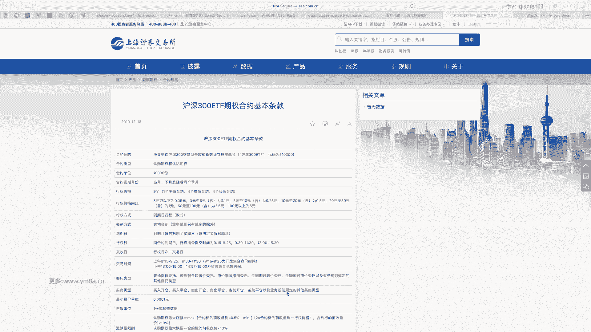

这这是主力的的一些工具，然后对，然后然后交易的话，自己在家里有一台呃，二十七二十七寸的一个4K的显示屏，是主要用来编程，然后还有若干台显示器是用来做盯盘，对对，这就是一个基本的这样一个配置。

所以整套硬件应该也不会花特别贵，但是基本体验还是可以的对，然后的话个人平时我会订阅了一些啊，BLOMBERG我会有订阅那个他的新闻，然后economist经济学人也会也定了他的全年。

这个是平时会读一些消息对，但其实之前有叫华尔街见闻还挺好用，但是由于一些原因，他现在被关闭了，所以可能也不是特别好用，然后万德对，大家看到我万德其实是比较好的一个，因为我很多的数据会从上面去取。

因为即使说我买了数据，但有一些数据，我可能每天还是会去从万德上去获取对，所以万德是比较好用的，然后因为万德其实它有excel，包括就是期权的监控和可以用万德的，就万德的数据源直接接excel。

是非常方便的一个方式对，当然你要做的复杂一点的话，你可以在云端做一个服务器，就是去因因为就是万就是用用windows，因为万德就是呃只只只只在windows和Mac底下嘛。

那windows底下你有一个API呃，然后把你期权获取的实施的这样一些数据，或者一些风控的得到实时数据去转发到你的，转化到你的其他的订阅的终端上面去对。

因为就作为一个就是说是你可能有一个windows终端，是作为你的一个整个的效，从万德上获取消息的一个转发，你这里面可以用消息队列，就是你互联网那些技术都可以用起来了，对然然后数据库的话呃。

你可以用NOSQL的MONGODB，然后你可以用，然后当然比较典型的是micro，然后对这些可以大家都可以去用，我觉得怎么至于怎么好的话，我觉得我到现在也没有确定下来，但是一般行情数据现在我用MICO。

然后有一些数据是用的是MONGODB对，然后我也没有做特别多的，应该就不没有做什么特别的优化吧，对嗯基本是可以满足正常的一些需求对，然后最对对，然后如果实在懒的话，其实用文本也还可以对。

就用就就保存文本，直接漏入数据到内存里，然后对，这是基本上一些硬件上跟软件上的一些配置，是希望大家可以去了解的，对另外的话我想想应该还没有什么了吧，然后反正大家有问题就问我，今天等的会一直等到10：

30，然后没有什么问题的话，大家就可以先去休息了，好的嗯，感谢各位同学16周以来的陪伴。

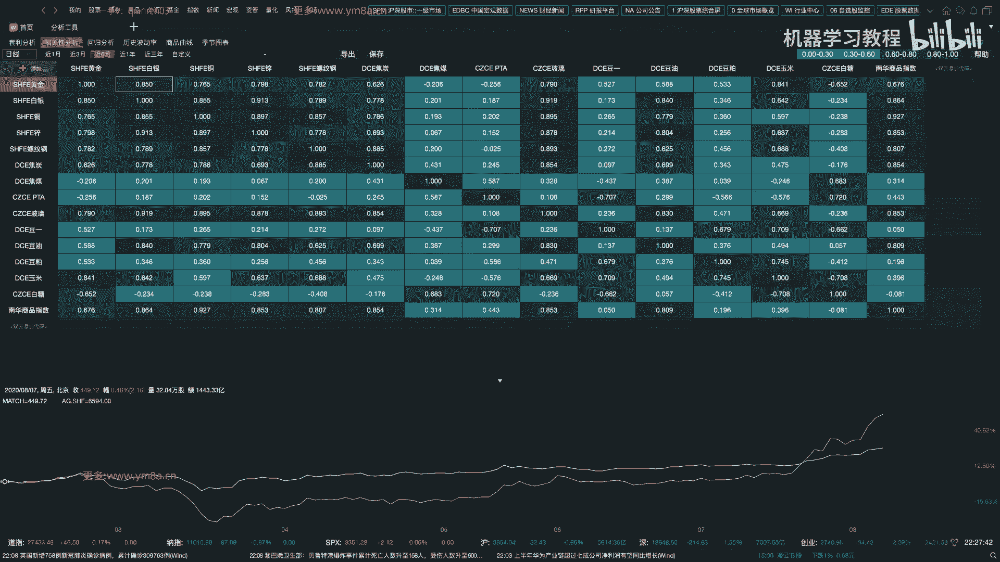

那么大家就早点休息吧。