# 【比刷剧还爽！】这太完整了！AI量化交易实战课程，全程干货无废话 入门到精通一步到位！（数据挖掘分析／大数据／可视化／投资／金融／机器学习／算法） - P5：第五章：测试你的交易策略 - 机器学习教程 - BV1Km421G7nH

hello唉，同学们能看到这个视频吗，今天好像大家来的人比较少，哎，那个我今天也是刚刚下班，所以对我估计也有不少同学，如果在工作的同学，可能今天刚刚也是呃工作回来对，所以嗯今天课不会给。

那就是大家不用担心今天课的强度不会太大，然后嗯哦对我们今天还是先去看一下，就是我们今天其实技术上的东西不会很多，就一个是我们把嗯信息模型这一块给讲完，然后还有一个是呃，上一节课我们讲到用了基础的数据。

用基础的数据去呃分钟数据和去做因子，然后我们再看，今天再看一看，就是带大家去走一下，怎么用tick数据来去尝试做一些因子嗯，然后哦我看一下就是嗯那个来的人间信对，先热一下场吧，来的人先在群里来的打一下。

我确保大家都都能听得到对，然后我们先看一看，就是上次的作业吧，对，然后其实就是这这这位同学我不知道是是谁啊，就是我觉得还还是挺好的，他把每次自己的作业都上传到GITHUB上面，然后嗯对。

我觉得他这次作业的完整度还是比较高的，就是整个的呃，第四次大家大家就是呃有兴趣的话，其实可以去看一看这位同学的作业，平时是怎么做的，然后对第四次的作业的话。

就是英子跟back tester两部分都都还OK对，然后其实我比较关注的就是嗯，我现在就是先在群里统计一下吧，就是啊到现在为止，把14年到18年的tick数据都下载下来的，同学有多少。

对我也在微信群里同步一下，就是你下载下来的人给给我，是我，我想了解一下，对对，就是我想了解一下，大家到目前整个进度是什么样的情况，嗯好的，然后我们这边今天好了，可能可能可能有人刚刚过来哈。

然后再问我就想问一下，就是到目前为止，就是2014~2018年的tick数据，就是有没有大家有没有下载下来，然后处理其中任何一个合约的对，就是任何一个合约的，只要有完整的tick或者是分钟数。

tick和分成数据都OK，就是就是嗯其实就是我是想想说的是，就是嗯整个课程到现在，就是关于CCTA部分的这一块呃，不管是从刚开始的就是数据的处理，然后包括就是回测平台的搭建，然后如何去回测因子。

其实我想说就是基本的框架是已经有了，就是嗯后面其实是作为一个入门课程，我觉得就是关于CCTA到这一块，就是相对来说就是整体的研究框架是有希望的，更多的是可能同学们要基于此去开始去尝试。

就自己用业余时间去尝试更多的呃，CTA的策略的开发对，然后然后如果说到现在为止，就是整个嗯，就是如果连数据处理还没有做好的话，我觉得可能是进度上可能会有一些落后了，可能需要同学们稍微加个油。

然后毕竟这个这个事情就就可能刚开始学编程，可能或者说没有接触过量化投资，会觉得有点困难，但是我个人觉得就是嗯，量化投资是一个系统的工程，然后如果刚开始是觉得有点困难，没有关系，你可以慢慢来。

但是这个坎儿就是如果遇到这个坎，我觉得还是得咬着牙，就是把它给突破过去，可能刚开始你不知道怎么去批量的去处理数据，那你可能又要去学习很多东西，但是没关系，我我觉得还是呃还是就是得去呃对应的知识点。

可能就是呃都得去把它一个个完成吧，就是嗯可能就是有一些同学嗯，我我在想可能说有些东西缺失的，就是说嗯就可我我在课上可能讲的都很直接，或者说是给的都是现成的代码，但是大家可能并不知道这个代码呃。

嗯现实生活中是不太可能一次性就写出，能够完整运行或者说功能完善的代码的，就大家可能要尝试的，就是说嗯就是说去学会一个去怎样逐步迭代的，去解决问题的这样一个思路，嗯嗯我在想，所以今天这个就是今天课程当中。

就是高频音的这部分，我可我会带大家就是给大家展示一下，就是说如果要学去实现一个新的因子，从零开始我怎么去做，而不是像上节课一样，可能十几个因子都算好了，已经摆在那儿。

但事实上中间是有不断的去试错跟debug的过程，然后如果大家直观的看到，OK就十几行代码，可能觉得还挺简单的，但自己写起来可能也不是那么回事，所以今天呃待会会就是我带大家去怎么看一下，就是一个高频音子。

就是可能会出现什么样的问题，因为嗯对，因为就简单来说5年的tick数据，然后去算因子的话，实际上数据量是不小的，对嗯那可能会对你计算的性能上面，或者说你在计算的时候。

就不能简单的用for循环或者是怎样来去做了，对，然后然后就是我还是想强调的，就是说这是一个系统的工程，然后我希望大家就是每一步都是自己去动手，去做起来，然后我觉得这位同学就是比较好。

就是嗯刚刚问到说是数据，可能数据相对来说可能还OK，大家应该都已经下载的差不多了，然后或者说是知道怎么去做，然后呃然后就是关于回呃回测这一块的话呃，大家给自己现在的完成度打个分呗。

就是还是就是00~10分，大家给自己回测系统就完成度打打个分，我觉我觉得这位同学基本上是就是我看下来，它的系统相对就是做的比较完善的，就是应该来说是可以跑的，就是说如果说是十分的话。

就是说你你可以用这套系统，就生成你任意策略的回测曲线，对零分就是代码还没开始动，对我我想看一看大家现在目前的进度，给自己的就是回测系统，这个搭建这一块进度打个分呗，好的嗯对。

然后这嗯这个同学的代码我会发到这边，然后大家可以去看一看，就是我觉得还是写的还是挺好的，然后嗯，现在就是说大家就是七分到八分为主的话，就是目前说七分到八分为主吧，同学们就是觉得现在是卡在哪一环节的，对。

因为嗯就是说整个代码的框架，应该我我相信你就是七分到八分学，应该都是了解，那现在就是说具体实现上会是有哪些困难呢，对对其实这个同学代码相对来说就是比较完善，并且他不是完全就是照我的代码。

我看过他还是有自己的一些思考的，还是对对，所以呃我不知道，就是现在大家的困难是有在哪里，那如果现在不方便说的话，那反正就是之后你可以不断的放到群里，然后答疑时就是休息时间的话，我会一一再去看一下。

对嗯嗯对，就是，那如果说嗯，现在就是大家对于上次作业，没有什么特别疑问的话，嗯哦我觉得可能功夫还是要花的，嗯就是课后的时间，因为就是让大让大家自己去呃，我觉得还是要去写代码去实践一下。

然后里面有什么坑可能才知道对，因为我直就算是就像这位同学，可能直接展现出这样一个可以直接运行的代码，那大家自己再去写的话，可能也会比不是这么回事，然后以及这个只是一个最简单的，分钟的一个策略。

其实我们我们我们之，基于这个这样一个回测系统，能做的改进还是非常多的，就是呃我不知道大家有没有在关注嗯，行情的时候啊，就是嗯我随便找一个行情。

就是因为我们现在的策略的方运行方式是，就是每隔一分钟发一次信号，对每隔一分钟发一次信号，那这样可能会出现的问题，就是说嗯像这种如果说在一分钟之内呃，信号就是整个的行情有个大的变动。

但你是一定会等到这一分钟结束才会去发单的，那你可能会去错过呃，这样一分钟之内的，去嗯策略去运行的这样一个机会，那其实嗯在实际交易当中，如果说我们要去尝试，在一分钟之内去做交易的话。

那我们扫单的频率可能就不是用分钟啊，而是用tick，就说我们的回收系统可能要支持，是说一个tick，一个tick的去推送，当然嗯这这个这个时候你可以用的方式是，在每一个tick位呃。

刷到每个tick为止的时候，你可以考虑说嗯，我在当前这个tick往前数一分钟，120个tick去以当前为这一个tick，为当前这个时间为呃，作为当前的一个时间段。

我们向前数120个tick合成一分钟的B，然后我们到下一个tick的时候，再以此为止再合成一个120分钟的，120分钟的嗯，Tick，120个tick合成一个一分钟的bar对因，因此如果如果是这样的话。

我们就可以实现一个，就是每个tick我们都会去生成一个分钟的B，然后基于这样的一个分争瓣，尼克CEL可以去进行计算，然后去罚单，那么这呃这个这个时候所做的区别，我们发现就是说我们可能是在一分钟之内对。

就是我们不是在整的分钟去计算我们的信号，去罚单，那这样的时候，对你的回测系统其实又会有了更高的要求，对你的回测系统必须要去支持啊，tick级别的数据，然后你还要能够支持在每个tick的时候。

去实时去计算最新的一个bar，对这这这这是一个改改良的方向，就是说如果说你想要做日内交易的话，嗯你希望在分钟之内去罚单对，然后另外一个就是嗯，就是如果说大家对于就是说做日内交易感兴趣，还可以考虑的是。

我们刚刚其实也提到，就是说嗯但刚跟低一点，其实会有点像，你完全是可以利用tick的，就是我们接下来今天要去讲的，我们利用高频的一些信号，用tick的一些信号去来呃，去来去计算。

当然你可以不一定说是用tick级别去交易，但你可以利用tick级别的信号去啊，比如说我在一分钟之内有120个tick，我计算了120个tick的信号，你可以去把它去啊，你可以去采样去生成你一分钟的信号。

然后用这个分钟的信号去交易，因为如果我们只是单纯的用一分钟的高开低收，其实我们还是去错失了比较多的这样，一些信息的，对，这是我个人觉得是比较可行的一个方向，那如果说你要去实现这样的一个。

就是研究系统的话，那其实相对来说，你的回测可能就是还需要进行进一步的修改，而不是满足于当前的分钟的回测，所以我就是想说就是对，就是说回测里面有很多可以优化的方向，对，然后另外一个可行的方向就是说呃。

我们现在有了这样的回测，是做单标底的，那么如果说嗯我想考虑的是说做，嗯做多个合约的，比如说我们现在看到的，我们看期货综合评的话，我想要做的是呃螺纹跟铁矿的这样一个套利，铁矿石的合约是这样对。

然后你还想去看罗文的合约，那其实那万德有一个比较好的功能，它是做了一个嗯叫价差的这样一个曲线，就是就是说你可以自定义这样一个的品种，我们之前看到的是这我这这是我之前写的啊，这是这是教。

然后是呃螺纹钢和热卷，然后分别是用一啊一比六比六这样一个关系，然后他这样有一个比较好的功能，是，它可以根据这样的关系，去计算出这样一个K线图对，但事实上在计算价差K线的时候。

你不能简单的用分中线直接去高减高低减低，那那那这样显然不是呃，这样一个价差的K线的合成方式，就是说我们还是要强调，就是你在合成价差K线的时候，你一定要用最原始的tick数据对。

要要用tick数据去对齐三个合约的呃，三个合约的tick数据，然后来去寻找这三个合约，形成新的这样一个合约的呃，在tick数据，然后再基于这样的一个tick数据，再去合成高开低时候，那同样的来说。

如果说你想要去对，那还是说如果你回测去想要去实现，基于这样的一个价差，你想要去做一些策略的话，那你的回测系统就要支持多标的了，对那你就是回测系统，我们现在是做的很简单，就是我们同一个时间节点只推一个板。

那接下来你可能要做的改进，是你在同一个时间节点，你可能要去推出dog tick对，那其实这又是不小的工作量，你不管是涉及到性能还是说时间戳对齐的问题，因为有有些时候你可能说同一个时间点呃。

不是三个合约都有数据，那你要用怎样的替代方案去做对吧，一般来说我们常见的，你就用上一个tick的数据来补齐，对那我我我我只是举了一些例子。

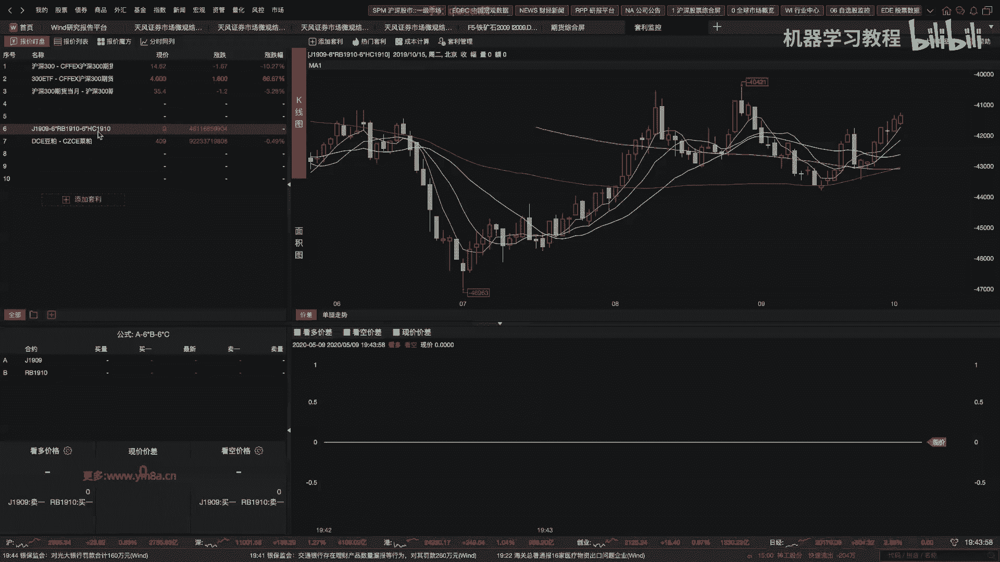

只是想就是想跟大家说，就是嗯嗯这个这样的回测系统，是相对来说是呃能用，但不是但是是比较粗糙的，就是呃其实个人基于他嗯，包括机构里面大家都会基于这样的回收系统，基于你自己的策略的研究需求。

不断的去迭代改进，对，然后我不知道大家有没有自己去回测过，就是不知道大家对于这样的性能，是不是不是满意，就是嗯就是如果说5年的纷争数据回复下，大家有没有测过，大概需要多长的时间，对。

那嗯就是如果说你发现这个Python速度你可以接受，OK没有问题，那那如果你觉得这个里面数据，就是如果你觉得不能接受的话，那可能要去长生C加加，这这也是后来就是刚开始我也是用Python做。

但后来做了一段时间之后，还是把整个的回测系统改成了C加加对呃，相对来说嗯，因为回测其实相对来说呃，我我觉得瓶颈是嗯，一个是在刚开始的IO上面，但可能这样还好，如果你不涉及tick数据的话。

就是你一般来说你只要一次性的把数据读到呃，从磁盘读到内存里，然后接下来的瓶颈其实是你的CPU对，那大家有没有考虑过，就是说嗯如果要测测多个策略的话，那我这样的回测引擎，是不是要考虑的是并行化对吧。

那那这样的话可能就是一个工程的问题，你有多少个CPU，你可能要把都把它去跑满对，然后如果说嗯现在的话我们是读CSV文件，嗯其实最最简单的一呃就是嗯现在是CSV文件，然后如果是要提取你读取的速度的话。

那第一个最简单的优化是呃，你可能把CSVCSV文件换成一个binary，二进制的文件，你不管用什么样的，就是方式去把它转化成一个二进制的文件，像那个R也可以转换成二进制文件。

Python你也可以换成PICO，然后甚至的话也有人用HDF5，这都是业界比较相对通用的一些方案，就是如果你是做偏高频一些的话对，然后嗯数据库的话其实就是提到数据库。

其实呃我们到目前为止一直没有怎么讲到，就是用数据库嗯，嗯就是我个人的建议是嗯，其实SQL不是就是SQL并不是特别适合，就是时间序列这样一个需求，然后如果为了嗯简洁快速开发的话。

其实我有尝试过一段时间的用那个能呃，就是NO SQL的数据库，比如MONGO这种，这也是OK的呃，那相对来说如果说要考虑性能跟速度的话，呃嗯大家可能还是去考虑内存数据库，然后以及呃之前也给大家提到过。

最合适的可能还是KDB嗯，当然学习成本会有点高，那基本上是一门新的语言对，然后你要去上手，并且现在KTB的话是，对于个人是是有免费的试用的，所以嗯license方面也不存在问题。

对其实我鼓励你学有余力的同学，就是说真的想尝呃，尝试的同学可能就是得考虑一下，就是你整个的系统是不是要逐步的迭代去升级，然后大家当当然大大家也要注意，就是呃就是量化当中每一块，可能你现在做的每一块。

在公司当中都是有很多人的去做的，然后就要看你的目标是什么，如果说只是说是去去体验的话，我觉得又又不着急，有时间的话，那完全可以有时间慢慢去做，如果说是你的目标，是尽快让自己的策略去上线的话。

那可能就是嗯不一定要在嗯，也不是说不一定，就是说相对来说你的资源是有限的对，那你就要可能规划好你的时间跟精力对，那你的目标可能就是，只要说我能满足我的策略的研究需求，那我不需要对我的基础架构有大的改动。

一旦说我研究的策略，对于我现在的基础设施提出了更高要求，不管是回测系统还是数据有了更高的要求，那我再去把这个瓶颈去改对，所以说嗯所以说这就就这样，其实我个人比较推荐，相对来说是第二种方式。

就是你先尽快的把自己的策略给回测之后，然后再接到CCTP上去跑起来，那这样来说你可能能直观的去感受到，就是你的策略的效果怎么样，当然这里面有一个问题，可能大家就是发现诶好像跑起来之后。

似乎发现可能主观交易更有意思，然后就发现每天就开始去主观交易了，然后呃交易起来感觉嗯有盈亏，可能或者说是炒股炒上瘾了，那呃那那那这个其实不是，我特别期望同学们去尝试的这样一个方案。

就是说你只玩交易也OK，你可以去试一试找感觉，但是我觉得就是如果想要做量化交易的话，最好还是说把你从市场上观察到的，不管是你主观交易，还是你每天盯盘看到的，还是你从统计数据当中挖掘出来的东西。

最终还是要回到量化这条路上，因为我觉得可能这样的路可能会是更持久一些，当然他没有主观交易给你的反馈会那么快，但是呃长远来说，可能我我觉得可能是更适合，就是有志于做量化投资，同学们嗯的职业的发展的对。

所以嗯就是嗯就是回声系统，我们课上其实讲的相对来说是比较粗糙的，就是我总结一下就是几个改进的方向，一个是另一个是你用更快的，更呃更快的程序把它去优化，不管是用C加加，还是说你要去并行化。

第二个是你需要去支持你多种策略模式的，多种策略模式的需求，如果看看你个人方向了，如果你想要去做套利，还是说做中高频的短线的CCTA对，就是这个是取决于你的策略需求，我还是说就是说嗯。

你的你你的基i it的基础设施，是围绕着你的策略的研究需求去发展的，当然嗯一般来说我会觉得就是i it设施的呃，高度可能就已经会它会限制你策略发展的高度，所以这个可能同学们是需要去注意的啊。

对于这门课程而言，我觉得如果同学们能把整个的这个，back tester给做出来，然后并且能够把策略回测跑下来的话，我觉得是其实我我觉得就是比较满意的，这样一个结果对，然后基于此的话。

后续就看同学们自己，想要在这方面有什么样的改进了，因为整个课程不仅仅是不单单是介绍city a，其实还有就是股票的量化交易，然后包括还有期权，其实基本上就是嗯没有涉及到太多，就没有涉及到固定收益这一块。

因为就是说这是属于在目前中国，可能做量化交易，做的相对来说三个比较大的方向了，尤其是CTA跟股票，这是目前是量化交易里面就是比较主流的方向，然后期权其实也在逐渐的发展，也是未来发展的一个趋势对。

然后可能不像海外的话，不管是做rates还是做做什么其他的啊，这是个好问题，除了CPU，请问GPU能在回车里面做点啥，嗯嗯坦率的说，这个问题我还没有试过，因为嗯就是除了GPU在刷深度学习模型。

我还真没有用过GPU去做过回测的，并行或者是优化，那如果有兴趣的话，我觉得这位同学可以去探索一下，对这是个很好的问题，嗯因为因为我知道有人可能电脑还挺好的，然后有各种各样的显卡。

有就有有有挺强悍的GPU对，但是坦率的讲，我没有试过用GPU去做，因为大家有没有看到，就是说嗯基于这样的一个回车引擎，它的逻辑还是比较复杂的，我不确定是说，而GPU的话，你可能要首先要做的是。

你要把你的东西去变形化，我不确定GPU能不能去处理这么复杂的一个操作，当然嗯你要说嗯GPU去暴利的算期权定价，我觉得这个还还有可能对，因为对或者这样的相对来说，如果算法比较确定的话，那可能会比较可能。

但是如果在回测当中，数据涉及到相对比较复杂的逻辑处理，嗯我不太确定，就是GPU能在这边啊产生什么样的用途，对，所以对我也不是什么问题都都知道的对，然后只能说而是说只是说大家有什么感兴趣。

我知道的可以告诉大家，如果呃想要去进一步探索的，那我可以跟你跟你一起去探索，对吧，嗯嗯对，所以其实这位同学我觉得做的还是OK的，但是今天好像交作业不是很多啊，就到现在可能差不多。

我看了助教老师才总共就才五个作业给提交了，可能大家还要赶紧点紧嗯，这门课的收获，完全就是说我觉得就是说大家能收获到多少，是嗯，一方面是取决于说我给大家讲授的基本的概念，没有讲解清楚。

就是大家没有了解到整个在做什么事情，另外一方面可能就是呃，就是自己在课后敲了多少代码，因为因为我就觉得是learn by doing，然后我不知道，就是第一节课有几个同学说不怎么会敲代码的，同学。

到现在跟的怎么样了，我还我还我还挺担心这部分同，这部分同学就是会，至于说会写C加加或者代码写成这样的同学，我觉得完全不用担心，但是我还挺担心，就是第一节课跟我说，就是之前没怎么写过代码的同学，对。

因因因这个里面可能说这里面出了一些差值吧，本来就是嗯assume就是要上这门课的同学，应该都是具有，相当于就是说代码肯定是敲过一些，就是写一些Python是不成问题的，对，那反正如果还有。

就是如果觉得这一块有比较大的问题的话，嗯就是我觉得不管是跟我私下去沟通，还好还是在群里去沟通，对我觉得这个坎儿可能还是得迈过去对，因为我自己当主任也是呃，刚开始我也是说说去从在线的回测平台框。

图片开始去做，但你会发现明显一个是性能有问题，还有一个是你想要去稍微研究复杂的策略，这是不支持的，所以一直是鼓励同学们是，尤其是在刚开始的入入行的阶段，是自己去尝试去了解整个生态系统的。

对自己去尝试做做这样的可就是说造轮子，也许说你可能现在轮子不一定造得比别人，性能好，但是有了这样造轮子的经历，我相信你到机构里去正式工作的时候，那相对来说应该也是会比较容易上手。

然后也会知道嗯整个系统到底需要哪，就是结合你自己的需求，整个系统需要做哪些改进，然后可以把相应的需求提提高，提供给你们的同事对嗯好的，那如果就是作业到这一块没有问题的话，那就先这样，大家觉得OK嗯。

然后我我是我是觉得就是大家可以去看一看嗯，这位同学怎么做到的，对然后嗯对这边他只是给了给了哦，我不知道这个数据是多大啊，对对嗯对，然后大家可能要特别注意的，就是期货有一个就是主主力合约换月的问题。

就是我不知道大家有没有在处理数据的时候，有有做过这样的一个对，有有有做过这样的一个切换，就是主嗯你就是当一个合约主力合约变的时候，相当于TIK已经变了，可能之前是2B2001，现在变成2B2005对。

那那这样的时候，你不管你是平仓还是就是说首先是合约切换，你一定要是把旧仓给平掉，然后嗯现在的话就是说你要计算新的信号，你可能刚开始嗯就是你计算新的信号的时候。

这个bar可能刚开始你换了合约就又变成零了嘛，其实有更理想的解决方式是，当主力合约切换的时候，你应该再去把呃，以当前时间为点，比如说你要往前再推呃，20天，那你应该在主力合约切换的时候。

把新的主力合约数据再往前漏的20天的数据，那这个这个这个是需要额外去处理的对，然后这样相当于说你回撤下来，就不会出现曲线呃，回撤到一半，然后有个十几天的冷冻期，因为这十几天你新新的数据还没有准备好。

然后再然后才会有仓位的变动，但事实上你应该来说你去如果是根据呃，根据那个新的主力合约切换的话，你也是根据新的主力合约，过去历史的数据去算出当前应该新的仓位，就是你在实盘交易的时候，你肯定不能有信号的。

就是你不不可能有交易的中断，对不可能说你十几天几天没有交易，那显然是不行的对，就所以说大家发现，就是一个相对来说比较完善的，就是回车系统还是有比较大的空间的，对有比较大的改进空间的。

然后就最简单的我们这边是数据接口嘛，对然后如果你换成内存数据库，那应该要去重新去实现这样的接口对吧，然后现在这边只是一个合约，那如果要去测多个合约的话，那其实也要提供相应的支持，对好的。

那嗯回测系统可能我就讲到这边，那如果之后有什么问题让大家再跟我沟通，嗯接下来呢就是就是我先讲这个吧，就是因为上节课我们不是讲了一些因子嘛，对然后这节课想带大家看看。

就是说就是就是刚开始的时候就是怎么去嗯，来写这样一个因子吧，因为刚开始可能大家看到直接就是一个公式嘛，但事实上你中间可能还是会，就是还是会有一些问题的，对呃我想一想我的数据是放在哪里了。

OK对就是这个是在我的服务器上，然后服务器上的话，一般来说对，对肯定肯定刚开始的话，你需要去import相关的东西，然后对，然后有一点是我要看一下我的，我要看一下我的数据，我要看一下我的数据是在哪里。

Oh okay，嗯OK，就我建议有大家就是那个嗯这这个是这样的，这个服务器是放在另外一个地方，然后然后我把呃这这个像这这个服务器的话，就是我看一下它应该是有对，有32G的内存。

然后这样的话可能就是方便你自己去做研究，就是嗯对我我还是习惯就是有一个服务器，就是24小时开着可能会比较方便啊，就是我看一下这个服务器应该开了，对，已经已经一直就是开了82天了对。

然后有条件的话给他加一个那个UPS的，那个就是稳压电源，不要因为停电什么的，把数据丢了就不好了，对然后嗯，然后就是我还是说，就是希望大家就是有有有条件，如果想严肃的考虑这个事情的话。

就是自己还是搞一个服务器，这个还是比云服务器要划算很多，但是如果说钱多，那到那那另外一回事，你可以去云服务器上，你搞个256G的内存都没有问题，对我不知道前两天大家有没有注意到。

就是啊换方说嗯咋搞了一个超赛，那当然有有一些学头的成就，是某家搞了一个超算，但我觉得就是大家可以关注的事情，是说就是整个量化交易行业对于算力的需求，其实是永无止境的，对就是显然来说。

现在大家对于算力都是比较有追求，那我觉得个人研究来说，至少相对来说有一个比较靠谱的研究环境，跟相对比较高的性能，能够帮助你，就是呃帮助你去做呃更更高效的做一个事情吧，对然后话不多说，就是我们来看看。

就是就是就是人现在就是说这个因子，我也我也没有没有搞过，然后现在说我们要从零开始，怎么去搞这样的数据对吧，搞这样的计算这样的一个因子哦对啊，首先就是你肯定看下你数据是放在哪了，这个呃。

就是看到其实这边我数据也没有完全整理好，然后但是至少说嗯我都把它去对，就就是就是我还是说这样的，就是数据首先去处理好，不处理好的话，就是说我们在整个研究当中，我是不去care这些数据是也没有清洗干净的。

就是我默认你数据都是已经清清理好的对嗯，对然后嗯然后我这次要看的是tick数据对吧，我把2B的放在里边，然后对，所以看到这边数据都是安全整理好的，那其实我们接下来就是呃要做的事情。

就是说把这个数据给啊啊啊load过来，对对，首先就是我们刚刚看到的是uh data path，就是我这次这次会就是特意去放慢节奏，想让大家看一看，就是就之前上课那些代码是怎么写出来的。

不然不然的话就有点像我直接给了一个代码，诶，好像能跑，自己写又写不出来，对吧，然后然后这这然后就是为什么为什么要import os，就是我要把他所有的数就是这样，这样子的话呃OK对嗯，出错是正常的事情。

嗯想想是什么问题了，哎man对的对的，Sorry，不应该有一个命，没有对，嗯我看一下PWD哦，Sorry，应该直接复制，不要凭记忆去写，对，就是人脑是不可靠的，还是，对吧，是这些数据。

然后呢这个接下来就很简单，就是，就是我我现在要做的事情，显然是把每一个那个数据都读进来吧，对然后就是大家都知道是pd v的CSV，然后这边就有一个叫list comprehension。

就是我们把就先这是一个缩写的for循环对吧，然后我要去嗯去读这样的数据，然后注意这个时候你看到files，你前面是没有绝对路径的，所以你注意要加一个绝对路径对，所以然后这个是三点几之后新有的一个功能。

就是我们之前不是喜欢用嗯，用就是呃你可能这边得后面，如果你加了一个什么百分百分号S，然后你后面再去写S是什么，但是这个Python新的语法aff string的话就比较好用。

你这边只要你把你的变量写进去对，然后不要忘记slash，然后再file，那应该来说这样子的话呃，file注意这要加个括号对，这样的话，我们就是嗯把所有的数据都读到这里面来了。

都读到data list里面来，对应该跑一会对对还是要跑一会的，这就实际上，就是因为这个课上只是演演示作用啊，那是事实上就是如果是常见漏的数据，大家都应该到现在应该很熟悉这个套路了。

就是把它封装成一个个函数，你要的是要用的时候直接读一个函数就OK了，就是你的策略的品种，你作为一个parameter传传进去，然后你直接读就OK了对吧，那这边这边是为了展示用，然后然后其实有数据库。

那会更方便，就是其实编程在做的事情，也就是嗯真正写算法的东西其实还挺少的，你大部分是在不断的处理你的input和output对，但是你不能说为了短平快就每次就瞎写，那这是会给未来的维后面的维护去呃。

带来比较大的困难，就我觉得编程其实不断在做些事情，就是在abstraction抽象对，啊好像这个还真的有点慢啊对对，因为大家可以算一下嘛，这个数据有多少，就是我们假设是有夜盘的话，一天算几个小时。

六个小时的交易对吧，六个小时的交易，然后每个小时是3600秒，3600×2，就是七千二七千二百个tick，然后一年250个乘以五，噢好吧，他这个还没算，那这个口算一下大概是多少对吧。

所以确实就读下来还是比较慢的，并且我这个数据相对来说已经是把它都压缩了，呃我看一下在不在跑，嗯对进，还在跑百分之嘿该跑完了，好的对的，然后OK那跑完这个事情，就是说嗯嗯我们随便看一看啊。

Data list0，对就是这个是就是这是我们的tick数据，大家注意好，就是我们这边的数据都是已经处理好的，就是在非交易时间段的，我们都踢掉了，然后这个是有夜盘的对，所以所以我希望大家就是。

还是把就是自己的数据数据都处理好，这样相对来说可以，然后这个有这么多行，对一天有4万多号，所以还是挺大的，对好的，然后那接下来要做的事情，就是我要把data list里面的数据排个序呃。

就用这个concatenate，就是你这个时候，把它都扔进去，然后，Set index uh，Date time，在short index，这是我们最终的数据对，这就是大家有没有发现。

就是你在用tick数据的时候，显然就是就是跟之前的分钟数据不太一样，就速度已经显而易慢了很多了，对所以嗯让我看看出现了什么问题，Date ution，date time对，就是所以这个编程它就会出现。

2K对，对，所以其实呃我们不希望，就是说每次你在回测的时候，是或者说你研究的时候频繁去漏的数据，那最好的方式是把它，就是你把它就是读完之后读一份，然后不要轻易改动这个数据。

然后你其实是可以用copy命令，把它给做一个备份的，这样其实你不小心就是说把数据搞错了，MAUP之后你还可以再恢复对，因为因为啊这又是什么错，啊memory error。

我看到我这个其他的什么东西看的太多了，把它关掉，好的我知道了，这个的话，我去把其他的给关掉好了，这个，对我想现在内存有多少，嗯memory error，这人有问题，好的。

我可能要把其他的执行程序开的太多了，然后就是，再试一次，如果实在不行的话，我们就是可能不能一次性读这么多数据，对啊，5年对，这个看到是多少，是5400万行，因为因为pandas其实不是一个特。

别高效的一个方式，对当然说做研究起来用的比较方便对，就是事实就是就是要强调一点，就是如果在回测过程当中，尽量不要用pandas，对，就是嗯不要把pandas去逐行的，循环量性能是很低的。

你最好是用原生的list，就number派的一些结果可能会好一些，呃，其实其实更简单的方式，就是要不是因为pandas方便谁谁谁用Python是吧，那可能大家都都就是用C加加去C加加去做。

但显然就是C加加，你开发起来分析显然是没有Python那么快的嗯，OK这样看应该好一些，实在不行，你再挂一个，因为我的内存可能总共就32G，那现在就已经吃的差不多了。

memory usage应该已经97%了，对，好了，我感觉应该差不多内存对，然后呃我记得还有一个Python就是pandas as。

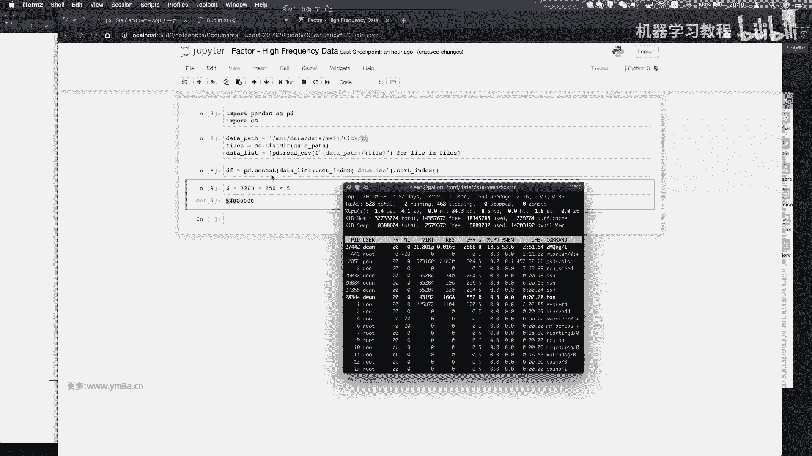

有一个并行的pandas as是有一个开源的包，然后呃有兴趣的话，同学们也可以去试一下这种pandas。

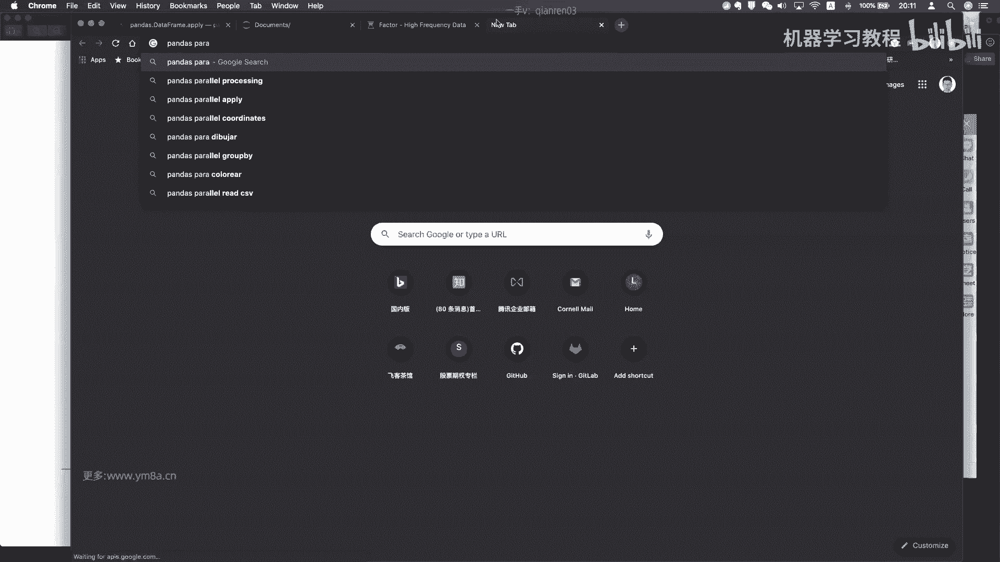

啊对是这个，就是只在LINUX跟Mac os上面支持对就，对啊，为什么还这么慢，之前跑不应该对，就就我我觉得大家就是说在做量化过程当中，就是啊遇到什么问题，都不断的想解决办法就是了。

而不是说这个事情我不会做，我就不做了，对，那其实在工作当中其实也是一样的，对，就是想办法去解决问题对，因为本身你做的就是探索性的工作，那可能现有的就是可能都没有现成的解决方案，或者说其实这个行业的嗯。

很多最基础的一些知识的流动性并不是那么好，并不像互联网可能大家还挺愿意分享的，那这个行业可能大家并不是那么愿意去分享，那这这样个人就是说在从业过程当中，需要自己去注意技术的技术的积累的，嗯好吧。

我是不是应该不用去读这么多数据，可能给大家演示一下，读嗯就不应该读那么多数据，但其实之前读过也应该也是OK的，啊好吧，还是memory error，那我们嗯，嗯memory error。

32G内存也不够，不应该啊，我看一看，还有什么能称的没见，嗯嗯好的，那就，如果是这样子的话，我们先读一部分数据吧，Alright data list，选那停一下停掉，不能把它一次性都漏了出来。

对然后呢我是想看files对对，然后如果说我没想，呃读到那个，比如说我们读2014年吧，I'm sorted fes，看一下，我不知道这个能不能S，OK是可以的，我们去前200个好了。

thirty five嗯，但是这样我已经读完之后，我不知道它在data list里面的顺序，嗯我需要怎么来做呢，怎么来做呢，其实我现在只想读2014年的数据，嗯好吧，那再重新读一遍吧，好，然后再去。

这样应该会好一些吧，哦好的，然后再去，刚刚的是，这回再读应该没有问题了，Df dpdk cat data list，然后围绕的是，Set index date time，然后是sd index。

What the h，先把它，好的，我是不是要把JUPER先去关一下，嗯不应该啊，这个问题memory error，嗯我看一下行好的哦，那大家先休息一下吧，然后我来把这个问题给解决，我们08：

30再回来继续嗯。

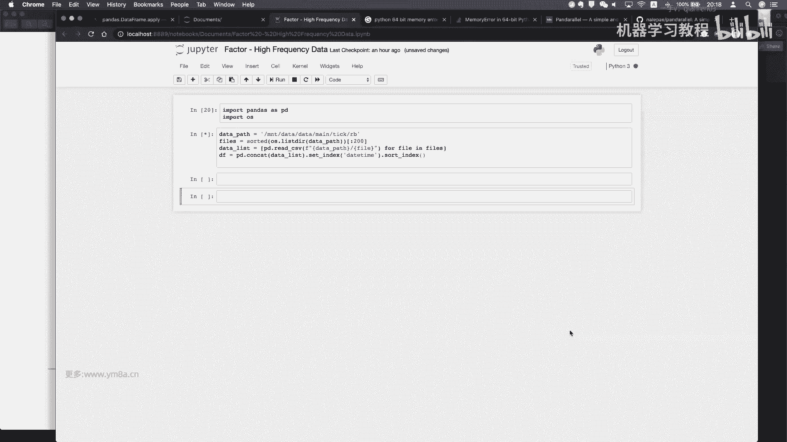

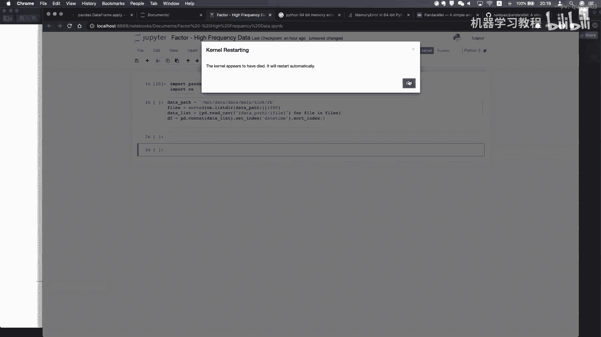

好的，然后我们现在回来，对其实刚刚那个问题我想了一下嗯，把它放到一个CEL里去执行的时候，它是可以去load所有的数据文件的，那很有可能就是说嗯，我不知道JUPYTER有没有。

在于说对于多个命令去运行的时候，他有没有去做优化，对可能中间有些步骤是会被优化，那可能这样的话就是说没有保存中间步骤，那这样的来说内存可能是够的，所以现在是呃如果说我们看一下tell的话。

对一直到2018年的数据都是有了对，然后对那这样子的话，差不多整个我看一下DF的长度，对总共是4592万行数据，就是一个品种是4592万好对，然后这个还只是主力合约对，所以所以所以就是说。

当我要去做配对交易的时候，那涉及到多个会员，那其实对于计算机内存的要求还是啊有挺多的，呃需求的，当然嗯你实际上再去做回测的时候，你真的不需要把，我们现在df columns是有很多的。

但我我们实际在回你去回测的话，那可能有些东西是就是不需要那么多对，那那这样的话来说，我每减去一个栏，那都会给嗯节约很多的内存空间好的，然后我们现在还是来呃，我们我们上次做的跟上次一样。

其实我们要首先要做的是就是嗯，就是我们要去把我们的train和develop嗯给分开，还是去对DF点什么来着，Symbol，然后，Number two kers，嗯空tr我们还是嗯嗯用百分位数。

用75%来分吧，然后看看是第几个，七五乘以number two kers，train tickers等于，好的，然后train tickers先看一下对，应该嗯。

OK这里有个问题是嗯需要把它去做一个set，我们只需要去重的结果对，但这样可能会有一些问题嗯，这样是对的，然后我们这是我们的training set，然后嗯嗯然后就是呃是这样的。

就是就是嗯我们先来看一看，这次我们要定义的这样一个，我要想定义的其实是嗯我们先看一个盘口吧，DF还是对，其实我们这次想用的是我们直观直观的信息，是来说嗯，盘口除了就是我们的这个tick的最后的成交价。

Last price，其实盘口也会给我们很多丰富有用的信息，bid和ask对，一个是盘口的spread，就是ask跟big差多少，还有一个是咳。

bit和最优的bit跟最优的ask之间的volume差距对，就是你显然就是说，如果我说我被额数量远大于ask的话，Ask vue，那我相当相对来说是说其实是有比较强的一个，就是买盘在盘口的对。

所以嗯然后其所以其实说我们是可以用呃，用这个数据来想办法去设计一些因子，我这边可以简单的先举一个例子，嗯我我叫他嗯嗯bask in balance，就是我想利用bid和ask之间的呃。

不平衡而不平衡的这样一个关系，咳对呃，他的parameter是um beat and price，ask嗯，Get volume，我们就按这个顺序来吧，然后我要做的事情呢，我要return是什么。

是DVOLUME减去ask volume，Divide by，就是我先把他normalize一下，not nice by两个的和，然后我再去想一想嗯，对我再要去做，就是说我想要设计这样一个因子是。

嗯想要设计这样一个因子去，就是说能不能把，盘口的，我只是随便写这样一个印子啊，呃ask price减去big price就是一方面价格的，比如说量是很重要的，但同时嗯我们认为这个价差也是重要的对。

然后同样的再把它给，class price加上gate price对我设计了这样一个引子，对然后然后接下来要考虑的事情，就是说我们怎么去嗯做这样一个事情嘞，就是我怎么去把它嗯。

怎么去把每一行就是都算出这样一个因子对吧，就是嗯我我们先用就是呃直观的来说的话，其实嗯有一种想法，就是说嗯就像我们上一节课一样，嗯我是可以给我们的，我我我我们这次就先只取一个。

只取data frame的前1万行吧，就我们先为简便简便处理，然后我们上一次的操作是，我们会直接给它加一个栏目对吧，然后然后我们在做的事情是嗯，相当于说我们就把上面的公式又重写了一遍，对。

这这这是一种可行的，我不是说这个不可言，这是一种可行的方式对，但是如果说我们因子每个都多的话，都很多的话，相当于说我都要去手动的去写这样一个东西，可以可以就是说，但事实上我们是想要说呃。

我们去统一我们多个因子，我们统一的input都是一个肉，然后根据我们我只要去指定我的funk，我的function是什么，然后他就能计算出我的影子，这是事，事实上我们希望的是比较理想的这样一个途径。

那我们先看就是按照上次的嗯，我直接复制吧，就是把这个复制过来，前面加一个SDF，对就是我这边都是注意要用它原来的参数，这这这这显然是一种可行的路径啊，对，就是你相当于说我还是去根据我的合约去loop。

然后每个合约去单独计算对，然后然后还是再次强调一下，为什么说我们要去呃，针对每个合约去loop，然后就是就是说嗯，我们我们不能简单的就是把这这样一个data frame，默认为是一个连续的单个合约。

中间涉及到主力合约切换的问题，这样的细节就是处理还是非常非常有必要的，对，就是你不能把如果主力合约切换，显然你不能把他们的return直接就拿下一个bar减，算上一个除以上一个bar。

然后你来算这个return，这里显然是显然是不对的，对，嗯希望没有写错，好的，嗯然后我们看一下SUDF，嗯嗯有什么问题，好像我肯定哪儿写错了，肯定哪儿写错了，不然不应该这样子。

OK我这边没有取到前1万行，只取得了第1万行对吧，然后okay，This works，这就是我们有这样的一个big mask in balance，然后然后我们上一次就是接下来要的。

就是说我接下来要做的事情，就是上一节课，我们不是说我们是拿next return去做对吧，那事实上你tick也可以去拿next return，就是说你拿下一个tick去预测，但显然来说我觉得就是比较好。

也也可以尝试的一个思路是，如果我去做纷争策略的话，我其实可以去预测的是他的correlation，跟120个tick，也就是一分钟之后的correlation对，然后事实上说我到底预测一分钟。

还是预测30秒，还是预测十个TIK，这里面有很多尝试的空间，但是呃你基于不同的周期去计算，你试试，你就能得到不同的因子的这样一个预测值，嗯就这部分是给大家去尝试的，然后我这次想强调。

就是说你我们我们在计算就是多个因子的时候，嗯除了用这种方式来做的话，其实我觉得更合适的一个方式可能是用一个嗯，就是要嗯还有一个funk的方式，呃，就是呃我不知道大家有没有用过。

就是嗯pandas apply，哎这这这这个还是有用过的，同学们，因为大家熟悉它怎么用嘛，就是就是说我我我想是说，我每次我不管是针对一行还是一列，然后我给一个传传进去，传进去一个funk。

然后就能根据我们这样的东西呃，根据我们的function去算出我们因子值，实际上这这这个apply这个反函数是非常常用，尤其是说用在我们计算因子的时候，我觉得是相对来说比较呃好用的一个方式。

就是大家可以注意的，就是说你我们上上节课不是提到有国泰，191，还有101的因子，如果说是呃，只是只是只，如果有一些因子是可以，是时常用这种方式来去做的。

你可以把你的每一个因子都写成一个function，然后然后把对应的function名字传进去，你就可以去计算，这样因为这样相对来说处理起来会更高效一点，高高效一些对，然后就是让我们来看看。

这个用funk的方式该怎么写，就是首先是我们这样的因子计算方式，我们传递的是一个roll对吧，就是所以在这边的话，其实um to bid ask you，Balance to，我希望做的是。

Uh sorry sub df，对吧，然后我的funk是，呃funk是什么，是被asking balance这个函数，什么意思，就是嗯color嗯，columns access呃。

Index to default，是zero，就是我们应该是要做的是zero，那这个就可以不行，因为它是default，然后我们要做的事情就是说嗯对，然后你看他传进去的话，如果我传进去是一个肉。

那相对来说呃，那同样就是说我要注意的是，我这个贝塔imbalance，它的parameter，就是它它传递的parameter不再是这四个值了，所以我们可能需要先写一个这样一个，嗯先写这样一个函数对。

那我先把它给复制过来，因为，比如说我这时候传进去的是一个row，对我传进的是每一行，这个要注意对，然后，然后要做什么事情嗯，这边有一个参数是要注意的是raw，你用的是defaulce force的话。

你就是把每一个行传传递成一个series，然后我个人比较喜欢的是呃，就是用这种这种就是default这种方式，就是我不希望它传进去一个囊牌尔瑞，我希望传进传进去是一个呃是一个roll。

那这样的话嗯嗯你其实如果你不知道的话，我觉得很简单的事情，就是哦我print一下是什么东西就好了对吧，嗯OK让我们看一下这样是不是可以work，Uda new balance，我是不是哪写错了呀。

new balance funk哦，这个东西我都没有，Um big asin balance，Ubalance two，就是你不知道要传什么的话，你先看看他，OK你print出来是一个row。

然后date time的object，然后他又出错了，他说你不能这么传嗯，嗯谁哎，我这样是不是我看一下我传进去的是什么东西，对，你是一个pandas series，OK那这样就OK了。

然后看一下我传进去的，那我其实要传的就是找到对应的这个column，就OK了对吧，它是一个int嗯，嗯那这样还是不对的，还是要把刚刚那个，把刚刚的就是一个parameter给加进去。

对嗯如果是把parameter加进去的话，就是说嗯我还想做max c4，FX应该是xxx就这样的话对这样子的话，OK这样子是看上去是呃，这样子看上去就对了，因为我肯定显然就是说。

我每一行print出来的应该是一个相同的值，那接下来我们要做的事情就是把BVOLUME跟，呃去直接assign给不同的肉就OK了，把肉第几个元素就OK了，是多少，我们刚刚还说来着。

让人看一下他这个columns嗯，colon前后，我不知道是不是可以这么写啊，Reprice one index，那你既然是个index，我就把你变成一个list，OK14是第14，所以那我们就知道了。

就是既然bad price是第14个的话，那bit volume也就是相应的就有了，我们就往后写就行了，对就是我这节课其实是就是想告诉大家，就是如果对PROGRAMING没有那么对属性的话。

就是我们其实讲的是说怎么去解决问题对吧，因为谁也不能就是说呃一次性就把问题给解决，但是就是在engineering的过程当中，就是不断的去迭代，看自己问题在哪，然后想办法去解决问题。

这个能力可能是大家长要去培养的，那如果是这样的话，对，OK后哎主要是算完了哈，那我看一下sub df嗯，这两个算的OK呃应该是算的一样的对吧，这样代表我们的计算是没问题的，嗯好的。

其实这个简单的例子就是说计算这样一个take呃，大家可以之后去课后去测一下，按照之前的方法了，你可以去测一下，就是跟我的return correlation，那那那这边要注意的一点是。

我这边没有cos price对吧，嗯我用的都是那个last price，你你可以用last price去来做嗯，做return，然后然后一般来说你用tick数据做的话，你预测周期嗯不能太短，也不能太长。

不能太短，意思是我预测一个tick，我显然是说我拿近几个tick的数据，去预测下一个tick，那胜率可能会，那我觉得就是这个correlation会非常高，但是嗯你你可能就是说覆盖不了你的成本。

你比如这个TIK价格就没有变动，只是盘口有变动对吧，然后或者说这个tick就是价格变动比较小，那覆盖不了你交易手续费成本，我建议大家是你可能稍微预测的时间就长一点，就是比较怎么是合理周期。

到底是60个TIK还是120个tick，还是30个tick，我觉得这个都是你要测试研究了之后才知道，然后你甚至不同的因子嗯，就是你看他基于多，对多少周期后会有比较大的影响，对那这个例子是就是告诉大家。

就是说我这样一个high frequency data，我可以用这些这个去嗯挖哪些数据对，那嗯这边只是一个简单的内容，就是被嗯big price big volume这些数据来做，那事实上就基于它。

你是不是还可以去设计出其他因子呢，比如说嗯你当前最优盘口变化了多少对吧，就是我们你之前凡是说用分钟的price变动的，因此其实我们在这边也都是可以去利用的，我的价格变动了多少对。

然后你你你事实上也可以根据这样一个盘口，去算出一个当前盘口的加权的一个平均价格对，然后你基于这样的平均价格，去计算价格的变动趋势，因为事实上盘口的价格呃，就是在当前这个snapshot。

这样的价格是比你分钟的价价格，可能说呃，它就是说更能反映出，你在一分钟之内变化的一个趋势，你可以计通过计算它的加权平均价格，反应，反计得到这一分钟之内整个的市场的变动，这样一个情况对。

然后呃事实上就是说如果你想要去抓那种。

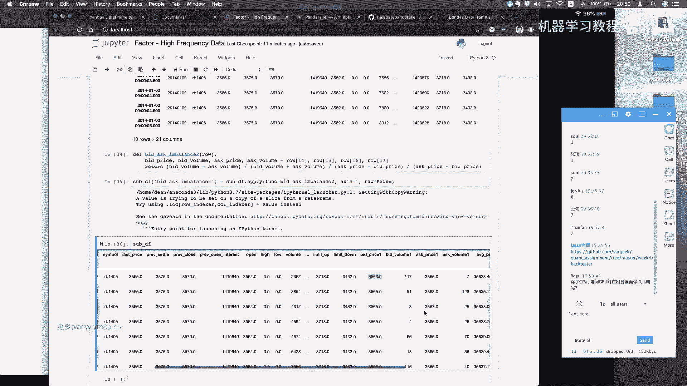

对像这种的话，你市场你是可以考虑用这种tick的策略，去把他给抓住的，呃，你要去找这种，你看大部分时候就是说相对来说，他变动不会特别大，这是tick的这样一个金融数据的一个。

也是说是交易的一个比较比较特殊的，这样一个情景，你大部分时候你可能只是在不断的去抖动对，但是如果出现大的波动的时候，我们往往是想去catch，那这样的时候你可能只有用，只有用tick才有可能去抓到对。

因为你发现你你你你比如说你设计一个特征，叫连续三个tick的呃，价格都比上一个高，对那只有那只有这个因子，你你是可以用tick去抓住的，但这个如果是在分钟的话，你可能就是说这个事情已经结束了。

做完了这一分钟，你可能才会才会去抓到这样的特点，但是用tick你可以考虑去去抓，当然这个还不是特别典型，因为罗文经常会有那种呃大涨大跌的这种，比如说诶一分钟就是变动了几十个点，那事实上你用tick的话。

我觉得抓起来会就是可能会更更有一些优势，对就是说我日内交易，我不一定说是每个tick都去发单，但是我可以辅助的利用这些tick，去更快的抓住信号，以及去增加我的因子的这样一个丰富的程度。

因为当大家都在用同质化的分钟的数据值，计算的时候，那么嗯你们得到因子很有可能也是去同质化的，那即使说嗯我们不用嗯，就是说即使我不用tick数据，那是不是也可以考虑说，我从tick数据生成新的分钟数据。

嗯来去来去采集这些因因子呢，那这是什么意思，就是说比如大家计算分钟数据都是从整分钟，比如说22。00到22。01，那我是不是也可以用22。30呃，22。0000分30秒开始，然后以这样一个。

以这样一个就是非呃整点的这样一个分钟，作为作为切分的一个时间段，嗯嗯去尝试一下，这样的是不是有可能做出一些因子，因因为我自己观察到是，以前就是有一段时间就是在反就是在30。

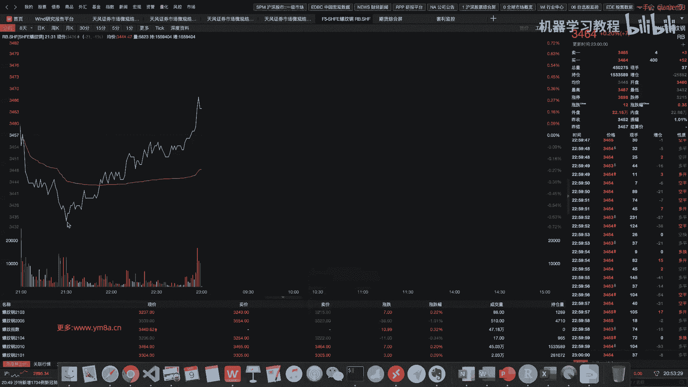

会有这样大的波动，呃不好意思，刚刚蓝牙蓝牙断掉，现在大家能听得到吗，我看一下，刚刚蓝牙好像断了一下，OK呃我继续对嗯。

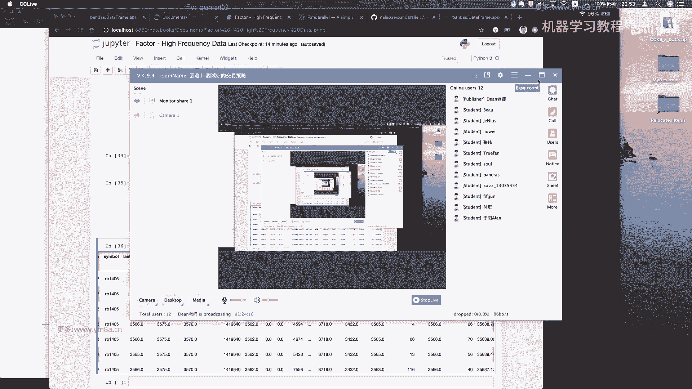

好的就是就是说呃，呃就是说市场是不断在进化的，当你用相同的30分钟或者一分钟数据，你会发现整分钟的时候，可能正好市场就会有这样的波动，那这个说白了可能就是洗盘，就本来说你故意你你这边有一个止损单挂在这。

那很有可能，这这个33435价格就把你打掉了，对，但事实上说如果你你考虑说用不同的分钟，你那你可能就有可能会去避免规避掉这种波动，或者说你想要去利用这种，你想要做的。

就是说我抓的在整点数的整整点数的时候，这样一个反转对，所以就是说嗯我觉得一方面是大家去观察市场，然后根据市场得到的数据去验证自己的假设，然后不断的去迭代，然后挖掘因子，可能就是这样的一个这样的一个过程。

然后至于说我们现在挖的因子，怎么跟之前的回测给统一起来呢，一旦你觉得OK的时候，就是现在可能初期的时候大家不用考虑太多，你直接把你的因子转化成一个仓位就OK了，然后你可以简单来说。

你要可以要么就是非多即空，要么你可以说你可以把你的因子设一个阈值，然后达到一定程度的时候才会有多油空，然后甚至你也可以考虑说不同的因子强度，对应不同的仓位的呃，仓位持仓的数量，这也是可行的对。

然后呃就是高频的因子，对我觉得是，然后高频的因子你不一定说是我计算出来，高频因子，每一个分钟，每一个TIK都要去下单，你可以去当3down sampling，你把高频的音节转化成一分钟或者2分钟。

甚至5分钟的这样一个呃这样的一个信号，然后隔一段时间去下单，对那那只是说用tick的一个好处，是，你可能能比别人更快的去抓住这样一个优势人，那那比如说你等到你如果是5分钟，你可能在这边OK过了5分钟。

过了两个5分钟再反转，但你如果用tick的话，你已经很快的确认了，说这样一个反转趋势，那你可能就会把你的空单平掉，改为开多单了，我只是举这样一个例子对，所以就是大家在做呃因子挖掘的时候。

可能还是要去多多思考，然后另外另外一方面，其实我个人并不是特别鼓励说用呃，复杂的模型呃，去，或者说用AI去去挖掘这样的数据，可能大概率得到的是一个过拟合的，这样一个模型。

或者说嗯或者说嗯不倾向于用复杂的模型，在低频的数据上，对你可能用TIK数据还好一些，如果嗯对，主要是因为是在交易的过程当中，本身这些这些市场的波动很多都是噪音，就是我们看到这样的一个级别。

在就是说在呃日内的这样一个级别，可能这样小的波动是一个噪音，但很有可能说你再放到更高级别的话，那呃你呃放到日级别月级别，你会发现，可能说你这样大的波动也有可能是噪音，所以大家就要看了。

就是你交易的时候到底是什么，就是很有可能说用复杂的模型，拟合出来的是一堆噪音，这个是比较可怕的一件事情，所以其实我个人的风格，或者说我一直建议的也是说嗯，大家还是从用简单。

有清晰明了的这些含义的一些呃因子开始着手，然后不断丰富自己的因子库，而不是说一刚开始就用简单的因子去拟，合出一个复杂的模型，嗯嗯就是事实上来看来说嗯，量化交易过程当中并不是像其他的行业一样。

不管说是你说比如说NLP或不断的呃，增加我的模型，可能之前RNCN就够，那现在然后上bird，然后上更复杂的算力对，因为嗯就是要注意的一点是，就是说深度学习跟机器学呃，跟量化交易不同的一点是很多。

我不管是在呃自然语言处理方向，或者是其他的一些任务，或者是下五子棋呃，下围棋，我们的目标函数，可能就是说我们的就是说结果都是确定的，但是在量化交易过程当中，很多就是说我们预测目标是不确定的。

这这样这样就是说用过于复杂的模型，可能会给自己的教育带来一些困难，对嗯，我当然也不排除说有人用很复杂的模型来去诶，来去赢得，就是说很高的胜率或者是怎样，但是嗯我我或者说我见的比较少吧，相对来说对。

就是没有说用到那么复杂的模型，可能大家着重的是说嗯，我能考虑说在因子层面上，研究出哪些能够具有强相关性的一些信号，那这样来说意义可能会更大一点。

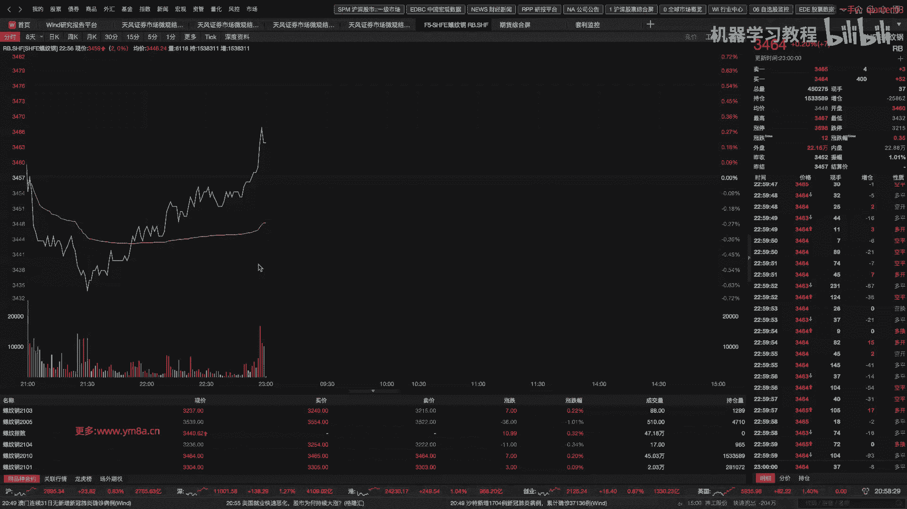

对这是我个人的一些观点哈，然后嗯那感觉那呃就是说高频因子这一块，我只是举了这样一个简单的例子，然后之后然后呃今天会给大家就是有一个呃。

我看一下有一个reinforcement learning的这样一个paper，而倒不是说让大家真的用这个呃强化交易的，那个强化强化学习的这种方式去做交易，只是我觉得它里面提到的一些因子还是挺好的。

就是有有兴趣的话，大家可以去尝试一下，然后我再次强调，就是这门课可能之后并不会给大家布置，强制性的作业有哪些，就是说说白了就是这这个东西，就是大家也是基于兴趣来学的，这个事情。

就是说哦本身我我个人也是很喜欢做大画，是因为他他是给他是一个，就是相当于你可以去无限玩下去的游戏，因为大家都知道游戏分为两种，一种是有线游戏，一种是无线的游戏，我我个人觉得量化是一种无限的游戏。

就是你可以去不断的去尝试，去探索，可以做很多有意思的事情，就不管是从你的系统层面，还是说从你的就是呃就是从你的交易策略层面，对这个是这个是对去年的还挺新的一篇论文，就是他讲了一个。

他讲了一个就是用deep reinforcement learning，然后在交易就是货，就是那个数字货币市场做market making呃，简单说一下market making的话。

就是可以说我们在市场除了我们的呃。

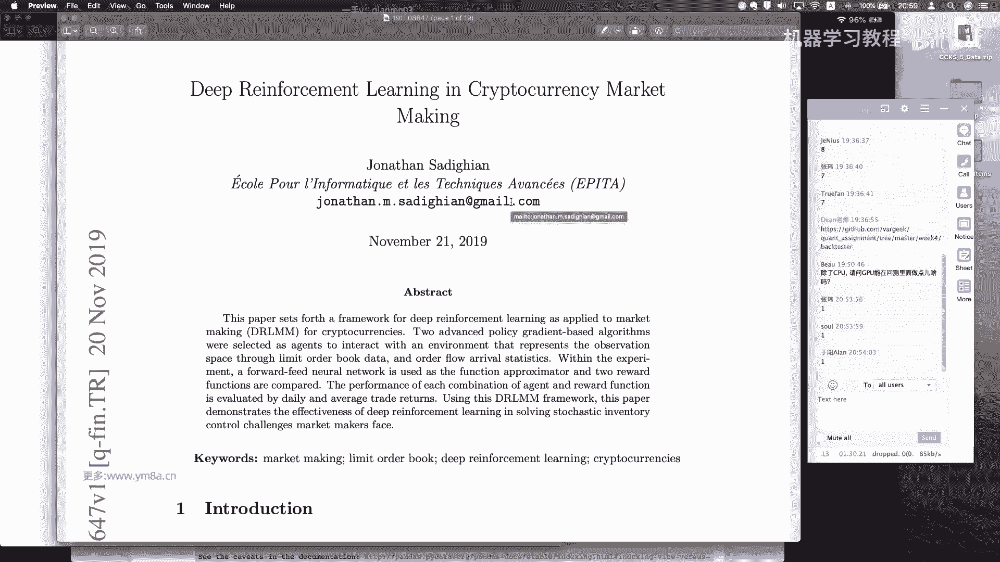

投机商的话，嗯也会有人就是负责流动性，就是说我自己我自己会在满意挂十首卖艺，挂失手，那可能期权市场更多一点，就是说这样的话，别人跟我呃，我不是我自己，可能呃我不去做嗯，我不去做方向上的判断。

或者或者说我只有我需要去对冲我自己，我自己的我自己的风险，就是我在这边的盘口买和卖都有成交，我我都是挂在那，我不会去主动成交，我都是我都是等着别人来去吃我的单子，那我赚了钱。

就是说我一旦买一和卖一都赚掉的话，那我就会去呃，我我就会我就会两边都会去赚这个钱，并且一般交易额做市商的话，会跟交易交易所的是有呃手续费返还的约定，对可能，并且呢这就是说他呃。

因为我本质上来说我给交易所提供流动性，因为对于不活跃的合约，可能盘口都没有什么人主动主动想要去买，那么做市商要做的事情，就是说我在盘口都去挂上我的单子，这样有人就会这样，有人想要去在市场上投机。

主动成交的时候，就可以跟做市商的单子去撮合成交，这样能促进市场流动性的发展，对呃所以做市商赚的就是这样一个钱，那做市商其实嗯，那那那显然来说他们都是要去高高频率，那当然也有一些人是。

就是说其实你频率没那么高，嗯你结合一些人的手工作事，事实上也是存在的，就是在尤其在我这，我记得是在期权市场，是那中国可能还有一些团队是在用呃，手工加机器结合做单单的方式来做事的方式。

那做市商的核心可能就是说他要去，就是如果是期权做市，那肯定要去说你要去对冲我的风险，因为我持的是持仓的是一揽子的合呃，持仓的是一揽子合约，对就是对。

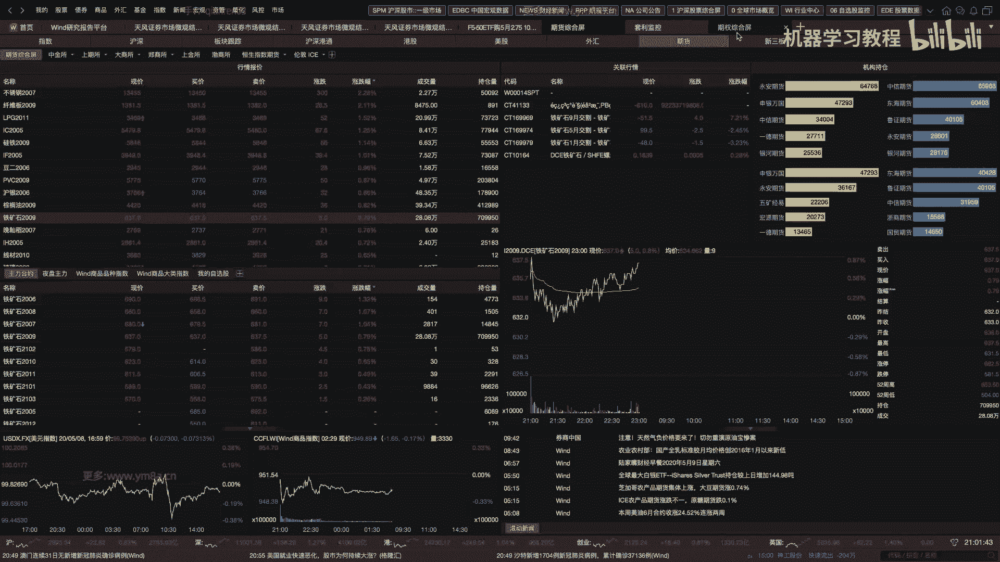

就是我有很多很多的合约，然后我不同的合约不同的风险，然后我要保持我的总的持仓的呃，就是头层上面的再跟，不管让各个GREKS上的风险都是呃，在我合理的risk budget之内对，所以这里插一句。

就是说做市商在做的这样一个事情，然后这个paper里面就是说他讲的是说高频做市商，他会用哪些因子来去做这样的事情对，然后这个他因为他们是完整的order book，我们这边只是一个snapshot。

但是还是可以去参考一些，就是他们它涉及到的一些因子对，就怎么用big dusk去做因子，然后大家可以去测试一下，这些因子是不是OK的对，好的，然后就是高频因子的话，我肯定就是先给大家讲到这边。

然后这个这个东西我是呃，这个paper是待会可以发给大家，然后大家现在对于这块有什么疑问吗，这就是呃我觉得课的核心就是研究的核心，还是说要重点关注的就是提升自己的研究能力，去想办法去找到影响市场上。

唉你要去了解这个市场嗯，找到去影响价格走额变动的一些因素，然后把它就是去研究，去把它去finalize下来，对然后一旦你的因子库积累到一定程度之后，你再可以去把这些因子去组合去做交易。

那相对来说会呃会容易一些对嗯，嗯当然也有人说说，有人说就是嗯对忘了，其实就是跟之前的，就是说我们的回调系统怎么结合起来，一方面是说比如说我们第一节课，就是前面两节课做完。

说用moving average，就是说用简单的规则，那其其实这本质上也是一个因子了，用简单的规则转化成多和空，那你这边因子的话，你事实上就可以根据因子的值，然后来去做cut off。

你去根据因子的这个值来去做统计，然后包括我们接下来会讲一下，就是我们最简单用线性模型，怎么来去做这样的一个事情，假设我有了很多个因子之后，对其实简单来说就是做一个线性回归，对，呃现在大家有什么问题吗。

那个嗯好嗯，没有没有问题是吧，然后然后今天我给大家讲一下那个呃，大家对那个机器学习熟悉多少哈，哦或者不一定进群就线性回归吧，因为我们今天这节课其实主要就讲一下那个，我我觉得主要讲一下就是线性回归。

就是linear model，我们怎么来怎么来做的对，OKOKOK这个是，OK然后下面这个是这个是噪音，诶稍等一下啊，为什么这个notebook2能同步过来，OK好的，然后。

那个大家对线性模型了了了解吗，嗯就是了解就是了解过多少吗，就简单的线性回归，或者这样我给大家简单go over一下吧，就是要做的事情是什么，对，嗯不可以，位置，就是其实简单的。

LIN年regression的话，本质上呃，我们要做的事情，就是说我们现在假设，就是说我们现在这样一个X，是我们的因子矩阵，然后他是，啊让我想想是嗯，m by n据说我们有N个feature。

就是我们上一节课，比如说我们测试了很多feature或者是factors对吧，然后这个M是说我们的一个我我们每一个时间，每一个时间点，我们叫每一个样本对，然后嗯然后每一行代表的是，因为X都是列强。

所以用一个transport代表是一个行向量对，然后就是这这个X1什么意思，就是在时刻一的时候，它呃我们有有维度为N的这样一个因子对，那其实就是说来说的话，就是说我们想要做的事情，就是说。

去线性线性回归是说想要做的事情，就是说嗯我要去找到一组parameter theta，然后，然后theta呢呃我可能加一个零，就是加一个零的话，就是说我会希望有有一个X0或X0，可以等于一对对。

那我本质上想去做这样一个事情，对，就是说我想要去找到一组呃seat，然后然后我的目标是什么呢，其实是我需要是最小化我的真实的这样一个呃，我们我们上一节开始讲的，就是说有一个我们的一个Y预测目标对吧。

我可以是LORETURN，然后我也可以的，可能就是呃log return，我也可能说是，就是说比如说是120个tick之后的log return，这这这就是说我们的预测目标，肯定是要去自己去定的。

对然后然后这个哦Y的话显然就是是RN对哦，sorry r m因为有M个样本对，比如说我每一个时刻我都预测出，都有这样一个有这样一个预测值，然后然后然后就是说我现性回归的目标。

本质上来说我需要找到这样一组参数，去最小化我的嗯，最小化我的这个是呃这样的一个预测的误差，呃本质上来说就是用machine learning的话，就是说他有这样一个cost function。

然后我要做的事情就是说这样吧，我们有M个样本，然后我要去嗯，sorry只能用用capital x嗯，我要去最小化呃，我预测值跟额真实值这样的一个误差，这样这边是Y1Y2对，然后我用的是平方对。

用的是平方，然后一般machine learning它会在前面加12，这个是为了你在就是求，如果你用那个呃gradient stockcast，那个那最优的话，它前面会有个1/2和方便你去求解对。

然后然后就是本质上来说，这就是我们现已回归要做的事情，我我我们要做的是minimize呃这样一个事情对，然后如果说我们再回到那个回到我们的code里来，怎么来做这样一个事情，就我们接着会，我们接着呃。

上一课的嗯，接着上一课的对，好吧，我们从头开始，Load feature，这是我们上次就是拿了这么多特征，我我只是简单来拟合这样一个那个linear，Regression，就事实上这个因子还都挺粗糙的。

并且它们的相关性还会有一些问题对，但是就是说我们实验是OK的，然后一样的load数据，嗯就是分钟数据应该会快一些哈，对就是其其实就是说嗯，就刚开始你可能粗糙一点，我们这么去去写这样因子是OK。

然后其实我更希望的是说就是呃我们抽象出来，你还是去调一个function就行了，就是你用apply的方式，你每次用一个apply，然后你把你所有的因子呃写在一个函数库里。

就是你写一个叫factor点pd这样一个文件，然后每个因子是一个function，你到这边的时候，你只要是嗯DF呃，dot apply就行了，对就这样相对来说你代码会挨elegant一点。

也有有助于你后期的维护，当你就是你要新增新的因子的时候，你不需要再对这一堆代码去进行逻辑处理，你只需要你对你因子的呃，那个文件去进行处理就好了，这这这这也是就是呃在机构里面。

就是我们之前做交易也是这么做的，就不会去把它写到这样里面，这样这写，那你研究的时候肯定是可以，但生产时候肯定是不行的，对好，load完了，然后CONCANDIDATE，然后TEERS。

然后把所有因子算一遍，算完之后对，对然后我们先不用先不PC，先不用PC，我们先直接就是，teacher analysis对吧，然后就是我这边做的事情，就是说呃我这边用了两个return。

其实这两个就是你也可以对比一下，就是应该算下来是差不多的，就是我会算一下，就是嗯嗯算一下每个因子的这样一个的呃，我们先说一下，第一个loop是每一个每一个factor对吧，我们对应的每一个factor。

第二个是呃对于每一个ticker，就是因为我们不是有多个合约嘛对吧，我们需要对，就还是说的我们要需要分和一个计算，包括这边也是计算我们算因子时要分合约计算，因为还还是说你不能引入其他factor。

就其他呃其他合约的这样一个数据，你因为我我们这边的话就是嗯你rolling的话，你如果向前，而你rolling了20个，你用其他的肯定是不行，所以这边要先先filter一下，你把它过滤一下对。

然后这边然后这边是我先算一算，就是算他的嗯，嗯就是算他的，就是correlation coefficient对，然后我把它对每一个每一个，每一个tick去取一个平均值哦，应该是plot得到这样一个图。

就这这个我是想说明，就是说你时常用log return跟return的话，其实区别不是特别大对，但那用log return就是有一个好处，是你不同的return之间你可以相加，这样算起来可能会方便一点。

就是如果嗯现在用不到的话，你就OK，但用到的话你自然就明白我说的是什么意思了，对然后然后然后说线性线呃，线性模型的话，本质上就是说线性模型，本质就是说我们要去做的，其实就是说我们刚刚看了。

就是写写这个公式的话，嗯掉包了是OK的，就是显OK的，你用linear regression去呃去fit一下就OK了对吧，你完之后，然后你得到他的school，然后然后你也可以得到它的系数对。

其实其实线性模型就是说呃，你本质上我要找到这样一组呃参数值C塔，那有了这样的一个C塔值之后，我就可以去拿新的，然后在development set里面，就是我可以拿新的新的这样的数据去算出特征。

然后乘以我这样的parameter，然后给出这样一个预测值，这样这样这这样其实简单的来说，就是这样一个线性模型是闭环的，对，其实你要做的事情，就是说，你仅仅是把我刚刚刚下面算出来的parameter值。

放到前面来呃，就是放到前面来，然后你再去去，然后然后这个时候你如果真实真实交易的时候，我们已经得到了一组呃，THEA就是CA值，是我经过training set已经得到了，我已经确定下来了。

然后真实交易的时候，我拿这个theta值，然后根据我实时得到的行情的这样一个，实时得到的行情计算它的特征，然后根据theta值乘以这样一个特征，我得到了我的一个Y，如果说我觉得这个ya呃。

好像这个接下来的，我预测下一个分钟的log return会很高，那我可能就会调整调整我的仓位去买入，这样其实这这是一个简单的这样一个呃，linear regression的这样一个模型。

对呃这这部分应该没有什么问题，因为我assume大家其实都会知道，就是呃线性模型是怎么回事，就是本质上线性模型其实就是你要去呃，找在就是去，就是你要找的是你如果你用二维的话来说，就是你要去找这个点呃。

去拟合这样一条直线，然后你这个点到这个直线的，你这样一个军方军方的距离差，要是平均下来是要最小，它本质上几何意义上就是这样的，然后你是如果你是多维的话，只是把这条线换成了一个hyper plane。

换成一个超平面，对其实本质上找的就是这样一个事情，对嗯嗯线性模型其实嗯大家要看到，可能就是说我们这样算下来的model的，可能就是结果他就是呃呃就是我们算下来。

就是他的这个ASSQUARE可能不会特别高，对那阿斯科尔不会特别高，他当然就是我觉得不用担心，就是它并不会像我们做化学或者物理实验呃，严格的都是说我们的阿斯skirt，能够达到0。99几。

我们可能现在阿斯克尔只有0。010。02，那我觉得都是OK的，因为本身这就是体现了金融数据的这样一个呃，特性，就是嗯就是低信噪比对，然后其实我们并不care说阿斯科尔。

就是我们真的不care阿斯科尔是零呃，是说要特别高，但是你其实更关注的是我，如果你能找到一系列因子，让阿斯特，比如说有个0。03，0。04，那事实上我觉得这经是非常好的一个效果了。

当然奥斯科尔也跟你所取得预测之前，我们讲到跟你取得预测的长度有关，如果说是你用呃高频数据预测出来的ask square，那可能自自然而然可能会好一些，尤其你预测周期又短的话。

那低频数据预测出来可能会比较难，但是呃相对来说就是说如果说你觉得你的嗯，就是你的那个ask square的话，嗯如果达到一定程度，你可事实上就是你通过plot，你也能看出就是不同的呃。

呃不同的就是看出不同的因子，可能说哪个哪个效果会比较好，然后你可以逐步的去考虑，说去你去测试找到优化，找到一些比较理想的因子，对呃线性模型可能就到这边去，暂时先到这边，大家还有什么问题。

然后接下来其实就是呃今天内容没有太多，然后接下来其实就讲一下，就是说我们有多个呃，就是我如果说我因子很多的时候，我怎么来去嗯，不就是或者数据很多，我怎么来去做我的dimension reduction。

其实就是如果大家知道PC的话，应该相对来说会好一些嗯，那现在我们先休息10分钟，然后大家有什么问题吗，就是有什么问题的话也可以，我们也可以微信语音，或者是把这个问题发到发到啊聊天记录框里。

反正这两节课大家问题比较少，还是说前和我比较担心，就是说还是说前面都听蒙了，还是怎么回事，对我没有讲清楚，那这样就比较不是很好对对，那大家先休息吧，好的，然后嗯LOGARY让我来看一下。

大家还有比较多的问题，OK就是说呃首先是嗯log return嗯，就是其实我在算因子的时候，就是这边我也我也有算lover，特就上一节课实际上是有的lover or也看一下，本质上是我先对对嗯。

你其实其实你看我是有两个log解嘛，对price直接是相减对，那呃这这个这个你如果是log的话，本质上就是说呃是下一个clothes除以呃，上一个clothes再去log对吧。

呃注意一下他不是那个不是不是对return to log，因为return是return是简易对，就是说我是对减一前面的东西取log，然后因为log1是零对，所以这样子就有一个比较好的特性。

就是说当我要算return的时候，你可以对两个人，那你想一下两个两个logo return相加是什么对吧，两个log return相加的话，本质上来说就是中间的这个呃cos被cancel。

你直接算的就是嗯就是2分钟的log return，这你只要相加就得到了这两个，这这是他一个比较好的性质，呃我不知道这个有没有回答，有没有解决这个同学的疑问。

就就就就是说呃就是log return确实是这样，算下来会会比较方便一些对，然后你说的平滑有就是你可以会把它平滑，但是事实上就是我们在看到回测，就是说看到这个效果时，其实差别不是特别大。

因为我们更加关注的就是说是关注他的呃，相对值吧对吧，你我用比了比，到时可能不同因子，哪个哪个因子预测效果会好一些，然后说除了用下一个return，其实刚刚我们有提到呃，我就是说这个是我预测目标。

本质上是要去也是要去思考的，就是有时候我说我做了一大堆模型，说预测下一个return比较难，那我是不是考虑一下，就是这个return是不是有lag，一直有有推迟的一些可效应，就是说我拿了这30分钟数据。

但我不是预测下一分钟，我预测下5分钟，预下预测下10分钟，我觉得这个都是不确定的，就是可能都要自己去尝试出来才知道对，然后问linear regression，实际上量化用的多吗。

我觉得就是说量化更重要的，就是说嗯你我觉得用的多不多，我觉得多，基本上大家都是线性模型，不会说是呃，就是说线性模型，因为相对来说，你我最明确的知道我在做什么样的事情，对就是如果我用非线性的话。

如果我中间加了个SIGMOID或者是怎样，就是要是你网络加了个非线性的东西，我可能就是相对来说不太不太清楚，知道我因此做了怎么样的变换，对，所以其实简单的线性模型。

你可以理解为它作为一个benchmark，对，嗯然后回测一下，我再问一下，就是说回测张伟同学说，回测一般选取历史长度有什么要求，太早的历史数据啊，对这是一个可行的。

对这个是一个我觉得是一个open question，就我我个人想，我个人的理解是说嗯嗯就这个要提到，就是说回测的话，有有一种方式说，如果说我们做的日内，其实有时候你也不需要用到说太久之前的数据。

那嗯你我可能比较好的方式是滚动的去做研究，滚动研究是我可能是说，就即使说是我有相同的策略，但我要去考虑这个策略的参数的时候，嗯那我可能就是说我用的只是近一年或者，两年的数据。

然后然后又到了下一个月的时候啊，比如说时间又过了一个月，那我再把新的一个月的数据给加到，我的历史的回测区间里，但而把回测区间里第一个月的数据给踢掉。

这个时候我相当于是一个moving window的方式，不断的去滚动，去去来抓取律师，而去做去预测或者是做训练，对这个嗯对其实我们本质上是希望的，就是说嗯呃是希望我们的因子是长期有效。

但事实上你应该做的事情是不断的，定期的去review你的因子，他的表现你可以看一下你因子的预测效果，是不是在随着时间不断的衰减，很很很有可能是呃，如果说现在竞争比较激烈的话。

呃几个月之前有效因子你会发现，过了几个月好像不行，然后但然后有的因子说嗯，嗯现在有的因子可能说是呃现在不是很好嗯，然后过了几一段时间又很好，过了一段一段时间又不好，那那这个时候。

我觉得就是说要把这个因子给踢出来，就是说你不能把它作为一个因子，你应该去研究呃，这个因子为什么我在什么样的时间段，它walk，什么样的时间段不walk，就是说影响他哦因子效果的这个因素。

你还是把得把它找出来，再结合这样一个因子，你得你得把它进一步处理，这样才可能它才是作为一个稳定的因子，而不是不然的话因子只是一个，也可能只是一个相对来说比较随机的一个东西。

它并不是真正的去能够解释你的啊，未来的价格的变动对，所以呃我觉得张伟同学这个提的还挺好的，就是说事实上就是陈述机构当中他都有嗯，应该公开信息看得到，就是可能大家做量化选股的话，可能都是有几千个因子。

对那几千个因子里面，可能用各种各样的方式去挖掘到的，然后他们可能定期，如果如果能力够的话，事实上应该是每天去review这些引子，来决定第二天的交交易跟仓位，就事实上有同学也说自己也去尝试过。

用机器学习选股，嗯不知道，就是说选股的话就要看，就选股是一个很很大的话题啊，对但事实上就是用机器学习去挖因子，这个我觉得还是OK的，对呃你对，因为毕竟相对来说，就是你还是可以用一些非线性的组合。

找到一些很有可能，比如说潜在的嗯比较有意思的一些印子，那这个就是呃基于遗传算法的，就是怎么去挖掘组合因子的话，我们可我们会在后面有一节，会涉及到这个东西对，呃其实其实我还是说你看整个讲到现在。

我还是更加强调是说是去找到解释性强的因子，呃，我我我个人的风格一直是重因子轻模型对，因为说实话我找到一个非常有效的因子，我不用特别复杂的模型，我也能把它去做，就是交易的很好对哦，我不知道哦。

我刚刚有没有解答清楚大家的问题，或者还有什么需要我进一步去阐述的吗，对对，就是还有这个就是包括嗯哇这个问题有点长，可以看下这位同学，这位同学对，我知道这位程序员同学好像做的还是挺好的，对的，多个因子。

呵呵不要着急，就是股票的框架，本来是就是下一周我们是讲的是组合，然后就是就是讲的是呃投投投资组合，对投资组合这一块的理论跟一些算法，然后接下来两周是股票多因子的，OK就是框框架会去讲。

但是然后如果如果说同学们觉得有必要，我可以把股票的提前，那当然也OK啊，就反正就是就是差一周的事情嘛，就多个因子找到一批交因子，时间序列上检验预测，然后，嗯对，我觉得如果如果如果这个同学。

就so我同学就是如果自己完全没有有过参考，自己想到这种方式，我觉得基本是还是挺OK的，因为嗯嗯呃有兴趣的话，之后我可以我可以单独发你一篇研报，然后之后我们也会去实现，就是怎么去实现这样多元的模型。

就是嗯除了就是时间序列上的对，有时间序列上的，然后事实上就是说我的因子，也有很截面上的模型对，就是嗯其实很简，那就是同样的一个因子的话，嗯就是我们因子分两种吧，一种是时间序列。

就是我自己呃一个一一个股票，我是按照类似于CCTA这种方式，我去找到一些因子对，然后然然然后是这么来去做交易，然后另外一个就是说我的同样的这个东西，我是去算ranking，比如说我算这个公司的呃。

这个公司的PEPB，然后我是跟同类型的公司去比对，然后你然后事实上也就是你所说的，就是说做多头部，做空尾部，但事实上就是在国内不是不能做空尾部，你可能只能去做多头部。

然后对基本的意思我觉得你理解是正确的，但是可能就是说在多音字的时候，你还要去考虑一些行业中心等等，就是是属于股票特有的一些东西，相对来说会比期货会复杂一些，对，然后嗯呃so灵魂同学。

我不知道有没有解答清楚这个问题，然后这这个就是说你呃其实不用不用着急，就接下来两周我们都我会有两周是讲股票的，就是多因子模型，就是我们怎么去构建股票的多因子模型，对，然后的话就是对对。

然后就是还要讲一个，就是说一个一个PC的东西，就是为什么为什么为什么要用PC，其实很有可能就是说嗯就是就是嗯PC的话，OK这就本质上来说，还是嗯如果说我真的有4000个银子，对我有4000个银子。

那我那我实际上事实上就是说我要去，那我我去去做这样的一个其实是做线性回归，可能都要费点劲对，那因子之间很有可能也是有一些，就是重叠或者是交叉，那呃就是呃其实是如如用PC的话。

是可以说是去嗯就是我4000个维度，我可能取了有效的，就变成了100的这样一个维度，对这这样这个是有可能的，就是这应该说就是说这是PC的一个主要的呃，这样的一个用途，就是如果说从原理上来讲。

就是说嗯就是PC要做的事情，就是叫keep the largest vance，就是嗯如果说我们是有x1，x2这样一个二维的这样一个呃数据，然后我们PC要做的事情，就是我我还是想强调一下这个事情。

他呃这PC要做的事情，就是说我有一个这样的一个线，已经有这样的一个线，对奔着这样的方向，我们到底应该选，就是我我要把从二维降到一维，我到底应该选红色还是选绿色的，就是本质上来说。

我要去找到这样的一个dimension，或者这样一个方向，然后能够，然后把这样所有的点去投影到这样一个，降维后的空间，然后我希望的事情是我所有的这些点仍然是啊。

Keep the largest variance，就是说它的variation variance是最大的，那显然这个红色的是这样，然后你对比一下，如果是绿色的话，我把它都投影过来的话。

呃大家显然绿色的点就是按照绿色的方向，大家还是投影在呃这样一个相对比较拥挤，或者说挤压的空间，这样显然绿色的variance是小于红色的VARI的，那我们有理由相信红色的这条线。

就是说新的这样一个dimension是呃，是保是保留了X1和X2里面，更多有效的这样一个信息的，这也这也是我们就是说我们PC要做的，这样一个事情，然后其实然后然后就是说我PC就要想的是说。

有一个问题是说我要到底要选择呃，我选择多少个维度呢对吧，然后这这选择多少个维度呢，就是PC我到底要做多少个维度呢，呃其实PPC本质上做的就是一个singular value，Decomposition。

就是SVD对吧，我本质上要要做的事情，就是我找了一个EXTRANSSPORTS，就是嗯x t x transpose，乘以X这样一个新的矩阵，然后我要找到它的I跟value。

然后其实我只要我决定我取多少个维度，我本质上只要看当我这样的特征值，占总体全部特征值的90%，还是95%的时候，我觉得就可以OK了，我觉得占占据了95%的，这样一个特征值，我这个时候就可以停了。

就是说我选取的时候，我到底要选多少一个维度对吧，因为我reduce下来，我一直都可以选到底，那但是说我我取我觉得取多少个维度呃，能够保留我大部分原来的特征的这样的，一个信息，对，额。

这部分就是我是就主要是想跟大家强调的，这样一个事情，就是除了除除了掉包之后，大家可能得思考一下，就是对对这部分原理的话，machine learning就是CS229那个课程里面，或者大家去找一下。

找一下PC的东西，应该就能理解这这样的一个东西，就所以所以说就是说可能呃，在应用机器学习的时候，大家可能还是得想一想，它的背后到底是什么样的一个事情，对当然我自己测了一下，好像这两个区别不是特别大。

但可能是因为像我们这个特征本身就很稀疏，但是如果说真的大家就是搞了有个几十个，几百个的时候，那那这个时候再测试一下，就是经过PC跟没有经过PC再去跑regression，那结果可能会有不一样的东西呃。

关于PC这一块，大家有什么疑问吗，就本质上我要做的是一个dimension reduction，对我现在就是假设就是assume，就是大家我们有有了几百个几千个特征。

然后但是我显然这几百个几千个特征不能都用，对对，或者说我处理起来比较慢，应该是PC解决是这样一个问题，我处理起来比较慢，我需要去对他去降维对呃要要强调一点，就是PC它跟呃。

我们强调的linear regression是不一样的，所以就是虽然它都是呃，就是虽然他都是虽然都是说比如说二维的话，都是就找这样一条线，但但但但要注意的，就是那个那个那个线性回归，是找到找到一条线呃。

穿过去的话，它是它是它是它是垂直的，这么来做对，这就不是说呃它是竖直来做，不是说垂直于这条线，这个这个大家要区别一下，这两个是不一样，就PC跟那个线性回归是不一样的对，所以这个要强调一下嗯，大家对于嗯。

呃我来看一下这个问题，如果我回测用moving window的时候，每个window都要做一次PC降维吗，唉这是个好问题，就是理论来说对嗯，事实上是说你为了去嗯，如如果说你是。

就是根据这样一个因子去交易的话，理论来说你要去最后去严格测试，还真的是呃，我得到了这样一个我每如果你真实交易的时候，你希望怎么去得到你的仓位，得到你的预测值，你回测的时候就应该准确的这样去做。

那显然是应该是要怎么去做的，那事实上你可以想一想，就是对PC，当然因为这样做的话，应该就是PC，如果你不降位的话，你可能算起来我觉得可能还会更慢一点。

你降完就是做做完dimension reduction，你可能算起来就是你还要先用，有个三甲可能还快一点，所以就是如果你真的是很复杂的模型，其实你回测下来可能时间还是挺多的。

当然嗯有一种有一种方式就是说是这样，你你可以完全不一定说你是呃就是给供，就是在回测时候，我们实际上是这样的，就是嗯嗯就是在机构里，就是如果我这个因子我确定是OK的话。

那我我不是把我的因子跟因子的计算跟回测，组合在一起，而我我我可能是有这样一个database，对就有这样一个database，然后我有不同的ticker，然后然后我有他的，我有他的时间。

我有他的feature，我会把它的因子全部都给计算好，预先计算好，而不是在回测的时候再去计算，对，那我是是这这是这是事实上就是这样，我的这是我的一个因子的数据库，我应该做的这样一个事情。

就是说我把我所有计算的因子，我觉得是经过研究有效的因子都保存下来对，然后然后然后你回测的时候要做的事情，可能就那那那就不是说是去再去算一子，我回测要做的事情说我刚刚不是说了吗。

我们是推market data，那我同样的，我在我在我在这样的一个时间点的话，我不仅要推market data，我还要把我预先计算好的feature都给加进去，对，那这个时候你事实上就是你已经。

你已经有预先算好的feature，对，然后但是PC降维的话可能还是避免不太了解，但是一般来说就是你可能更多的时候，有时候你回测的时候，你不会说真的把所有的因子都去给，就是去做大量的呃，就是大量的回测。

你在研究过程当中，你应该不会这么去做，当然你说你已经确定下来所有的因子了，你最后肯定还是要去全部算一遍，对在你研究过程当中，应该不会涉及到大量的就是因子，你研究可能说我这次只是测试单因子的。

这样几个测试，对，这样可能我我个人觉得会是更常见一点的操作，对，噢我不知道有没有解答这位同学的问题，对那你你如果是甚至会觉得就是说对，因为你你什么样的因子才会去存到数据库里，你一定是经过验证有效的。

而不是在研究过程当中发现呃，这个因子可有时而有效，时而无效，那那那这个因子是可能暂时不太能用的，对因就包括你就是实实盘在交易的时候呃，因子也是就是说如果我前一天的因子，我也是先你即使不用数据库。

你也要先用一个文件给存好，然后你开盘了，数据一来呃，直接直接拿你算好的，就是呃因子的就是你你线性回归算好的那些，Theta，就是你的这些值，你可能直接就拿过来就要去做运算了，而不是等对好的嗯。

这个其实就是PC这样的呃，就是刚刚讲的PC，然后然后刚才讲的就是线性模型的时候，就是其实其实其实讲的就是一个叫REGALIZATION，的这样一个东西，就是大家熟悉的话，或者在统计学里面。

我不知道是不是叫rich对rich regression叫领回归，然后还有个so，其实本质上就是我不记得记得，就说我们刚刚不是j of thea x，然后是有这样的，I等于每个sample对吧。

然后是y con，然后是xi对于第I个样本，我有一个预测值更真实的值，这样做一个平方误差，然后其实说我我在做优化的时候，你再考虑一下，就是嗯我需要去限制单个的因子的权重，C塔就是你不能过大。

C塔I不能过大，那我就是我需要去呃有N个theta，对我我会加这样一个限制，对就这样这样这样你说本质上加了一个呃，这是一个l two的这个normalization。

就是说我不希望我单个的feature，对我整个模型影响太大对，所以我加一个这样的一个限制，那那那对于这样一个loss function，就显然说当theta i单个的theta很大的时候。

你这个cost function的呃值会很大，通过我加了这样一个系数的话，我会就可以去呃，就可以去调控它的呃，就是调控它这个线性模型的这个参数的影响，但事实上我建议大家做一个事情，就是大家可以看一下嘛。

就是如果如如果long大等于零，本质上就是呃就是说这是我们的线性回归模型，那如果la increase的话，这个模型是怎样，我建议大家可以就是说我们你给一组long大值，然后去分别去测一下，就是看一下。

就是这样的呃，效果就是跟我们现役模型对比的效，效果会怎么样，我觉得这样测下来可能大家才知道，就是理论来说你应该看到的是，可能就是你的R平方，可能刚开始呃，应该会有可能会有类似这样的一个曲线，对我不知道。

大家自自己去测一下，可能才会知道对，然后同样的还有一个就是如果我可以，我可以用这个l two，那还有一个来说的话，本质上是我可以允许某些特征额为零对，那本质上我就用一个绝对值就好了，对所以这就是两个呃。

就是本质上来说，就是对于线性回归模型的一个基本的改进，对这个这个的话看个人你觉得要看这两个，因为CAI的话，我个人觉得老so可能会好一些，就是毕竟嗯可以可能会出现，就是说某些特征如果是重复的话。

我就不选择它，而如果是regression的话，我可能说两个特征一样的话，那我会平均分配对，当然差别也不是那么大，但我觉得这个东西还是要自己，就是你跑下来看这个结果怎么样，我觉得才知道呃。

就是关于呃就是regression，REGALIZATION的这样一个东西，大家有什么问题吗，就是呃这这这个东西不用不用自己去实现，就是掉包那个3k learn的话，就是我记得不错的话。

应该是就是呃sign key learn里面有一个呃linear model，对linear model，然后有一个rich就是做的这，那你就如果对它背后的原理，就是怎么优化感兴趣的话，我觉得也OK的。

那当然那个是属于machine learning那一块内容，就是我们本本这个课程不会去涉及，怎么去做优化，就是可能大家因为大部分人应该都是熟悉，他的工具包，会对比较属于他的工具包。

但我觉得就是呃就插一句，就是我插一句啊，如果就是想要对这个模型去深深入理解的话，我我建议还是可能，就是把它背后的原理去理解清楚，因为这样实际你在使用的时候，你也会知道它的优势跟劣势会在哪里，就是对。

因此自相关性高的话，其实本质上来说做的事情，就是说如果我有几个相同因子，我希望是说呃，肯定是，我觉得这两个肯定是比linear regression要好的对，但具体采用哪个。

我个人觉得可能是因为实践下来，我们实践下来可能也是拉soul会好一点对，就是我如果是两极端情况，两个一样的因子，那老so做的事情，可能就是把其中一个因子给踢掉，对这这部分就是一个是从统计的角度。

还有一个就是从machine learning的角度去看，但其实就是殊途同归嘛，好的嗯嗯今天我想讲的内容就这么多，然后大家还有什么问题吗，就是还是强调一下，就是嗯我我觉得量化还是要就是重因子轻模型。

我不我不知道其他人有没有是是做就是这个对，有没有有没有可能有其他的见解，但是至少我个人理解是这样，就是尤其在中国当前这个环境下，那当然就是可能，就是在实际业界工作当中的时候。

大的团队可能每一块都会分的比较细，那就关键看就大家自己想要去做什么了，我我觉得就是去找因子，其实还是挺有意思的一个过程，尤其是刚开始的话就是呃找因子有几个几个，那个有几个方向的。

一个是这是我们从呃现有的呃，然后还有一点就是，其实你是可以看艺考的那些论文的，而journal of finance等等，这些上面paper有一些就尤其是针对公司，对就是针对公司的股股票会有一些研究。

然后你其实去可以去测试一下，这边这里面的具有经过经济学实证的这些因子，是不是可能会呃更有意思一点，然后我个人其实不鼓励用那个数据挖掘，包括用遗传算法暴力挖出来的因子，当然作为刚开始研究初期。

用它来丰富因子库也是一种可行的路径对，然后还有一种就是呃你是在实际交易当中，你呃就是包括现在夜盘开了吗。

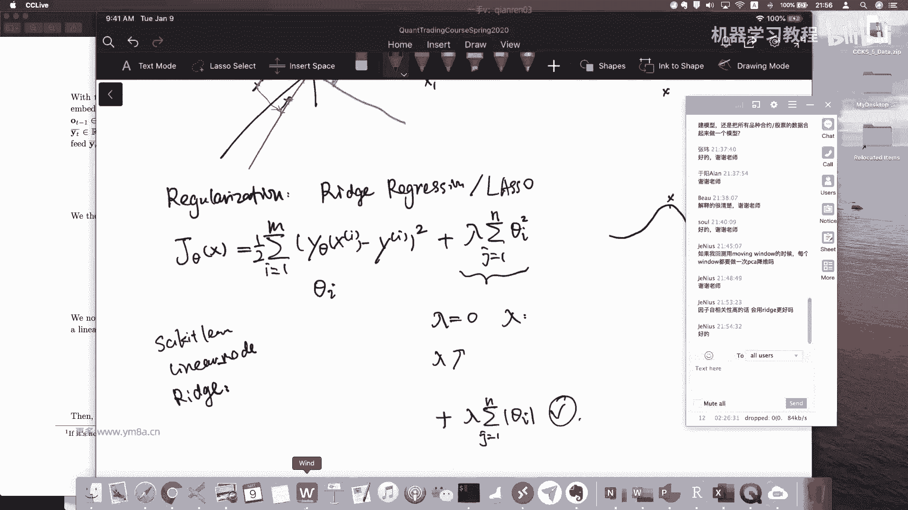

同学们其实晚上也是可以去看一看盘的，然后包括就是用cm now的话，你是可以直接登录做模拟交易的，你不一定要连CPP，你可以去模拟交易试试看，感受一下，然后或者我更建议大家是自己去开实盘，去感受一下。

就是我觉得交易交易，交易一些就就会自然而然的有一些想法，你就会去想诶，这样我就想抓这样的一个趋势，抓这样的一个波动，那事实对我，我觉得可能慢慢的大家就会有一些想法了。

这这这种想法也是嗯这样可能出因子比较慢，但是如果真的通过观察市场得到的一些因子，那它就会具有比较长的生命周期，然后刚刚也提到，就说你需要去定期review你的因子对，去评估你的因子。

就是所以所以说有时候也会去，你要去呃，就是看因子的效果，你可能也会用数据库去不断的记录去跟踪对嗯，就是整个量化是一个非常系统的活儿，就是会其中提到任何一小块，可能都要花比较多的时间，那刚开始的时候。

可能大家呃就是先建立起整体的框架，看看到底是怎么回事，然后然后再逐步逐步的，真的是有兴趣的话，那其实你可以逐步的去迭代改进对吧，包括我所说的其实也不是最优解，那很有可能业界还有其他的解决方案。

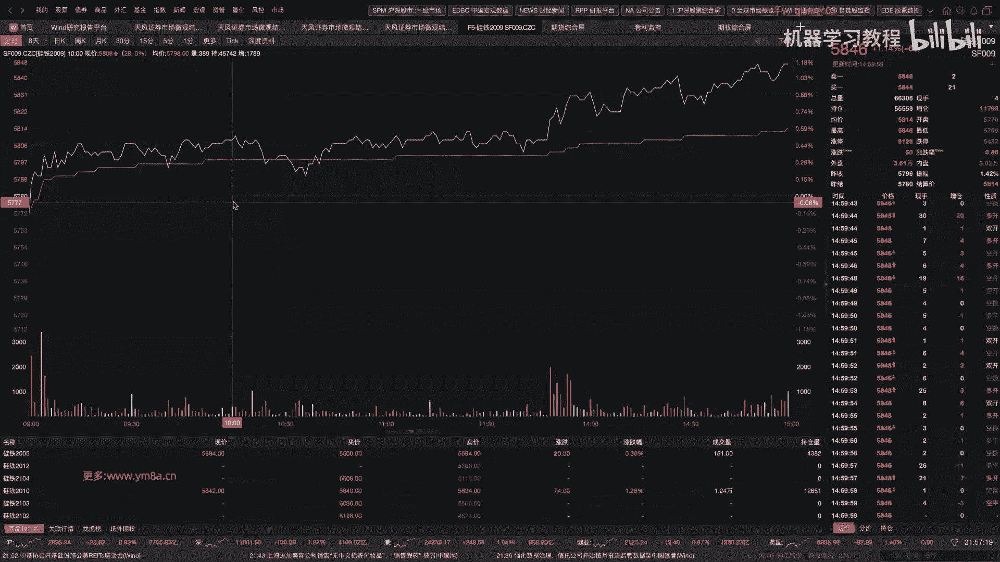

对不对，所以说并且现在就是随着就是机器学习这一套，包括你算命提升了之后，10年就是2020年跟2010年，那其实又是完全不一样的时间，就是大家要做好这个准备，就是从事这个行业的话。

是不断的要保持对于技术跟最新的呃，保对最新技术的这样一个关注，对然后可能某种程度上也涉及到一些呃，军备竞赛，嗯那好就是大家还有什么问题吗，或者还想听我扯一些什么其他别的，就是今天开库里头的东西就这么多。

因为不想也也不想给大家太多压力，呃还还是说前面那个回测没搞完的，还包括就是不知道怎么去找因子的，还是得自己动手去做一做，然后包括高频的数据的话，嗯我觉得最好大家自己也可以试一试，然后其实你做完高频的话。

对的，然后就是刚刚说挖掘因子的时候，主要参考这些指标，嗯没错，这个这个是肯定要参考，就是我现在还没有提到，就是说我们怎么去评估这样一个因子的表现，本来是想就是ICL这个是放在这个股票。

我们在做股票单因子测试的时候，是怎么来来评估的，对嗯对，然后一般来说对，就是做股票来说，相对来说你可能还会有，因为股票来说你品种还比较多，CCTA的话可能交易率就这么多品种，因为横截面也不是特别好衡量。

对就这些指标肯定是要去评估的，对，呃那大家还有什么其他的问题吗，就其实嗯我自己看因子的话，我一般是看IIC跟IR多一些，然后就是看就是return jdown viratio。

这些的话我更加就是说我一个策略，就是说我通过几个音子组合出来一个策略，然后我看整个策略的回测的这样一个表现，我可能会更关注一些，我会关注他每一次入场跟出场这些东西呃，对然后因子的回撤其实也是需要的。

对这这这这个就是看一个是因子层面，还有一个是我最后策略的层面对吧，然后包括就是你实际上有了策略之后，我一个基金做的产品里面是多策略的组合，那我还会去关注整个净值曲线对，就是所以从不同的维度。

你可能都要去对它进行控制，然后下一节课我们会讲一些，就是就是嗯那个投资投资组合，就从最经典的呃Mark quiz那个模型开始，然后包括risk parity也会简单的介绍一些，然后其实用对于我们个人。

或者说你想做量化交易的话来说，你其实做的就是说我有了一个策略，有了多个策略之后怎么来去组合对，但前期可能大家更关注的是我怎么去把单因子，单策略也做好，对这个可能是更有意义的，因为你尽快的上手，找到了。

你找到了一些因子，然后发现哎还真的有预测效果，可能这样给你的feedback会比较快一点，然后你也可能尽可能可能就是说，虽然说sharp ratio没有那么高，但是可能我就直接把它交易起来了。

那这样来说，然后不断的迭代改进，这样其实也是很好的，就做量化，有时候也不能过分的就是over，而over optimize，就是我还不知道我需求是什么样的，设计了一个特别庞大复杂的系统。

然后就一直做下去了，那嗯事实上我也是鼓励同学们说，有一个简单可行的系统，然后以此作为基础，不断的去呃迭代，那这样可能是一个相对来说比较好的路径，那当然机构也有不同的用法。

机构的话就是说你可能非常强的基金里面，它每一个部分都会做的很好，那其实就这样，我觉得个人也觉得其实是一个长期的优势，就是长期的发展方向，应该是每个人专注于，把自己的手上那一小块给做好。

然后然后通过有经验的pm，或者是我公司有优良的体制，有了优良的机制，把所有的模块给耦合在一起，这样来说既能发挥大家的优势，然后这样整体的效果也会比一个人，从头干到尾还好很多，这门课可能也是有点带大家。

这个从头干到尾了呃，数据也要自己洗，回测也要自己搭，然后模型上线，生产也要要自己研究，最后还要自己去交易，那这个我我我我想说，就是说如果真的完整一套走下来，我估计还是要花不少的时间了，这门课嗯就是真的。

我但是我感觉到有几个同学还是还有，我觉得到现在跟的相是相当不错，我还是挺佩服你们的，对，就是整个整个东西，就是跟到现在还是挺不错的对，因为我自己当初就是搭这样一些东西，其实还花了不少时间。

对在在机构里玩，是因为有大家有合作，其实会好很多，包括基础的数据库，包括对基础数据库，然后回测的平台可能都有现成的，你这样做起来做研究可能上手会好一些，那当然这个我觉得走这样一个过程。

也是让大家去感受一下，就是说做量化研究是怎样，而不是说拍脑袋呃，就是在浪花平台上写一写，然后就就去交易了，对，好的那大家还有什么什么什么问题吗，对，然后就是涉及到一个就是就是我比比。

比如说我策略里面有参数的这样一个问题，你怎么去调参嗯，嗯就是刚刚一个说了，是用滚动的滚动的去，我每次都去选最优的一个参数，那事实上就是我还常做的一个事情，就是说我会去看嗯策略在呃，我不是我对于多的。

我对于这样一个参数，然后我看策略是不是在这个在某一个参数的，区间范围内会相对比较稳定，而不是说单单纯的选表现最好的这样一个策略，因为呃单表现最好的这样一个参数，因为很有可能说你表现特别好的那个参数。

有可能是过拟合，而我找到的相对来说参数比较稳定的那个区间，可能对于呃对于这个策略的意义会更大一点，对，嗯然后然后然后还提一下，就是我们这节课，我们这门课程应该不会去提到。

那个rains reinforcement learning，对这块我其实也不是特别熟，但有兴趣的同学是可以去试一试啦，就是那个就是可以去研究一下这个是怎么回事，然后如果有什么特别好的idea。

也可以跟我来分享一下对，然后对的对，我们这门课还是可能更加偏向一些，就是怎么去最基础的模型吧，然后你说因为深度学习模型本质上来说，我真的我要是因子都测试的非常好，我用不用深度学习模型。

我觉得output，output出出来的东西跟linear regression的呃，效果差别不会特别大，因为我如果input都是非常验证有效的因子，linear regression出来。

我觉得也是很好的，对就是这这所以从这个角度来讲，我就觉得上单纯的上深度学习的模型，其实意义不是特别大，对对这也是我个人想强调的一个东西对，因为本身就是它信噪比是很低的，怕就怕就是深度。

深度的模型就是呃学习能力太强，还学到了噪音，这个就比较尴尬嗯，好的嗯，然后对我还想插一句，就是呃如果如果哪个同学就是有兴趣跟我，就是呃，就是想就是把之前的那个Python的回车，可以改成C加加的话。

有兴趣的话可以私下来联系我，因为我最近还还要把之前的做的优待升级，去改动对，然后嗯对，因为我时间也没有特别多，所以就改词还挺费劲，也花了不少时间了，然后有有兴趣的同学可以找我。

就说我们可以一起来做一点事情对，然后做完之后你也可以去用这样的呃，C加加的回测，因为C加加回测还是比Python会快很多对，然后呃还想提一个。

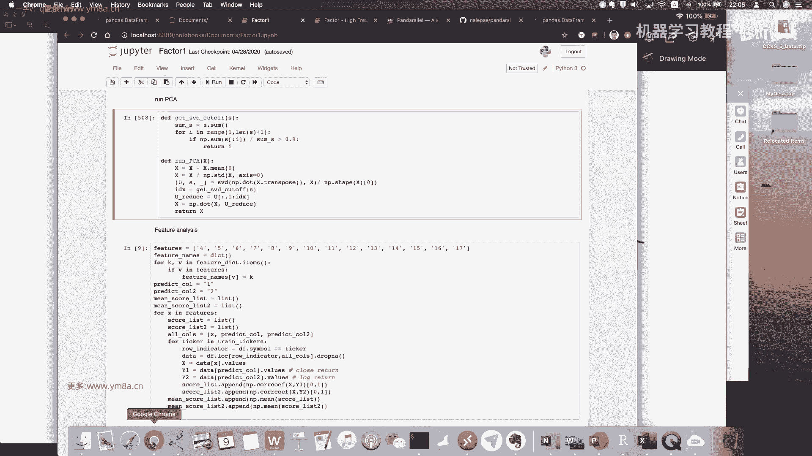

就是除了我们自己做回测的话，我还建议大家可以去看几个比较好的嗯。

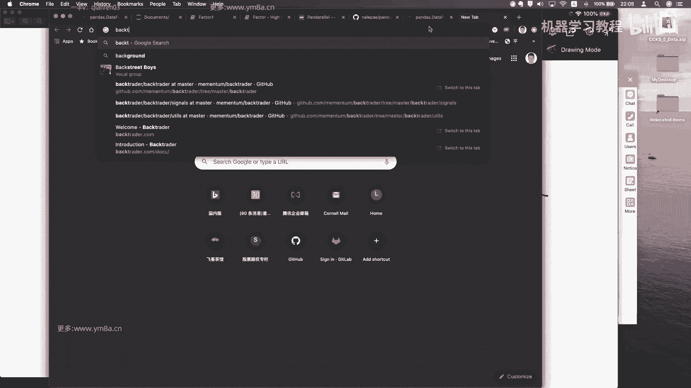

嗯开源的回收系统，其实刚开始的时候也不一定要说，就是说我们这门课，是带大家去自己造了一遍轮子，那相对来说比较简单的轮子嘛，那还可以看看别人是怎么来去造轮子的，因为DN派相对来说他那个回声比较简单一点。

但是就是可以看看就是别人是怎么来做的，对这这个应该是比较好的一个就是框架了，然后大家可以自己去，就是back trader，我发到这里面来，就是这是这是有一些就是其他的一些框架。

我觉觉得有余力的同学是可以去看一看的，然后甚至自己做完之后，你也可以自己的回测，做完之后再去跟用别人的回测框架来对比一下，看看有什么差异对对，然后其实最好的回测框架就是看。

就是你目标就是说我要跟实盘回测的是一致，那最好其实为什么说要用C加加呃，呃，我理想的情形就是说，我实测实盘跟回测用的是同一套代码，我只需要把我的接口改一下，我就可以实盘去交易。

然后通过不断的优化我的回测跟呃回测系统，使使得我回测的每一笔信号的发出，每一笔成交，甚而每这种信号的发出，然后到发单，甚至说成交都尽可能去接近真实交易，那我觉得这个就非常厉害了。

但这个这个是是需要不断的时间去打磨，你的回测系统的，就不是那么简单的，可以一下子就做完的嗯，好的那同学们还有什么问题吗，如果没有什么问题的话，我们今天就先到这了，嗯其实这这次没有给大家留作业。

然后还有就是我会把这个这两个notebook，再发给大家，然后包括那个呃高频的论文也发给大家，就是我觉得还是大家用时间多去摸摸索一下，就是然后然后然后嗯其其实比较好的，就是我我觉得就是要不这样吧。

下次下次作业大家可以挖一挖，就是交一交，就是你提供写十个function好了，就是自己挖到的比较好的一些因子，然后分别看一下他们的，就是嗯就是你的那个R平方是多少，对我觉得这样可能会更有意思一点。

这样可能迫使大家去挖，但是你实在没有找到，也没有也没有关系，或或者说你可以把那个呃之前的190一个，加括word框，101，这300个如果都测完的话，你看看其实里面哪些哪些比较好的，你心里应该有数。

那我可以告诉大家，就是101里面还是有些因子，现在还是能用的，对，这里面是真的是有能赚钱的因子对，好吧，那那如果没有什么问题的话，那就辛苦大家啦，嗯今天就先到这边好大家，如果今天还要上班的同学。

应该还挺累的。

