# 【比刷剧还爽！】这太完整了！AI量化交易实战课程，全程干货无废话 入门到精通一步到位！（数据挖掘分析／大数据／可视化／投资／金融／机器学习／算法） - P6：第六章： 特征组合 - 机器学习教程 - BV1Km421G7nH

唉好像现在可以了啊，唉各位同学晚上好，然后能听到的话，在聊天记录框里打一个一，让我看看，今天OK今天可能今天人又比上周少了一些，ok fine对，然后今天就是呃本来今天是要讲一个，就是上个周跟大家说。

今天要讲的是一个，就是呃这是我们的策略一个组合，但是我想了想，这个东西可能还得再往后再推一推，然后主要是对，因为呃，可能我觉得就是说把等在股票当中引入了，就是呃因子的组合之后。

我们再顺势的就是说嗯完成了股票的组合，然后我们再顺势的引入，就是说我们对于单个策略，然后在进行多策略组合的时候，怎么去借鉴这种方式对，因为对，因为策略本身组合的手势，我们可以做空股票。

但是不能去做空策略对，所以会更呃会跟股票有一些相似，但是有一些不同，所以我觉得可能调换一下顺序会比较好，然后呢，今天呢我们主要呃可能要讲的就是是，我个人觉得也是整个金融当中最有呃。

金融衍生品当中最有意思的一个领域，就是讲期权对嗯，原来我们预计的课程是花呃哼两次课时，两次课时，他有差不多16个小时时间来完成这个事情嗯，可能可能可能会觉得有点困难嗯，但是我先尽量看吧。

就是看我们六个小时能完成多少内容对，然后呃主要是因为这个领域，也是现在也是这几年是在属于呃，在A股市场以及在商品市场，都是在蓬勃发展的这样一个领域，所以我会觉得就是说。

如果同学们之后有主要有有志于去投入，就是进入量化投资这个领域，期权其实是比较好的一个切入点，虽然就是说呃，现在的市场相对于相对于股票跟期货来说，可能会小一点，但是长期来说呃。

它的交易量应该会是非常大的对，因为呃就是在成熟的欧美市场，相对来说期权的成，期权的成交数量是会比期货还是要多的对，所以呢然后嗯我们今天对，然后我在想，就是在开始之前给大家安利一门课程对。

就是如果有同学嗯，对于学Python或者说学到一定瓶颈性来说，可能只知道说怎么写一些基本程序，但是对于说呃背后的一些原理，以及一些数据结构掌握的不是特别好的话，其实我个人是推荐就是BERKO这样一本。

就是cs啊，61A这门课程，其实呃应该来说是比较经典的，就是有余力的同学，以及说嗯对想提升自己Python水平的同学，是可以跟着的，就是把这门课给刷下去的，呃相对来说就是不管是视频。

然后还是作业还是tutorial之类的，就是相对来说都比较完善，如果能完整的学下来，应该自相对于自己的，就是就自己的Python编程能力，应该会得到一个比较明显的提高，这是呃课余给大家的一个建议对。

然后我们就开始切入今天的正题嗯，首先就是什么是期权对，然后一般来说与其说是去搜文章，看个公众号是什么东西，我我个人比较倾向于是说，我们是去看官方的东西。

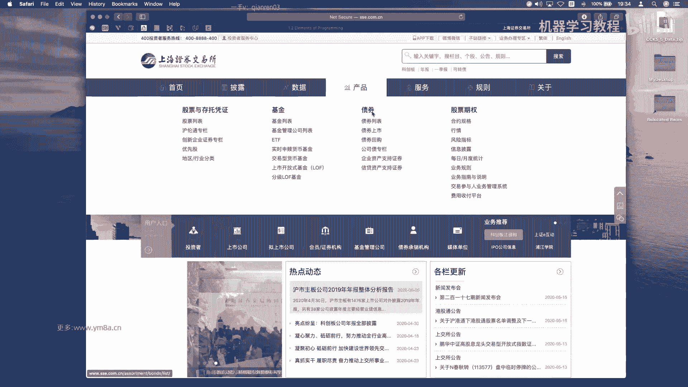

所以我们今天还是从上海证券交易所开始，这是它底下的产品，首先我们来看就是进入到它，进入到它股票期权专栏的东西对，所以呃就是我们先看什么是期权呃，我先想问一下，就是呃群里的这么多同学里面。

有接触过齐全的同学啊，举个手，嗯就是OK，好的差不多是1/3，三分之一一半的同学，OK额，那么就是说呃然后自己平时有交易过期权的呢，学过没有做过策略，Ok，嗯OK然后好的，很多同学可能大家都都学过。

或者接触过那个东西，那或者这样，就是至少说在课上，有自己去完整的写过一个期权的，不管是用C加加还是Python去完成一个呃，期权的定价，这样的一个呃这样的这样的程序，大家有自己做过吗。

不管是用蒙特卡罗模拟还是什么对，OK这边所以其实有大家还蛮知道，就是说定价这个东西，OK那那我那我那我大概明白了，就是好的嗯，对对论定价可能这位同学是专家好的，那那我大概明白。

那就是我们接下来呢我们讲述的重点，可能并不是说是去讲期权的原理，或者是什么东西，对我可能就是那我就是从就是说从呃，交易员或者是一个QUANTUTRADER角度讲讲，我们的就是整个额整个期权的交易。

我们该怎么去呃，就是说我们的不管是我们的额期权的回测呃，或者说是你数据库的建立，然后包括你整个的class呃，怎么怎么去构建，就是从你的还是说我们的思路，就是说从研究，然后到交易到风控。

整个流程应该是怎么去做，呃对呃，然后我找一下我这边的话，嗯对哦，我先看我之前写的一个呃也不知道，就是比如说像类似于这样的一个class，大家有呃，之前有不管是用C加加还是Python。

有自己去完整的写过吗，就是呃从一个就是我我们不需要考虑，特别复杂的，就是衍生品的期权，然后其实就是简单的BS的BSM的模型就行，但是要需要自己去实现，就是呃期权的pricing。

然后然GREEKS的计算，然后包括如果说是呃一篮子的合约，我们怎么去VECTORIZE的去计算它，这个大家自己有去做过吗，嗯OK对，所以这位同学其实就是对于对，如果是做场外的话。

这一块的话应该是相对来说比较熟悉，那我们课就是，其实因为我们主要针对的是欧式期权，对可能就不会涉及到呃，就不会说涉及到这么复杂了，对然后那其实想一想的话，就是那OK那我大概明白肯定需要有一些调整。

就是呃如果我那我现在就assume说，大家对于就是说基本的就是说期权啊，都还是有一定的了解呃，那我就直接就是从偏，就是框的trading的角度来讲，就是说我们怎么来做刚开始一些事情。

就是其实说嗯那最刚开始的一点，就是说如果说你要去先去呃，呃去研究我们期权怎么去交易的话，呃肯定就是第一点肯定是去拿数据，对拿数据的话，然后其实我们平时在生产的过程当中，的数据库是应该是有两个。

那首先就是我们需要的一点，就是说呃我需要知道所有期权的基本的信息，这里面的基本信息是包括在这对嗯，简单的过一下吧，就是首先是合约的额，就是security code，然后这个是我从万德上拉下来的数据。

就是之前对这就是从万德终端里面拉下的数据，然后他的到底就是他的underlying asset是什么，然后他的，然后我们现在主要接触的是EUROPEAN对，然后他的行权价，然后他的呃。

还有就是exercise的price跟那个control unit，就是他的合约手术，就是说我们每交易一张，那就是一手的话对应的是1万张合约，然后他的呃listed day，然后他他的上市日。

然后他的到期日对，也就是说哎到期日一般跟行权日会差一天对，然后好的，那如果这部分如果就是没有问题，这部分大家有问题吗，就对于这些概念应该不陌生吧。

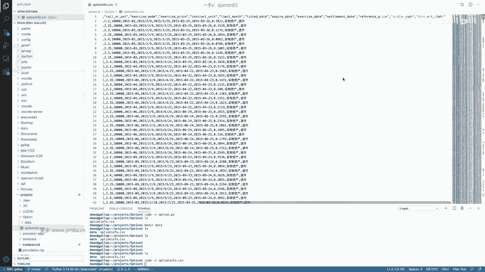

就是上面上面所说到的，就是期权的每一个每一个东西，就是我我我我assume，就是大家都是呃，OK的话，那我们就是就是说我们今天进度就可以，稍微快一点了，对，嗯OK嗯，然后我们再来看一下。

就是万德这里面的。

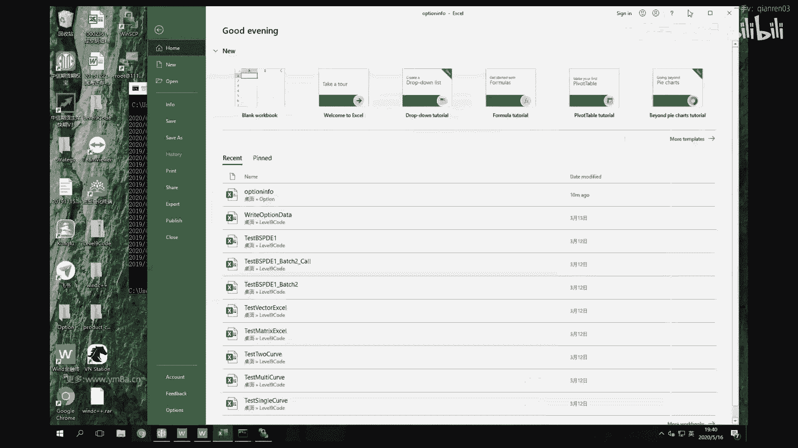

所以这个分辨率有一点奇怪，但是对，因为他是在不同的屏幕分辨率的屏幕下。

啊这就是我们常说的一个梯形的，梯形的一个报价表，然后嗯，对提前吗，现在就是说现在在呃上七所上期所，而不是上期所，是上交所和深交所，我们交易的ETF期权，实际上现在应该是总共达到了四个了。

就是我最刚开始最早上市的是上交所，上交所上上市的50ETF期权，然后它的它的标的是5100呃，点五呃，510050点SH，是这样一个就是五零的上证的一个50ETF，然后同样的就是300ETF有两个。

一个是上上嗯，一个是上交所，然后还有一个是深交所，他们对应的一个是一个还是一个是加时的，还还有一个是华泰的，如果我没记错的话，对然后另外一个是呃是股指期权，对股指期权的话嗯。

它它的underlying asset就是不是不是我们的呃，他的underli set不是ETF，它是一个它是沪深300指数，然后他是在呃不是也不是在上交所交易，而是在中金所交易，对所以会有一些区别。

然后我们个人就是机构的话，嗯现在主要交易的我了解到的还是以ETF为主，因为相对来说嗯，就是因为因为呃，股指期权相对来说手术会大一些对，然后ETF的话其实手术会小一些。

然后因为我们刚刚看到说所有的合约乘数，如果正常情况下是1万的话，额单价是0。1×10000，其实是说一手差不多是1000块钱对嗯，OK然后我们我们刚刚说到，就是说我们需要的一个东西。

是是这样一个option的，就是每天这样一个CSV，就是说嗯，一方面我是可以从万德去做这样的数据呃，取这样的数据对，但是如果说呃，嗯不不过机构里一般都会有这样的终端，不会说让大家自己去写爬虫。

去那个去呃官网上面每天去找嗯，当日要挂牌的这些信息，就是呃如果说就是大家自己想要去做，然后每天去补充这样数据的话，是可以，就是呃用爬虫的方式去去交易所里面去爬，然后因为因为这里面涉及到一个问题。

就是嗯一个是呃，就是主要是合约分红跟新上市的问题对，以及就是出现这种情形，一个是说我的underlying asset价格变动会比较剧烈，然后导致我现在在呃盘口，就是在交易所当中以平值为上下限。

不具有就是这少于四个合约，那这个时候他就需要补充新的合约，然后使得就是说我要保持在偏执上下四次档，都会有相应的合约可以供大家去交易，一个是这种情形，然后还有一个就是说是我的。

因为是ETFETF是存在分红的这样一个情形，当分红的时候嗯，那上交所呃所做的调整，就是说把合约的陈述去相应的改变，因为我的underlying asset价格会去变化，那这个时候我通过嗯。

就我通过就是说合约手术的变化，使得就是说我同样的呃，就是我然后然然然就是说我通过这样的调整，使得就是分红前后，我需要保证我的合约，合约的就是行权价乘以这样的一个手数，而行权价乘以这样一个手数。

它的值是不变的，对，然后OK然后接下来我们就要想，就是说我要去做这样的一个，就是说我们在做期权研究跟交易的时候，我需要的是什么样的一个东西，就是首先就是嗯就是我不知道就是有没有人。

就是一般来说就是我还挺少看到，就是说尤其做OTC的期权，应该就是OTC期权是不需要去做回测，但是如果是场内的话，其实我的个人建议是说，不管你是用呃，不管你是说是分析数据的话。

还是说你做到类似于回测的东西，肯定可能说，你还是把所有的历史数据都自己去整理一遍，然后包括呃，包括就是说我们接下来算的，就是波动率的指数对，然后这样的这样的一个东西。

可能说自己把所有的历史数据去处理一遍，然后去算一下，可能相对来说，然后再去分析去交易来说，相对于无脑的呃，无脑在市场上一股脑的买，或者是就是无脑的卖，我觉得可能是说胜率会大一些。

那我们今天其实就来看一看，就是我们怎么来设计，我们的就是option的这样的一个several，就是有很多这样的class，我们到底要怎么去做对吧，呃首先就是OK嗯呃我不知道。

就大家这一块对这一块说是嗯C加加，现在大家用的怎么样，其实其实我后来就是很多东西，都慢慢换到C加加上去了，就是哦就是Python的这一块没有特别的太多。

但是如果就是说大家觉得还是用Python ok的话，我们就是可能还是说用Python写的话会，那我们就接着就是说之后还是去说用Python，也就是降低大家对于使用呃，就是不太熟悉的语言的难度吧。

就是首先我们就是说你在想你设计这个东呃，设计这个东西的时候，我要想的是是呃，我到底要有什么用，那我们想的是，首先我需要有一个基本的option class对。

然后我这个option class的目的是为了什么呢，肯定是说我要需要就是保存，就是我每一个期权，我也需要知道一个基础的这样一个信息，所以OK，然后我们刚刚看到这张option info的table里。

这是OK，我们这边保存的一个是um underunderlying price，然后uh excess，Uh exercise price，然后time to maturity。

然后我们默认的话就是除以365，来去做就OK了，然后这边是call or put对，然后还有的是，然后我们目前来说的话呃，如果先期你不考虑延展性，就是说我们不考虑商品期权，肯定是要有就是有美式期权。

我们就只是做欧式期权的话，其实这一步你是可以嗯可以先省略，你不用考虑它是美呃，美式期权还是欧式期权，但是如果你之后想要还要去交易呃，美食齐全的话，那再去对相应的class去做拓展就OK了。

对嗯其实contract unit这个事情嗯，就是我我个人习惯是没有在class里面引入control unit，因为这个不是期权本身的事情，这个是呃不不是期权本身的信息。

然后这个是是一个相当于说是由于交易所分红，去产生这样一个新的新的一个的处理，对其实我就是要注意的地方，是说我再去算额期权的，那就是在算历史上，我把所有的数据都去呃处理，算他的GREEKS。

算它算它的imply b的时候呃，就是要把它分红前跟分红后，每年的每年有这样一天，要把这样单独的日期给处理下来，从2015~2020，现在总归就是呃也就是215~19，差不多是就是5年的时间。

有五天就是要把它去单独去处理一下，对，这个是可能就是是大家实际去处理数据的时候，会去要注意的这样一个点，然后我这边呃，我给大家提供的是嗯，我给大家提供的是2018年，全部的一个tick数据。

哦对我看我看OK，我先把它打开吧，好像还没，没传过来，OKDA还没有传过来，嗯好吧，我现在把data传一下，呃这样就是一个我们每天拿到的，就是从CCTP接口拿到期权的一个数据。

好相对来说它呃它会它会好一点，地方是他会有五档的盘口对，所以不管是嗯嗯就是beat跟ask对它会有五到，所以这个是相对来说会好一点，但是呃我我觉得有一点不好的是，它不会像嗯。

就是他的时间精度没有像原生的CCTP一样，精准到0。5秒，而是以一秒为单位，所以所以当同一秒之内出现两个tick的时候，我是知道哪个是第一个，哪个是第二个，但是如果对于。

就是不是每一个tick都有交易的时候，那那中间可能就会说嗯对，比如说这边从49秒到56秒，这个还我还可以知道哪个是56。00和，56。50对，但是但是如果说我在这个时刻，只有一个数据的时候呃。

可能就比较难判断，就是呃在当前的这个时间呃，在当前这个时间点是0。5秒，还是一秒的这样一个单位，然后因为我自己当时做期权其实没有做到，我不是做偏market making，所以做的不是那么偏向高频。

我一般自己处理的数据，是相当于来说把它用到一分钟，我这种做做日内的话，其实按照一分钟的频率差不多我就OK了，所以对于我而言不是有特别影响，但如果如果同学们可能说想去研究。

比如偏high frequency一点的话，那可能还要想还是要去想办法去拿到，就是待到就是精确到0。5秒时间，出了这样一个tick数据，因为目前的数据供应商只给到的，我是这样的数据之最。

刚开始我们的就是数据是，刚开始是都是从万德开始拿，直接拿万德的分钟数据对，但是后来发现可能多多少少会有一些问题，所以我们我们我们后来就是统一倾向，于是我们从交易所拿最原始的数据，然后所有的GREEKS。

所有的iv都会自己去算，我们不会用别人去给我们算好的数据对，因为多多少少算的时候都会去有一些偏差，包括就是说无风险利率到底用什么，那其实每个人的偏好都不一样对，那嗯就长期这样可能会引入一些误差对。

所以一般来说大家自己就是选用自己合适的，这样一个嗯，选用自己固定的数据，然后选用固定的处理方式，呃可能长期来说我觉得这样会好一些对，呃现在大家看这个数据应该是比较熟悉了，不会有什么不会有什么问题了吧。

啊就对于这样的这样这样一个期权的tick数据，大家现在觉得大家觉得OK吗，就这这个其实是跟我们之前的，就是CCTP的数据是非常类似的，对，但本质上也是，就是说也是从CCTP的端口去取数据。

只不过说嗯当时是在，应该是在嗯就是15年之后，就是因为我们的我们是股做的是股票，ETF的期权，走的是股票交易的端口，然后15年之后嗯，很多的端口就不再对新的成员开放，然后我们也是花了一些办法。

然后在18年拿到了一个，就是程序化的这样的一个接口，然后当然是从去年10月11月的样子开始，就是呃在国内就是说你想要做五零哎，想要做ETF的期权的程序化的备案呃，比以前的门槛会降低了很多。

就是如果大家有兴趣的话，我还呃就是趁着现在这个窗口期，我建议大家是去开户，然后去向自己的客户经理，去申请这样一个程序化的呃，程序化的这样一个端口，因为嗯我就就比较有意思的事情是，可能有人之前拿了嗯。

就是期权这样一个程序化端口，但是不再去做交易了，那呃但是它呃，当然就是这样一个存在一个灰色空间，它就是把这样的端口呃去嗯，借给那些想要去做程序化交易的人使用，那这样的其实成一年以内。

也会有相应的几10万的这样一个的收入，这是一个额外的这样一个收入，虽然这个是是这样一个灰色的空间，但是也可以从另外一方面去证明，就是说呃有有有的时候就是说拥有一个良好的，还有环境，还是就是是比较重要的。

对不管因为程序化的话，呃，其实呃本质上来说，就是不谈说，是不是是对于整个市场流动性是有益，还是说是有害，但是人说有总的来说是对于想要做矿的同学，有这样一个更好的环境，那对于自己的职业的发展肯定是有呃。

有正向的这样一个作用，对的，OK那如嗯嗯大家都都在群里没有发言，我就assume，大家就是对于这一块都没有什么问题哈，然后嗯还是就是说这边就不讲，就是说怎么去合成分钟数据了，还是老样子。

我会把数据发给大家，然后大家课后去先去合成分钟数据，对，就是嗯还是就是根据高开低收，然后如果说遇到遇到只有一个的话啊，就是时间戳，如果说你就是说遇到在某一个点，只有比如说这个41只有一个的话。

嗯我我个人觉得就是说，这个时候可能只能把它去当做40，1。55来算会好一点，因为你时间就说你拿到这个信息，你只能说我不知道是前半秒钟还是后半秒钟，那么如果说如果来做tick回测的时候。

你需要在这前半秒钟的时候，我只能我只能认为前半秒钟，我没有拿到这个数据，因为可能是有延迟对，因为就是把它放到，把它归为41。5，总是比贵为41。0会好一些呃，对因为在实盘实际交易的时候。

如果他真的是41。0，那无非是你的损失，是，就是说你可能会比别人慢0。5秒，拿到这个数据，但如果是呃真实是数据是41。5秒发出，但是你41。0就利用41。5秒的数据，那这个时候就会涉及到。

就会这就是就是look forward了，那就是look啊，look ahead bias对，就是我用我用到了未来的数据，那这样回测下来肯定是不准的，所以如果是做tick级别的回测的话。

呃我个人的就是说针对这种情形，就是把它去归为是41。5的数据，这样可能会好一些对嗯，然后我们就来回到就是coding的部分对，就是我我这样的一个作用。

就是本质上是说我需要有额这样的一个base option，就是说我需要就是呃，那当一个合约就是过来的时候，我知道他是呃它是它它它有哪些基本信息，就是说我这我希望我这个class是save的。

是哪些基本的信息信息呃，还要加一个对security code，然后看一下underline嗯，对如果是刚开始这样的话，我们还是，Uh ok，其实我还是存一个expire date好了。

就是时间的处理不用留在这个，我不用算，就是说到到到期日有多少时间，我不放在这个类里面处理，我还是考虑说是放在就是呃，就是放在我去真正的去便利所有的合约去算呃，当时行情的时候就是算他的。

算行情的时候算它的波动率，算给它定价的时候，我才会去考虑，就是说我具体到期日到底是有多少时间对的，然后OK那其实如果是对啧呃control unit啊，其实还是把它加上吧，因为因为大部分情况下是在呃。

默认默认会是1万对，然后如果是分红的时候，我们再给他加入传入一个新的参数就OK，OK嗯嗯这部分，嗯其实对，Sorry，My bad，这S也其实不需要，因为我们刚刚说过了，呃。

这个这就是这个这部分的code，是我只是为了说单纯的把我这个excel的表格，就说我不希望就是说嗯，不希望到时候去再去读这个东西，而是说把所有的在每天开盘之前，我需要把我所有的期权的。

就是当前正在交易的这样一个呃，当前正在交易的信息放到我的内存里呃，对，然后要注意的是这边呃，因为我这边是就是我在历史研究的时候，大家看到这个是退市的对，那实际上你每天在漏的时候就说我内存，你是不需要。

就是说把所有的这些合约都给加进去的，我只需要是啊维护当前正在上市的呃，合约就OK了，嗯OK，对就是说我哦我有这样一个class，他的目的是，是谁，我希望的是保存的是啊期权的基本的一些信息，对。

然后呃OK接下来再做一个事情是，就我这这这部分信息是负责来去说呃，去维护说呃，也不是维护，就说去负责去，不管是计算我的historical data，还是说我的live data。

我希望有这样一个程序去帮助我去来计算嗯，是我当前的这些GREEKS和，我我会import这样一个base option，对，因为我需要去继承，啊这个时候就是我会assume。

大家就是说我们已经呃有我们已经有的是，就是说是，Uh market data in minute frequency，就是说我们不管是在回测，还是说在实际交易的时候，我拿到的是分钟的这样一个数据。

嗯然后一个是呃，在这个时候，我们就需要的是一个是一个是underlying price对，然后大家要注意一点，就是呃underlying的price跟呃，是它是因为是股票的ETF的ETF的价格对。

然后ETF的价格它呃就是说是三秒钟更新一次，他不是嗯它不是像弃权或者是期货一样，0。5秒更新一次，然后像这里面是就是在实际交易的时候，你可能说如果你觉得三秒一次更新比较呃，呃比较慢慢的话。

我们是不是可以说是用呃不用ETF的数据，我们可以用呃五零指数的数据对，然后如果是五零指数也比较慢的话，那是不是还可以考虑说我去用50只股票的market，price去实时的去计算。

然后甚至也是不是也可以考虑说是用嗯，利用股指期货RH的数据去算，那事实上这几种方式，就是说我们在实际工作当中都会去尝试，也为了就是说我们是不是能够实实时去更新，我们的S的price s这样一个价格。

嗯然后嗯我我们在这边的话，我们还是统一的，就是用就是说用呃用ETF的ETF的本身，50ETF本身的价格来看我哦，忘了把这个聊天记录框放到上面来，就是这边有同学在问的是，哎呀这边有同学在问的是额。

上交所是不是有一个类似的API，要他是有的，然我就拿一个我给我开户的这样一个，我们看一下啊，嗯习题就是，我是在我是在中信期货有一个这样的啊，有有有有开他的一个50ETF期权的账户，然后，Sorry。

这不应该是在这或者，我的code这一块是不是，对这API实际上是有的，然后我看我看一下我的GITHUB，我应该是把这块东西放到GITHUB上面，它是有一个类似的CPP的API的，稍等一下。

我把这个给克隆过来，好就是它本质上还是说，可我其实也不一定要看过来对，就是这个本质上是跟我们CCTP，是它就是一个CDP，但是他他为他是有一些改动的，对因为我们这个时候呃，他它里面的东西不是不是期货。

而是是期权的这样一些数据结构，可能看这这部分你可能看不出来有什么，这这个应该是这个是一样的，但是如果我们在那个，就他的他的就是他的头，就是这些库不可以拿CDP的直接用，然后嗯还是要去就是去呃。

要去下期权对应的版本，然而应该甚至甚至很很有可能，就是说他的头文件我没有，我没有仔细比较过，但是很有可能他这些头文件里面都是一样，因为我记得在CCTP期货里面也有看到过，有期权的字段的出现，对。

uh这边对，所以这个里面应该是一样，但是嗯有一点就是嗯想应该是没有类似于sim，now的工具可以给大家去呃下载这样的数据对对，因为期权可能嗯我不确定，就是说在呃期货公司所开的这样一个模拟账号。

是不是可以去啊，用对去呃，就是用这样的API去下载模拟行情对，但是对开实盘的话是需要有额，有就是有好像应该是50万的资金，那就是日均日均50万资金保持20天就OK对，就可以开这样的一个额。

你就可以开这样的一个账户，然后像对应的客户经理申请权限，对这边就是我们看到这边的嗯，name space是放在就是CCTPSOPT下面，就option下面，对security option他没有放的。

就跟之前还是有一点小区别，但是整体的框架是非常类似的，对然后嗯市面上除了说CCTP的集权，也可以，就是在飞马或者是其他地方，也会有类似的这样一个AAPI，但是其他们背后的基本原理是一致的。

然后我们的课程当中不会涉及到，就是说教大家怎么去接，因为因为本质上跟前面的接呃，期货行情本质上是一样的，我觉得就没有必要去说，再去重复的做这样的一个事情，但是啊想想要实盘交易的同学。

是课后是可以去做这样的事情的，对，嗯所以所以可能说我们现在只能是说，我给大家提供的是一年的tick的一个数据对，然后对可以给大家去做研究用，然后如果想要去实盘的话，呃一个是开户。

还有一个是就是去做期货期权，期货期权似乎开户不需要什么门槛，好像对，还是说门槛相对会比较低一点，然后嗯然后拿期货期权去交易的话，其实也是OK只不过嗯嗯嗯对，那那就是用我们之前原生的CCTP的APAPI。

就可以直接在期货里面去交易期权对，只不过把合约的名字会变一下，对嗯嗯对，但是但是要注意它是美式齐全，然后以及嗯不太适合呃，我个人觉得就是流动性比ETF期权会差很多。

大家应该可以从成交量这部分也可以看得到。

就是我们这边的话，这边一天成交量就是一个合约，品质合约就20几万，我觉得还是就近月了有20几万，我觉得还是非常活跃的对对，所以就是每一分钟的话都有几千的，每一分钟都有几千首，相对来说会好很多。

但是但是如果说我们去看嗯，最早的应该是白糖和豆粕吧，豆粕如果我们主力合约是零九对嗯，对我们可以看一下它的成交量，这相对来说对品质合约的话也没有很多对吧，就是相对来说，这样这样的就是流动性其实不是特别好。

那么其实如果说做程序化交易的话，它的盘口相对会大一些，但也有看到就是他就是说这这部分嗯，好像不是特别多，然后然后那位就是这位是做呃。

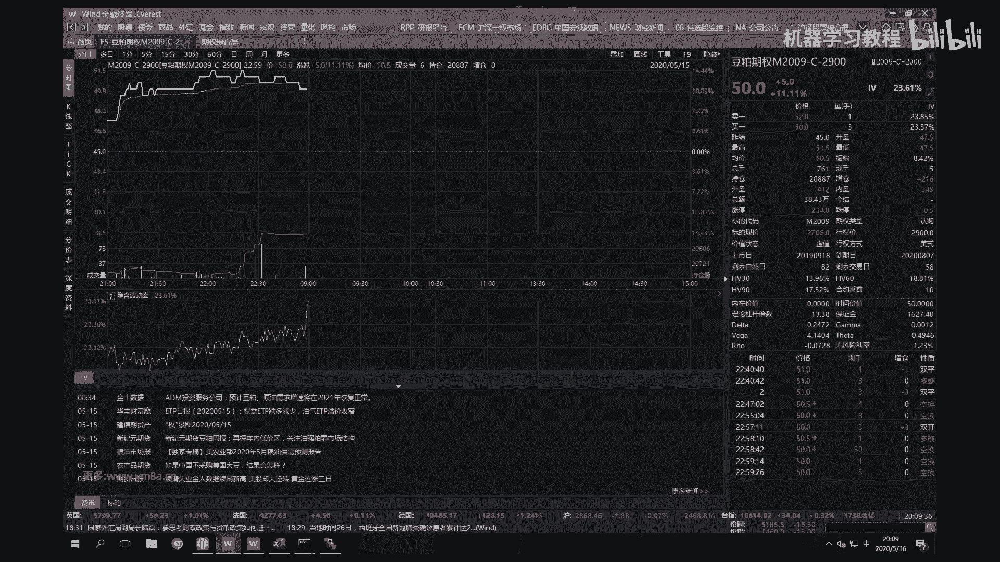

场外期权交易的同学，其实我呃课后还想单独想找你聊一聊，就是看看，就是我不知道现在就是场外期权，现在大家在做一些什么样的事情，是不是说呃场外期权去挤走了嗯，场内期权这样一部分交易对。

因为我自己在做量化交易的时候是呃，我们是有做过两个月的，就是场外期权，我们嗯对我们是对，我们是去做了两做了两个月的场外期权，然后我们也没有做OT，我们也没有说去做G1期权。

只只不过说我们是跟机构去做对手盘，然后嗯还有就是我我们做的典型的，最简单的就是在多家机构去请假，去寻找他们的套利空间，对虽然场外期权就是盘口。

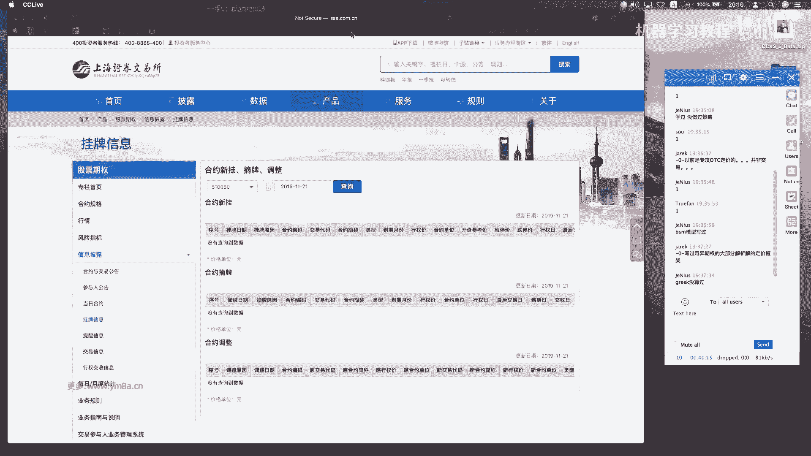

我们这边看到的盘口可能说是二，那场外情可能就是按照波动率去报价的话，可能差的真的是非常多，反映到价格上面的，可能夸张一点，可能就是40跟60，甚至30跟60这种地步对。

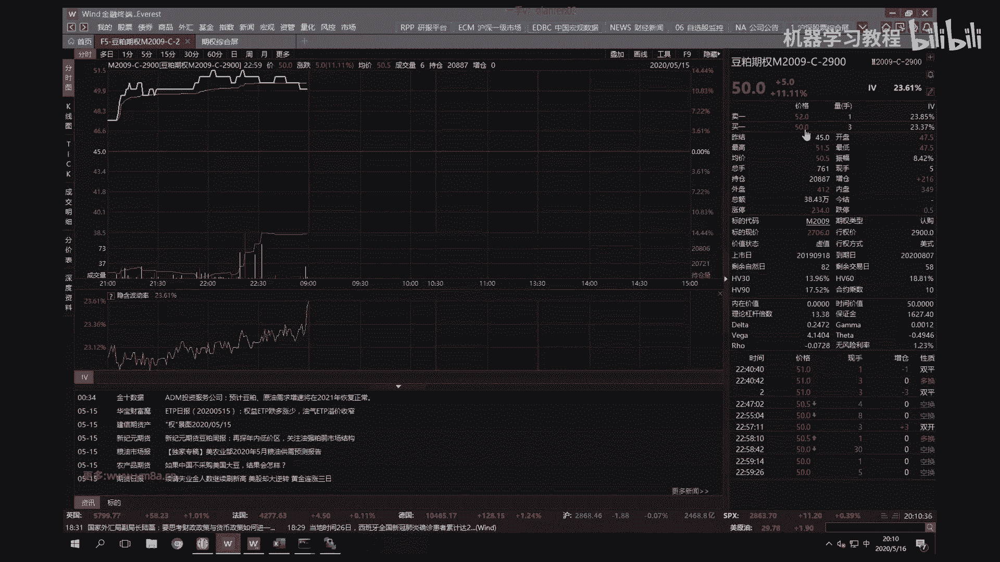

所以所以我我给大家建议，就是说呃去想要去做期权的话，可能就是还是说是嗯在目前而言，主流的包括各个机构在招聘的期权的研究员，是以呃ETF的，以以ETF的期权为主对，然后主要是做上交所和深交所。

因同样的是说同样是300ETF期权，然后我们看到深交所的话是嗯，你看这边大概是2万到1万，但是上交所的应该会多很多对，就目前来说嗯，对就是合约流动性主要是集中在呃上海，上海证券交易所。

然后50ETF是2015年2月9日去上市的，曾经它的流动性那是会最好，但是但是随着2019年沪深300ETF的上市呃，沪深300ETF去吸走了相对来说比较多的，很期全额就是ETF，50ETF的成交量对。

因为呃毕竟300ETF覆盖的是300只股票，就是50ETF覆盖的是50只，然后相对来说，目前呃300对冲的话，效果会比就是五零对冲还是会好一些，但现在市场上我了解到的就是主流的就是做嗯。

就是股票的指数增强可能还是以中证500为主，对所以如果说中证500的人ETF期权上市的话，那可能对于大家来说就是股票的对冲，又会有一个新的手段，除了用股指期货对嗯，好的，然后这部分是简单的这样一个介绍。

然后我们还是回到我们的COCODE上来，对我看看好的，所以这位同学就是这个这个这个问题，应该是回答你了，然后，然后就是说我们要去实现，我们要去实现额，我在想这个东西叫什么，我可以叫P吧。

就或者叫price，就说对，然后然后我们这个时候其实要需要的，就是说一个是嗯就是因为嗯对，也就是说去计算这个期权相关的一些，我们能拿到的，其实就是说是盘口了，就是能拿到的就是分钟的价格。

然后是ETF的价格，然后我们还有期权的这一些基本信息，然后我们也要去去呃，根据这些东西去来去给期权的去做一个pricing，对呃，然后还有一个就是时间的话，嗯时间的话如果是额OK，是时间的话。

其实如果我是做日内的话，其实最好还是说我去精确到每一个10分钟，去给他算这样的一个去去给，去给他去相应的定价，而不是说我每每同一天，所有的同一天所有的合约都只有一个时间，就是即使说上午跟下午的话。

嗯对呃，我个人觉得可能还是要精确到分钟，可能会好一些，所以这边是给大家就是精确到分钟，然后呃我之前也去也去测试过，就是我们在做就是PNL的attribution的时候，如果说我同一天都用同一个时间。

但实际上就是最后一下归因下来，结果是有比较大的误差，那这部分误差是可以，就是其实是如果精细一点，应该是把它归类到，就是我在sea上的这些一些盈亏呃，Ok，Ok，呃trading date。

其实这个东西不会特别特别好吧，先，好这是我们先有了这样啊，Sorry，还有一个就是super，Shelf，我都忘记这个怎么写了，我查一下语法呃，这是我们不是继承了他的类吗，我们要把它去给初始化。

就是去把期权的一些基本的信息给拿过来，Ok then it，真的是太久不写Python都有点，或者我是不是可以不用这么写，好的嗯，嗯现在是8。16分，然后我们到8。30分，我们再开始第二课。

大家先休息一下呃，就是第一节课先确认一点，就是嗯目目前来的十个同学，就是对于期权这部分都是有相，相对来说是比较熟悉一些吧对吧，就是呃不不不熟悉的话，不熟悉的同学可能得嗯，就那那可能就要自己去快速的。

我我记得有一本书叫啧嗯。

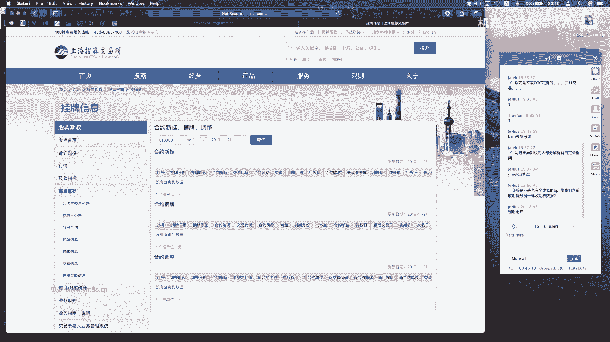

叫那本那本书还写的还可以，三个小时快速入门期权对，就是讲期权的基本概念，这这这本书其实大家可以去看一下对。

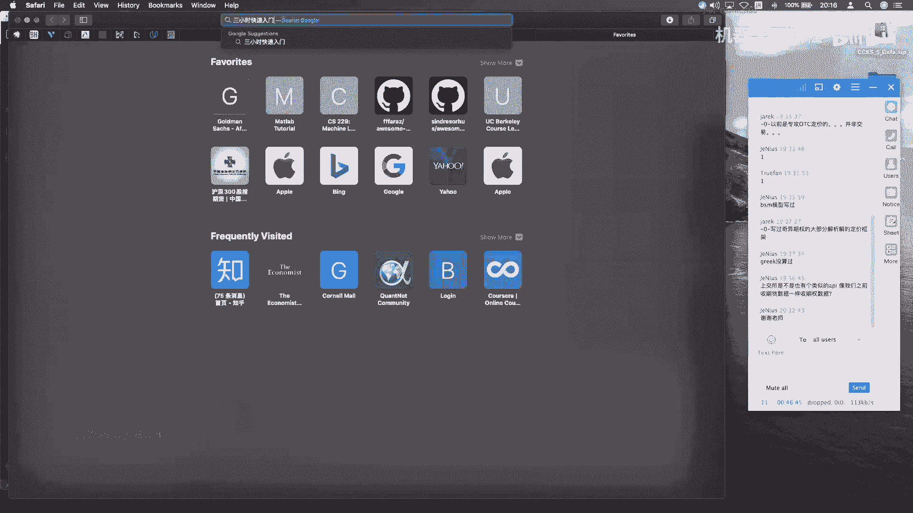

虽然我觉得就是说呃，就是即即使说我学了也很很对，学了学了一段时间之后发现回去再看这本书，其实他写的还是挺不错的，对就这这本书很很小巧对，然后或者还有一个方式，就是我们去就是在上交所的期权的投教平台。

也是可以去找到嗯，去找到相应的就是期权的一些呃，期权的一些的对期权教育之类的，股票期权投票专区，这里面是有一些东西的，嗯好的，那我们第一节课先到这边，大家休息一下，喂喂好的呃。

我们现在回来对呃对先呃有一个就是框内，如果做我不知道做OTC的同学，可能应该有接触过，或者是其他有接触过宽放量小同学，其实这个库可能就是说刚开始开源的时候，还是不管是学术还是工艺界。

可能都还是有一定的用处对，当然有一些大的机构可能会，他们如果有自己的库的话，可能就是从头造轮子，对，那这个就是说呃如果不想自己去造冷呢，其实从上面以框类作为基础，然后去改动，或者说直接去调用。

也是是比较也是挺好的一种方案对，然后刚刚的话对我想了一下，就是嗯就是刚开始的，就是嗯，我们还是不要把那个就是不要去把那个呃，这就是期权的一些信息，跟我们去做pricing的这样一个class的类。

去混在一起对，因为这样子的话嗯，就是说呃我我们还是希望是说这EUROPEAN这个class，就是说去专门的，就是去负责我们的呃期权的计算，然后至于说怎么把我们收到的market data跟怎么。

然后跟怎么去调用我们这个price类的话，之后，我们可以通过其他的程序，就是呃再写，再通过其他的PY文件，然后把它去封装起来，这样的可能说结构会清楚一点对呃，其实就是说如果大家都比较熟的话。

那应该会好一些，OK就是是希望就是大家先去实现这样一个类，然后就是说我可以去计算我的额，因为这是这边是一个single option吗，我肯定给给大家一个类似于single option，我怎么去算。

然后之后因为我们收到的行情，同一个时刻差不多不到呃，应该是不到200个期权，然后就是我们去把它去VECTORIZE去计算，其实呃就可以了，对就是说我们我们我们我们要实现的目标。

就是说当market data或者是呃，呃或者是历史数据的时候，我需要在在同一个时刻，对于四个到期月份的呃，这样的一个期权去同时去进行计算对，然后用for loop，肯定是会相对来说是会会比较慢的话。

可能对最好方式就是说我们去把它呃，整个期权的，不管是计算IMPLIABLE，还是说是去像GREEKS，最好是把它去VECTORIZE，这样来说可能会可能会好一些，然后我这边先给的就是我们先来考虑。

就是说我们怎么从新购来去做吧，对就是说我们对于一个合约，我们可能要来怎么去做啊，这边是报什么错，嗯好的，然后就是我们先就是刚开始，先是就是说每个期权我们会额，就是说传进去我们的。

K就是有一个S对underlying price，然后K是呃，K是行权价，然后是T然后是是西格玛呃，我也没漏什么东西，西格玛，这是我们的，就是这样，就是说我是可以，就是其实是两种，一个是我根据。

一个是我根据当前的波动率，我去给期权定一个价格，然后还有一个就是说呃，我根据当前期权的价格去反推我们的波动率呃，这两种都是都是需要的对，那我们先从就是先去，先是从就是怎么来给期权区定价，再做好一点吧。

Ok，我们想的stream都是，它的类型还是需要的，Put it，OK呃，所以我们要做的第一个事情，本质上是去计算一个就是，Get option price，然后，如果是call的话，我们去调用。

Call price，好，其实就不用了对如果我们就是make sure，我们输入都只有C或者是put的话，其实我们就不需要再去做，对一个是说我们是可以在这写if else来去做。

然后其实事实上就是说如果是VECTORIZE的话，我其实比较好的方式是把call和put去分开来，分两组去算，然后两我可以让两个CPU一个去算call，一个算put对吧。

就让两个线程去算这样的去去做这样的事情，那Python当然不是线程，是用进程去算吧，对呃这样这样子来说，肯定是说我反应的整个速度是会快一点对，但我们这边还是先做一个demo，然后之后我们再去考虑。

怎么去把它逐渐的去优化，Oh okay，Sorry，Okay，Self，这个的话就直接我记得D1和D2，哪位同学帮我来回忆一下这个公式，大家还记得这个定价公式吗，都不记得了，我得去找一找我之前的事情。

OK呃有有错误就是有有错误，大家及时跟我说哈，把这个放上面，这又报什么仇，没有加回车，没加括号，哎我太好，还是把这个放下面来，好奇这个起错误有点奇怪，Uh invalid syntax line。

Six pilot，Syntax error，Uh and nice states，Whatever，我先忽略这个提示的东西，OK好吧，果然是代码格式的问题，可能一行，他不希望我把三个双引号放到下面。

嗯这边有什么错吗，L y six，Ok，这回他是对的，对所以所以就是呃哦我还是建议大家写call的话，是自己就用IDE，可能写的还是好好一些，就是不会有带来，然后包括有什么问题啊，他都会去提示。

然后最好遵循相应的代码规范，然后因为因为在公司当中写的代码，不是说自己写的就OK了，我们写完代码还是要去跟别人去share，或者说是去跟大家去合作，那个有错的大家及时说哈，呃我也不确定，应该是。

然后我们这边是考虑就是都没有cost of carry，这种情形相对来说会好一些，OK然后我们来写一个嘛，0。5倍的，哇你叫我放前面吧，然后是，Okay，然后let's say the ten。

然后SQRT，好的，然后括号没错，然后再tap需要分号d two是d one minus西格玛，然后是price equals，As s times exponential unegative，RT啊。

然后我们要算一个那个这个就是cumulative呃，那个那个叫什么community的，嗯okay，就是嗯嗯cdf of ugin distribution对，然后这边要算的是，如果我是call的话。

这边是negative d two，然后minus uh s times，Npx，Ponential，Negative r t，然后二还要再算一个negative d呃，Sorry，我这边是sorry。

我这边是不是写错了，我这边是应该是DY，然后这这这边这边有错，大家及时提醒我啊，因为这个对这这个算错了就比较尴尬对，然后我看看这边是不需要改这样子嗯，然后我们再把它return就OK了。

这个括号也是多余的吧，对这个括号也是多余的，Winter price，那这样吧，我们再加一个self点price，对吧，然后put留给同学们，课后自己写，额然后我要做的事情是把这个，Kative。

嗯这个是一个让我想想应该不要用到哦，他可以用一个那个它是一个static method right，然后我们要传进去的嗯，仅仅是一个，Ok，CDF的话，Sorry，我让我看一看，那我们派还是sin派。

小于CDF啊，C d f，所以你看到就是呃其实就是说写代码的时候，不一定说需要记住完整的全部的细节，但是得知道就是说我要用的时候，可能去去哪里去找对，之前是用C加加写的，我还不知道呃，这个是什么啊。

Normal sin point，那这样很不对啊，Cdf are random variable continues，应该是这个了，对。

Communulated distribution of given random variable n，我需要知道的是。

The shape parameter for the distribution counters，我需要知道是，那我还要给一个给一个找一个例子吧，这是一个static method。

然后我要return的是return嗯，return some return一个就是啊normal distribution的，然后那么distribution呢，然后把X的这样一个分位值。

Stretch get in，是长的很tender，Uh the main public method for continues，Okay，我们应该用这个就可以了，我试一下，OK呃。

那么this stribution cdf，Ok，那这样是对的，所以我只需要return，那么cdf d one或者是d two就可以，Normal c e d f2 x，但是我需要的是from。

Sine pine stats in pon，对，就是我还是给大家强调一点，就是嗯做量化矿的时候可能不学，有的时候就说真正说可能像那位同学，去真正自己去写衍生品定价来说，那个时可能是比较少。

就是呃要看大家是买方跟卖方不同的职能，然后如果是做，如果是去做矿交易的话，其实有的时候不需要写那么多非常底层的代码，甚至甚至就是包括课上展示这些东西，可能在稍微成熟一点的公司，如果他们之前做过期权。

应该来说都是呃有相应的就是library，我们是可以直接去去调用的，相对来说就是可能会省比较多的时间，这边也不知道什么走，狼派打lock，这个也搞错了，额难道是平方出错了吗，也不应该。

OK我们现在先待会测试着看吧，return nm到cdf uh，Okay，Uh u，这样子的话应该是looks good，到目前为止是呃，我们可以试试看，做一个简单的测试好吗，嗯不用啊。

这位同学说ND不用乘以呃，南派exponential是在OK我看一下啊，Uh okay，是我看一下哎sorry，我这边是不是哪里写错了，I m，呃呃这这位同学是是self dot n。

呃呃这位同学说一下是哪边，等一下我把这个聊天框拖上来，如果是call price的话，S乘以NDE好，啊啧这边对，我忘记了，是就是cost of carry，如果是零的话，对这样这样对了吧，这位同学对。

还是嗯，对这样应该是OK了，嗯好的，谢谢这位同学，然后的话，啊OK我就不在课上花时间写测试了，然后有什么错的，我觉得也好，就是呃同学们希望课后去来把这个给完成对。

然后还是说只是说我这边是给大家去讲basic idea，然后具体然后怎么实现的话，其实呃然后大家会去来去考虑，怎么来去具体的把它去做对，然后，然后接下来的一部分就是说要去算额之后。

我们得到了就是嗯call和put这样一个price之后，然后接下来就是要去算GREEKS，然后我们还是呃加入他，那算两个吧，一个是delta跟那个，还是，对如果这边，我是不是好吧。

那还是都写一下calculate coda，然后大家可以想一想，就是说我这边是计算一个合约对，然后呃如果说我是计算多个合约的时候，我总不能一个个循环吧，还是回答这个问题，就是说那学校里可能交作业。

我直接循环没有什么问题，但是如果是更夸张一点的是，如果我是做tick数据的，我每个tick都要去算150个合约，那每次循环150次，可能第一个合约到最后一个合约，这么这么算的话，黄花菜都要凉了对吧。

就是说事实上就是我们在交易过程当中，是有一些trick，比如说嗯我目前持仓的这几个合约，或者说流动性比较好的几个合约，那我是不是可以考虑先优先去算一下，然后至于其他流动性没那么好。

或者说我现在没有什么没那么关注的合约，我是不是可以把它放到下一个，就是就是就是说我先算完前面那几个，因为即使说我是用VECTORIZE的话，那我memory copy，也就是说我复制内存也是需要时间的。

那我是呃先赛少，就是说我自己主力交易的这十几个合约，可能先算一次，然后后面你再算一次，这样也是可以考虑，就是说而不是单纯的说我把这么多合约，按照合约的代码的顺序，从上到下去算，那这样的话速度可能还是嗯。

就是可没有我那种自己去挑选的，算的可能会快一些对，然后，然后，好吧，还是ten西格玛，Sorry，我这边是不是好多都忘了，Self，我的天，啧对这位同学提醒的好，这个不是写C加加，嗯对。

最近写C加加写的有点多，然后总觉得这些变量都是已经define好了，好的，还是算西格玛，然后，我这边是不是又要算一次d one，是不是可以把d one给保存一下，对我这边可能又要算一次。

先这边我们就是做做engineering的时候，先做一个demo，不要去过分的优化，然后之后我们再看是不是可以有优化的空间，好的，然后TTND，然后不用d to了，对。

然后downtime就是expancial negative，R multiply by uh t，Negative，Rt explential，然后SHAN，d one这这个这个选的对的吧。

Return delter，Ok，啊对然后然后put还是大家去算，然后伽马伽马的话，伽马的话两个一样的话算一下吧，OK干嘛，就事实上就是嗯嗯，Okay，事实上就是可以大家用一个。

就是用用差分的方法去验证一下，就是自己算的伽马是不是正确的呃，其实就是可以算嗯，让我想想就valiant或者是叫test吧，Okay，我是可以的是嗯，事实上我是可以就是呃生成，Option。

One european option，然后是嗯，我看下上面的顺序，对就是呃它的原理是说我生成在我相邻的，就在我附近，就是嗯就是我的S，哦like pass edge，这个H是要大家自己去做的。

这个是H是可以自己去定义，就是大家可以实验一下，就是说我选择不同的H对于我计算的，然后这个时候是当然是这个是等于消点，Call output，就是说我可以用差分的方式去近似的帮助我，验算这样的东西。

我怎么又打开Python，whatever嗯，然后这个时候我可以算得上是option one，点get option price，然后就是减去两倍的，我需要有self and price吗。

对然后再加上option two，我算一下它的价格，然后我要用这个东西除以match square对吧，这个是我加他什么呢，伽马一号了，或者我先把值，我直接把这个值return回来。

对这是一种伽马计算伽马的方式，就是用差分的方式对，然后嗯哦又要有这么多的嗯，这个大家好吧，我看诶这个需要吗，嗯呃需要对对，因为我不是在INIT里面，好的，然后然后我们接下来是，然后再是这个是。

然后我们这边再做analytical，Solution，好吧，我看一下对analytical solution，它的值就应该是嗯，他应该就是还是tap。

self dot sigma s nn派DOS q RT，然后是，double不是double，这是第一网，Udo i log s s divide by k on call sh。

Point five cinema square and hook，这个应该是OK的，然后伽马就嗯要引入一个新的东西，N d y，先把这个给先把这个完成，然后我们再去implement。

Little n，就目目前讲的就是到这一块，大家都可以follow上吧，对这个表示OK的同学，打个一打个二，就是如果不知道的话，那其实就是呃我推荐的是看张浩的那个哦。

Option futures and other deriptives，然后其中有两张看完之后应该就OK了，这是对对，当然如果说是嗯目标求职方向是做那个呃，option trading的同学。

就是做矿trading的话，那就如果是做高频嗯，那好好学一学C加加，然后就看看market meeting是怎么做，然后对，然后如果是偏其他的，就是说偏option trading，偏胶原方向的话。

那可能看看那个TLIB那本书，可能就是那那本不是人人手一本的，对dynamic caine可能会好一些对，对然后我们先尽快的go over，这个过不需要self s q RT好吧。

就是大家也可以帮我看看，就是我好像很久没写这块代码了，对大家可以帮我看看，就是到目前为止是不是都OK，你先把这个关掉，对，啊然后我想问问，就是大家在就是计算Impact b的时候是怎么来的，怎么来做的。

是用NEUTONIAN的，还是说用二分法还是怎么说对，那大家就是大家怎么来，就是算隐含波动率的，就是比如说我有很多个期权，然后要同时去定价，算它的隐含波动率，大家是怎么怎么来去做的，我也我也想听一听。

就是大家的就是做法可能跟我的，不知道会不会有什么区别对，好的，然后然后剩下的几个GREEKS我就不带了，不用就是再去呃，大家可以，自己留做作业好了，然后test case的话，test case的话。

是不是test case，我觉得就是大家去我我会给大家留market data，我们就对test case我写一下吧，就带做什么，我们这样可以方便助教老师，然后去判断大家做的对不对。

Uh test case，然后U，Oh calculate greeks，And imply vol of，啊我看一下啊，哪个合约是平直的合约可能会好一些，就是，ATM吧，就是品质合约的期权。

然后大家把他算一下，然后日期是20180102，然后我们选择，at10点就是就是首先就这，这就是看起来这一句话对，就是大家可能要做的第一件事情，就是先要把那个呃mini data给合成一下。

然后然后再去你得想办法找到，ATM的合约在十点钟那个时刻，然后我们的额参照的标准还是就是，510050的分钟数据，我会把这个发给大家呃，mate price对吧，这个会把这个数据发给大家。

然后然后再去就是calculate grks和那个对吧，这样这样我觉得可能就是方便助教老师去，就是当然这门课，就其实所有作业并没有说，强制大家一定要去完成会怎样，因为本身大家都是花了业余的时间。

来去上这样的一个课程，对，当然我说可能好一点的做法，就是说就是如果熟悉比较熟悉的同学，可以不用做，然后如果没有做过这一套的同学呢，我的建议是呃动手自己去写一下对，然后呃。

然后然后然后然后如果说对期权不感兴趣，然后不想往这块发展，我觉得可能会以后会错失一大块蛋糕，就即使说我们做量化交易，说嗯就是未来说我只做股票或者只做期货，但是其实懂得同样的时候我去做期货，做商品期货。

我到底是用场内期权还是用期货，还是说用场外的期权来表达自己的观点，那实际上很有可能说同样的判断，在采用不同的嗯，就是on underlying asset，导致最后的收益是会非常不一样的。

所以还是建议同学们就是去学一下，就是说去动手去做一下这个事情吧，对然后因为这边呃这边期权对，包括之后还要打期权的回测呃，对我现在这时候我才问一下，就是现在现在大家就是呃。

就是用一般given或者是whatever，就是能够把呃策略的给跑出来，然后有生成就是所谓的净值曲线，生成禁止取曲线的同学现在能有多少了，或者我再问一下，还是相相同的问题。

就是0~10分这样的一个skill，大家那个back testing完成的怎么样了，就不是说那个课程呃，就是讲back tester过了之后，我们就不用去care这个事情。

但事实上就是我们后面的研究都会都会去用到，我们这样的一个平台对，然后包括接下来就是做期权回测的话，我们会基于我们之前所做的呃back testing，然后去做相应的一些修改。

嗯当然当然就是为了回测速度着想的话，就是为了为了回车速度的呃，为了回车速度，我们不可能在回测过程当中再去调用，我们这个包去算额GREEKS跟IMPLIABLE对，因为这样。

这样的话相对来说是会就是是比较耗时间的，对的就是每每每次都要去，每每次来了新的就是历史数据的话，是事实上我们应该做的做的方式是呃，我们逐日去循环，把一年的每一分钟的呃GREEKS的data呃，都算好。

算好之后把它保存下来，不管是保存到文件还是数据库啊，插班插班同学完完成第三次作业啊，O那我还我还是第一次知道有这样的一个情形，那没关系，反正就是那慢慢看视频把它赶上了，对就是bg testing呃。

因为因为我相信就是说如果说呃，back tester前面已经完成的话，再去把它去，相对应来说我们要去支持期权的回撤，其实相对来说改动不会特别大，唯一就是要去做的就是。

我们把额同一个时刻跟我们在同一个时刻，推的不是一个板，我们推的不是一个班，我们推的是同一个时刻呃，在市场上交易的期权的，就差不多接近200个合约的这样一个伴儿对，然后我同样的在做strategy。

就是我们收到嗯，呃我们我们去calculate，我们signal的时候，我们所做的决策依据，不再是一个单品种的这样一个合约，相当于说我们看到的是在同一个时刻的一个，这样的梯形报价表，对人因。

因为不管你是说你是用波动率建模，还是说是我时间序列上来说。

你我们我们要做的事情，肯定是说选合约跟交易是两回事，也就是是两两步对，就是说我们在我们市场上，整个回收系统要做的事情，是，我们需要把这样的一个整个的这样一个snapshot。

在呃整个历史阶段全全部把它给构建出来，就是说我我我希望的是我们在任何一个时刻，我都能找到这样的题型报价表，我们现在看到的提前报价表是在，今天是5月16日，我们看到的是5月15日下午三点钟。

这一个时刻的提醒报价表，但事实上就是说，市面上没有哪一个期权软件能够去帮助你去，就据我了解，目前没有哪个期权软件能够帮助你去，回回看到历史上任何一个时刻的期权报价表，的梯形的报价表。

所有包括像万德或者像BOOMBERG软件，他只能看到我说我对于单个合约呃，目前是这样，目前是怎样的，包括他的银行波动率，可能说呃他如果是日级别的话是OK。

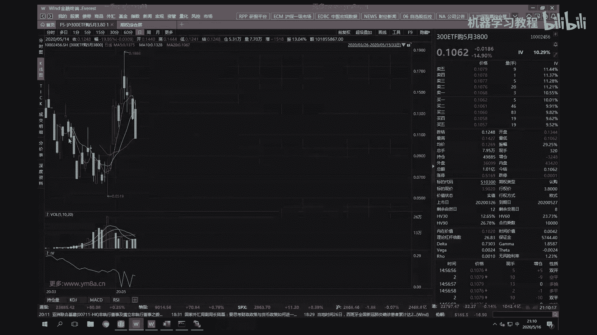

但是在如果说你我想要去分析已经退市的合约，就是现在不带交易的。

不再交易的合约的银行波动，那目前万德就是说，我们只能就是说通过调历史数据的方式，然后历史数据可能我不确定有没有分钟频率，可能只截对，应该我当时用的时候是，他们是没有分钟频率的啊。

就是IMPROVEL他们只有日频，那事实上你做期权如果错过，错过就是日内的变动，可能有的时候对，你看大家看一天的变动可能百分之几十。

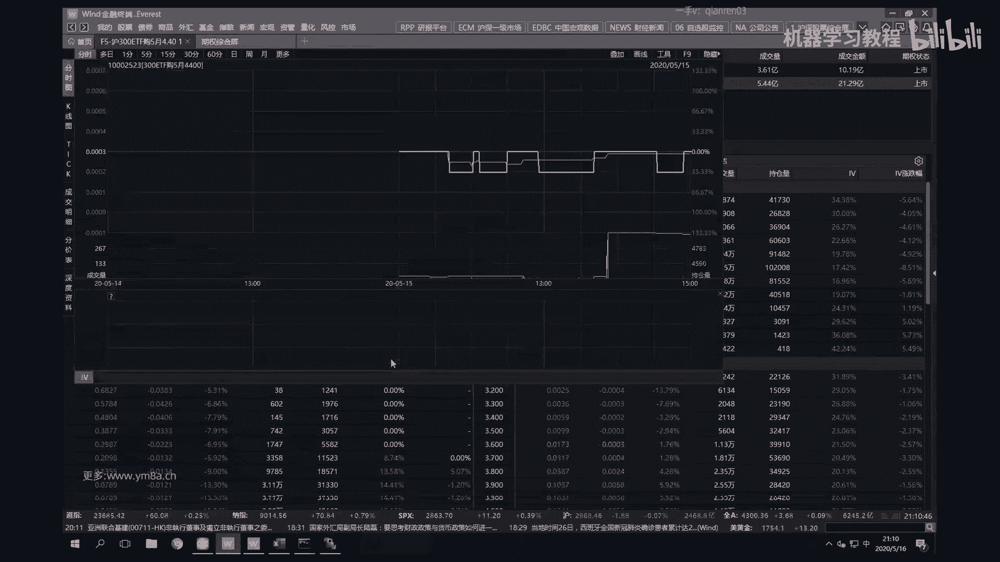

那日内的变动如果完全miss掉，只看收盘做日级别的策略的话，我不不我不排除说按照我只做日级别，也有可能获得比较好的收益，但是呃如果说想要去就呃，其实但是想要说获得更为稳健的收益吧。

或者说我有一个期权的投资组合，我不可能说每天只在收盘，接近收盘的时候去调一次仓，而是我在日间的时候，就是在交易的过程当中，我要时时去盯着我，整个portfolio的这样一个risk。

就是我们的所谓的各种各样的GREEKS对，所以因为因为期权，事实上日内的变动还是比较大的对，然后如果说行情发生了比较大的偏差，我们还需要进行REBALANCE，我们的portfolio。

所以所以说就是有这样的就是分析工具，是希望我们就能够就说呃，不管是去做历史的研究，还是说在实盘的风控跟交易过程当中，我们都需要有就是相应的库区，实时帮助我们盯住我们的风险，对嗯事实上我想一下呃。

对万德有一个有相对来说，对万德的期权已经比以前会好一些了，呃除了我们的波动率曲面，然后，啊对期权组合计算器，对但哦对事，事实就是说我们是应该自己去用贵，就是我们自己去用Python或或者是C加加啊。

哪怕你是用呃，我不确定excel是不是可以做，我我们当时解决的方案是呃，是可我们最刚开始的一套解决方案是啊，我们用我们用就是用一个服务器，因为用一个服务器就说我们是做风控，做风控的时候。

用一个服务器去分别计算所有合约的，这样一个GREEKS，然后我们用不管你是用什么样的方式去用message q，或者是还是说你是单机的都OK，如果你是服务器的话，你可以用message q。

在不同服务器之间去传递这样的GREEKS的数据，然后在交易员和pm的终端里边，我们是你可以自己去写一个贵，或者是用Python，或者是用C加加写到excel或者Python写到excel里。

Whatever，然后你可以获得实时的，我目前的PFOLIO的就是这样的一个呃状况，就是这样的一个grace状况呃，对万德这个这个好像应该，这个是应该是一个是一个比较静态的东西。

但是我们在交交易员需要的是，可能是一个是一个动态的动态的这样一个数据，所以呃对，所以就是说我们知道底层它是怎么做，然后包括呃当然是说怎么去调GMQ，怎么是去写这样的一个呃前端的话呃。

我觉得可能应该课上不用花太多时，我课上不用去设计讲这些吧，因为呃可能大家稍微看一看PY，qt或者是其他的C加加跟excel的这样一个教程，可能都会都都应该花一段时间，都能够去做出这样的一个东西来对。

就是说最终的目标是我，我希望就是大家的最终目标是呃，我告诉大家是说可行的路径，那大家可以自己去花业余时间，哪怕是这个课程结束之后，可以去自己做出一套，就相当于说我能够去实时动态监测。

整个portfolio的这样的一个呃，前段呃，就包括因为这这个就是包括像这样的一个图像，我们当时也是最刚开始的时候是，其实参考就是万德这样一个东西，然后包括这个这个图，我们都把它做出了一个。

动态的这样一个图像出来，对呃，我我觉得就是说这这样的话可能意义会比较大，当然前后就是engineering的东西还是比较多的。

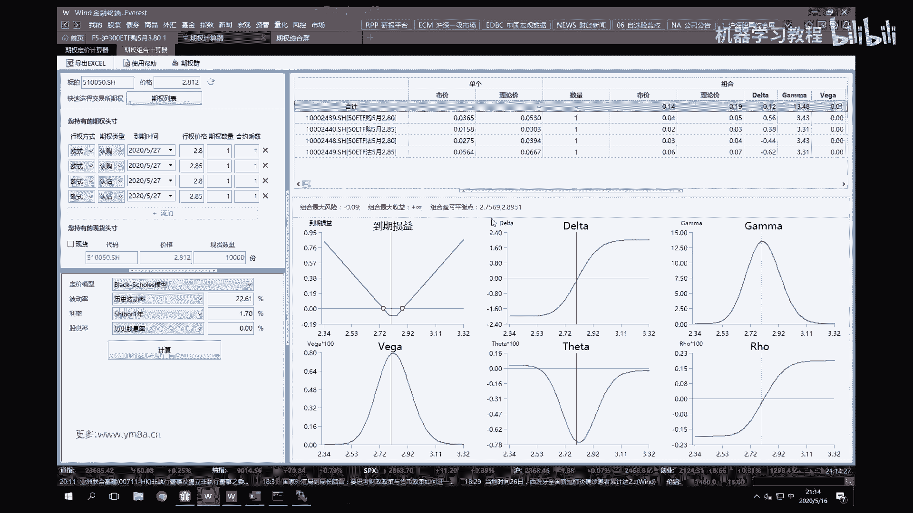

还还是还是需要写写一些代码的，对啊好的，然后这部分的话就是这样，是一个基本的european option的这样一个class，我觉得就额OK了，基本上是OK了，然后啧额然后对，然后嗯，四对呃。

大家对于目前到这一块有什么问题吗，这个就留给大家自己去完成对，然后呃对return data，Okay，这个不能，对呃大家到目前为止有什么问题吗，好哦，我们这节课先到这边，然后下节课我们再想。

就是怎么把这些东西给组合到一起去，好的那大家没有问题，我们先休息15分钟，哎hello，大家好呃，我们现在回来哈，呃我还会还是再问一下，就是嗯那个我这个还是得问一下大家。

就是这个back testing呃，有有什么样的问题，对先呃先先哦，不知道就是有没有同学能能完整的把那个uh，OK啊，已经有同学了，Ok moving average，我经常start bless。

那那那那OK啊就是嗯你可以可以可以没问题，这个star flass就是简单的均线策略，是会比较那个了，比较简单，那个就是那可能上世纪还能挣钱，这个世纪我不太相信，就是单纯的就是说没有经过优化。

或者说直接用一个more vage能够赚，能够就就稳定的赚钱，应该不太现实对那那那挺好，至少就是这个同学已经能跑起来了，对，然后事实上就是呃，就是我们就是我还是说得强调，得把这个呃平台先给跑起来。

跑起来之后，我们才能就是说接着把我们去，你去不断的去测试，因此找correlation比较高的因子，然后我们再去说白因子去做，我们的去做我们的回测对额这部分可能是嗯。

然后对这部分可能是只有通过这样的过程，才能就是形成额形成这样一个闭环吧，对嗯然后就是说我看一下呃。

对sorry。

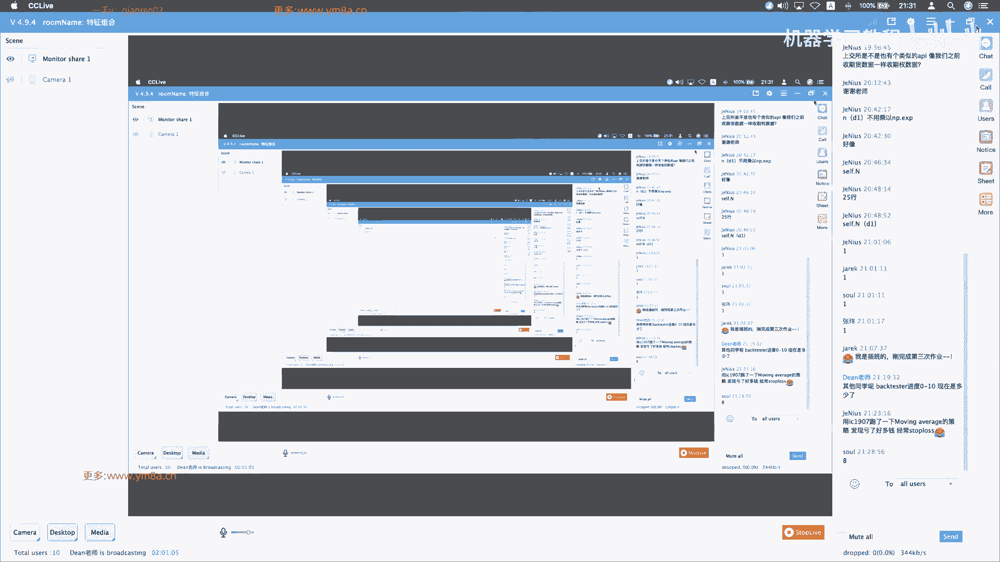

嗯对嗯嗯然后其其他同学呢，其他同学是已经做完，那么还是说遇到了什么困难，对呃我在想的话，遇到的遇到什么困难的话，对其其他同学是个什么样的情况，嗯那没关系，反正就是如果遇到困难的话。

可以就是在私下找我找我交流吧，然后就是对，因为我觉得对，然后如果觉得实在有困难，那其实嗯先这好像也不能跳过去哈，对因因为就是这个东西不做完还是不太好，我们就做这做接下来的事情，然后对。

然后还有就是说我们先，然后我们回到这个课上来的话，就是呃，嗯back tester我记不得是第三次还是第四次，就是大概是讲了讲了差不多有六个小时的时间，对back tester对。

就是对差不多是第三次或者第四次课，做第四次课结束之后，我们应该就是，然后留给大家一个五一的时间，去做完这个事情对，然后然后这边呃我们回到这个option上面来。

就是一个是呃就是calculate imply able，然后呃我就是我们先看，就是说单个的option是怎么去做这样的事情，呃，然后其实就是说呃你可以当然可以用牛顿法，就是我给一个初始的点呃。

然后不断的去寻找，就是随着我们的derivative呃，呃就是根据我们导数去寻找我们下降的方向，但是这样可能就是说如果刚开始derivative，选的不是特别就是刚开始初始点，如果选的不好。

或者说我的呃算的时候，步子就是它有有可能会出现，有有部分情况可能会出现说我不断的在震荡，但是说就是我可能step比较大，或者是怎样，就是我不断的去震荡，但是找不到。

就是我们的就是呃只找了一个optimal的点，所以呃事实上我们就是常用的话，我自己习惯是，还是说是用，就是用二分法的方式去来找这样的一个呃，找这样的一个就是期权的IMPROVEL。

就本质上说呃就是说我们要去呃，就是说要去找，根据当前市场上给定的这样一个option price，然后去带进去去算我们呃，然后然后我们要去反推出我们这样的一个，Imply for，对。

就是imply able，本质上是就是说不是说imply able，决定option price是反过来的，是当前市场交易的交易形成的价格，决定了我们这样的一个imply able呃。

然后其实要做的事情，就是让我想想这部分需不需要在嗯对，就这部像这部分就是留给大家课后作业吧，我觉得这这边就是单一的while loop，就是说我用一个对，我用一个while loop，只要说我的。

呃like呃，就是我的那个我的mid跟我的额跟我的low，或者是呃，小于一定的like，我们认为一一负六或者是一一负五，比如说一负的话，大概是0。001%，那实际上这精度已经相对可以的话，呃。

我们就认为就可以了，就我们就认为就可以，可以把这个id给输出过来了，对，然后但是然后我这边就是想要想要，就是跟大家提示一点，就是说呃当我在算很多历史数据的时候。

呃我们现在这边所有的代码都是一个option，就是我可以用follow up去做，然后我有很多option按照follow把它一步步去做完，但事实上这样说会是会非常慢，很有可能你说算个几天几呃。

我历史上5年的数据你可能都不一定算得完，所以这个这个时候给大家的建议是一定要去把，就是真正在engineering生产的时候，我要把所有的代码全部去VETERIZE。

我要把所有的代码都要去BACTERIZE，然后这边就是要要给大家呃，就是一个小的trick吧，我觉得就是大家可以想一想，就是说我有我有不同的期权合约，同时再去算imply for的时候，对。

就是我期权的到期日或者是whatever，什么什么都有可能不一样，然后呃我怎么去确定这么多不同的期权合约，在同时VECTORIZE的时候，就是说我用一个NPARRAY呃。

就是说我这个时候把所有的SKT西格玛R呃，甚至是call put都有呃，当然call put我不建议把它分开，你还是就是分call或者是put，就除了这个，其他所有可能都一个个都是NPAGR对。

然后这个时候我怎么去把calculate iv去把它去，Vectorize，对，就是说我单个去计算的时候呃，用while loop，我不需要知道他什么时候终止就OK对，对大家是大家有没有什么好的想法。

对就是如果我多个合约的话，我怎么去挖路对吧，因为我这个时候所有的MD跟呃，就是我的low和high呃，都是一个个NPY，而不是一个个具体的数了，然后我实践过程当中，这个我我一般考虑。

就是说我可能它最大的imply able，是1000%，虽然说超过1000%，也不是说没有可能，但是事实上概率都比较小啊，就是如果真的出现出现，1000%的隐含波动率，可能这个时候不不是盯着我们的风控。

可能是要想办法，可就想办法看看，就是我们现有的持仓怎么去把它平掉，或者是嗯或者是怎样去处理了，对就是比较极端的情形对，那当然我可以，但我还是回答这个问题来。

就是说如果这个时候我我的option price，或者是我所有option我是一个100的，就是我我有100个合约，我同时去计算，那这个while while的时候我怎么改，我该我该怎么去做。

或者说不用while到底怎么去做，因为我这个时候要考虑就是是每一个合约的，每一个合约就是non parle ray，每一个合约它都需要在这个range，当我有的合约已经已经收敛了。

有一些合约还没有收敛的时候，我该怎么去把它BACTERISE呃，大家可以想一想，对，你当然可以说就是哪个合约你算完了，你就把它保存出来，不要去算了，对吧嗯呢，但事实上就是我用VECTORIZE的意义。

就是说我就避免循环，我如果说是去，如果我们还是再去用follow p去判断，哪一个合约算完，哪个合约没算完了，那相对来说可能是比较浪费时间了，对，对就是就失去了我们VECTORIZE的意义，对。

呃那我我这边给的就是，大家有没有什么好的办法，我想先听听大家的想法对，就就我1000个合约，我想不要用，不要用for loop，然后但是想同时就把它给计算下来，对同时把他的IMPLIABLE给算下来。

因为大家可以观察到，就是说我们接下来我们下面的就是每一个方块，事实上我去把它VETERISE呃，这个都是OK的，浪牌有很强的这种能力对吧，因为我long派直接是不同的。

s divide by different k就是都OK，但事实上我们S1般是一个对吧，因为对就我额对我我这边就是给大家的，就我个人的建议是我们用for loop呃，instead of呃。

这是不是说呃，就是我我的意思是use for instead of呃，while这是什么意思，就是说我这个时候不是说，等到它收敛到额十的五次方，因为因为我们可以简单的算这样一个东西啊。

就是二的十次方是1024对吧，比如说我可以强制性的让每个合约都去跑十个，二分法，就是跑十次二分法，Sorry，不是十个，那这样这样意思是说当我可以把十去，我就近似的去除以1000的时候对吧。

这样我们约等于就是说大概这样子，差不多是我可以达到0。01的精度，对，那如果说呃，那如果说我想要达到0。001的进度的话，那我我不就不是说，我就我就不是强制的运行十次二分法，那我可能是考虑12次。

12次的话是四零次吧，那我可以考虑14次，这样差不多可以达到0。001的精度对，就就就是这个时候是说，如果说我有多个合合约想要去同时去计算i id，我们用for loop，而不是用while loop。

对啊，这边要注意的是，我这个follow不是说针对每一个合约去分别计算，而是说我针对于这样一个呃matrix or array，对我这个时候是强制性的，让他去跑十次额二分法，对，比如我强制性的去给十个。

就是说我强制性的会给十次，十个不同的imply able的值，然后带到呃calculate corprice里面，然后让他去算出我们的option price，跟我实际的option price去比较。

然后我通过这种方式，我就可以说我就可以说去批量的，哪怕说1000个，我们当时自己测试，就是说同时说是呃就是同一个时间节点啊，200个200个合约是呃。

就简单的用Python用NPYTHON就是跑下来的话，就是不到0。1秒，我们是可以把它完全算出来的，就是这这种情况下，是满足了我们去实时定价的需求，嗯对对呃，我不知道大家听明白了这个意思没有对对。

就如果说我不用这种方式的话，可能就是大家处理分成数据，可能就是用FLOOP一个个去算，可能都会花比较多的时间，对就是我这边给了大家是一个相对来说是，就是我们是就像single option。

但是我们先把这个做完之后，大家会我需要就是大家去把呃这个东西改成，就是所有的都rap rice，当我传递的s k t sigma r等等，都是一个个呃囊牌a ray的时候。

我我们仍然希望这个class能够去work，对这个这个是要留给大家去做的事情，然后然后我觉得就是值得，就是去注意的，也就是说在计算这个呃，就是用by section的方法去计算imply b的时候嗯。

对这是一个算是一个小小的trick吧，对所以就是嗯大家注意就是呃在计算，就是像QUFINANCE里面，就是或者说其他ENGENER的东西，其实是能够尽量的向量化，就可以去尽量的向量化。

然后当然我不知道这块东西，是不是可以考虑说用GPU来去计算，对如果对，事实上我看过是有人是用GPU来就是对，就是exotic option的话，是用ammonte color模拟来去做这样的事情。

是有人考虑过是用哎，是不是有人考虑过是有人已经用GPU做出来过，对我不知道刚刚讲的这部分，大家有没有去理解对吧，就是如果是呃，就是如果是要for嗯，我我如果我们要去向量化的去做的话。

这部分肯定是要大家去注意的对，因为这样我就会呃避免了去计算，对避免了去判断我这个某个合约没有算完，因为我可以保证的是，在12次或者更多的by section的方式下。

我一定能够保证我的波动率去收敛到一定的，就是我选项二的进度，对这样相对来说是会比较快一点，而这部分大家有什么问题吗，对这个也就是我想强调的一点对，因为之前曾经呃，有实习生在去做这个事情的时候，说。

跟我说这个东西很久都没有算完，然后但其实简单的去把它就是VECTORIZE一下，那其实就会很快了，对这是一个要去注意的地方，这是写代码的时候，大家要注意，不能就是一直一嗯，就是一时写的比较爽。

然后后期然后运行效率什么都会有问题嗯，嗯然后我想一想，就是接下来就是说呃，如果sim就是大家把这个都完成了之后的话，对，那这一次的话，其实是需要把我们的就是一个个的对，还是还是说一样的流程。

我们先去把他的啊mini price给算出来，对就是我们先先去把期权这样的合约，mini price给算完，算完之后，然后去算出它相应的GREEKS，把这样的值都给保存下来。

所以最好是每个文件都保存下来呃，对因为我们看到的是，我们可以给大家看一下，这个这样的一个数据结构，或者说这个文件组织方式，这是我们就这呃这个文件夹之后会给大家，就是我们一天它是有这么多合约。

然后每个合约打开来，都是像我们这样的一个excel文件，就是CSV文件对，然后然后就是哦一个月里面，然后是按天存放，我们现在有一年差不多250个交易日对，然后每个交易日都这样的这样的一个合约对。

呃所以数据处理的话嗯，对期权其实数据量也不算小，但那期货我们可能之前只要处理一个品种，但是期权部门必须要是，把对所有的合约都去去处理，然后对然后要完成这次要完成这次作业的话。

就是要找到at after money对，然后我还忘记了，是我就算了，还有不仅仅是呃X8了呃，就是这january in january对吧，就是我们我们就看当月的吧，我们可以看当月的。

这样不熟悉的同学可以去理解一下，就是是什么意思对，对，所以所以这次就是说嗯。

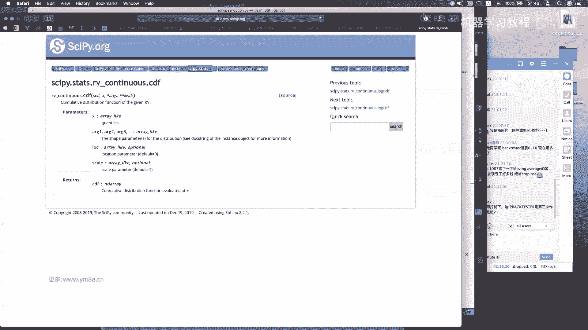

是希望先大家先把这些数据给呃。

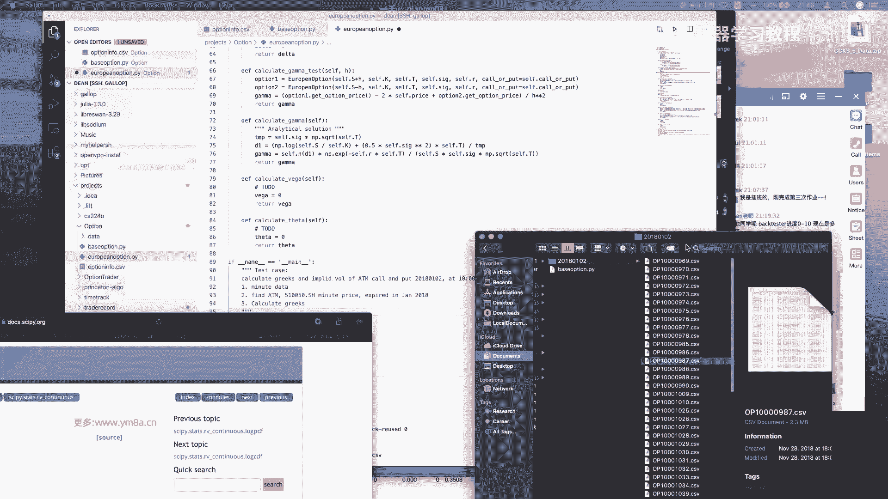

嗯tick data就是其实分几步了，还是先去去呃，呃处理它的交易时间对，交易时间是9。25分。

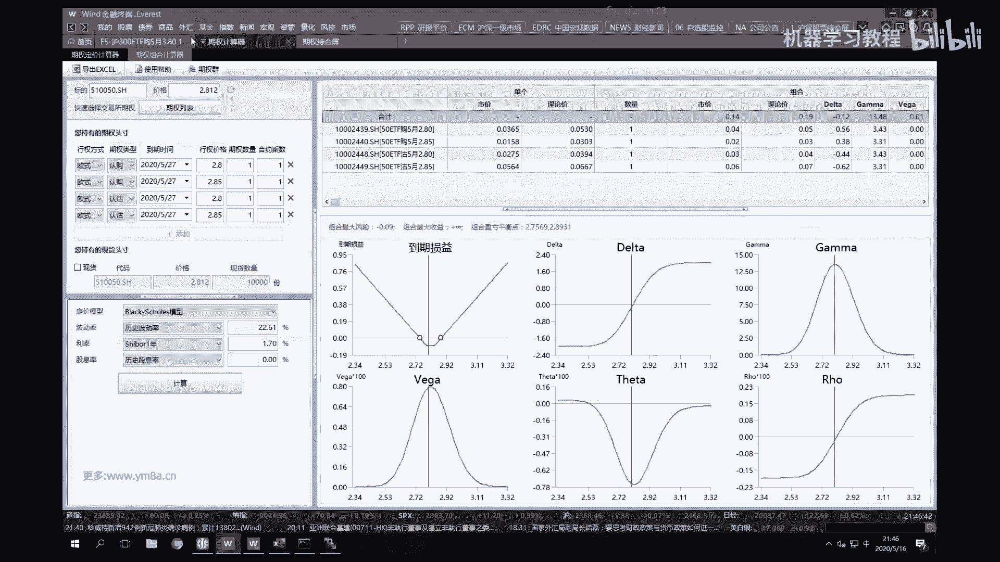

集合竞价，09：30分正式开始交易，它跟股票的交易时间保持一致，所以是9。30分，没有上午没有休息时间到11。30，然后下午一点钟到三点钟对，只有只有日盘，这样处理起来可能会好一些对。

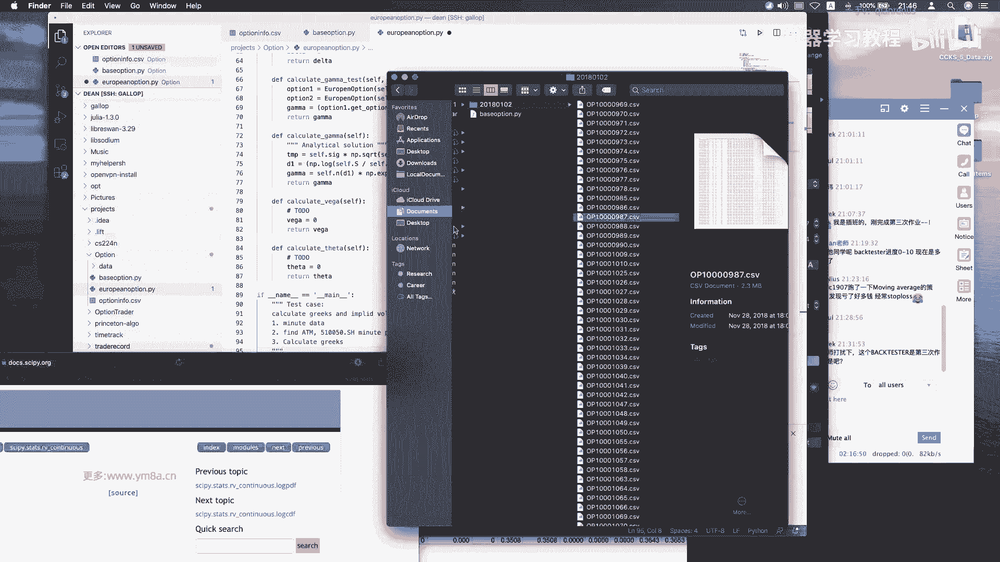

然后大家把这个期权的先呃tick数据处理完，然后嗯其实最好的方式是，就是就是以后迟早就是说你要用tick数据的话，其实是最好，相应的tick数据可能都要去把它去存下来，存到数据库里面去算。

包括每一个每个tick，就是那就是take个bit，跟2ask对应的就是IMPLIABLE，可能也是也是也是也是需要的对，OK对，就是这是我们这边的input，就是我们这边除了。

这是我们的BP one和sp one对他这个叫法有点奇怪，但是额应该是就是意思是一样的，这个这个是那个对这个是比较高嘛，这个是比较低对，当然这个合约目前不是很对，也不是流动性不是很好。

然后我觉得比较有意义的一点是，大家大家可以就是把他的呃imply work给pd出来，因为嗯2月6日吗，不是2018年2月二月份吧，我不知道是不是2月几号了，这是正好是贸易战刚开始那几天。

所以大家可以观察到呃，那几年市场有多动荡呃，以及就是我刚开始的时候，就是刚开始我去，我那个时候差不多刚开始做交易对，然后我记得刚开始交易的时候，哼好呃，就是就是我作为卖方。

其实portfolio是亏了不少钱，就当时整个人都有点吓傻了，对就是不知道还能这么亏，所以嗯就如果对我觉得有意思，就大家可以把2月份的，就是2月份的几点数据给处理处理出来啊，看一下就是把。

然后最好是把每个月的就是品质的期权，它的imply word，你或者就是IMPLIABLE的走势给plot出来，我觉得这样你会比较直接的观察到嗯，整个期权市场它是怎么再去变化的。

对就是以及就是因为正好是贸易战打贸易，贸易战刚开始之前是春节，然后以及经过春节这么长时间，春节之后它会怎么变化，以及也可以观察到一年就是18年，每一次呃，双方会有什么样的举措。

会对于整个市场的波动率会有什么样的影响，我觉得把那个破导出来还是挺有意思的，应该你观察到是刚开始是imply able，就是冲击很大，然后之后每一次事件都会有成绩，但是相应的incredible。

上涨幅度是不会如之前的幅度这样大，对所以in power就是，所以本质上来说，就是说应该是有利于大家观察到，就这样一个黑天鹅事件是怎么发生的，就可能平时呃市场波动不会很大。

但是一旦一旦黑天鹅事件发生时候，imply world涨起来非常快，但是他DK的时候，又不像说它上涨的速度那么快，他可能反而是需要一段时间，就可能18年有一部分或者说大部分时间。

他的IMPLIABLE都是处于这样一个高位对，然后事实上嗯有了这样的数据之后，大家再去不管你是是去做投机，还是说我就典型的去呃，我不管是做买方还是做卖方吧，你简单的就是说你可以去嗯去测试。

就是一个是system systematically，我去啊shout我的波动率，然后以及我的说我就是单纯的去呃，根据时间或者之前我是去赌方向，大家可以观察到就是在不同的imply ww情况下。

不同的策略的performance的表现是不一样的，然后这个时候其实就有助于就是初步的，你可以看到就是说当目前市场行情，他的呃IMPLIABLE在历史上处于怎样一个分位，这个时候你就可以考虑说。

我这个时候作为一个PM，我的策略方向应该是，我的策略应该是偏向怎样的，我的我的各个GREEKS应该保持怎样的暴露，到底是呃我应该是保持正VEGA，还是说是negative vega对。

嗯对所以呃今天其实第一课，第第一课的内容就是嗯本，本来我会觉得刚开始准备说第一节课花单大，花一些时间跟大家GA一下期权的，就是一些基本的一些知识，但所以大家可能都比较知道。

所以就是就相对来说会快一点对呃，然后这一次的话对差不多，然后这部分是呃就是就是要完成这些作业的话，呃除了说是我们有期权的，就是price的价格，然后这张表也是大家去读的，因为本质上来说。

你可以把它作为一个key value来去匹配嘛，我们每一个合约，你都可以去得到它的这样一个，得到这样他的一个信息，然后呃我每就是在每一个不同的交易日的，在交易日每一天不同时间点。

我可以根据呃他的exercise呃，Exercise state，或者是就是啊expire date，然后去计算我计算我的到期时间对，然后根据这样的啊，目前可能还不涉及到分红。

然后分红的话对我我我我先鼓励大家，就是建议大家是遇到分红的时候，大家自己先去想一下，应该是2015年11月吧，2091每年的11月大概是一天五分红，遇到分红的时候，我这个合约应该怎么去处理对。

然后下节课我也会给大家讲一下，就是嗯应该是怎么处理，其实你理明白了分红的它的本质，就做这样的处理，应该不是特别麻烦对，然后额可能要注意的一点是，就是这边不是有一个合约张数，合约张数嗯。

我找找看有没有其他对，那事实上这这个合约张数啊，我们呃这个合约张数反映的是在，2020年5月16日，今天这个时间节点，这个期权合约每一张对啊，就是每一首对应的是多少张，因为这是分红过的。

然后包括也看到他的行权价，其实其实也已经变化了，但事实上就是说在分我们要做的事情，是要在分红之前，我们需要把它就是说在分红之前的时间，我需要把它的行权价跟control unit给。

把它给recover过来，就返回过来，你事实上就是事实上就是，2。348×1020，再除以1万，你就可以得到它原来的这样一个价格，然后我们要注意就是在分红当天跟分红之前，那就是分红之前跟分红之后。

就是他的合约陈述，包括他的行权价都是不一样的，即使他的合约的就是security id没有变化，对这个是值得，可能大家要去注意的，就是处理到11月12月之后的数据的时候，可能会有一些区别呃。

事实上我想一想，15年一八年对18年一八年一月的时候，我们已经已经有涉及到就是非标准的合约，然后刚开始如果简便的话，你其实最简单一点，就是说我只交易我的标准的合约对。

因为因为事实上是为了就是机构为了交割方面，我们不太会去涉及呃，就是非标准的合约，就是说即使说在分红之前，我们持有这些合约，分红之后这些合约变成了非标准合约，然后我们都会想办法唉，这时候交易所的状态。

就是说标准跟非标准的合约同时上市，交易所会去新挂合约，但是我们还是会尽量想办法，把旧的非标准的合约给平掉，然后逐渐移仓到新标准哎，就是新的合约上面去，对嗯对，所以所以刚开始你只处理就是手数为1万的。

这个合约，我觉得是OK的，但是如果你要完整的追溯整个历史数据的话，我建议是标准和非标准的，其实都是要去处理的嗯，然后事事实上就是在合约换，就是非标准合约出现的时候呃，有可能还会存在一些套利机会。

大家可以研究一下，就有时候其实还是挺大的对，就即使明明他们就是相同的东西，但是就是由于市场的供需不平衡，导致了他们的价差出现比较大的偏离，那完全如果你考虑到你的资金成本是OK的话，完全可以。

就是呃把这样的，就是短期来说去做这样的一个套利，事实上收益是相对来说是比较可观对，但但因为天数其实不多，虽然年化算起来很可爱，但其实实际比例也没有那么大，但是是值得一做的。

对呃我在想这次的数据应该就是这些对，还是还是根据，如果我们有之前的话，就是tick数据相对来说处理就之前的写好的function，你只要相对来说做一些改动，呃这次作业应该不会太难。

就是我们先处理到把处理成七成的，就是嗯先处理成把raw data去除掉，非交易时间段之外，然后我们得到标准时交易时间段的数据，然后合成分钟的数据，合成分钟数据之后。

再去把他的各种各样的GREEKS给算出来，对这个大家还是呃，这部分大家就是去自己做一下吧，我觉得可能可能会好一点对嗯，然后对于期权这样的特性的合约的话，呃对你可以把存到数据库来。

我之前就用的是mongo dB，也相对来说是比较好用的，因为MONGODB每一条记录相当于就是一个and jason string，也就你可以理解为一个字典对，所以其实用起来也比较方便，大家有有有呃。

我我建议大家是把它都换到那个呃mango，换到数据库里去嗯，这样可能会好一点对，因为期权数据本身也不算小吧，对然后每次读文件可能还还花挺多时间，因为这个时候就是在做期权的时候。

我们甚至因为因为呃做期权的时候，我们不仅仅要的是价格跟时间了，对我们还有其他的衍生，那就是衍生的就是呃GREEKS这些数据对，那因为事实上就是为了加快期货的回收速度时。

你很有可能说我我如果只用到价格跟成交量对，我可能只会加载这两个列，那只加载这两个列的话，你数据量是可以压缩到很大的，对，呃但是期权的话我建议大家可以试试看，就是这个这个用NOSQL的数据来说。

应该来说相对会比较好一点，然后你可以设几个关键的key，对数据库还是建议大家是掌握一下，是基本的工具好的嗯，然后大家这节课有什么问题吗，对我再多说一句，就是为什么把就是呃，我们的就是盘中交易的时候。

当然可以说是呃，先就是你不管是把它存到内存里还是存到怎样，然后盘后的话我们把我们算到的GREEKS，然后呃跟然盘盘后算出来的，归一直从不管是万德还是其他地方拉下来的，这些数据，再去会核对一遍。

然后再去做每天的PNPNL的分析，这可能是我们我们当时就是每天都会去做的，这样一个事情对，所以就是GREEKS是可能比单纯的价格，更加会去重要一点，对啊这边也要加一个to do，你就去，好的嗯。

大家还有什么问题吗，嗯然后如果没有什么问题的话，那这节课就先这样哦，还是我今天我今天把数据早一点发给大家吧，上周确实拖了一天，等到周一才发给大家，对，今天我待会儿就把期权的数据额发给大家，还是一样的。

在那个，百度盘，哦我看还好，这场像总共只有几百兆对，嗯现现在机械硬盘，反正也是相对来说比较便宜了一些，所以可以，然后有需要的同学在就可以去加硬盘对吧，好的，那没有什么问题，就先这样。

然后呃如果有同学还有什么其他问题的话，是可以找我，现在可以找我私聊，或者是就或或或者也不用私聊，就是有什么问题可以提出来嘛，然后我正好给大家公开解答一下，包括前面任何一次作业的都OK。

对然后期权的有一点的话就是呃对呃，面QUT的话，或者是MF1很多program，还会有蛮多人喜欢去问期权的额，期权的相关的面试题，然后对如果如果大家有兴趣的话，我也可以到这里，大家就是再找一些。

就找一些比较经典的题，可以让大家试一试嗯，就可能说呃相对会熟悉一点的科学，就是如果做过期权交易会熟悉一点的话，可能对于这些题目会觉得好一些，就比如有人问你说嗯，你说什么样的期权就是伽马最大。

那事实上做过交易的人可能脱口而出，没有做过交易的人，可能还要想一想对，然后包括期权是近月的伽马还是远月的伽马，然后如果我们，我们现在还不仅仅说是看这几个basic，就是GREEKS，然后如果还有VA。

还有其他的一些更高阶的一些AGGREKS的话，那可能就处理起来会更麻烦一点，对不一定也不一定是很麻烦，但是对呃，事实上就是把它分解的相对来说比较精，细一点的话，就是对于你呃去相片了。

然后归因会好一点对呃事实上我看了一下呃，我们在做归因的时候，用日内用分钟数据就可以达到比较高的精度对，当然有tick数据计算下来可能也更好对，然后以及呃就是如果我们有了，就是有了tick的数据。

事实上就是说我们是可以自己去合成，就是波动率的指数的，即使说我不做期权的交易，我用不这个波动率指数，也可以反映当前市场的情绪，然后呃兴业证券有用过，有一个兴业证券有一个水晶球，水晶球的模型。

我记得它是通过期权上的啊，就是COOPERATIO等等嗯，就是呃等等一系列的比例，然后大概是四个因子，它合成了这样一个情绪的这样一个择时的指数，然后有兴趣的同学也可以试试看呃。

如果我对应的期货有对应的额期权的话，那是可以考虑用这个东西来辅助，帮我期货作为一个呃期货上面进行择时，然后如果做股票一天股票的股指期货的走势，那事实上也是可以通过呃，股指期权以及ETF的期权。

这上面一些因子来去考虑的，呃事实上就是做交易，就是我拥有的信息越多的话，嗯可以当然是有效信息，不能引入过多，过分的就是过多的杂音，你绝对是说，那你那你就会比别人的爱值回去稍微会多一点，对嗯。

然后我现在分享一下这个期权的数据，嗯对，而最好这个数据大家就是呃，仅限于本课程使用对，然后毕竟我也是就是花了也不少钱买的，当时对，所以嗯还是有效期是七天，然后希望大家尽快去下载哈，有效期是七天哦。

我也在微信群里发一下好了，待会嗯那如果没有什么问题的话，我们本节课就先这样呃。

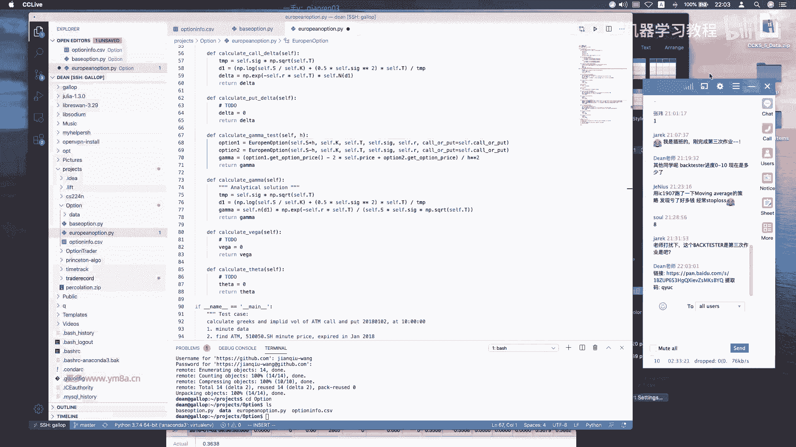