# 【比刷剧还爽！】这太完整了！python金融分析与量化交易实战课程，全程干货无废话 入门到精通一步到位！（数据挖掘分析／大数据／可视化／投资／金融／股票／算法） - P2：2.1-fbprophet股价预测任务概述 - 李宏毅大模型_ - BV1JM4m1k7Jn

今天啊咱们来给大家唠的主题，叫做股价分析与预测，那先说一下什么叫做一个股价吧，无非啊就是一个股票今天这个价，明天那个价，然后今天涨了还是跌了，这个意思，那你说这个股票像什么，他是不是说它是有日期的。

还有一个数据啊，所以说我们说是股价的分析预测，实际上我们就要做一个时间序列的，一个预测任务，那这里呢当咱们想要时间序列啊，咱们之前讲过有一个东西啊，叫做aria模型，那个模型啊可能稍微难度有些大。

用起来呢没有那么方便，这一回啊，给大家来说这样一个FACEBOOK开源的一个时间序列啊，预测的一个神器。

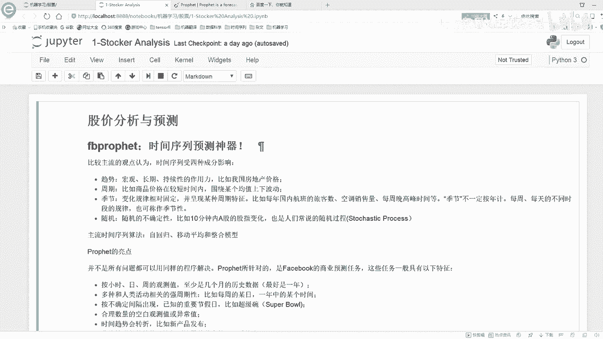

在这里呢我们先来看一下吧，就是这里啊我打开了FACEBOOK它的这个呃，他的这个就是时间序列啊，预测这个框架，它的一个官方网站。

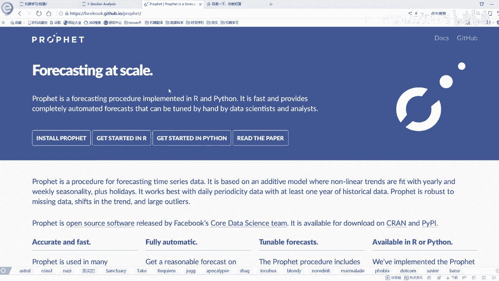

这么的，我把这个网站给它复制过来，我给它复制到这里，这样呢，到时候大家就是可以啊，直接的去访问这个东西了，然后这个就是它的一个主页啊，这个主页当中呃，我建议大家先是整体的了解一下吧。

我先给大家来介绍一下这个东西吧，这个啊就是时间序列呃，咱们先说时间序列啊，都受什么成分影响，首先呢一个序列你要它是能可分析可预测的，它首先啊就是得有一个趋势吧，有了一个宏观长期还有持续性这些作用。

比如说时间序列好多种东西啊，都可以说是跟时间跟序列相关的，比如说随着时间的推移，咱的一个房地产价格还有什么相关，还有跟周期相关，比如说这个时间它就是这个时间序列啊，它呈现出来了一种周期的趋势。

围绕着一个周期进行上下的一个波动，还有什么，还有季节性的因素吧，在春夏秋冬啊，它的一个季节性的因素都会对结果产生影响吧，比如说啊咱们国内的航班的一个旅客，空调销售量，每晚的一个高峰时间等。

这些啊都是不一样的，所以说呢我们还可以按照一个季节，把咱们时间序列进行一个分析，还有什么还有一些随机性的因素，比如说嗯这个东西就是不太确定了，有一个随机的一个过程，还有什么呢，比如说我们的一个节假日。

还有我们的一个这个什么什么突发的一个事件，这些啊，都是可能对我们时间序列造成一个影响的，在这里呢我们选择FACEBOOK，它的一个时间序列预测的框架，主要原因在于这里啊，它是肯定是有些亮点的吧。

没有亮点啊，我们也不用这个东西去做，那最大点是什么，我觉着啊就是最大亮点，就是嗯当咱们想构建一个模型的时候，这个模型啊对咱们来说是不是应该封装的更好，咱们使用的更方便，那我才觉得这个东西好用啊。

那这个框架它最大一个亮点，就是用起来非常方便，用起来呢也是比较简简单的，我们只需要调节简单的几个参数，把我的模型就可以非常轻松的给它构造出来，这个啊就是我的一个FACEBOOK啊，给我们开源的一个框架。

然后呢它啊还有这样的一些特征，就是接下来我们在进行预测的时候，我可以按小时按天，然后按周甚至按月我都可以进行一个预测，也就是说我们要预测的指标，我们都可以自己来设计，然后呢在这里啊。

我们还可以就是去衡量咱们的一个周期性，比如说按照季节的，按照年的这些周期性，我们都可以考虑进去，还可以添加什么，还可以添加一个节假日对我时间序列的影响的，以及呢还有什么还有一些异常值缺失值啊。

它都会帮我们自动啊进行一个处理的，以及还有什么时间的一个转折趋势之后啊，会大家就是介绍一下，在这里啊，我们的一个非常重要的参数，就是时间的一个转折点，那什么叫时间转折点啊，比如这个序列哎。

今天突然升的非常高，那是不是也转折啊，明天又突然降下来了，这些点呢都是转折点，我让我这个模型啊，记住了历史数据当中哪些出现了一些转折点，这些转折点它是不是能更好的去拟合，我当前的训练数据啊。

这个就是转折点对我数据的一个作用，但是呢咱们得想这样一个问题，这个转折点啊对我训练数据来说，哎我能拟合的更好，但是呢对我的测试数据来说啊，是不是容易过拟合啊，因为转折点啊都是凸上凸下的。

这样呢就是非常它就是非常强烈的去捕捉了，原始你数据集当中的这样的一个趋势，那这个趋势一定是在测试集当中呈现的吗，这个还不好说吧，咱们之后啊回来探讨一下，就是这个转折点啊，它是我当时这个框架当中啊。

最主要的一个要调节的参数了，这些亮点呢都跟大家简单的概述了一下，然后呢我们现在用的这个算法主要是什么，基本上就是这三个的结合，一个呢就是时间序列预测的一个最主要算什么，自回归模型吧。

要基于自己的前一段时间的数据预测，接来数据吧，所以说啊时间序列它是一个自回归的模型，还有什么，还有移动平均，还有咱们的一个整合模型吧，这些啊跟我ROA模型啊都是差不多的，只不过说呢深度呃。

就是FACEBOOK它这个框架给我们封装的更好。

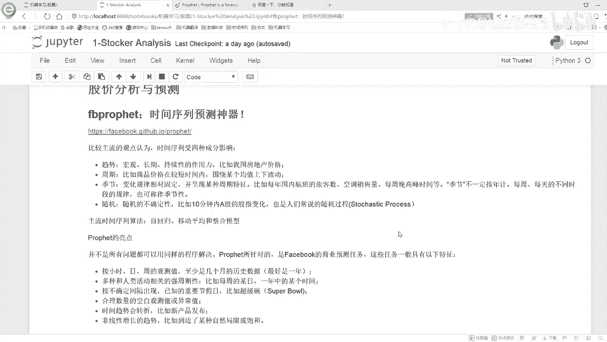

我们用起来呢是更舒服一些的，在这里啊，这个就是我的啊，不是我的，就是这个FACEBOOK啊，他这个时间序列预测框架的一个主页，在在这里啊，推荐大家来自己简单的阅读一下，如果说你以后啊想从事啊。

不是草书事吧，想去做一个跟时间序列相关的任务，咱们可以想到这样一个框架，这个框架从现在来说啊，我觉着用的还是蛮方便的，就是给我自己的感觉啊，因为我也自己用了一段时间，我是觉得这个东西啊。

用起来确实比其他框架都方便，因为简单对我来说我不需要太多的功能啊，前期来说啊，越简单还是越好的，然后呢他有两个接口啊，一个就是说你可以用R来去做，用来R啊，就是去做这个框架。

你也可以用Python做这个框架，也就是它有两个接口，反正我估计大家应该都用Python吧，咱们就点啊，就是啊get start in Python。

咱们点进去，这里呢他会有这样的一个教程啊，这个教程哇这个这个这个这个贪玩蓝月啊。

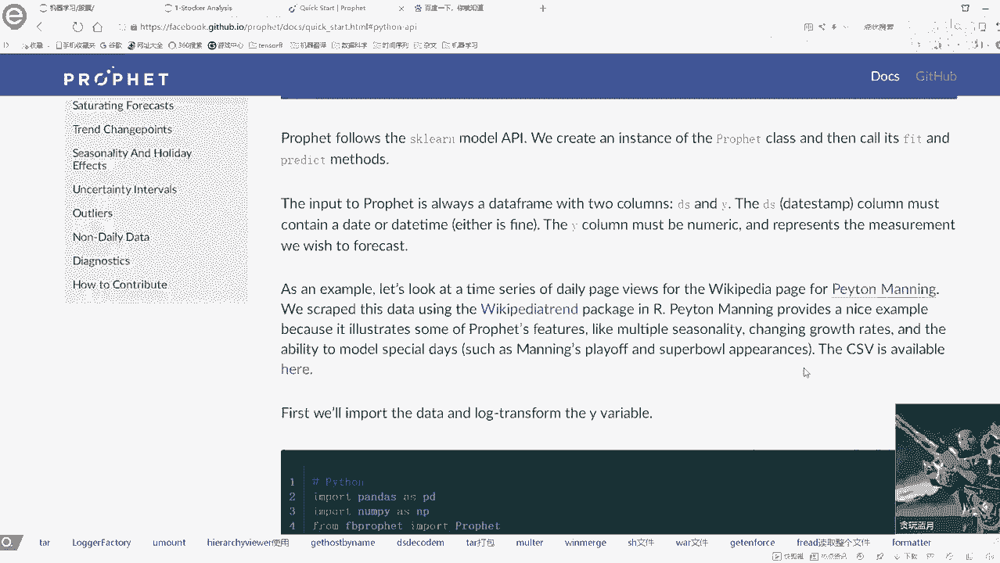

给我看，快看疯了，天天在这砍他。

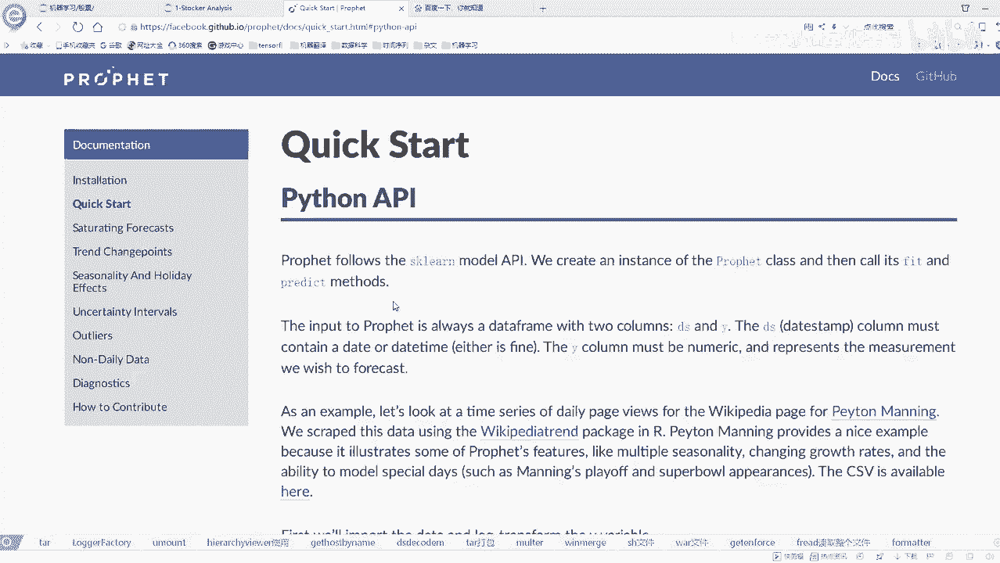

这个教程当中啊，就是告诉你怎么样用python1步一步去做这个东西，我建议大家就是嗯。

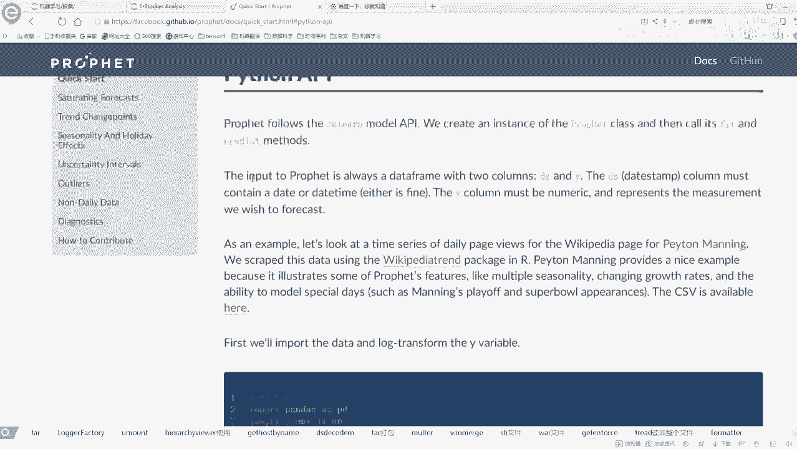

这里边文档其实没有那么多啊，大家只需要花个很短时间就能阅读完。

建议大家先自己的阅读一下，到时候呢我也会给大家讲，就是这个框架我们该怎么去用。

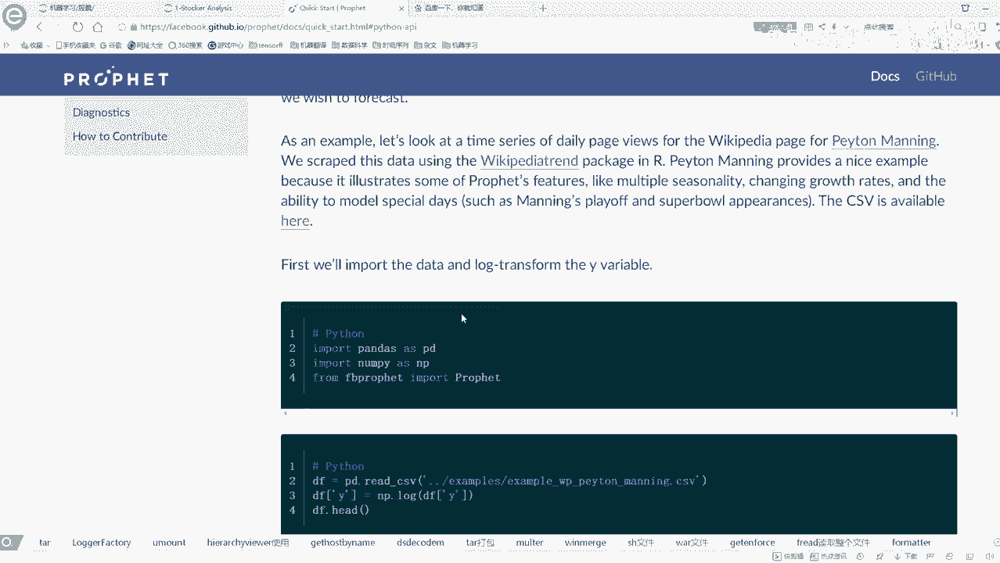

一个基本使用流程啊，就是在这里他会跟你说，你要先把数据啊转换成这种格式一个什么啊，有时间，还有我预测的一个指标啊，这是一个标准形式，一个DSS代表着我的一个时间序列，一个Y代表着我要预测的一个指标。

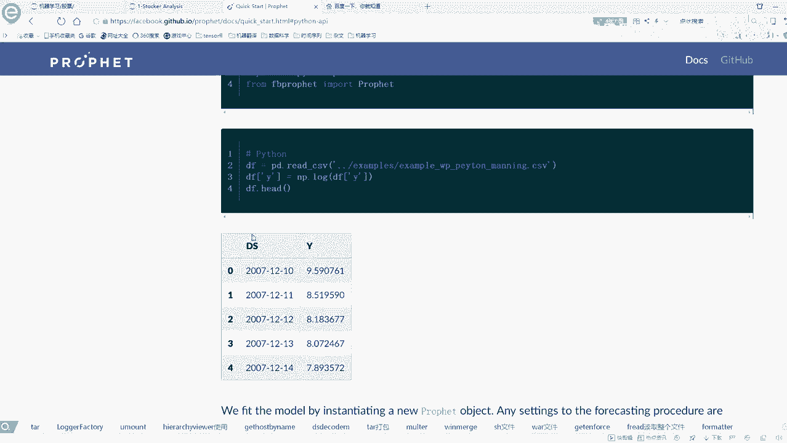

这是我输入数据啊一个基本的格式，然后呢你看它的构造模型怎么构造啊。

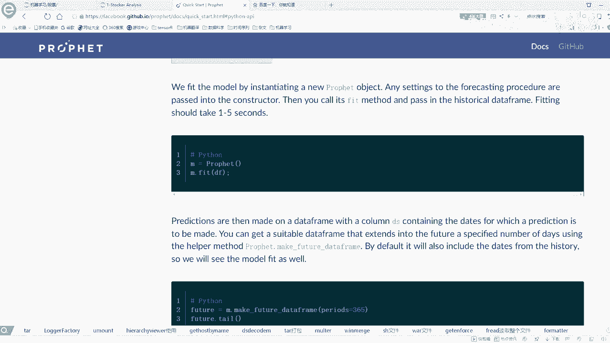

跟那个sk learn是差不多的，你看最上面也说了，他是跟sk learn model的API是差不多的。

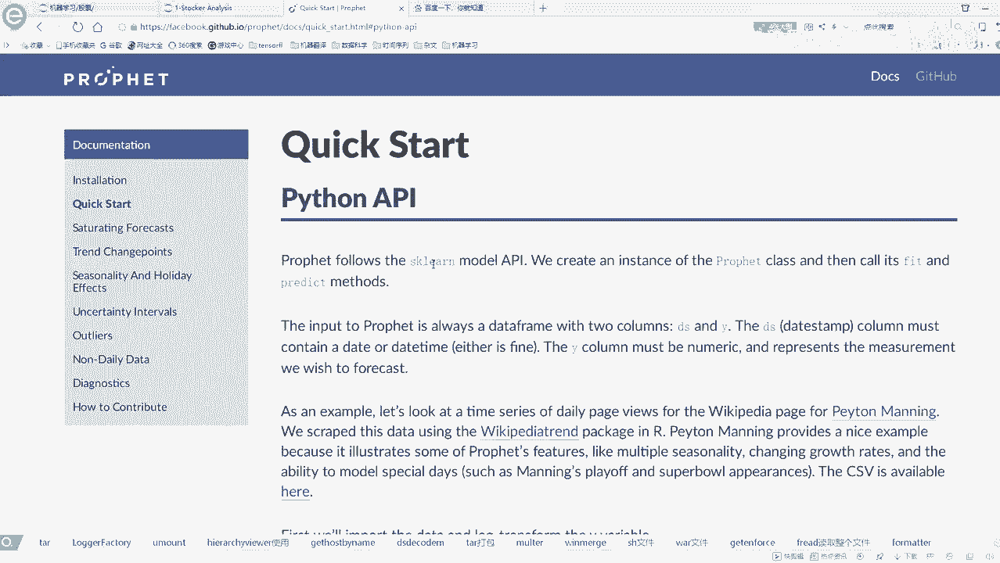

然后呢在这里就是我们构造模型其实很简单，直接把这个模型啊实例化出来就可以了，然后点fit一下呢，这就是进行一个训练了。

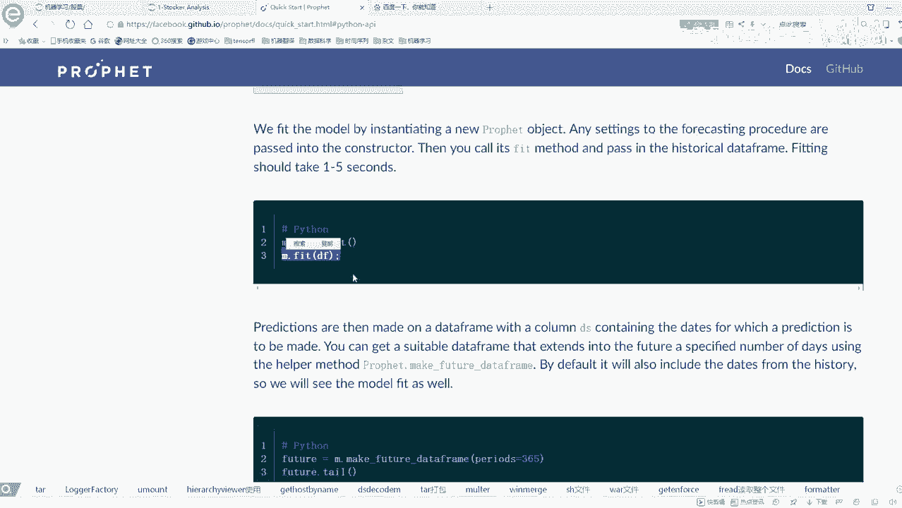

然后这块有一个函数叫做啊make feature，然后this frame，它的意思就是说嗯，把我要去预测的整个的一个时间片段。

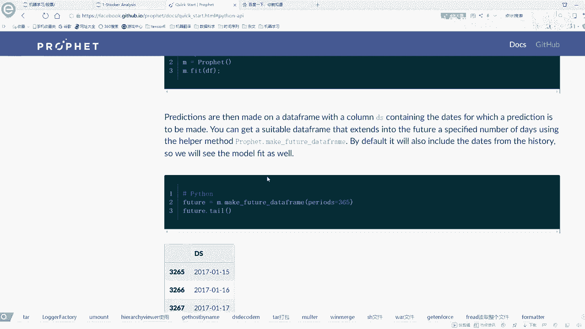

都给拿到手，这个意思，然后呢后面我们就可以进行一个实际预测了。

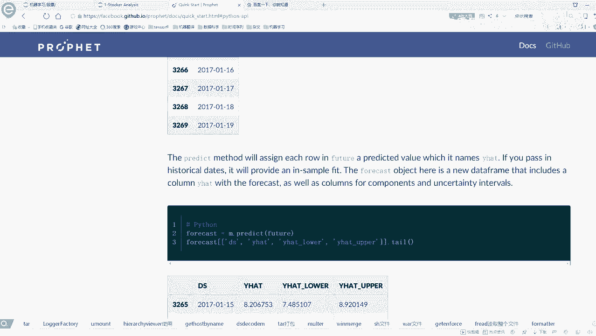

预测完之后啊，就可以显示出来的结果，预测结果它用y height来进行表示。

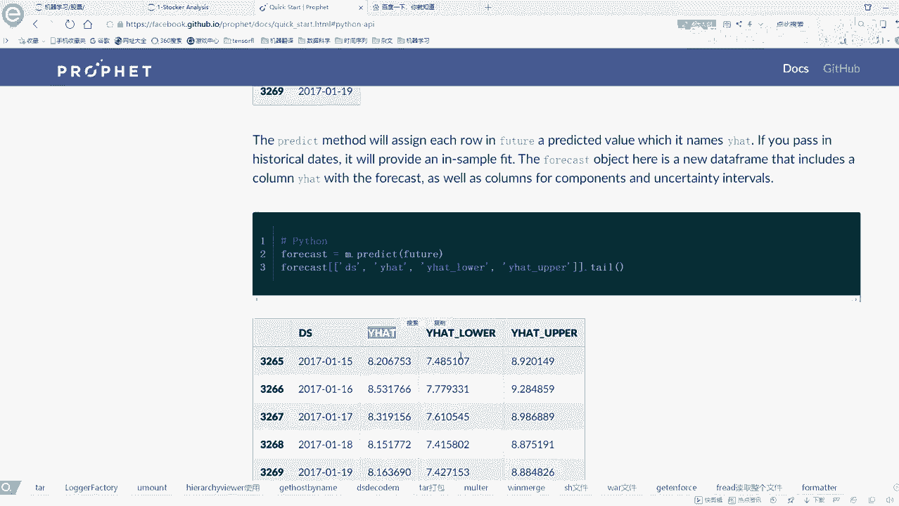

然后呢在它的执行区间上，它有WEHLOWER和y hat upper，就是我的一个下限和我的一个上限。

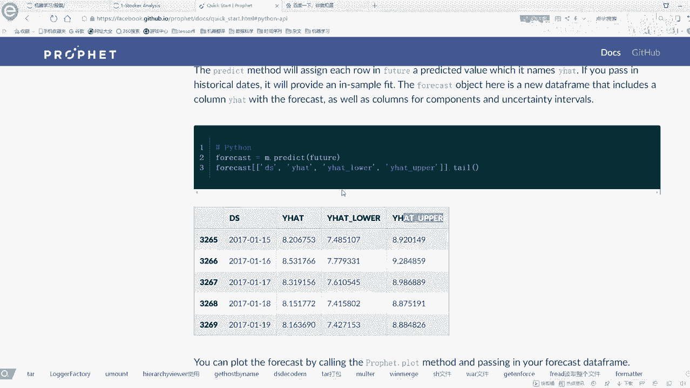

这就是我预测完之后的一个结果，那这里啊就是这个实验预测预测时间，预测它这个框架还有个优点，就是它给我们提供了很多的可视化的功能。

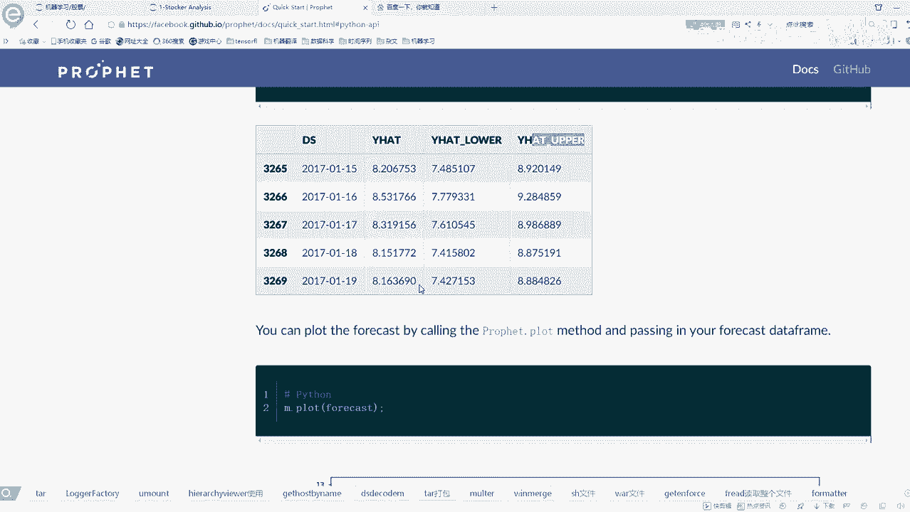

我们可以很简单啊，就是把我当前可视化的一个结果给它展示出来，你看这里就是画了一下，我当前预测的一个结果吧，下面呢又画了一下，就是对有结果产生影响的一个因素，我的一个年份的一个年，就是这一年他的一个趋势。

然后呢就是你看整体从08年到17年，它整体的一个趋势是什么样子，然后下面呢就是在一年当中啊，按照不同月份它的一个趋势，按照周它的一个趋势，这个里呢它有Python的API，还有R的API，这里啊。

反正我也不给大家详细介绍了，咱们一会儿还会去给大家举这样的一个例子，大家看看的时候，就可以围绕着它这个官方文档啊。

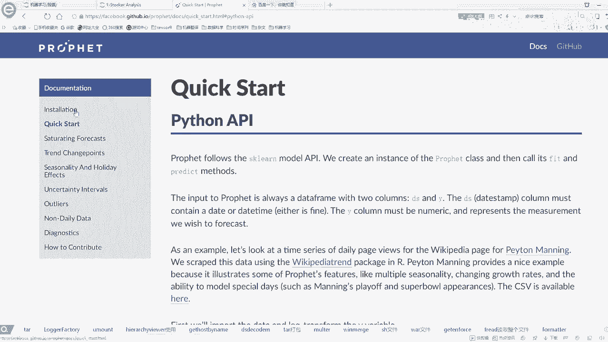

我们自己先从头到尾去看一遍，但是可能有个问题啊。

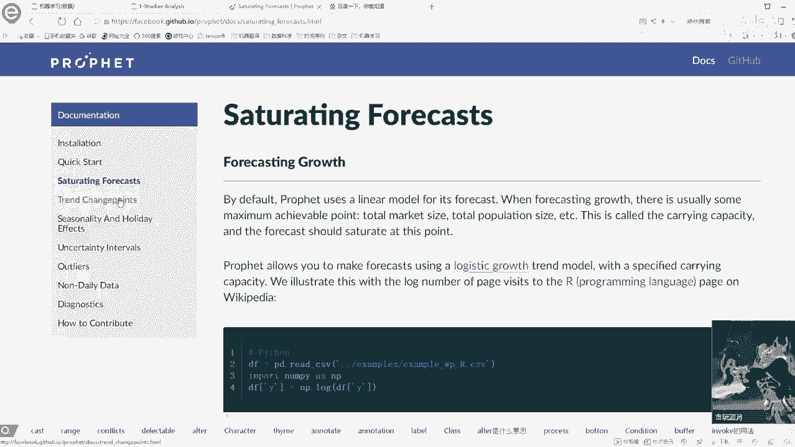

就是哎这块今天点没什么问题是吧，你看这块点有些问题，有一些文，有一些文档，他点的时候它会找不到这样的一个就是界面，这里就是说推荐大家啊，就是看这些国外文档的时候，咱们最好还是能翻墙，咱们就翻墙。

因为很多东西啊国内是没办法访问的，尤其是国外的这个什么FACEBOOK啊，谷歌出品的东西啊，有很多都是没办法进行访问的，咱们最好呢还是能够翻墙去看这些文档啊，先找先掌握一下，咱们当前要给大家说的。

这个时间预测的一个神器啊，他是做了一件什么事，然后啊，接下来咱们就来看一下我们的一个任务啊，还有我们的一个数据，它是长什么样子，这里呢咱们也说了，就是我们今天要做的是一个股价的分析，还有预测。

所以说啊我们拿到的数据，肯定是一个股票的一个数据集在这里啊，就是呃我们需要去给大家在，就是大家在运行我们这个demo的时候，需要去先安装几个工具啊，第一个工具就是我们要去获取的一个数据集啊。

这个是就是我们要获取股票数据啊，通过在这里，还有一点就是说大家在执行的时候啊，必须得连连上网啊，连上网才能去执行这个东西，然后第一个呢要做的就是，我们要去获取这个数据集啊，先把我的数据拿到手。

所以说呢我们用这个工具啊，这个工具它就是可以帮我们去获取一些数据集，只需要我们把一个要获取的东西传给他就好了，所以说呢这里需要pip store，先让大家装这个东西，第二呢就是我们实践预测的这个框架。

也需要大家先去装一下，在这里啊，就是呃你看我这里写的就是pip n store。

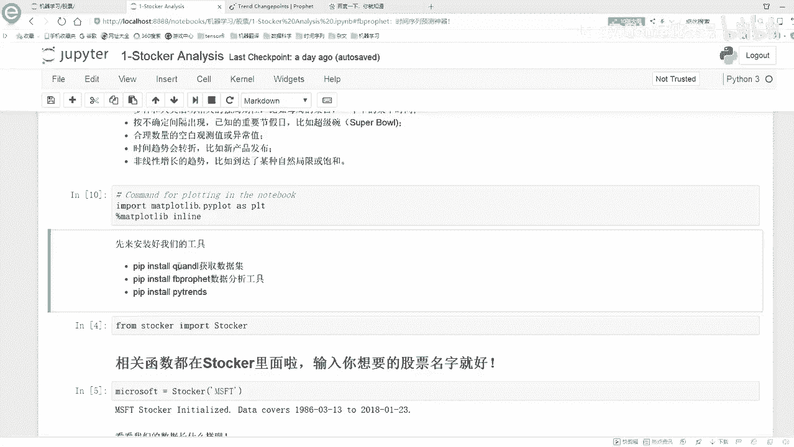

装这个东西，大家先这么运行啊，就是你在你的这个permit里边，你先去打pip store。

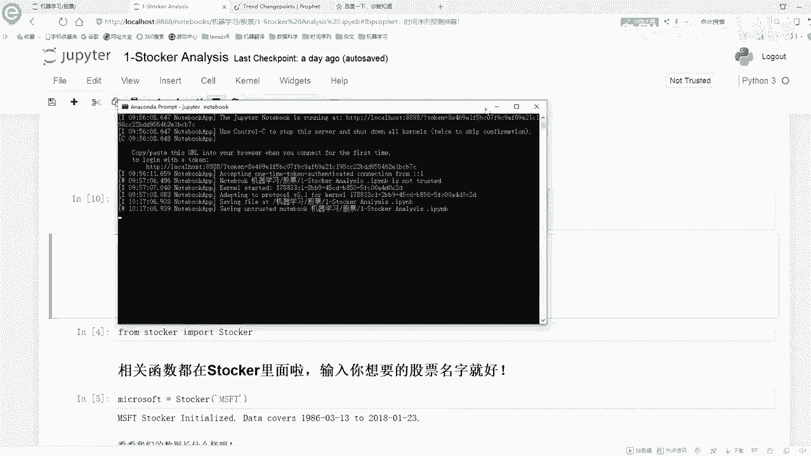

然后看能不能就是执行这个东西，然后再再再给大家讲一下，就是这些库啊该怎么安装，然后如果说你这个pip store没有去安装上，怎么办呢，在这里啊，咱搜这样一个东西。

就是一个Python windows包啊，一般情况下就在这里，我看一下，就是哦应该是这个是吧，一般情况下我们都可以在这里找到，然后呢比如这个这个东西，我看一下这个东西啊，你CTRL加C。

然后到这里CTRL加F，但是呢你发现没有找到这里啊，就是我邓头经常跟大家说的算方法，然后这里我们先下一个点WHR文件，然后去pip store这个点WHR文件吧，这是咱们以前安包的，怎么安在这里。

你说你这个东西啊没有搜到，没有搜到怎么办啊，也没有搜到也没关系啊，咱在百度啊，接着搜这个东西，然后你打开这个这个东西，这里啊，这个网址我也给大家复制过来吧，这个网址我看一下，我给它复制到这里吧。

就是你进到这个网站啊，这个网站就是我们用源码安装也可以，然后你去download一下，你点了这个东西啊，download完之后，然后你就去去下载，下载完之后呢，然后你就给它打开，打开完之后啊。

然后给它解压到一个地方，你看这里啊有个什么有一个嗯setup点PY吧，有一个set up set set up点PY啊，就是你你就是把这个东西放到哪之后，反正你这个Python环境变量你不已经配了吗。

然后你到就是你下载到的一个位置之后，你去执行这样一个命令，就是这个Python set up setup点PY，然后呢再打一个install，打这样一个指令啊，它就会也是帮你进行安装啊。

安装好之后都一样的，但是这点就是说你得需要再把那个安妮康纳，把那个哎哎你看自动配置啊，这个我们环境变量也配完了，应该直接就能用了，直接执行这样一个命令，我们就可以去安装这个工具了。

反正我给大家推荐的一个基本思路啊，就是你今天先用pip store去装，然后pip store如果说你装不了，然后你到这里这个我也给大家复制过来吧，这个就估计之后啊，大家也能去，也能去，经常会用到的。

然后我看这个这个他能搜到吧，这个东西我直接pip3也装上了，我装都是没什么问题的，这个也没有是吧，这个就是说我给大家先哎这块这块咱不写这了，我不写这了，这个反正就简单啊，你要去用的时候，你就是百度。

你搜一下Python windows包，然后你就点开这个界面就可以了，然后呢装这个库的时候，因为这个库我去用那个pip store，它没有装上，然后我只能去下载它这个SETAPY啊。

然后执行这个Python seta py store，这样进行一个安装，这样是装法是没有什么问题的，这样呢我们先把这三个工具啊给他装好，装好之后呢，等一会用的时候，再给大家详细的去介绍每个工具啊。

咱们都是怎么去用的，然后这里啊就是画图这个东西啊，这个我就不用说了，把画图这个包导进来，然后呢我们就是所有的核心代码都放在这里了，就是在这里我们看有这样的一个函数。

这个函数啊就是它会帮我们去做很多的功能，还有我们实现的一个功能实现的函数都在这里，在这个notebook当中啊，会给大家演示它的一个完整的流程，都是长什么样子，然后呢我们具体的一个代码细节啊。

我会给大家通过这个eclipse给大家来进行演示，因为eclipse eclipse里边它有debug这个功能吧，我们可以实际的进到这个函数当中啊，一步一步的去看他做了一件什么事，这些核心东西啊。

我都封装到这里了，反正一会儿大家用的时候，这里边大部分都是些可视化的操作，还有咱们这个构建模型的一个操作，这些呢都放在这个里了，都放在一个class里边了，所以说一会儿啊咱们就是这样演示流程。

然后看结果，然后在eclipse里啊，为大家实际的debug，咱们看一下它的代码是怎么样。

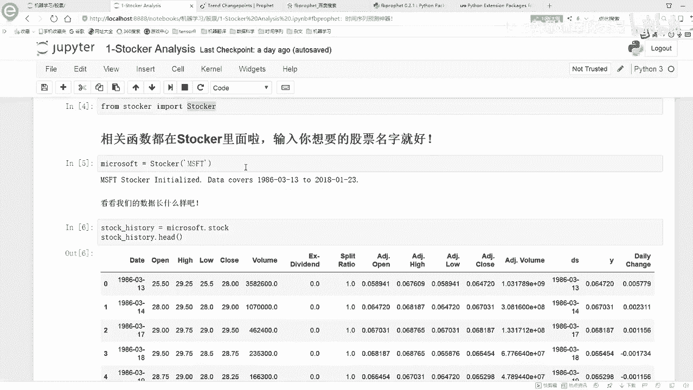