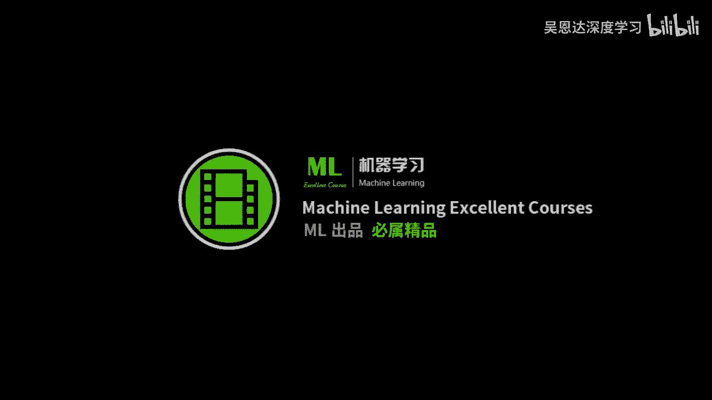
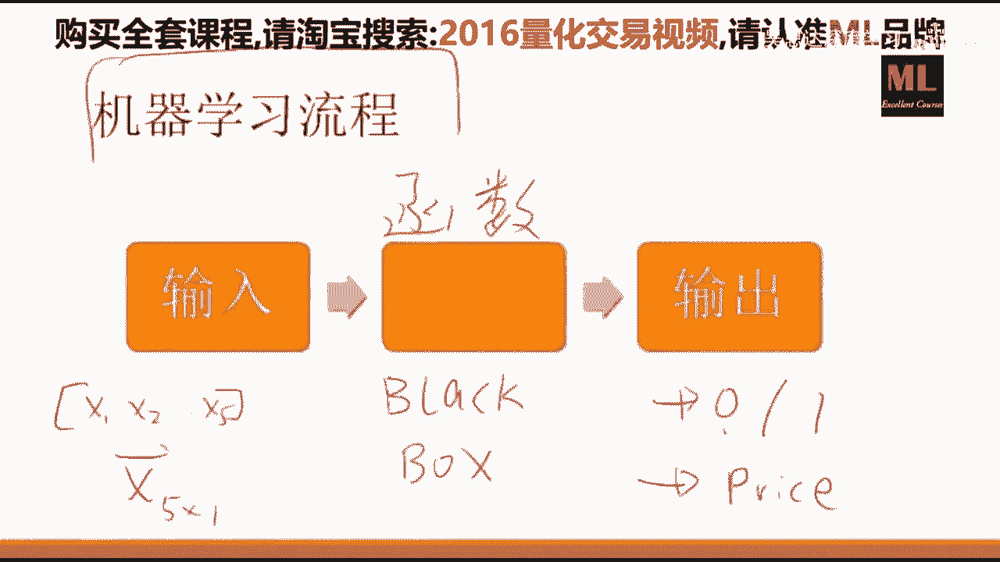
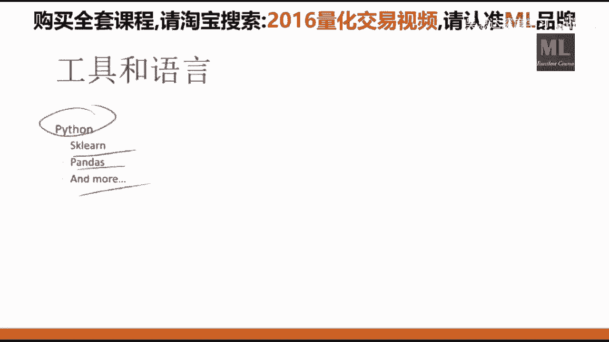
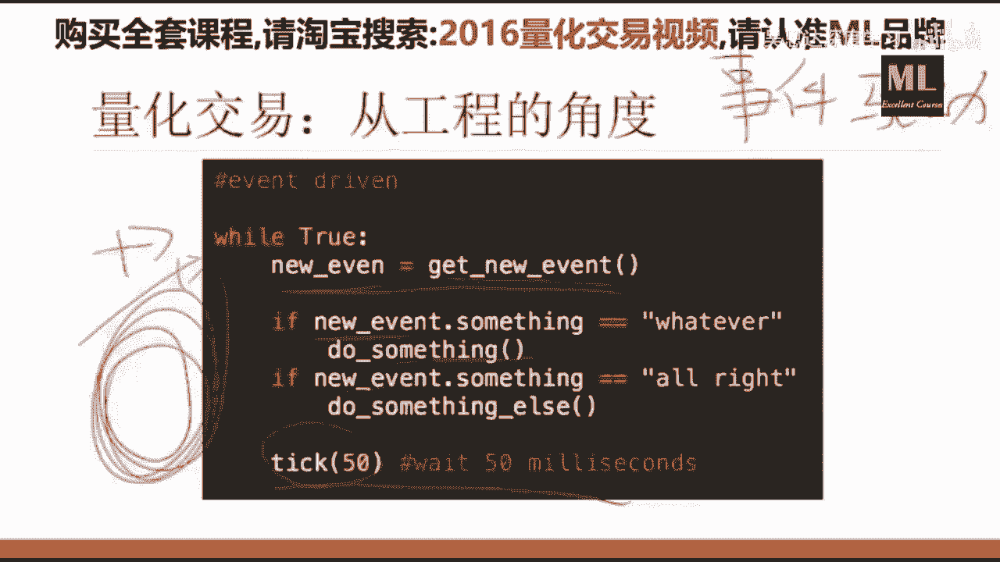
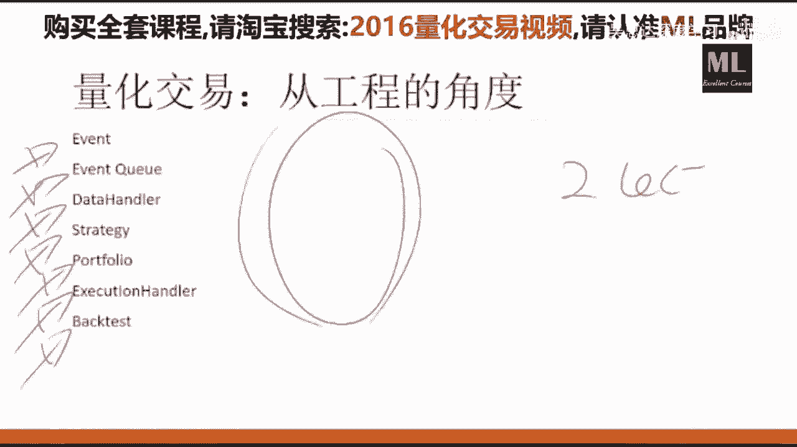
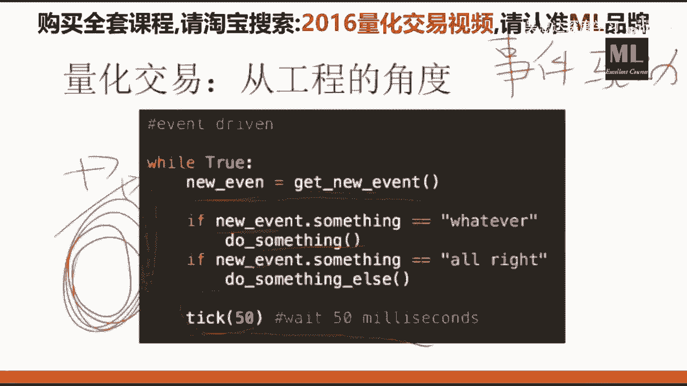
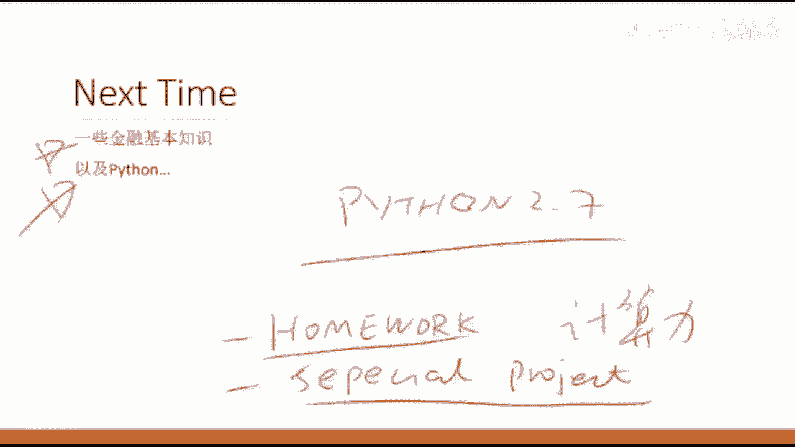

# 【比刷剧还爽！】这太完整了！python金融分析与量化交易实战课程，全程干货无废话 入门到精通一步到位！（数据挖掘分析_大数据_可视化_投资_金融_股票_算法） - P1：第01课_机器学习与量化交易项目班 - 人工智能找迪哥 - BV1oBb6egEiT

🎼，我们是这个呃50啊8。8点钟准时开始，好吧嗯。屏幕马上就马上就来。这个录像是有的，我们应该是。嗯，在下周吧，下周一还是周几，你就能在官网上看这个课程回放了。然后实时直播的理由是呃。

如果你是选择实时的在看的话，嗯有一些问题可以当场的进行一些交互。但是其实不影响。因为嗯我们课后也会有一些答疑，所以不一定非要嗯看直播，看停播也行。

现在呢是因为我这个这这个电脑它它有它有点这个这个这个这这个风扇呢嗯。因为因为就是说我们要用到一些这个呃手写的一些东西，所以。所以这个。好，那那我们8点到了，我们上车吧，好吧啊，这个咱们就不等了哈。嗯。

好，那么今天是呃这个主拉爷他请我过来给大家做这个呃机器学习与量化交易实战这门这个这个课程，大概是一共是1次。然后呃教给大家怎么样将这个机器学习的知识应用在量化交易上，以及一个比较偏项目的事情。

就是说怎么样的去imprintment，怎么样的去去实现一个这个量化交易的一个系统，和怎么样的运用一些现有的这些平台来做来做这些事情嗯。😊，那么我们。来看看。那么这个先先说一下我们这个课程吧。

我们这个课程呢就是说其实是分三个事情，我们这个课程分的是一个是。一个人继续学习。OK一个是量化交易。还有一个是项目实战，这三个事情其实是三个嗯。怎么说？就是说你分别学这三个事情都足够讲一门课。

但是呢这三个事情呢联系的又如此的紧密，就是需要我们呃设置这么一门课程。就是如果你纯学机器学习，他他不告诉你怎么在量化交易中应用。如果你做量化交易的话，他假设你机器学习这些东西已经会了。

如果你要做项目实战的话，那是一个纯码农的一个课程，就教你怎么样搭建一个平台。那么这门课的目的呢，就是说。尝试把这把这三件事呢有机的结合起来，让大家得到一个呃所谓的b picture。呃，原因是什么呢？

原因是这样，因为如果你要做，比比如说先先针对于有一些这个嗯。就是你自己想做这个量化交易的呃呃小型的这个团队跟个人。那么现在其实网上呢已经已经有很多这个一些平台了。比如说是嗯co片，或者说优况啊什么的。

那么如果你要用别人写好的这个系统的，你只需要做这个继续学习跟量化交易这2块就行。你你你不需要管实战。但是呢如如果你是你们的这个单位需要自己实现一个比较高效的这么一个平台的话呢，你是需要一些实战的。

总而言之就是说这个事情，如果你要做一个很严肃的量化交易的一个事情的话，你是需要一个团队合作的。但是作为每一个团队成员，你是需要知道其他的这这些角色分别是干什么，以及怎么干的。

这样你才有可能对这个事情有一个更深入的了解。所以说我们这门课呢，就这三个方面都会涉及，而且不会只上。寒冰的设计就是说我们教到的每一个东西呢啊都会让你从代码级别的能够看到它具体在哪用。

就是说嗯就是说比如说有有人会觉得哎这个我们为什么要重复造一个轮子，并不是并不是这个意思。就比如说你们嗯如果学过机器学习的话，你们知道有一个叫做呃所谓的back prop叫做嗯。是一种训练算法。

那么你在学这个算法的时候，每个人在初学的时候都需要从零开始撸一遍的。当你撸完这个算法之后，你再调用别人的API的时候呢，你才有非常大的信心把它用对了。那么我们这个课这个实战角度的这个目的呢。

和自己手写一个BP其实是一样的。就是说你需要自己从零写一个小的五脏俱全的一个系统，你才更有可能非常高效的去用别人的平台。这是原因之一。

就是说我们为什么要搭建自己的这个呃这个我们为什么要搭建自己的教易系统，这是原因一O原因二是什么呢？原因二是目前现有的这些平台。比如说cont啊，比如说优况啊，比如说等等的，其实他们都互相抄了。

就是说他们用的都是啊一个机制。那么你们在用这些网网络的这些云平台的时候，有一个非常重要的一个问题，就是说它的这个。计算率跟数据不够。就是说比比如说我要做一个模型，它需要用到嗯深度学习的知识。

或者说需要用到啊比较强大的计算力来支持的时候，那么很多云平台就就不够了。或者说它它需要一些额外的数据啊，你有而平台没有这个这个问题下怎么办呢？你就不得以需要搭建自己的一个数据库和你的交易平台。

在这种条件下呢，你就必须得学会自己怎么样的来搭建你自己的平台，而不是依赖别人OK有问题没有。那么关于我们这门课的这个呃general的这个呃呃呃bake picture大家有有没有问题。好，没有问题。

那么就是说再回顾一下，我们大概是讲这么三件事。一个事情是交易系统的开发与设计。另外一个是跟这个量化交易跟经济学习这两个结合非常紧密的一大类事情，就包括了这个时间序列的分析。

以及机器学习在时间序列上怎么应用，还有怎么样的去开发你的一个model或者一个strrategy，然后怎么样的回测，然后怎么样的做风险管理，这是一大块。而这块是一个比较大的一个重点。

因为大部分的人你都你都可以用优况。但是具体你怎么样用一个好的策略，怎么样的用一个科学的方法做回测，这个是大部分人所缺乏的一个知识。最后呢是一个比较偏项目的一个事点。

就是说怎么样的来设计你的这个交易系统的逻辑和怎么样的去实现啊一个可扩展的，你的这个自动交易的平台。OK我们大概就是讲这三件事情。好，那么就是说我们的这个。这个大的方向差不多就是这这三件事。

一个是机器学习啊，是来嗯指导你开发策略的一个主要的手段跟工具。当然它也有更fancy的名字，叫做所谓的人工智能啊，再古老一点的叫做统计分析或者统计学习。但是它其实是一个事情。第二就是一些金融知识识。

这个是呃必备的一些嗯。跟交易有关的一些金融知识。这个其实是最简单的这一部分其实嗯啊文科生都能学会啊，那么这个编程知识呢是驱动我们这两件事情所要干的一个根基，这个也很重要。

所以说我们会在这三个方面都会有侧重。而一个比较。现实的一个挑战就是这三个事情，他们都很就是都是一个非常自成体系，一个非常大的一个事情。我每节课会有不同的这个我每节课会有不同的这个侧重点。什么意思呢？

就是这节课有可能侧重机体学习。这节课有可能侧重金融，而某一些课呢我会。格外的侧重怎么量编程。就是说我每节课，但是但是我每节课会保证这三个方面都会有。因为我知道这个咱们一共有100来个同学。

每个同学的背景不一样。和你想上这门课的目的也不一样。那么为了照顾到每一个人呢，我我需要保证每一节课你听完之后，不管你出于什么样的动机跟目的。你这节课都都会学有所成，都会有一些这个收获。

同时呢听别的你不感兴趣的话题的时候，你也会觉得啊不是那么枯燥和不是那么没有用。所以说我每节课会选择一个合适的balance，就是说合适的一个啊知识组合争取在十字课之内呢。

我们把这个非常纷繁复杂的这么一个啊复杂的这么一个系统给大家讲明白了。那么学习一个系统啊，一个很复杂的系统嗯。就是说需要用不同的角度来来来来看这个问题，而且反复的看。

就是从不同的角度来反复的呃研究跟展现这个问题，你才有可能在呃啊短时间内掌握。所以我希望大家每周大概花课后花啊呃呃4到8个小时的时间进行这个嗯就是说课后的一些练习。

这样的话才有可能在这未来的5周之内呢啊把这个事情给掌握了。OK那么我们的这个我的这个office，我就是说我我集中的就是你平时能够嗯一下能找到我的时间呢，一般是每周二的跟周四的晚上8点到10点。

我会集中的回答email，就是在这个时间段你给我发的email，我很可能是秒回的。你给我留的言，我也很可能是秒回。但是是在其他时间呢，我会大概有这么1到2天的一个一个delay。但是这两天的时间是。呃。

就是在在课程结束之前，我会每周抽出呃这两个的时间点来给大家啊做一些这个答疑活动。那么我们课后的一些内容有这些，就是第一个是我会给大家推送每周的一些建议大家读的一些课外阅读资料。为什么呢？

是因为其实现在有所谓的一些呃量化的。教材也好，新闻也好，教程也好，但是他们就是说怎么怎么说呢？就是侧重点都不大一样，而且很难，就是它并不是一个自从体系的一个东西。

所以说我每周会给大家推荐来读一些啊比较啊适合大家就嗯适合大家并且有价值的一些呃课外的辅助材料，肯定你只听这一门课听完这就把这门啊手艺学明白，这是不可能的，需要有一种积极的态度啊，就跟你泡妞也样。

就是说你无所不用其极吧，各个方面各个手段从任何角度的啊来找这些学习资料。那么我也会给大家做一些推送。另外就是说我们会有一些啊比较重，这个比较重，就是说啊一些一些作业需要大家啊在限定的时间内完成。

OK那么第三个呢是。就是说因为咱们这个群里头的人其实呃就是说你的这个技能呃是比较分散的。有的是呃从程序员这边过来的，就是大概不大懂机器学习也不大懂这个金融但是编程能力非常强嗯，也有的大概是做量化的呃。

编程不大好啊，机极学习嗯，听说过嗯，但是呃很神秘的样子，不知道啊，就是说我们每嗯每每一个呃同学呢啊呃这这个这这个这个强项也不一样。所以我会设计一些所谓的额外的这个小作业，我希望大家呃组队也好。

然后一个人你要才能干了也可以来来做一些额外的工作。这样的话呢在这个气氛中啊，我们争取在这5周之内做出一点有意思的事情啊，也是一个对自己一个很好的一个提升OK然后其他的一些学员关于找工作的一些问题呢。

这些事情我们可以通过邮件的形式啊来做沟通。OK那么今天是第一次，所以说我会这个就讲一遍哈，就那么我会把咱们的这个。课程的这么一个啊big picture啊，给大家做一个介绍。有问题没有？没有问题好。

那么我们看这个看今天的这个综述哈嗯综述就是这个算法交易，不装逼的算法交易。这这是我起的名字啊，with blue就是说现在你在网上看帖子也好，教程也好，书也好啊，把这个事情形容的高深莫测的，嗯。

要么是一上来给你互一堆你鬼也看不懂的公式，要么是开始给你谈玄学啊，就是说呃让人看的就是说我觉得很气愤的一个事情，就是说是嗯。这个东其实一点也不神秘，也一点也不难。它只不过是嗯。讲的人肯讲的人不是很多。

嗯，我也不知道什么原因啊。那么我我我的目的就是说争取以最简单的方式争取语语最简单的方式给大家把这个这个事情的这个综述给大家介绍明白了，不需要知道什么呃呃呃具体的术语。

具体我们在课后就是在接下来的课中会有非常多的金融术语跟经济学习的术语跟编程的术语。但是第一次课我争取一个也没有，让大家走假如说你是零基础的话，你也应该能听明白。OK这个是我今天的一个目的。好吧，OK嗯。

好，那我们现在开始上车。OK嗯。好，那么就是说这个算法交易其实是一个非常呃general的一个。一个概念就是它是什么呢？就是说只要是利用自动化的平台执行预先设计设执行预先设置的一系列规则完成的交易行为。

就叫做算法交易或者自动化交易。什么意思呢？就是说你以前是人工下单的，我现在变成自动下单了，而我自动下单的这个原因背后是有一定规则的。就是假如说呃什么什么if怎么怎么样了，我就下单啊。如果怎么怎么样了。

我就撤单啊等等的。如果这些事情全部由机器来完成的话，都可以算作算法交易。什么意思呢？就是说比如说你嗯就是它跟量化交易其实是算法交易是这么大的一个概念。量化交易大概在这个里头。

就是说比如说我基于这个技术分析的自动化交易，算不算算法交易呢，完全可以。就比如说你以前你自己总结了很多老中医式的一些呃规则啊，就是技术分析那些啊。

如果这个呃moving average5从下面往上面穿过去了，那么我就买。如果从上面往下面穿过去了，我就卖没有问题。只要你把它写成了自动化的一系列规则，并且能够用一个平台自动化的进行这些交易。

那么它都算算法交易。但是这些东西。不是我们这门课的目标。我们这门课的目标呢是所谓的量化交易。就是说呃所谓的这个quitative trading。

就是说我们的这个交易的行为背后的原因是由数学模型来决定的，而不是嗯。太就是一些呃老中医式的啊东西。比如说你网上大大大把大把的名科啊，利用周易啊嗯利用阴阳五行啊等等的。这些我们不教哈，这个你们不要想啊。

我也不会，我也不信这玩意儿啊，那么大部分的这些呃呃玄之又玄的方法，它最大的问题就在于它没有做科学的回测啊，死都不知道怎么死的，这个我们是不教的。

我们主要教的是这个怎么样的建立这个数学模型来指导你的交易行为。就是说我们的这个规则是通过数据学出来的。我们这个规则是from data。这个是让量化交易跟其他其他东西都不一样的一个地方。

OK那么我们看一下这个算法交易。在这个在我们这门课里头，算法交易呃，我会跟量化交易。话等号。就只仅限这门课哈，你要在外面跟别人聊天啊，大概他们这个范畴是不一样的。OK但是在这这门课里头。

我我说的算法交易呢主要指的是呃量化交易OK它的优势也是比较比较明显的，就是说首先我们会有大量的历史数据来support你的这个建模过程，这个是跟啊这个传统的这些技术分析所不一样的地方。

技术分析上根据我多年的临床经验啊，我看盘我看了20年啊，我认为它就是应该是这样的啊，有个什么尖头啊什么的。这这这这个没有，我我们用的都是啊啊历史数据，用用数据来说话，而且动辄数据点可以上上千万啊。

那么就是说我们背后的模型是基于数据驱动的这是第一。第二呢，算法交易就是说它的执行比较高效啊。就是说。只要满足了，就是因为它是基于事件驱动的，只要满足了一定的这个呃你所预先设定的规则，它它就会自动的下单。

就是说它的这个呃效率是会比人工操作要好很多的。另外一个就是无主环情预输入。这个我已经说过了嗯，就是说嗯。它的好这也是它的好处之一了，就是说我的所有策略是基于一个数来决定的，而不是我今天的心情。

或者说啊我感觉怎么怎么样。那么在基于这个规则的前提下，如果你的这个策略呃，这个胜率比较高的话，只要它的你的这个交易频次比较高的时候，你总是会挣钱的。啊，举一个简单的例子，如果你知道你扔硬币。

你有55%的情况，你是能猜对的，你猜1000次，你肯定是会盈利的。嗯，也许有45%的情况，你会输啊，但是这没关系啊，那么另外就是说可度量的评价，这个很重要。就是说你说你的策略好啊，怎么好好了多少啊。

这个事情是呃如果要要从科学的手段来评估一个事情的话，那么这个是一个非常重要的一个一个标准就是说拿拿拿你的这个数据说话，而不是说拿一些其他的什么东西。而这个数据呢经常会有。些偏差，就是说有有一个所谓的。

待会儿我会讲叫做乐观主义偏差。你在一些特殊的数据集上做一些特殊的实验，你的性度会很好啊，但是这个是错误的回测方法。那么今天我主要跟大家讲怎么什么叫错误的回测方法。

今后呢我会教大家什么是正确的回测的一些方法。最后就是教交易频率的问题。因为毕竟嗯计算机最重要的贡献，就是说能够让大量重复性的。工作能够以极高速的极高频的这个形式来进行自动化。

那么这个也是机器比人类要啊厉害的地方。那么这个是算法交易的优势OK。算法交易的劣势呢就是说嗯主要是嗯主要是两个一个成本，一个技巧，成本指的是你所需要投入的时间成本跟金钱成本。

因为你有很多需要算法交易干的事情，嗯，嗯有人会问我老师，我就5000块钱，我能不能做。嗯，怎么说呢？也可以做。但是呢它并不能体现出它的非常潜在的优势出来。

这个是成本方面技巧呢就是说我们需要有这个比较强的数学背景和编程背景。这两个就在国内90%左右的散户就很难砸到。但是呃我看了一下，大家给我写的email，就是我感觉嗯咱们这个班里的同学在技巧方面。

至少你的基础是底子是可以的。如果用这接下来的几个月时间很吃苦的话，这些技巧都不是问题。另外我的目的也是为了教给大家这个算法交易所需要的技巧，尽我最大的能力教给大家，你能够以最高的效率学到。

要不然的话嗯如果自己看的话会比较痛苦，而且所需要的时间也会比较长。OK关于现在有问题没有。啊，好，成本就是说你要你要执行一个算法交易的话，你需要投入的金天成本是比较高的啊。比如说你要做期货啊。

你要做股指期货，你1万块钱是做不了的啊。那么这个算法交易的流程是这样，这字儿有点小。抱歉啊，下次我把字儿调大一点。算法交易的流程是大前提是要基于某种平台。这平台可以是你自己搭的，嗯。

这也是我们这这门课的目的，也可以是你用现成的，没有问题啊，也可以是你比如说你用优框，你用优框做完这个交易策略了，它实时提醒你说请下单啊，然后你你在你在哪怕你手点也行，因为你要做这个。

做这个不是高频的这个交易，这种行为也是被允许的，而且也大量的有人在用。这做这这样做并不丢人哈，就是看你的不同的应用场景。那么基于某种这个交易平台的话，你要干的事情。

就算法交易建模的流程是提出假设提出假设建立模型回测验证跟执行交易，什么意思？就是比如说提出假设就是说嗯。😊，比如说我的一个讲，你可以听任何的假设，就是你你你你嗯一个简单的就是比如说嗯。啊。

平台我后面会说，比如说一个简单的假设，就是说okK如果我的啊这个移动平均数的5呃大于了移动平均数的1，是不是股票就要涨，那么这个是一个合理的假设。你关于这个假设，那么你提出一个假设。

你就要做科学的合理的验证。你那么你基于这个假设呢，你就会建立一个模型。那么你根据这个模型，你在历史数据上进行一些回测啊，回测完了之后告诉你，哎，你这个你你的这个策略哎应该是对的。然后呢。

你再基于这个策略在实时的数据上进行交易。那么基本上大差不差都是这四件事情。呃，不同的人会提出不同的假设啊，不同的人跟基基于同样的假设会建立不同的模型啊，简单的基于规则也有啊，所谓的用什么神经网络呀。

SVM呀，大家肯定都会能听到时间序列分析啊等等的。各种模型都会有啊，不同的机构啊，倾向于不同的模型啊，包括你的这个计算成本啊，比如说你要没有GPU的话，你做深度学习模型，基本上不可能啊。

那么你要是做简单的基于规则的话，你做在云端上做一个模型的验证也可以。那么这个不同的人会有不同的模型啊，这门课我就会教给你常用的啊，非常就是经过历史验证的模型，主要都有哪些怎么用。

这个是我们的主要授课内容之一啊，回测验证也是非常重要的一个授课内容之一，就是你怎么样回测就比如说我已经有了一个模型了。有了一个model了啊，这个model说的就是说if怎么怎么样啊。

就是一些ent的一些规则。那么别人就问你敢不敢拿命压你这个事是对的啊。那你在回答这个问题之前，你好歹得在历史书上看看挣不挣钱呀。但是呢很多人就死在回测上了。

就在历史数据上验证你这个模型是否挣钱这件事上是需要极其大的小心的，而且是需要科学的来做的，而不是简单的在任何一个股票上，你跑一遍，你说他挣了，因为大部分的模型，你只要就说你你要想出去骗人哈。

你只要把这个你只要你只要精心设计一种回测，你这个收益率能高的吓人啊，但是你在实盘交易上很可能赔的一大户，所以说回测是个非常重要的一个事情。最后呢当你这三件事情都差不多了啊。

你就就你就真正的评价一个人对自己模型的信心的标准，就是你敢不敢拿你自己的钱放进去啊。如果你敢的话，你就你就执行交易就行了啊。你要不敢啊，那就。😊，说啊，关于这个算法交易的流程，大家有没有问题？没有问题。

好好好。那么我们大概在一个小时的时候会有5分钟的休息。在那个时间，大家在目前刚才之前的问题有问题可以可以留言。那么交易策略其实是一个非常重要的一个事情。所谓的这个策略呢。

就叫做你你要因为我建议大家大部分的交易的这些资料还是看英文的好一些。因为中国的实在是。反正我不知道哪有好的，你们要找着了，你们告我哈，这个策略就是strrategy。

trading strategy就是说是。就是说我们的这个交易策略怎么来啊，当然来来源有别人告诉你的啊，张三告我的，李四告我的王五的老婆告我的啊，这个这个是一个非常重要的一个来源啊。那么这是第一啊。

第二是一些教科书。就是说我们有各种各样的一些关于量化交易的教科书，会教你一些，比如说me reverting或者基于这个momentum的一些交易策略。啊，这个是一个是教科书，另外就是一些网站博客啊。

各种的平台论坛比较专业的都会有。但是最重要的是什么呢？最重要的是当你听完别人给你的策略之后，你要在你自己的数据上进行验证。就是说你的交易策略一般来说来源有有3个哈，一个是所谓的市场微观结构，什么意思呢？

就是一般来说就是说啊这个呃一般一般是基于这个哦所谓的这个limit。Oder。Books。就是说是什么？就是说这个我待会儿会马上跟大家介绍一下。

就是说基于这些呃所谓的这个limit order books呢，我们来就是嗯市场，就是基于一些市场深度的一些一些信息来对这个在市场的微观结构上。

对短时间内短尺度的这个呃啊呃这个金融衍生品的价格进行一个预测。那么玩这些事情的呢，一般来说是比较高端的哈，就是说一般要做这个高频交易的人，他们是需要做这个事情的。

就是在微观尺度上来对一个呃一个产品的价格进行预测。比如说我就预测那么两秒后的或者说是10秒后的一些事情。啊，这个就需要啊市场深度信信息来考虑，就是就是说它这个数据噪音很大。

但是说我研究的结构是呃微观尺度的。另外第二个呢就是说关于基金结构的套力，这个是什么呢？就是说一些大型机构，他们的交易交易是。😊，有是有一些paon的。因为比如说。他们要做。

就是否则他们要避自己就是避免避免别人说他们做事。就是他们在做一些大宗买卖的时候呢，他们会有一些固定的行为模式。当这是一个其实是一个博弈的过程。当我们知道对方是以某种行为模式来做交易的时候。

我们就能设计出来一些比较复杂的算法来从中套利。第第个呢其实是。大部分小型的投资者啊所能够接触到的和所能够进行盈利的方法。

就是基于啊大量的这个历史数据来通过机器学习或者人工智能的方式来建立你的模型来指导你的交易啊，那么这个呢是大部分人目前在用的，尤其是国内啊，关于这三个事情，大家有问题没有？啊，好。

那么我们就来讲一下对悲观结构其实是什么呢？就是说咱们先说一下这个。所谓的这个orer吧。就是说不知道大家嗯上这门课之前，你们你们都炒过股没有啊，没有炒的说一声，就是说你你你你没没有进行过交易的。

有没有啊，应该都没有吧嗯啊好，那么就说明大家都是嗯都是交交易过的人就是说嗯。是这样，那么我们每一次下单的时候呢，我们每次下单的时候，不就是就就是会给你会给你的这个经纪人发出这么几个几个事情嘛。

就是说要么是买，要要么是卖，就是要么是被的，要要么是ask。就是要么是买要么是卖对吧？然后具体买的是哪只股票singmbol，对吧？然后还有就是这个数量。然后还有就是说你是嗯。

是limit book呢还是market套的？就是说你你是按照市场价来买卖呢，还是说你这个东西你不能高于3。5块啊，不能低于5。8块。就是说你你你有有一个就是做了一个这个limit。

还有一个就是说你所设定的这个pri。对吧这个没有问题。那么啊对我我因为我照顾到一些零基础的，我。在这一点，我强迫自己。不用术语OK那么。那么你你到的这个单呢就会到了交易所啊。

交易所呢它就会建立一个非常大的一个表。建立一个非常大的表，叫做所谓的这个orer book。这个表是公共可见的，每个人散户也能看到啊，券商也能看到啊，所有的这个呃大机构也能看到。那么这个表呢。

它就记录了，就是记录了你的就是说所谓的市场深度了，对吧？那么就是说我有这个买一啊，买二卖一。卖2。等等，一直往下一直往下。那么买买一卖一呢，就就比如说是嗯。举个例子吧，比是说我买一就是买一，现在是99。

95块，我有100105，然后买买二呢就是99块。9999。9块吧啊，50，然后买三的就是98块钱，对吧？我们50呀，然后卖衣呢是100啊，有大概有。1000股啊，然后卖二呢就是100Y05。

比如说有500股，什么意思呢？就是说。目前市场上有人以100块钱的价格啊，大概要卖这个1000股，第一个不卖哈。有人以然后再就是说这个卖一卖二，就是根据我卖的这个价格。

从低往高排而买的这个价格呢是从高往低排如果你是以市场价买入或者市场价卖出呢，你的券商必须得以目前现有的卖价的最低跟买价的最高来进行交易啊，这个都是最简单的一些事情啊，那么市场的微观结构套利就是什么呢？

就是我们根据这个微观结构的这张表，我们来预测下一个t。😊，或者下两三个t这个市场的这个priice是什么？就是说我们其实基于大量历史的这个older book，我们就能预测出来这个pri。

有可能是往上走还是往下走呢？给大家出一个问题，就根据这个就根据我目前写的这个表，我考考大家，你们觉得。那你。他的这个铺。就假如说你是一个做喂，现在怎么样，现在怎么样？😊，好，我再问一遍哈。

再再再再问一遍。😊，就是说。就是说所谓的市场微观角度的这个分析呢，就是说在这种的就是说我们拿市场深度的这些信息来对价格的这个呃走势进行一个预测。这个就是说在在下一个。

在下下一个是就是在下一个priice被撮合的那个就是下下一个价格被撮合的这个价格，你觉得是呃是是是是是什么样子的嗯？对。大家说的是对的，是要往下行走，更有可能往下走。为什么呢？

就是说首先你要是不知道这个你就是说比如说你要交易的比较经验丰富的话，你就看会看到这个卖的量比较大，它它这个卖的这个下行压力较大。那当然这个是一个非常不科学的一个老中医式的一个说法，怎么样的算出来呢？

这样算出来，价格是怎么来的？这个是关键。就是说比如说我们现在市场上，我们有一个。比果我们下一单吧，下一单。是。下单是这样的，我们如果以市场价市场价卖出的话，如果我们下一单的人是市场价卖出了1000股呃。

一呃100股吧。比如说在这个在这个时间点上，突然来了一个人，他说我以市场价卖出100股。那么以市场价卖出100股，就必须得以买一的这个价格进行撮合。对不对？那么这个价格就往下走了。反过来呢，你市场价。

满。99。95块。如果以市场价买的话，必须就以99。95块来买，对不对？但是目前来说，没有人以99。95块来买，这个价格又会继续挂单的。所以说这个价格是不会变的，这个价格会往下走的。

所以更有可能价格priice。更有可能是往下走了。听明白了吗？啊。另外呢，如果你有足够多的数据，你也可以进行一种回测来验证我刚才说的这这这件事儿。有问题吗？嗯。嗯，好，我们接着往下走。

那么我们现在看一下机器学习啊。不priice的定义是priice的定义是撮合撮合之后的价格啊。但是如果下一单是要求你的这个经纪人以目前市场价的买的话，你如果以市场价来买的话。

你必须跟最低的那个卖单所撮合ok。好吧，那么现在就是看我们看这个机器学习流程啊，这个是嗯一个非常重要的一个一个概念。啊，之前从来没有接触过经济学习的人，有没有？就是呃没有用过记忆学习。

或者说你没有用过记忆学习。呃，任何情况下你没有做过一个，比如说线性回归模型，你也没做过的，有没有？有好很好啊，那你今天就来来潮了啊，咱们15分钟来搞定题续学习啊。

当然今后我会专门的花2到3角的精力来专门做这个事情。好，那么我们现在现在来看什么是机器学习哈。机忆学习非常简单，你把它想为一个黑箱的一个函数。😊，它是一个函数。这个函数里头呢是有很多参数的。

你可以把它想象成为，比如说一个箱子。这这是一个所谓的black box。这个black box它输入一个输入，比如说是一个X，这个啊X可以是五维的一个向量。X1X200点到X5，它这个这个X呢是5。

乘以一的一个向量没有问题吧，输出是什么呢？输出可以是就是说呃。可以是比如说零或者一零就代表涨，一代表跌没有问题，这是一类输出，也可以输出是一个priice的一个价格。就是到底是100块钱呢。

还是998块钱。那么这个机器学习，这个函数就别人已经学好。假如说机器学习已经学出来的一个函数呢，这个模型也叫模型，它把X当输入，把Y就能当输出，你给我一个X，我给你个Y，你给我一个X。

就比如说此时此刻的时间点跟一些关键的指标。我告诉你下一时刻它涨还是跌。或者说另另外一个模型是你给我一个X，我告诉你它下一个时刻的价格是多少。或者说你给我一个X，我告诉你下一个时刻你应该买还是应该慢。

就是说呃不同的函数有不同的输出。但是机器学习呢它都是会产生这么一个所谓的一个黑箱模型。比如说你的朋友已经给你写好了，他给你提供一个API啊，你直接调用这个API，你输入输入你的X，它就会返回你的Y。

就比如说这个是你的这个model。😊。

然后作为你来说呢，你就你给他一个X，他就给你一个Y。这个X是你来定的。这个Y呢也是你来定的。而这个模型会告诉你他出接受什么样的X返回什么样的Y，这个是啊一个啊啊。最简单的一个经济学习的一个描述。

关于这个描述，大家有问题没有？没有好，那么现在其实关键的问题就是这个函数怎么来啊。这个是一切列的关念。O。那么机器学习的流程是什么样子的呢？我根据很多的历史数据。就是什么意思呢？是这样。

这个函数内部是有很多的参数的。比如说他这个就你把参数看可以看出一些旋钮，就是一些比比如说你的一个收音机上的一一些旋钮。这些旋钮呢，比如说它可以以一个向量化的形式，它可以是W1跟W2。

那么这些参数决定的一个函数长什么样子。比如说这个参数为0。5跟0。8的时候，这个函它的输入是呃X的，它输输出是一种Y。那么当这个参数为1。2跟2。6的时候呢，那么它的输出就是另外一种输出了。

比如说当它的参数为这个的时候，我输出的是涨，当它输输输入为这个时候，我有可能输输出就是跌了。那么一切的核心就在于我这个W怎么出来，就是说张三告诉你啊，这个W应该是0。5跟0。8。李四告诉你说，不对不对。

这个函数应该是1。2跟2。6。那你听谁的呢？啊，这个是机器学习的关键。那么呢所谓的学习算法就是说我根据很多的历史数据。我来判断我来学习出来一个合适的W，能让在历史数据上表现最好。

当我选定了当我固定了这个模型的时候，我机学习学出来的是一组参数W。当我有了这个W的时候，我把我学出来的这个W给到这个模型里头，我们在具体做预测的时候。具体在做预测的时候，我们来了一个新的X。

我们就能有新的输出了。而这些历史数据呢，就叫做所谓的训练training。春里。就这些历史数据是什么呢？就是一些一些X跟一些Y。就是说我有一个X有一个Y，再告诉他一个X一个Y，再告诉他一个X一个Y。

然后当告诉他足够多的时候，就教会他了，有用某一种学习算法，他就会告他就会学会来一个新X的时候，我的Y应该是什么？而这个学习算法跟模型就有很多了。就包括了大家经常听说过的所谓的SVM呀。

或者说这个啊 deepep learning啊DNN啊，或者说这个rdon forest啊啊等等啊，或者说这这个是什么哪一个贝叶斯啊啊，还有就啊各种有成千上万的模型，这个都是学术界啊。

不同的这个数据输入啊，就会有不同的适合的模型。那么我们这门课的一个关键所在的，也就在教给你有哪些常见的适合金融数据的模型来做实验。这个是我们的这个啊一个啊啊。😊，目标和爱吧，有问题没有？没有问题。

举个例子。最简单的例子最简单的例子是这样。比如说我们平面上有有一些点。比如说这个X是一个二维向量，2乘以1的，就是说它是X1跟X2的。我的历史数据是什么呢？我的历史数据就是说我有些，这是X一，这是X2。

我有一些X。它是正样本。比如说当我X1跟X2取这种组合的时候，我认为它是涨。当我X1跟X2取这种组合的时候，它它就是跌。这些数据哪来的呢？我从历史数据中来，比如说这个X可以是priiceT减1啊。

举个最简单的例子啊，肯定是错的。比如这个X2呢，比如说可以是啊嗯啊这个你的这个moviving average对吧？就是说我的一个另外一个指标吧，那么我对于这些指标来说呢。

我然后那么它所对应的下一时刻的涨或者跌，我是可以建立一个训练集的，没有问题吧。那么呢我们当我们训练集历史数据，比如说我们给它画出来之后，长得是这个样子。那么我们一个这是我们的输入。

我们给一个学习算法之后，这个学习算法就会学出来一个决策边界。他就会学出来一个角色边界。比如说这个角对边界是这样的，比如说是一个线性的一个分类器。那么我们当来一个新的数据，我们在具体做具体在做交易的时候。

我们来了一个新的数据。这个新的数据，比如说它在它在这块。那么我们这个策略就会把它预测为零类，就是说会毕业。对。这个就是这个就是一个classification，而且是一个非常常见的呃一个一个应用场景。

而机器学习的核心就在于怎么样学出这个分类器，这是核心之一更重要的一个核心，就是说会会用分类器的人啊很多。但是呢我们往下看，好吧嗯。接下来其实还有一个关键，就是说我这个X怎么定义。

就是说我怎么样选择这这些features。这个是一个蛮关键的一个一个地方。这个我待会儿会讲到。好吧，就说我我这个X怎么选啊，这这这个里头是比较有门道的啊，那么这个机器学习其实有差不多四个流派，大家都会。

都会或多或少的这个听说过啊。因为今天咱们是讲的一个就所谓的这个big picture，就是说我每个面都会都会点一下具体这里头的每一张slide。我们在接下来的课中大概就长成一门课了。那么这个机器学习呢。

它大概分这么几类，一类所谓的连接主义啊，就是这个就所谓的什么神经网络呀，什么都算这个连接主义，就是说我们的这个对于这些变量之间的关系是一种连接的形式，就是说以连接加权，然后非线性变换。

连接加权非线性变换等等的。是以连接主义来玩的。另外一种呢是所谓的这个符号主义。比如说比如我学出一些规则出来啊，就一菲要斯啊等等的，或者说一个决策术啊，这两派是掐的很厉害的。就是说这两派呢。

他们是从就是说建力模型的呃模型的本质的指导思想是不一样的。呃，目前来说呢，这个嗯神经网络这一派赢的比较厉害。就是大家经常在呃各行各业都会听说到的所谓的深度学习啊等等的。

那么都是啊这个呃连接主义他们这帮人所发明出来的模型。而这个符号主义的一些模型呢，其实在金融金融界也是会用到的，是因为什么呢？是因为符号主义许得出来的规则是能够清晰的可表达的，而不是一个黑箱。

就它能够明确的告诉你啊，如果怎么怎么样，我们就买。如果怎么怎么样，我们就卖。而这个如果怎么怎么样，并不是像这个神经网络学出来的一个不可解释的一个东西。那么这个符号主义重要的是它的可解释性。这个比较重要。

然后另外就是说另外有两派就是所谓的呃频率主义跟这个贝叶斯学派，这是另外掐的这两派。他们之间其实这这三个是一伙。然后他们是独独立的一伙。所谓的贝叶斯学派。

啊那么这个是嗯嗯在接下来的课中我会提到的一些事情啊，大家只要只需要知道啊，你你你你的一个模型，你要知道它是啊就是川菜啊，是鲁菜啊，你大致就知道差不多分这么四种菜系啊就行。

我们接下来的时间呢很详细的做一个做一个介绍啊。那么这个神经网络。或者说这个人工智能，它也是经历了一些这个呃比较曲折的历史的，一分钟过一下哈，就是在差不多58年。到69年，神经网络。

还有基于逻辑主义的这些东西都出来了啊，就包括了抉择数啊、神经网络呀啊等等等的各种各样的。大家呃比较经典的这些分类器，在58年到69年就都出来了。然后在70年代的时候呢，所谓的这个人工智能的寒冬。

就是说他因为他们做了很多非常宏伟的承诺。但是由于当时数据有限，计算力有限，没干出来。比如在50年代，他们就认为人类是可以围棋下营过呃计算机围棋是能下下营人类的。但是直到了2016年这个事才干掉啊。

那么70年代基本上啊你要是搞人工智能的，你出门都不好意思跟别人打招呼啊。因为大家不信这玩意儿的。然后到80年代到95年的是候，神经网络一统天下的时间。因为这个东西效果特别好。

但是神经网络的一个最大的问题是它是一个黑盒模型。就是说你好，你也不知道怎么好，没有任何数学理论的支持跟保障，就是啊我也不知道为什么，反正模型复杂度这么高就就就这玩意儿就就好使了啊，具体为什么我也不知道。

那么这个问题呢，就在95年的时候，就95年左右吧，这个统计学派的人提出来一个所谓的非常重要的一个模型。

就SVM这个是基于一个非常呃结实的梳理背景提出来的一个呃这个这个这个这个呃统计学习的这么一类的这个模型，一下子就因为它有可解释性，就是说我我敢拍着胸脯说我好，我为什么好，我坏，我为什么坏啊。

这个事情是很重要的一个事情。因为当你知道为什么的时候，你才敢去拿这个事情去去去去实际的去去做一些呃交易啊，或者说是一些其他的一些呃具有高风险的一些一些事情。😊，那么到但到到了这个从06年开始。

06年是一个里程碑，然后到11年06年是第一个深度学习模型啊，所谓的deep believe network，这个是基于图模型的啊，然后11年是所谓的所谓的alexn，就是说基基于这个卷积神经网络啊。

在这个imagenet上做了一个世界级的大新闻。嗯，应该是1年出来的，12年发的呃发的Nps，然后大概13年大家统一的在用啊，差不多是差不多是这么一个时间吧。如果我没记错的话。呃，那么从。

这个时间呢到现在呢就是。就是说所谓的这个神经网络又是比较火的呃一个事情。但是嗯大家不要迷信，神经网络最牛的地方是在于特征的表示。而接下来的课程你们就会发现金融数据的特征其实是不需要太多的重新学习的。

或是说神经网络在计算机在图像上表现性能很好，是因为人类不知道怎么样的好的进行表示一个图像，而人类非常知道怎么样好的表示一个金融数字。

所以说神经网络在这个方面呢并不会像啊它在计算机视觉那样一统天下的一个地位。但是它只是一个很强大的一个模型，大家每个人需要知道而已。啊，这个嗯这个不该放，不过还是放下吧，待会我会删掉。

这是我跟呃继续学习彝祖赵富听ton的学生。呃，ross在一个会议上，我们做了一个工作。然后这个这哥们是谁呢？他是图灵的徒孙啊。Yeah。图灵的图层，他是做的是人工智能的，就是嗯统呃呃统计学。

不是逻辑学派的。这个做的是这个连接学派的，就是这两派是死敌方，反正挺有意思的，摆在这儿还是挺酷的一件事情。不是他是Pinton的学生。就帕这逊ton开启了所谓的深度学习时代。

然后这哥们是图灵的学生的学生啊，但是他主要做的是现在大家都在比较怀疑的这个基于逻辑的，就是他数学背景很强大，基于数理逻辑推出了一系列东西，但是吃不进去大数据啊嗯所以。这个是我嗯嗯好。

就是跟大家就这两张图像就就这俩人从来不会见面啊。那么就是说。机器学习是什么呢？机器学习是这样，机器学习是嗯就是三步走啊，机器学习三步走，一定要有数据。没有数据是干不成事的。

你的你的训练集没有你没有办法做做记忆学习。给定数据之后，我建立一个模型，建立一个模型之后，我怎么样评价我这个模型的好坏呢？用一个所谓的这个object function。就是说我给你一个模型。

我基于这个模型算一个数。然后我这个数的放到这个评价指标的这个函数里头。我要争取让这个函数最小化，我就能学出来这个模型就最优了。比说我们要有一个数据，有一个模型，再有一个优化优化的方法。

这个优化方法其实就是说寻找一个函数的极值点，其实就是寻找。嗯。一个函数。的极值。神经网络神经网络没有任何统计学的背景，就是说它是一个嗯。就是它跟SVM的统计学的背景是一点都不一样的。

就是这两派是非常嗯嗯。统计学跟概率论的关系嗯是这样。统计。统计可以催生的这个统计学习，就是统统计跟这个tatistic。Learning。就是统计是统计学习的一个可以说是一个上上游学科啊。

而统计跟概率这是两个呃。完全不一样的一个事情嗯。这个问题蛮好嗯。三言两语，我不知道怎么样的能够比较好的进行一个总结。这么说吧啊，你做概率的不需要任何数据，也不需要跑任何程序。做概率的是基于这个测度论。

我所提出的一些 theory一些理论嗯，这个是概率论要干的事情。而统计呢是只统计学的数学工具只有一个就是大数定律，根据大数定律我就能推出来统计学的所有公式和定理。而统计学要干的事情是根据一些数据。

我来建立一些啊预测性的模型。而概率论呢是统计学所背后的一些啊更没有用的一些这个不能说更没有用的，就是说更更更更更数学的一些呃证明的理论的基础。而统计学跟机器学习的区别在哪？统计学跟机器学习的区别。

在于统计学啊就是说目前来说，我们所理解的统计学，它大概。10个点20个点它就能做一个model出来。而机器学习肯定不行，机器学习啊2万个点啊，那我们大概才开始热身啊。

统一学习就是说我在我只他妈有10个点，我还想建立一个模型，而这个模型呢还能数学呢还能证明它不是太差O。就是说统计学它更强调的是。就说。机器学习可以看作一个数据驱动的统计学。对，这么说是比较好的一个方法。

股票怎么用机器学习，我接接下来会说啊，跟大家想的不大一样好。好。是你。哎，现在到9点了，大家呃给大家5分钟的时间消化一下啊，不要5分钟，3分钟的时间消化一下，然后我会选择3到5个问题，在这儿做一个回答。

啊，大家可以问问好。啊，3分钟嗯，大家休息一下。嗯，量化交易适合A股。啊，就是框下这个岗啊。啊，框reer或者说是这个就是说现在你要在比如在一些私募做这个量化，一般来说有两种的比较大的这个一个区分。

一种是纯码能，就是你来写非常高效的这个交易系统下单要快啊，就是你大概要把很多数学函数库进行重写。就是的快。另外一种岗就是那么这种岗主要是做这个主要是做编程的，你可以一点你一点的这个记忆学习数学知识没有。

你只要编程好，你就能干，这是一类岗。第二类岗就是说所谓的这个框，就是说我需要来做大量的这个实验来开发一个策略。然后我的程序可以不是很好，只要足够支持我做rese就行啊，大概是这么两个极端啊。啊。

这个求集值并不是说求一个股票的集值，是求你这个机器学习模型里这个objective function的集值。啊，股票期货都可以啊。

因为这个我们教的是一个这个是一个嗯嗯我并不很想让这门课变得一个非常专一和一个就只能干一件事情，就是希望能够给大家对这门行业都有所了解你。通过学这门课的方法和方法论之后。

你可以在其他的领域做进一步的这个研究。嗯。啊，这个是一个大家都量化了，这个没有任何任何问题。美国的交易市场70%的交易都是计算机来做的啊，就看你的所谓的这个赢者全堂，winter pickk talk。

就是你的策略好，你。你就分享了。做量化没有问题。因为现在你看大部分号称做量化的全他妈。都他妈一一帮老中医，我操。国内什么专业会设计量化啊，嗯不会啊，这个这个学科跨的有点猛。

野生的啊好的程序员跟好的量化都是野生的。散户量化的时候也可以散户可以量化散户。而且我我。我非常建议作为一个散户，也应该使用量化的交易。至少你来指导你的这个交易的，你的这个工具包里应该有一些量化的工具。

比如说你说啊单位的扫地的大妈告诉我一个内幕交易的一个东西应该买A股，买某A股票。但是我的这个量化的策略，告诉我，大概买B股票好一点，至少给你更多一个选择啊，这是你的底线哈。国内有大家都在问声发达吧。

有的。对社会的贡献，这个问题很好，有人专门问过。这个文艺复兴基金会的头啊，这个人是一个很跨界的，他是一个非常著名的一个数学家陈景申的老师。他说，量化交易的好处是在于提高了货币的流动性啊，西蒙斯。

提高流动性的意思就是说嗯。由于我交易的频率比较高了之后呢，我股票比如说嗯。就能够很很快的恢复到他所应有的一个价值。啊准确生，不好意思。是的是的。但是这个说法也是挺臭不要脸的哈。

嗯就是说他你要你真说他跟嗯。啊，这个这个话题咱还是不讨论的吧，比较哲学。电流声变小了，是因为我现在这机器不发胖了。因为我我目前唯一的一个能手写的东西是一个叫surface的一个微软出的一个破烂玩意儿。

这这这surface我接了，现在接两个屏幕来看，然后它就会功率比较大，然后它就一热起来，这风扇就转，它他妈一一转的这这这。嗯。量化资源我在每周都会给大家推荐一些好的一些呃一些东西。

当然最重要的是要来听课，要做作业。同时呢我假假假设大家是零基础在就是说一定不要说是让别人喂着你吃，我争取在这14课之内教给大家一种系统的去自学网上资源的一个方法。因为现在网上的资源太太乱太杂了。

而且良莠不齐。首先你要建立一个好的品类，一看知道这个是好东西，那个是坏东西，这是第一。就是说你要建立一个寻找资料的一个品类问题，这是第一。第二呢就是说你要自己要先要有一个知识储备。

就是你先得有一个框架在哪，你才知道拿到一个知识，让你知道这个东西在这个量化交易整个流程里头，它的地位在哪。也相当于你现在有一个地图，你你你先有一个收纳袋，你拿来知识之后，你就好放了。要不然的话。

你东西当中吸一放出来，你越看心里越慌。所以说我们这门课就是说教给。大家一个地图式的一个一个目录，你以后看东西，你都知道往哪放了，这样的话你的雪球会越滚越大OK。需要能编成，就是你我刚才说的这些。

你都需要能编成实现，这个是一个底线。不需要专业的数学水平。WAW这个以后会专门说，今天就是给大家心里知道有一个啊一个事情。好，那我们接着上车哈。好好，我们接着看。

可以不用GPU大部我们这门课基本上我争取不让大家用GPU。因为我不想给大家想传机的理由，很多人打着做深度学习的旗号，买了一台电脑去玩去了。啊，好，我们言归正传。好，那么这个机器学习在交易里头的应用呢。

大概可以分成主要就是分这么四类吧。第一类就是我刚才说过的这个根据市场微观结构来进行建模，就是说用这个limit book来进行modeling。那么这个的尺度就比较小了。

这尺度就是说我们所做的预测大概是在秒级的啊，或者是嗯就是说啊高频或者次高频的些事情啊，我们用这个来做会好一些啊，有很多的人在做这这方面的事情啊，但是它这个是要求的功率是最高的。因为它的数据噪声非常大。

比如说某一时刻这价格突然上涨，但是它其实是一个。只有那么几百股或者说一点点很小一些，就是说就简而言之就是数据噪声很大，你怎么处理这个问题，这个是一个关于这个领域研究的一个要面临的一个很大的一个问题。

然后第二个呢是大家用的比较多的一个，就是说基于价格的分类模型，就是说。就是说我的这个输入呢，就是输入基本上都是一些。根据市场的价格的数据及其衍生的一些呃指标，比如说我MA5啊MACD啊。

或者是这个rolling average，或者说我上一时刻跟上上一时刻之间的这个价格的差等等。就是说我的这个input X，基本上是基于价格的。然后我这个output呢基本上是做分类的。

就是说基于价格的一些分类模型，我这个分类可以你可以是分成。无档啊大涨啊大大跌啊，不涨不跌啊等等，也可以也可以是一个行动的一个分类。我是买还是卖还是持有啊，就是说呃这是一大类，而且用的也比较多啊。

第三个是什么？第三个是基于文本的，这个是目前呃主要是近几年来大家用的比较，就是都就是说不是大家用的比较多吧。大家都在尝试的一种建模方法，就是说我基于一些文本，尤其是基于一些新闻。

或者基于一些比较高质量的社交网络的一些数据。比如说用Twitter或者说用一些比较专业的股票评论网站的一些评论，通过自然语言处理的方式来进行一些啊选股的一些行为。O。或者说是什么呢嗯。

就是说比如说我爬取了今今天在新浪财经上的所有的财经新闻。我在这些财经新闻的文本数据上，我建立一个模型，我输入是这些所有的文本，我输出是最有可能涨的5只股票啊，这个很多人在做，没有问题。啊。

这个也是目前很多券商都在尝试的一个事情。也会教给大家好。第四个呢是所谓的这个强化学习，强化学习是一个完全不一样的一个sing，跟刚才的监督学习是不一样的。就是说强化学习，我待会会讲，这个是另外一种啊。

就是说它的这个模型长得就不一样啊，但是。阿他作用的就是全外分析啊，对啊嗯。就是说他的你你可以想成。都会下棋了，他应该会炒股吧。嗯，答案是啊肯定的啊。对，这个文本这个再再多说几句啊。

目前你能看到的大部分都在胡做啊，但是你要是仔细做的话，选出来5只股票，这这个是不难的。呃，大部分是噱头，大部分做的是错的。主要还是就是基于文本的问题还还是在于它这个它的这个噪声会比较大。

就是说基于文本的话，它这个噪声就是说你。你你比如说你要从微博上爬这些数据的话，基本上是。就是他的这个信噪比实在是太可怕了，就是大部分的都是些呃没有用的，或者说是一些呃。

要么是就是你就是说你没挣钱在那瞎嚷嚷的，或者说是一些假的，或者说就是说你这个文本的数据来源。的质量是一个非常重要的一个事情。什么怎么做可以呢？是可以就是文本这个是可以做在风风风控这个领域。

就是说嗯比如说我我这个文本全部是一些嗯。有人一些嗯。比较官方的一些新闻。因为些比如说在这个去年这个股灾之前，官方关于很多的这个其实已经有暗示了。它的这个就是一些关键字的词频明显的会上去。

但是如果你做的这个。有这个文本的模型的话，你就会在这个嗯。嗯。股灾之前做一定的这个风险的预警，这个是没有问题的啊，就是说你可以不用来炒股，但是你可以用来做风控啊，这个是没有问。

会讲数据天气很重要的一个事情嗯。都会讲，大家以后不要问我会讲什么，不会讲什么，你要问的基本上都会讲，浩妞不会讲，其他都会讲。好，那么就是说这个。再看一下哈，对机器学习其实要成功的话，差不多需要。

就是一个一个一个为什么？就是说我想回答的是我们这门课叫机器学习与量化教易。为什么近几年来所有的量化交易都在往机器学习这转呢？就是因为现在机器学习已经到了它的成熟的点了，成熟点有4个点都需要啊都需要这个。

都需要达到达到之后呢，他就。它就会有这么一个所谓的这个这个tping point，它就它就有一个转折点了。你要一个好的机忆学校成功过，首先你要有一个好的模型跟一个有效的训练的一个算法。

比如说我模模型很好，但是我不知道怎么学出来这个W，那你这就没有办法，深度学习牛就牛在了它在06年才才找到了一个有效的训练的方法。06年之前。你分分钟都可以造出一个非常深层的一个神经网络。

但是你不知道怎么找这些WOK那么这个有效的训练算法跟好的一个模型，这个是重要的。而这个事情是搞机器学习的人，他们吃就是吃这碗饭的，这个是纯机器学习的事情，那时间都有一个事情。

那么第二个就是说你要有一个好的硬件来支持你的这个训练的算法。比如说深度学习要有GPPO啊，你一个好的好一点体面点的一个学习平台。你的CPU也不能太差，要不然你算不完，对吧？也要有这个嗯控盘呀、内存呀。

这个你要做分布式的话等等的，是你要有你的这个硬硬硬件的东西的。第三呢是要有高质量的。这个在内化交易中极其重要，要有高质量的数据。对数据噪声不要太大，而且你的数据。对这个可解释性要比较高。

所谓的有一个经济学习界著名的一个话叫垃圾进垃圾出垃圾进。垃圾。Yeah。Not don。什么意思呢？如果你的这个训练数据本身就有个能力的话，你学出来这个模型也不可能教你你可能让你挣钱的。什么意思呢？

就是说。就是比如说我的这个X的玩，我的X是今天早上吃了几碗饭。今天早上吃了几碗米。我的知股票明天会不会涨。我可以。对每一个非常。他的这么一张表，我。学出来一个模型，然后。今天我吃了三碗。

你告诉我明天挣啊，还是非的就是说我这个X的质量不高的话，我去。这个FY的模型就是。哦，O。所以说我们这门课也会提大家怎么样的做一个比较好这个呃。对数据一个平一个平台。

对机学的平台的AE就是说我们要有pyython这个语言。然后这个是主要是做这个。做这个其他的各种机器学习的模型的这些包你都你都得要有。要要要不然你要你干什么事情，你都从你写就会很累。

这也是我强烈的嗯要求大家这门课强制性大家。因为我是讲师啊，所以说我能够有这个自由，我能够要要求求大家家。好。啊啊那呃等一下啊，稍微等一下。现在能听到吗？嗯，那好了好好。😊，好，我们接着上说。

所以说你的这个量化交易跟机器学习建模如虎添翼。就是说你不要把很多东西。重写你比如说你干什么事情，你干这个事情，你要重写一把SCM操他妈累死。对，就是说你要有一个非常好的一个平台。

而python是目前这个在数据科学里头的，可以这么说是唯一的一个。The。最好用的一个平台。所以我要求大家来用这个啊python这个语言有问题没有？而且有人在用，但是嗯。嗯，但是啊我作为一个讲师来说。

我要求大家用pyon。😊，嗯，麦对。python第一还是第二matelab第三，现在有很多券商甚至还在用matela。无可厚非，是因为他们技术不行啊。但是好一点的全声的话，还有好一点的思路。

是不会有人用这个。最重要的一点是，我看大家给我写信，有很多人想用什么优框啊，还是什什么这种平台，人都用的是python嗯。而且你机器学习大部分的模型想拿来就用的嗯，只有python。

而且pyython能够呃各种数据都能做，是一个五脏俱全的一个事情。你要用其他语言的话，你经常会。嗯，两就是这原用用那个用跨跨平台的厉害，这这个不是很好。好，那么咱们再稍微的。多讲一点点的这个。

这个东西啊就是深度学习呢。它深是什么意义？就是说深深深深度学习是就是说一个嗯只要我的神经网络的隐含能超过两层啊，都可以叫做深深度学习。而深度学习里有两类非常重要的模型，一类叫卷积神经网络。

CN一类叫呃LSTM那是RN的一种。你今天第一节课你只需要知道CN是对于空间上，就是当我们的这个数据依赖。比如说这个X1X2X3，它有某它有一些空间结构的一些事情。比如说嗯。

比如说你你可以你也可以把它看看作是就是说比如说呃X1跟X2跟X3，它在它在空间上有一定的先后顺序。在这种情况下，一般用CN会很好。然后如果是时间上什么意思呢？比如说这个是X。一它是一个三维向量。

这个是X2，它是另外一个三维向量。X一发生在X2之前，就当这个X这些X它是有一定时续关系的。那么我们就会用这个LTM它会做的比较好。如果大家数学背景比较好的话。

或者说你们听说过一个模型叫做银马可夫模型的话，马可的话，你就记住一句话就行。能用HMM的LSTM都可以做，而且一般来说做的会更好。因为银马可夫模型它的时间复杂度比较高，就是它没法吃进去比较大的这个数据。

而这个LSTM的话呢，呃就是说嗯就是比较适合比较比较大的这个数据吃就是能比较吃进去比较大的数据O。啊，就是说如果你没听说过什么是HMM嗯，当然我刚才没说，但是对于咱们群里那30%的有数学背景的同学呢。

你记住这句话就行。我们以后会哎就今天第一次课咱们就差不多你知道一个有这么个名就行，好吧。然后第二个第二个要呃讲跑偏的，就是说强化学习。强化学强化学习是这样。

强化学期它的seing跟之前的那个监督学习是一点都不一样的。强化学习它它的假设是我有一个environment。比说这个是一个环境，然后我有一个agent。这个agent就是你。他要干的是什么事儿呢？

是我每次agent从我的一个策略库里头选一个action，不我会有一个policy。就policy就策略就是说比如说在什么什么情况下，我就买什么什么情况下，我就卖，或者说我往前走或者往后走。

对于围棋来说呢，就是说我在天元下个子，我在比如说我在呃呃86处下个子儿啊，你有很多action。每一次agent给这个环境一个action。给环境一个一个一个一个一个行为。

这个环境呢会给这个agent一个reward一个奖赏。然后你就不断的玩这个游戏，就是说我这个人给环境一个动作，这个环境返返回我一个奖赏，我再给环境一个动作，环境再返回我一个奖赏。我继续学习学的是什么呢？

强化学习学的就是说我要选择一个好的这个policy，选择一个抛好的policy，让我在有限的时间内，我的reward能够最大。不是正反馈，大家不要造词啊嗯。嗯。是这样，就是说嗯嗯你可以这么理解吧。啊。

好，那么就是说是嗯那么我们这个在股市中的这个在在在在在这个金融市场中的这个呃强化学习，那也很明显。哎，这个a就是你你的action就是买卖或者持有。

reward就是说你这个action可以给你带来的这个行为所带来的收益，这个是一个非常自然的一个强化学习的背景。OK啊，这个需要非常就是这个是需要这个是需要高阶记忆学习技巧的。Yeah。

目前用用这个人不是很多嗯，但是它是一个非常有效的一个建模方法嗯。赞于学习不是这个事儿啊，好，那比如说强化学习用来玩游戏的话，它就是嗯嗯就是嗯。这个是。这个是CS231A。

这个CS231N上课的这个一个slide，他就教你怎么样的用一个嗯强化学习的方法。你来玩这个乒乓球啊，你每一次你这个action就是往上up或者上或者app或者上或者up或者 down。然后你这局赢了。

然后你就对这个策略网络，你走一个back prop，就是你把这个这个这个一个点这个点呢就是你的这个模型。你这个模型的输入就是此时此刻的局面，输出就是一个行为。

然后你每玩一把就相当于你做了一个一次这个呃就这个模拟，当你自己跟自己就是当你自己跟自己玩上几百万把的时候，你就会玩这个游戏了。放到炒股这个里头，就是你在历史数据上自己炒。

你自己在历史数据上交易个上千万次，你在实盘上就能炒的大块不差了。有问题没有？这个很酷，这超酷。这个巨库。这个无敌库我再说一遍哈。就是说它是什么呢？它是你在历史数据上，你训练出一个policy出来。

怎么训练呢？你就自己跟自己，你就你就写一个程序，你让他自己考古。在T1时刻买T2时刻卖T3时刻买T4时刻卖。然后你能每一个时刻的买卖不是会给你一个反馈吗？你就是你这个这个时候买了。

你你明天肯定会赔钱或肯定会挣钱，要挣挣多少，要赔赔多少。你自己在历史数据上跑上个几千万次。你就会学出来一个合理的一个policy。然后你在书上上你就能你就你就能玩了。O。嗯，好嗯。

get到这个强化学习的frame就行了。有很多人都在偷偷的做，挣的钱都不告你。好，那么自然语言处理是这样。Yes。啊，非常有特征。那么这个自然语言处理是这样。

就是说自然语言处理在近年来最重要的一个就是你现在能用自然语言处理来做这个作量化的一个根本原因在于什么？在于有一个技术叫做。叫做work to vector这个技术。什么意思呢？

我们记不记得当时我们刚才说到要做一个机器学习的一个模型。我们要输入1个X。这个X放到一个模型里头，你们输出一个Y。比如说我们输入一个新闻。这个新闻是一个文文本。我们要输出这个新闻，对于我们的。

比如说沪深三百股指是有正面影响还是负面影响？正面影响还是负面影响？没有问题吧。那现在最大的问题是什么呢？是我们怎么样表示一个新闻。这新闻现在是一些文本啊。昨晚。等等等等等，它是一个文本。

我怎么样的把这个文本进行一种一种representation。我怎么样的对这个文本进行一个表示，能不能让他用一个向量来把文本变成一个向量。这是最重要的一个事情。

如果你的文稳变得这个向量的质质质量具有某种语义的话呢。弄我这个分类就会非常容易了。举个例子。最近的这个wl to vector这个技术，就能够对每一个词有一个非常好的一个编码，它能好到什么程度呢？

看好了，它能好到我们这个king的这个编码，减去男人就是国王的对应的编码，减去男人对应的编码，纯粹的向量减法，加上女人这个向量。算出来的这个值，我在我的这个字典里头，我找他的最近您居然就是王后。

不是4个人运算，就是说嗯。呃就是说它能够具有语义的，就可以可以在这个上面做语义操作了。那么当我的表示的质量有这么高的时候，我就可以建立一个训练集。

这个训练集的X就是我这个文本这个document to vector。我把一个整个文本进行一个编码，编码成为一个定程的。比如说300维的一个向量。我这个300维的向量，我标记1个一。

另外1个300维的向量，我标记一个零，就是说我自己人工标注上很多个呃我自己人工标注上很多个这个新闻。然后就能学出来一个模型了。来一个新的一个新闻，我先新闻先把这个新闻进行一个编码。

然后再把这个编码放到我训练好的模型里头。然后这个模型就给我返回涨成一叠。所以说它的根基在于自然语言处理的word to vector技术。基于这个有很多就是基于这个就衍生出来了各种各样的一些方法。啊。

强化学习不是干这个事儿的呃，神经网络是干这个事的嗯。再说一遍哈，就者说是它是对一个文本，对一个文本。Okay。我先用一个叫做编码器的东西enco。编码成为一个X，然后再把这个X放到一个分类器里头。

M我再做预测。这个东西也是需要继极学习，这个东西也需要继极学习啊，当我们有了数据的时候，我们就能干这个事情。而这个中间层的这个表达至关重要。所以说我们量化交易里头的一个关键的问题。量化交易注意啊。

这是量化交易的关键。是这个问题。我们的输入怎么定义？中文能做到活吗？中文的work vector嗯，卡工纳做的是最好的嗯。就是你同样的模型，你它是一个无监督性的，你只要给它足够多的中文的语料库。

它就能自动的学出来。最牛逼的地方是这个编码是自动出来的。你输入一个维基百科输出就是每一个词对应的一个向量，这个是人工智能牛的地方，这不是手写，这不是人工定义的。你人工定义不不牛不重要。

重要的是你只需要输入它一个没有标注过的一个。足够大的中文文档，我国能对每一个词进行一个编码。好提问吧，大家有什么问题？写文章是另外一回事儿，你会编码，当然你会生成就会就会不样。编码的编码的依据是这样。

编码的依据是一个非常非常嗯。呃，这个就讲深了编码的依据就是编码这么说，从哲学上讲，word to vector从哲学上讲，word to vector它的核心思想是一个词的意义是根据它的上下文所定义的。

用英文，它的原文是usual no word by the company it keeps就是说一个词语的内在的意思是根据它的上下文定义的。那么这个模型其实是一个浅层的神经网络，只有一层隐藏。

输入一个词，输出它的词，周围的所有层。当你数据量足够大的时候，这件事儿是能做的。然后我们把这个模型训练完之后，我们把这个引这个词所代表的引擎拿出来。

就是它的这个所谓的呃这个这个这个词的这个嵌入啊呃这个表示，所以说它是一个非监督学习的方法。你只要给它足够大量的。文本他自己学着学就发现啊，这个词它周围老出现这个词，所以呢这这两个大概意思比较近等等。

他就可就就学出来了。有这样的python库，而且有现成的有现成的这个傻瓜式的API，你直接调用就行了。就是说你输入一个词，他给你个项量，输入一个词给你个项链有的。呃，叫做军色，然我回头放给大家。对。

这个这个这个的应用场景就是利用文本信息来做一些金融市场的预测行为。你可以预测股市也可以预测。很多事情。可以选股。现在给不能用嗯。啊，不要问。好，那么那么我们再再举一个例子吧，再举一个嗯。常见的一个例子。

看好了。首先比如说第二个例子就是跟这个。就跟这个跟这个股票就有关系了。比如说我们这个T这个时刻，比如说这个是00010克，这个是00020克，这个是00030克。我们每一个时刻我们会定义一些指标。

比如说我们用这个X，比如说这个X是某一只股票的，比如说是苹果的吧。苹果股票在每一个时刻我可以提取出来很多很多的指标。这个指标是由你来定义的。他比如说是一个八维的一个向量。

一般来说八维肯定不够哈啊八维的一个向量。那么在每一个时刻，我这个X会有一个8维的向量。那么我们就建立了这个X这个数据库，这个数据越多越好。然后我们对应的比如说时0刻一。

我们我们还有一个另外一个表是什么呢？另外一个表示这是T，这是YT的在00001的时候，它的Y值，比如说Y值在可以就是你的这个p对吧？Y值是多少多少钱，002的时候，我的Y值多少多少钱，003的时候。

我的Y值是多少多少钱，就比如说它的价格吧，比如就是253368啊等等的啊等等等的一些数。那么我们的训练集怎么构建呢？最经典的方法就是说我在T001时刻的时候，我的在T001时刻的时候。

我在T001时刻的时候，我的X是这个X8为向量，我的Y呢就可以是比如说我往后走1个002值的时候的这个Y值。我在002时候的这个X我对应的是0030刻的这个Y值。

那么我们就建立了很多的这种X跟Y的这些组合。当我们有了足够多的这个X跟Y的组合的时候呢，我们就可以去练一个分类器了。这个时候呢我们来了一个在新的时刻，在具体你的这个数据测的时候，我来一个新的这个X。

我放到这个模型里头，我就会给你一个Y的预测。这个是这个是机器学习所谓的pri based model，最常见的一个经典的一个背景。有问题没有？

不是这这个是建立你就是说在机器就是你怎么样利用机济学习来做任何的你的这个策略的问题。嗯。没有问题吧啊，这个是一个最经典的一个问题。但是这个问题里头有几个非常常见的一个错误。第一个。

你这个X里头一定不能含有，比如说呃T001之后的一些信息。比如说有人把这个X你放成了priice003，那么这种情况是非常常见的一个错误。就是说你相当于做做了时间旅行了，你把未来的信息放进去了。

你你做这个模型，你你你你你在回测的时候会很好，但是这是一个作弊行为，就是说它就会让你死的很惨。这是第一个不错的地方，就是说你这个X值的选择不要时间旅行。第二，我这个X怎么定义，这个也有的讲的。

我们专门会有一讲来教给大家怎么样选择X。就说我这个X值在这个时刻，我所提出来的东西。只能看这个时刻跟他之前的东西，你不能提取它之后的东西。因为你在历史数据上，你很容易定义掉之后的东西。没有问题吧。

所以一个关键的问题就是我怎么样定义这个这些X。定义这些X呢。一个方法就是所谓的这个特征工程。特征工程就是说我怎么样的嗯。根据多年的经验来选择一组这个所谓的指标indi。

就是说我认为这些东西经过大量的实践，大家也认为这些指标很有意义，我就都给它放进去。这没有问题吧。比如说我觉得MA5MA5很重要，那我就放进去呗，我觉得什么很重要，我也就放进去。放进去之后呢。

这个是一种非常呃常见的特征工程的方法，就是说我又什么放出往里头放两30百个，然后。这个东西较重要，叫做feature selection。feature selection的意思就是说。嗯。

就是就就是说我我我选出来了200个feature了，我怎么样的从这200个feature里头，我选出来一些比较有意义的feature。或者这些某一些feature的一些组合，我觉得这样会比较好。

就是说这样的话是一个啊非常重要的一个环节。而怎么样子做特征选呢是专门积极学习的一个课题。在这门课上我也会给大家介绍啊，另外这个登月同学，我建议你呃提的问题不要太有延时性。因为我已经讲到这儿了。

你这样的话会比较打断我们的思路啊，你你有问题的话，我们课课后再联系啊，而且在群里头我也不大建议大家聊啊太太太太发散的一些问题这样会打断我的这个课程啊好嗯。

另外我们这个交易策略的评估也是一个很重要的一个一个事情。就是说我有了一个模型了。比如说这个模型是基于SVM的一个股票价格的一个预测。比如说我这个模型呢是呃是干这个事情的。

那么我们怎么样来评价你这个交易策略？的表现呢。就是说假如说我跑了一些回测了，我有哪些指标来说，你这个东西啊可以上马，或者说你这东西不行拉子，我者哎你这东西挺有意思，值是继续接着做。

就是说这个评估这个评价准则是一个蛮重要的话题，但是它不难，它非常简单，那这个是纯这个纯金融的一些事情。比首先有一些首先你要考虑的是这个策略的基本假设，就是说你这个模型是基于什么思想的。

如果基于周易的话呢，那我听也不要听了，咱们就不要聊了啊，你的基本假设如果是基于这个呃均值回归的或者基于这个momentum，或者是基于统一学习的一些方法的。那么我就会问你这个模型的复杂度大概有多少。

如果这个复杂度很高，你的训练题比较少的话，那我也会比较怀疑你这个策略的有效性，这个就是跟策略本身的些呃性质有关的。那么接下来这些。所有东西呢都是金融界常见的评估策略的一些指标。比如什么下普率啊。

这个win软 loss啊，这个maximum呃ddown啊，还有这个奔n驰 mark啊，这个我们在明天的课上会嗯很详尽的跟大家介绍，这个不难，这个是最这个是eaer talk。

就就你知道就知道不知道就不知道，而且它就只是一个数，而这个数是有固定的一个公式的，而且大部分的你稍微有一点金融呃辅助的语言或者平台都会帮你这些东西都会帮你算好啊，所以这个是大家最不用关心的一个点。啊。

这个策略的复杂度就是模型复杂度。比如说你说你用了1个50层的神经网络，它的复杂度跟一个线性模型的复杂度是不一样的。你说我只用了一个线性分类器啊，跟一个用神经网络那么多层的。

或者用了一个非常复杂的SVM的它的模型就是说它能吃进去数据的这个能力是不一样的。如果你只拿了10个数据训练了一个深度神经网络，那咱们俩也不要聊了啊，基本上。O。再看今天要讲的倒数第二个问题。

模型复杂度简单点好，还这个不一定。你如果有能力把模型一个复杂的模型，很大的数据做好，这个也蛮好的。但是在很多情况下，其实数据比较大的时候，简单模型也挺弱。就并不能以模型的简单跟复杂来评判一个东西。

就是说我一听你这个模型复杂度之后，我会问一些followup的一些问题来验证你这个事情是否合理。而，这些事情其实都是就是说一个策略的评估，就是说它只是一个某一个指标，就是你这个指标很好。

这个指标可能不是大好，就是它是你得综合的来评评判。比如说你评判一个国家是否健康，你用GDP可以判断，但是GDP只是一个一仅仅一个方面，你光GDP好了，不可能好。但是你GD不好肯定是有问题的。

比如说你最好从多方面多角度的来评判。不复杂度不用这个那个是算法复杂度啊。模型复杂度是啊这个你啊是这个这个太理论叫做VC维。这个叫呃这这个你这个大家大概这辈子都不会遇到过，这个是纯纯理论的人。

所以需要一点的一些数据。你你就你就这么想吧，你你你你一个最最简单的一个方法，就是说你这个模型里这个W的数目是多是少。你线性模型，你W数目是等于X的数目加一的对吧？一个线性模型嘛。

但是一个神经网络的模型复杂度动辄就上千万个W。你上千万个W，你只有几百个X，你怎么样吧，怎么样决定一个上千万的W那不可能的事情啊。好，嗯就是说你你你如如果没听说过这个机器学习的模型复杂度的话。

你就可以把它看作就这个模型里的参数的数目。但是你出去一定不要跟别人说说冯老师告诉我参数的数目就是模型复杂度，这两个还是有一点不一样的。但是你只要有这么一个印象就行。啊，别人如果问你说这玩意儿谁教你。

你不要说我就行，不过你心里偷偷的给自己这么说就可以。是VC维啊。这个嗯。是两个人名。就是也是搞SVM的那两哥们儿发明的一个刻画模型的复杂度的一个统计学的一个方式。没有什么特别大的垂导意义啊，比较偏理论。

好，红色。回测是这样，回测就是说将交易策略在历史数据中进行合理验证的过程，听上去非常简单。你在优框里头，你他会帮你做back test。但是你如果依赖于优框他们给你做的回测，你肯定是死的。

因为回测是最死在细节上的一个事情。科学的回测十分重要。就是说是什么呢？呃，就是说你可以让你你可以选就是你再烂的模型，你都能你都能选择一种回测，让你这个模型的表现很好。再好的模型。

如果你选择的回测不合理的话，你发现不了它。这个是一个问题。我们有专门的课来教大家怎么做科学的回测。回测的意义就是策略筛选，策略优化跟策略验证。策略筛选的意义就是比如说我们有10个策略。

我们同时在这个沪深三0百股指期货上啊跑一下啊，回测好的留下来示范交易，这是一种。第二种是策略优化，就是说我的一些参数需要在回测过程中进行学习的。啊，一些超参数，那么我们就在回测这个数据上做。

最后就是策略验证，就是说我这这个模型不错，我在真正把钱放进去之前，我好歹回测得差不多吧，别回测使样那就有问题，就是说筛选优化跟验证都离不开回测。啊，这个跟机器学习中的testing有一点点不一样啊。嗯。

那么我们看看这个错误的没错方法。错误的回回溯方法呢就是说嗯有这么几种吧，就是说是一个是乐观主义偏差。就是说我专门选定一种一个特殊的一个时间段。而这个测略书的时间段对于我这个策略非常有用啊。

不是这个时间段呢，就很没用啊，那这明明明显是一个不科学的一个展现方式，也有人拿这个出去骗钱啊。你看我在这个也不是骗钱了，一些很多。基于五行八卦炒股的人，也经常给你说，你看我这个股啊，在这一段这一段，哎。

他就是对的。但是问题是他这回回错是人工选择了那么一段精心选择过的这个时间区间。那这个事情嗯，不要信你在任任何时间段上，任何事情都可能发生。第二个就是时间旅行，什么意思呢？就是我刚才说到的。

当你的X取的不好的时候，你有可能你这个X就是你此时此刻的时间已经包含了接下来的一些就是未来要发生的一些数据了。而你在历史数据上跑的这个时候呢，你很容易把这个。这个相当于一个bug了。

你很容易写写出来这种这种问题。就是说你TT50克的X，它其实包含了T80克的一些信息了，这个是你太容易犯的一个错误。那么在这种情况下，你做的一些预测就非常容易你就会发现，我操每次都预测的品种。那么。

不是你的策略牛逼，是你写写惯了。另外就是说所谓的你一定要分好这个训练级跟这个验证级，还有测试级，就是说。这个接下来会讲，甚至于国内某本，我就不指名道姓了啊。国内某本量化交易的书。亮画的书。

它仅仅的是只有一个训练题，然后他就在训练集上汇报了一下它的误差。这个是明显的，要么是对机器学习一无所知，或者说对机器学习完全学的是错的，要么是有意思在误导读者。我们在训练一个模型的时候。

我们这个训练的这个模型，就我给IM训练的这个模型。我在做测试的时候，一定要是新的X，我再给它做。不可以在不可以在训练级上的这个错误误差汇报。因为这个误差是所谓的overfi了。

就是就是说你这个上面你可以误差为0，你可以误差为任意进度，但是你在新数据上，你的这个误差很可能就不是零了。所以说我们一定要把你现有的历史数据分成至少分成2块，一块做训练学习模型，另一块做测试。

你到时候汇报的时候，测试集上在你这个模型上的误差。国内某本非常著名的。包含matela关键字的。量化的书居然处处汇报的是训练无常，实在是令人。小骂街啊，好，咱不说了。那么第三个就是所谓的这个幸存者误差。

什么意思呢？就是说我们比如说我们在这个嗯。就是说我们看历史数据，如果就是说嗯。比如在某一个时间点，我们发生了一个股股灾了。发生股灾之后，有很多股票有很多这个呃公司倒闭了。然后这个古代之后呢。

有很多公司还活的很好。在古代之前有非常多的公司，古代之后大概只有一一手部分的公司。那么当我们选择这个。我们在选择这个。我们在选择这个历史训练数据的时候，如果我们只选择这些表现比较好的。

从股灾中活下来的这些股票呢，那么这个就是所谓的这个幸存者误差，就是你没有真正的把这个规律学出来。你学出来的这这帮人已经是就已已经是survivve了一个某一些环境的一些考验的。那么你在这种条件下。

你和做爱的模型是它的泛化能力是有限的。OK。嗯。这个是一个问题。对，那么训练误差跟呃测试误差中间的一个非常重要的一个机器学习里的一个你会经常听到的一个问题。

就是所谓的这个biasvirus trade off，就是你怎么样保证让自己在训练级上不要太差，在但又有同时有很好的泛化能力。这个是非常有讲究的。嗯，我也会给大家在机器学习那几讲中提到。好，我们接着看。

最后一件事情。比如说我们的工具跟语言，我们的工具啊。我来定啊，要用python啊。python主要是要用这个SK learnpadas和其他更更多的这些各种包。就是说你只要就因为因为什么呢？

因为作为一个我假设大家大部分的目的是自己能用这个量化交易的方法搭搭平台自己玩玩看。如果你是基于这个目的的话，你只需要用python就能把所有事情全解决了，而且非常高效的解决。算法。

在接下来的课程会以给大家详细的介绍。

然后那么从这个工程的角度，OK如果你是如果在座的学员，你是想有野心自己搭一个五脏俱全的系统，并且基于这个系统。再往下做的话，我今天只需要给你说一件事情。不能一定要用panda嗯。

至少你这门课程我建议大家学一学，你要非不用的话，我也不拦着你。嗯。但是我不不觉得你不学padas的理由是什么？如果是因为没时间的话。嗯。我觉得还是需要改变一下你的观念的。那么这个工程的角度。

我今天只需要说一件事情，就是说我们的所有系统叫做事件驱动型。所谓的event driving什么意思呢？就是说我们现在的所有的你能看到的所谓的这个conco。呃，你能看到的这个U框，你能看到的这个。

各种乱七八糟的开音品呗，其实他们。抄的都是一份代码。而。它的核心就就这一个函数，就是所谓的事件驱动。两句话跟大家讲明白哈。事件驱动是什么呢？就是它是这个系统一开着，它会有一个无限的循环where触循环。

就是这个循环会一直走一直走一直走一直走。那怎么走呢？它每一次循环它就会监听一个事件。然后把这个事件放到一个事件队列里头去。然后把然后把这些事件队列里都处理完了之后。就到下一个循环。

而这个tick的这个时间就是你做交易的这个你监听这个你做交易的这个频率。你做高频的这个tick就就会比较快。你做低频的这个take就会比较慢，就可以说以天级别或者半天级别或者小时级别。

我们要在每一个循环里头要完成。就是新的这个even来了。比如说这个new event是如果这个new event是什么，我们就做什么事。如果这个new event是什么？

这个你看这个new event就是说我在这个触循环里头，我们难得到一些新的这个这个事件。啊，如果这个事件是什么事的话呢，你们就干什么。如果这个事件是什么事的话呢，我们就干干什么。

而这个循环里头主要是大概这么几个模块。

就是说我们要建立一个事件，要建立一个事件队列。我们要建立一个处理数据的一个啊handle。我们要建立一个处理策略的，还有一个profio，还有一个下单的这么一个一个handle，最后要有一个回测。

我们在一个这个处寻环里头，我们不断的做这个事情。就是我们的教育系统的核心思想。其实作为一个如果作为一个多年的马农，听这两页就能搞出来不少东西了。嗯，我们会这门课我们会1。1点的讲。

在最后的两个最后的两个lectture，我们会着重的讲这个东西。我说我们在前八节课会会。

这个量化交易的每一个方方面面都会有编程的训练。然后在最后两点中把它所有放出来。作为你不是马农的人，你也要学这个的原因是什么呢？当然你了解了这个工程角度的量化交易的这个事件驱动的这个系统。

你就会非常自如的去使用那些什么优化啊什么那些东西，要不然的话，你就是你不你不真正至少看一下最简单的这个。交育系统的原理，你很难有效的利用这个交易系统，这也是那些不带呃这也是那些。就是。嗯。

并不打算做啊系统开发的同学，我所希望你学到的知识。

冇。那么在下一节课的时候呢，我们大概就会讲这么两个事情。一个是一些金融的呃跟交易有关的基本的这个金融知识，以及python的入门和你需要掌握python的能需要用python语言做的，大部分的事情。

因为我们这是第一周一定要在最短期的时间内把语云这个卡啊拿走。那么还有什么问题？嗯，那个。啊，拍送2。7就行。好，我们的教学数据是真实的。

我会教大首先会教大家怎么样从网络上查这些公开的金融数据来做你的做交易跟回测的金融知识储备库，就是你的数据库，这是第一个数据。第二个数据是我们会。在作业里头提供一些真实的这些交易数据，我们来做一些实验。

嗯，主要是这两方面的数据。啊，最后给大家留呃5分钟的这个答疑时间嗯。啊，放在这个这门课的时候，我们主要就是用mysql就行嗯。我再看一下前面的一些这个问题。我们的教学数据回答过了啊，这个资料是这样。

我会因为这是第一次，我们会每周我都会定期的给大家啊推荐呃学习资料也好。呃，关于其他方面的资料也好，这个大概我在刚开课的时候说到了。嗯，有啥作业吗？有作业的我们会每就是在明天的时候。

你就会收到你的第一份home one。金融知识你上课听就行了，你不用再学了。对，这个其实也是我比较嗯不放心国内平台的这么一点。就是说当你很好的策略时候，因为国内的平台有两个问题，就是说它的计算力太小了。

它的这个计算力比较小。当大家建力比较小的时候，你的一些比较复杂的模型就很难跑完。所以说这个东西更适合于一个玩具，而很难做一些严肃的一些呃科研。所以说自己搭的话，这门课还是蛮有用的。嗯。啊，那个蛮好那个。

要预习的算法。呃，不需要预习。呃，每节课提前一天看我发出来的PPT就可以，足够。金融知识更不需要预习，这个文科生都能看明白的事情。上课讲一遍就会。在看。😔，作业是这样，作业我会我们分两种作业。

一种是大家就是我建议就是每一个背景的人。都做的这个叫homework。然后另外一个叫做呃叫做叫special project。这个是我设置一些开放性的问题，大家可以在群里头自行组队来做这个事情。

然后这个homework是每嗯每每周我会放到群里头，说明你的输入输出和作业所需要的数据知识。然后第二周的时候，我会把答案的代码放到群里头去。金融工程师其实嗯。

它的名字应该叫做炼化量化呃矿体searchcher。我不知道你这个金融工程师具体指的岗位。因为其实在这个领域嗯。能力是比较重要的，就是。嗯，并不一定非需要一个什么样的学历这个。冇所谓。好。

最后再给大家留三个问题。好，幸存者误差是这样。就是说我们在建立训练集的时候。那我们在建立训练局的时候，我们的有的时候我们会选择会不可避免的选择一些股票。当做我们的历史数据。

而这个历史数据很有可能是有有偏的。比说他比如说他经历了一些。呃，比较重大的一些事件，它活它是活下来的1一些股票。那么在这种情况下，我们的这个训练集的这个每一个X它的这个分布和真实分布是有一个误差的。

那么这种误差呢就会造成我们的模型的这个biance比较高。在新的实盘交易中的这个表现不会很好。书记，这个我说过了，嗯，你就嗯。我每周会给大家由浅及深的推荐各种的书籍和网站这个。嗯。

all book是一个公开的数据。这个我在第三次课上就会告诉大家从哪里爬这个事情。啊，一般怎么判断？这个是根据你的风控策略来判断的。嗯。这是根据你的风重策略来判断的。好久能会是这样。

那个我刚才在第三分钟的时候说到了我的每周的office hour是每周二跟每周四的晚上8点到10点。今天是开课第一天，开课之后，你每周二和每周四的8点到10点是能找到我的。就是我的QQ邮箱就号。

那么最后再总结一下，就是今天我们这门课，我主要说了一下我们未来这一个月我们要干的方方面面的每一件事情。我今天说的每一张片子在今后大概都会整成。嗯。一门课的大部分的时间，我就是今天说到的每个知识点。

到时候都会具体落实到代码中的每一行，并且告诉大家具体在量化交易中怎么样用这怎么样的进行这个用。那么今天是一个相当于一个一个对课程的一个地图式的一个一个介绍。啊，如果有一些知识，大家觉得嗯比较陌生。

这个没有关系。因为我们今后就天天的反复的来看这些知识啊。第一次呃如果有遗漏的话，这个没有关系。因为在你听了啊20个小时的课程之后，你肯定对他的印象是比较深刻的。啊。

今天就是主要跟大家说了一下基于机器学习的量化交易的系统，它背后所需要的这些知识，知识点都在哪。如果你需要寻找这些知识点，你至少知道从哪问。这个是我们今天。今天要达到的一个主要的一个目标。呃。

然后从明天开始呢，我们就开始正式的来。呃，把今天说到的这些知识点往细里写。然后我争取每一个知识点会讲两遍，就是从不同的角度在不同的地方出现。这样的话大家就不会听一遍之后，再也不遇到话就会。

就会就就就不是很好嘛。那么。如果没有什么其他问题的话，我们今天就先做到这里，嗯，谢谢大家。

