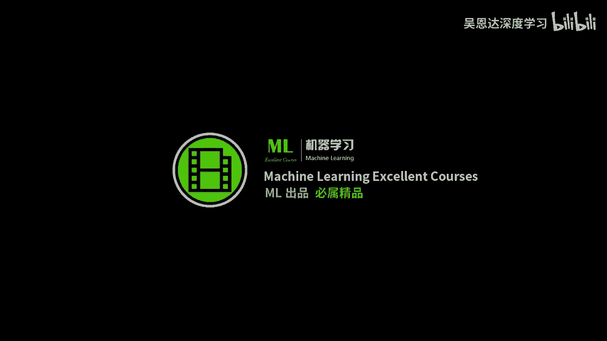
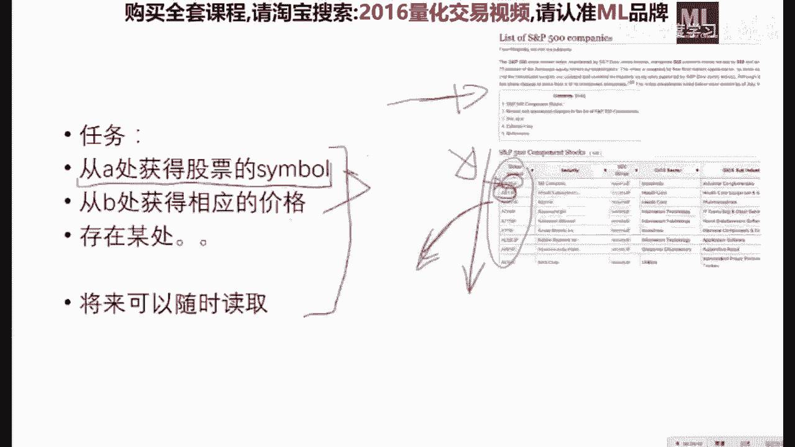
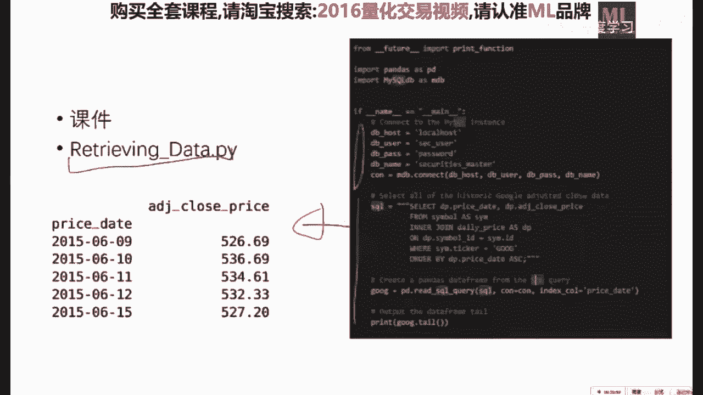
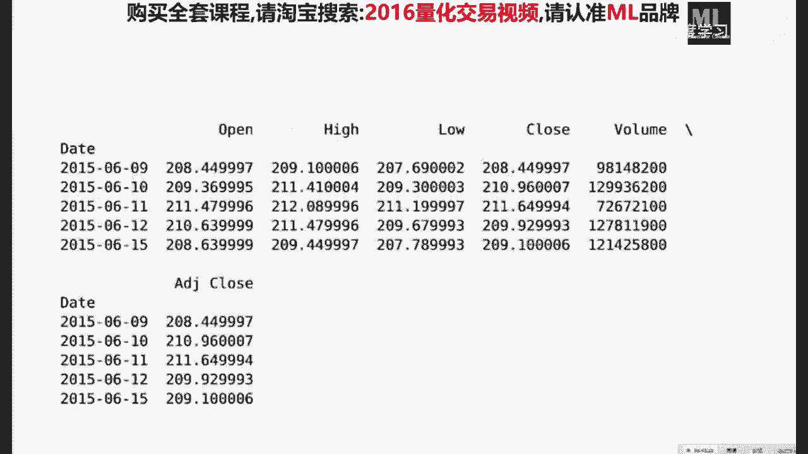
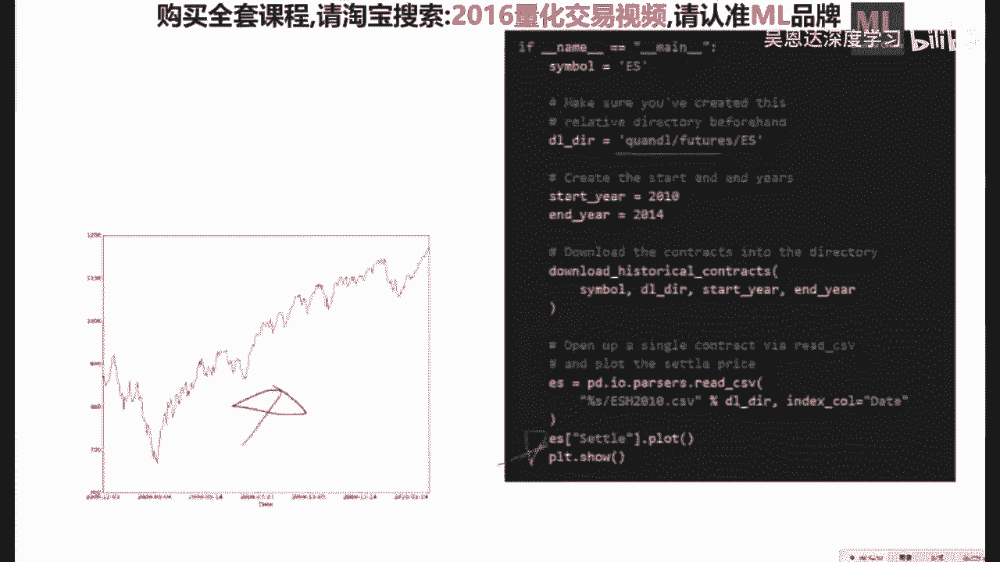

# 【比刷剧还爽！】这太完整了！python金融分析与量化交易实战课程，全程干货无废话 入门到精通一步到位！（数据挖掘分析_大数据_可视化_投资_金融_股票_算法） - P3：第03课_机器学习与量化交易项目班 - 人工智能找迪哥 - BV1oBb6egEiT

OKOK啊，这回呃声音好是呃，是因为我装了一个额外置的声卡，就是这个玩意儿还是挺酷的哈，还能你看嗯，反正就是一专门的主播的什么什么烂玩意，反正还挺酷的哈，诶诶诶哎挺有意思啊，嗯把它关了好。

那我们现在开始上车哈，开始上车，那么我们今天就是开始这个第三课的，第三课的学习，那么额头两节课主要是跟大家热身，就是说了一下我们的这个呃课程，大概要做哪些事情，然后因为是头两节课。

所以没有涉及到很多的编程，那么呃接下来的课呢我的安排也是这样，就尽可能的让编程跟呃数学或者金融知识，尽可能的平衡一点，那么每周呢我大概配的就是啊，一次课比较偏编程，另外一个词课呢会稍微有一点理论。

然后大家在每周每每周不是上两次课嘛，然后呃今天一次，明天一次，然后周一到周五的时候，大家一定要认真的呃把我留的作业做完，然后下次上课之前，我会先花上一些时间，把上次的作业的一些要点。

跟大家遇到的一些问题跟大家说一下，然后顺便把答案也给大家，就是说啊我留的这些作业呢，大家呃不是说是嗯就是嗯我懒得讲，而是我非常用心的根据作业设计的讲义，然后讲争取是讲义，是讲义，比如说是长的是个A。

然后我让你大概去做一个小A，就是说你照猫画虎，大概的就是如果你学了呃，咱们上课的一些方法，和我上课给你的这个样本的呃这个程序，那么呃你就应该有能力从这做，做到这么一个一个转变。

而这个其实是编程呃非常重要的一件事情，就是自己呃实践着自己动手干，比如说呃学学Python的话，一个很著名的一个呃小册子，叫做啊笨办法学Python就是learn Python，Hard way，就是。

他的教学理念是什么呢，就是说呃教你一点东西，然后你照猫画虎的，能把另外一件事情做了，这个是最重要的，而现在很多嗯呃就是呃一些教程呢，它是呃教你做个木木马，然后作业是让你造个飞机啊。

那这个事情就让人很痛苦啊，我学学木马的时候，我觉得都会，然后一看作业，让我坐个飞机，这怎么弄，所以说我尽可能的是啊，我我教你个航母，你自己做个飞机啊，就是说呃让大家不会觉得两眼一抓黑。

就是就是说我们讲的这个课堂上，讲的难度会稍微高一点点，然后作业呢会稍微低那么一点点，这样的话啊会好一点嗯，就是要不然的话就就就就这个事情，就是有很多，你们嗯，比如说大家如果所谓的计算机科班出身的人哈。

科班科班出身的人就有一个嗯在做这个，比如说操作系统大作业的时候，就觉得卧槽老师上课讲的这么简单，然后给给我留的作业这么难啊，就造成了你抄作业的这么一个好习惯啊，那么这个主要是老是偷懒，这个事儿不怪你啊。

那么我们今天来上车好啊，都没有问题了吧，关于上次上两次课，大家应该没有什么问题，如果有问题的话，呃好像已经都解决了，OK那么我们今天讲两件事情，OK我们今天讲两件事情。

一件事情呢就是说我们金融数据的获得与存储，这件事情，另外一件事情就是说我们获得了这个数据，就是不管你是想从云端调取，就是呃在线的来看啊也行，还是你存到离线存到本地的一个数据库，你存起来之后呢。

肯定是要用的，那么如果要用一个这个金融数据的话啊，最基本或者说最原始的一种方法，就是所谓的时间序列分析，这个是这个是非啊，就六七十年代他们就在用，但是也很重要，但是现在你说有没有人在用这个时间数列啊。

这这怎么就是这么一挂的呃呃模型来做呢，有，但是呢，呃跟我们之后要用的机器学习的一些模型相比，它肯定是比较简单的，但是为什么要讲呢，第一它是一个非常好的一个嗯，相当于呃如果你有这个呃。

呃获得数据的能力之后，你能够立马上手的一个简易的一个模型，同时呢它也是嗯你要做这个量化这个领域，如果不知道什么是啊结对编程，不知道什么什么，什么叫做一个稳定的时间序列啊，你上来就说啊。

我用了一个啊神经网络做了个预测分类，但是人家问你这玩意稳定，就是这个时间序列是不是stationary的，你说我也不知道，那么这个就就就就就就就就不是很好，所以说我觉得这两件事情是一个非常完美的。

作为一讲的内容的一个结合，那么我们今天呃作业里头就会呃，让大家到时候画出这个图来啊，先剧透一下，就是说比如说我们已经把数据存起来了，呃不是结对编程，是pair trading，结对啊，交易啊，配对交易。

OK那么就是说我们的这个嗯，就比如说这个是我们其中的一个作业，就是今天我们在学完今天的这个知识之后呢，你就你就有能力来干这么一件事啊，就是说每一个节点是一个股票。

你可以理解为节点之间的边的这个颜色的深度，代表了这两只股票的相关度，OK那么你就可以以可视化的方式呢，来选择你的这个投资组合的，比如说你选了800只股票或者300只股票，你把这些股票的一些相关关系。

能够以这么一种方式来呈现啊，那么这个是我们的呃，呃其中一个作业就是剧透剧透一下哈，另外一个这个是啊这个时间呃，序列分析里的一个一个例子，那么呃首先要跟大家说的就是，这个数据的获得与存储，它不是目的。

他的目的是为以后的事情做服务的，所以说嗯你怎么存，你以多高端的方式存，还是以很简单的方式，我直接在什么狂偷变或者什么通联数据，还是优矿这种平台让我呃呃在在线的用也行，那么完全是取决于你想拿这个数据。

拿来干什么的目的，而不是就一定要避免啊，我为了要建立一个数据库而建立数据库，那么我们啊啊对，就是说从下周开始呢，每次课的这个前半个小时啊，或者嗯取决于这个作业难度跟大家的反馈吧，啊。

就是我们啊是作为上次作业的这个点评时间啊，每周的每周六的前半个小时啊，每因为我们这个就是像明天的话，我就先不点评今天的作业了，因为大家肯定来不及做完，Ok，那么就是说这个建立数据库的意义，主要是有两个。

建立数据库的意义主要有两个，一个是用来你要用来建模用的，就是因为嗯我们有一个我反复强调的一个事情，就是所谓的垃圾进垃圾出，就是说如果对于你一个模型，你输入的是呃X你输输出的是Y任何的模型哈。

一个model，那么如果你这个X是是质量很低的，或者说没有的啊，那么你就没有不可能获得一个有意义的输出，那么你建立模型也就相当于无根之水，或者说巧妇难为无米之炊，那么我们的这个呃呃建立数据库的意义啊。

主要是啊给建模用的，那么给建模用的就包括了这个模型的建立，就是说呃呃你想建立一个什么模型，还有模模型的评估回测以及风控，还有你就是你各种的策略开发的方方面面，凡是涉及到我哎。

我这件事需要知道昨天招商银行是多少钱，比如只要涉及到这种问题，那么就不可避免的啊，你需要有一个地方，你需要有一个地方来存起来，你能把这些数据存起来，也能够啊把它读出来，这个是我们的终极目的。

那么比如说我们想做一些比较简单的，日间交易的模型，而且不需要实时的这个交易的话，那么其实不需要把它放到一个嗯，嗯比较复杂的一个数据库的系统里头，你只要你用那什么铀矿也好啊，什么通联也好。

你只要你把你的活干了就行，嗯当然对于比较复杂的一些建模任务啊，你觉得我放到本地好一点，或者说啊我这个计算服务器不能连外网，我必须得把数据离线存起来，然后我要跑一个深度学习模型也好，我要跑一个比较啊。

比如说要求计算，比较就是说比较偏计算的一些模型呃，一些云端他是没有这个计计算力提供给你的，那么你就被迫的要把这个数据啊存在你的本地，OK那么在这种情况下呢，就涉及到怎么样的来学习着建立一个数据库。

这这个是一个比较重要的，然后另外就是说我们在交易的时候，也需要跟你的数据库啊，进行一些这个这个这这个互动什么意思呢，比如说你有一个模型，你这个模型它在嗯择时的时候，或者说他他他在呃在线选股的时候。

就是嗯他需要获取一些历史信息，来决定我此时此刻的交易行为的话，那么你也是需要有一个数据库，来支持你这个模型的，所以说OK交易的时候，也是需要有一个地方来获得一个数据的，就是说嗯这个是我们的呃建立呃。

你呃你你就是说你作为呃你一个用户来说，你是否要建立自己的本地金融数据库，这个是你需要嗯回答的一个问题，并不是越高大上越好，因为这因为我相信很多，如果呃如果你是机构的，那么这个事肯定是分开的。

就是有专门的人来做做数据和数据库，然后也许还有专门的一个人做，也许还有专门的一个人做这个数据数据清洗，然后有一个专门的人做建模，然后再有一个人啊做这个啊，策略的执行与风控啊，那么如果你是一个团队的话。

嗯已经分的很开了，如果你不是一个团队的话，我我这句话主要是给如果你就一个人啊，想做这些事情的话，那么你一定要回答自己关于你的需求是什么，一定要根据你的需求来决定啊。

你接下来呃是否要啊建立你自己的金融数据库，OK啊，有问题没有，OK那么就是数据的首先就涉及到数据的获取，就是说我现在的大假设就是啊，你现在就你一个人，然后你也没有钱去买这个数据。

就嗯因为你要是买这些数据的话是比较贵的，嗯从就是说有专门的机构来啊，贩卖较高质量的一些数据吧，那么我现在假设的是你现在就一台电脑，一根网线，然后你想做这个量化交易，想想搭一个平台怎么办，这个一点不丢人。

也没有什么嗯嗯非常嗯嗯就是啊不方便的地方，那么我们主要就是两件事情，一件事情是从网上把你所需要的数据爬下来，就是用爬虫程序啊，或者是一些嗯比较好的一些这个呃平台，它提供了一些很用户友好的API供你去爬。

那么你要爬下来之后把它存起来，就是啊，主要就是作为一个呃，呃如果你想一个人来搭建你自己的平台的话，那么这个爬取数据的能力是很重要的，爬下来之后啊，存到你对应的数据库中，那么现在数据数据的获取。

这么几个是我个人认为呃值得推荐的地方啊，关于呃中国的所有金融数据，这个平台我觉得做的不错，叫呃呃to share嗯，就说呃这这个我强烈建议大家嗯，应该他应该是跟通联数据是一伙的，如果我没记错了。

还是跟优矿数据我忘了，就是说呃这个是一个蛮好的一个平台，因为它里头写了呃，呃呃就是他封装了一些非常简易的一些嗯啊，并且功能强大的这个啊Python的这个API接口，能够让你迅速的把啊各各种各样的数据啊。

呃呃呃从网上爬下来，存到你对应的呃数据库中也好，CSV表表格中也好，就是大大的能够减少你自己写程序的时间，OK然后另外这底下几个呢主要是你要做一些嗯，呃就是境外的一些呃这个金融数据的一些平台。

质量也非常好也非常棒，甚至你从这个数据质量来说，它其实是比这个要稍微好一点的啊，但是这个呢它也有很多很有意思的东西，包括这个新浪财经的一些数据啊，就是啊新浪啊，新浪财经的一些新闻数据，他也可以做。

需要分配多少硬盘空间，这个这个取决于你要趴多少数据，你要把这个网站扒下来的话，我个人感觉大概4~6个T差不多够吧，OK嗯好，那么嗯其实呃我个人觉得哈，你其实并不需要把他的东西全趴下来。

因为如果你去访问这个网站，你就会发现当你在建模的时候，你直接调用一个API接口，你就能把我的数据拿过来了，就你就能把那个数据你想要什么数据，一行代码，你就能呃从网上就直接能嗯，载入到你内存里头啊。

嗯就你你也不也也并不必，要说是要把这个网站给呃给给趴下来，OK那么呃底下这几个啊，雅虎金融非常推荐啊，这个我在咱们这，咱们咱们这这节课呢，其实是呃基于这个雅虎金融来展开的，为什么呢。

是因为他的这个访问的这个难度啊啊比较高，要爬它的数据呢会比它要稍微啊难一点，但也不一定，因为pandas as里头有一些内置的一些东西，但是就是说什么呢，如果你会从雅雅虎金融中爬各类数据。

你从这个图示中就会非常呃，就会就会非常自如地爬了，所以我们今天的这个上课逻辑是这样哈，今年的呃这个上课逻辑就是说我教大家用这个，然后作业是你们爬这个啊，然后嗯嗯嗯这个的所有代码呃。

今天上课就已经都放出来了，然后这个的呢我们下次给你，所以说我强烈建议是，你们嗯嗯自己把把这个学会，存到自己的本地的数据库中，而且其实网上有很多，因为这个是中国人搞的嘛。

嗯有有有很多中国人在分享怎么样用这个，而分享用这个的呢，嗯我感觉还是比较少的吧，所以说咱们咱们这么做好吧，Ok，嗯好那么这个这个存储方式是这样，就是说嗯我们的这个金融数据啊，你嗯也就是说呃有这么几种。

比较常见的这个呃存储方式，一类呢就是CSV表格，就是我一个CSV是，比如说一只股票的所有的交易数据啊，就是说嗯然后他这个就是啊，这是比如说这是嗯嗯时这这这一列是时间啊。

这这一列是嗯这这个比如说是嗯买一卖一，买二卖二，然后等等的一些数据，就是每一个金融产品，你就直接放成一个CSV表了，这个是最简单的一个一种方式，而且你呃读或者你访问的时候也是啊，最方便的。

那么其实呃如果你说老师，我把这个图示上的数据全爬成了，6万个CSV的表格，行不行啊，可以啊，不丢人嗯，但但是呢嗯会有更好的一些方式来做这个事情，但是当你数据比较小的时候，比如说你你你要导出呃。

你要跟别人进行共享的时候啊，这个CSV表也是一个很常用的一种，这个金融数据的存储方式，嗯然后第二种呢是什么，就是说我对于一些财经新闻，对对对于一些这种呃文本的一些数据。

比如说新浪财经每天呃关于一些股票的一些嗯，嗯啊新闻也好，评论也好啊，这个我也想存起来的，因为因为我们知道我们以后也会啊，建立一些这个呃统计学习的这个模型，我给你一段新闻。

然后你告诉我它是你应该是看涨还是看跌，那么这种事情下呢，就需要用这种所谓的这个嗯嗯NO SQL，或者说用呃就是呃MONGODB之类的，这种呃呃呃方式来存会比较高效，然后呢，这个seq呢就是大家嗯。

嗯就是嗯嗯最熟悉的一种方式来存，这个嗯跟时间序呃，跟时间序列有关的啊，金融数据，那么我们今天呢主要是讲怎么做这个的事情，OK这个是我们就相当于呃跟大家先说一下啊，好有问题吗。

好OK那么就这个数据格式是这样，就是一般来说历史数据嗯，你要想问的时候，嗯呃一般需要注意的地方，就是你或者说你要你要你要你要存的时候，是需要有这些信息，是是是是要注意的，一个是交易所信息。

就是说你这个数据是呃纳斯达克呀，还是这个嗯嗯啊啊是是啊呃呃上市呃，呃呃是是深圳啊，还是上海交易所，那么就是说这个是交易所的信息，第二个是数据来源，你这个数据是呃从通联数据上来的呢。

还是从这个雅虎金融上来的，这个也是要记录的，第三个就是说我是这个股票的，这个symbol是什么，就是说是招商银行啊，还是谷歌呀，还是苹果呀，然后就是价格，那这个嗯当然很重要。

然后这个是嗯比较低质量的一些嗯，比较低质量的一些数据，他们容易算错的地方，就是一些这个企业行为，就是他分红之后，你这个嗯，就就是你你需要把你的这个分红，做一个这adjustment，要不然的话。

那个价格它会有一个比较大的一个jump，然后你的模型如果没有考虑这一点的话啊，是有问题的，然后还有一个是这个国家假日，这个是大家有时候容易弄弄错的地方，就是我们要把国家假日这些时间要踢出去。

其实只有这样的话，你的时间序列才能比较好的连起来，要不然的话你有时候就会犯一些错误，就是说嗯嗯我连着三天，然后这价格都是空值或者是零值，其实那个是因为人放假了啊，你你你把那个假期的时间要要踢出去。

要不然的话这个你你的程序是有可能会有bug的，OK好，然后还有就是这个容易出错的地方，对，就说一一个是企业行为，就是嗯他如果要做了这个嗯嗯嗯嗯这个呃，stock d呃，Split。

就是说我要这个分股了之后，那么这些事情你是需要做一个调整，依据一些调整计算的公式，来重新做一个这个计算的，那么比较高质量的一些数据源，他是帮你算好的，如果这个你拿到的从网上爬的数据，没有算这个事情的话。

你就得自己写一些函数来来做这些事情，另外就是一些有噪声的地方，所谓的spikes怎么突然一下，那么一下是突然之间暴涨上去了一点，然后突然又跌回去了，这种东西呢一般来说最好要用用一种。

用各种各样的数学中的一些滤波器，把这种比较有噪音的点给它去掉啊，要要不然的话会对你的模型肯定也是有一些呃，负面影响的，第三个呢就是些缺失数据，它没有没有，其实呃上节课我也说过了。

如果你用这个pandas as这个包的话呢，啊对于缺失数据的处理是啊非常好办的，就说你直接能把它全部，要么给它呃，把缺失的地方转转为你它的中值，或者说呃转为零啊都可以，而且不同的人有。

就是这个也是不同的人有不同的处理方式啊，网上的话有很多人在介绍啊，我觉得嗯嗯都换成零比较好，然后有人说哎，我觉得都换成它这个点附近的均值比较好，还有的人说你直接把他这这一列的缺失的地方。

给它换成中中指中位数啊，那么不同的人有不同的方法，那么这个是取决于你的模型，OKOK那么就是说呃，我们现在今天要讲的就是我们自己呃，建立一个呃MYSQL这个数据库，然后从网上爬下来的数据存起来。

然后同时能读出来，这个是我们今天课程嗯前半截啊要干的事情，OK那么就是说你要呃先搭一个这个MYSQQ，如果你用这个LINUX的话，嗯会很简单，你就这个up get get install就行啊。

然后你装完之后呢，你要设立一个用户名，就是要不然你不能用，OK嗯，就是说你用你这个用户来跟这个数据库进行，这个交互啊，就是嗯底下这个就是说我进入MYSQL之后，你说要输入的这些指令集。

你这样的话就能够呃，嗯嗯很容易的建立起你的这个数据库这块，大家如果有问题的话，嗯这个很简单，就是你只要啊下去啊，照着我这个你稍微试一下，你就把它归把它一定要过一遍啊，就是说怎么样的呃。

建立自己的这个MYSQL数据库，这个是这个没，其实没什么讲的，因为它没有任何技术含量，嗯你只要有手有键盘就行，然后大致的可以看一点，关于嗯关系型数据库的，一些最常见的入门知识啊，这个我也觉得不是很值得。

在这个地方给大家讲一下，这个这这种知识还是比较便宜的，OK好，那么就是说我我现在要跟大家主要介绍的，就是说，当我们有了一个这个，你想建立这个数据库的时候呢，我们怎么样设计这个表啊。

这表的设计其实也是不同的人，有不同的设计方案，我我我今天给大家介绍的就是嗯比较常见的嗯，嗯大家老司机们都觉得你这样做是差不多是，就不会有什么大问题的，呃一个表，那么我们在用to share的时候呢。

也可以嗯，是要根据图share的那个接口，来做相应的一点一点修改，那么我今天给你的这个表呢，就是说它基本上能够覆盖啊，各种的网络在线的嗯，这种平台的这个这个表嗯，你也可以做一些嗯这个个个性化的一些修改。

这个没有问题啊，那么大概是差不多嗯，有这么几个表，一个是exchange，一个是data vender，就是你那个嗯提供的那个那个那个圆，然后另外一个是呃symbol跟这个daily price啊。

这个主要是主要是针针对于啊end of day的这些，就是说每日交易的这个数据的数据库的表，我给大家介绍一下怎么样设置，OK那么就是嗯嗯exchange的话差不多有这么几个变量，就是一个rd。

一个是他的这个缩写，然后他名字城市啊，这个国家啊，这个货币啊，还有一个是时区的这个这个校准啊，因为因为因为你们在做一些这个futures的时候，这个是非常嗯非常常见的一个一一个事情。

然后就是呃这个生成时间跟上一次的更，更新的时间，逐渐就是啊这个id这个道家回去，我我我的那个嗯扣的点zip里头他专门有呃，就是有这个文件，你们回去看一下就行，这这个这个倒没，那倒没什么。

然后这个data vender就是要有id，要有他的name，要有这个嗯呃这个平台的这个网站名字，然后还有这个啊support email。

还有这个create date跟lost update date，OK嗯，然后这个symbol是这个是比较重要的，就是说啊，每一个这个是，就是说你需要插入的是这个股票的这个缩，写符号啊。

你要你要你要你要有有地方能够给他插入进去，然后这个每日的价格，就是我这个符号所对应的这个价格，你也要嗯，要有合理的方式，给他放到你这个关系型数数据库中啊，比如说这个啊开盘价最高价格，最低价格。

然后跟这个收盘价，还有一个就是经过调整之后的这个收盘价，跟这个volume，这几个是大家嗯如果要做这个嗯，EOD数据的话，是最重要的这么几个几个事情啊，这个大家回去一定自己尝试着装一个这个。

MYSQL的这个呃服务器，然后自己尝试着把这个事情走一遍，就没什么问题，因为这个是给你装一个软件而已，这个当然有一个需要需要想的，就是需要动脑子的地方，就是你设计这个表的这些这些属性。

我建议最好是根据就是你先敲定了一个，你就是你是打算今后是从啊雅虎金融的part，还是从这个图示上的part，你根据某一个特定的这个这个这个WINDO，来设计你的这个呃数据库，这样的话会嗯会方便一点。

也就就对嗯，OK那么我们接下来做的是这么一个事情，那你就是说建立好了数据库之后呢，你用很简单的这个Python程序，就能够直接的连接到你自己的这个数据库中，就是你的Python程序就能够从数据库中读取。

你想要的这个数据，然后进行建模，那么我们今天主要要以这件事情为例，我们讲一个啊怎么样的把数据呃呃呃定义了，然后怎么样的从网上把数据扒下来，然后再存到数据库里，然后再读出来，然后再画出来。

每一步咱们咱们咱咱们过一遍呃，建立一个嗯就是能够满足你呃，建立你自己金融数据库的，基本上的方方面面的一些事情，这个是我们今天的一个目的嗯，有问题没有，OKOK那么我们今天这个任务额设置的比较贱。

就是说是什么呢，嗯你其实能更简单的把这件事干了，但是嗯我们要干的不一样一点，就是为了让大家把每一个地方都能练到，这样的话你今后所遇到的所有问题啊，尽可能的我让它最小化，OK那么我今天的任务是什么呢。

就是说从这个SP500就类似，你可以想象成是美国的沪深300，就是你首先要从这个维基百科中，就是比如说我先问你，我说SP500的这个每只股票名字是什么，这个你你你假如说你不知道，那么你就上维基百科。

维基百科的这个页面他列出来了，这其实不止500个，那500多一点吧，嗯这么500只五五百来只股票的这个symbol，这个维基百科上是有的，那么我们的任务是什么呢，我们的任务是先从先上维基百科上。

围100科的这一页，这一页里有这么一个表，这一表的这一列呢，是我们所关注的这些股票的这个代码，我们把这些symbol呃从网上爬下来，先从先先把这些东西扒下来，存到我们的数的数据库里。

然后再根据每一个的这个SYMBO，再从这个雅虎金融上把的，把他们的这个，因为雅虎金融提供了每一只股票的所有，历史价格信息，然后我们再从雅虎金融中啊，你给我一个symbol。

我从雅虎金融中爬取他的所有历史数据，再给我一个，我再爬一个，把这500个全爬完啊，那么将来呢我们就可以将来干的事情，就是我们能随时的把每只股票的这个，历史价格啊都能调出来啊，从本地也好，你从从哪也好。

那么这个是我们今天一个见习兮的一个任务啊，当然你要用图share的话呢，啊根本不需要把这呃，这两步其实一步就搞定了啊，所以说我今天给你留的作业比较简单啊，你把图示上的那个AAPI读一读，你就能搞。

那么我们今天要干的事情比比较贱，就是说呃因为这个其实也蛮常见，因为我们以后不可涉及的，会经常的会用一些这个Python的一些爬虫程序，主要是这个呃啊所谓的这个嗯beautiful soup。

这个这个包嗯，这个我是就是说我是希望大家嗯会用这个包，这个是我的真实的这个目的，Ok ok，那么呃嗯这些课件呢都是在这个嗯，这个就就是呃就是我我PPT对应的代码旁边的，这个嗯这个脚本的名字嗯。

大家回去直接运行就可以，那么我们要干的第一件事情，就是说先用beautiful soup上这个网站，把这些玩意儿给扒下来啊，怎么办，其实挺简单，你就写这么一个函数就行。

你但但是之前你需要这个import这个啊，b s four就是beautiful soup，然后那么我们干这事情，其实嗯还是蛮straightforward，就是说他还是比较嗯直接的一个事情。

就是说我们要干的，就是说我们下载了这个嗯维基百科的这个列表，然后把它存到，就是你你你以这个tap的形式呃返回，然后你返回之后呢，再存到你对应的嗯，数据库中的那个表中去啊就行，那么就是嗯嗯一个比较关键的。

就是这个是所有的脏活累活都是在这儿，他帮你干的啊，那么呃就是说你把这个RERESPONSE，这个这个东西拿到之后，beautiful soup会帮你自动给他pass好，然后你把第一列。

然后你把这这个里头的第一列，给它存起来就行啊，那么这个函数是干的是这件事情啊，回去一定要大家试一下，甚至我也建议大家看一看，关于这个beautiful soup的一些一些介绍。

OK那么上一个上一个函数干的什么事呢，上一个函数是从网上把这这个列表爬下来，OK就返回的是这些SYMBO，那么下一个函数要干的事情，是把这些CMOS插入到你的这个。

你已经建立好的这个数据库中的这个表去啊，那么这个也是一个非常流程化，很标准化的一个程序，如果大家嗯对数据库比较了解的话，那么这个是一个嗯就跟sk learn一样，一个非常嗯嗯流程化的一个东西。

就是你把这些instance定义好，你给它连起来，把把把你你的这个smooth给他，传给他，他就他就一个一个就都都都帮你插入了，这个也是嗯比较没有什么，没有什么可讲的一个地方。

那么也是要求大家回去能够按照这个的事情，照猫画虎，从通联数据上啊，就是说嗯嗯今天的呃之后的一个一个作业，就是说从通联数据上通过访问他们的API，你尝试着把他们那些东西插入到你自己的这个。

MYSQL的这些对应的表中去啊，这个也没什么讲的，OK那么第三步，OK第三步就是说呃我们这不是已经存存起来了，这些名字存起来这些名字之后，我们要有一个从雅虎金融上啊，获得这个数据的这么一种方法。

然后就用这个流程化的东西，就能够从雅虎金融上，把对应的这些股票的历史价格啊，呃从网上获得，其实有更简单的一个方法嗯，你用pandas直接它就有内置的一个函数就能干，这个，我马马上会说。

不过这个事情是为了大家告告诉大家，你任何的这个，如果他没没有一个比较好的一个API的话啊，这些事情我们也是可以干的，但是呃是要用这个Python request这个包啊，这个大家要稍微看一下嗯。

OK那么然后我们把这些历史数据嗯，从网上获得之后呢，同样的事情，我们要把这些数据插入到我们的这个，MYSQL的这个表里头去，一样就是爬一下存一下爬一下存一下啊，就就就是一个很标准的一个流程吧。

OK那么最后一步就是说我们的主函数里头，连接你的数据库，把你数据库中的这些历史的这个金融数据，给他print出来，来测试一下你你的这些函数的这个正确性。

OK这个是写的这个retrieving data点啊，Python里头去，那么这个函数的返回输出就是长的，就是这个样子啊，你们能看到嗯，大差不差啊，至少print出来了，然后你再上下压缩网站。

你对一下啊，你看啊如果都一样的话，就说明你从这里头爬数据的这个嗯正确性上，至少是嗯满足了，OK其实对，那么我们现在就说一下一个一个作弊的方法啊，OK作弊的方法是这样。

作弊的方法是你直接用这个pandas IO。

点data swap这个东西就能嗯，这个东西其实就内置了，它跟这个雅虎金融的这个对接，它就它就自动的会帮你把这个数据，索尼所需要的这个数据啊，就就就就就就全就全搞到了，嗯这个是一个嗯比较。

就是我我平时要是着急要做一个实验的话，我肯定是这么玩的，但是嗯嗯again这个事情是因为人pandas as给了，那么嗯你要是在图屑上的话，呃函数调用跟它很像。

就是说你要用to share来调用这个事情，你就是很类似的一个API，就能够把你所期望的这个数据嗯，呃从从从他那个平台获得，然后你实时的进行建模也好啊，你给他存起来以后再用也好。

这个是取决于你自己的选择好吧，OK那么这个函数的输出呢，就是它你就不需要写什么很复杂的东西，就能获得，OK那么这个矿岛L呢，他他这个是一个另外一个比较好的一个平台。

就是说嗯它这个里头啊，这个网站我是强烈推荐大家要去一下，就很多的宏观微观的金融经济数据，嗯嗯嗯他都提供啊，是一个非常非常棒和非常全的一个平台，嗯至少你们平时要是做一些research。

就是做你建模的一些research是足够了，然后旭日你如果不注册的话，我记着是一天能够请求嗯50下，注册之后呢好像是500下，所以说就是嗯你还是最好注册一下，就是能够一天能做的实验能稍微多一点。

然后这个也是在我给你的这个文件中，你能够直接去用的一个事情啊，这个大家学着用一下，OK那么那么这个例子呢，就是给大家讲的是怎么样的，从这个呃跨栏儿中，你把这个呃期货的数据嗯读出来。

然后再给他plot出来，其实plot还是很简单的一个事情，你你如果用这个pandas的话，它自动的就把这些东西就全pp pp出来了，这个是相当于一个demo性质的一个程序片段。

我今天给大家的这些东西都是完整的，只不过今天讲的时候是把就是一些摘摘出来，一些也许值得一讲的地方跟大家先说一下，OK啊说作业啊。

这个第一次作业呢是这样，就说我们上这个图片，这个网站上他这个这个网站中介绍的这个API，你爬取关于交易信息中的这个页面中的，也不用所有了，你你你自己设定一个时间区间，我建议比如说是嗯13年。

13年到到今天的所有的数据，你存入到本地数据库，如果你觉得不行，方老师，我还对这个数据库实在是看不明白也没关系，或者你你就单个单独的按照，按照他的名字存到这个CSV文件中，你存少一点，就那么你的目的呢。

就是说我们的底线，就是我会使用API来随时的调取，我想要的任何数据，比如说我我我现在立马需要知道某一只股票，在某一个时间段里的嗯EOD数据，那么如果你只要达到了啊这个目的的话啊，也行啊。

就是说这个是我们能够保证你顺利的，再往下听课的一个底线的事情，就是说你能够获取到你想获得到的呃，这个呃呃呃历史的这个金融数据，因为其实嗯如果你把这个流程走走一遭的话，你以后再用这个什么呃狂投片。

或者在用这个油矿的时候，你就会觉得比较轻松呃，而且你知道轻松在哪儿了，而且你知道他们提供的那种轻松的缺点在哪，就说呃这些在线的呃量化的这些实验室呢，平台呢它其实是它云端，把这些数据库都存着。

你直接调用一个很类似的一个API接口，就能把你想要的这些历史信息拿到，但是还是是在云端呃，做做一些计算，你会有一些跟本地，你想在本地干的事情的一些不一样的地方，那么大家就心里清楚这个不一样。

那么取决于你任务的这个需求，你来决定我是要爬到本地呢，还是要放到云上啊，No okay uh，然后这个hint就是你参与，就是说把这个网站你多看一看吧，这个页面中会教给你怎么样的存CSV也好。

存到这个MYSQL区中也好啊，这个嗯要动手啊，这个是给大家的作业一啊，这个你这这个作业就不交了，因为这作业也没什么批的地方嗯，你自己能干明白就行啊，这个作业不需要交给我嗯，OK啊作业二这个好玩一点啊。

这个事情好玩点，就是说假如说我们已经有了，你已经有了每只股票的这个历史信息了，我现在希望大家干一件很简单的一个事情，这个事情是什么呢，比如说我们对于沪深300这300来只股票，每一只股票。

也就是说对他的这个嗯相关相关系数，做一个聚类，相关系数做一个聚类，你也可以对其他的一些呃，时间序列的一些呃方式做聚类没有问题，这个取决于你自己的想法，或者说你自己的创造力，每一个点代表一只股票。

那么这这个边呢是你自己定义的一种相似，就就是说你觉得这个相似，就是说我给一只股票A的时间序列，给一只股票B的时间序列，你可以自己定义一个函数嗯，输输入是A的序列，输输输入是A跟B的序列，输出是一个。

比如说是这个similarity，的一个值，OK这个值的颜色越红，那就是相关性越大，然后越颜色越黄，那就是相关性越小，OK然后你给它降维到这个二维平面中去，那么就就是一个很直观。

而且其实蛮蛮有用的这么一种展现方式啊，这个图不是我编的，这个也不是我画的，这个图是哎哎，就是我让大家看的那个sk learn的那个那个，软件包中，他给的这么一个demo，OK因为这也是别人写过的。

所以我也我也没有什么在这讲的目的，那么我要求今大家今天干的事情是什么呢，要求大家今天干的事情是嗯，你呢嗯首先把这个玩意儿读懂啊，把这个读懂，我觉得一个比较重要的地方是，怎怎么怎么进行可视化。

因为你发现你如果sk learn用的多了的话，你会发现比如说你有100行代码，你大概有30行都是在画图，你啊不是你大概有60行都是在画图，你真正建模的，真正做这个机器学习建模的这个呃呃呃。

代码量的是很少的，是因为sk learn已经封装的非常棒了，你就你就model fit点点predict就行，那么大部分的精力呢，都是在怎么样的把这个图展现出来，而这个是一个很好的一个练习。

我希望大家把这个例子看明白，这是第一，当然这个例子中他获取股票的方式很笨哈，你可以做一点优化，就假如说你已经建立了你自己的本地数据库了，你可以把它代码量直接砍一半哈。

就嗯行数吧啊那么那么作业还不是重现这张图，作业是你从图share中拿到这300只股票，完全的照猫画虎，把一样的，这就把把他想出的一样的图也出出来，把图交给我就行，OK听明白了吗。

大家关于这个作业有问题没有，肯定是模仿，因为嗯因因为中国中就嗯就是大家都在模仿，其实嗯，关于关于作业二跟作业一，大家有问题没有，好好再说一遍哈，这个这个点是一个股票，没有问题了吧，OK边是什么呢。

边是两只股票的相似度，这个相似度在这个demo里头，它是按照两个股票的这个相关性来定义的，你们回去把它看看一遍，你就你就知道他说的很清楚，给给了一个公式，是他告诉你，你这么定义就行啊。

这个没有X轴跟Y轴，他就是说我有一个还是回去把这个页面看一下，这个页面告诉你了，这个里头每一个点的坐标是怎么来的，这个是sk learn就帮你自动算好的，这个不是你输入的东西，平面中去的一个事情。

那然后对于如果有机器学习基础的同学呢，我建议你自己定义一个自己的kernel对吧，或者说是计算呃相似度的一个事情，就是说你他给的那个聚类方法，我个人觉得并不是最优的。

对于有对于有这个嗯机器学习基础的同学，我建议就是因为我这个话说的就是故意让大家，如果有机器学习基础的同学呢，你自己想一个比较好的聚类的一种方式，那么这这个是一个额外的一个小作业，就是说你可以自己找一找。

你觉得什么样的这个kernel就是呃相似度，就是嗯其实kernel跟相似度在机器学习里头，他们用的是呃呃就基本上是混着用的，kernel也叫和，但大部分的核函数的本质是计算两个输入的。

相似的一个一个事情，嗯这个如果你反正大家听多少是吧，就是你能听明白，能吸收到就好吸吸嗯，真不知道这个也没关系，但是就是说我建议大家，如果有一点这个数据挖掘基础的同学呢。

你可以自己的想一种聚类方式来做一种平面，平面的这个展示嗯非呃这个锻炼非常有意思，这个我是希望大家每个人都做一下，相似度计算函数对，就你可以就用这个网页中提供的，这个这个函数就行，如果对于嗯你没有这个啊。

因为咱们还没学到机器学习那一块啊，嗯还有问题吗，好的，以后，这个作业我会专门写一个小的一个文档来说啊，这个在PPT里头，今天先放到PPT里头，是这样，聚类跟社区发现是这样，社区发就聚类是一种工具跟手段。

社区发现是在社交网络挖掘中的，一个一个一个一个目标，就是他们的这个侧重点是不一样的，就是我要做设计，发现我可以通过聚类的手段来做，嗯就是这对聚类是一种嗯，数据挖掘的一个常见的工具。

一种非监督学习的一种方法，而社区发现是聚类的方法，应用在这个图的，这个图关系的数据中的呃一种方式，Ok，好那么我们现在休息休息5分钟，因为接下来我们就要讲今天的第二件事啊，有问题大家可以问嗯。

啊你可以通过更新的方法来做这件事情，哎我额我我强烈建议大家分组来，可以建议分组大家来一块做这个事情啊，因为我相信大概在呃咱们这个班里头，有有的人对建模比较在行，有的人对这个刚才说的数据库这些比较在行。

如果你们能够一块干的话，会比较有意思，嗯好那大家先在群里头嗯，先聊着我呃，3分钟之后回来，然后哎我回来了，我看一下大家说了些什么，对我我甚至建议大家可以呃呃分组。

然后建立一个这个呃呃GITHUB的这个账号，然后你们共同的在一个地方呃，开发一点志同道合的一些作业也好，什么也好，我也方便啊，我我来帮你做这个code review之类的一些事情。

也可以按性别分或者按星座分啊，水瓶座的大家在一块玩一玩，嗯然后我也建议大家嗯在交流的过程中，可以在这个群里通过这个邮件的方式嗯，比如说你也可以给所有的人发一封邮件，自我介绍嗯，嗯要求加入一个组。

也可以给你感兴趣的某几个人呃发邮件，然后如果你觉得有必要的话，可以抄送给我，我会看着你们的一些讨论来做适时的加入进去，Ok，好啊，企业行为是这样，就是容易出错的地方，就是有的数据他没有做这些除权啊。

什么的一些事情啊，你得做就是你容易嗯，嗯你要不做的话，那就数据是错的，那啊回去可以查一下这个事情嗯，就是今天的作业都是比较需要，如果大家之前是Python0基础的话，会比较的呃考验人。

因为呃刚学编程的时候都是蛮痛苦的一件事情，尤其是你在做这个数据这一块的，一些编程工作啊，脏活累活啊，错误比较多，嗯你今后的话呢会好一些啊，底线是什么，底线是这个如果呃是零基础的呃，呃Python的同学。

因为我国庆节前给大家呃，要求大家去补习了一点Python知识，如果你的起点在那儿的话，你可以不把它存到你的数据库中，你只要会用这个图示之类的这个工具，能够在线的把数据载到你内存里头呃也行，没有问题嗯。

对于有一些编程基础的，或者说是从程序员这边往过转的同学，那说呢啊，那你还是最好建立一个比较好的一个数据库，你甚至啊你把你把那图片，那你网扒下来，你都能对不对，你你都能你都能嗯。

就是它是有一定有一定价值的一个东西哈，如果你把那整个网站扒下来的话，其实也不难，嗯就是我现在知道有一些团队是在做这个事情，就是说从这个网站中趴下来的，就就是从这个网站趴下来，这个呃文本的一些数据。

然后利用自然语言处理的知识来做选股，嗯效果还行，马马虎虎吧，嗯所以说嗯他是有意义的，也许它的这个金融数据的质量不是，也许肯定不会有商用的那么高，但是呢它的文本的这个嗯还是值得一做的，也很简单。

你直接把他的所有的这个文本的数据扒下来，之后，你做一个分类器嗯，或者做一个选股的一个一个东西，你就能你就能干也不难，这个在我们课程在结束的时候，每个人都应该具备这种能力。

OK那么我们现在接下来是要讲这个事情，就是说时间序列分析，其实嗯他这个名字很大，它它就是说你听上去就是跟时间序列有关的，统计分析，都叫时间序列分析，但其实呃还不是是什么呢。

就是时间序列分析其实是比较偏这个传统的啊，计量经济学的一种方法，OK就是说嗯呃呃比较古老，比较传统，然后呢，因为他是从额计量经济跟统计那一卦走出来的，所以说呃他跟机器学习最大的不一样是什么呢。

它跟机器学习最大的不一样是时间序列分析，在三五十个点，就是三五十个数，就是就就很小的数据量上都能做的一些事情，而为什么你看到比如说你机器学习嗯，做完一个模型嗯，嗯现在就在在这个时代。

大家做机器学习做完之后，很少再再再再说什么P值啊，什么t statistic之类的事情呢，其它数据量已经他妈足够大了，它直接在这个测试集上做完，回测效果不错，那么也是一种验证模型的方法。

而比较比较传统的统计学模型呢，就那么百十来个点，我做完之后你还得说我拍着胸脯说啊，他应该应应该可以啊，那你怎么办，那就得需要用一些呃比较嗯，比较人为设置的一些啊，统计学的一些方法，来验证你这个。

你的这个模型是否符合你的这个这个假设，当然符合之后呢，你还是要做回测的，那就是说这就就时间序列分析跟机器学习，它是两两个目前很火也很重要的两个大流派吧，啊有的人是很多从金融那边走过来的。

或者说金融啊这个啊计量经济啊，那那边的人走过来的人呢，他比较比较喜欢啊，用这个时间序列分析的这些方法，然后那个另另外一些做矿车的人呢，他们是比较喜欢呃用这个机器学习的方法，因为他这数据量啊可以做的很大。

因为当你数据量很大的时候，有很多统计学上的一些事情，其实可做可不做的吧，就是说嗯就是你有各种各样的其他的方法，来验证你的模型，OK嗯而我们呢大概嗯在这节课呢，跟接下来一些课会比较侧重啊。

机器学习的这个方面，但是时间训练分析呢也是非常重要的，另一条腿嗯，必须心里头必须得知道嗯，所以今天嗯我放到这，是因为嗯你们假假假，假设大家已经会会读数据，会存数据，会拿数据了啊。

那我们立马能上手干的一件事情啊，就是时间序列分析，OK啊，有问题没有，OK那我感觉大概嗯没有很多的问题哈，那我们开始讲，就是说关于这个嗯比较传统的这个框呢，它大概主要是呃我上次也介绍过了。

大概是主要分两个两个两两大类吧，一类就是所谓的这个啊啊呃均值回归，就是说他假设这个时间序列呢，呃每一个时间序列，它有一个就是它的这个时间序列它是平稳的，它是stationary的，就是说它会有一个均值。

那么我们的这个嗯，嗯呃呃学这个这个金融产品的价格呢，是围绕着在这个均值上呃呃呃呃呃呃做的，所以说当它高于均值的时候啊，我们就sure，当它低于均值的时候，我们就long，那么这个是一大类方法。

另外一大类方法就是基于这个啊momentum，就是说基于这个动量的一大类，这个技术分析的这个流派，那么今天主要跟大家介绍的是呃，第一类的这个方法，就是怎么样的来判断一个时间序列究竟是啊。

是是一个随机游走呢，就是说随机游走的意思，就是说呃呃下一刻的呃，价格完全不依赖于上一课的价格，那么如果一个时间序列是随机游走的话，我们就没有办法进行呃统计套利，因为它是一个完全随机的行为，不可预测啊。

你你你你你的模型肯定是没没有用的，那么呃我们所做的所谓的这个呃chasing the alpha，我我我们们想做这种技术分析呢，我们的关键假设和我们的终极目标，就是找出来那些嗯不是随机游走的时间序列。

而单只股票啊基本上大部分他都是随机游走，那怎么办呢，就是我们要我们的投资组合，如果满足某一定的这个呃线性关系的话，这个投资组合它可以是一个稳定的，这个呃随机过程，那么这个是我今天下半截讲的一个主要的。

主要的关键点，就是说你对于每只股票来说，它很可能是一个随机游走，但是对于一个投资组合来说呢，他你是有办法找到，不是随机游走的一个投资组合，那么我们就能基于这一点再往下开发策略，这个是我们的终极目标。

有问题没有，OK那么我再说一遍哈，就主要是呃，这一类方法都是归在这个统计套利啊，这一大挂的模型里头去的啊，那么这个关于这个mean reversion的，这个主要的假设就是说或者主要的目目标呢。

就是说我们要找出来嗯，他啊是平稳的随机过程的这些时间序列啊，什么叫平稳的随机过程，这个我马上就会说到，OK那么呃呃呃就是呃呃平稳的意思，你可以想成他不是这个嗯嗯随机游走，就是说他是随机游走的反面。

如果它是呃不是呃，如果他是平稳的话呢，那么它就会存在这个mean reversion的这个现象，如果它存在这个现象呢，我们就能够呃基于这个事情来做这个统计呃，统计套利的嗯一系列的这个策略。

那么核心的问题就在于我给你一支股票，比如说我告你啊，招商银行嗯，每天的这个呃价格信息，它是随机游走，它还是不是随机游走的，那么这个就需要用统计学的方法啊，你给我一个时间序列，我算一个数啊。

这个数如果大于多少嗯，它就是小于多少，它就不是，或者说它等于多少，它就是就是说怎么样的，用这个统计学的这个方法嗯，来来判断一个时间序列是否啊是平稳的，那么它的你从呃编程的角度来说呢。

它的输入它的输入是一段时间序列，输出呢你可以想成一个终极的输出是yes or NO，就是说它是平稳的还是不是平稳的，Ok me reversion，我再说一遍哈，Mireversion。

就是说我们的这个时间序列，是否它是在某一个固定的一个均值周围，做这个波动，如果是的话，那这是一件非常棒的一个事情，我们就能基于这个来做各种的统计的，这个模型呃，统计套利的模型，如果不是。

那就是说呃这个这个mimi version的反面呢，就是说我上一课的是我，我下一课的价格跟我上一课的价格跟上，所有就跟我之前的时刻的价格是独立的，那么独立的来说，我预测下一秒的价格。

跟我扔一个硬币来判断是没有区别的，那么这种情况下，我们从你从理论上可以证明，你的所有的技术分析全是扯淡，因为既然如果他是一个随机游走模型的话，或者说如果它是一个呃，呃非平稳的时间序列的话，你怎么预测。

是跟你扔一个硬币，硬预预测是结果，从呃从长远来看都是一样的，那么这个是我们需要嗯不想看到的一个事情，而我我再说一下，我们的终极目标是什么呢，终极目标是建立一个投资组合。

让这个组合是平稳的一个呃随机过程啊，就因因因因为单只呃单只股票的呃，呃这个时间序列嗯，你可以自己验证一下啊，很多都是啊，这也是我们今天的嗯，也是我们今天的这个一，也是我们今天的目的之一。

OK那么那么好那么好，那么我们现在就是如果这个嗯嗯数学的讲，这个一个连续的，这个呃呃mean reverting的这个时间序列呢，它可以用这个所谓的这个OU过程啊，来来定义啊，他具体说的是什么呢。

底下就是这个公式，大家看到别发慌啊，咱们咱们仔细看一下啊，他具体说的是什么，具体说的就是说这个C他C他就是这个rave，就是来我来我来写这个theta，这个theta说的是什么呢，说的就是说我啊。

我我我回归到这个命值的这个这个速率，然后这个缪呢缪缪说的是什么呢，缪缪说的就是说我这个时间序列的这个均值，OK那么呃呃这个呃这个西格玛说的是什么呢，这个是这个这个时间序列的这个。

这个这个variance，就是它的这个啊方差，然后W呢是一个呃就是这个维纳过程，或者说是这个布朗运动啊，那么我们嗯对，就是说他你你把这个数学你说人话，就是说你你你你你你你你说人话，他想说什么事情呢。

这个公式他说的就是说我这个呃时间序列，价格的呃，这个波动跟我嗯对，就是价格的波动正比于我呃，我的这个呃价格跟均值之间的差，再加上一个这个呃高斯噪声，我再说一遍哈，就是说嗯我们这个价格的这个波动。

就是这个DDXT啊，它呢它是跟谁有关呢，它是跟这个均值和现价的差是成正比的，加上一个啊随机的这个噪声，那么呃怎么样，比如说我们有了这个微分方程了，那么我给你一个时间序列啊，X1X2X三。

一直到比如说那个XT，你怎么来判断这个时间序列嗯，是平稳的还是不是平稳的呢，那么有两种非常常见的，有两种非常常见的方法，OK这两种非常常见的方法，第一个呢就是嗯嗯所谓的这个AD f test。

嗯这个我也是嗯嗯第一次听，要是听不懂，你回去再听一遍，然后再稍微查一下，这个，我建议大家也可以看看维基百科的一些词条，OK那么就是说嗯这个AD f text，它最终要干的是是个什么事呢。

就是说嗯我来计算一下这个时间序列呃，用统计呃呃呃用统计检检验的方法来判断它啊，是平稳的还是还是不是平稳的，OK啊那么它其实就是呃分两步啊，很容易啊，就是说嗯他是什么呢。

就是说嗯啊对就是你用用一个很fancy的一个词，就是所谓的这个它是检验的是这个unit，在这个auto re关auto regressive呃，时间序列里头，这个大家回去可以查一下。

相关的这个统计学的书，嗯这个是一个很数学的话，你这这你不用管，你就是说就是关键就是什么，关键就是说是，我是想知道这个东西是该为零还是不该为零啊，嗯嗯如果为零就黄了，如果为零说的什么呢。

你看你你你看这个公式如果为零，就说的我，我这一刻的价格跟我上一课的价格是无关的，如果不为零呢，哎好事啊，就是我们想要的这个嗯时时间序列，那么它其实就是分两步啊，第一步就是说我计算这个啊DF套。

就是这个所谓的test statistic，然后第二步呢就用这个那test service get的这个啊分布，加上这个critical，critical value来判断你是否要拒绝这个嗯嗯那NO啊。

hypothesis嗯说的嗯很复杂，嗯嗯假如说你说我操全忘光了怎么办，嗯没关系啊，嗯Python都帮你写好了啊，就是它其实是嗯你要装一个包，装一个这个包就是嗯stats啊。

stats model就是拍Python那包，你就pip install就行，你就用这个你就用这个东西呢，它就能自动的帮你来算这个东西，就是这个就在这ADF，OK那么我我们要干的事情。

其实就两行代码就能搞定一行代码，你先用这个，你先用这个pandas as，比如说把亚马逊的这个数据你先读进来，从2000年1月1号到2015年1月1号，他所有的这个数据价格的，你比如说你按照这个。

你把这个啊adjusted，就是呃收盘价的价格这一列全拿出来，就是说我想看看亚马逊在这嗯15年当中，每一天的收盘价格，这个时间序列，它究竟是一个嗯不可预测的这个random work呢。

还是它是满足这个啊，均值回归的这么一个时间序列，我们就想看这件事情，你就直接让他你就用这个嗯at follow这个函数就行，那么它返回的东西呢就在这啊，主要看就看两个数就行，你就看它。

比如说跟呃这个呃5%的这个进去呃，呃呃这个呃critical嗯，value这块比你就看它比它大还是他比他小，你看啊它比它大，他比他大，说明什么，说明不好，说明这个NO hypothesis。

你是不能拒绝的，不能拒绝怒海抛碎碎，说明什么，说明这个玩意儿啊，是应该是零，这个玩意儿应该是零，说明什么，说明它是一个随机游走啊，就是我们费了这么十几分钟的劲儿，我们发现啊亚马逊这支股票啊不啊。

对亚马逊这支股票啊，它是一个随机游走模型，说明什么，说明我们一切，如果它是随机游走模型，你要是想哎啊，再再再用点什么统计学方法呢，那就比较偏巫术了啊，OK那么我们是不是就该OK关了电脑回家。

该干嘛干嘛呢，从从此相信了巴菲特呢啊并不是啊，并并不是，是因为你单单支不行，我他妈弄个都是那个投资组合来看看行不行啊，那么我们这也是我们接下来要干的事情，OK都可以都可以。

就是说呃你你其实真正的这个在industry里头，他们用的是这个return，就是说呃用的是收收益，但是我嗯咱们这不是还没到，怎么样对这个数据做变换吗，咱们用这个，你用这个你试试吧。

嗯好那么第二个判断的方法更简单，就是我们算一个值，算这个啊H值就行，嗯OK嗯嗯就是嗯如果它是0。5的话呢，那么它它就是一个这个嗯嗯呃，这个这个这个呃呃geometric呃，呃布朗运动，如果它小于五呢。

就说明它是呃呃mean reverting的，如果他大于0。5呢，就是它是一个呃春顶的这么一个时间序列函数，那么这个这个函数好像得自己写，自己写，是这样，就是说嗯我们就算就就是说把它嗯。

就是把这个呃把这个啊呃这个EXPAN呃，这个呃呃呃exponential，你给他，你给他计算一下，它差不多就是很简单的一个一个计算方法，就是你先先做一个这个呃LECT这个value，然后你算这个top。

在那个上页的那个公公式里头啊，用用一行，因为它是一个离离散的一呃一个值，所以你得你得这么搞，然后你再你再做再做一个这个linear fit，然后你就返回这个数，然后返回的这个数呢，嗯你跟啊你跟0。

5比啊啊就啊就啊就行啊，那么我们的这个test函数啊，是这样，就是说比如说我们先嗯生成一个这个嗯，嗯嗯就这个啊啊分别生成这个布朗运动，生成这个mean reverting。

跟生成这个啊春定的这三个你自己造出来的，就你就根据这三个三个时间序列的定义，就是你根据定义，你可以造出来一个离散的时间序列，然后你分别计算它的这个H的这个值，然后你再把亚马逊的这个股票的这个数据。

你也计算亚马逊股，就是这个是这个是根据定义得来的，三个时时间序列的值，跟亚马逊这支股票的时间序列的值，你求一下这个函数，然后你就会发现哎这个也确确实耶，亚马逊算的这个H这个值呢。

嗯跟这个恩布朗运动是啊最近的，那么也就这个这个检验呢也也也也是返回的是，OK这这玩意不好使啊，那么我们的这个作业就非常straightforward了，因为嗯我假设大家还不大会做这个嗯，嗯就是数据的嗯。

可以说是啊特征提取嗯，从机器学习的角度讲，就是怎么样的对特征进行提取，你从统计学角度讲，就是对时间序列的重新定义，或者嗯那么我我们的第三个作业呢，就是说请你对。

分别对沪深300股票进行上述的这个统计检测，就对这300来只股票每一个你跑一遍，然后你按照这个按照它跑出来这个值，你排个序，你排出来最大的那几只，你看看他是不是啊，me reverting的。

如果存在的话，那这个是啊，我今天的我们的这个第三个作业啊，那么这个作业呢其实你有你的数据库也能做，没有你的数据库呢直接调用它的API，或者在那个什么优矿啊，嗯还是嗯通联数据什么。

就是说你在这些目前国内比较时髦的啊，网上的量化交易平台你也能做啊，因为300只股票这个算的也都很快，这个是我们今天嗯的第三个作业，有问题没有，OK这个作业其实嗯还是挺有意思的。

因为嗯反正我第一次学习这个知识的时候，我特别想知道这个事情，嗯就是你如果具备一定的好奇心的话，你肯定很想知道这么简单的一个方法，我是不是就能干一干呢，嗯当然你也可以对这个时间序列。

通过这个return来做啊，这这就是这个我们后面说就真正用它的时候，是是那么用的啊，当然还要再做一些其他的东西，嗯啊你不用排序了，你这样吧，你就你你就告诉我啊，谁是啊，谁不是啊就行。

嗯对这个是一个非常好的一个问题，就是说真正要干的就是你要真正要干的，除了刚才除了刚才这个嗯hardy同学说的呢，真正要干的还有一个事情，就是我们其实做回归的时候，这个系数其实是要变的，就是说这就是说我。

我我们要用一个叫卡曼滤波器的一个东西，来对这个数数据先进行一一道滤波，这样的话呢会能会嗯，嗯就是他背后会会会会更有一些道貌，这个我们以后再说，嗯嗯就是说嗯嗯嗯嗯你从机器学习的角度来说，也可以。

就是你把它再看中一个变量，对它再再废的，也就是你不把它看作一个常量，就是说这个是根据你对这个模型的假设来定的，然后如果你具备一定的数学知识，你就能把你心里头对这个世界的理解，就是你对世界理理解。

就是我认为这个均值是是一个呃，自己也是一个随机变量，那么如果你你相信这件事情的话，那你就肯定可以建立啊对应的统计学习模型，进行这个检测，没有问题，OK嗯嗯对这嗯贝贝叶斯回归没有贝叶斯。

贝叶斯不仅是贝叶斯回归，比如说呃高斯过程回归，他就是他很好的一个贝叶斯回归，就是各种的贝叶斯方法，还有这些，这这些呢其实是我是想放到机器学习，那整个的机器学习的那个框架里头来讲。

这件事情是因为在那个框架下，我们看这个问题会会更清楚一点啊，而嗯，还有问题吗，在分钟或tag表现的均可缓慢下同步，嗯这个取决于数据，这个嗯在分钟级别的问题，就是这个数据的噪声实在是太大了，嗯好。

那么我们现在看，就是说我们从单一股票这个到这个呃，呃呃投资组合，那么我们刚才说到了，我们如果只用这个只检测一个时间序列，他是有比较大的问题的，那么我们有没有可能我们挑比如说挑两只股票。

而这两只股票它不是呃一个非平稳的，就是说它是一个平稳的过程呢，那么我们可以建立一个这样的模型，就是这个是所谓的这个，pair trading的一个一个基础，这个基础是什么呢。

就是比如说在同样一个板块里头，比如说这支股票是可口可乐啊，这支股票是比如说是百事可乐，如果我们认为可口可乐跟百事可乐，他们嗯嗯嗯这两只股票的组合，它是一个呃稳定的一个过程的话呢。

那么其中一只股票如果偏离了呃，他的这个啊均值，那我们肯定就会有一系列的统计套利的方法，来从中进行套利，K那么所以说啊我们心中想的是这件事，就说他们你高我也高，你低我也低，怎么样呢，用数学模型啊。

来把我心中的这个事情给他定义出来呢，它长的就是这个样子的，就是这个Y是比如说是百事可乐啊，X呢是可口可乐，什么意思呢，在每一个时刻，可口可乐的价格是啊，百事可乐价格的一个常数的一个倍，加上一个噪声项。

那么我们的目的是什么呢，我们的目的就想知道，如果我做了这个线性回归，你要从机器学习方法来看，就是它是一个单变量的一个线性回归，极简单的一个问题，那么我们如果你建立这个模型。

一个非常正常的和一个马上的一个问题，就是OK你这个模型是不是太简单了，是不是把所有东西都都解释出来了，那么从时间序列分析的这个角度，他要问的一个问题就是说我这一项是不是真的。

你模型所假设的那个高斯噪声呢，就是你你你你怎么能够保证你的这个项，所所谓的叫残差项，RECEDU上对对，怎么保证这个residual，它是属于一个嗯高斯分布呢，而且是一个对啊，你怎么保证这件事情。

那么我们就用这个所谓的嗯这个嗯，嗯这这个这个呃QUINTEGRATION的这个呃ADT啊，来来做这个呃统呃来做这个呃啊统统计检验好，我模型说清楚了没有，大家先先先关于这个模型有有有没有问题对。

就是说我们这件事情要干的事情是A跟B1块，他们是稳定的，而想干这件事情，我们的手段是判断他是一个随机噪声，对很好，跟刚才那个问题一样，在这个模型里头，我们假设B是constant。

那么我们有一大系列的工具，来让它是一个不是constant，让让它是一个随机变量，也可以建立对应的统计模型，就是在你真正要用的时候，你你你完全可以把它处理成一个，非constant的一个数嗯。

对嗯对大家说的都很好都很好啊，那么呃这，复杂了没关系，这个这个还这个还这个，这个是你，这个是我们这门课中最简单的一个事情，这个以后咱会更复杂好，那么呃呃所有的关于这这个东西。

都封装在这个呃这个这个文件里头，那么我们就是从嗯举个例子，就是在这个嗯SP500里头，我从这个能源板块我选出来的两只股票，你就这这个文件里，也教大家怎么画这这玩意儿了。

就是我们怎么我们把这两只股票的这个price，我们画出来，哎我们确实发现哎你高我也高，你低我也低，但是我我们怎么量化这个事情呢，就是说你不能光看呀，你说哎我这你也看不过来啊，比如说我让你暴力的全搜出来。

你怎么办，那那你就看不过来了，看不过来的话呢，呃当然另外一种关于这个图像的，另外一种展现方式就是很常见的，对不起，很常见的展现方式就是画所谓的这个散点散，散点图，Scatter plot。

这个也是呃大家在做做这个呃量化中嗯，极其常见的，仅次于仅次于仅次于这个图的，一种可视化的手段，嗯呃我今天提供的这个代码中呃，呃也告诉大家怎么样画这个事情呢，它是什么呢。

就是说我这个轴是呃呃他的这个股票价格，然后这个轴呢是它的这个股票的这个股票价格，然后你把这个散点图画出来，哎一看确实似乎它存在某一种这个线性关系啊，对吧嗯其实我们搞你要是搞机器学习的人啊。

其实我都不用test这个东西，你就如果你这么画出来这图了，你觉得它是一个线性的，或者它是一个二次的，你无所谓，你废腾fit完了之后呢，你再在这个测试集上，如果在测试集上他的表现满足你的期望。

并且回测的效果不错就OK了，你是不需要去用这个这这个这个test来判断它，是不是的，因为有很多的方法来判断它是不是，对不对，你可以计算这个系数的R方值，对不对，你也可以在这个呃测试集上。

就统计学上讲叫所谓的out of sample error，但是机器学习讲喜欢讲叫做就是这个out of sample，这个是一个非常统计的一个词，我们机器学习都不大用。

然后呢我的它是等于这个所谓的test set的，就嗯对不起啊，哎操哪儿去了啊，这这对这个它是等于这个所谓的测试集的，你在这两个集合上算一下他的这个错误率，然后再如果满足了你内心的一种期望。

然后你再在这个你的这个回测策略上跑一下，你你你觉得行就行了呗，为什么这个事情曾经很重要，很流行呢，是因为这个模型早就有了，古时候就有了，那我就说五六十年代吧，那阵他们的数据很少。

他们根本就玩玩不了这个事，也玩不了这个事，你怎么办，你就就就50个点，你比比如说你你你你你做量化倒还好，我要做计量经济学，国家GDP那么一年一个点，我就那么几个点，我就我就这就是要在很小的数据上。

还要说出点理论的依据出来，所以嗯就是你会看到大量的一些嗯啊，这些统计检验的方法，但是呃数据比较大的时候，其实嗯是可以睁一只眼闭一只眼的，但是前提是你得知道这些的存在，并且知道它们的原理啊，这个是底线。

Ok，好OK，OK那么我们把这个残差，就是刚才我说的这个说的这个E就是你，你那么就是说我我们现在不是有了这个有了，这它是X它是Y，你可以对XY你做一个线性回归，那么这个sk learn能做。

那么其实这个pandas as，这个包也能做这个线性回归，你做完线性回归之后呢，你对于在这个样本呃，在这个训练集中的每每一个点，你把这些残差就是每一个对应的X，它是是会对应一个就是你这个线上的这个误差。

这个残差值的，你把这些残差值你画出来，它就长的是这个样子，他看的还是挺嗯挺随机的是吧，然后你根据这个残差值，你再算刚才我给你的那个函数，他你就会算出来，哎操哎挺挺好，这个数比他是要小的。

说明什么在5%这个级别上，他确实是一个嗯啊非非平稳的呃，一个呃一个时时间序列，那么它是一个非平稳，那就说明什么，就说明那个X跟这个贝塔Y是一个平稳的，所以说啊就就就说明了。

我们是可以利用这个嗯啊这个这一对儿呃，呃呃时间序列来做接下来的统计套利的方法，OK呃有问题没有，啊多个协程我不建议大家用统计套利的方法，我建议多个协程，你们直接就上比较好的机器学习的模型就行。

因为因为其实从从从你你你，你要是放到另外一个free Mark下看这个事情，嗯就就就会有很多新的观点，这个我们下次我们慢慢的来看这个事情，对你可以选，比如说你可以选可口可乐跟这个苹果股票。

你你如果你选可口可乐跟苹果股票，你很可能你会算出来这个玩意儿它不是一个嗯，不是一个随机噪声，那么就说明了就说明了你这两个是不可以的，所以今天的作业是什么呢，今天的作业就是说我们要找出来。

所有的协整关系的这些peers，写个小暴力吧，因为这个计算也是嗯你的CPU是能扛住的，你就在这看，你看啊，这个不是看的，这个是就是你就你就查表查出来的啊，那么我们今天的最后一个作业。

就是说你撰写一个脚本或者说一个函数，你把沪深300股指中涉及到的这300来只股票，你2222之间你比一比，然后你把最具备协整关系的这些对你返回出来，就比如说我找出来的结果。

比如说你哎这是比如说光大银行跟招商啊，这个是最最协整的啊，你就你就排排个序，你你top ten吧，嗯啊这个你回去需要看一下嗯，统计检测初步的书，这个讲起来就嗯就是嗯你至少需要啊了解这个。

至少大家要需要看一下什么叫做p value，什么叫做t statistics，这个大家查一下吧，很多你们任何的嗯书中都会有啊，这个这这这个就嗯太基本了，嗯这个其实也是在什么时间范围内。

其实也是你所需要去所谓research的地方，而且需要考虑你在这个时间内，是否具备泛化能力，就是否你能保证啊，你在这一块，比如说我这就发现这一小段时间它是协整的，但是它不具备泛化能力啊，时间区间是这样。

只要你的时间区间满足了你的模型的泛化能力，就是能够在未来还是OK的就行，嗯所以你要写一个比较合理的回测的机制，这个我今后也会说有专门的一类误差，就是所谓的嗯乐观主义误差啊，你你自己专门找了一段时间啊。

你发现他是邪整的，然后但是你犯了乐观主义的错误啊，还有问题吗，是这样，参数扫描是分两两个事，都就是嗯所谓的嗯hardy同学说的很好，就是说这个参数扫描主要分的是两个事。

一个是在这个model selection里头，这个比较偏cos validation，另外一个是你的所有的模型的超参数，就是你这时间窗格啊，你来定义，但这个呢是跟你一个合理的一个回测。

是要放放到一块儿的，有一个和这我们专门会有至少四个小时的时间，专门讲怎么做回撤，因为大部分人是死在回测上，这个我之前说过啊，你可以以非常鸡贼的选择一种回测方法，让你的任何模型都是挣钱的。

嗯好那么接下来是一个热身行为哈，那么我们的这个嗯，我们这门课啊主要讲的一个事情，Machine learning，它是一个呃一个different呃，的一个一个借鉴方法。

就是呃呃different approach，就是我们从另外一个角度看这个问题，假如说我们有了足够大量的数据，就是别是50个点，你能不能5万个点，就是说你在你有呃，前提是你有sufficient的数据。

是因为其实那些搞计量经济学的，或者说大数定律，大数就是统计统计学和概率学里的大数定律，它那个大数是多大算大数，他们是30个点，就算大数嗯，机器学习的话，你这肯定嗯。

就是说就是那这这就是他们这两个的数据的，这个数量级是完全不一样的，那么从呃机器学习的这个角度讲呢，他的所有东西都都都是这个东西，就是说我有一个输入，这个xx可以是很高维的一个一个东西。

比如说是500维的一个一个东西啊，你可以你自己定义，你每一个是只要是你是500维的，在TT时刻，你在每一个时刻，你只要能定义500个特征值，就是所谓的feature，就是说呃比如说呃。

就是你你有有有有有各种方法，这个我们下次慢慢说，就是你只要在每一个时间点，你自己计算出来一个五百五百维的一个向量，然后你放到一个函数这个F里头去，再加上一个高斯噪声的这么一个一个误差，我返回一个YY值。

可以是一个分类问题，可以是它下一时刻涨或者跌Y值，也可以是一个回归问题，是下一时刻它的这个价格到底是多少，这个无所谓，那么所有机器学习，监督式的机器学习的方法都是说，如果我有了一种映射规则，这是第一步。

所谓的特征工程，如果我第一步，如果我有了这个怎么样的这个对对feature的定义，第二步，如果我有了大量的数据，有了data，第三步，如果我选择了一个合适的一个model，然后我就能通过机器学习的方式。

把这个model的所有参数确定了，选出来了一个最好的，然后我就做预测就行了，那么比较常见的几个呢，就是所谓的这个logistic regression，就是名字叫这个老JZ回归，但它其实是一个分类器。

它它其实是做这个分类的，还有这个传说中的SVM它也是一个做分，可以做分类，可以做回归啊，你稍微改造一下就能回归，他能做boss，还有这个随机森林它也能做boss，就是说你可以是分类，可以是回归LSTM。

现在比较多的是做这个做regression，做分类也可以，就是多对一了，可以写成boss吧，这个是额，如果不知道LTM没关系，这个是一种特殊的神经网络，它是一种它是一种比较，你可以看成一一种比较高级的。

高级导RNN就是高高级的recurrent neural network，那么嗯嗯跟大家说一个嗯，就是说你凡是能用这个隐马尔可夫模型的，你都能用这个LOSTM两个大差不差，那么关键就在于你要会用它。

大部分人如果直直接拿来就用，那肯定就了，那么就是说嗯嗯这个这两个呃从理论上讲，它们是一样的，那么你如果是从工科来的，他其实对应的就对应的一个词是嗯呃，动态线性系统，Dynamic。

linear system不能是不能是等价，就是它对应的这个词，就是他在，因为这个是处理的是连连续的一个数据，这个处理的是一个离散的模型啊，然后这个呢也是处理一个离散的模型。

但是它是以概率图的一个方式来做的，但这两个呢，他们对他们他们的记忆性是做得很差的，就是说因为马尔可夫模型，它它是具有马尔可夫特征，就是说我下一刻的价格，我只需要知道这一刻的价格就行啊。

那么LSTM呢就是他的这个记忆性，就是它跟这两个不一样的地方，是它有一定的记忆性，就他能记住很多时刻之前的一些信息，能够以某种的表示方式来再交给他，做下一步的判断，而这两个事情呢他的这个记忆性做的很差。

就是他只能记住前前浅一点的，那那么呃这个不着急，刚才那几句话是给给这个嗯，嗯大家做做做ml出身的人啊，听的，那么我们以后都会涉及啊，那么关键是什么，最怕的一点就是说我一一定要避免的一点是。

大家把这些太当黑箱了，因为现在是什么呢，现在sk learn s k n函数，把这些模型都写的极其简单，你model点fit，model点predict就行，那么有很多人嗯一个初学者。

最比如说一些嗯什么优矿啊，什么那些论坛上他们最爱干的事情是什么呢，他们说我操拿了一个时间序列啊，咱们把这十几个模型都试一遍吧，都试一遍，看哪个好，咱就用哪个，这个是完全错误的，一定不要这么干。

这个是我一定想让大家来听这个课，一定要避免的就是暴力的吧，那这就就就就当然你全跑一遍是对的，但是你不知道为什么你就再跑一遍，跑完了你也不会调，这个是很有问题的，比如说举个最简单的例子。

举个最简单的例子是这样，它什么时候适合用呢，因为它其实是做一种特征选择的方式，就假如说你的这些特征有很多冗余的，或者有很多没有必要的，你如果用一个叫做拉so的一个方法，它是比OLLS肯定会好的。

因为它自动的做了一些所谓的，正则化的一些工作，能够自动的让一些参数，就是让一些这个属性进行一种顺，就是呃呃shrinkage，就是说嗯自动的选择出来哪些feature是有用的。

哪些feature是没有用的，那么如果别人给你的已经是挑好挑拣过的，呃呃呃质量很高的一些features，你还要用这个呃大名鼎鼎的这个朗诵的话呢，其实是非常那就只能说啊。

你就是嗯把它当做一个嗯拿来的这个，工具箱来用的一个东西，那么这个是嗯一个嗯一个很不好的一个事情啊，如果您把这个概率转换能看到嗯，那那其实我一个这个决策树，那是一个完全嗯所有规则都能看到的一个东西。

我我我在这里强调的是什么呢，我我在这里强调的是，我，我非常不建议大家调用sk learn中的，那么十几20个model，然后对你这个问题你全部fit1遍，然后挑出来一个好的，这一点是我很不希望的。

我希望大家做到的是，就整个的这个机器学习的这个建模流程，你你根据你选择feature的这个特征呃，根据你选择feature的这个方法，来选择合理的这个模型，就是说比如说我这个features里头。

已经有了很多的时间的这个呃关于lag的，就是就是嗯，有很多这种东西的时候，其实很不适合放到这个LOSTM里头去，因为LOSTM它想办的事情，就是自动的把这些嗯所谓的这些呃。

like like的这些term，通过呃机器学习的方式自动的学出来，就是说嗯如果大家比较理解这个模型，它背后的动机是什么，比如说R呃，这个SVM，它背后的动机是想学出来一个，最大的一个分隔界面。

那么当如果你的这个呃模模型，比如说是想再做一些异类检测的算法，比如说我想找出来一些嗯，极其独特的离群点的时候，你对SVM是需要做一点稍微的改造，就能够选出来一些呃所谓的呃异类检测的点。

就是说我我希望大家是知道这个模型背后的呃，这个呃呃设计的原理来针对你不同的任务来做，这样的话才会真正的显示出来啊，机器学习的呃呃跟传统的方法不一样的地方，因为我们这个任务是不一样的。

我们每个人你在做量化，在做research的时候，你对这个任务的定义是不一样的，因为比如说有很嗯很常见，比如说有的时候你就会想找出来这个嗯，很大的噪声的点，或者也也许你要找一个有可能会暴涨的，一个地方。

或者一个风控里头一个预警的机制，那么这种事情呢它其实是你要用监督学习方式，要找出一些异类，那么你要找这这种异类跟传统的分类方法，因为它就涉及到一种一个叫肯定是一个类，类别不平衡的一个问题。

那么你们怎么样呢，来改造现有的这些算法，或者说根据你的呃，根据你的这个任务的目的，来，有意识地调整一下这个机器学习的模型的，一些操参数，这样的话呢会有可能啊，大大的让你你训练出来的模型。

跟别人训练出来的模型的性能，有一个质的飞跃啊，这个是我希望呃大家拿到手的，那么另外一个事情，虽然我说sk learn不应该是全跑一遍，但是我也强烈不建议大家自己手撸一遍，这些东西。

那么那么这个肯定是肯定是不划算的，因为你肯定写的也没有，没有这些酷来的高效跟优雅哦，OK有问题没有，那么呃做一个呃，就是说我们做一个展望，就是说我们今后大概这两两节课的时间呢。

就会把精力放到这个机器学习上面，我来给大家介绍一下呃，在这个量化中机器学习是具体是怎么做的，然后同时一些坑，因为我的这个嗯，嗯嗯就是呃我是从这这边转过来的，所以说我对这个了解的会嗯稍微多一点。

那么也希望大家嗯，嗯就是嗯嗯基于今天这个做作业啊，跟明天的这个呃，呃从sk learn往这个量化的这个实验的这一讲，这么这么两次课来，逐渐的习惯，用机器学习的这个手法来做这件事情。

嗯这个是我们接下来两节课呃，要干的主要的内容，然后再往后就是啊模型的选择，然后再往后就是怎么做回测，然后再往后就是怎么搭建一个呃，这个量化交易平台，基本上呃我对这个讲课内容的安排，大致是这样做的。

然后中间会穿插着一些嗯，比较高阶的计量经济学的方法，跟，这个呃机器学习跟量化中也有一些，特征工程的一些方法，这两个我觉得应该是大家比较感兴趣的，一些事情，呃，也会把这两个的这个比重。

我会呃见缝插针的给它加进去啊，大致每每周的这个课程负载，就是嗯有一讲会比较数学一点，或者说比较知识一点，另外一点比较偏动手，然后两讲的作业加起来呢，这两件事就都练了，大概就是从这周开始。

差不多就是这么一个负载度吧，反正今天这四个作业大家先做做看，嗯一周我觉得还是来得及做完的，关于呃我再强调一下，建立数据库那块，如果你是刚学Python的话，嗯你可以把那几个作业呃。

建数据库那个作业忽略了，直接通过网上的这个API，你把后面几个作业做了就行，OK额额，最后给大家留额5分钟的时间额进行提问，明天有作业，嗯嗯不需要做，你做嗯嗯不需要做，嗯能搞个word。

给你搞个TXT吧，因为word大概有人看，看不了，如何去弥补数学上的短板，这个我觉得是呃在战争中学习战争吧，嗯脑不会了，从哪补，你比如说你从这个维基百科这个词条上，你一路往前面看吧。

比如你看到这个词儿了，你又不会，你就这么迭代着递归着往下看，一直看到那个词儿的最根的那个词儿，比如说我要看一个矩阵的特征值啊，特征值看不懂哎又出现个矩阵，矩阵什么东西，再看矩阵啊，矩阵要看不懂。

再往上看，1。1点看就行了，嗯嗯作业下周交，OK嗯嗯嗯这这这看量吧，这个对于比如说一这个几百个点，我访问这些网感觉不到，感觉不到有什么问题嗯，如果Y的label比X的维度为额，可能性不是很大。

因为Y的label label的可能不就是，就是说Y的label的可能性，你都可都可以给他放成一位啊，因为他他对吧，一般来说我还是以为在金融数据中，在其他的里头我还可以很多倍，就是你如果用神经网络的话。

你输入是一个32位的一个向量，输出的是一个800×600的，都没有问都没有问题嗯，多维一样多维的回归呃，呃一点问题没有啊，可以做啊，就比如说我们嗯多维的一个regression的问题。

我们中间是一一些神经网络，你最后一层你神经元有几个就是几维就行，不仅是神经网络，我这里头说的这些模型，比如随机森林做多维的回归分析，做得很，做得很好，就叫random forest regreer。

它可以做多维的嗯，因为你只要最最后定义你的loss函数是多维的，一个cos出品，然后让让这个所谓的这个库存储比最小就行，你不管维度是多少，从理论上是没有区别的，对就是我们会也会遇到一些问题。

比如说X是50维输入，是一个50维的输出，一个五维的，这这这这这嗯非常嗯司空见惯的一个事情，呃，并不一定，因为什么呢，因为你的时间序列不平稳，从经济学的角度来讲，你变量只有一个呀，你应该加点其他的变量。

它就平稳了，你就就相当于你看一个时间序列的平稳与否，它相当于是此时刻的一个值，跟他上时刻的一个值做了一个线性回归问题哦，我们把变量加上去，干上去就行了，我建议任何机器学习的问题都应该归一化。

因为归一化这个是跟跟模型无关的一个事情，就是你这个嗯都应该正则化，这么说吧，就是只要你这个频率一高，时间训练的质量肯定会受到一些影响，嗯但是它是一把双刃剑吧，呃在我们这门课中。

TENSORFLOW是不会用的，因为我们这门课撑破天，因为你想TENSORFLOW主要是做神经网络的，而神经网络一个比TENSORFLOW更傻瓜的一个包，叫科沃斯。

这个包是深深度深度学习里的sk learn，大家要用，我也会带着带着大家玩这个啊，正则化是对模型来说的，这个大概是不是我刚才口误了，正则化是对模型来说的，归一化是对数据来说的嗯。

正则化是我要加上一个结构风险，欧欧米伽W要求他们对这个嗯参数的一些，就是你定义一个函数，让这个函数的输入是这个模型的参数，输出是一个它的结构风险，OK然后刚才这个同学问的是，随机森林的特征需要正则化吗。

他大概想问的是，随机森林的特征是否需要归一化，因为特征是特征，跟正则化是不搭的啊，嗯对所以说大概他想问的是，我想回答的标准化跟规划不同，这个问题问的很就是你的公式不一样，跟你的目的不一样。

这个在sk learn里的data preprocessing，那一章讲的非常棒，大家可以去看一下，已经很成熟的模型，你可以在任何一本量化交易书里看到，嗯好最后一个问题啊，关于作业这样吧。

关于作业这样我我还是呃因为这课你也你不做，也没人找你事儿，但是我强烈建议大家按照规定的时间完成，然后嗯嗯嗯如果你觉得有必要的话，你可以给我看一下，然后我可以针对你的作业做一些建议，如果你做的很棒的话。

我给你，我会给你提供一些额外的一些事情，然后我也建议大家啊能分组的，这个是最好的，因为嗯100来个志同道合的朋友在一块儿，很有可能以后也会做一些志同道合的事情，嗯我的邮箱就是我的QQ邮箱，OK嗯。

作业可以写的详细一点，没有问题好，那么如果没有其他问题的话，那我们今天的课程就到这里，大家晚安，铀矿那些他们的最大的问题就是嗯，他们的回测做的不是很合理，你们要小心着用啊，风险自负吧。

