# 【比刷剧还爽！】这太完整了！量化交易和python金融分析实战课程，全程干货无废话 入门到精通一步到位！（数据挖掘分析／大数据／可视化／投资／金融／股票／算法） - P89：94. 32.33.线性代数知识：Byod的《Convex Optimization》附(Av526664194,P32) - AI算法-溜溜 - BV1iC411n7XN

嗯然后这个FBI方式实际上就是X和X的内积，然后再开根，或者说是就是这样的一个形式，所以那个啊这个我把它叫F函数。

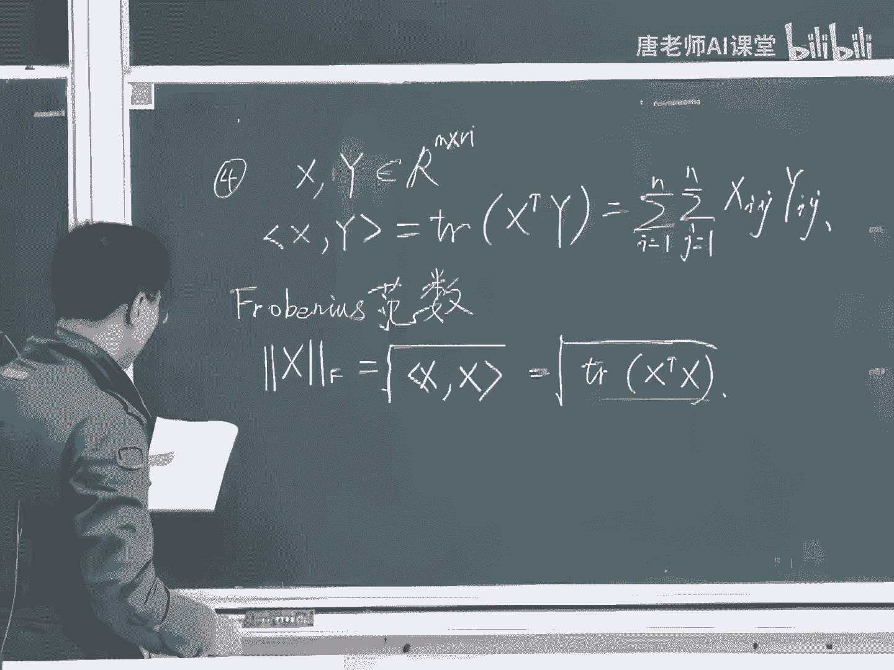

F函数，实际上就是对这个矩阵的，每一个元素的那个啊平方。

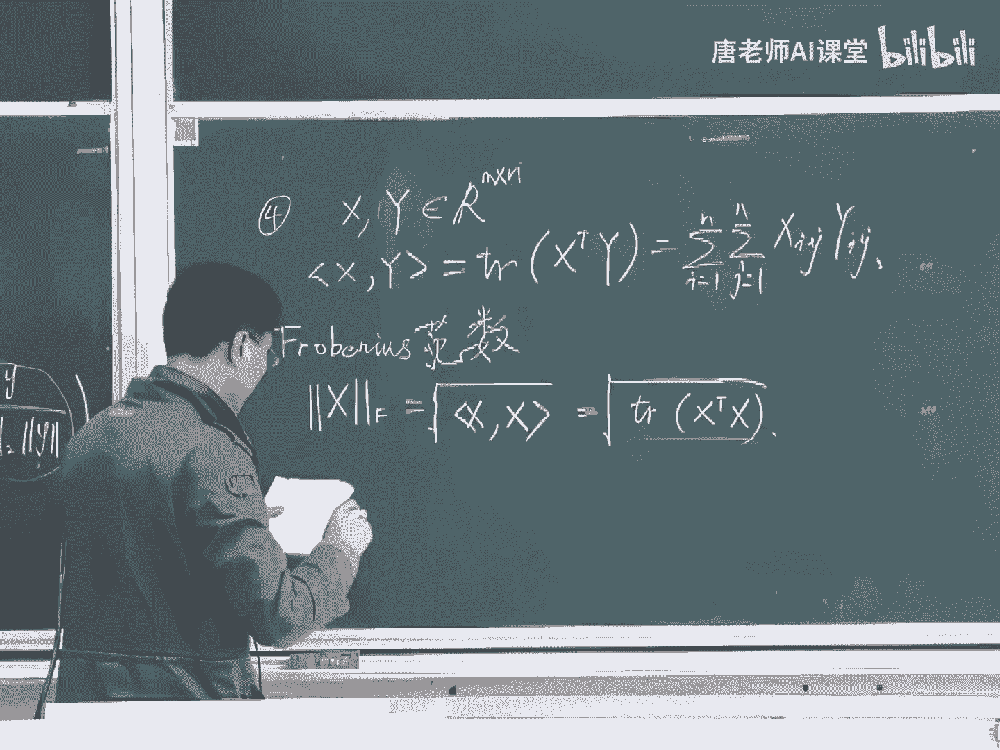

然后求和，然后再开根，实际上表达就这么一个意思，所以你看他这里是这样的，你把Y换成X，它就是每个元素的平方对吧，然后再开一个根，它就类似那种限量的二范数，那就是限量的二分数，那就是啊每个元素之和。

然后啊每个元素平方求和。

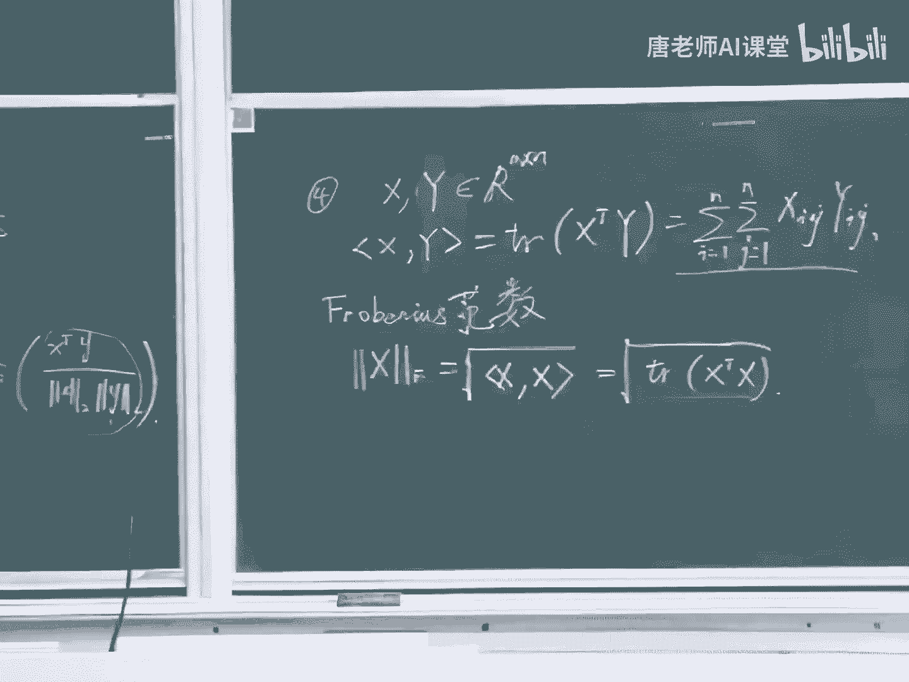

然后才开根，唱完还没抄完啊，这个反正这个就柯西十字不等式吧。

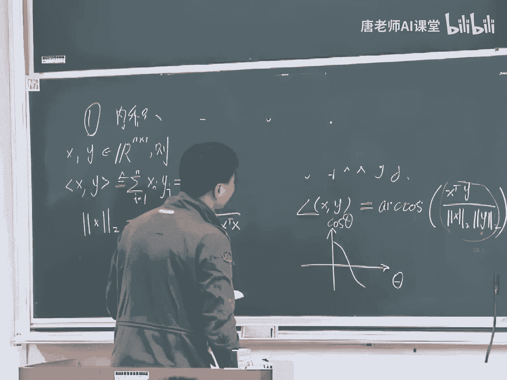

就大概随便抄一下吧，那能换一个团是吧，然后讲一下普通的范数的那个定义，假设先第一个映射，范数实际上就是一个函数，它实际上就是定义在RN，这个就是比如说你是向量的范数的话。

那它相当于就是一个多变量的那个函数对吧，它的那个自变量是N维的，然后那个因变量是一个实数空间上的，然后这个范数的话，它就必须范范数，它就至少应该满足三条规则，大家以前肯定学过了，首先就是那个非负性。

然后第二个就是那个。

注意他这个非负性里面，他还有一个要求就是FX等于零，单简单，X等于零，然后第二个要求就是这叫做正直，其自信就是它具有这样的一个性质，第三个要满足的就是三角不等式，这个大家比较熟悉了。

所以范数就应该必须要满足这三条性质。

好接下来再讲讲那个两个向量之间的距离。

X和Y之间的距离，距离呢就可以这样子来，写，啊这个距离的定义，它就是相当于是在那个，以这个内积空间下的距离，比如说你这里啊，这个SYM就是symbol的意思，就是symbol，它可以等于那个可以等于一。

那么就是在这个呃，一范数内积空间下的这个距离的定义，然后也可以等于二，就二范数内积空间下距离的定义就对应的，然后反正你就求一下算数就行了哦，这个是第六个吧，然后第七条是那个讲一下那个什么叫单位球。

啊这个这个C我们不亏。

等于一二，这么巧，我，呃单位球呢就是这这样的一个对一个东西，就说这个向量它是那个N维的，然后假设那个他的某某种内积，它总是小于等于一的，那么它就叫做这种内积空间的单位单位球呃。

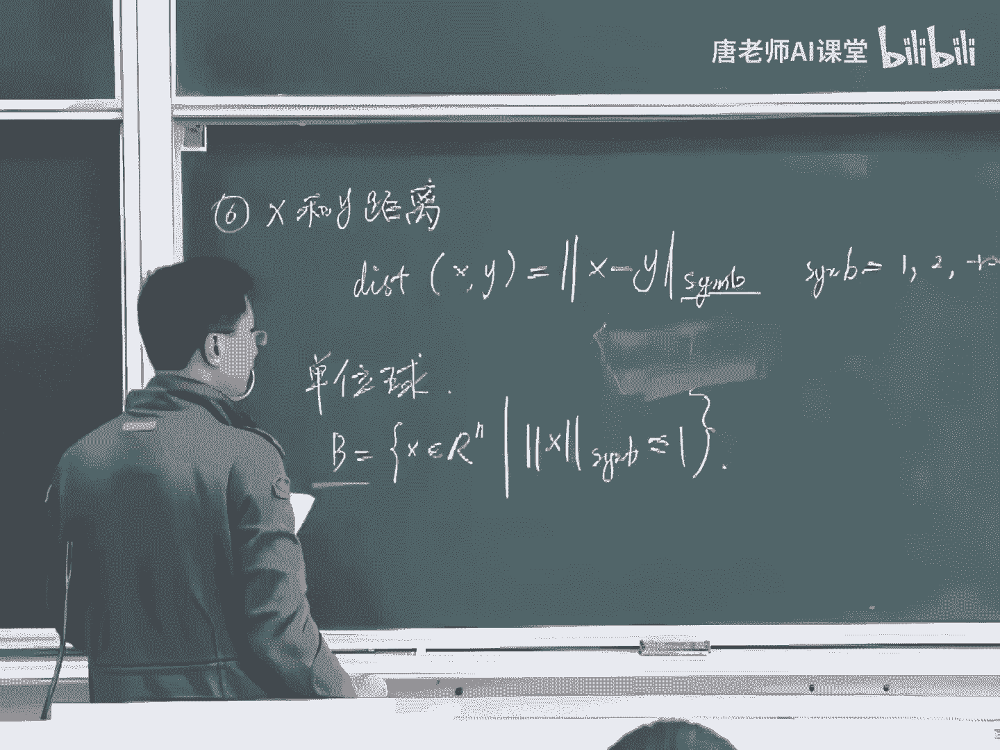

就可以很容易用二范数来想象，那它就是一个，如果三维空间里面就是一个球体对吧，就是单位半径的球体，那就是啊，然后单位球呢它具有以下几个性质啊，就不超了。

就首先他在这个啊，sic symbol这个内置空间内，它它应该是关于原点对称的啊，然后第二个就是单位球肯定是凸的，然后单位球肯定是B的，有界的，而且有那个非空内点集，那么这个还有他还有一个性质。

就是反过来就是满足刚才说的这三条性质。

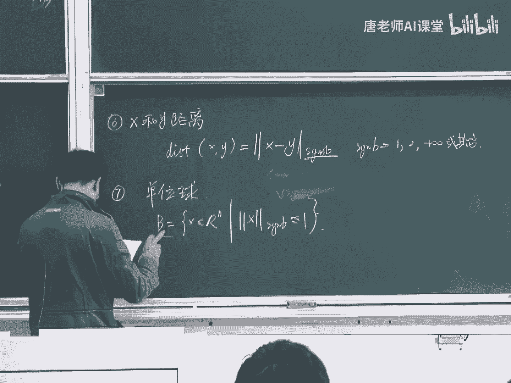

它就他肯定也是单位单位球，就第一个性质就是关于原点对称。

第二个性质就是要要是凸的，Convex，然后第三个的话它就是要是B的。

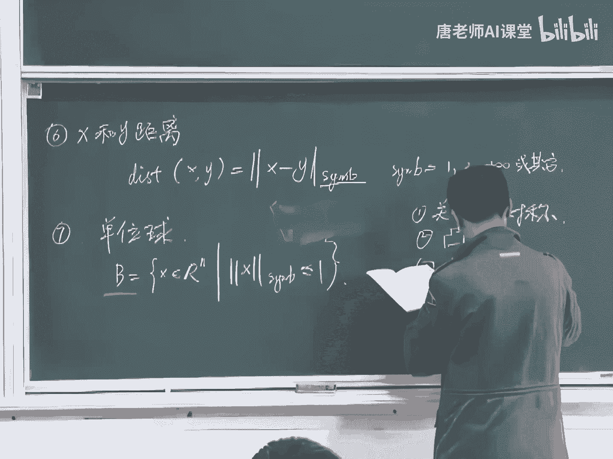

有借的，而且还有那个非空非空内点。

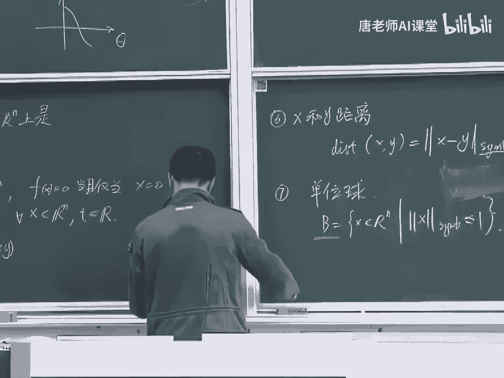

然后这个套，然后下面讲一下那个范数等效等效性，就是说对于对于那个啊，对于有限维空间上的两种范数啊，一个P比如说P范数，还有那个Q范数，那么那么如果存在一个常数C，使得那个存在那个常数C。

使得使得这个X的P范数小于等于C的啊，小于等于C乘上这个X的Q范数，那么我们就说那个P范数要弱于，Q范数反之亦然，那么如果批判数入于Q范数，范数也弱于P范数，那么我们就说这两种方式是等价的，等一下。

啊等一下，就他有这样的一个关系，这个R和法和贝塔都是常数了，那么我就就就说明这个啊批判和那个Q放等价，然后呢那个他已经已经证明了，就是有限维空间上任意两种方式都是等价的，而且他们那个有这样一个关系。

就是这个批判数，就是任意一个范数它都会是另一个范数的，在另一个范数的这个界里面，所以有时候可以用这个啊这样的一个关系式，来估计这个范数的那个那个借，然后后面再，然后再讲一下那个算子范数。

算子范数就是那个也叫做诱导函数。

只为那个ab。

它它所谓诱导范数，它就是说它是由一个那个向量范数，诱导出来的范数，所以就叫做诱诱诱导。

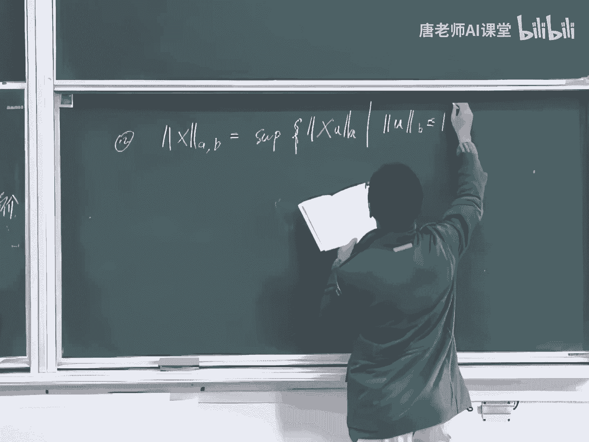

他说那个这个U是一个限量，然后假假设这个限量呢，它的它的B范数它总是要小于等于一的，然后呢一个矩阵矩阵乘上这个U范数，他的那个啊指正乘上这个向量，然后它的A范数它是求这个A方数的上界。

那么这样得到的一个值，我们就叫做这个矩阵矩阵的ab诱导函数，就是就是啊，这个矩阵在BB范数诱导下的A范数，这个关系要弄清楚，就是考虑到考虑到这个范数的正齐次性，那么我们可以把这个东西写成这样的soup。

然后那个我们把这个U的那个模定义为一，然后求这个SP这个东西，也就是说在这个这个啊球面上去找这个，找这个最大值，那么得到的就刚好是X的这个ab范数。

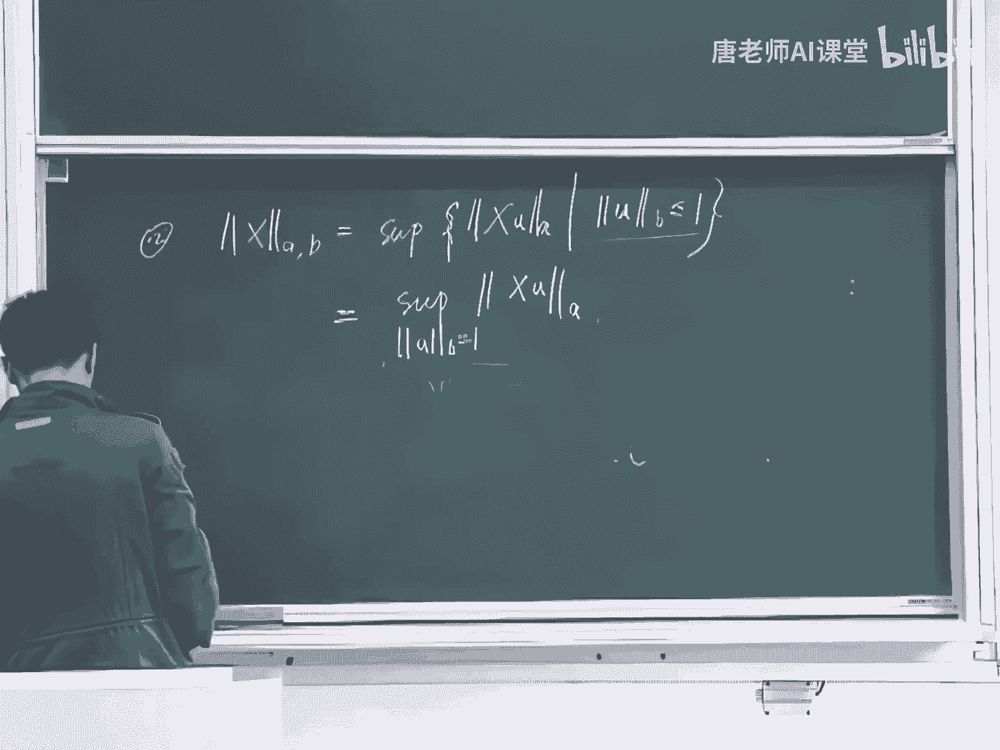

如果AB都是都是那个欧几里得范数，也就是说那个二范数。

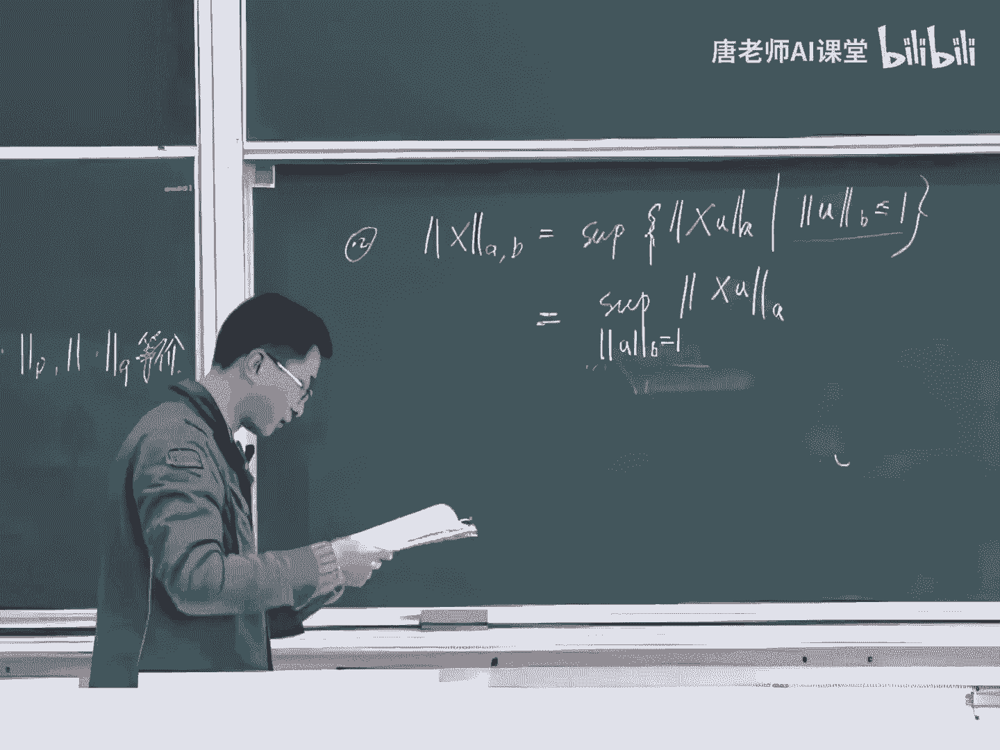

那么这个矩阵范数它就它就是矩阵的二范数啊，矩阵的二范数，实际上这里说的二分数和刚才有区别，刚才说到的那个矩阵，他是那个FBI，一定要区分开FBI是那个元素的平方和，再开根对吧。

然后这个矩阵的二范数它就不一样了，矩阵的二范数也叫做那个矩阵的那个谱范数，叫做spectra，然后那个它实际上是举证的那个最大的奇异值，或者说你把那个你也可以这样算，就是XT乘上X它的那个最大的特征值。

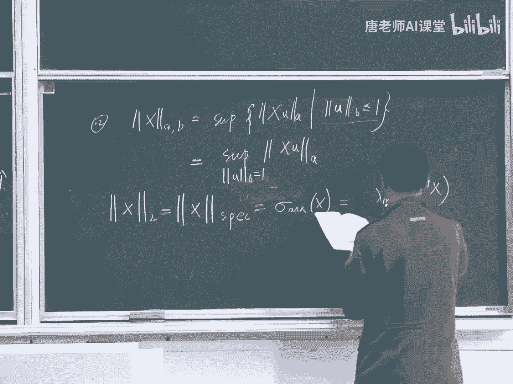

就绝对值最大的特征值呃，然后在那个开个根，再开个根，然后就得到，如果AB都是那个无穷范数呢，那么就是这个A和B都是无穷范数，那么我们就得到了矩阵的那个无穷范数。

矩阵的无穷范数，它应该是那个最大的含的绝对含，就含元素的那个绝对值的和，呃如果AB都是一范数呢，那我们就得到了那个矩阵的一范数，矩阵一范数呢就是最大的那个列绝对和，哦刚才讲的这个矩阵的啊，不是矩阵。

就是这个批判说和Q发说这个等价性，就说他只是说要说明一种，就是啊竖直上的那种借的关系，体现的是范数，就是借的关系，就是说范数用用范数衡量一个东西，它都是等效的，但是和我们优化里面用到的那些。

比如说你极小化二范数和极小化U范一范数，就是啊就不要以为那个不同的方式，你做极小化都会得到一样的结果啊，然后下面再讲一下那个对偶范数。

对我发出，我用这个来这个心来表示，对我看书的定义呢，我写一下，因为这个是求极大值，所以你也可以加一个绝对值在上面，啊，这个其实你可以看作它也是一种诱导范数对吧，他是啊，你把那个嗯对。

你把Z看成一个那个矩阵，它虽然是一个向量，但你看成一个矩阵，那么它就是Z的一种诱导范数对吧，你看啊Z是一个矩阵，然后X是那个向量，这个X也是那边那个U向量，所以这个实际上是可以看作那个诱导范数的。

然后也是我们根据那个其次内急的齐次性，我们就可以把这个写成这样子，SPZ和X的内积。

然后呢就是这个他有个这样的关系吧，然后另外要讲一下，就是这个对偶范数啊，它的对偶范数的对偶范数，它就是原来这个分数就一个范数的对偶范数，然后再求它的对偶范数，然后他就得到原来这个分数了。

那么说一下常见的对偶范数，比如说那个X的二范数，他的那个对偶范数是还是X的二范数，然后X的一份数呢哦不要用Z了，因为刚才定义Z对吧，嗯写错了，一范数呢它的对偶范数是那个无穷范数是吧，这些都是限量。

只有向量范数，实际上呢他有这个关系，就是P范数的都有范数，如果是Q范数，那么只要PQ满足这样的一个关系就行了，就是P分之16分之一等于一，那你算一算，就是二分之1+2分之一等于一对吧。

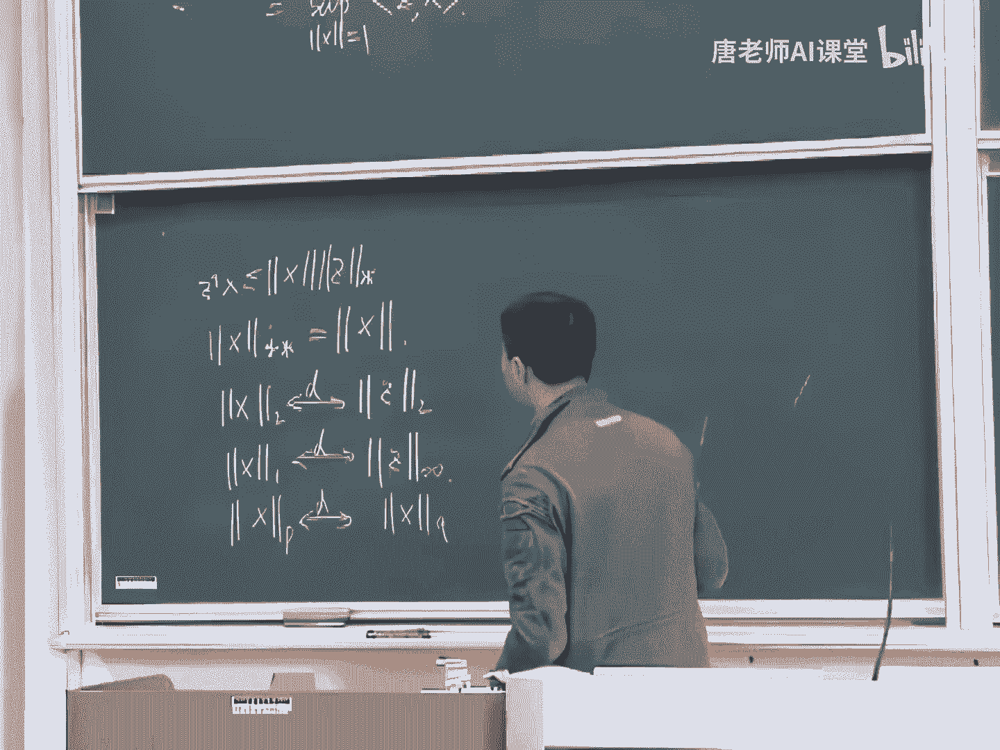

然后1/1再加无穷分之一，就也得到一，然后另外要补充一个就是啊，以后大家可能会遇到的就是这个矩阵的，刚才说的那种谱分数，就是矩阵的诱导二分数，然后它的对偶范数是那个一个叫做nuclear，NM的东西。

我就把它写成NC啊，这个new cnm它就是这个矩阵的那个奇异值之和，对齐之之和，然后他两个是那个互为那个跟这个队友翻书，然后这个就是啊，A点一范数这一块就讲的差不多了。

下面讲一下那个呃一些和线性代数有关的东西，现在解决没有，呃首先来做一些定义了，也是了解一些基础的数学知识，假设一个矩阵它是M乘N维的，那么我们定义一个东西，这个RA它等于那个ax。

然后X在那个N维时速空间内，那么就是说X是一个N维的列向量，然后ax就是这个矩阵乘上这个限量，印到的一个限量对吧，应该是mm行程啊，MMMA的一个列向量，然后由A的这这这个东西你可以想象一下。

它相当于是A1，然后我假如把A表示成这样的列，然后这个是X1XN，那么他刚好应该是得到的，这个结果应该是用A的，每一列的一个线性组合对吧，所以它所以它这个东西也叫做裂空间。

得到的这个东西也就叫做列空间几何，就叫做列空间，然后呢有些地方也叫做这个矩阵的，那个叫那个叫什么，啊你说这样的，叫做直空间吧，然后嗯其实呢这个也可以说成是那个啊，这这这个集合其实也可以说成是A的这些列。

A1A到AN章程的一个子空间的维数的话，它的维数的话就是这个，在rank a小于这个，它的尾数就是这个rank a，Rank a，应该是比那个M和N的最小值都要小的哦，对这个这个有些地方它也叫做象空间。

然后直空间，然后那个列空间很多叫法。

反正大家要了解都是一个东西，他这里用的是range，range这个这个这个说法，然后第二个呢讲一下那个另一个集合，这个集合的定义是这样的，那这个集合的意思就是说啊，这个X也是一个限量了，X属于那个嗯。

那么就是说这个矩阵可以把X任意N维的，啊应该这样说，就是某某一个向量它如果被矩阵A应为零了，那么应为零向量了，那么这个X就在某一个集合里面，这个集合就叫做A的零空间，所谓啊也叫做化零空间。

所以零空间它就是说，这个人空间里面的所有向量，它被这个矩阵A左乘都能得到零对吧，就这意思啊，有些地方它也叫做和空间，就是这个和也叫做核空间，non space或者科，那都可以。

然后呢如果如果要研究一般的东西的话，他这个实际上是从那个一般的那个线性映射，弄过来的，就对一个一般的线性映射，西格玛，他那个从一个V印到V1撇，那么它的这个这个映射就有一个叫做核定义，就是这样的。

这应该是矩阵代数里面就上过了他的那个像，写错了，它的像是这样定义的，那么呃联系到前面的这个一里面的呃，一一里面的这个A可以视为一个映射对吧，矩阵乘上一个啊，你矩阵它其实就是一个算子。

这个算子可以乘上一个向量，然后就得到另一个向量，所以它其实也是一个映射，把一个向量因为另一个向量对吧，然后呢呃它是一个线性函数，或者说是一个线性算子，就这前后两种说法都是呼应的。

那么这个这个像这个和空间，就相当于我们刚才说的这个零空间，然后nars space，然后这个像空间呢，那就相当于那个刚才说的这个range space，快三点了，2。50开始，23分钟。

然后第四个讲一下他在这本书上，它叫做A的A诱导的那个正交分解。

就是A这个指针诱导的正交分解，那么我先记V是一个RN的一个子空间，所谓子空间呢，就是说那个首先啊这个V他要是那个这个N维，N维肯定比他为数大了，N维那个实数空间的一个子集。

然后呢他第二个就是他要对那个加法要封闭，然后另一个对那个树城也要封闭，就是你用一个数去乘它，这个空间里面的一个限量的话，然后或者说一个元素的话，他一定还在这个这个集合里面。

那么向量子空间呢是那个向量空间，在向量加法下的一个子群，他如果学过那个评论什么的，那个同学就应该会懂这方面，那V的那个正交子空间，我就记得这个这个上面写一个垂直号，然后它的定义是这样的，V垂直。

它等于那个，嗯他这样定义的，那么直观理解，就是说这个一个向量它是在V这个里面，那么它来乘上一个另一个向量，然后得到零了，那么他乘的这个向量所属的那个空间，就应该是那个啊正交子空间。

那么和前面那个其实是有联系的，实际上这个指着A的零空间和，和指正A的相空间哦，不是这个AAA的转置，A转置的相空间，它就刚好是正交的，你可以这样这样子去分析这个东西。

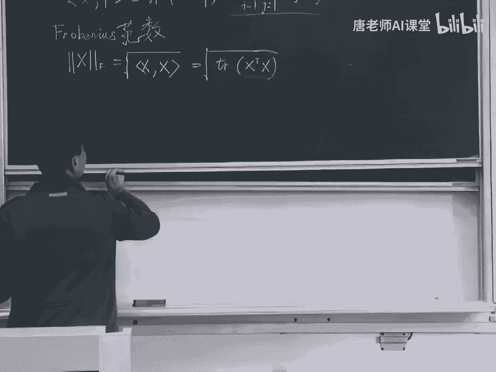

首先ax等于零的话，那么那么A的每一行对吧，A的每一行我这里就写A1到AN，每一行都与X是正交的，对吧啊对我就这样写了，都以X是正交的，对X正交的，那么就说明at a的转置的每一列。

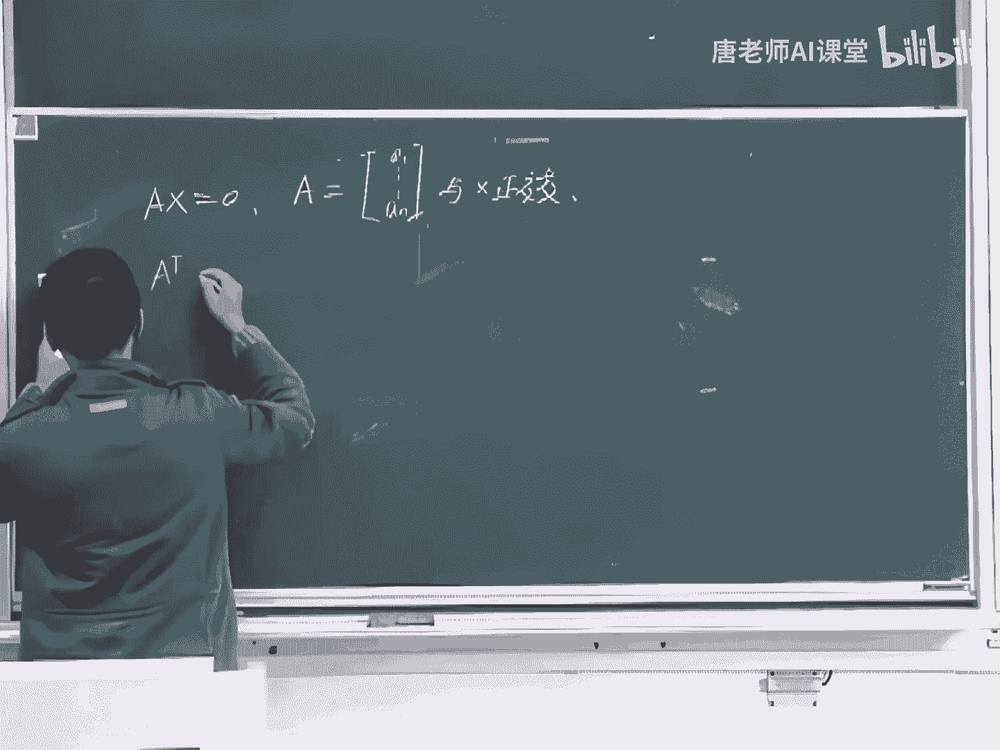

每一列与那个X正交，那么这个NA就是是不是啊，对NA就刚好应该是X的所有所有，所有X的一个集合，这个RRAT就刚好是AT的所有列，AT的所有列的那个线性组合，得到的那个集合，那么你很自然的就可以看到。

就是说这两个集合分别任取两个元素，它们都是乘积都是零，所以就是那个他们就是正交的，然后呃要要说明一个东西，就是所以这两个空间加起来，他是刚好等于那个全空间的，就是N维的实数空间。

然后那么我们就把这个式子称之为，那个AUA矩阵诱导下的，那个对RN维空间的一个正交分解，这个这个叫做直和，在那些书上叫做直和，就说把两个那个正交子空间加起来，或者说那个应该说那个求并集。

呃要说明这个关系是，因为那个其实这两个是没有交集的，他是没有交集的，那么也就是说A的这个补空间它就刚好是R，就刚好是他的那个正交子空间对，就是其中一个的他们的那个补空间，就刚好是他们的正交子空间。

下面讲一下那个特征值分解，特征值分解对哦，讲的是那个对称特征值分解，那么假设一个矩阵A它是属于那个，这里写一个SS表示它是一个对称矩阵的集合，然后NN乘N的那个对称对称对称矩阵集合。

那么它就一定存在那个下面这个分解，啊其中呢这个Q呢，它是那个是N乘N的那个正交正，就说QTQ等于QQT啊，再等于那个对那个单位阵，然后这个兰姆达大拉姆达，它是等于它是它是一个对角阵。

然后刚好这个A的特征值，A的特征值就刚好是这些东西，这个兰姆达一到兰姆达N，那么那个，这个东西就叫那个对称特征值分解，这个分解也叫做谱分解，或者说是也叫做谱分解，那么如果把拉姆达I这个最大的一个。

我只为那个只为那个兰达max a的话，那么兰达，咱们的A就你假设排序最小的那个就是，即为meaning，那么，他下面要写的就是也是这些东西，这些特征值的关系啊，就兰姆达I你把它乘起来。

就刚好得到这个矩阵的那个啊，determinant就是矩阵的那个行列式，然后trace a的话，他也刚好等于这个叫什么，这个这些特征值的求和，然后呢那个矩阵A的谱方数呢。

它就刚好等于那个这个特征值的那个啊，最最大的绝对值是最大的那个特征值，然后他的那个F函数就刚才定义的那个数，就等于这个特征值的平方和，再开根啊。

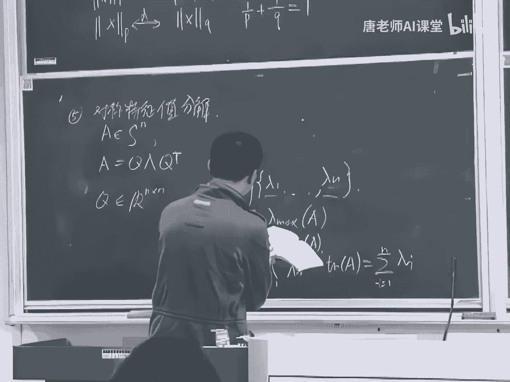

其实这个讲到这个这个普方数，刚才我们那个说过了，这个普遍数实际上是最大的奇异值，那么对于那个对称那个对对称特征值，它有个特点，就是它的那个特征值的那个绝对值，刚好就是他的所有的那个极值。

所以它就有这个式子，就最大的那个特征值的绝对值，然后后面关于这个呃，关于这个广义特征值就不讲了，就大家要是有需要的话再去看吧，然后就提一下那个奇异值分解，其中分解还是刚才这堆定义了，然后那个3A等于二。

那么A这个矩阵的话，一定能够把它分解成这样的一个形式，其中呢这个U是一个U，是一个那个M乘以上二维的这个矩阵，然后UU是那个在指针大叔里面，它是有证，就是说他那个U的那个共轭转置乘上U。

它是等于单位阵的，但是因为我们这里研究的这个A普遍，它都是那个具有那个啊这个A的那个气质分解，它刚好都是能分解成十几帧的，所以我这里就U我就用那个UTU了，然后V也是一样的，V的话就属于那个RN乘R。

然后VTV就等于I，然后这个这个这个西格玛这个大西格玛，他是一个那个它是一个对角阵，对角对角线上的元素呢，它就是称之为这个矩阵的极值，这个其实假设排下去，这个西格玛依最大。

然后西格玛恩最小就是U的U的每一列呢，它就称之为左左奇异向量，V的每列它叫做右奇异向量，它实际上就可以分解成这样的一个写法，这个是R，那么我们可以看到它就是说它可以这个UI。

它是一个列向量VVIT它是一个含向量，然后这个成了以后，它是一个值为一的矩阵，它就是说A可以分解成一系列，质为一的矩阵之和，然后置为R的话，它就是R1个值为一的矩阵之和。

然后ATA呢他就可以写成这样子对吧，这个表明的就是说ATA，它就如果做其质分解的话，他就刚好是这样的一个形式，这个这个ATA的话，它就肯定是一个对称正定对称半正定矩阵。

所以他那个他有这这样的一个形式的分解啊，然后后面要说一下的是，这个奇异值分解和那个特征值分解，它有很重要的关系，在这个这个这个分解里面呢，这个VV12V二它可以是内，它可以是使得这个VV12啊。

这这个正交的任意的限量就行了，那么这个右边呢，它其实它是ATA这个矩阵的特征，就对称特征值分解，因为它是对称矩阵嘛，然后它的非零特征值是它的非零特征值，就是指的这一块，指的这一块是A的奇异值的平方。

你发现吧对吧，相应的特征值特征向量就是A的，右奇异向量就是这个，所以那个其实那个特征值分解和其值分解，是有联系的，然后那个再给大家讲一下，简单的讲一下那个那个条件数这个东西，假设我们有一个方程。

一个线性方程组ax等于B，那么其实条件数是什么意思呢，条件数就是说但假如X未知数A呢是一个矩阵，B是一个向量，就相当于我要衡量当这个B发生呃，发生那个发生扰动或者A发生扰动的时候，对X的影响有多大啊。

对X影响放大的程度有多大，所以所以这个就是A的那个条件数的这个意义，那么就是说你你去推一下，如果如果A假设加上一个射动量来A，然后X加上德尔塔X等于那个B的话，那么你就可以推出这样的一个关系式来。

这个德塔X就表示对应的动量了，那这个就是A发生扰动的相对误差对吧，这个就是X发生的对应的射动的这个相对误差，那么放大的这个倍数就是这个东西，然后对于那个你去推一下也是可以推出来的。

就是假设那个有这样的一个手动关系，那么你最后就会推到这样的一个关系式，所以说你会发现放大倍数还是这个东西，然后所以我们现在就把这个东西看的这个A，的条件数定义成这个东西，定义成。

A的分数再乘上A的逆的方式，他衡量者就是说啊，当那个但这个A或者B发生的发生扰动后，X上产生动的那个放大程度，通常呢这个啊这个东西都都可以这样算，就是用最大的奇异值，A的最大值除以最小奇异值。

那个应该是在啊二范数一以下的一个对普，就普范数矩阵的谱半数以下的一个啊，一个那个看的，暂时还有5分钟，那么假设刚才那个讲过SVD了，就是奇异值分解，Single value decomposition。

它可以表示成这样子，那么A的伟力就被定义成这样子了，维西格玛加密UT对他是一个假设，A的值为R对吧，然后A是那个等于那个M乘N的，然后它的秩是rank a等于R，那么这个西格玛他就是R乘R的，是可逆的。

因为是对角线元素都都为正嘛对吧，所以他就肯定的，所以A的逆就是这样定义，那么这里要说明一些简化一点的表示，就是说比如说如果假设rank a等于N，就是假设A是M行N列的，对等于A就是说它满劣质。

A是满劣质的，那么A的尾逆，它就刚好等于那个ATA的逆乘上，AT这个东西，大家如果学过最小二乘的话，就会知道假设Y等于ax对吧，求它的那个叫什么啊，求它的最小二乘解，那么就是说就相当于是求它的那个。

他的那个叫做法方程的那个解，就是说你可以乘上一个T它的法方程是这样的，ATA然后A是列满秩的话，这个就是满值的对吧，然后你就可以变成这个ATA的逆，然后乘上ATY，这个就是X，那个ATY乘上ATA。

再乘等于ATA乘上X那个称之为法方程，如果感兴趣的可以去看一下那个数值计算方法，然后假设A是那个A是那个含马字的，就是它是制为M的，那么A的那个尾翼就定义成这样的，这个也是有推导的，你们就自己推导一下。

然后他这个这本书给出了一些实例，就比如说在A是一个啊列不满质的，就是说比如说它是一个扁的矩阵，就是说函数小于列数的矩阵，那么它可能就是说就可以通过违例，就可以求得一个那个在二。

在二范数正则化的意义下的一个最小成绩，然后他还给了一个这个，呃，还给了一个那个注意规划的例子，这个就不讲了吧，然后然后后面这部分叫做sure compliment，呃，说complement。

我就简单的写一下他的这个提一下。

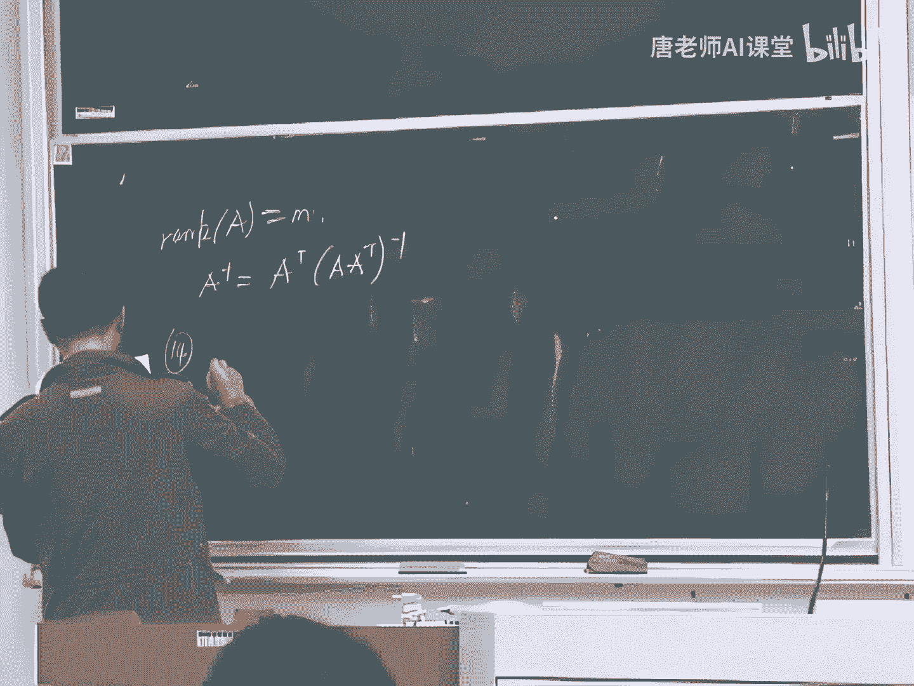

他这个是complement，主要是用于这个可能矩阵分块计算方面，可以用，就是KK为的那个K乘K的那个对称矩阵，然后如果这个A是那个非奇迹的，那么S就可以等于这个C减定一个S。

它就等于这个C减b t a need，比这个东西它被称之为啊，被称之为那个A的那个在X上的这个sure，Compliment，这个它在很多方面都有用，比如说那个有这样的一个关系。

然后他可能这个东西还可以用于，那个分块的矩阵的求逆，它比如说这这个大矩阵它的逆可以表逆的话，它就可以表示成通过这个方法，它就可以表示成这里一块分块的去计算，它主要是用于矩阵分块计算的，然后下节课再我。

我再先提一下这个举证分解的内容，然后就另一个助教再讲。

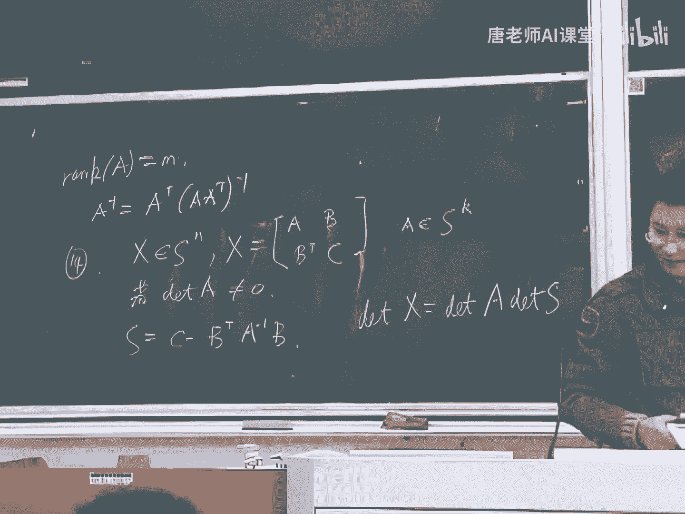

这样的一个形式，其中的这个P它是一个叫做置换矩阵，叫做置换矩阵，所以那个置还是喜欢，所以置换矩阵的话就是说他可以把，呃寒和寒交换，就你你用P乘上一个矩阵，它可以使得出来的这个矩阵的行。

相对于原来那个矩阵的含做了交换，或者列做了交换，就这样一个意思啊，这个矩阵特点就是说它是每一行和每一列都有，且仅有一个一，其他的都是零，那么如果你你用这个矩阵去左乘左乘的话。

左乘另一个矩阵的话，那么它就相当于在DJ这个地方出那个一，就是P假设pg是等于一的，那么他就表示把那个矩阵，假设你做一个pa等于B，那么B相对于A怎么变化，就是说他那个把DJ行移到了第I行。

如果你去右乘一个矩阵，右乘一个矩阵，然后那个的话他的假设PJ等于一，那么它就相当于把DJ第I列移到了DJ列，对你左乘的话，就现在左乘的话就是DI含遇到了DJ还，右侧的话，这这这，右乘A右乘的话。

就相当于把那个第I列移到了第J列，然后这个只是一个排列矩阵了，其实他不一定要要的，就是说它主要要反映的意思，就是说A这个矩阵可以做一个LU分解，AU分解，就是说那个也叫做独立头分解，你们可以去查一下。

然后这个很多人可能都学过了多里头，然后其中的这个L为一个下三角矩阵，L是下三角的，然后U呢哦哦L不只是下三角的，L是那个单位下三角的，然后U呢是一个上三角的，所以单位下三角。

就是说它的对角线元素上全都是那个，全都是一对对角线元素全都是一呃，具体那个这个是怎么分解的，我就不讲了，因为这个是那个计算方法的内容，你们感兴趣可以去查计算方法的书，啊这个多里头分解的那个时间复杂度。

大概也不是时间复杂度，就是它需要计算的这个乘法的步数，大大概是这样的一个量级，然后呢如果A是有结构的，比如说他如果是那个稀疏的，或者说是那个叫什么啊，条形矩阵，就是说条形矩阵，就是说他他那个带转矩阵。

或者说他那些元素都在这部分，这部分都为零了，这叫条形矩阵，或者说稀疏的就元素比较少，非零元素比较少，这个稀疏矩阵的话，它就做的可以更快一些，有一些办法加速，然后另另外一些书上它记录这个时间复杂度。

他说这个他是这样的一个复杂动物，具体可能那个它的一些细节地方不一样吧，然后你们就自己看一下吧，然后他他这种方法本质上和那个高斯消元法，是本质上是相，可以说是相同的，利用这个东西呢，比如说我可以举个例子。

他可以做一个矩阵求逆，比如说ax i属于bi对吧，然后呢I等于一，假设我要求A的逆，那么我就构造一个这样的方程，然后假设有N个方程，我就写成ax等于B，其中B呢就是这些bi的列组成的一个矩阵。

然后xi也是对应的组成一个矩阵，然后呢假设我令B等于单位正，那么你分分列的去计算，就是你还是每次解决这样的一个方程组，然后呢你最后就可以求得X了对吧，X因为ax等于I，所以所以的话X就是A的逆，对不对。

然后就这个是只是一个应用嘛，那么如果是这样的话，呃，它的时间复杂度的话，就是做这样的一个应用，它的时间复杂度应该是等于那个2/3，N的三次方，再加上二倍N乘N的平方，等于83那个N3方。

这这这里有做做了N个这样的工作，然后但是前面有一部分有些工作是一样的，所以这一部分不变，所以它的时间复杂度就比较小，这个和那个高斯消元法求求得的，那个来做矩阵求逆，那是不是高斯消元法呃，好像对。

就是高斯消元法求矩阵能力，其实那个效率差不多了，都是在N3番这个量级上，然后另一种的话嗯，另一种叫做库兰分解，这个其实和这个LU分解或者多头分解，是一样的，他无非是那个啊U是单位上三角阵。

然后那个L是下三角阵，其实做法其实几乎完全一样，所以就不讲了，我再讲一下那个叫ROY分解，分解的话，他的意思就是说，这个A是N乘N的，然后呢是一个正定阵，那么它肯定有就有这个分解。

它可以分解成L乘上LT这样的一个形式，其中呢这个L是那个是对角线元素为正，就是这个这个表示dig diagonal，它是就求这个矩阵L的那个对角线，对角线元素，第二个对角线元素都是啊大于零的对。

但是对称正定的，所以正定的就一定是那个非奇迹的对吧，因为它的所有特征值都是正的，然后所以那个这个他一定能分解成这样的，一个样子，这个L它是一个对角线元素为正的，一个下三角矩阵，L他就有这样的一个东西。

而且而且L是由A唯一确定的，并且他叫这个L称之为ROLEY因子，然后没有结构的时候，如果A是没有结果的时候，计算量大概是三分之1N3番，然后是LU分解的12，那么ROLK分解呢。

它可以用于也是刚才我举个例子，就是说求这个线性方程组，如果A是那个对称正定阵的时候，就可以用这个车LK分解了，为什么要单独说A是对称正定，正因为很多一般的方程你都是ax等于B对吧。

然后经常那个反方程就是ATA，X等于那个ATB，然后这个ATA如果A是满劣质的话，这个ATA就一定是满质的，而且是对称的，所以是对称正定的对吧，所以你就可以用来分解来做，然后再讲一下那个。

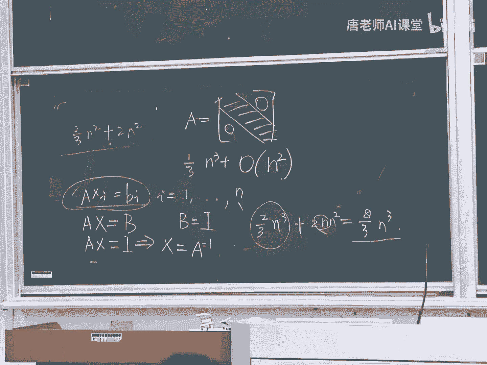

然后再讲一下那个LDLT分解，RDLT分解，这个东西呢就是说非歧义的，也是说非歧义的，对称矩阵A它可以被分解成这个PLD，P就是刚才那个置换矩阵，刚才已经说过，置换矩阵的作用是交换行和列。

其实啊你也可以去掉，不看这个P，反正他就是这样的，就说LDLT分解对，然后L呢是那个正正对角线元素，也是正的对角线元素的那个下三角，下三角正，然后D呢它是分块对角矩阵，第一为分块对角矩阵。

分块对角的分块对角的呢，他就是说他其实是这样的一个样子，比如说啊D对吧，然后这里呢他就是一个2×2的，然后D12啊，不是这个就是比如说第三第四次了，然后这里是一块儿，这里可能还有一块。

它的每一块呢要么是1×1的，要么是2×2的，他其实原因是这样的，因为这个啊对称阵它的A它是不一定，它这个分解总是，就假设你要强制定为D为对角阵的话，那么你要做这样的分解。

你肯定会分解出来这个D是这个对角阵，是一个那个呃，我想想对它的最小线元素肯定有负数，如果你要做那个十分解的话，这个D就很就很有可能他有，他有这样一个块，如果他的那个A的那个特征值有负数的话。

它就会分解出来这个结果，然后说一下，就这个分解的那个时间复杂度是1/3，N3分，然后也是也是一样的，就做这些分解的时候。

有这种结构，或者说是稀疏的矩阵，它都可以带来那个加速的啊，这这些分解可能很多地方用到，所以就提一下，谢谢大家。

