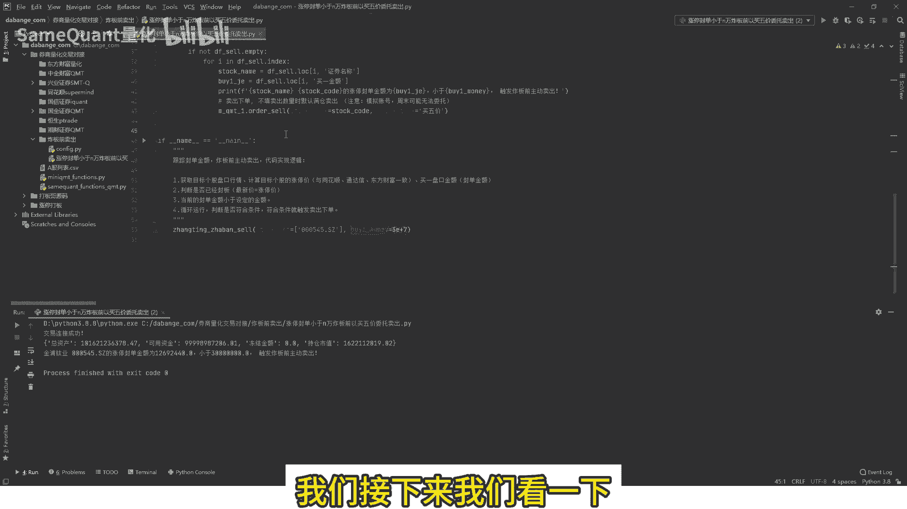
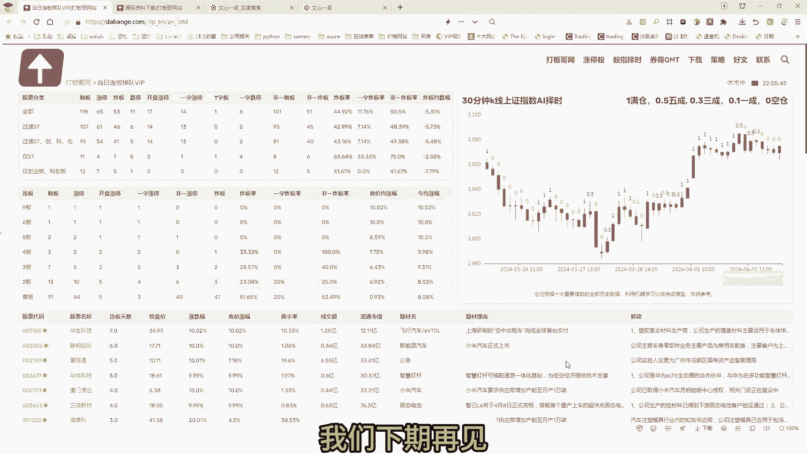

# 【涨停炸板前自动卖出策略源码】券商QMT、ptrade、东方财富、同花顺自动交易，不懂python也能用 - P1 - SameQuant量化 - BV1LA4m1w73B

大家好，我是打板哥，前段时间为一个券商QMP客户，写了一个炸板前卖出策略，今天呢开源出来源码下载地址，我会放在视频的结尾，他这个策略其实非常简单，就是首先跟踪他的持仓票是否触发涨停。

出发涨停之后循环跟踪它的一个分担金额，当中单金额小于它的设定值，比如说3000万或者2000万后，也就是即将占满前立即主动卖出，这个是一个q mt的啊，模拟演示环境，我们封装了几个功能包啊。

包括QMT的查资金，持仓啊，下单撤单等等啊，一些方法，所以说如果说你虽然不懂Python，但是没有关系啊，这个策略你完全也可以用，因为你有了这个源码之后，你只需要在CONFIG里面。

设置你的这个资金账号和密码，然后呢仅仅是这五行代码啊就可以了，好然后我们先运行一下，看一下这个账号是否登录成功啊，这个是模拟账号，运行一下，看一下是否能够获取到他的一个资产信息，好。

我们可以看到这个已经获取到的一个，总资产信息了啊，可用资金这些都有了，然后呢接下来我们来查看一下它的，获取一下用户的一些持仓列表，好，这个持仓信息已经获取到了，接下来这个就是我们的一个炸板前。

卖出了一个主函数了，那要实现了这个这个函数啊，还有以下作用的事物，第一步你要兼顾后的股票，首先你要获取到这些个股的盘口行情，盘口行情就包含了他的最新价，涨停价，跌停价，买一到买五的价格。

以及他的买一到卖五的一个委托的数量，同时你获取到行情价之后，如果说函数里面它本身它没有涨停价，那么你就涉及到另外一个问题，第二计算目标个股的涨停价啊，这个涨停价你必须要同花顺通达信。

东方财富要一一模一样，就是一分钱都不能差才可以，所以说这个计算个股的精准，计算个股的涨停价啊，这个你这个是很重要，当然我们这个已经分好了功能包，功能里面你直接调就可以了，然后对吧。

你就可以计算出买一盘口的金额了，买一盘口的金额，主要是等于买一辆乘以买一的价格，就是买一盘古，也就是分担金额，给这个函数传来一堆的这个个股的一些代码，但是并不是所有的股票都涨停了。

所以说你还要判断是哪些股票涨停了，所以说你要判断它是否已经封板，那封板的一个标准，就是说它的最新价等于涨停价对吧，那你必须要保证说它涨停，它涨停了，然后他的进金额减少到我设定的金额以下了，我才卖出。

你不能说啊，我还都还没有涨停了，你就触发卖出，这就会产生一个bug啊，程序里面叫bug就是不行，所以说条件必须要精准，三个，你需要判断他当前的封单金额，要小于设定的金额。

如果是当前分的金额还大于设定的金额，那肯定你肯定就没必要卖出对吧，有可能一直封到收盘对吧，次他再来一个高开，再来一个冲高，或者再来一个直接一字板都有可能，所以说第三个条件很重要啊，不能错。

第四就说你上面这些条件用代码写好之后，接下来就是循环的去获取行情，去刷新上面的条件，看下是否符合，如果不符合，啥都不操作，如果符合条件就触发下单好，接下来我们就找一个标题，就是让八让他去符合。

看一下它是否会触发下单啊，我们已经提前找好了，就这个啊，我们直接在行情软件里面打开这个，你看一下这个是呃，他已经是涨停了，然后他目前的封单金额是1269万，好，我们就设定一个设定一个封单金额。

一个值这个值你自己设定啊，你自己改，我们就剩2000万对吧，他小于2000万，我就出发卖书哈，就说用这个标题来说，它目前就触发了什么，就触发了条件好，我们运行一下。

看一下它是否会触发一个炸板卖出的一个提示，啊你看这里已经触发提示了啊，触发炸满前主动卖出好，那么我们改现在是2000万，我们改成1000万是吧，改成1000万，毫无疑问，从逻辑上来讲对吧。

你这个1269万还高于1000万嘛，就是还没有触发我们的条件，他肯定就不会触发这个卖出好，我们运行一下好，这个已经运行结束了，但是他并没有像上一次那样触发，我们说一个卖出一个提示，因为他条件不符合。

我们在条件再改回来啊，甚至你可以改到对吧，3000万只要大于1200万是吧，他都会触发这个下单提示，这个触发现问题就在这啊，如果说你有持仓的话，就把这个持仓对应到在这个用QMT，我们封装了一个卖出下单。

你就在这啊，你这个把这个注释掉，然后这个它就可以自动运行了，然后盘中就循环运行起来就OK了，逻辑就讲解清楚了，源码啊就在这里，你看比如说这个就是获取它的一个实时的，一个啊全推的一个盘口行情。

我们来看一下这个行情有哪些字段，我们可以看一下啊，这就是它的实时的行情，你看最新价2。65，我们对照这个行情软件是不是2。65啊，没有没有毛病吧对吧，它的涨零价2。65啊，完全一致。

然后他的买一买一价2。65，因为涨停价就买一价嘛，他的买一辆是多少呢，是47896手，看下这是不是切换转换成so对吧，是不是47896啊，跟这个行情软件里面一模一样啊，这就是这就是这个第一步。

这里面第一步啊，获取这个目标盘口行情，然后计算涨跌价，当然这个这个计算涨跌停价这里已经计算了，所以我们就不需要额外的计算了，这个就是说计算过了，那么第二个条件就是我们可以看一下对吧啊，他是否已经封板。

他是否已经封板，毫无疑问你最新价你等于涨停价，它就是已经封板了一个状态是吧，然后呢这个满意金额，这个满意金额就是通过这个满意价乘以，买一辆啊，再乘以100，因为它是首要乘100得出来啊。

然后这个它符合条件之后就会进行下单啊，就是其实就是这么简单，如果说啊你那有人说啊，我不会Python，我不会写代码，这个没有关系啊，其实你只要会经常会熟练使用电脑就可以了，因为你有了这些源码之后。

开通KMT或者什么PC的，或者是东财的量化，或者同花顺的量化哦，当然不同的量化可能会封装的包子不一样啊，就今天我们演示是k mt的，首先你把这QNP登录账号，密码放在这个CONFIG里面去。

就有两个地方你一填填完了之后对吧，把我们这个源码你下载下来，然后本机安装一个Python环境，我们都是有指导的一个教程的，所以说你不需要啊懂Python，你只要操作熟练电脑。

那么这个这个涨停炸板的这个功能的包啊，你就可以使用了，而我们接下来我们看一下。

我们把这个源码放在一个什么地方呢，打开我们的打榜歌网啊，现在我改名了，改名叫打板哥，然后这里呢这个网站里面这里有一个下载，然后再有一个源码资料下载，源码资料里下载，这里面有很多这个mi k m d。

大KMD交易的一些事例源码啊，然后我们今天讲的就在这跟踪封单金额，涨停炸板前卖出，你就点这个立即下载啊，点一下这个立即下载啊，这个文件就下载下来了，然后你就下载到本机，表示一下就OK了好了。

本期的分享就到这里。

