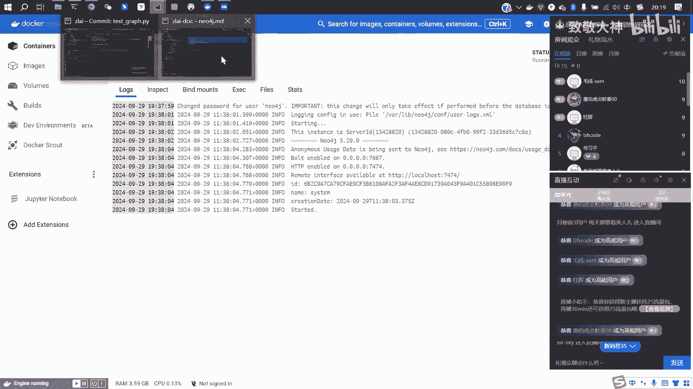
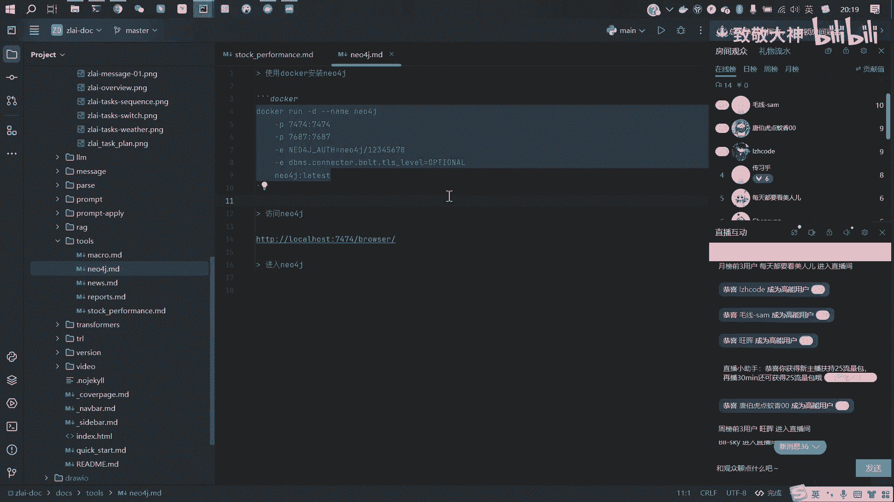
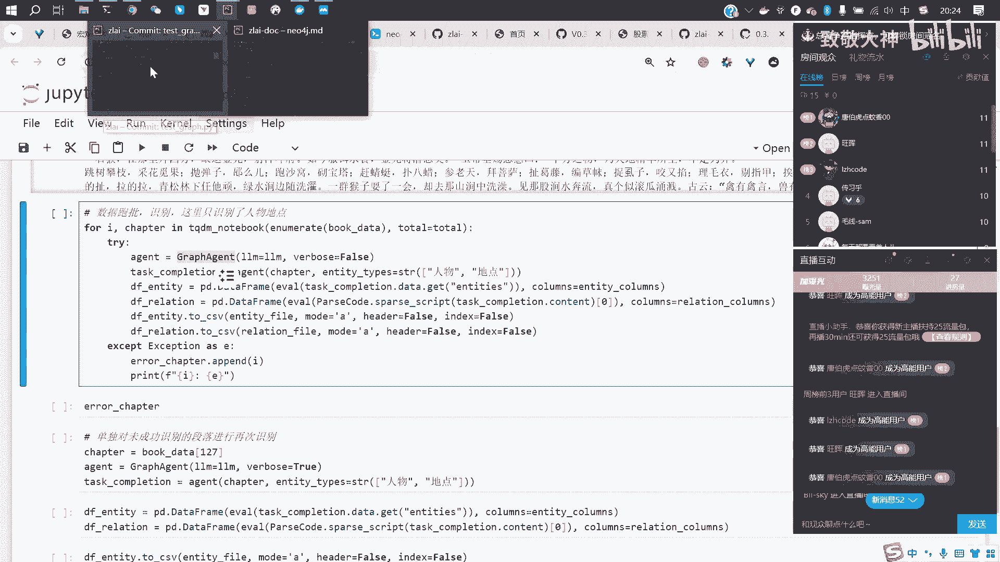
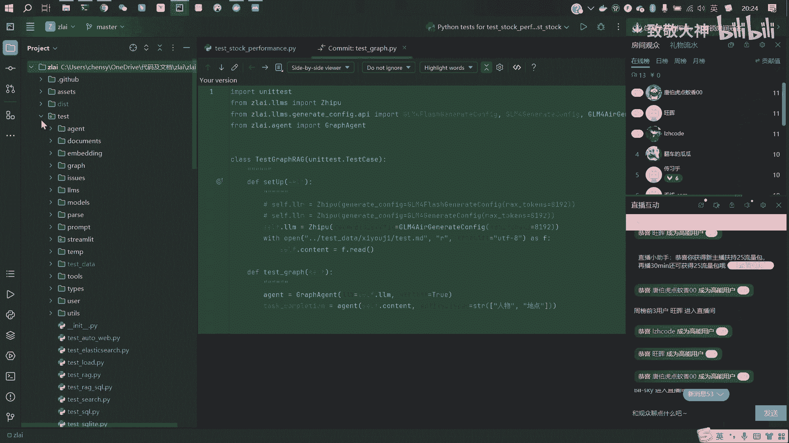
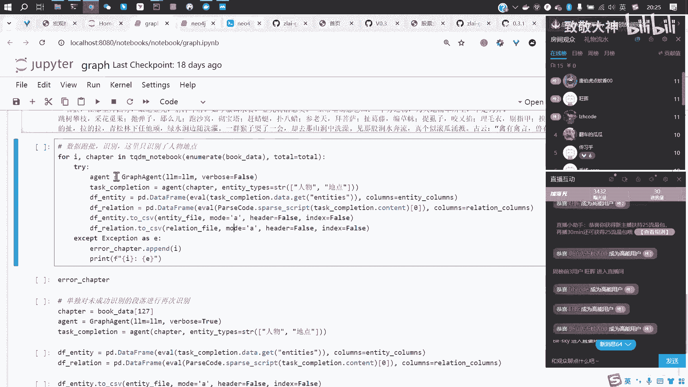
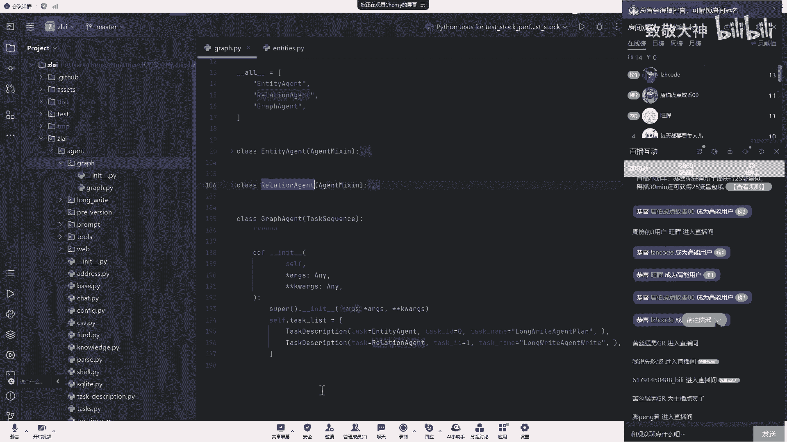
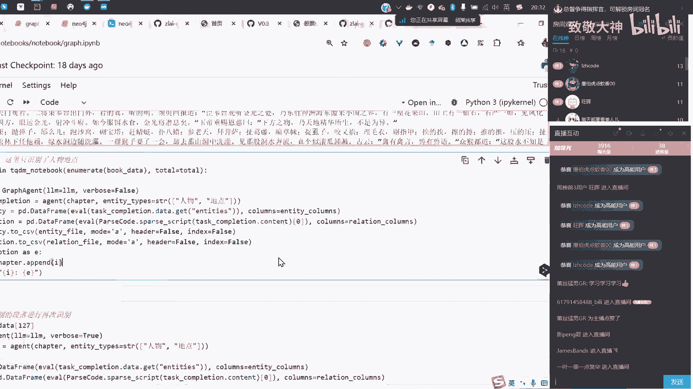
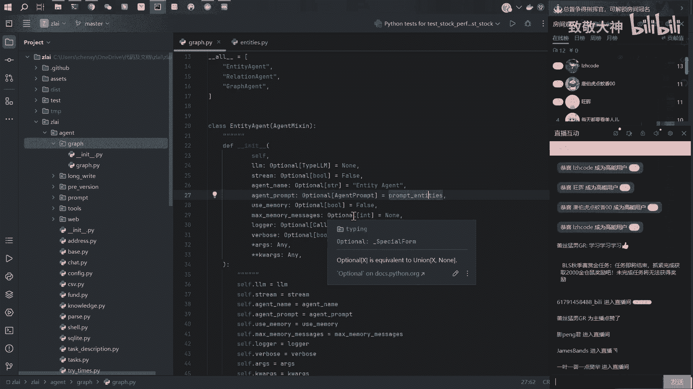
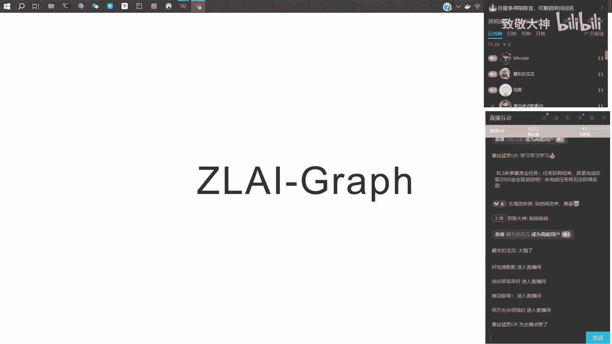

# 【直播回放】Zlai大模型知识图谱联网与金融量化应用 - P3：03_大模型自动抽取知识图谱 - 致敬大神 - BV1bZxyeAEjB

这个录下来录下来，我们就开始下一个环节嗯，下一个环节就是这个graph，就是嗯就是用大模型做一些知识，图谱方面的一些工作，然后这一方面的话，前段时间比较火的是那个什么啊graph graph嗯。

那个叫什么来着，我给忘了，graph i g就是通过嗯你比如说你有一篇文章，这篇文章比较长，可能是一本书，然后你希望模型能够根据这本书，然后给你一些呃专业性的一些一些回答，那么当你给给模型这本书的时候。

模型会把这本书给拆解成一个，巨大的一个知识图谱，然后嗯这样知识图谱呢，它其实是可以把整本书里的各种知识点，全都以一个网络的结构存下来，那它其实就这个网络的结构就贯穿了，就是嗯整本书的前前后后。

也就不再局限于传统的那个呃，IG只是做一个啊一一段文章的一个切片，那这样他嗯可以依靠这个知识图谱的方式，去穿透整本书的各个章节，然后依靠知识图谱的这些信息呢，再去给你一个总结性的回答。

嗯那么它往往可能会有一个这个更为准确，或或者说呃更为综合的一个一个一个回答，他比那个呃只是简单的去做切片的那种IG的，它会嗯拥有的这个知识呃会不会更全一点，那么这个就是我最近前段时间吧。

上个月或者上上上个月，就是graph i g的一个一个思路，但是我们这个地方我们做了一个小的项目，这个项目只是说我把西游记呃解析成了这个，比如说解析成了一个一个的节点，比如说呃他的啊这个人物有哪些。

然后他的地点有哪些，然后嗯可能还有一些物品，但是这里没有展示啊，然后这个是节点的一个一个展示，然后还有节点的一个描述，就是说呃美猴王这个是个什么人，然后他有一些什么样的一些特点。

然后这个是节点的一个展示，然后还有关系，就是有了节点之后，肯定还有各种节点的之间的一些关系，就比如说人物和人物之间，他肯定是有某种关联的嘛，然后就比如说啊，下面就是用大模型提取了，这本书里面的一些关系。

就比如说嗯美猴王和这个花果山，水帘洞是一种什么关系啊，居所关系，然后下面的话会有一个strength，就是这种关系的一个强弱的一个程度呃，大概是0~10分，十分的话是最高。

然后他会把原文里的内容去做一个总结，就比如说呃美猴王的居所是花果山水帘洞，它们之间的关系是居所与地点的关系，那么呃大模型就总结出来了这样的一个人物呃，人物地点，然后嗯物品的一个一个关系网络。

然后这个是下面是这个这个关系的一个，一个截图，然后下面下面是，你可以用这个呃这个一些查询的语句，然后去查一些特定的一些一些关系网络，然后这个是项目文件的一个一个展示，然后这个项目文件。

大家可以从从这个这个地址去去下载，然后这个data里面是原始数据，然后西游记MD这个是啊，这个是那个原文，就是就是西游记的101章的一个原文，然后嗯这个ENTERDAY这个是这个提取的节点。

relation是提取的这个关系，大家用这个V1版本的就OK了，然后这个没有加V1的这个版本，可能效果会比较差一点嗯，然后下面会有一个notebook，这里这个notebook的话其实是两个文件。

然后看一下嗯，第一个文件的话是一个提取这个，实体关系的一个文件，然后第二个文件的话是把这些实体关系去转到，new fog里的，嗯一一个过程啊，neo fog就是这样的一个啊，就是就是一个关系型数据库。

然后你可以把啊你你你你的一些实体关系呃，存储到这个这个new fog这个数据库里面，然后就这个地方的话，你可以去呃去写一些查询的语句，然后去查某些实体或者是关系，就比如说这里有让他返回250个节点。

那么他这里就返回了250个，还有实体关系，然后这个呃粉色的这个一般都是人物，然后蓝色的这个是是这个额地点，然后还有极少量的这种物体物物品啊，比较少量的一些物品，然后这里还可以选一些关系。

就比如说这里什么临时住所，就是说然后点点这个的话就是全量嗯，然后锁定到一个节点上之后，他这右边会会有一个描述，就是你你每一个节点的一个描述，然后点到这个关系上，他会有这个关系的一个描述。

这个是neo fog的一个基本的一个，一个展示的一个功能嗯，然后这个neo fog是这个呃，自己电脑上这个docker去去启动的，然后这个启动的命令嗯。

是是这个命令，这个这个命令是在那个文档里应该是有的，就是在这个文档里应该是有的，大家可以用这个命令去去起一个简单的一个。

一个new for g，然后用我们的这个已经提取好的，这个这个数据可以导进去，导进去之后你就可以去观察这些数据，然后下面的话我们简单过一下，就是说嗯这个图谱大概是怎么做出来的哦，放大一点嗯。

第一块的话就是还是导入这些啊，这些就是工具类工具类，然后这里选择一个合适的模型，这里用的是那个gm m4啊，大家可以去看自己的这个需求，去去去选择自己的模型啊。

有flash flash这个版本现在应该来说是免费的，就是如果你用你自己部署的一些模型也是OK的，就比如说你下载自己，下载到自己本地的一些gm嗯，千问啊，或者是deep think什么样的模型。

你你本地部署部署，部署部署一个模型的话也是OK的，然后这里会首先去做一个这个简单的一个，一个数据的读取，就是把这个呃原文去读进来，就比如说这里我先把它分开，这里的data其实就是我们读取的那个。

西游记的原文，我们看一下他大概我这个分隔符，我我直接看一下原文好了好，哦这个就是那个西游记原文嘛，然后这个是这是第一回，然后下面就是第二回，一直到最后是100回，然后然后他他的这个每一个章节的一个分。

那个那个区分点就是啊大概是嗯大概六个分，换行符，就是它每个章节的一个分割点，好看一下它大概有多少张，哦100一张，100一张，是因为他额最前面，这里最前面这里去也也截出来一块，所以一共是101份。

也就是100一个章节嗯，然后嗯下面这里的话嗯，去做了一个段落的一个切分，这里做了一个简单的一个筛选，就是说它呃每一个自然段呃，必须得大于128个字，我才认为它可能有这个比较重要的一些人物啊，地点啊。

以及他们的一些关系的出现，如果说他这一段话额就小于128，那可能就是一次简单的简单的一个对话，或者是一句诗句，嗯那么这样的段落的话，短的一些句子就被过滤掉了，然后这里会有一个办事的一个动作。

就是我每一次去读取的这个呃文章的长度，既不是一个章回，也不是一个自然段，而是而是五个，这个五个段落为一组，这里可以调整的，这里是可以调整这个段落的这个大小的，这里是按五个段落为一组，然后去去弄的啊。

就比如说我们看一下他的一个，每一个处理的一个批次大概是怎样，OK我这里打印一下，啊这是这个这样的一个551个片段，就是五个啊，五个段落是一个批次，然后他们，那么他整本书呢一共是388个批次。

OK然后这里的话我们额跑了一个这个循环，就是循环它啊，每一个的这样的一个批次，然后这里会用到一个graph agent的一个类，这个类的话我们可以从这个啊，再来这个里面去去直接去看。

然后看一下，我们可以看一下他到这个额，这个graph这个类是怎么写的。

也就是呃整个核心的代码其实就是这两行，就是你只需要呃把你的这个大模型，这个参数用到哪个大模型放在这里，然后把你要处理的时候这个文本放在这里，然后告诉他你要提取哪些东西，这里我只提取人物和地点。

当你实际去去使用，去去用的话，你可以提取人物啊，地点啊，什么什么物品啊，嗯还有什么法宝呀，坐骑呀都是可以提取的，那你只需要去在这里去增加你想提取的那些呃，实体的一些一些概要就OK了。

下面的这几这些代码都是呃，把它存到一个excel表里面，然后去做一个保存，然后这个excel表的话，其实就是这个这是那个节点的一个一个表，然后下面的话是这个关系的一个表，就是就是提取出来的节点和关系。

都会保存在那两张表里面，就核心代码呢就是在这个graph agent的啊。

这里面，那么graph agent我们找一下，看一下他到底写了些什么东西，然后这个关掉，断栏里面这里有个agent的一个一个，一个嗯一个模块，然后它下面有一个这个graph graph，里面会有三个啊。

三个类，这三个类的话嗯分别是这个实体的一个类，然后关系的一个类，还有一个graph的一个类，我们从下往上往上往从下面往上去看啊，然后graph agent他其实是额两个类的一个组合呃。

他先是执行了这个实体的这个agent，然后再去执行这个relation，就关系的这个agent，那么这个就是graph agent的一个流程，它其实就很简单，是两个步骤，第一个步骤呢。

它先去识别你这段文本，里面有哪些人物或者是物品，然后识别好这些实体之后，然后他再去判断这些啊物品这些人物，这些地点到底是什么样的一个关系，然后我们再去看这个实体到底是怎么提取的。

实体的话其实额我们去找一下那个com就OK了，嗯这个是prompt entities，就是就是实体的一个提取ground，然后这里我写了这样的一些内容，就是给你一段文本，然后呃实体的这个类型。

然后然后你需要提取哪些实体，还需要去额提取这个呃啊这个看错了，这个是这个relation的这个rap啊，上面这个是这个实体的这个prompt，就是说给他一段文本。

然后还需要提取出来一个这样的一个list啊，这个list里面包含这个实体的名称，实体的类型以及他对于实体的这个描述，然后上面的话这个entity name，这个type description。

分别是我对这实体名称，实体类型，实体描述的一个定义，然后下面会给它一个它要提取出来，这个数据的一个数据类型，我我希望是一个呃Python，可以直接呃解读的一个这样的一个啊列表啊。

这个list的列列表里面是一个一个的这个元组啊，这原著里有三个对象，分别是名称类型和描述好，下面呢会给他一一个简单的example，就是一个样例，然后我告诉他他要从这里面去提取人物，然后给了他一段话。

然后那么他要输出的内容是是这样的，然后最后呢是呃我们正常跑批的时候，放到这个位置上的这个呃文本，要药材提取的类型以及文本，然后下面就是去做了一个problem的啊。

这个ENTERIS就是这个实体的提取的一个，prompt的模板，那这个模板呢会被放到这个位置，就是放到这个实体提取agent的这个位置，也就是agent prompt这个位置，然后那么呃在这个类里面。

那么它就会自动去调用这这前面的这个模板，这套方法，然后去帮你去把一段文本，整理成这样的一个格式，这是呃这边的逻辑，就是这个呃呃实体agent，他这个逻辑我就不详细的去去介绍，大家可以直接去看原码。

看一下逻辑是怎样写的，嗯然后下面是这个嗯关系提取的过程，然后我是让他提取这个呃source的这个entity name，就是呃圆，就是就是就是这个实体的源头，让它指向一个什么地方，这个是target。

然后还有这个relation的name，就是这这个关系的名称，然后relation description就是这个关系的一个描述，还有这个关系的一个强弱程度，然后下面是一个呃这个这个样例啊。

然后呃这这是格式，下面是样例，然后嗯那么下面是真正的，你需要给给这个模型看到的，你真实场景下的这个原文是什么，然后要提取的这个关系的呃，呃实实体的类型是什么，然后你你已经有了哪些实体。

让他去分析这些实体到底是什么样的一个关系，最后呢把它封装成一个这个呃prompt模板，然后放到我们的这个下面这个relation agent里面，放到这个位置，然后然后呢。

这个类呢就会帮你去做这个关系的一些提取啊，最后我们再把这个啊关系提取和这个呃，这个实体提取和关系提取。

封装在这个graph agent里面，最后在在这里去去做这个使用，那你就只需要提供给他呃，这个你的这个啊文本以及你想提取的这个关系，这个实体的类型就OK了，就是说也就是说我有个问题啊。

也就是说我我们调用这个大模型的时候，我只需要告诉他我想要什么，就我想要人物和地点这种名词，然后它就可以自动的把这个所有整个文本中的，人物和名和地点都提取出来，对对其实核心就是就是这里。

这里调用的核心就在这个地方，其他的代码都是一些呃数据的保存，然后这边这边呃这个代码这边的核心的话啊。

一块是这个这个agent的整个逻辑，这个是核心内容，然后还有就是这个problem的模板，这个也是核心内容，其他的都都我觉得都挺简单的，就相当于是就传统中那种NLP做命名。

实体识别的时候，不是人为标注这那的嘛，然后在这里面就是不需要了，他大模型都可以直接选出来，对基本上都OK，反正呃这一整个西游记这这一本书嘛，然后按照这个逻辑识别下来，识别走不通的段落可能只有十几段嗯。

那99%以上都是OK的，然后你那些没有走通的，就是它出现了一些格式的一些错误啊，给你一些杂乱的一些内容啊，像这种东西，你你加一个报错机制，然后你再做第二次的一个尝试，基本上第二次基本都能报通。

这是一个可以可以让你很快的那个，就是专业行业，然后你就拿一本专业的书放进去，然后快速了解这个行业就100个概念之类的，嗯对对，完全可以的对，比如说我这里可能随便选一个200，200。

看一下这个我就单独把这个识别这个行拿出来，我就不不去跑全量，因为也蛮费时间的，这个是干什么呀，像我这里暂停一下，卡住了，把这个就是跑一下看一下，啊这个是把这个VERS打开之后。

下面是写的这个false嘛，就没让他输出日志，那这里让他输出一下日志，然后看一下整个执行的一个过程，嗯你可以看到就是嗯他说他正在执行两个任务，然后那么任务开始了，就是任务一这个实体的识别开始了。

然后开始了之后，然后这个是我们第一个那个那个过程，就是给他这个原文，然后让他去识别这些里面的这些人物，或者是地点，因为这里只写了人物和地点嘛，然后然后下面他给出了他的这个结果，就是这样的一个结果。

然后然后第二步，然后他还说他运行的是这个啊，他先说了，这个这个这个实体的这个A证台结束了，然后第二个是这个啊关系的这个备战的开始了，然后然后他下面就是给的这些关系的这个，关系的这个这个这个这个结果。

然后最后再说relation被镇塔也结束了，然后这个这个任务就结束了，OK有有没有没有什么问题，没有什么问题，那到时看的时候可能要可能可能要要估计，我得看一周，你这项目嗯，反正项目哎其实先用起来再说。

然后底层的东西用的多了就就就通了，有的时候用只是用的少，熟了就通，唉，我现在心中全是商业计划，你你是老板，哈哈哈哎呦，天老板的命，然后这边会有一个第二个那个注释的。

会有一个保存到new方剂的一个一个过程，但这个我就不去细说了，这个也相对比较简单，大家代码也不多，可能也就十十几20行，然后就可以嗯，做就是用这个啊，这个这个自己部署docker，就就可以去观察这些。

刚才识别好的这些实体关系啊，你比如说可能我在这个缩小一点，我在打游戏的时候哎，我卡在卡在这个这个虎先锋这个位置了，那我就可以来查一下这个虎先锋是什么来头，能不能在这个原著里查查查啊。

这样唉就可以查得出来啊，胡先锋他跟黄风怪是什么关系啊，上下级关系是吧，那直接写了虎先锋是黄风怪的部下，听从黄风怪的命令，存在上下级关系对吧，然后这个是他和这个孙悟空是什么关系是吧，和八戒是什么关系。

这个都都找到了，哇这个太强了，这个这个真的很好哎，就这这个只是个示例啊，其实你可以用，用到这个其他的一些一些文本的一些弹幕，你改改咱们就能去融资了，真的哈哈，我们在在在那个啥再优化一下，不好意思。

对市场场景再具体一下，对对这个这个现在还是相对粗糙的，只是说呃整体路径是通的，然后很多细节的问题呢，可能在在实际操作中我还要再去优化一下嗯，可以，就是写这个项目其实很快的，基本上说完。

那是你不可能三三个小时就就写完了，就嗯我有时听你之前录的视频，或者是有一些其他人录的视频，就是大佬嘛，他们讲可能讲一个小时，包括我上周录那个GBT手写GBT那个视频，我一个半小时，我真的整整看了一周。

然后包括在重新录视频什么的，就完完全全一周没干别的净净整这个了，就是感觉里面好多细节没有接触过的话，确实是还挺困难的，就是要要一步一步的去去解析它，然后再补进去，好。

那这个这个这个的话我们我们我们就这样看看，直播间里有没有问题，没有问题的话，我们就下个环节，直播间的朋友，咱们这个项目只要是开源的这些代码，然后我们后面都会更更详细的去讲一下，现在就是告诉大家。

咱们可以实现到这个功能，就是开发的代码要比我们讲的代码要浅，超前很多，因为讲的话就是所有的细节，我都是按着小白的那个状态去讲的，因为有些东西我也是第一次接触嘛，然后就按照那种小白的状态去讲。

然后但但是写代码的话，陈曦老师这边写代码，他就会把最前沿的技术能实现都都去实现，所以说也不用太担心，如果说首先我们在直播的时候展示，就是说我们的技术，目前是可以达到一个什么状态。

然后呢群里面是那种大家学的时候一步一步，一步一步该怎么走，所以说不用担心，说你现在看可能有点跳跃，你大概知道是个什么意思就行，然后后面如果说你想具体的学，可以加入到群里面，然后我们一起来做呃。

非常详细的研究，就保证大家从一个小白的状态，也可以一步一步往下啊，完成这个东西，对对对对我，反正我们俩打配合嘛，我我尽量往前走，然后你来托底，我尽量往地保证大家能听懂，然后我这边可能如果。

如果大家就是觉得，这些项目有什么可以改进的一些地方，然后或者说自己有什么样的一些想法，或者有有关的一些东西，其实都可以在我们那个git上去去发一秀啊，发那个discussion啊，就是讨论区啊。

问题区啊，都都可以去做留言，然后群里的话也进群沟通也OK，反正各种方式其实是比较畅通的。

