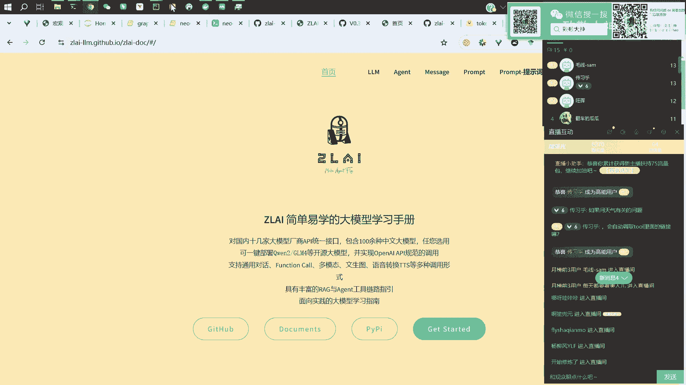
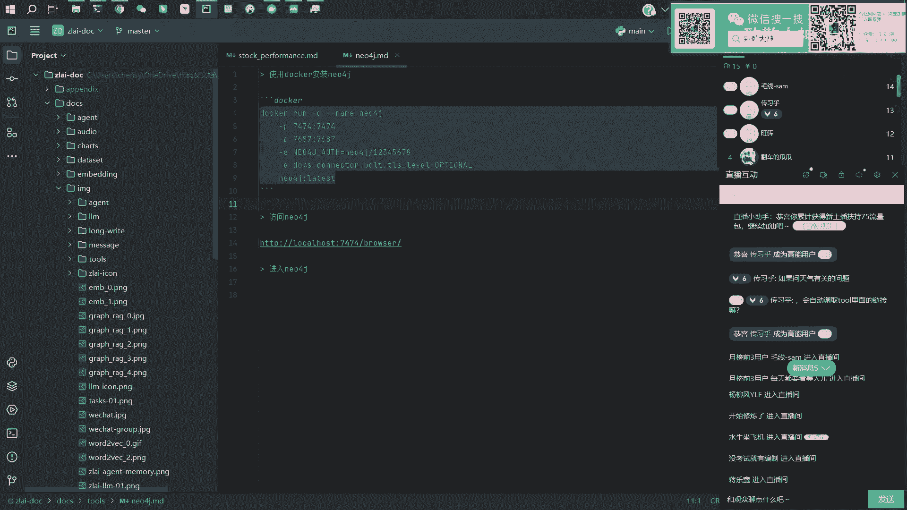
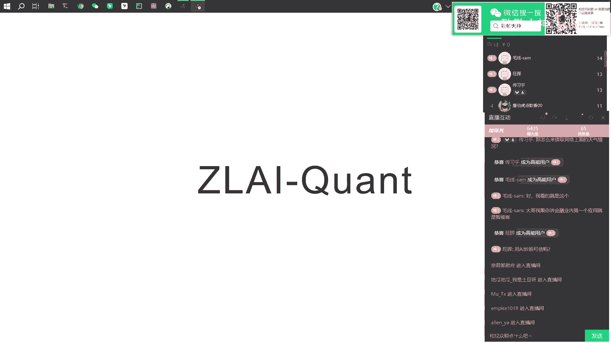

# 【直播回放】Zlai大模型知识图谱联网与金融量化应用 - P5：05_使用tools联网 - 致敬大神 - BV1bZxyeAEjB

有问题吗，哦按顺序看啊，一个是嗯看一下传西湖同志问的是，如果问天气有关的问题，它会自动调取to里面的链接吗，不链接，不会的，不会的，你链接以那个以字符串，比如说你给他一个网站的链接，比如说天气。

有网站吗，网站你给他这样的一个链接，他不会去直接读取这个这个网页的内容的，他他只会认为那是一个杂乱的字符串，智能客服，我看有个同学说智能客服智能客服是没有做的，那就没有给给给公募基金做。

但是这里有一个那个示例，啊这里这个不是，首页上首页上这里有一个基金问答的一个示例，做了一个简单的demo，可以看一下，就可以通过刚才我们介绍那个方式，去获取什么一些基金的一些消息什么的。

对这个这个是有有有做的，然后工具的话。

呃在，在这个，工具工具是，反正代码工具是有的，就是有这个F，就比如说去获取代码，获取基金代码名称，然后获取基金基本信息，当前的净值，然后基金公司查询嗯，查询一些历史的净值，这些都是有就是代码层面都是有。

可能可能文档不一定很全。

看一下刚才那个哎这个应该跑好了，这个是他总结后的一个回答，就是是说上海气温是28度，然后湿度是74%，然后风力等级哎轻微到中等，那这样的话就是我们希望的一个回答，但其实他是得到了我们这个接口啊。

对一个真实的数据做出来的一个回答，那如果你直接不用这个工具去问的话，他可能就会跟你瞎说，比如说我这里我这里直接问一下啊啊这个，我们不给他工具，我们看一下他回答回答的内容是什么，那有人问那个。

刚才这个问题问就是继续刚才这个问题，他问怎么读取网络上面的天气情况，就是怎么联网呗，是这意思吗，哪里怎么联网是吧，怎么联网，就是就是那个等一下那个函数呀，等一下等一下，等这个跑完，我给你展示一下。

你看这里的话，如果你不给他工具的话，那就会说抱歉，我无法提供实时消息啊，我我我的回答都是基于，过去历史数据和知识库中的信息，如果要问不不不，反正反正就是他回答不了，但是你要是给他这个工具，他去调用。

然后并且给他真实的数据，他就会呃给你这样的一个回答，这个就是这个区别，然后怎么去获取这个天气信息啊，其实是我们可以看一下这个get visor，这个函数是在做什么，嗯他其实是在调用调用这个地址啊。

这是一个天气查询的一个一个嗯一个一个接口，大家可以去看一下，比如说这里city name，比如上海，啊这就是上海的天气，各种数据它只是一个一个一个接口，但是它不是直接不是直接读的链接。

而是说通过一个函数去获取这个链接，而得到的这个数据返回出来的，这个就是这个这个agent，这个一个比较比较细致的，稍微底层一点的这个介绍，看看有没有问题，有没有问题没有问题没有问题。

我们下一个环节AI炒股可信吗，AI炒股，其实AI炒股的问题在于你给AI的信息有多丰富，有多真实，就你给他足够多的消息，那他做的判断就会比较精准，给你的结论会相对可靠一点，但关键是你的都是都是建模啊。

你不可能说靠人去判断去怎么下单，这拿的就是比较用机器学习做更科学一点吧，嗯感觉，就是本质上是处理信息的能力，人处理不了那么大量的信息，也没有办法去学习背后的那种概率性关系，但是你用AI所谓的AI啊。

就是各种算法呀，现在的各种处理信息的方法，还有就是科学的验证方式去做的话，他肯定是更好，时间有点久，我们直接下一个下一个话题了。

