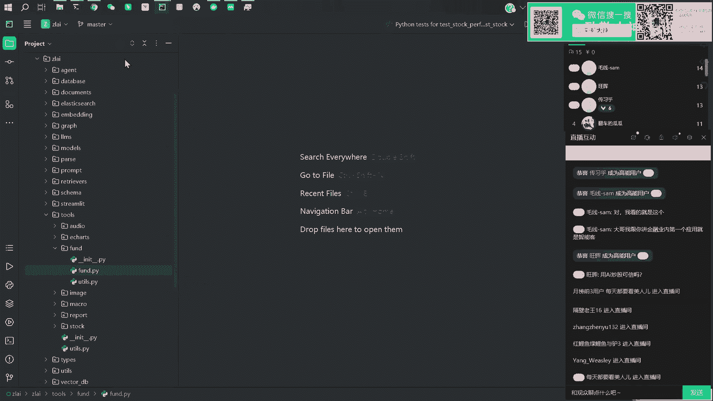
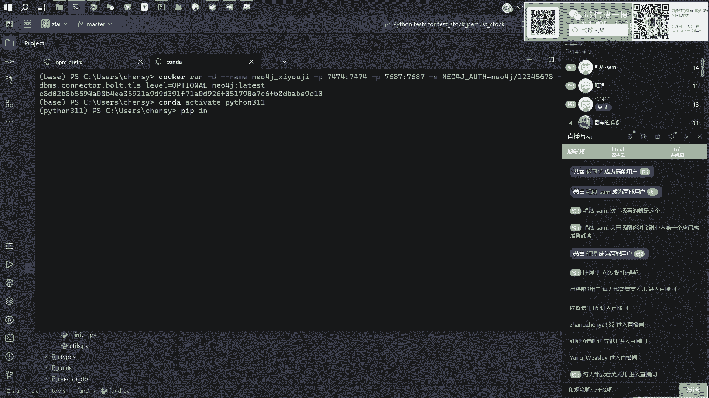
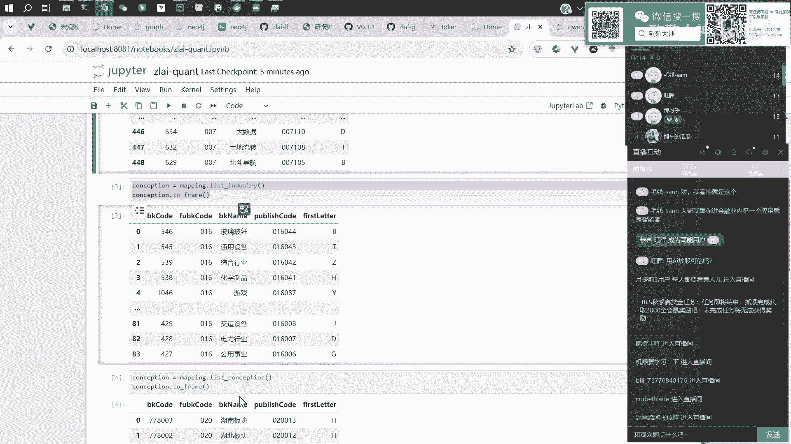
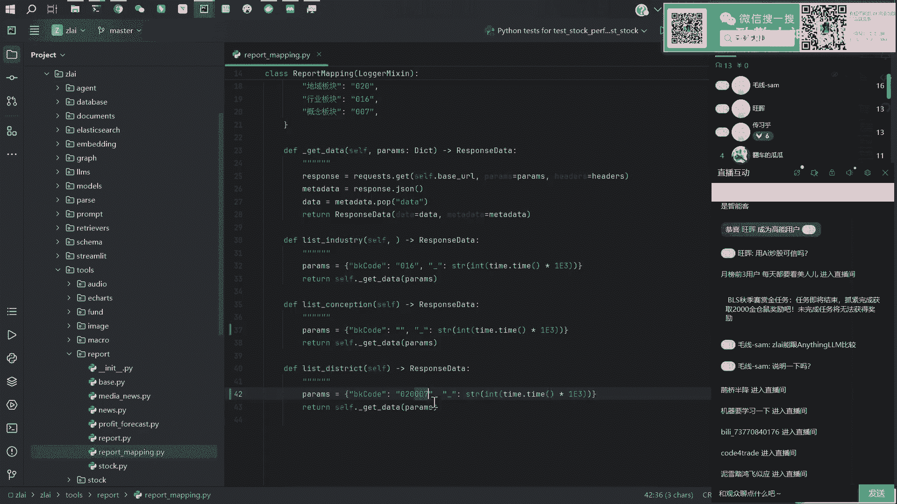
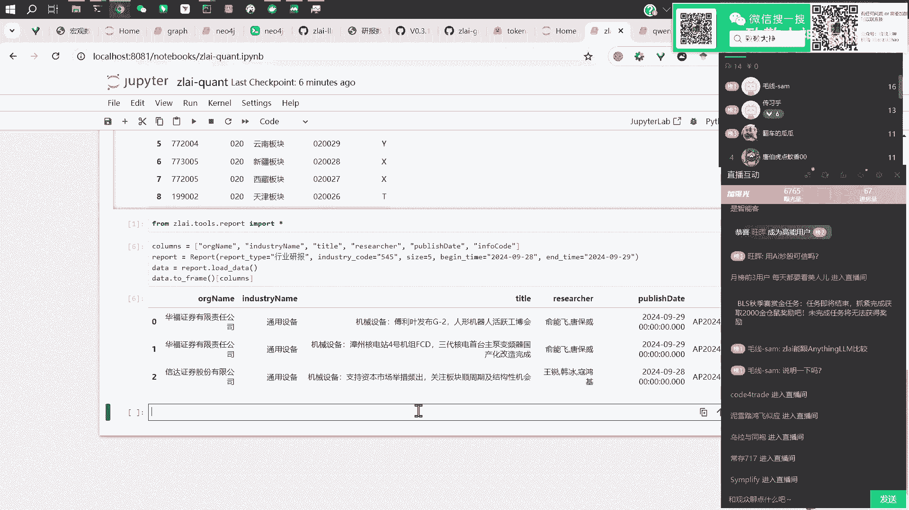
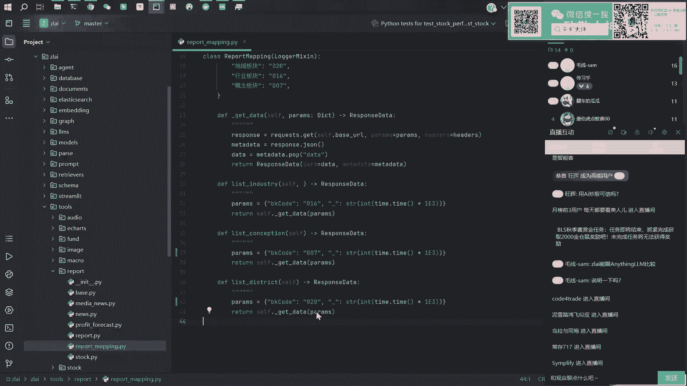
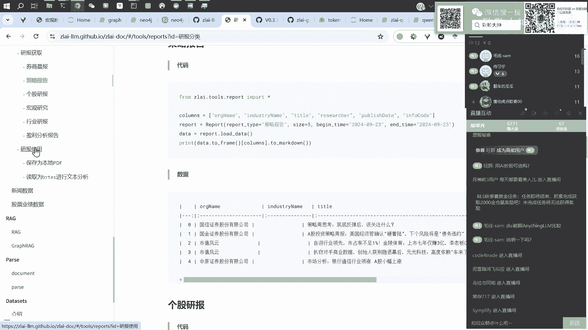
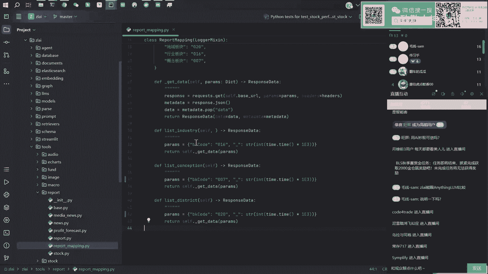
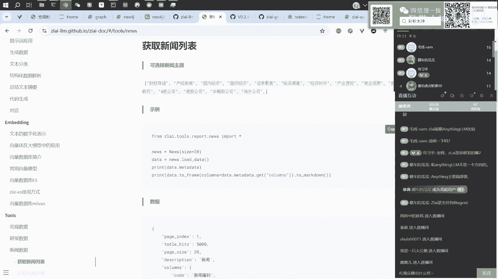

# 【直播回放】Zlai大模型知识图谱联网与金融量化应用 - P6：06_Zlai量化方向的应用示例研报解析 - 致敬大神 - BV1bZxyeAEjB

但是我的我的考虑是什么来着，就是我们这次分享的直播，第一个第一个话题就讨论了，那个怎么去生成那个图谱嘛，就是你给一些文章，给一些材料，他就给你生成各种关联的图谱，然后第二个话题呢我们讨论了。

就是说让我们现在一些大模型，去自动的去获取网上的一些信息，并根据这些信息给出一些回答，然后那么咱们下一个话题其实就在考虑，就是这两个技术测，这两个技术点是不是可以做一些结合。

是不是可以完成一个更复杂的一些事情实践啊，我觉得是可以的，就比如说我是不是可以呃，总结一下各种类型的一些研报，然后让他去或者说一些财经报告呀，宏观经济的一些研究，让他去帮我去形成一个比较大的一个。

经济传导的一个链路，就比如说嗯每个月的CPI发布了PPI，发布了这些什么PMI啊啊GDP发布了之后呃，那么他其实都会去影响下一个月的经济的走向，就比如说这个月猪肉贵，可能在未来三个三四个月。

然后就会嗯有怎样的一个传导路径，比如说养猪户开始去去扩扩大它的产能，然后首先会把这个饲料的价格带起来，然后也会带起来兽医的某些行业，也会总之它是一个经济或会不断的去传导的嘛。

那么我们是不是可以去搞足够的材料，去构建这样的一个经济传导的一个链路，就是形成一个我们刚才看到就是西游记那种，知识图谱一样的一个链路，然后从一个节点的一个一个消息出发嗯，在多久的时间内。

在多久的一个嗯空间内，他去做一系列的经济的传导，有可能是风险，有可能是收益呃，有可能是其他的方面的一些一些影响，我觉得这件事情是是可以去做的，之前呃其实大家也都有在去做这些。

经济传导的一些路径的一些研究啊，但更多的就是说人人去梳理这样的路径吧，人去梳理的话，有可能就会遗漏遗漏掉一些点，因为他呃人去处理这些路径的时候，往往会受限于自己在某一段时间内呃，看过的书。

学到的东西的一些影响，或者说呃有自己的一些知识性的一些偏好，大模型呢它其实它也有自己的偏好，但是由于它的这个训练的语料相对的比较大，这种偏好相对人来说就会小很多，所以啊嗯第一点。

我觉得就是说可以用大模型去梳理这样的，经济上的传导的一些链路，然后第二点的话，那我就开始考虑嗯，有哪些数据源去支撑这些这些啊这些操作，那么那么我就去整理了一下呃，整理了一些数据。

然后首先的话是我看这个文档在tools那一块，咦怎么没有刷新一下，啊这里啊这个是宏观数据，我们先不看，首先是这个呃研报的数据，就是说呃这类研报的数据有这么几类啊，什么券商的一些晨报。

就是券商可能每天都会发一些晨报出来，就是比如说这里选定一个日期，他就会告诉你，就是说嗯有这些公司发布了一些啊晨报，这些晨报呢一般就包含了就是不同的这些券商，他那最近在关。

最近在就是财经领域关注的一些方向，或者是一些热点或者是一些风险，然后下面是它这个呃，呃这个这个这个这个他的这个这篇报告的，一个一个一个唯一的一个编码，然后什么策略报告啊，个股的报告啊，宏观的一些研究啊。

比如说什么宏观数据的一些研究，都都会在这里有，就是这个是研报这一块，就是我们可以把这些数据拿到，然后去去去用这些数据去生成，这个比较庞大的这个呃经济的一些传导路径，然后第二块的话就是更时效性的一些新闻。

就比如说每一天哪些呃领域，有了一些什么样的一些经济的一些新闻，这些新闻是怎样的，比如说这里有一个啊有个方法，这个方法可以去调前20条，最新的前二十二十条财经新闻，然后这个是摘要。

后面就是他一些原文的链接啊，这个是新闻的内容，然后还有宏观数据，宏观数据也比较多，可以看到左边这一次大概有应该有十几20种，应该是有，然后未来的话会更丰富一些，但这个就是就是体力活了，就慢慢做。

就一个一个增加，就左边左边是这个目录，然后右边的话是具体的一个调用的一个方式，比如说这里这里的话就是CPI这个调用啊，他有哪些字段，然后底下是一个一个数据的一个样例。

还有的话就是股票的这个股票的一个一个数据，这个数据是他的一个公布的财报上的一些数据，就是说这个啊，这个公司他他公布财报的那个什么，总营业收入是什么，利润是什么，净资产是什么，然后毛利率是什么。

总之这个还比较全的啊，OK啊这个就是所有的这个实时的这些数据嗯，然后后面的话这个数据会会，这个工具类会不断的去去增多，那么有了这些工具类，有了这些调用数据的方式，其实结合上我们刚才讲的那个agent。

那些调用流程那么大，模型就可以去自由的去调用呃，宏观数据啊，研报数据啊，然后新闻的这些数据啊，去给你做出一个图谱，然后去调调，用这些宏观的数据去分析啊，比如说CPI涨了。

会导致下个月什么什么东西的一些变化啊，目标是这个，但是现在的话只是完成了，这些数据的一个一个接口，然后挑几个给大家展示一下好了，比如说我们挑一个每样挑一个去看一下，快点吧，等下，就比如说嗯找一个。

找一个研报的吧，先找一个研报的，比如说我想找一个某一个行业的研报，然后把这个代码复制过来，然后嗯，这里有一个行业编码，然后我们可以看一下这些行业，行业编码是怎么来的，找一下那个。

这里这里有好几个那个分类，有有有有三个就是编码的一个mapping，然后分别是这个概念，可能有几几百个概念板块，跑一下看一下，改好新的版本好像没有装，我去装一下。

好像版本不对，先下载一下吧，然后就可以看到这个这个是板块，就是有可能有有不同的这个板块，还有，用这个对奶瓶，这个是不同板块的一个代码，然后还有行业，这个是不同行业的一个代码，这是研报的吗。

你这个只是那个什么，这个不是研报本身，就比如说你想搜索那个呃某一个行业的研报，嗯不是得需要就是知道这个行业的一个编码哦，嗯你可以用这个这个这几个mapping表去查，然后还有一个是概念嗯。

比如说有些某些什么什么概念股，可以用这个去查哎，不是嗯，嗯是不是，啊这两个函数搞错了，哼这个地区的这个写成这个了，但没关系，这个只是个展示啊，就是说这里有很多概念，就是概念编码是什么。

但是这个函数写错了，就是概念和这个地区应该换过来。

我看看哪里写错了，E020，这个这俩换一下就OK了。

两个换一下，这个有一点问问题，但问题不大，然后就比如说我想看换一个行业，就是玻璃纤通用设备吧，545545这个行业的研报，你想要前五条，然后今天是多少号啊，今天是29号，不知道29号没有。

就28号到29号，这两天的数据就是这两天发布的研报，我看一下有哪些，那就是三条研报嘛，就是就这三家公司，一券券商发发布三篇三篇研报，然后这是三篇研报嘛，然后我们可以看一下。

怎么去把这三篇研报去把它展示出来。

就是这里只是一个研报的一个列表嘛，然后我们下一步要获取它它的那个啊正文，在这个地方研报的这个使用第一个方式的话。

就是我直接把它保存到本地一个PDF这个关掉啊。

保存到本地PDF的话，就是直接用这个save Pdf这个方法就好了，反正他这里有一个in for code，有一个这个这个编码，就把它复制过来就OK比如说我想要两篇，那我就复制这两篇的编码。

然后运行一下，然后就会在你的这个路径下面看到，看到这两篇研报啊，尾尾最后四位是36914439，看一下，对不对，例44393691，那么就是这两篇文章，双击就可以打开这样的一份研报，是吧。

这个就是你方便你自己自己下载去看一眼，不也可以用这个东西，但实际上我们要给模型用的话，肯定不是这样的方式，这样效率太低了，就是你可能来回下载效率太低了，然后我们的一个用法是，直接去把他读成一个文本。

直接就丢给大模型了，就比如说嗯这里我想要这篇研报，然后我直接load Pdf beat，就是直接以以这个beats的形式，beat数据类型的这种方式，直接把它读进去。

读到这个read Pdf这个函数里面，把它复制给这个stream，我们一步一步的看啊，看一下这个，这个数据是什么东西，这个数据会传出来两个东西，这个就是一个啊那个PDF的嗯，那个原文。

但是这个不是人看的，这个是给机器看了一个编码，然后给到他这给到这个read Pdf stream这个方法，然后我们把它打印出来，打印出来他这里有，有几个东西，有一个是那个配置的一个MAD data。

就是它的一个原数据，一个是配置content，这个配置content就是就是原文了，然后还有一个配置image，这个配置image就是这个网这个图，这个就是研报里可能会有些图片啊，这个也会把它提取出来。

我们可以展示一下这个图片嗯，Grow，展示一下，就展示一张图片好哦，就是就这样的图片，就是因为有的时候他那个研报可能是嗯，可能是就是那个PPT，也有可能就是他这个研报里面很多东西。

都是以图片的形式去展示的，那么你就可以用这个读取图片的方式，比如说你有一些支持多模多模态的这个模型，你就可以直接把这个图片给到这个模型去，让他去给你解读啊，就但但是这个就看具体研报的一个情况了。

就是反正这里都会把文字和图片分开，去做一个提取，然后这里的话我们做一个最简单的展示，就比如说嗯我把一个把这个所有的文本全都，拼接成一个长的一个字符串，就比如说分离，拼接成这样的东西，这个break去掉。

然后那这就是这篇，研报的全部的这个原文吧，这个这个这个文章相对比较短了啊，这就是这个原文，但其实这样的文章我也不想看，因为太乱了，然后我们就直接丢给大模型好了，我们直接调用调用质朴的大模型号。

既然嗯那我用用flash，这个是免费的吗，好看，然后我说，几分条，直接用大模型去给我解读一下，啊这样好看一点，就是下面是这个研报的一个解读内容，他说投资要点是哪几块，建议关注哪些行业，然后风险提示。

然后啊这些东西，那他其实就以一个更清晰的形式给了你，一个就是一个一个一个一个摘要吧，然后你也可以按照我们刚才说的做图谱的方式，然后去呃去构建一个图谱，就是说他这篇研报展示了他们关注的。

哪些行业的一个关联关系，然后就这个就是下一步的一个一个内容了，这个是是是研报嘛，然后然后我们再展示一个，嗯这是新闻数据，新闻数据的话。

