# 【比刷剧还爽！】这太完整了！量化交易和python金融分析实战课程，全程干货无废话 入门到精通一步到位！（数据挖掘分析／大数据／可视化／投资／金融／股票／算法） - P86：91. 29.30.对偶性，Lagrange函数，Lagrange函数的凹性，对偶函数与(Av526664194,P29) - AI算法-溜溜 - BV1iC411n7XN

我们的我们要证明的，实际上实际上就是这个函数啊，这个函数就是在这样一个区间里面，在这样一个地域里面，这个函数是一个是一个凹函数，我们要证明这个事情吧，好那么很显然这个函数看起来就是凹的对吧。

所以呢我要是下面要证明这件事情，就是这东西是个突击，我只要能够证明他是个凸起的话，那么这个函数不就是个凸函数了吗，那不就是个凹函数吗，对吧，那能证明这个时候能证明这个是个突击吧。

嗯能不能证明这样一个集合，对于V来说是个初级，不能证明啊，这个你们自己去看一下好不好。

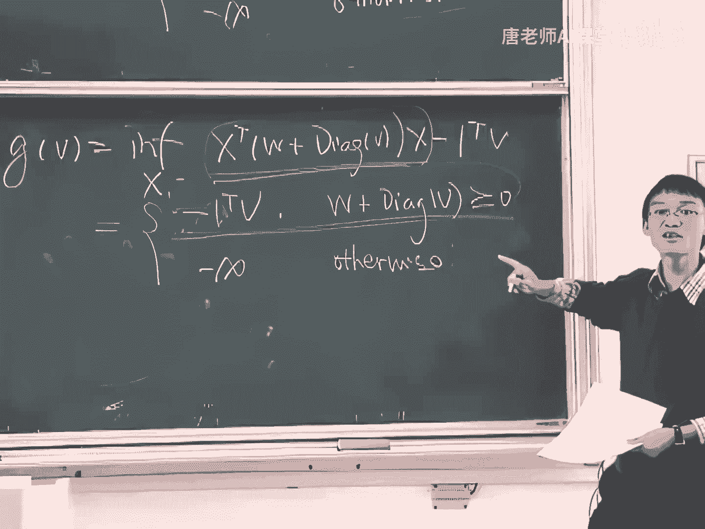

非常简单的，我们用这个突厥的定义来就就完了，直接去运化定义很快就会得出来，因为中间这个地方是个dialog，这个简单。

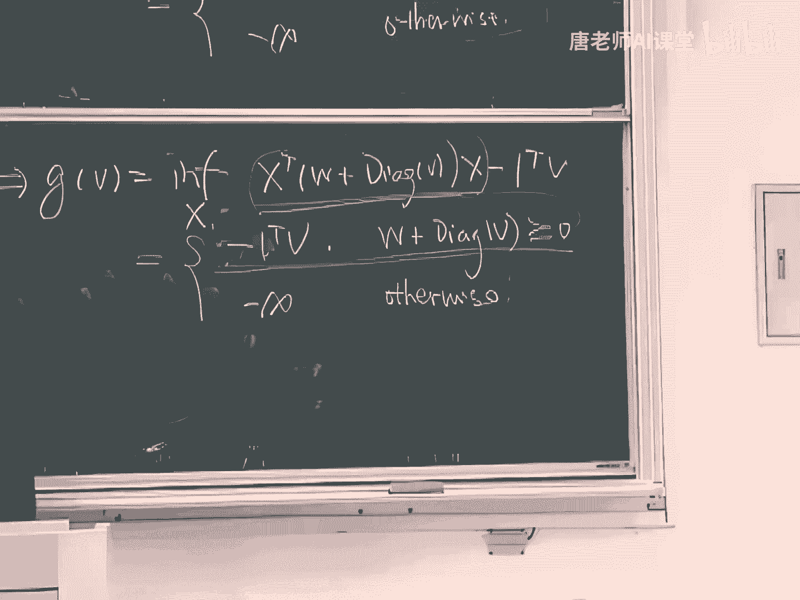

好，下面呢我们再讲一下这样一个，我们的这样一个对偶函数啊，和我们之前讲过的一个东西是有关系的。

我们之前讲过讲过一个概念，叫做这样一个叫做一个函数的共轭，那么函数通过和这个和这个对偶函数之间呢，它有个很直接的联系。

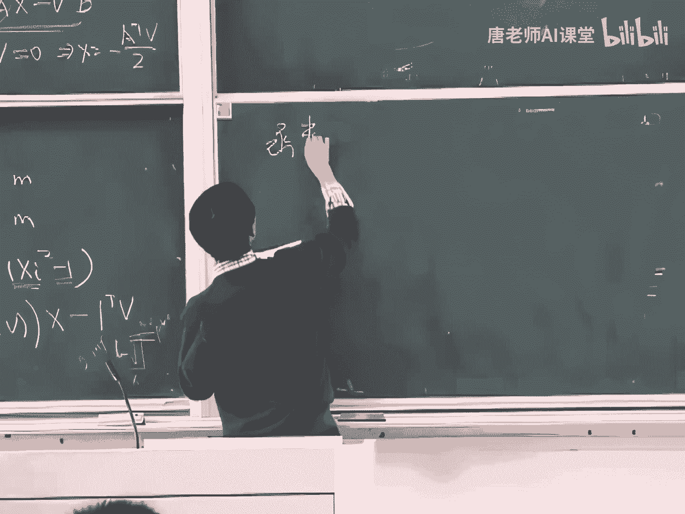

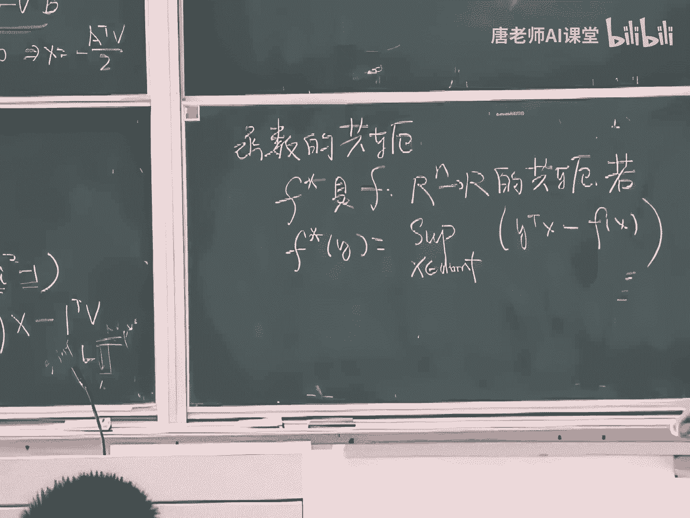

我们再来回顾一下这个函数公式的定义，假设我有一个这样一个N维到一维的，这样一个映射，F这个映射，那么我就有一个他的工作，这个也是个映射，这也是一个从N维空间到一维空间的一个映射，是什么东西啊。

就是这个F星啊，这个函数F星他的这个变量是Y，那怎么去求它呢，就是我对这个所有的这个X，属于这样一个F的定义，我去做一个极大值，我就求个极大值，那么这里面是第一项的是Y和X内积。

我再减去这个FX这样的东西，我们之前讲这个讲这个图画书的时候，实际上我们就讲过这个概念对吧，然后我们还讲这个函数一定是个，一定是个凸函数吧对吧，为什么，因为它是一个。

它是对于对于很多个对于可能是无穷多的，这样一些对于Y的仿射函数，对于Y的仿射函数去求过几大嘛，所以最后他是个分分段线性的好，那么有了这个概念之后，我们再来把它去套用一下，套到我们刚刚讲这样一个。

讲这样一个对偶问题上面来，我们看看这个之间有些什么样的联系，首先呢我们来考虑一个最简单的问题，一个极其小儿科的问题，就是去minimize FX原生呢是X等于零，好这个问题两岁的小孩就会求对吧。

很简单嘛，X就等于零嘛，这样的最优解就是零了，但是我们从这个角度来理解一下，这样一个函数的共轭。

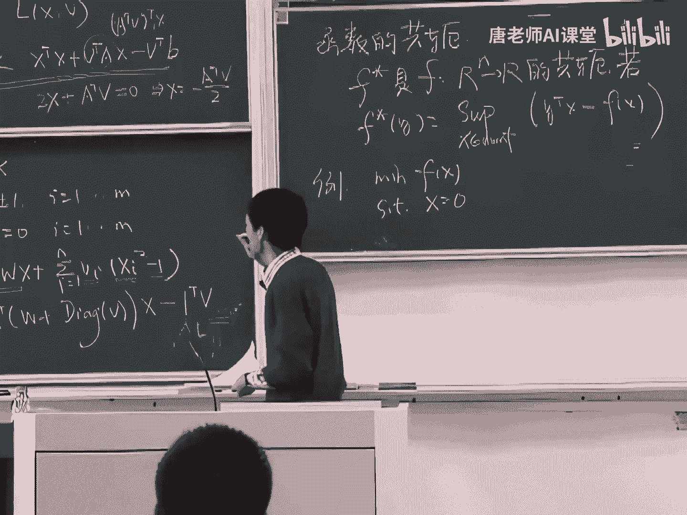

和这个对偶函数之间的关系，我们来求一下这个函数，它的对偶函数。

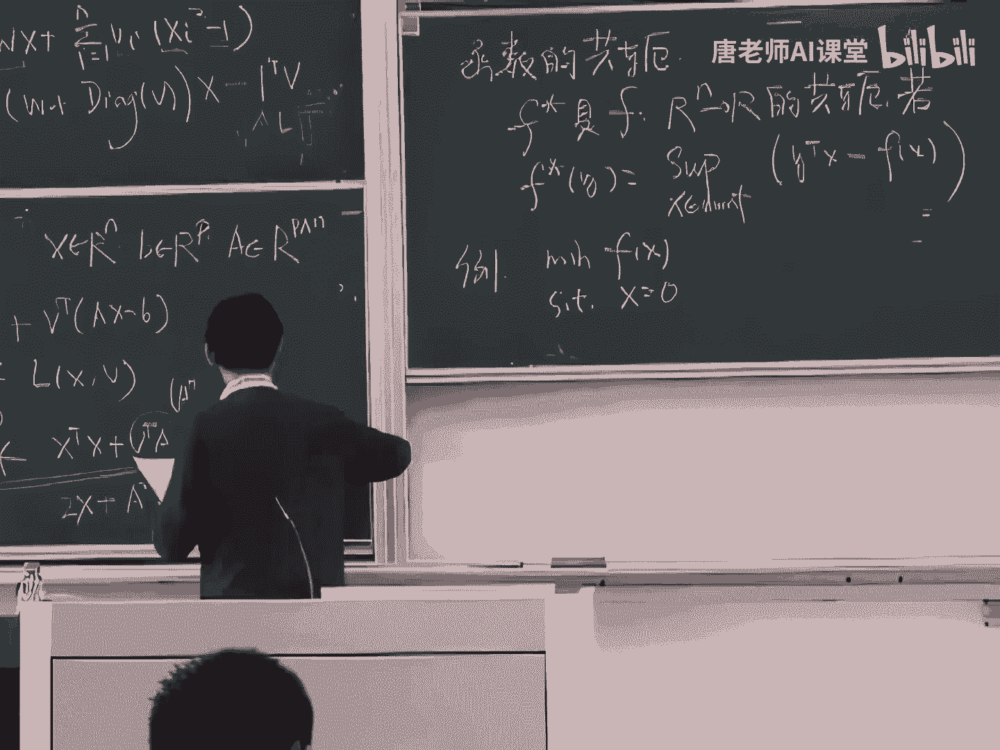

很简单，就是这个FX加上这个这个V和X的内积，就这样的东西，那么这个函数呢它是有个这个定义的，它的定义域呢其其实分为两部分，第一部分呢实际上就是这个X的定义域，就是关于这个S的定义。

就是我原来这个F本身的定义域，第二块呢是这个关于V的地域，我们讲这个V可以是任意的，所以呢它实际上就是这个N维，N维的这样一个空间，这个V是N维空间里面的一个向量，好这个呢就是它的这样一个对偶函数啊。

这个拉杆函数，那么下面呢我们就可以去求一下，他的这个对偶函数了，好这个就是我们还继续用了一下这个对偶函数，它的它的定义，那么这个定义我为了将它和它联系起来啊。

将这个将这个INFM和这个superman去联系起来，我需要去做个变换嘛对吧，我一个是求极大，一个去求极小，所以我需要去将它翻转一下，这个发展结果是等于什么东西呢。

首先呢我要我将这一项变成一个superman，那么很显然这个里面这项我肯定要去翻一下吧，就变成负的对吧，那么前面这一块呢，我是不是还要再加上一个负号对吧，我肯定还要再翻转一下啊。

这样的话才能得到原来这样一个这样的结果，好，那么我们来比较一下这个式子和这个式子。

它们之间是有什么样的联系啊，首先我们看这个FX，这个减去FX对象是不是完全一样的对吧，这样完全一样的，那么这一项呢是实际上是这个Y和X内积，这里是负的V和X内积，所以基本上就是一模一样的。

我就可以把它写成这样的东西，也就是说啊，对于对于之前这样一个比较简单的一个问题，对于这样一个问题啊，我我的这样一个目标函数是FX，那么我的我的这样一个对偶的函数，是个什么东西啊。

我的对偶函数就是就是F的共轭，F的共轭在负V这一点的取值再给取个反，就是就这个意思，就是GV这个东西是等于这个F型的负V，再去取个反，这两者之间的联系就是这样一个联系，也就是说。

这个F和G之间存在这样一个对应关系，当然这只是对于这样一个比较简单的问题而已。

那么下面呢，我们再来看一个稍微复杂一点的问题，这个问题实际上是一个它的约束都是线性的。

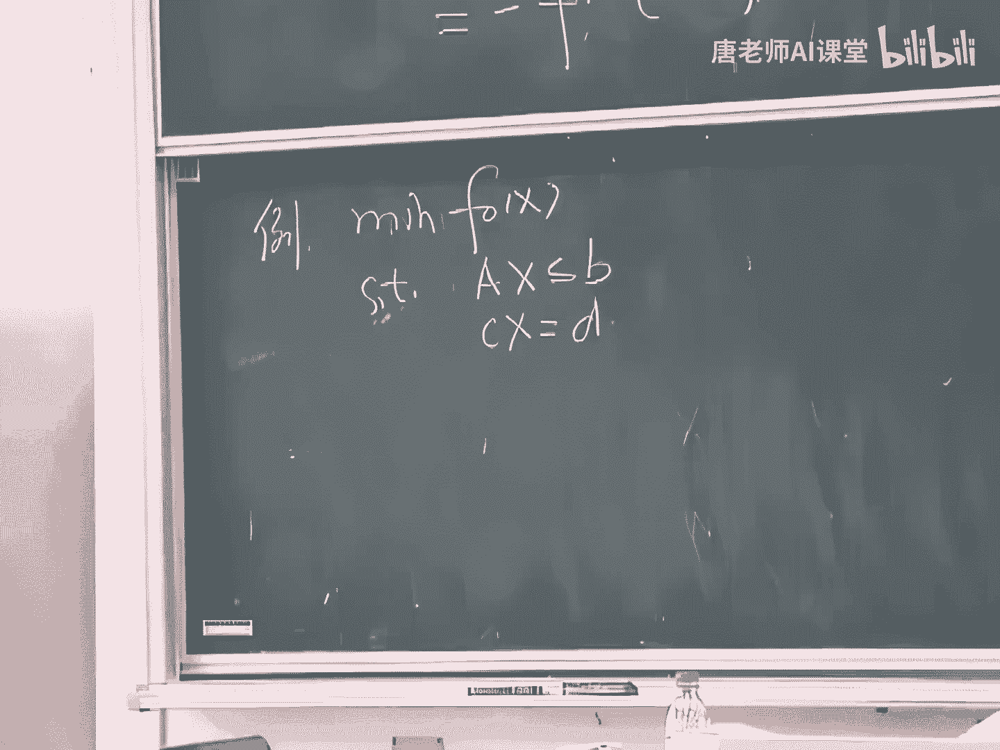

约束是这个ax小于等于B和CX等于D，这个F0X呢它可能是任意的函数，那么我们还是照样的，我们今天呢这个这个练习做的特别多，就是怎么去写出来这样的优化问题，它的这个拉格尔函数和它的对偶函数。

这个训练是非常重要的，你们要保证以后你们别人给你一个优化问题，你闭上眼睛都能给写出来，到底是一个什么样的形式，好吧，一定要保证要做到这么熟练，好，那么我们首先呢，还是把它这样一个拉杆函数给写出来。

然后呢我们再把这个所有的跟X相关的量啊，把它全都给找出来，因为我们最后还是要去对，对于这个X去求个极小，好那么我们把这几项给取出来之后，我们就可以得到这样一个形式，还是很简单的一个形式了。

那么下面呢我们就是要去对于，对于这个X去求极小了，好我们对于这个式子去求个极小值啊，那么首先呢这一项后面这一项是个常数项吗，后面这一项相当于X来说是个常数项，我们可以先不先不去管它。

那么我们来看看底下那个东西啊，这个这个F0X呢是保持在这里了，后面一项呢是一个关于X的一个一个线性项吧，好我们来比较一下这个问题啊，和上面这个问题它实际上是不是一样的对吧，它的样子不一样。

但实际上它的本质是一样的，所以同样的我也可以去做个这样的变化，我可以把这样一个形式给变成这样的形式，这是完全等价的形式，所以我就可以得到这样的结果，好我们可以得到这个式子，但是呢这中间呢我们要强调一点。

我们我们一定要强调一点，就是实际上这样一个这个问题啊，这个函数啊，它实际上它是有应该是有它的定义的吧，这个函数关于这个拉姆达V，应该是有它的定义域的吧，好那么它的地域是什么东西呢。

它的地域就是要使得使得占个占个值，这个负的拉姆达的转置乘以乘以A，加上V的转置乘以C再去括号求个转置，那么这个占一点呢实际上是在F0的工，F0的共轭，它的地域里面，我一定要保证它。

它是一个这样一个可行的这样一个东西，一定是一定是要在它的域里面的好，那么这个问题呢我们就不详细的去讲了，那么这里刚刚讲的这些东西实际上是非常简单，就是我们就把这个函数的工作，这个概念给重复了一下。

然后呢，我们又讲一下，这个函数的共轭和这个对偶函数之间的联系，是什么样子，就是无非就是一个东西是求个superman，一个东西是求求个一费，实际上是非常非常简单的概念啊，好，那么下面呢我们就要开始。

重新回到我们刚刚讲的，那个比较核心的问题上面来了，给我们讲啊，这样一个这样一个对偶函数，只要我们的拉姆达是大于等于零，那么对于任意的V我的这个G兰姆达V呢，它的值一定是小于等于这个P星的。

也就是说它是提供了一个下界，那么最好的下跌呢，就是我要去极大化这样一个这个基拉的V吧，约束是在这个拉拉大于等于零这个上面，所以呢我们就可以去构造这样一个问题，注意啊，一定有一个约束是拉姆达大于等于零。

一定要有这样这样的约束，那么我们通过之前的讨论，我们已经知道了这样一个这样一个函数，这样一个优化的优化问题啊，它的最优值一定是仍然是这个，仍然是这个P型的一个下跌吧。

它的它的最优值一定是小于等于这个P型的，那么首先呢我来定一下它的这个最优值呢，叫做定下这个最优值叫地心，这个它的最优值啊叫D型，原来这个问题的最优值叫做叫做T型，那为什么叫D呢。

因为这个问题叫做对偶问题，这个队友问题或者叫拉杆日队友问题，所以我们看今天这个队友和拉格朗日这个词，出现的概率特别高，好那原来这个问题叫做对偶问题，我可以给他记个标记，叫D好，叫做这么一个问题。

那么相应的原来这个问题呢它叫什么呢，叫做原问题，它的名字叫原体，就是所谓叫primer的问题，首先呢我们还是按照以前讲过的这样一个，这个结论，我们可以直接写出来，就是这样一个各有问题，它的最优值。

一定是小于等于这个原问题的最优质的对吧，这是很显然的事情，因为因为你每个这个这个这个GLV，只要你的这个拉姆达是大于等于零的，它的取值都一定是小于等于这个P型的，那么你从中间去取个最大的一个人。

也还是小于的吧，所以这是他的第一个很重要的性质，这是一个非常非常重要的一个式子，好刚刚有同学问我，就是这个小于等于这东西好像没什么意义对吧，什么意给提供一个下界，就是没有没有什么意义的。

比如说我告诉你啊，这个这个啊我我我我告诉你，就是你的你的这个呃，你你将以后你活在上个上届是300岁，这个商家是没有没有什么意义的吧对吧，因为你活不到300岁吧，所以呢我关心的是有个精确的商店。

比如说我告诉你，你能活到100岁，那一定很高兴对吧好，那么一定要给个精确的赏金，也就是这边要是个等于号才比较好，对不对，那么什么情况底下这个东西变成等于号呢，我们先不讲，因为这不是我们我们这节课的内容。

是我们下节课的内容，我们先不讲，我们先留个留个谜团在这里好吧，好那么第二个呢是什么东西呢，第二个就是我们原来的这样一个，我们这样这样一个队有问题啊，我们这样的队友问题啊，我们之前也已经讲过。

他是个凸问题，因为我是要极大化一个凹函数，同时呢我的这样一个约束的集合，是一个是一个突击，是个仿射集，抱歉不是仿射集，是一个半空间对吧，实际上是一半空间，所以呢我一定是可以求出一个最优解的。

一定是可以求出最优解的，那么它的最优解叫什么东西呢，我把它称为叫拉姆达星和V型，和我之前的这样一个X型去对应，那么这样一个拉姆拉星和卫星呢，它有个名字，这个X型呢叫做这个原问题的最优解，拉姆逊和微信呢。

就是就是这个对偶问题的最优解，但是它有一个名字叫做最优的拉斐尔城子，最优的拉格朗日乘子，就是它的确是个是个解对吧，但是呢本身呢我们又知道这个拉姆达和V呢，它是一个拉杆日程子，那么拉格拉格尔分子呢。

是有个叫最优的拉格尔分子，至于他为什么最优呢，这个我们下面也会讲到的，那我们就讲了，就是它是个最优的，也就是无非要就是要使得这个最都有问题，它的取值能够达到最大，好这两条性质呢也是很重要的性质。

我们一定要记住，就是之前呢我们讲这样一个对偶函数啊，有两个重要的性质吧，现在我们讲这个对偶问题呢也有两个重要性质。

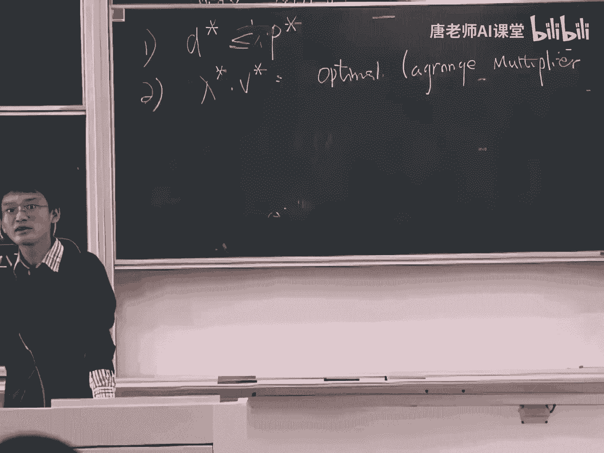

就是第一个呢，就是这个这个地心要小于等于P星，第二呢就是这个这个这个拉姆达型和卫星呢，我们把它称为叫最优的拉杆纯子这个东西，那么下面我们我们还是去举例去说明一下啊，怎么去从一个原问题里面。

我去写出来我的队友问题，我们之前讲就是我们关心的是，怎么从这样一个原问题里面去找出来，我的这样一个拉杆函数，再去找他的我的这样一个对偶函数对吧，这是我们以前做的事情，那么现在呢我们要做三步了。

第一步是首先要写出来这样的拉杆函数，然后呢我再写出来一个对偶函数，然后再写出来一个对偶问题，这样三步都要做下来，好我们还是去用一下，我们之前讲过的这样这样一个例子，我们之前讲的这个例子。

我们已经求了它的这个，它的它的对偶函数是个什么样子的吧。

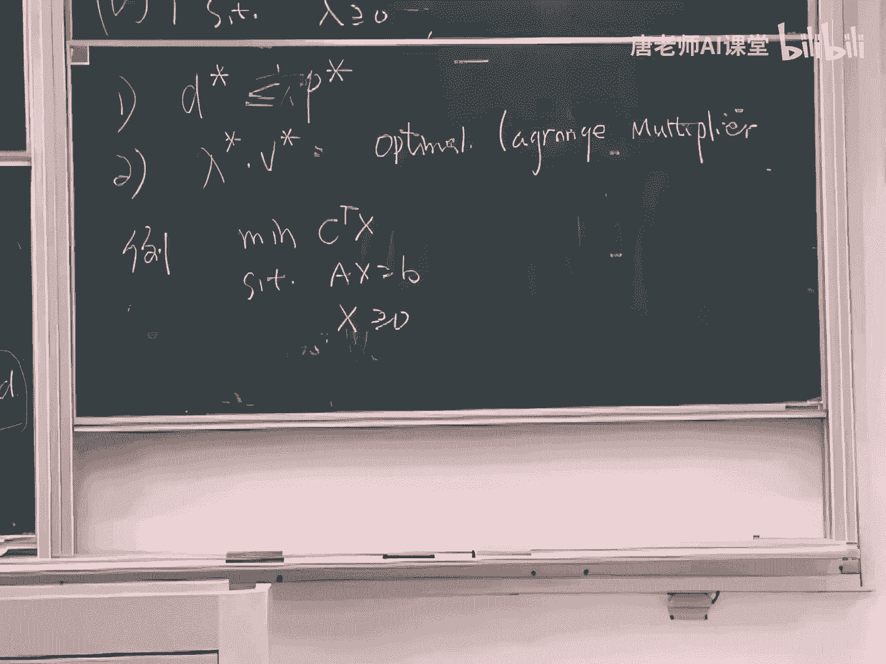

好我把这个对偶函数啊，我重新找出来，再写一下，啊这个就是我们的这个最有函数，那我们讲啊就是这样一个问题，我有了个对偶函数之后，我就可以去其他化这个对偶函数，然后加上一个约束，就是la大于等于零。

那么这个吉他好坏问题啊，我实际上是这个这个函数中间包括两块对吧，一块呢是某个值，是一个关于V的这样一个这样一个东西，第二块第二块呢是夫熊好，那么现在问题来了，我去吉大化这样一个东西的话。

那么我有两种情况，第一种情况呢，就是说如果我的这个拉姆达和V啊，如果拉姆达和V啊，它有可能记住他，是如果他有可能落在这个范围内的话，因为他有可能落在这个范围内的话，我的取值是不一定是这个，对吧。

为什么呢，因为很显然吧，如果不在这个情况底下的话，它就是负无穷了，所以我负无穷肯定不可能是我的最大值，对吧好，所以呢只要他有可能落在这个范围内，那么它就一定是一定是这个。

如果他没有任何可能落在这个范围内的话，那么它的取值就是负无穷嘛对吧，只有这两种情况，可只有只有这两种情况，所以呢我们就可以把这个问题啊，写成这样一个形式，我写成这样的形式，好，我们看到这个。

这个别的地方都可都是很好理解的，就是有这样的情况，就是如果当它当它等于零，这个式子肯定不可能成立的话，那么我是是是怎么个情况呢，那么如果他成立的话，很显然这个值就是这样一个值，这是没有任何问题的。

那么如果它是不成立的话，它的值就应该是负无穷吧，没错吧，好那么如果它的值是等于负无穷的话，你看我这里，实际上是不是把这种情况给给省略掉了，我略掉了这种情况吧，因为这种情况是没有任何意义的对吧。

我求到一个一个东西的这个下限，下限是一个这个一个东西的这样一个下限，是个是个负无穷，也就好像是讲我讲你的这个寿命是无穷长，你的说明了这个上界是无穷长的，这一样是一句废话，对不对，这种废话我们就不讲了。

我们就只关心这样一个有实质意义的东西，就这样一个问题，这个可以理解吧，所以以后啊你们碰到这种情况，就是如果你的这样一个。

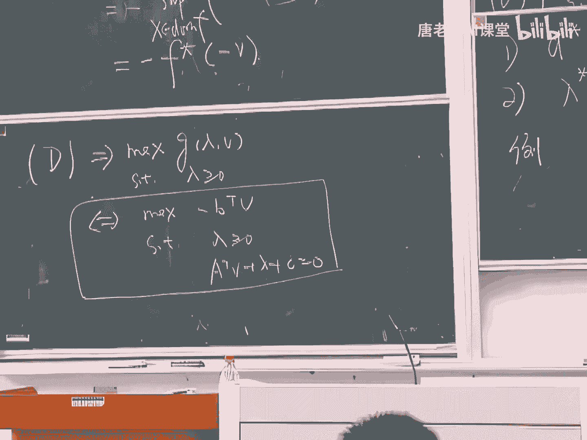

如果你的对偶函数写的，写出来是这样的形式的话，那么你就可以把这块给丢掉，就可以把这个负无穷这块给丢掉了，好，那么这种形式呢实际上是我们是经常会碰到的，我们刚刚做的例子里面就有好几种情况。

就好几个例子是这样的情况吗，好所以后碰到这种情况的话，我们就直接把它给写成，写成这样一种情况就好了，写成这样一种形式就好了，现在就是这个好。

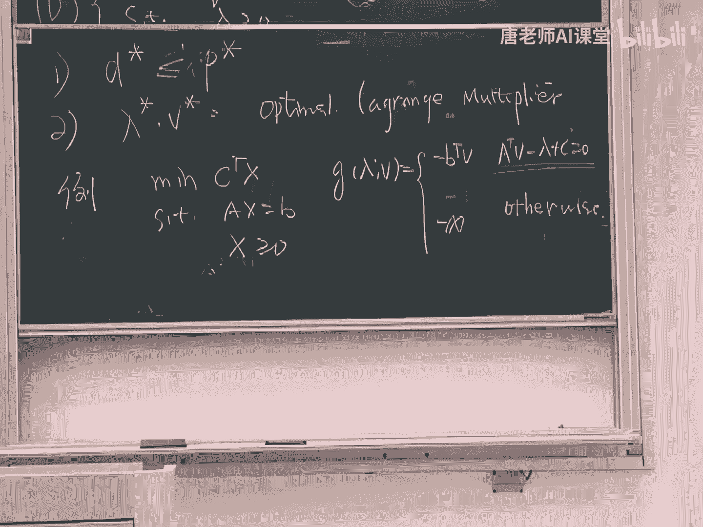

那么这样一个式子呢，我们还可以再改一下，我们可以把这个这个这个式子啊，我们稍微再简化一下，因为我们讲这样两个约束，实际上我是不是可以把它给拼到一块去对吧，这个约束中间是有个拉姆达大于大于等于零。

然后这个中间是有个拉姆达这一项的，所以很显然我可以去搞出一个什么东西呢，就是A的转置乘以V，加上C是小于等于零嘛对吧，所以这个约束啊是等价于这样的东西的，小于等于零对吧，这个拉姆达拉姆是加的吗。

哦抱歉写错了，好这边应该是减了嘛，好那么同样的我的这样一个目标函数啊，我也可以给变一下，我的这样一个目标函数也可以变一下，就是去maximize，我去maximize这个东西呢。

实际上就是等于去mini这个BTRANSLV，对不对对吧好，但是这里要注意一下，这里要是这里有个小细节要注意一下啊，就是我们讲这个原来这个问题，这个这个原问题，它的这个最优值P星是等于这样一个对。

对偶问题，它的呃抱歉，就是它的这个最优值P型，一定是大于等于这个这个问题，它的最优值地心对吧好，但是呢现在这样一个问题啊，这个就弥漫的这个问题是不是就不大一样了，对吧，这两个问题是等价的，等价是什么。

等价呢，就是它的这个我求出来这个V是等价的，并不是说这样一个函数值是等价的对吧，这是唯一一点小的区别，就是你们要记住这个这里面这个这个地，这个地心呢就跟这个就跟之前这个问题，这个地形是不一样的。

最优解一样，但是最优值是不一样的，因为这是两个不同的问题，好这个例子我们先把它给丢在这里，但是我们还要再讲一下，就是原来这个问题啊是一个线性规划的问题吧。

这个这个这个目标函数，这个等式约束，不等式约束都是都是线性的，那么下面呢我们变成这样一个新的问题呢，它仍然也还是一个线性规划的问题。

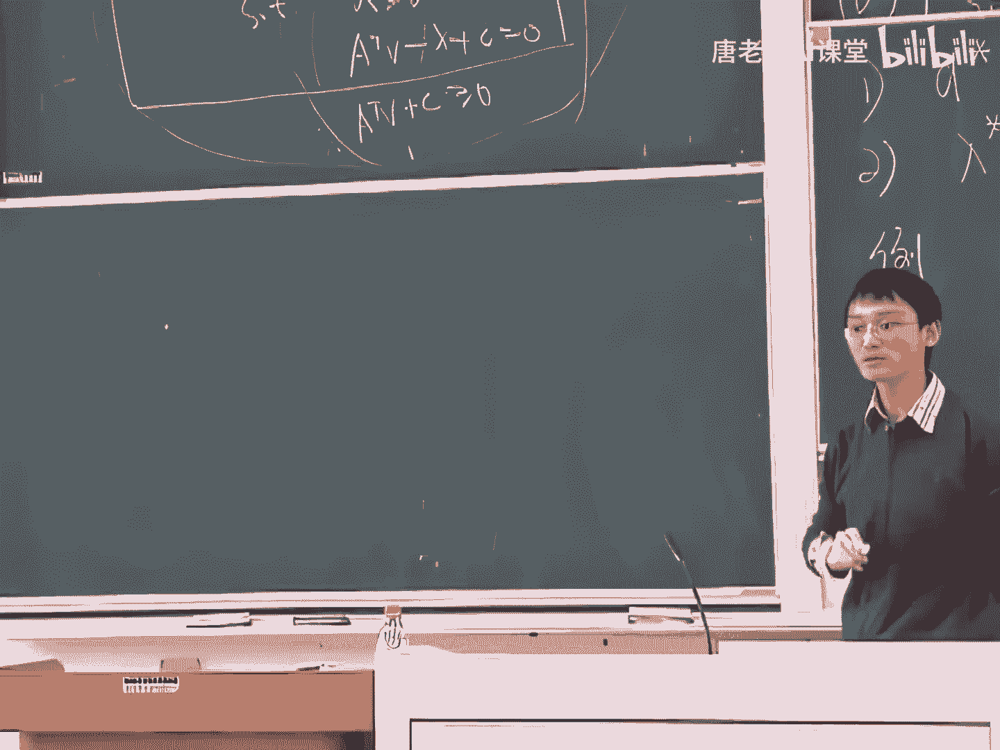

那么现在呢我们来考虑另外一个，另外一种形式的线性规划问题。

它的对偶函数。

我们来考虑这样一个这样一个问题，它的这个它的对偶函数和它和它的对偶问题，同样的我还是可以把他的这样一个，把它这样一个拉杆函数给写出来，那么这边呢这个函数实际上是这边这样一个，不等式约束的函数啊。

实际上是AX减B小于等于零，所以呢我这里引进了一个拉杆，日韩这样一个拉杆身子叫做拉姆达拉拉，这个拉杆层次去对他去做个内积，然后呢我再把这个跟X相关的这样一些像啊，把它给并到一块去。

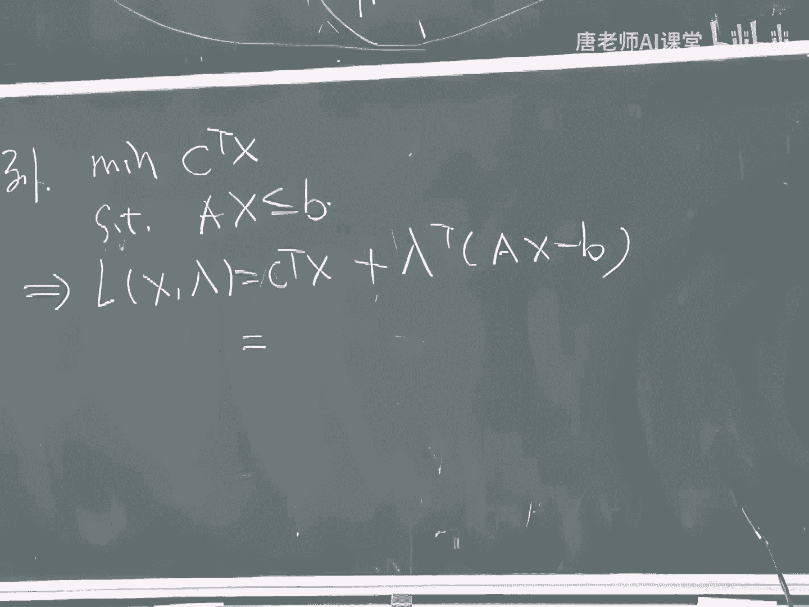

好实际上是这样的式子，那么怎么去求这个对偶函数，应该很清楚了吧，同样的它还是分两种情况，第一种情况就是，如果这个这个a transport lambda，加上C是等于零的话，那么我的取值就应该等于负的。

B和拉姆达的内积，第二种情况就是如果这个东西不成立的话，那么它的取值就是负无穷，只有这两种情况好，那么跟上面一样，我还是可以去写出来，这样一个根据这样一个对偶函数啊，去写出来他的都有问题。

是不是就完了，这问题是不是就完了，没有吧对吧，一定一定千万别忘了，还有个拉姆达大于等于零这个约束，如果你有不等式约束的话，你的对偶问题里面一定会有这样一个约束的好，实际上这就是我们的这样一个不等式约束。

实际上这就是我们这一个都有问题，那么有有同学可能就会问了，你做了半天，做了两个这个线性规划问题的这样一个，这样的队友问题，这有什么意思对吧，你做一个不就完了吗，那为什么我要做两个呢，因为我要讲一件事情。

首先呢我们来看一下上面这样一个，我们看一下上面这样一个问题啊，我们把问题重新写一下，怎么去写呢，我们把上面这个问题这个X换成拉姆达好不好，我们把上面这个问题X换成拉姆达，可以吧，好我可以这么去做吧，好。

那么你看看这个形式和这个形式是不是，是不是挺像的对吧，为什么挺像，我来写一下啊，上面这个式子是等价于去minimize，这个B的transpose，B的transport lamba吧。

然后constraint呢有这样两个constraint，第一个呢就是这个第一个是什么东西呢，就是这个负a transport lambda等于C，第二个呢是lambda大于等于零对吧好。

那么这个呢就是说我们看啊，这个问题的原问题，和第二个问题的这个对偶问题，它的形式实际上是一致的对吧好，我们再来看一下啊，那么这个问题这个问题他的表现是这样的东西，那么它的对偶问题呢。

他的这个文件是这样的式子，是去是去minimize某个这个某个B的TRANSLV，然后再加上这样一个约束，再加上这样一个约束好，那么我就把他的这样一个对偶问题给写出来，但是在这里面写的时候呢。

我把这个我把这个这个这个B的transport，我把它给稍微我把给稍微改一下呃，呃抱歉，我把这个V啊稍微改一下，我把这个V呢就改成X好了，可以吧，我可以把这边这个对文件，这里面这个V改成X好。

你看改完之后，它的对偶问题是什么样的，比如说我把原来这个问题叫做叫做P1吧，这个问题P1这个问题，那么它的对偶问题呢叫做第一，失去它的目标函数是去minimize。

这个B的x constraint是什么东西呢，是这个这个A的TRANSPX，加上一个C是大于等于零的，这是我们的，这是我们的第一对吧，好我们P1在这里，我们的第一在这里，那么我们的这个P2在哪里呢。

P2在这里，P2我是去mini这个东西，然后有这样一个约束，那么我把这个式子再改一下，这个问题是我们的P2吧，好那么我们的第二在哪里呢，这是我们的第二，我们来看看啊，这个P2和我们的这个第一。

它的形式实际上是不是一模一样的对吧，但是我换了几个东西，就是把上面这个B啊，把目标里面这个B换成C了，然后把这个A的transport换成这个负A，然后呢这个C呢换成B了对吧，就这么一个变化吧。

三个换了三处地方，也就是把这个把这个A和B把，把那个把那个B和C给换了一下，然后把A呢把这个A的和负A呢给换了一下，这么去换的，那么我们再来看一下啊，这样两个东西，这个P1和D2他们是怎么换的啊。

他们也是首先也是这地方，也是把这个B和C去换了一下吧，好这边呢是把这个A和负A的换了一下，也就是说把这个A的transports，和负A换了一下吧，然后我又把这个B给换了一下吧，好我们来看啊。

这里面可以看出来什么东西，就是P1P1这个问题，它的对偶问题的对偶问题就是它自身，P1的它的对偶问题，的对偶问题就是它自身是不是可以理解了吧，我中间就是无非就是换了一下嘛。

我把我把那个外几个符号换了一下吧，你们不信可以自己去算一下好吧，这个可以作为一个课后的练习去算一下，你看一下，你首先呢先对这样一个问题，对于P1这样一个问题，他的这样一个原始的问题啊。

对于P站有原始的问题，你去求一个你去求他的队友问题，求完之后呢，你再对这个队伍问题再去求个队问题，你就会发现仍然就会回到他自身了，人就会回到它自身了，好那么问题就来了，是不是对于任何的问题。

对于任何的问题，他的他的队友的问题，队友问题都是他自身，是不是对于任何问题，他对我对我问题的问题都是他自身，这个事情呢，我之前在讲这个讲函数共轭的时候讲过吧对吧，就是函数的共轭的共轭。

是不是还是等于它自身呢，是不是的吧，为什么，唉因为函数的工作一定是一个凸函数吧对吧，一个函数共轭它一定是个凸函数，那么你的你的共轭的共轭呢，也一定还是个凸函数，但是你原来这个函数不一定是个凸的对吧。

很简单嘛，你对于现在这个问题的话，对于我现在问的这个问题的话，你把这个函数这个字换成这个共轭这个字呃，换成这个换成问题这个词不就完了吗对吧，原来这个问题是，如果原来这个问题它是个凸问题的话。

那么它的工作，它的这个它的对偶问题一定是个出问题吧，我们讲对偶问题一定是个出问题，那么他的队伍呢也还是出问题凸问题啊，凹函数凸问题对不对，因为我是极大化一个凹函数，在一个这个突约束底下了。

所以他必然是个凸问题嘛，所以呢一个一个问题的对偶问题，的对偶问题一定是个凸问题，那么如果原问题不是个凸问题的话，那么它们两者一定不等价了，好所以这里我又留下一个谜团，就是那么到底在什么情况底下。

它们两者是等价的对吧，在什么情况下，它们两者是等价的，这个是一个非常非常重要的一个一个概念，就是他们的等价性，如果你们我们来设想一下啊，原来这个问题啊，我们还是从这个线性规划这个角度去理解。

原来这个问题呢是一个关于，比如说关于一个N维的这样一个向量，X这样一个问题，那么它的约束呢底下这个约束太简单了，这个不等式约束太简单了，我们先不管，那么这样的等式约束，实际上它是一个P尾的等式约束好。

那么我们要记住，这个东西是一个是一个N维的问题，但是它的约束是个PV的这样一个约束，那么我们再来看一下这个问题，看一下他的这个队友的问题，好这个问题呢它的这个它是什么样一个问题呢。

它的这个它的这个约束啊，我是应该看看一下这个P1对吧，看下这个第一好，我们来找一下这个第一在这里好，那么这个问题里面这个X是什么东西，这S的维数实际上是多少位呢，P为对不对对吧，它的维数。

它的尾数是跟这个B的尾数是一样的吗，B的维数是多少，B的维数就是我刚刚讲的这样一个，是是P维的吗，我有P个等式约束，所以呢这个地方是一个关于P尾的一个问题，那么它的这样一个它的这样一个不等式。

约数是多少位呢，不准约束多少维，尾数跟C1样对吧，好C的位数跟什么一样，跟这一样吗，C的尾数是跟是跟这个一样吗，所以C肯定是个N维的对吧，好C是个N维的，所以呢也就是说啊，原来这个问题。

它原我们的原问题是一个是一个有pig约束的，有pig约束的，这样这样一个这样一个这个N维的优化问题，那么现在我这个问题就变成了一个，有N个约束的P位的油耗问题了，就是这是不是刚好就是所谓队友的意思对吧。

队友就是刚好对上了，你把这个N和P和P和N给换出来好，那么我们想啊，就是如果我们原来解决问题，我们原来解这样一个问题，那么它的这个它的最优值呢是一个P星，那么现在呢我能够解答一个问题呢。

有一个这个问题呢，假设我能够使得这个假设，我能够使得这个P星是等于地心的话，那么这岂不是一个很好的事情，对吧啊，那也就是说我原来解答一个问题，我可以得到一个一个最优值，那么新的这样一个问题。

那我同样可以得到一个最优值，如果他们两个最优值相等的话，那么我岂不就是可以从中间去，发现一些比较好的性质了吗，那么这个呢就是我们下节课要讲的，另外一件事情，就是这个这个解这个原问题和这个解。

这个都有问题啊，在什么情况下，我们能够使得这个P型和D型是是相等的，这个问题和我之前讲的这个问题，本质上是一样的，我们讲我们留下两个两个两个名，第一个名字就是什么时候P型等于地心，第二个时候呢。

就是就是什么时候这样一个这个原文，就是一个原问题，它的对偶问题的都有问题，还是它自身我们这这样两个谜团，我们下节课都会给揭晓，好。

