# 【蜂鸟量化交易训练营】第二期 Demo Day - P1 - Hummingbot中文官方频道 - BV1Tm2wYkEr2

大家好，欢迎来到风鸟量化交易训练营，今天我们的主题是训练营的demo哦，对这期内容，我们邀请到了一些哈密巴的爱好者呃，来加入参与我们最佳策略的投票，首先我介绍一下今天的主要内容，一个是策略演示。

还有就是最佳策略投票，还有我们这一期期课程就接近尾声了，然后我来说一下接下来我们会做什么，啊这是今天这个最主要的内容，就是我们学员写出来的策略，当然有一些同学可能因为工作实在太忙，或者是额外出旅游。

还没来得及提交作品，你可以在我们下一期训练营的demo day之前提交，然后这样也是可以的，好接下来我们来逐个演示一下这几个策略，首先是我们的a as策略，我介绍一下这个a as的这个做事策略吧。

这个其实是，但是我看HOMEPOD以来啊，就一直想要这个自己实践一下，测评自己这个数数学不太好哈，所以说就呃最开始其实这个HOMEPOD这块，也是从这个做事策略啊比较吸引我，然后我对这些做事这块。

就感觉这个方式挣钱的方式非常的特别，然后就一直在看这块东西，然后啊从这个纯作室，然后看到这个a as，包括也这个参加了胡一博，他本身的那个呃付费的那个录屏的培训，然后这块的话他其实是就是说做事。

他的呃核心的赚钱逻辑是说，我其实是通过在这个市场上，订单簿上去进行一个挂单，然后去这个买方卖方都去进行挂单，然后通过这个价格本身的这个游走，去把它两边的单吃掉，去赚这个非常微小的这个价差。

它的核心逻辑是这个，但是这个呃就衍生出来这个值呃，最基础的逻辑就是纯纯粹的这个啊，PMM就是纯做式的这个逻辑啊，纯作式的逻辑呢，它简单来讲就是说我根据这个订单部，我算出一个MPRICE。

一个这个中间价买卖的这个最中间的这个价格，然后去两边去非常均衡的去挂单，比如说我的中间价额上浮1%，我去卖挂一个卖单，下浮1%，去挂一个买单啊，就通过这样去进行一个这个最呃，最呃简单的做事。

然后a as是个什么东西呢，a as啊，其其这个名字名字我不太会读啊，这是实际上是我记得好像是个挪威人的名字啊，然后他的这个做事，他其实是说呃，他想要优化这个呃PMM，就是这个最普通的这种做事。

它里面的一个最基础的假设是说，我的价格游走是一个泊松分布，然后呢，呃我能不能在这个呃这个纯粹的这个做事上，我通过移动这个就是这个挂单的这个报价，去更好的去这个控制他的，这个就我的这个库存风险啊。

因为做事的话就是通常来讲我们是这个啊，百分之就是比较通常是50%的B，50%的U嘛，就大概是这样的一种方式，或者说当然换换了其他市场也是一样，就是50%的现金和，50%的这个持仓对。

然后然后AS想要做的就是说，我通过这个调整这个买卖，挂单的这个和这个价格的这个间隔，然后去使得我能够更呃减小总体的库存成本啊，达到一个降低低风险的目的，嗯然后这个对，然后然后这块我可能我我有一个比较。

就是我我目前理解啊，就是我我会这个泊松分布上，其实这个价格博送分布上，我有一个比较形象的比喻，就是我会觉得说这个资产啊，就是这个价格本身，它更就像是一个游走的乒乓球，然后其实他的这个呃买卖。

这挂单就像是两块挡板，就是我们实际上是希望，就是说这两块挡板是始终把这个球夹在中间，然后让它不断的去击中这个上下挡板，但是他如果朝一方偏的时候呃，我们希望对这个挡板的这个。

这个和这个球的这个距离有所调整，对这个是我对AS的，这个算是他的这个公式的一个，直观的一个感受对，然后它本身的这些假设的话啊，我就我就不一一介绍了，就大家可以看一下就行，我目前实实现了一个版本的。

是说就是说AS它是它它的最原始的公式，是有一个，这个就是有限时间版本和无限时间版本，然后我我我是呃，尽可能因为我朋友确实最近加班比较多，然后就只实现了一个比较简单的，无限时间的版本。

然后也只有一个交易队，然后一个买单和一个买单的这样的情况，然后去实现去在这个呃，原来去把这个相当于原来的这个huming bot，它的那个season版本的那个AAS策略重新呃，写写了一遍，写成了这个。

就是这个目前这个继承这个script，strategy base的这个版本对，然后呃这里面呢，它其实就是说呃从这个参数上来讲的话，它就是通过这个调整这个啊风险因子，然后和这个额订单尺寸，以及它的这个。

通过这个它的这个应该是叫波动率的估计，通过一系列的这个数据去啊优化啊，从这个从最原始的那种平衡的挂单状态，去把它优化成为一个呃偏移的挂单状态，使得这个随机游走的价格，在游走的过程中。

能够呃更好的命中我想要的那个单子，就比如说我让他更容易命中卖单，或者更容易命中买单，就是让一方的这个挂单更靠近这个中间价格，从而使得它更容易命中对，然后但AIS也不是万能的，就是呃所有的做事策略。

所有的做事策略都会有一个问题，是说，就是说呃所有做的策略都非常喜欢，这种震荡的行情，就小幅震荡的行情，这样的话就类似于刚刚那个乒乓球的比例，但我可以不断的让他去击打上下两块板子。

然后我就可以吃到中间那个价差，但是中式策略就是as这种策略了，哪怕是as他也会非常害怕这种单边的趋势行情，因为单边趋势行情，你的啊成交的单子是和这个趋势是相反的，比如说呃这个趋势是一个上涨的趋势。

那么你的成交单子永远都是卖单，这样的话其实就是一个不太好的情况，有可能在这后面，就是说如果在这个基础上想要进一步优化的话，就可能是一个是添加一些额外，就是额外的止损就算的条件。

然后还有就是说可能要通过这个订单部，去挖掘一些挖掘一些因子，去做一个趋势上的预测，通过这个趋势上的预测，和这个结合a a as的这种订单啊，这个AS的这种方式的挂单的调整啊，是是指得就是说啊。

我即使在有一个单边行情波动的情况下，我能够尽可能啊减小我的这一个单边，连续一直在持单的一个情况，对呃大概就是心里了。

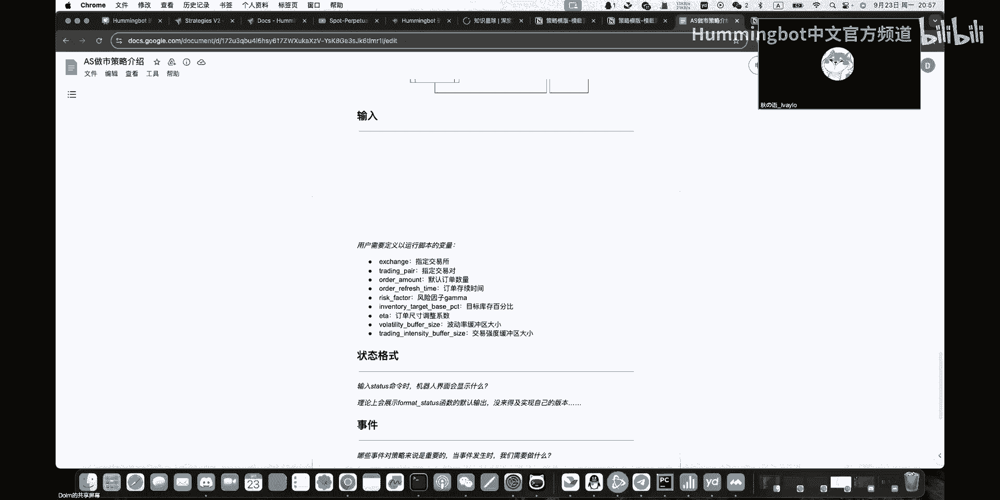

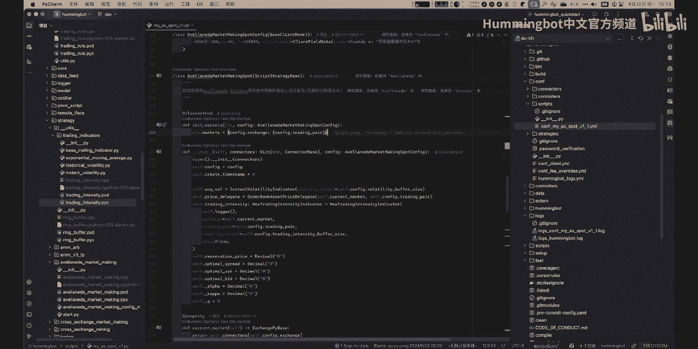

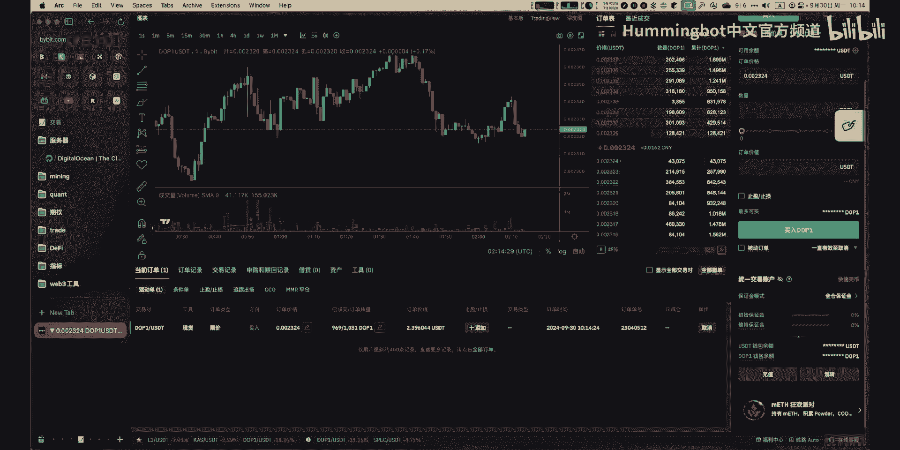

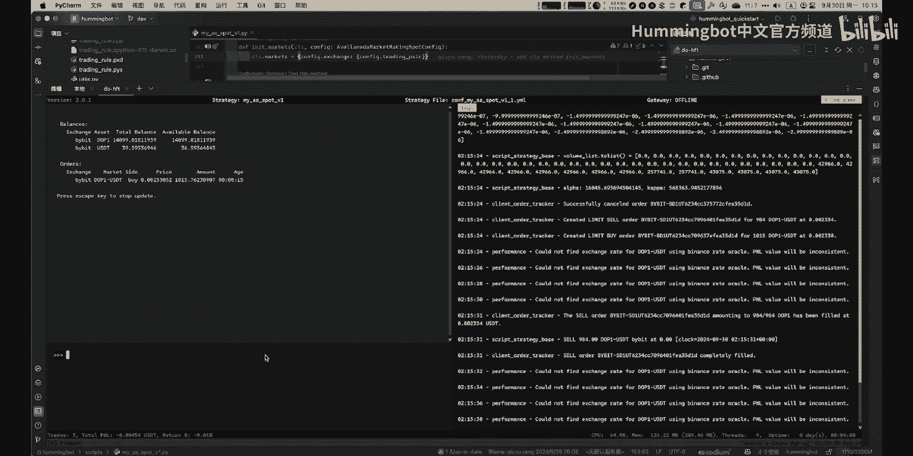

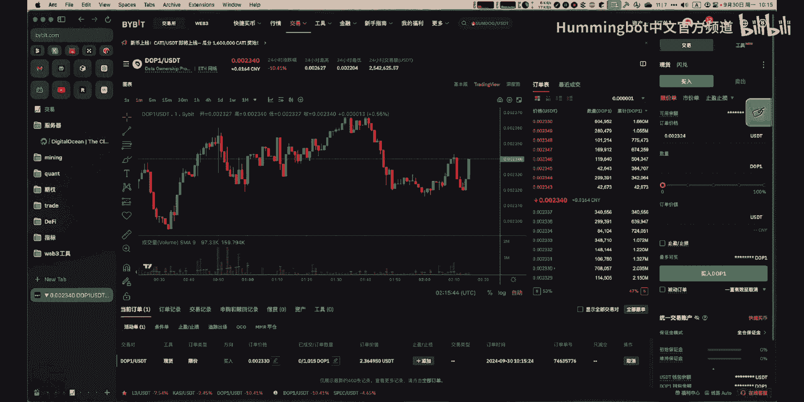

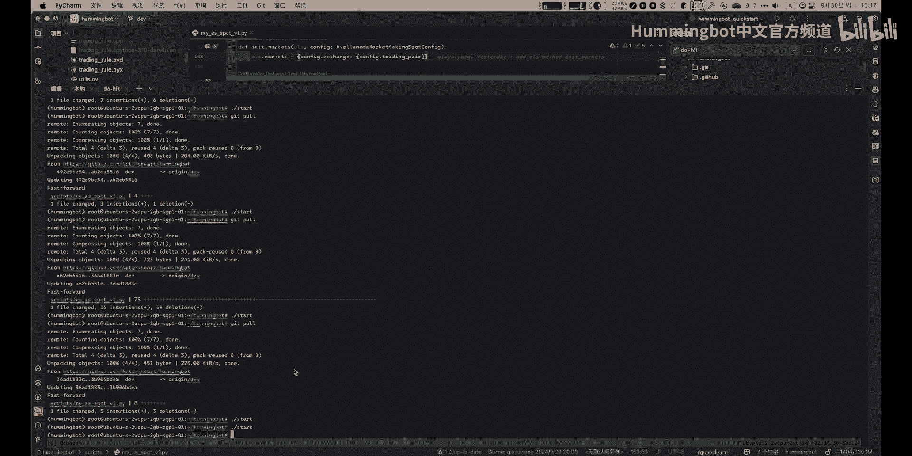

啊接下来是我们的横截面动量策略。

额hello，大家好，我是仙人掌呃，今天由我讲一下我的策略呃，我的策略是横截面动量策略呃，这个策略的目标是通过做多，未来可能上涨更多的币种，做空未来可能下跌更多的币种额，获取阿尔法收益额。

策略的优点是通过多空头寸对冲，获得选B阿尔法收益呃，缺点是在牛市绩效可能不如纯杯策略好呃，这策略假设一个币种在价格上涨后会持续上涨，在价格下跌后会持续下跌，即马太效应呃，这个策略会选币安的永续合约。

所有币种作为币池，每一小时根据动量因子在选B池中做多空，选B啊，选B之后呢进行多空对冲的操作，下单呃，每一小时依据最新计算选币，进行调仓及仓位再平衡呃，达到出厂过滤条件后，会拉黑币种N个小时呃。

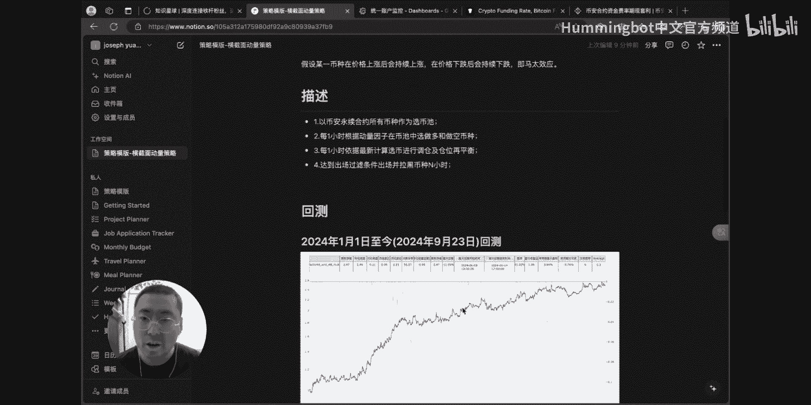

回测呃，我给看大家，我给大家看一下呃，在0。3倍杠杆，即如果说有10000U只用3000U交易的话，呃从今年年初到现在，净值大概是2。47，大概是赚了147%这个样子呃，最大回撤是11。09%。

就是在这一段6月3号到呃，6月14号这一段呃，这个策略如果从21年进行回撤回呃，大概是会赚30~40倍，最大回撤大，最大回撤大概是呃30%这个样子嗯。

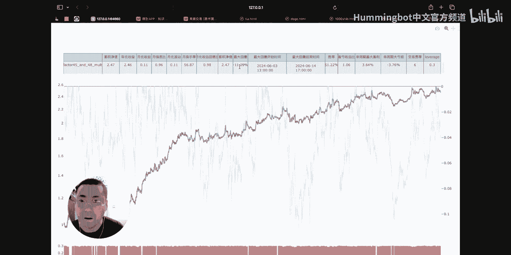

那我们接着看一下策略的介绍呃。

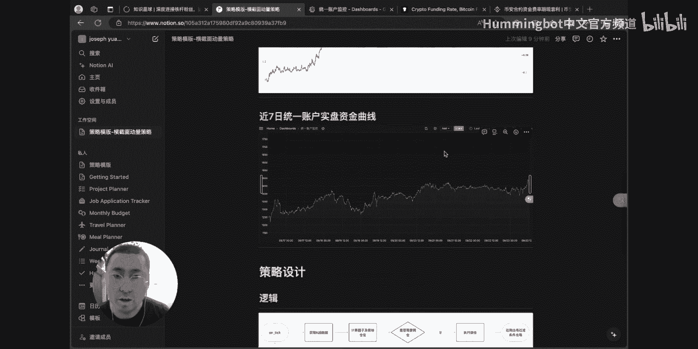

这个策略呃都是在on ticker呃函数中运行，首先要获取K线数据呃，计算因子，计算目标仓位呃，判断是否需要调仓，如果不调仓，就会在下个teacher呃，在运行，如果需要调仓，你执行调仓呃。

达到出厂过滤条件之后呢，会出场，然后再到下一个ticker函数运行的时候，就下一个interval才会运行呃。

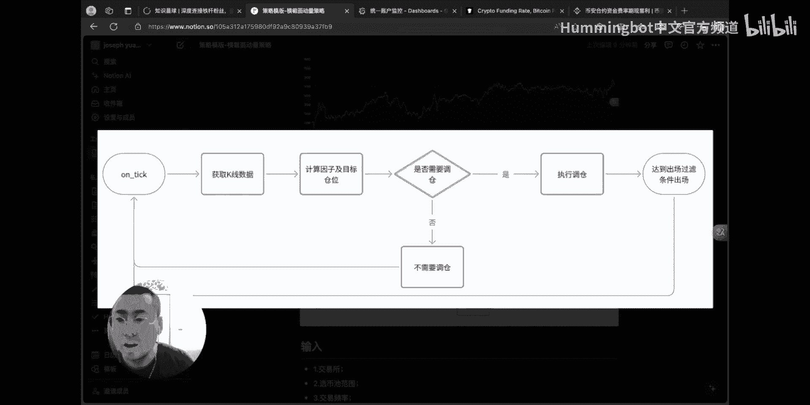

输入有额交易所呃，悬臂池的范围呃，交易频率，当前11小时悬臂因子和呃出厂的因子呃。

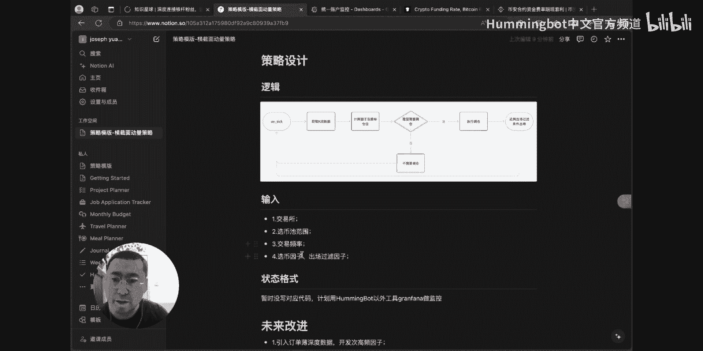

我们来看一下代码里边呃。

实际上就是呃这里interval就是呃一个小时嗯，然后实际杠杆倍数这里可以调整，然后额这里还有一些呃细节上的一些参数，比如说最小下单是5U，现在是必然的，交易规则是这样的。

除了几个比较大的BCPH索罗纳等等呃，其他的都是至少交易无忧呃，再有就是呃leverage就是杠杆啊，界面设置杠杆是五倍杠杆呃，然后其他的额就没有什么参数好介绍了。

然后呃这是一个唯一的scribe的呃策略脚本呃。

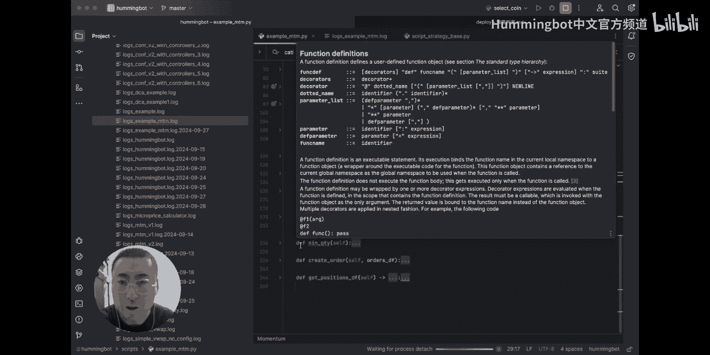

那我们看一下运行呃，额首先我已经我已经在额已经打开了额，我的呃哈密bot，现在我我给他重新运行一下，呃我们这个呃现在呃现在已经启动了，用一下密码，呃输入密码之后呢，呃我们启动一下我们的策略脚本。

Start，我们策略就已经启动了呃，我们可以看到是，这里已经开始拿这个K线数据了，啊并且有这个买卖订单呃，呃大概就是这个样子，这个呃策略脚本。

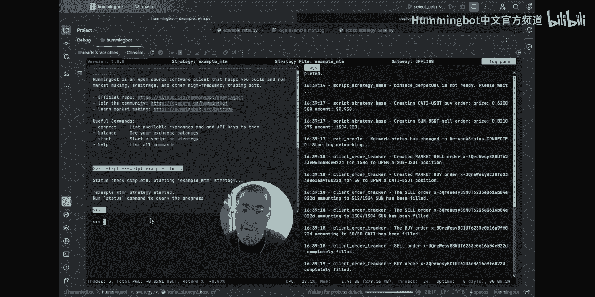

然后我们来看一下我们的，这个这个这个状态呃，状态我没有没有写在这个HABT这个工具里面，我自己写了一个green farma的呃，这个工具呃大概就会这样子啊，它会显示我的额当前的额账户。

然后当前的这个这个持仓啊，对呃大概是这个样子，还会显示比如说净值曲线啊之类的对吧，然后呃这就是我的啊，整个横截面多空对冲的这样的一个策略，呃，那么这个策略其实呃还有很多的不足呃。

未来改进点可能有几个方面，这里只列出一部分，就是未来我可能会获得订单部深度数据之后呢，会写写一些高频因子，或是呃有一些呃对于拆单的功能会写一些，其实我们的那个ham bot v2版本。

也有这个TWP的菜单功能，我后边可能会写一个VR版本这个样子，还有就是其实呃我们的选碧池呃，可以做的更优呃更小，这样的话我们的寒冰bot呃，在更小的B10的情况下可能性能会更好，呃大概就是这个样子。

呃这就是我的横截面多空对冲策略啊，谢谢大家。

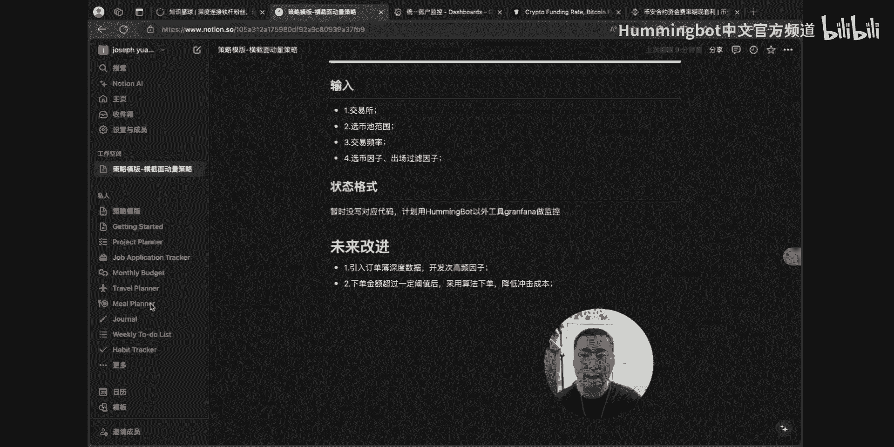

接下来是基于情绪的定投策略，接下来我来介绍一下这个基于情绪的定投策略，这是我们呃第一期的一位学员提交的策略，他没有呃提交视频，然后我就是帮他讲一下这个策略对，首先这个策略就旨在利用市场情绪波动。

进行交易，当期货市场的价格，相对现货市场显示恐惧情绪时，策略会买入资产，当显示贪婪情绪时，策略会卖出资产，其目的是结合市场情绪情绪，进行聪明的定投策略，可以看到这张这个这个定投策略。

也就是说呃我们说的DC a策略，然后他会在额就是固定的间隔，去额买入这个比特币，然后最后最终实现一个这个橙色这条线的一个，平均价格对，然后这个策略其实是就是增加我们在，这个均线下方买入的次数。

然后减少在这个额均线上方额买入的次数，让这个这条均线就是更低了对，然后下面有一些呃理论支持，就是有李笑来说的，让时间陪你慢慢变富，还有巴菲特说的，别人恐惧我贪婪，别人贪婪我恐惧啊，对，然后下面就是这个。

合约价格和现货价格之间的差异，可以反映反映市场情绪，当合约价格低于现货价格时，市场情绪倾向于恐惧，投资者可能更倾向于抛售资产，当合约价格高于现货价格时，市场情绪倾向于贪婪，投资者可能更倾向于额追涨。

对就是它相当于一个择时的这个定投策略，然后下面是策略描述，它会监控这两个市场，比如说呃必然的现货和额永续合约市场，然后定期比较一个这个交易对的价格差异，计算市场情绪，当市场情绪为恐惧时。

就是取消之前的订单，然后进行买入，当市场情绪为太难时，就取消也取消订单，就就呃然后进行卖出嗯，在两次加单下单之间设定一个最小时间间隔，防止过于啊频繁的交易，我这边也做了一个呃这个比特币的一个回撤嘛。

没看到他的这些绿色表示额买入，然后红色这里是卖出，就是它比起上面那张图来说，就是他会嗯这个买卖会就是更更有选择一点，就是不不单，不只是简单的按照额时间间隔来去呃，做定投，然后大的一个这个定投比特币。

就是过去一年到现在的呃，总收益就是也是100%多一点，他的最大回撤是啊，这个34点多了对，想得看到这个策略的一个设计的逻辑呃，的一个流程图，然后他开始就是先判断你是否达到交易间隔，然后如果是的话。

就是获就是获取这两个市场的一个价差，然后计算情绪值，就是如果小于恐恐慌阈值，或者是大于贪婪阈值的时候，他就会呃做一些不同的动作，然后就是不断的去做循环对，然后下面是这个策略需要输入的一些啊参数对。

就是一个是交易所，然后学校交易的交易队哦，订单类型还有这个额恐恐惧和贪婪的这个阈值，还有下单的金额呃，时间间隔，然后这个是格式状态，这里会显示当前的一个市场情绪，然后显示这个合约和现货价格，还有些呃。

其他的信息，对他最后是一个这个称谓的这些事件吧，就说价格更新时，它会啊去重新计算这个市场情绪，然后再去做一些相对应的动作，还有就是啊订单完成或取消时，它会嗯去更新这个订单的状态。

或去呃这个更新和这个持仓的状态，就是确保订单不冲突，对，大概这个就是一个这这个策略的一个，实现的逻辑吧，那我我也去呃测去测试一下这个定投策略啊，这这边有一个这个定投的计算器，然后他我们简单的用。

大概跟刚才那个策略相同的金额嘛，就我们额可以是比如说啊过去一年来呃，每周定投额200USDT，然后到，就是呃到10月1号，然后这个得看下这个定投的结果，对呃呃去呃。

去年一年来这个比特币是相当于是一个这个，呃震荡震荡上行的一个走势啊，所以这个收益大概就是嗯，接近30%的收益，对，OK这就是这个整个策略的一个完整的介绍，啊最后是我们嘉宾提交的统计套利策略。

Hello，大家好，我是WILFRED，之前参加过哈密报bot cam的一个学员，那之前我在哈密报bot cam里面，我就是做了这个statistical arbitrash的这个策略。

中文就叫统计套利，那统计套利呢，它其实是一个paris trading的一个嗯策略，那就是说你在两个不同的交易币，同时候买多和卖空，然后啊寻就是寻找机会套利，那他其实也是类似一个均值回归的一个策略。

那这个统计套利跟啊传统的套利呢，它是有什么区别呢，就啊传统的套利呢，它其实就啊你必须要是同一个嗯交易币，假设比特币，然后你再不一样的交易所，然后两个交易所有不一样的流动性，然后你再便宜的一边买。

然后再贵一边卖，那统计套利呢你就不不需要这么做，你可以在同一个同一个交易所里面，你用不一样的交易币来寻找，用数学的方式去寻找差价啊，用统计解统计学的方式去寻找它们的共同点，然后啊在里面进行套利。

所以这样的话你的选择就突然间就比较多了，然后你的机会也比较多啊，然后你也不需要有这个，你两个交易币的交易量都可以选择，是交易量大的，这样就方便你的进出场点啊，你就不会有那个好像因为流动性不好。

你的挂单就挂在那里很久了，那这就是是啊统计套利的优势，那其实它也是有风险的，那它风险就是佣金高，其实普通套利也是这样的，有这个高佣金的问题，你的利润很薄，你的佣金高。

那如果你的利润盖概付不了你的这个佣金，你也是会亏损的，那假设说你你用market order来进场，然后你同时候要进两个交易币，然后出场也是两个，那你一个交易你就至少要有0。2的百分，0。

2%的这个佣金，然后呢，其实呃这个嗯statistical arbitration，它很讲究这个COINTEGRATION，就是这个中文叫写整，那所以呢他其实也某个程度也是需要看方向的。

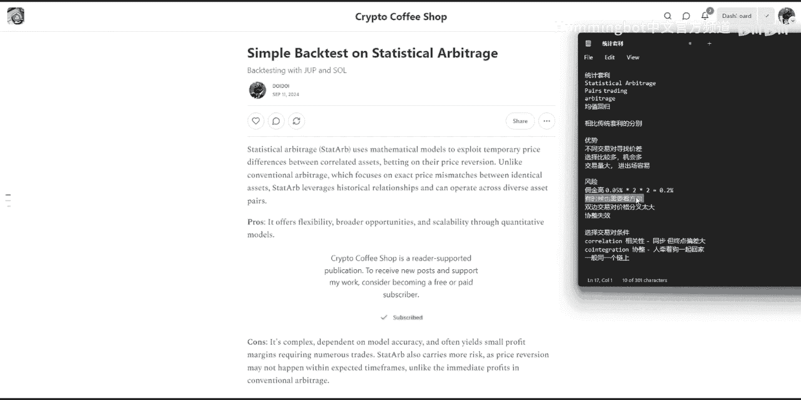

呃怎么说呢，OK那这里我们可以看到两个交易，B1个手拉哪一个JUPITER，那COINTEGRATION它就是它必须要有会有交叉的时候，那怎么说，就是有时候啊JUPITER呃波动高过索拉纳。

然后有时候它是低过手拉的，那在这里它会有一直有交叉的时候，那在这些交叉的情况，你就是有很多套利的机会，或者这些呃价格扩展的机会，然后它又变窄这样子，那这些都是套利的机会呃，但呃风险在于。

当两个币假设两个币，你假设你是在在这里做空索拉拿，然后你做多这个，但是做空这边他往反方向走了，然后你的亏损就多过你的盈利，那你在这边如果你在这里出厂的话，你也是一个亏损的情况，那也是风险啊。

你是他两个币都往不是你要的方向走的话，你就会有这个亏损亏亏损的情况。

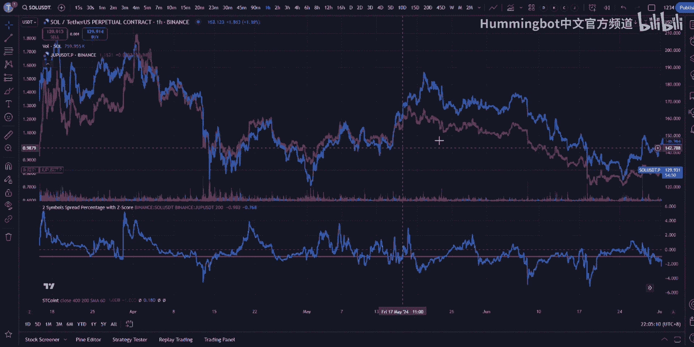

刚才我有提到这个学者，COINTEGRATION是一个在统计套利里面，一个非常重要的一个一个一个因因素，那通常人家是选有讲关于这个correlation和，Cointegration。

correlation是相关性，那相关性在这个statistical arbitr是用不到的啊，先解释什么是相关性吧，相关性就好像两个人在走同个方向，一个老人，一个年轻人，虽然大家都走同个方向。

但是年轻人走比较快，所以呢在长期呃长时间过后的话，他们的那个差距是会越来越大的，假设说比特币和以太坊，虽然两个都是往在上升趋势，两个都一样涨的话，但是可能以太坊涨得快过比特币。

那他们的那个分差的那个距离就会越来越远，那COINTEGRATION的话，这就叫写整啊，这个我也是找翻译的，我也不知道对不对，呃写整他就像一个主人牵着小狗，虽然他们那个方向都不太确定。

那狗的一直在主人面前，一直交叉走，但是最终他们还是回到同一回去，同一个家里，就是目的地都是一样的，这个就叫COINTEGRATION，它必须要有一个很多交叉的情况下。

我们才能够达到这个呃统计套利的这个方式，OK那在这边呢，我就做了一个简单的统计套利的一个回撤，Back testing，那这个我在这边就拿了索LANA和JUPITER的。

一个小时的图的数据来做back testing呃，JUPITER是差不多在交易所上面，可能七个月的时间吧，他在合约交易所里面出现，那我我就拿七个月的时间来看，这样目测的话，这两个数据的波动都蛮像的。

区方向都很像，那我们从这里开始，就把他们啊慢慢用呃，数学的方式去找他们的这个啊COINTEGRATION，那从这里呢我们可以看到啊，CLANA的percentage change和JUPITER。

the percentage change u那个timing是很像的，那个时间点都很像，都在同个时间，但是那个波动的大小就不一样了，可以看到JUPITER在波动的时候他比较多，然后索拉A就比较少。

但是也有情况是索拉A比较多，JUPITER比较少，但是时间也很像，那在这里的话我们可以看到呃，如果我拿这个volatility做一个均线的话，我们在这里可以看到啊。

大多数JUPITER的那个波动是比较大的，volatility的指数是比较大的，大过索LANA，Ok，那从这里呢我们可以怎么样去呃，呃是处理这个这些数据。

然后我用的一个方式叫linear regression，在statistical arbitrary，其实有很多方式去做处理这个统计的方式的，有些就用linear regression。

然后有些会用这个啊，除呃这个考虑这个p value t value c value，就是有兴趣更深入去了解，可以去网上再查询更深，关于这个统计学的这些指数。

然后有些除了用linear regression，还有些人在用这个common filter来找这个相对性，那我用一个比较简单的linear regression，方式去找啊。

用通过linear regression，我找出这个hedge ratio，Hash ratio，就是说嗯索LANA的价格乘这个倍数，它是一个倍数，他就会接近这个JUPITER的价钱。

然后在在这个他们的君家里面做做这个啊，找这个价差所形成这个spread，那我找到这个spread的话，它就会形成这个图，那刚刚我说统计套利，它是算是一个均值回归的一个策略，那我们就要把我们均值回归。

我们就希望那个价格是不会呃有太大的涨幅度，而且是在一个价格区间里面波动，那就是比较理想的一个交易交易图表，那我们从这里呢spread这个图表，它波动的区间就不会太大，我们就比较清楚的看到。

他就有一个啊简单的波动，他不是说有好像五倍十倍的这样暴涨啊，那暴涨暴跌这样的情况啊，然后呢我们就做一个标准化的处理，就是z score，z score这个标准化处理的话。

它就是找一个一个window的一个均值，就我在这边是利用了24小时，window就24个数据的平均值，然后再找他的啊，叫什么标准差，Standard deviation。

然后这个就是z score的方程式，就把这个图弄成一个标准的图，我们就可以看到啊，基本上它就在四个标准差上下这边波动，然后我们就可以很容易就找得出最大的波动点，一般在哪里，还有最小在哪里。

这样子就比较方便去呃，进出场你就知道那个生成你的signal好额，在这边的话呃，我就以先最简单的一个标准差进场啊，进场的意思是什么呢，就是我会做多JUPITER，然后做空索拉纳，然后在零标准差的时候。

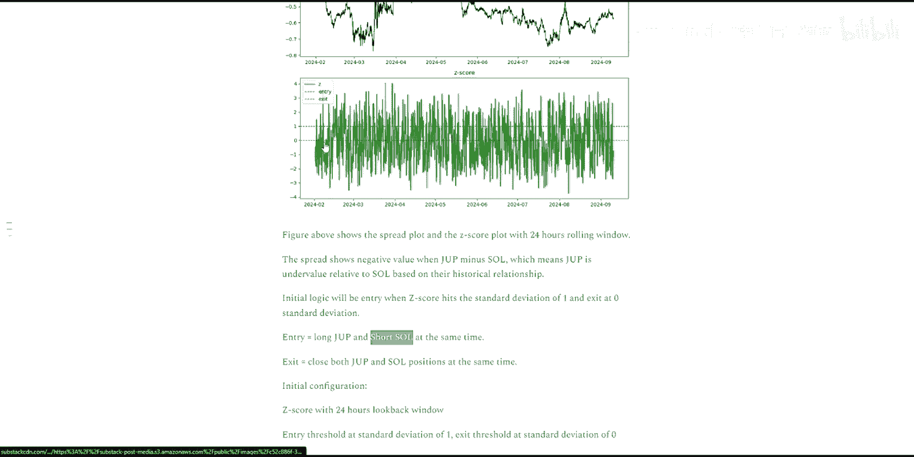

我就把两个关掉好，那就是大概就是做多JUPITER，然后做空进场，就是做多JUPITER，做空索拉纳，假设我就在这这里进场，然后我就等到他们的价格关到一个程度，就是标准差零的时候，两个就出场。

然后就这样套利好，那通过这样的方式，我就先做一个初步的假设，然后进在这边进出场过后，我就有这个曲线图，这曲线图就是timulative returns，就是我们每个进场出场的盈亏，那这边可以看到啊。

盈利的话都是慢慢盈利的，而且比较大的盈利幅度都是在你看这里啊，有很多波动的时候，一直弹动的时候是盈利蛮多的，在这这这种情况啊，但是在大波动的时候是会出现亏损的，就是啊他超过哦那个标准差太多了。

然后就导致这个亏损，这这个回调的亏损是其实也蛮大的，然后我们在这里可以看到那个成绩是差不多，这样子回调127%，这这个是比较简单的一个算法，就是其实已经就爆仓了呃，所以这个成绩其实是不是一个很好的。

那我们要优化怎么优化呢，其实我们可以看两个参数，一个就是这个window，就是刚才看的那个均值要拿多少的，Look back window，还有一个这个标准差的，哪一个标准差进场比较好。

那我就做一个什么叫great search方式来做这个呃，Optimize parameter，那这里我就用这个research的方式，寻找从100window到300window。

还有零标准差到三标准差的区区间，哪一个参数比较好，我就找它的sharp比例，Shop ratio，那在这里呢啊最高是200window，还有这个一个标准差，我就拿到1。96的shop ratio。

那从这边呢除了这个优化之外啊，拿到最高SHRATIO，我还要做一个止损的方式，简单一个止损，那我就用一个三个标准差的当做是止损，就是说假设在一个标准差进场的时候，他去到三个标准差，我是需要出场的。

因为我不要吃到这个呃过于上涨的这个波动，然后再回来的时候在一个标准差进场，然后再嗯零标准差再出厂，那就我就不要受到这个在这里受伤，这个波动太大的时候，我就离场啊，像这个大波动的时候就离场。

离场过后再横盘再重新进场好，那在这里你就可以看到那个回调，就啊得到了一些保护，那你就呃就没有，就不会刺到那么大的这个回撤啊，然后其他呢额比较大的window的话。

你就可以看到那个z score就没那么频密，比较宽松一点，然后交易次数就比较少了，那通过优化过后，那个return就提高了，然后以更少的交易次数，然后shop比例也提高了，那这个只是一个简单的回撤啊。

其实还有就是更多东西要考虑的，那假设说现在，而且这个只是一个单方向的进出场，其实你也可以从这个副翼的呃标准差进场，就是在这里啊做空JUPITER，做多索拉纳，然后在零标准差再出场。

在这一边也是可以做一个策略，然后你就做双边的，然后还有因为就是交易合约嘛，还有就是要看方定瑞，范定瑞，因为有持持有这个合约的话，finding rap有有时候对你是有利，有时候也会让你亏损。

也是一个啊必须考量的一个因素啊，那呃基本上就是这样，那呃过后的话做了这些回撤，我们就可以通过haring board来写一个策略，来进行这个交易，那这个交易的话呃，他必须要有。

因为你同步要同时候要进个进两个交易队嘛，那你手动的话可能就比较慢，那通过哈密board你就可以很方便的，它自动化的在一个标准差，它就自动帮你进两个交易，对你有速度就比较快，好好基本上就是这样。

如果有什么问题的话，可以可以问我好，谢谢大家哦，我因为那个威夫是我们的嘉宾，所以就我们这作家策略是是针对学员的，所以我们但是但是我们就是每个提交策略的，都会给一个这个，这左边就是我们会额送件T恤对。

Fifteen minutes later，你这边动量起来已经超过半数了，那那那就终止投票，这个恭喜这个，变成这样这个最佳策略，那恭喜你，我自己的最佳策略，那你发表一下这个我叫你好的好的呃。

非常感谢蜂鸟量化交易训练营和各位老师呃，在一个月的学习中，我收获很多呃，经过蜂鸟训练营的学习呃，大大拓宽了我的策略思路，让我对以往没有深入研究的策略类型，有了更全面和深入的理解呃。

比如做事策略和套利策略，同时呢，ham bot是一款非常适用于做高频或次，高频策略的开源软件，在这一个月的学习中呢，呃结合前人在高频领域的成果，和我自己在低频交易中的经验，我不断感受低频和高频的区别。

初步具备了在高频或次高频策略研发中，搜集数据，分析数据呃，验证灵感，开发策略和日常运维的能力，呃，这次学习呢是一个很好的开始，为我打开了一扇新的策略类型研发的门，让我从前人的策略脚本中。

学习到了很多优秀的思想，呃相信在入门后再投入一定的实践经历呢，我将在做事和套利这两个方面，也研发出属于自己的优秀策略，从而丰富自己的策略池呃，在这一个月的学习呃中呢，虽然有一定的强度和难度。

但是从无到有的学习过程，是一个非常愉悦的体验，呃也谢谢这一路呃，我们共同的努力前行，谢谢大家，感谢谢，呃呃仙人掌对，确实是我们也是实至名归嘛，这在这个月的这个一路呃，就之前的比如课堂表现啊。

包括这个有一次那个课堂测验呢，确实也是这个成绩最好的对行，那我们看下一个，然后最后我们就是，我还还就是因为这个时间关系，我们本来是有个ma环节的，然后我会在那就这周我把它录好放出来。

对就是有些呃问题的解答，包括最后的一些对这个未来的一些展望，然后，呃接下来我们可能会再办这个，第三期的训练营嘛，然后就是这这期的学员还是可以，就是继续访问我们呃，未来未来的这个这就是直播课的一些呃录像。

然后我们可能会再做一些，多做一些这种呃V2相关的一些内容吧。

对那就感谢大家的参与。

