# 【量化交易】Python入门之数据分析【1／4】｜ 金融工程 量化金融 - P10：5. Python数据分析：Module1-时间和日期 - Devils-Advocate - BV1efHAe2EAR

iphone里面我们会经常涉及到日期和时间，因为我们经常会用时间序列嘛，尤其是在量化中，我们的这个数据啊，它都会有一个时间的概念，它它都会有一个前后。那如果比如说今天的数据混到昨天里面，那肯定不对了。

所以日期和时间非常重要。尤其是对后面大家想用想学习量化，数数据分析啊，都会用到这个概念。那首先我们要干嘛，我们首先要inport的一些包。🎼Data time SDT。

import timeM这边我解释一下import这个概念，呃，尤其是当接触过pyython的同学可能不陌生，没接触过的呢，就是像pyython它有很多三方写的一些代码，它从底层的逻辑开始构建。

那么构建出来一种三方的一个逻辑啊，或者是也有可能是pyython自己做的，它只是没一起放每一起给你打开的时候就给你用进来。不然的话你打开程序不是时间太长了嘛，对吧？所以我们我们用到相关的包的时候。

像这个day time就要就叫包，我们都会需要import一项。那day time这个包我们import过了以后给它重命名S乘呃DT如果你仅用daytime也行import day time。

我现在import成DT下面我。呃，使用这个包的时候，我只要打出DT来就行了。还有time就是TM这样子比较方便。当然如果你呃为了你方便阅读的话，你可以也可以直接inport time呃就行了。

或者是你如果这个名字你可以任意取。但是我们基本上会有些约定俗成的一些东西，比如d time就是DTtime就是TM呃，如果。你对此有疑问，你不清楚，那就你就直接inport data。

只不过你每次都要手敲一遍。嗯。我们首先来看一下。time time这个东西是什么？你看它它是一个长串的一些这个数字，它其实是一个秒述，这什么秒述呢？是1970年1月1号以来的秒述。

就是1970年距今天有多少秒了，这我就不数多几几百万几千万秒了。呃，但是。

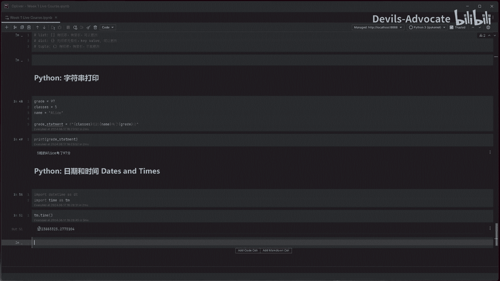

我们就要把它就是转换为我们叫它一个时间戳，这是一个时间戳的概念。我没有把时间戳timet嗯。将时间戳我打一下吧，是。

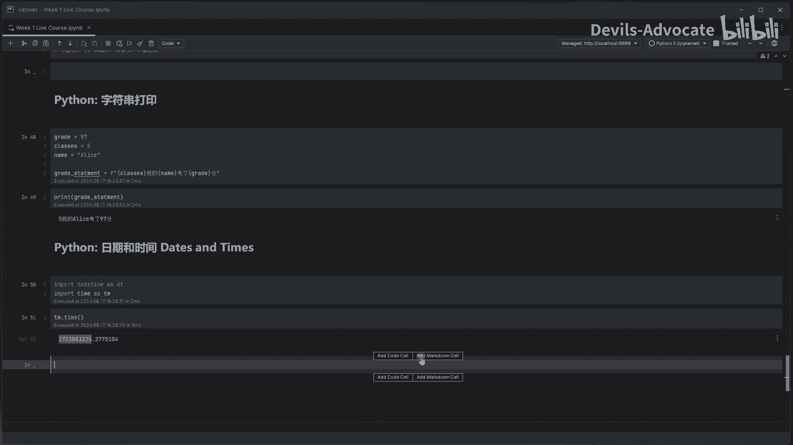

将时间戳。They。timet时间戳叫。转换为。日期时间的。dta time格式，就是我们要能读懂啊，对吧？那所以。now就是day time now。

就我们现在一个什么时间DT这就用到我调用我们上面这个包d time。减 for点from time stamp。然后我再把TM到time塞进来，这看有点复杂啊，我一会儿讲解一下。

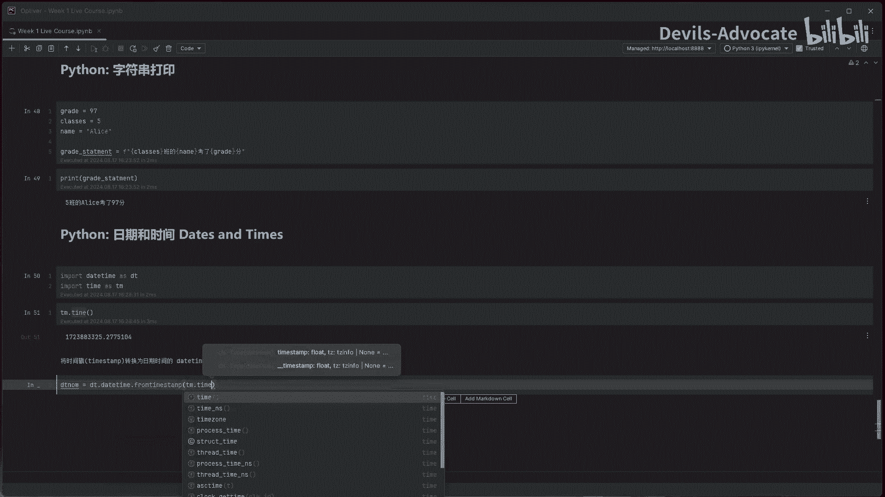

那这就是我们现在的时间，2024年8月17号，然后16时下午下午16点30秒，然后这个应该是多少微秒吧，对吧啊。所以直就是一个转转换。嗯。

首先呢我调用了这个包DT在这个包里面呢呃我们我们后面会讲到对象object，它包里面会有不同的函数啊，就是我之前前面讲的函数啊，functions，就它有一个函数叫functions。

啊叫day time。呃，然后day time下面可能还有一个函数，就它互相嵌套了嘛。呃，函数里面又嵌了一个函数，它叫from time stamp，就是我一层层调用到这个。这个方式，然后呢。

然后TM的time不是这个这个数字嘛，或者是你把它拷拷过来也行。如果你看不懂的话，你把它拷过来。

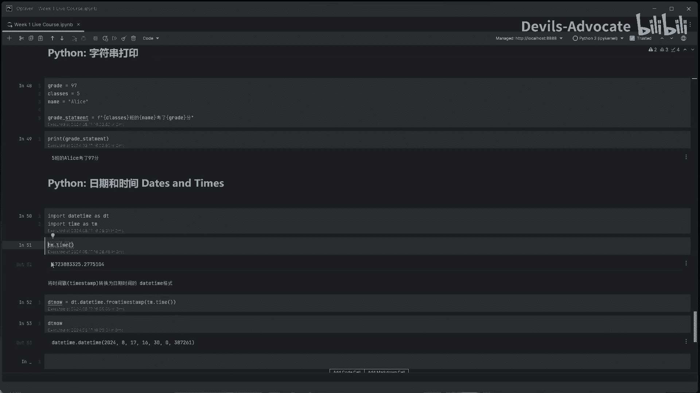

嗯。应该也能给你转过来，对吧？但是我因为没给的是现在的时间嘛，那可能是呃我刚才讲的时候已经过了几秒钟了，几秒钟几分钟了。所以它这个后面的数字不太一样。那如果你每次打它现在这都是现在的时间。

它都会有点细小的区别，那这是22秒，对吧？24秒，你秒数不一样，毫秒数也不一样，所以这个数字啊，这样给搞出来的数字，它每次都不一样的。因为它是一个现在的概念。它会随着现在的变化而变化。

这个点什么点什么点什么。我们会后面学到object的时候，对象的时候，呃，你会学习到。但是嗯如果你还搞不清，你就可以想象成它是呃就是这个包里面啊，它嵌嵌套了很多的子呃子系统。

我调我一直调到从这个daytime这个系统里呢调到这个from timet的这个方式。这个或者说它的一个公式吧。你可以这么理解。然后公式然后我再把你如果你用就是你之前咱不是学呃functions嘛。

我填了一个X和Y进去嘛，就是它的变量，我把这个变量填进去，它就能呃通过一系列运算给返回出一个我现在的时间点，那就是它的daytime到dtime。然后就是一个这样的一个形式。呃。

那所以day time的属性是什么呢？那我们可以有。比如说day time year就就这个东西嘛，就这个反它可以是这是一个变量哈，就它到 year到 month到 day就是年月日1分秒，对吧？😊。

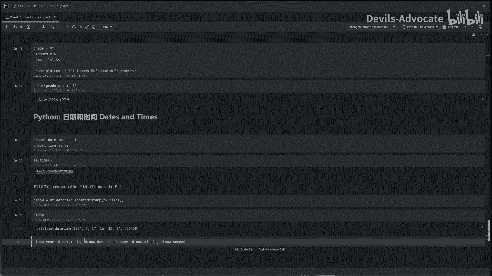

或者是我直接拿出来。2024我直接拿出来当时的一个second，我刚才我刚才是24秒，对吧？这边写对对应它24秒，或者是我拿出来它的分钟。

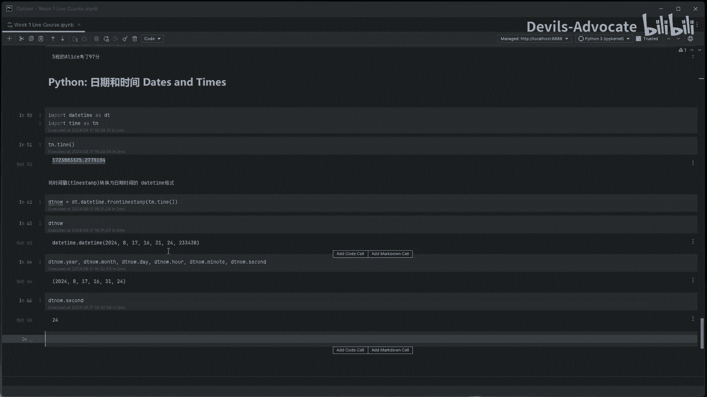

对吧嗯，当然这是一个变量名啊，你可以你可以任意的一个东西。你它如果是X的话，就是33分钟，对吧？呃，当然了。

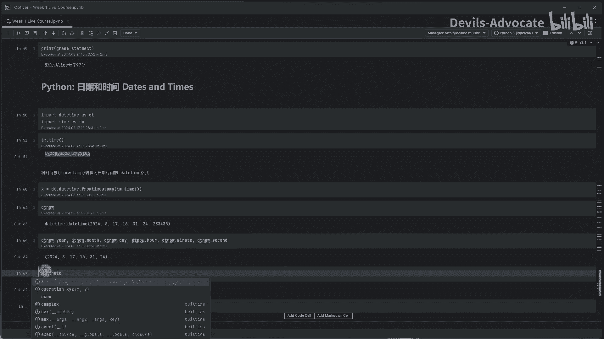

一般呃就是这个变量，我们现在起名就是DT now。你就是在这里我是这么起名的，你可以自己随便改了。然后还有就是。Time deelta。这个是啥？time delta。

就是如果就比如说我想做两个时间的相减。两个日期之间的差异的。

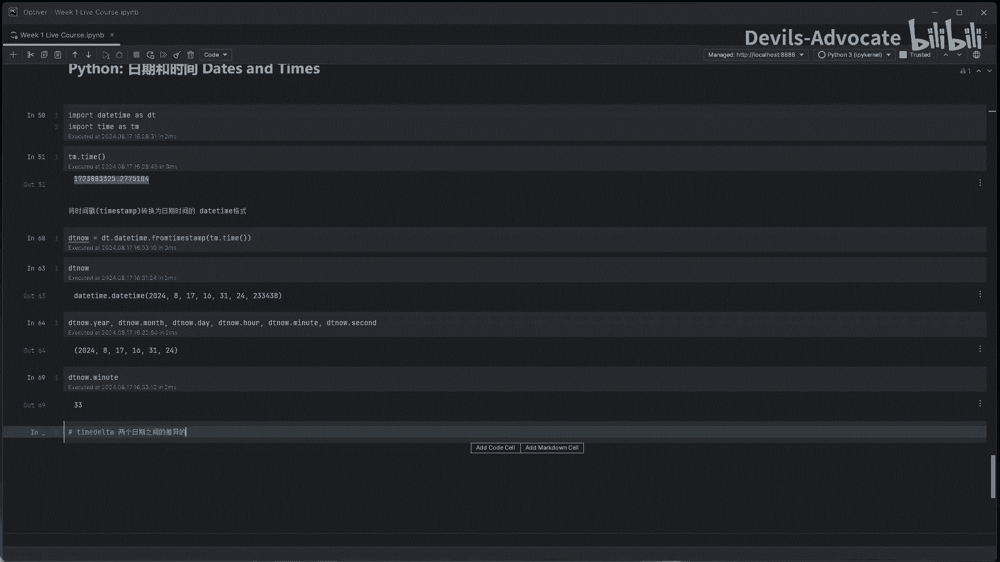

时间就比如说time A减time B呃。然后之间之之间差的时间，我们就叫time delta。DT。Time deelta。Das等于。100。

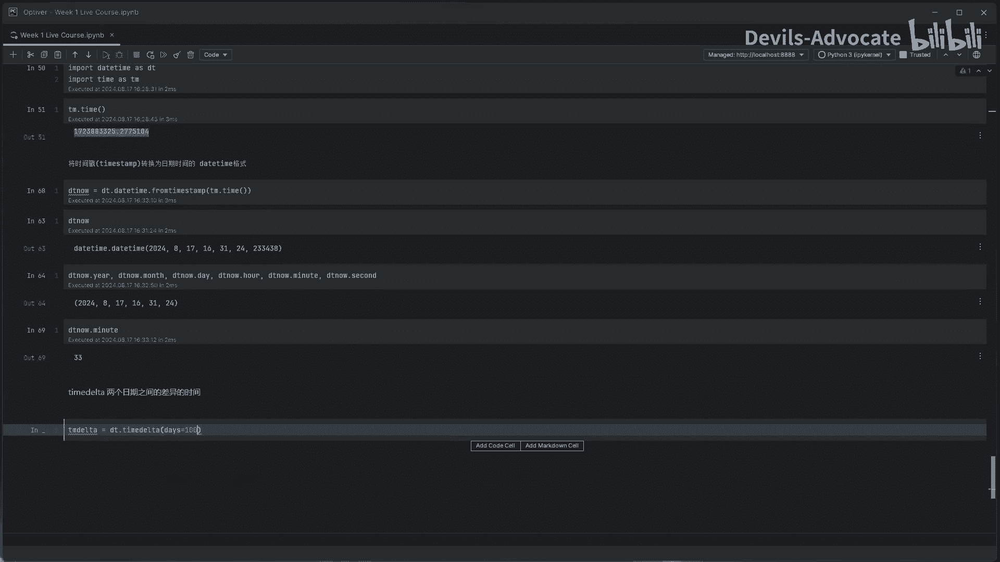

就比如说这样我就可以做时间的加减法。比如说。ow加上100天以后的。时间是啥样的对吧？呃，100天以后就是2024年11月25号了嗯。比如说 hundred days。Have to。能不能这么去。

应该不能把名这个数字放前面，there is100 after。

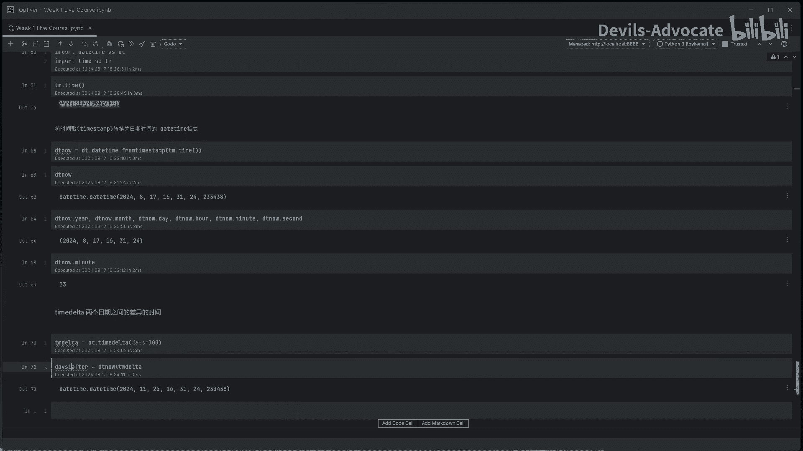

对吧那我就把它存起来了，所以这就是100天以后就这个时间。所以我们有现在的时间或者任意时间，然后我们可以拿time delta来跟它进行运算。呃，如果我只想要today呢，就是当前的日期。

那就是DTdate点。Today。就是当前的日期，我就不往后算具体的1分秒了。还有毫秒，所以这就是嗯。就是只要日期，那我100天之前呢。Timeed out。吊塔。100天之前就是24年5月9号呗。

对吧？3个月之前。那我们是不是可以做一下，再做一下比较，is today。啊，我还没给他复制。today等于。

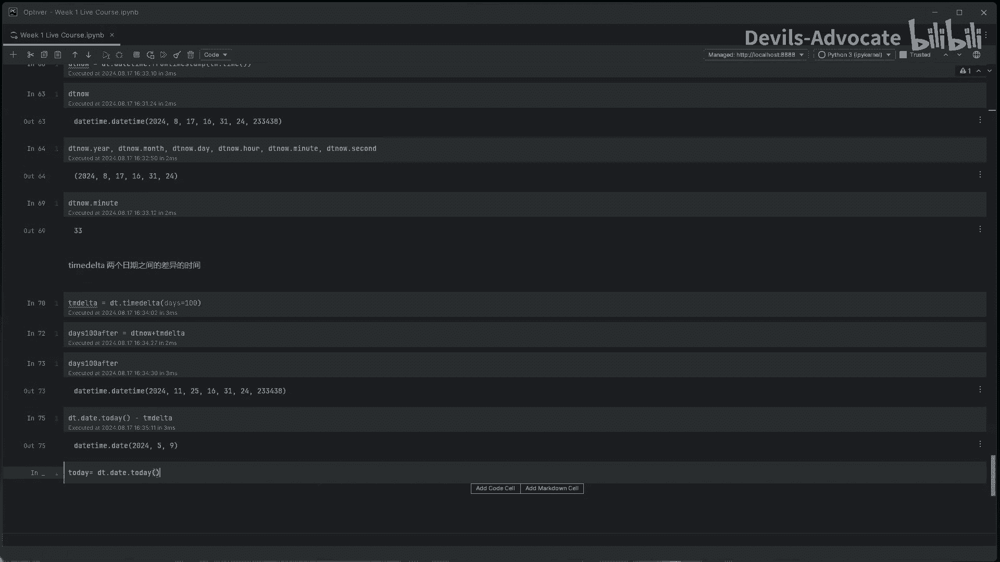

这个。看 down。today就是8月17号。嗯。那today大于。today减去一个time delta行不行？就是我今天是大于我这个时间之前嘛，相当于时间和时间之间做了一个比较true可以对吧？嗯。

因为大家要想到哈，我们我们是用的写的是代码，就是它有些类型之间啊，它不能互相比较。就比如说你 todayday可以跟。😊。

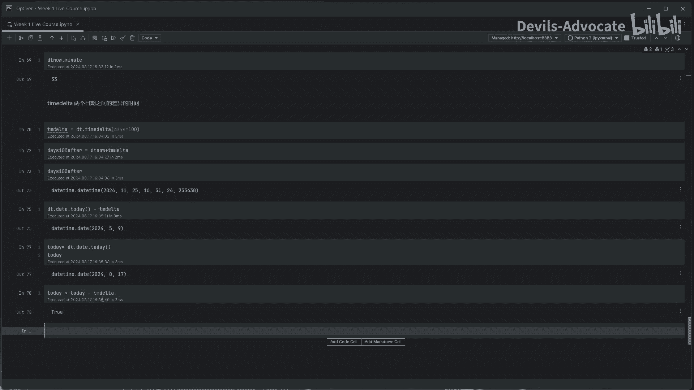

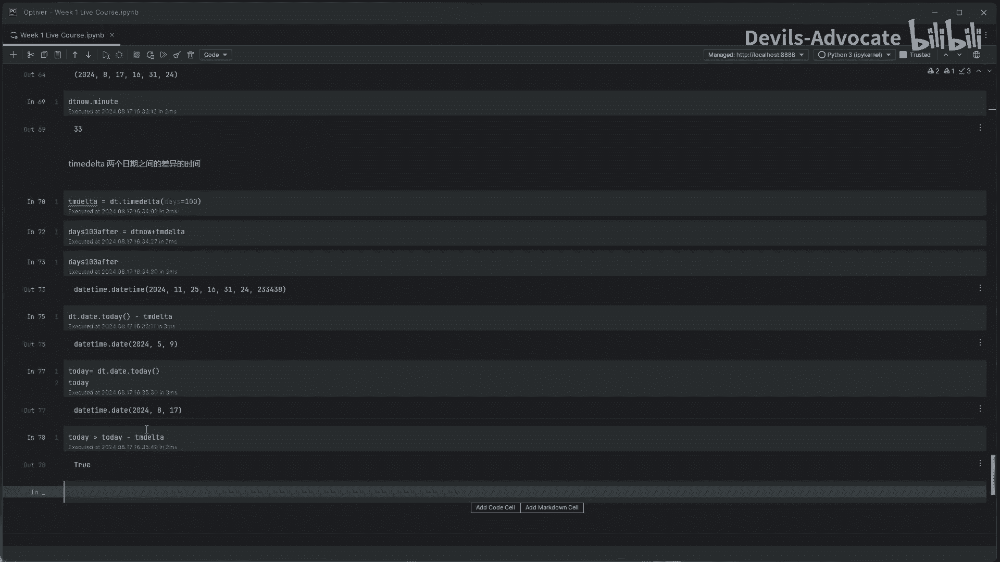

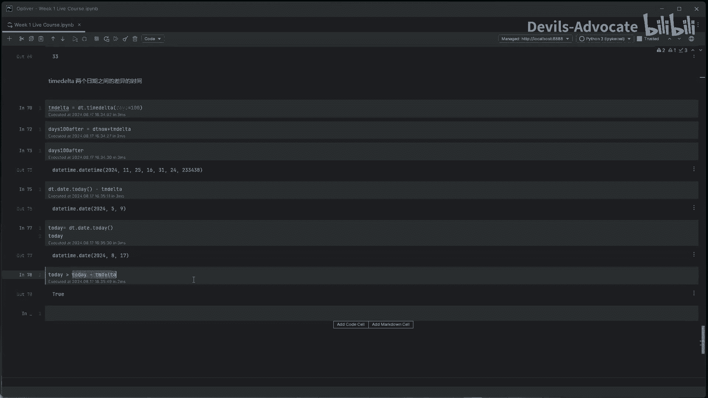

可以跟十比较100嘛比较嘛，那明显是不行的。因为它是一个时间概念，它是100。对吧那可以跟str比较吗？就比如说。

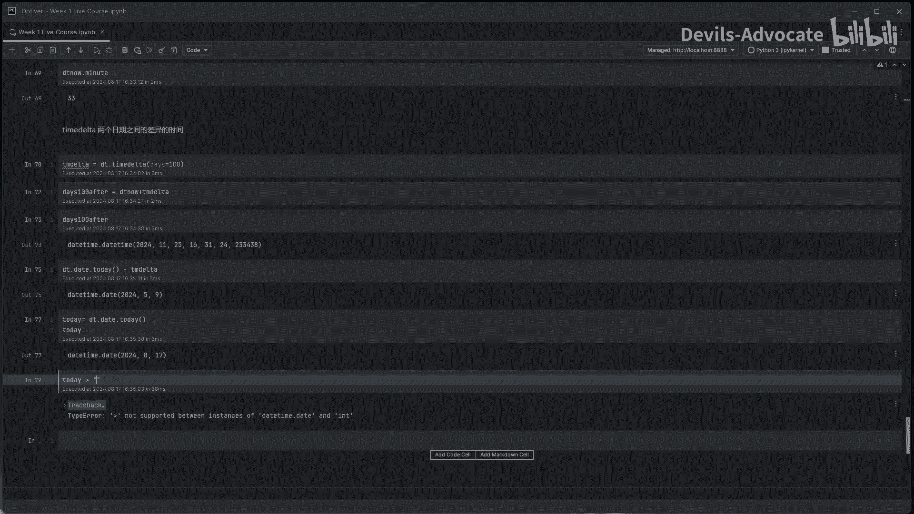

我。随便打的我那也不行，对吧？你不管怎么样，那时间那一两个字符串之间能比较吗？那那也不行吧，你对吧哎。😊。

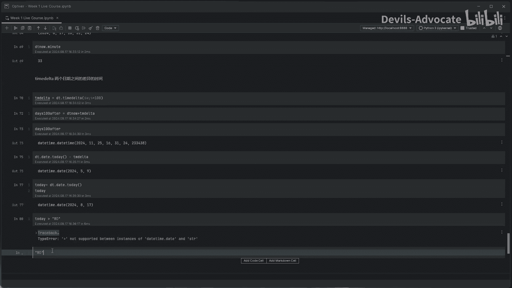

这还真是能比较呢。然后这这这我们不用哈，我我们不这么用，大家就是。呃，这个出乎意料之外，但是大家别这么用呃，那100和99之间能比较嘛？那肯定是能比较的。10101对吧？fas。😊。

浮点数和整数之间能比较吗？也能比较。但是这个和时间之间能比较吗？不能比较，就是100，它不是一个时间概念。你苹果和梨子能比较吗？比较不了，对吧？啊，为什么字符串能比较，大家自己查一下。

这我确实也今天惊讶了一下。

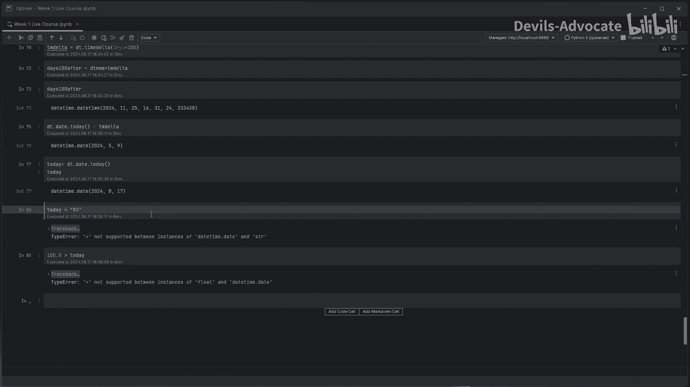

那么这是我们的呃时间的概念。呃，感谢各位。

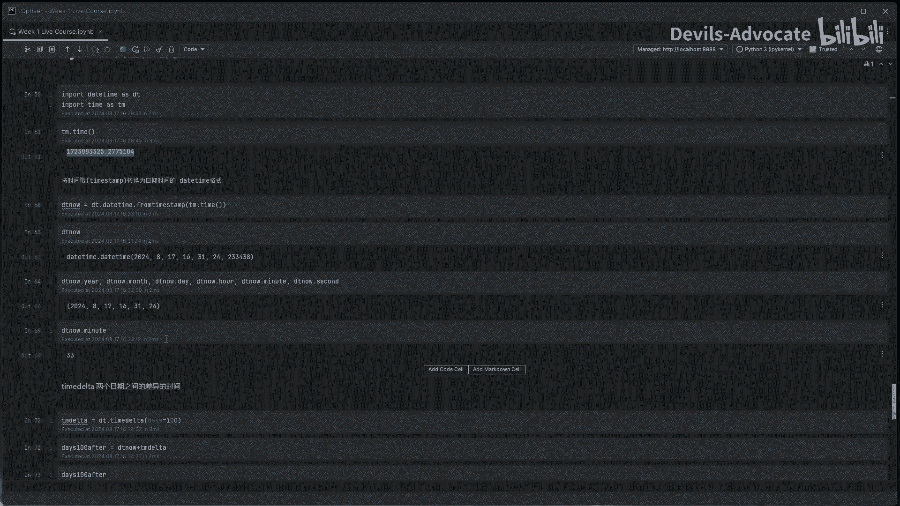