# 【量化交易】Python入门之数据分析【1／4】｜ 金融工程 量化金融 - P12：7. Python数据分析：Module1-map，lambda 和列表推导 - Devils-Advocate - BV1efHAe2EAR

这里我来讲一下map这个功能，就假设我有两个商店store in store，这是他们的价格。那我现在想干什么事呢？我现在想干想比较他们俩就是两两之间的价格哪个大哪个小，对吧？

如果我只要一个store里面的最小的值，我是不是me就行了。但是两两之间怎么办呢？那就要用到一个map这个东西，map。me就是把我们的方法放上去。就刚才我不是用ma找到store一嘛。

那现在也是这个方法，me store一。store2对吧？但是它这个是一个内存地址，这我们要怎么办呢？比如说cheapest。

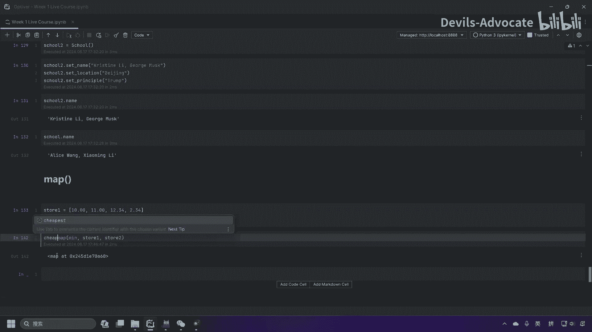

是它是它这仍然是一个内存地址，我们要打印一下，用一个fo loop把它给拿出来。what are mean in。

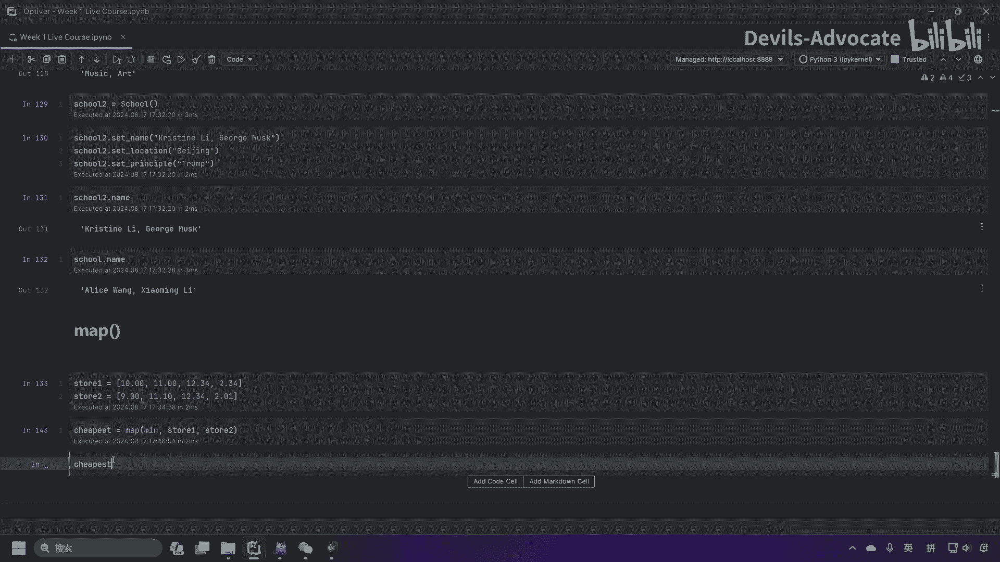

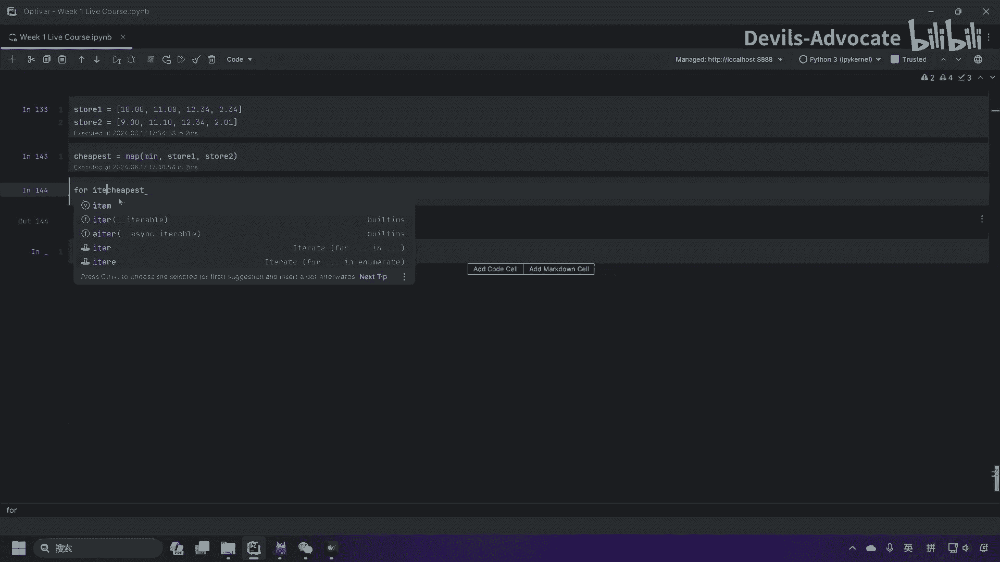

Cheest。Print and。

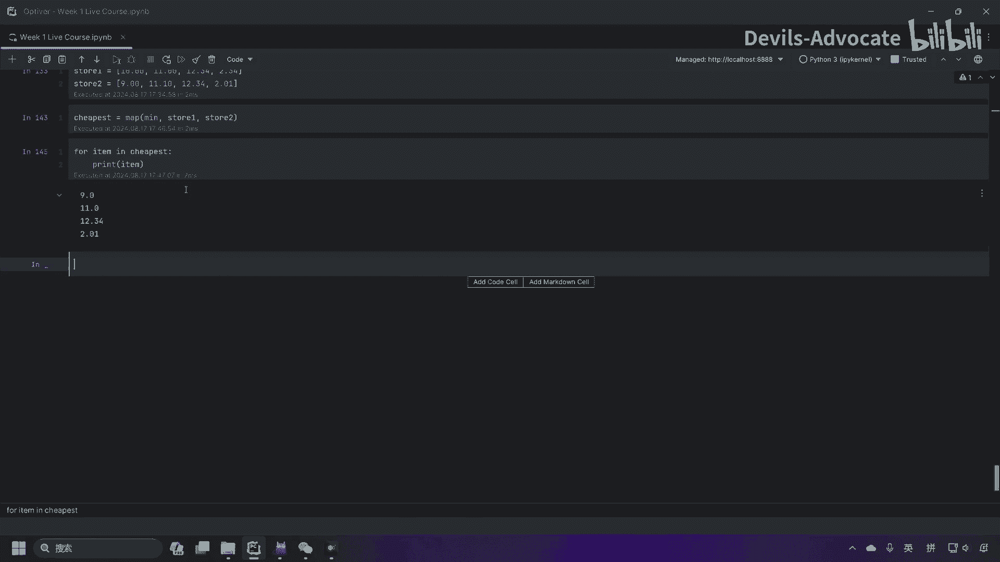

呃，所以这就是每个这两两之间，每个的最小值，比如说这是9，这是11嗯，相比这11。1，这12。34，这是2。01都是拿它最小的值。所以这是咱们的m function。

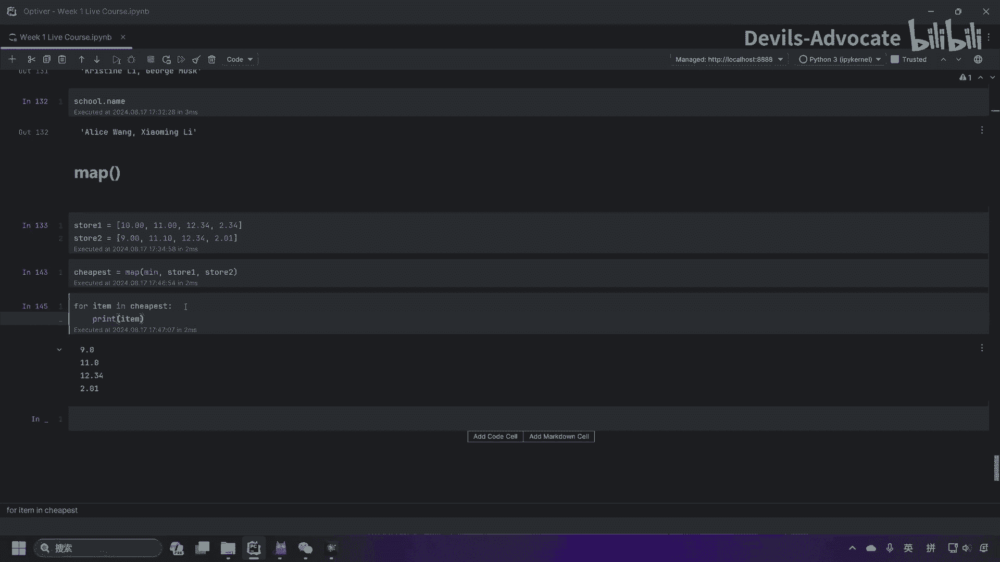

然后还有就是lammbda和。

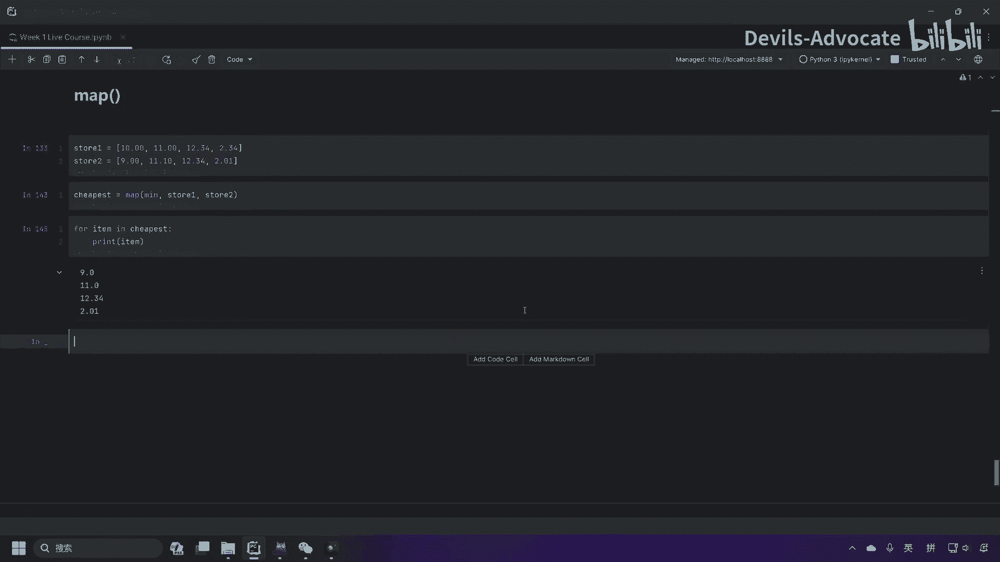

兰mbda和列表推导。这个方这个东西兰姆da是一个什么东西呢？姆呢他可以。呃，就是这个lammbda，它可以考呃相当于一个简化的呃函数。比如说my function。ABC。A加B，那这个干了什么呢？

我拿了ABC这三个变量，但是我要做的就是把A和B相加。对吧那比如说这是我的函数了，myfunction，我现在有ABC3个值1223，那你猜这个得出来多少，那应该是这一对应A嘛，二对应BC对应3，对吧？

那就是一加2等于3嘛，那这个是1，比如说你这还是31加56，对吧？所以这只是加A加B加起来，那那再加C呢？那是不是这仨都加起来了，所以这是一个简化的一个函数。Of。就是这，然后然后我们来做个小练习吧。

因为我们讲到现在大家可能都没上过手，或者是指呃。就是。只做了一些简单的那用你所学的知识，我们有ful loop。我们。A有 list。然后可能还会用到if。比如说我这边。我先给大家讲一下if吧。

这个前面我我可能没提到。呃，比如说if。嗯，A等于3，那我们就print。

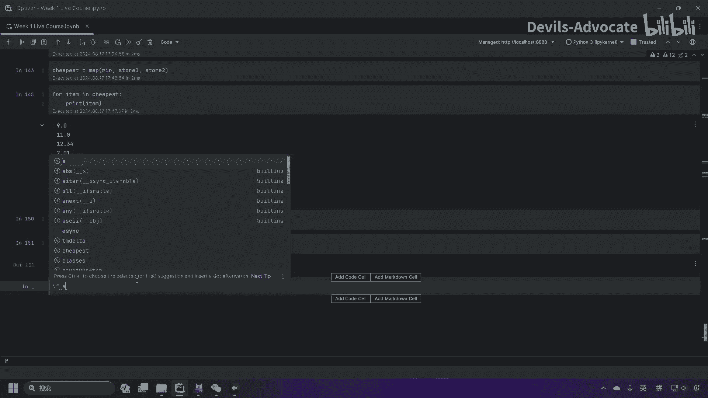

Good。😊，A等于比如说我现在复值0。那我现在啥也没有，因为A不等于3对吧？那如果A等于3呢。

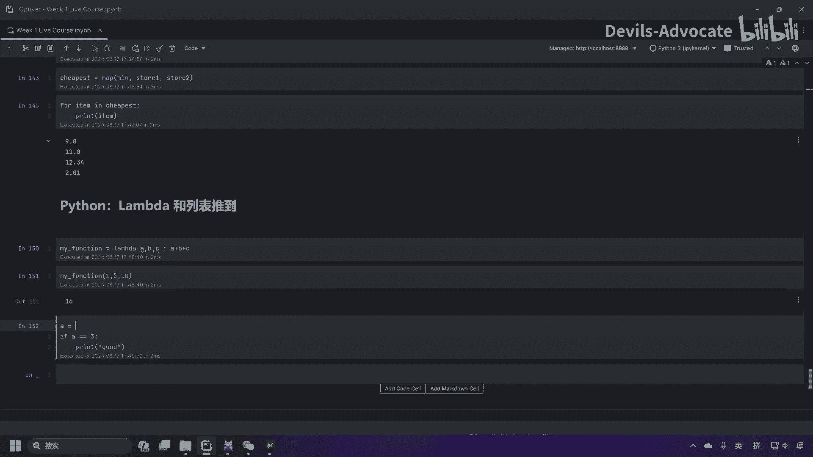

get对吧？这就是if的用法。那现在你可咱有有了这些东西，我觉得你咱可以做个小题课堂练习哈啊。😊，从。用。Your full loop。从零迭代到。99。只返回。返回偶数。这个大家要怎么做？

for loop大家应该。呃，记得吧，那嗯觉得这这里还得给你们一个东西，就是。

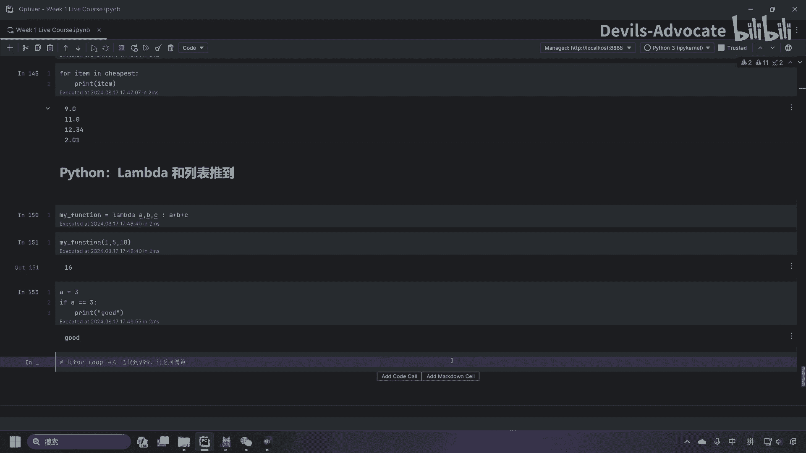

呃，0到99，你你要你要计算这个for loop0到99应该怎么办呢？rangech。0。1000。这是一个。你可以用它来迭代for。嗯50吧。

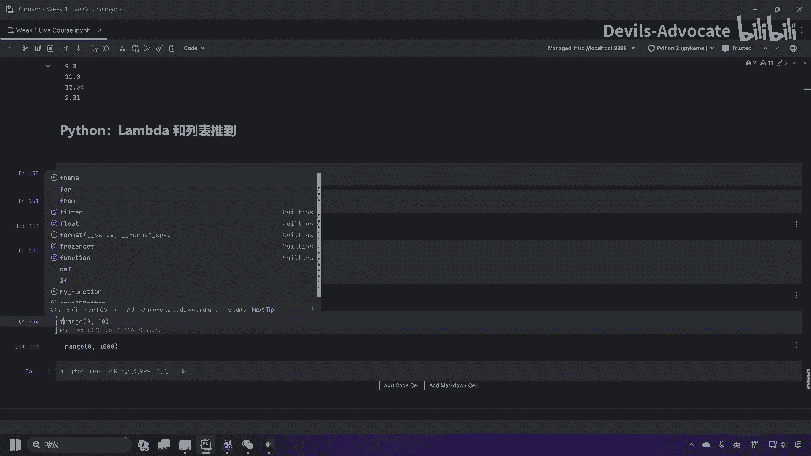

Aイ。

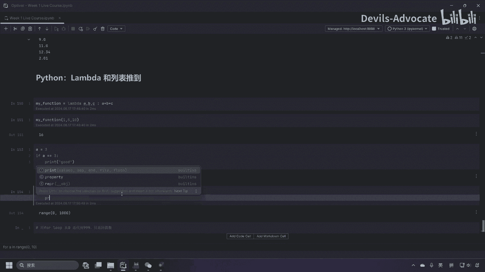

Print a。直接是一个个打印出来了。

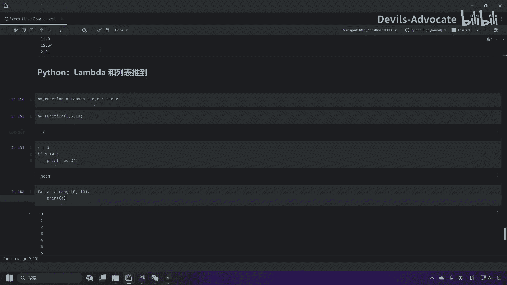

所以。所以这个东西呃可以拿来做题，然后list咱之前学过，你你可能会用到list，然后你还会用到啥啊。

余数，比如说3。百分号。二余一对吧？你怎么判断偶数呢？用了这个我们有for loop。呃，这个是。余数。And对。

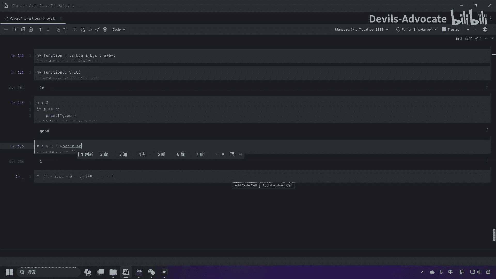

fo for循环。List。包括。我不我不往下详细讲，你有这你有这三个功能，然后哦还if。😊。

这我刚才讲过的。大家在这儿，请你把它暂停一下。然后想一下，从零用使用for loop从零迭代到99，但是咱只打印出来。呃，或者说咱咱存一个只返嗯。将。所有偶数。

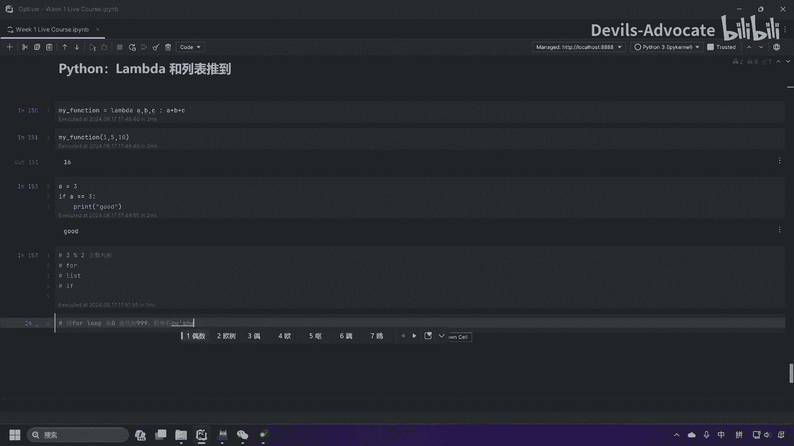

存到一个list里面。大家暂停一下，自己想一下应该怎么做呃。不要在外面查这些足够你用，然后锻炼一下自己的思维能力嘛，暂停吧。好，我现在来说答案了。如果你这个如果你想想没想出来，想出来了也好。

想没想没想出来也好。我们来说一下答案。就比如说我给了下I。List。等于一个这你千万不要用list单独用list，这是一个python，它保留的一个东西。如果你拿这个东东西就是当成变量了。

那你list似的这个函数就这个这个这个这个pyython自带的函数就没法用了。For number。In range。0到1000，我刚才其实都给你去给出来了。if number。Number。

除以2等于0。对吧百分号二等于0，就它余数是零的话，它不就是一个偶数吗？偶数咋判断呢对吧？那我还要那我我我现在拿到这个，如果它是这个数嘛，对吧？那my list我就弄进去嘛？append我们之前学过吧。

No。对吧这样应该mymy list里面就是我所有的偶数了。

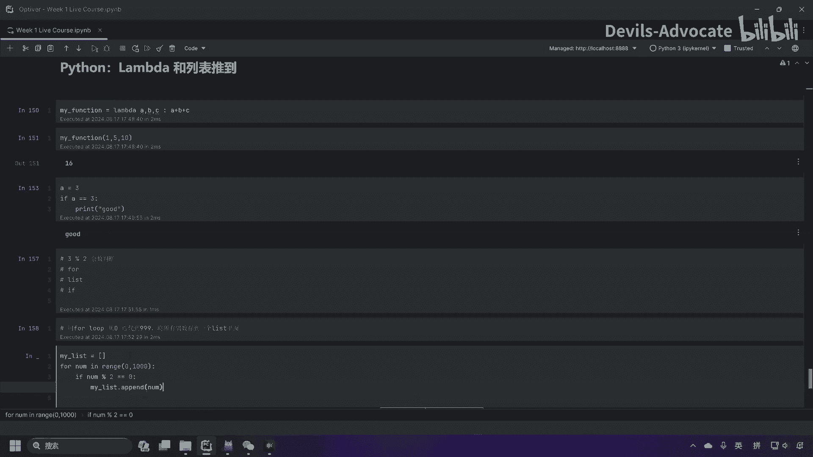

对吧你看下哪个不是要说的，你找我。呃。所以这节课咱可以就到这儿啊，等一下啊，我再讲一下再讲一下列表吧。因为我咱列表推导。

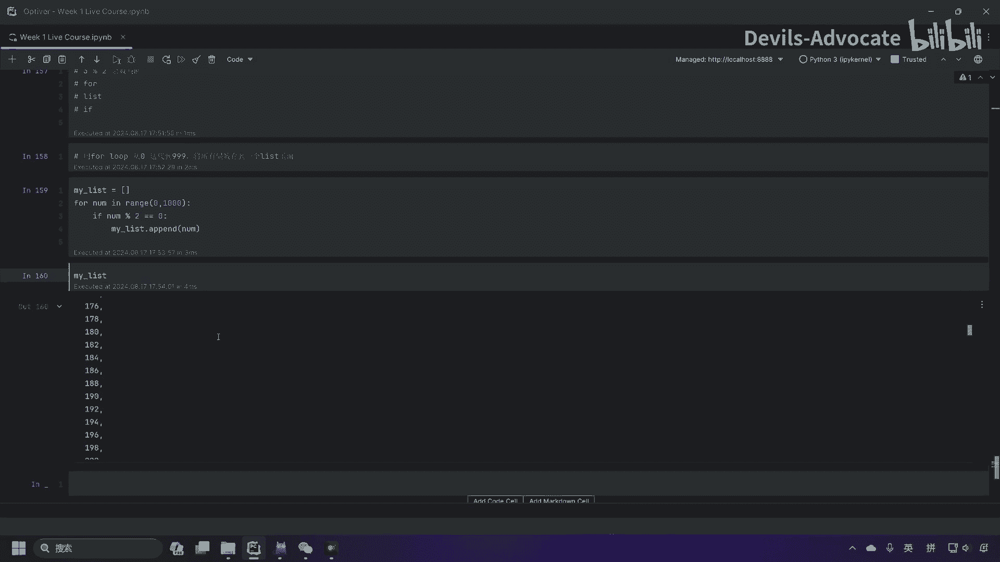

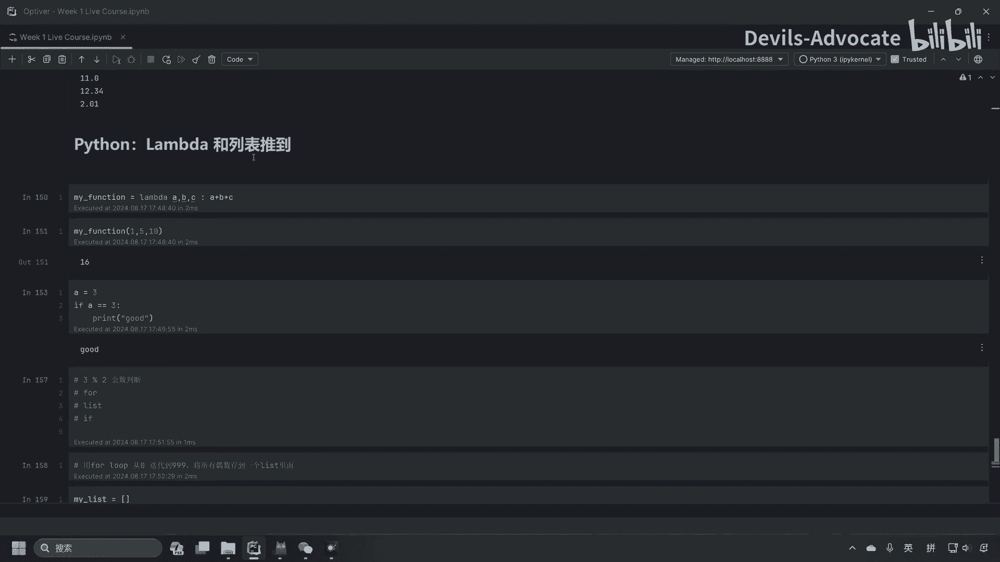

呃，或者是叫那个。That也是 my list。就一行把这些东西啊全部表示出来。

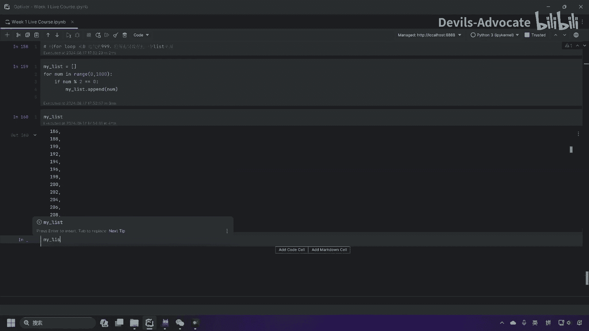

怎么办？my list等于。这你可以先看一下numb word。n in range0到1000。If。No。除以2。等于0。哎，这样它就是这一行代表着它整个的这一套东西。那么类似的是啥样的？

也是这个对吧嗯。

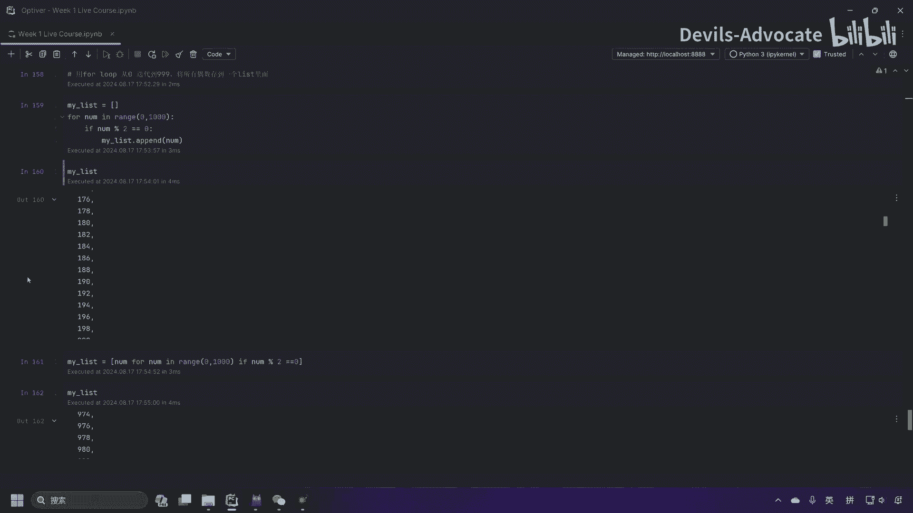

那这个num forn。for number in这就是这一行嘛，对吧？那再把这个numb numberumb提出来，if。number除以二等于0，对吧？那我就保留这个number这个。么说呢？

这个可能有些绕口，但是大家要自己理解一下，很多很多程序啊，他可能就写个这个。如果你不懂的话，它就是拆开了，它就是这样，就就相当于他直接把这个number放到一个整个这个封括号里面去了。

省去了我my pen和my list的这呃my list的这个步骤。所以说这是一个。列表列表推导列表推导。那有些也可能叫成one liner，就是一行。就是一行就把这些东西解决掉的事情。啊。

呃在程序员中很流行啊，就是咱能尽量简化就简化one liner是对呀非常popular的一个东西，就是你对就几乎大家都不喜欢这么用，都会写成这样。如果你没看懂的话，就你可以往这方面想。

还有就是lambdalambda就是咱不是要定义一个整个方式嘛。那咱这么一下就定义好了。所以这边都是一个。

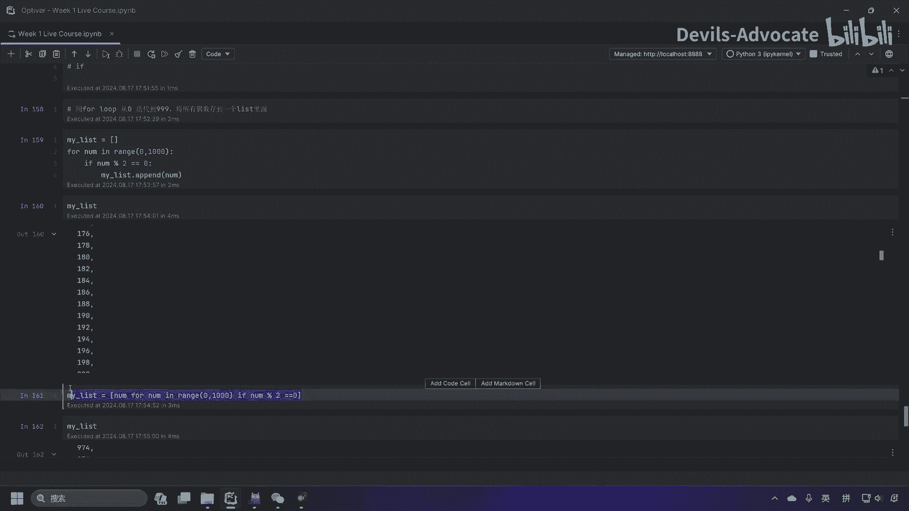

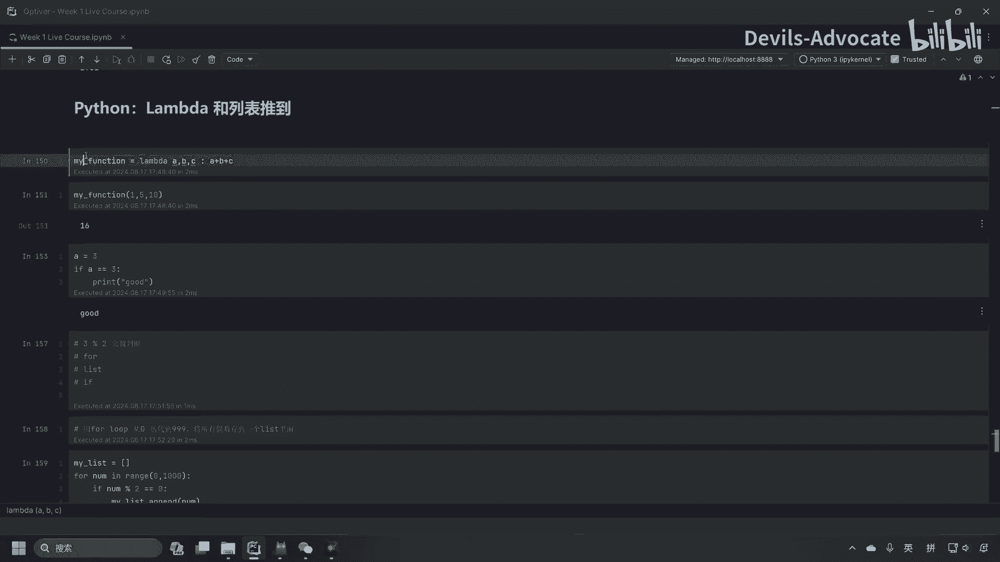

呃，简化我们写代码过程的一个东西，大家可以多理解理解。在网上你也可以多找些案例吧。呃，或者是你以后自己写的时候，你写出来一堆乱糟糟的这样的东西，你看看你能不能自己把它简化一下。

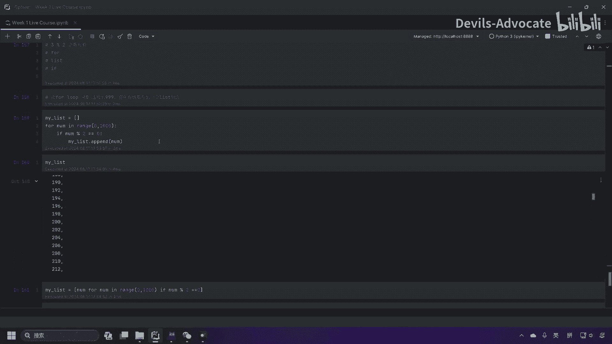

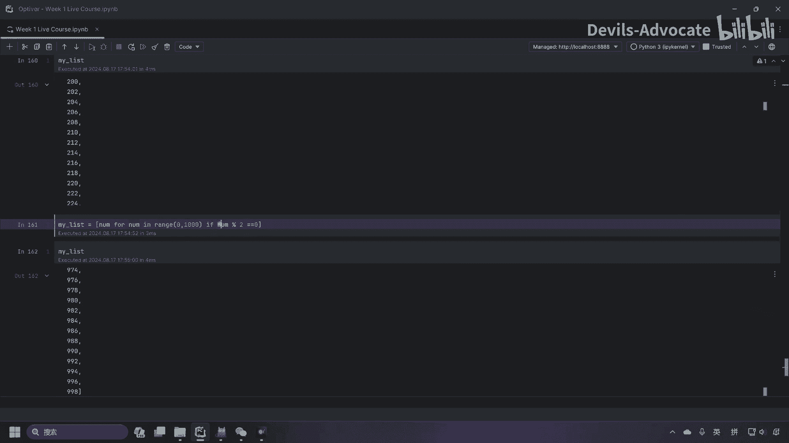

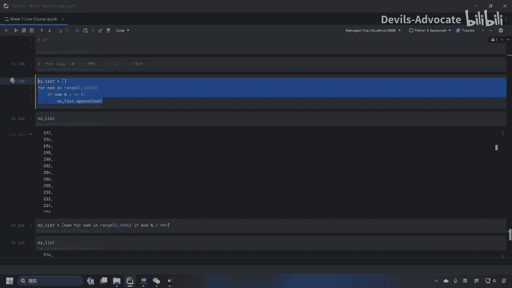

啊，那这堂课真的可以就先到这了，谢谢各位。

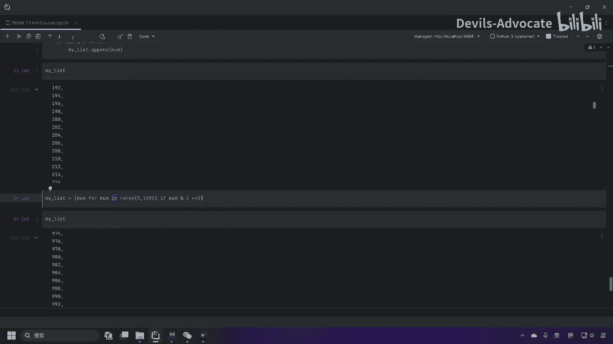