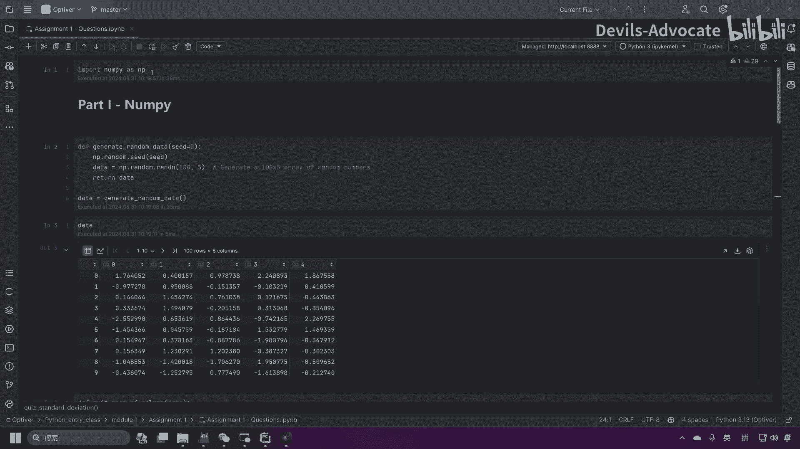
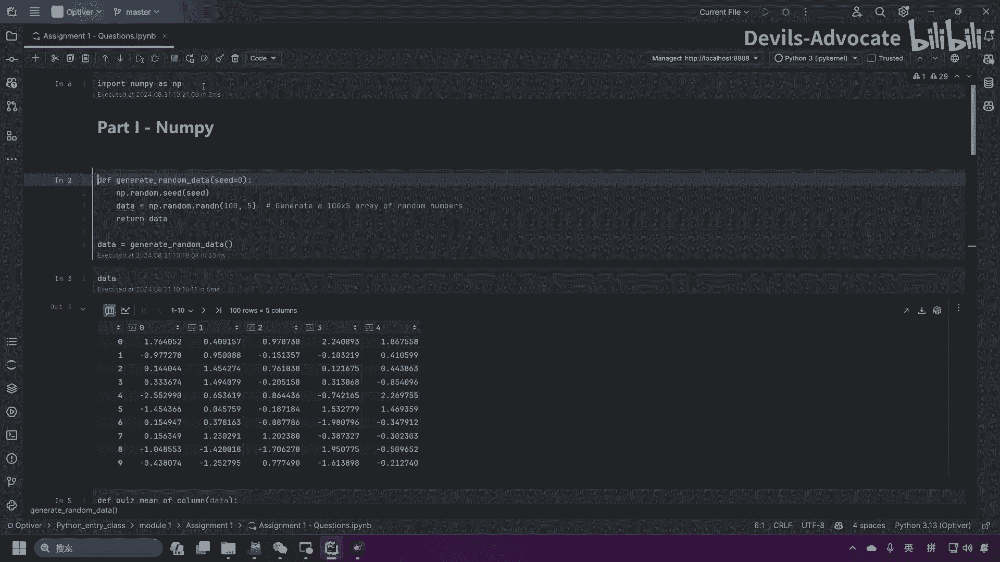
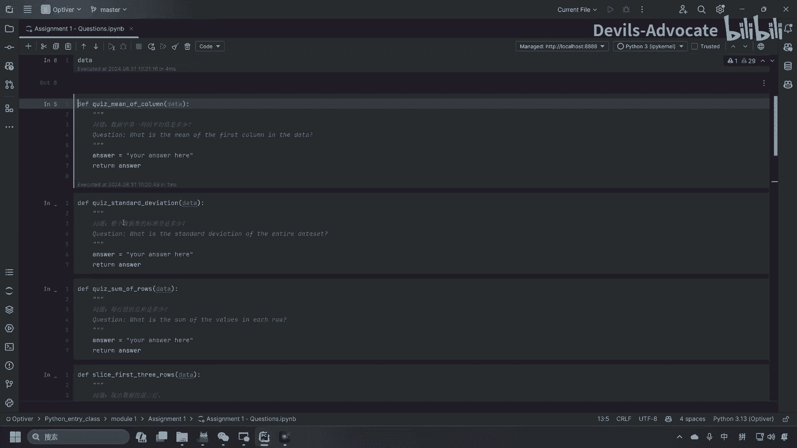
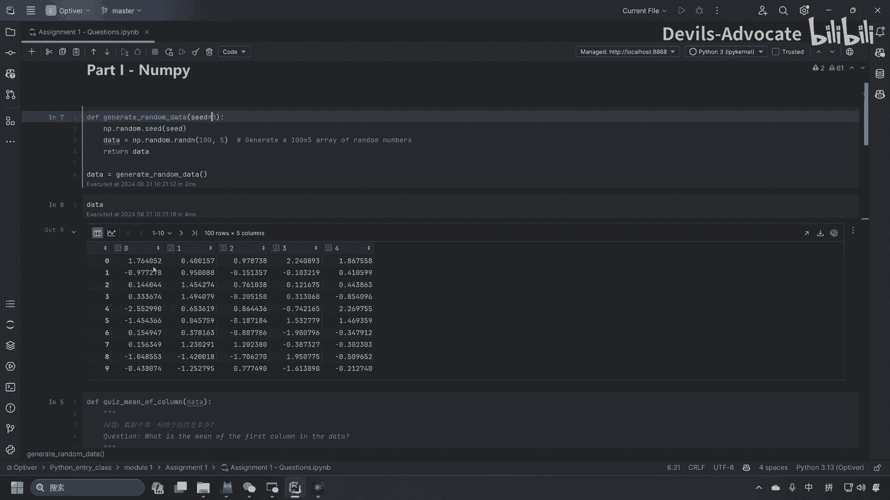
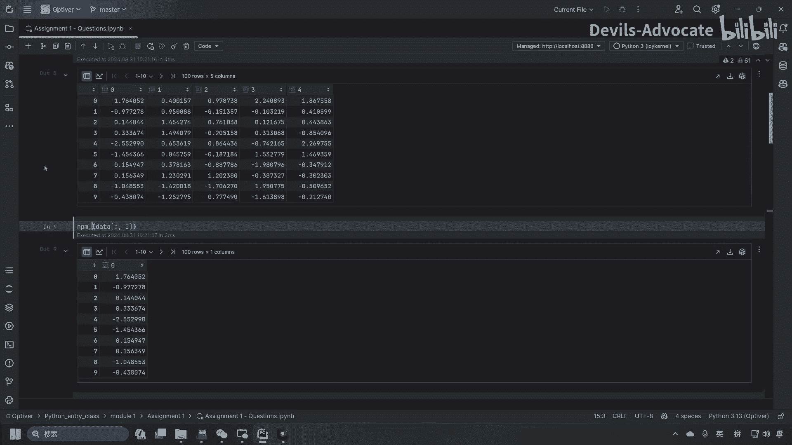
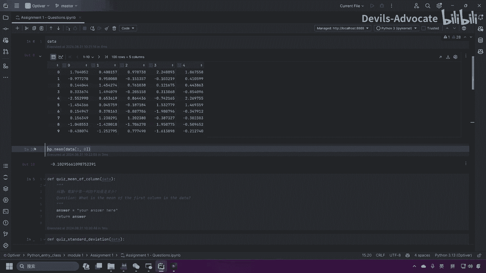
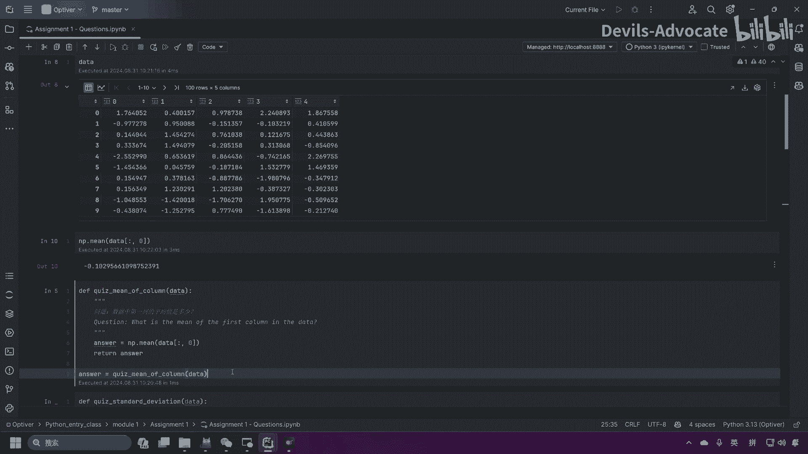
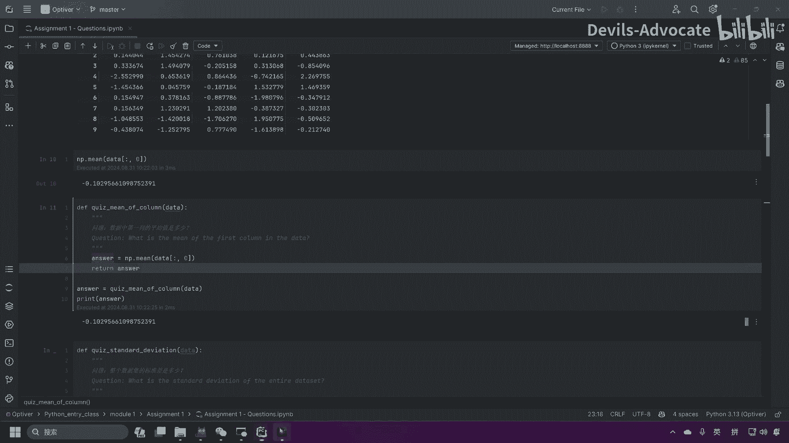

# 【量化交易】Python入门之数据分析【1／4】｜ 金融工程 量化金融 - P17：12. 作业说明 - Devils-Advocate - BV1efHAe2EAR

各位好，这里我给大家介绍一下我们的作业怎么做，这是我们的作业 sheetet，作业的呃ipad on notebook。我们首先inport一下n派。

然后这里的是我们产生数据的地方，可以看到我们这儿产生的数据是0到50到4呃，一共5列数据，一共100行。那么我这里已经给出来它的种子等于0，所以说你们产生的数据都会跟我的一样，答案也会是一样的。

那么这里是第一个问题，quis mean of column问数据中第一列的平均值是多少，哪列是第一列，第一第零列是第一列对吧？那它的平均值我们要怎么得到。首先你可以再开一个再开ex个cel。

然后我们先取到平均值。

呃，那么这里我们。取到D零列，那就是。取所有的列，那第零列，这就是我们取到第零列。那平均值怎么办呢？MP dot mean。

那这里就是我们的第一列的平均值回答呢，你可以放到这里。

然后最后我们通过这个函数返回来的数字回回答。这是我们的这是我们这里的函数，我们就要运行它，然后把数据放进来。然后我们再print一下data。

这里我们可以得到我们的。答案是负的0。1029。那么大家可以跟我们最后给到的回答的heet比对一下，你是不是这样做的那这就是我们如何做作业的方法，谢谢各位。

