# 【量化交易】Python入门之数据分析【1／4】｜ 金融工程 量化金融 - P2：课程的学习路径 - Devils-Advocate - BV1efHAe2EAR

你是否有这种经历，听完很多遍代码，仍然没办法上手，听了很多课程，仍然学不会拍ython，学习pyython，不要光听课。最主要的问题其实就是缺练。我的课程亮点是每一个模块后面都有作业布置。

如果你能在没有答案的情况下完成作业，你的拍档基础，可以说已经非常坚固了。同时我的课程非常注重实践。而且我没有加入冗余的部分，虽然看起来四个模块很多，但是相比于别的课程动约100多小时的内容。

我根据经验已经剔除掉了很多没有用的部分，这让你的学习更加精简高效。在第一个模块中，我首先将带领大家完成排唱工具的开发安装和配置。

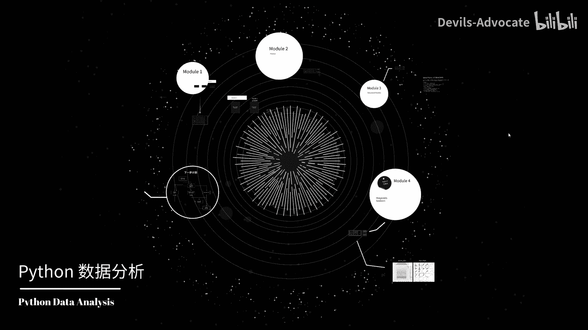

然后我会介绍pyython的基础内容，包括数据类型、变量、条件语句循环，每一部分都会配有作业和详细的解答，以确保大家能深入理解和掌握相应的基础知识。

第二个模块是padas的基础我将聚焦于da这是一款强大的数据操作及分析工具内容包括如何导入数据清洗数据，基本的数据查询和操作，帮助大家熟悉padas的基本用法。进入模块3。

我们将讨论padaas的高级函数mbda函group方法数据透视表等这一模块的作业具有一定的挑战性。我们将使用真实竞赛场景下的spacetannic太空泰坦尼克号的数据，帮助大家模拟进行数据分析的比赛。

从而提升实际操作的技能。最后一个模块也是我们的第四模块，我们将学习on的数据可视化，我们将使用和进行thon的数据可视化分析。完成该部分的学习，我们将能绘制出更。

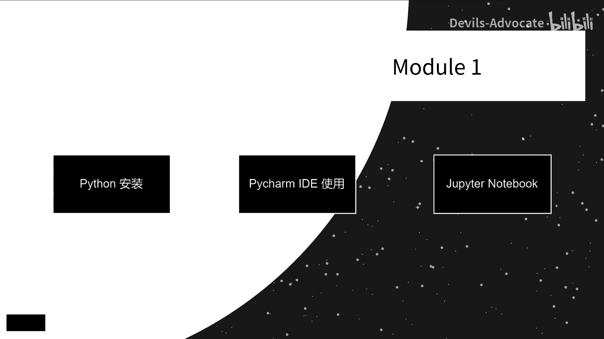

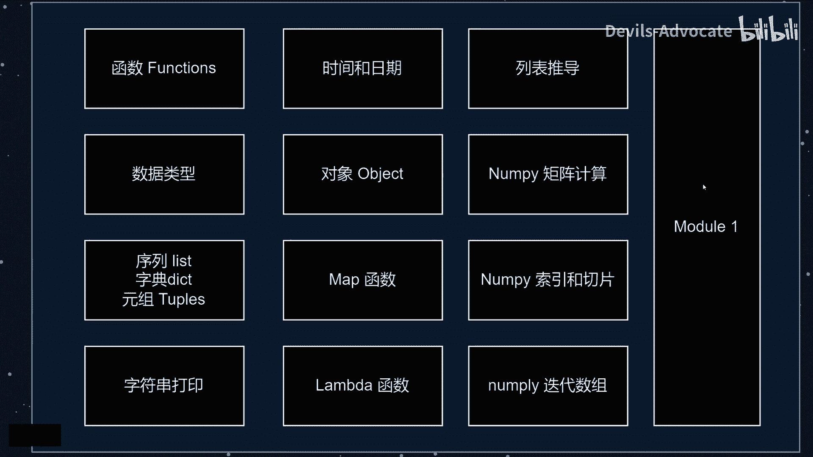

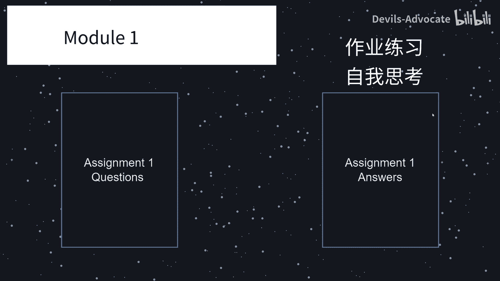

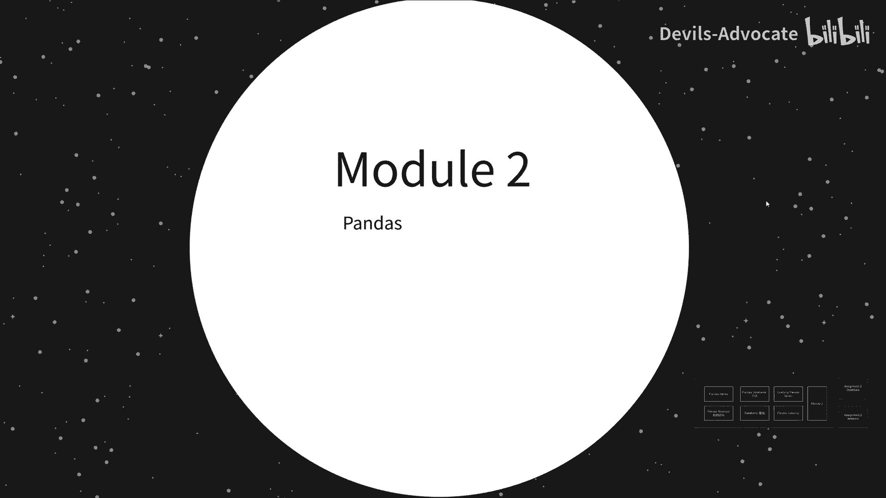

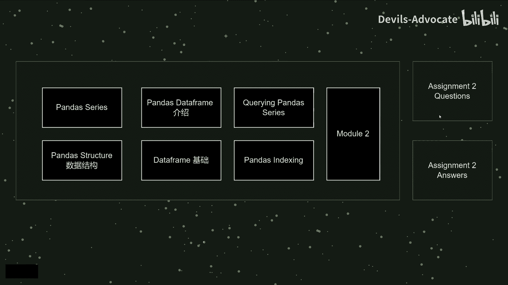

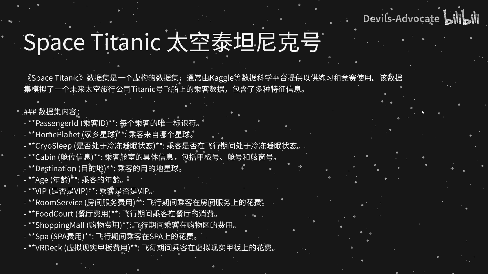

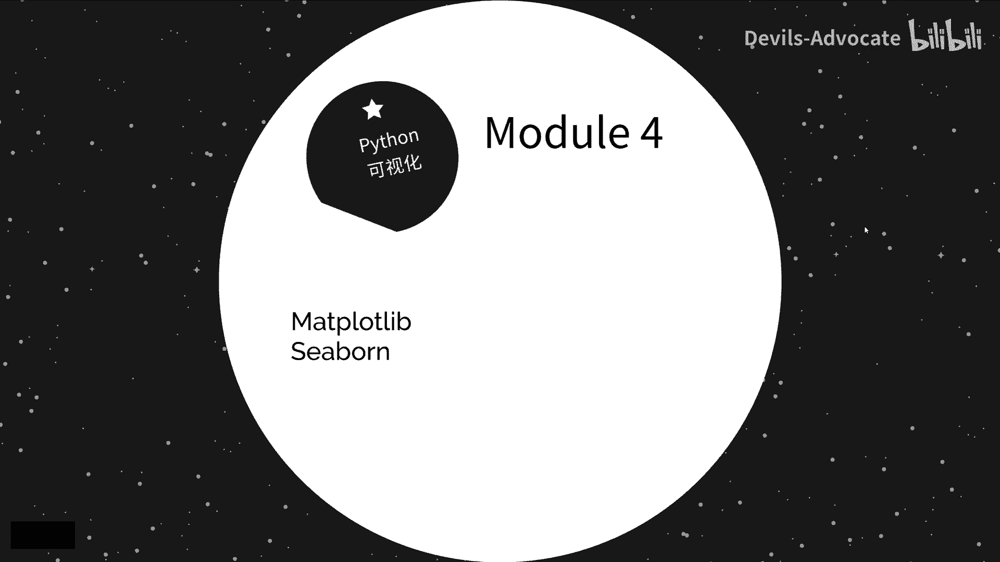

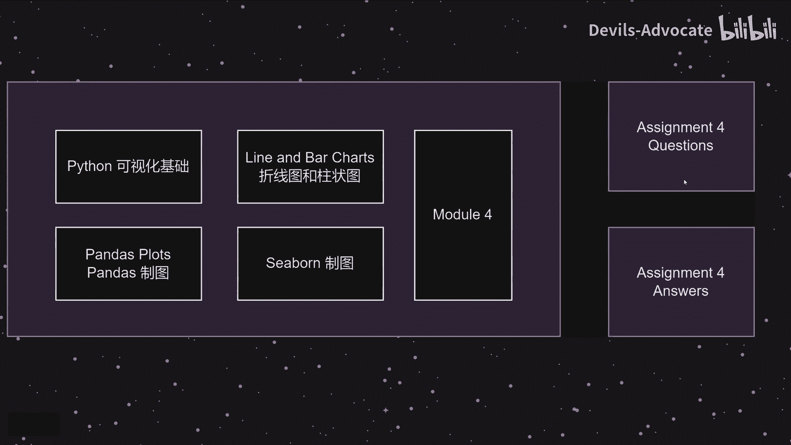

较高级和复杂的图像。

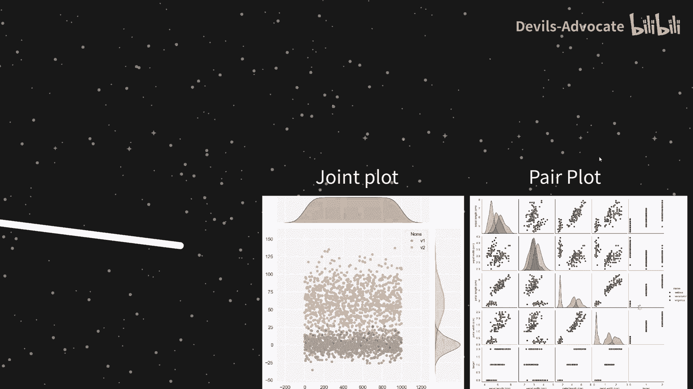

完成我们数据分析的课程后，你的thon能力已经可以出去打小怪了。那么下一步计划自然是寻找通往不同boss的各个路径。这里不同的副本攻略我已经给到大家了，大家可以查看一下时间序列是基础。

因为量化的数据基本上都是基于时间序列之上，而简面分析会在我们的因子投资中，这需要大家更深入的学习研究量化的过程中，回测的重要性自不必多说，不回测。我们如何验证策略的有效性呢，对不对？因子投资是老生常谈。

不管是在公募私募还是在券商中，因子模型都是非常重要的一部分。大家基本上用的策略都是离不开因子模型。那么如何做因子的分层回测，如何做因子的挖掘ICL计算等等，都会在因子投资这门课中做详细的说明。

大家可以找我详细聊聊细学习和深度学习，在量化中也是非常火热。这里我将手把手教大家怎样在量化中应用这两种方法。不管是做实盘还是做回测，我们都需要搭建自己的数据库。所以数据库管理至关重要。

最后我将教各位如何把你的策略连接到交易所，实现从策略研究到实盘交易的完整步骤。各位如果有兴趣，请点赞收藏，或者找我聊聊。

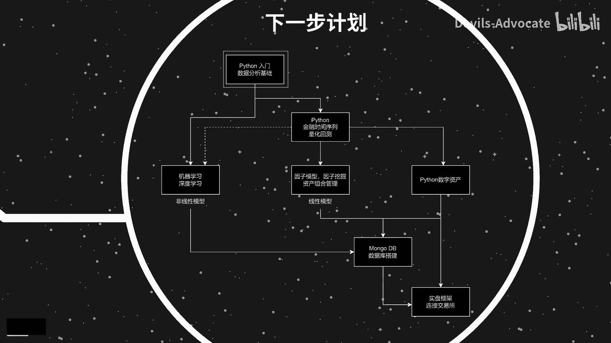

