# 【量化交易】Python入门之数据分析【1／4】｜ 金融工程 量化金融 - P4：0. Python 安装2-jupyter notebook安装【推荐步骤】 - Devils-Advocate - BV1efHAe2EAR

然后呢，为了保持跟我同步哈，我们还需要安装一下jupyter。前面那几个吧。

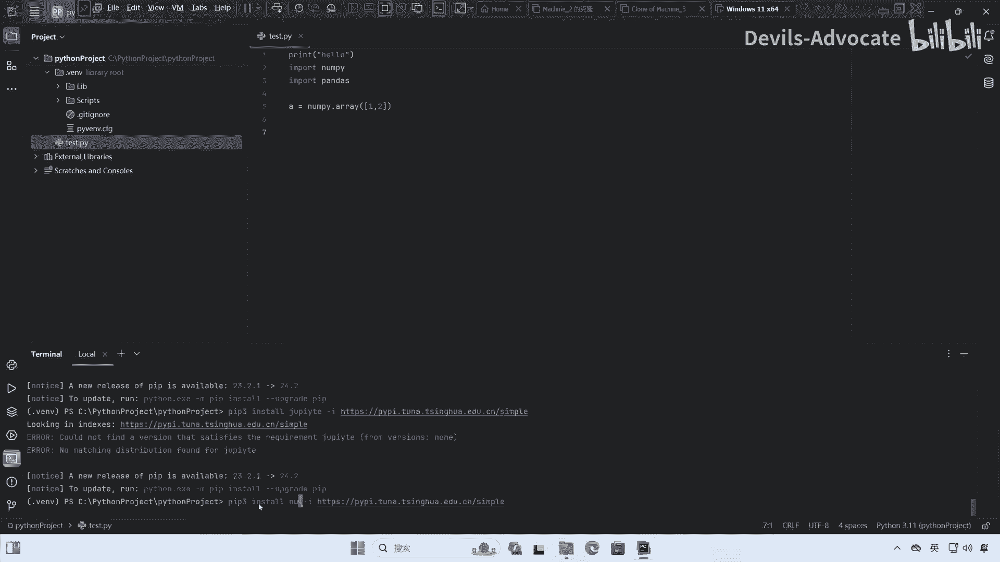

🎼只有PY等。

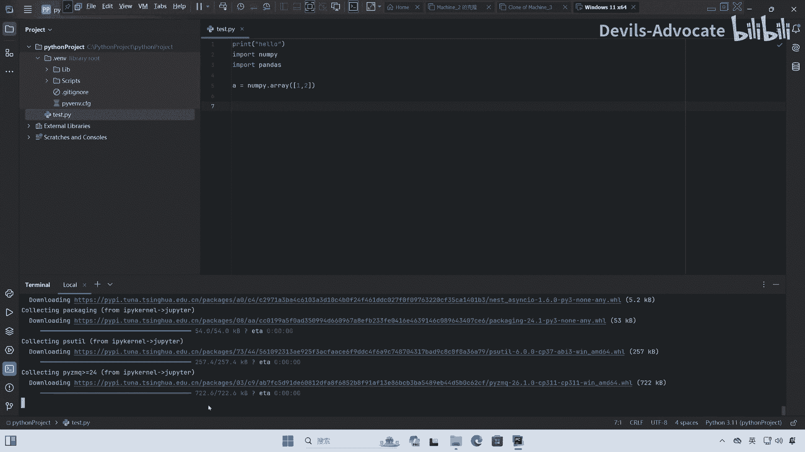

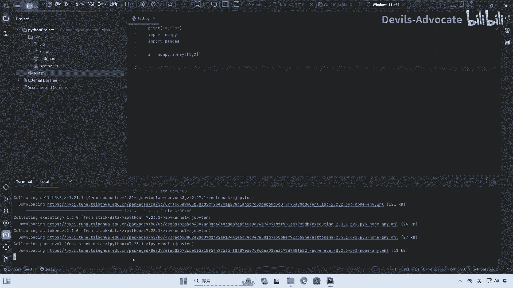

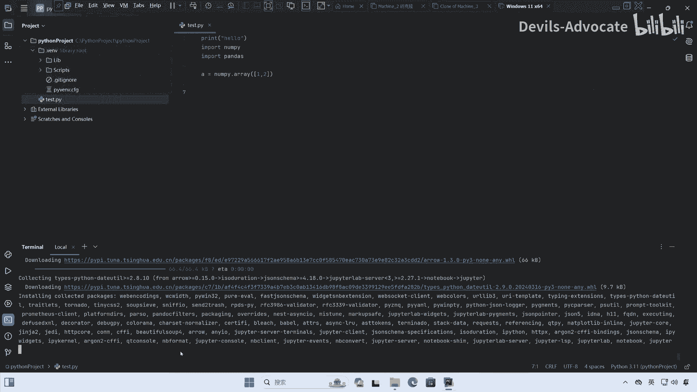

行，这里juter也安装好了，我们再来呃新建一个juter notebooknewjupyter new notebook。

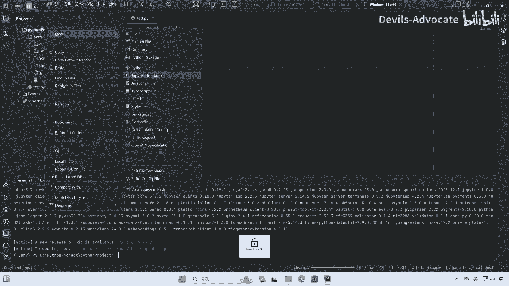

然后我也叫他太吧。

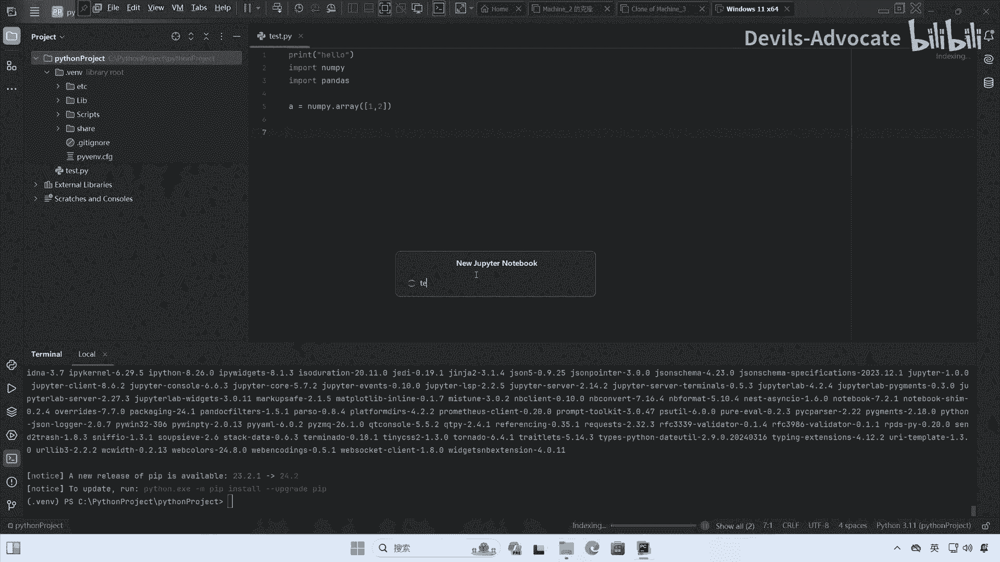

然后这边可以看到这里是我们的取垂文件。

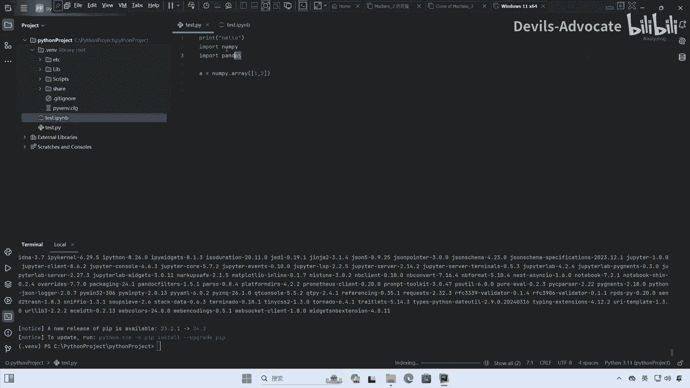

先打印一下hello。没有。

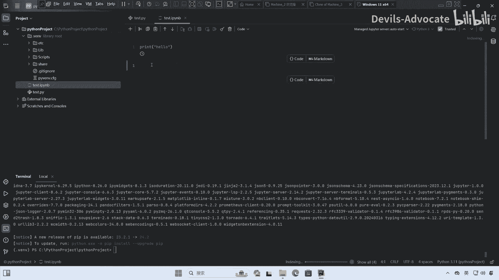

让系统启动一下可能有点慢。我就把这两个拷贝下来。

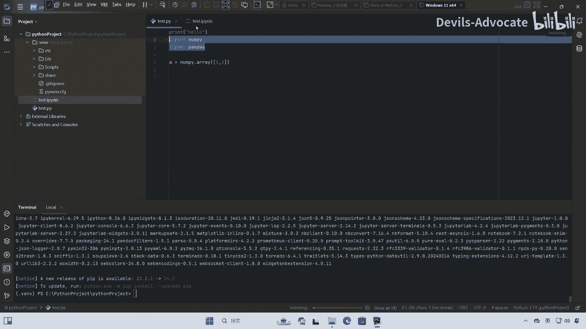

这边还在处理。行了，这边已经打印出来了，没什么问题。然后我们来看一下这些。

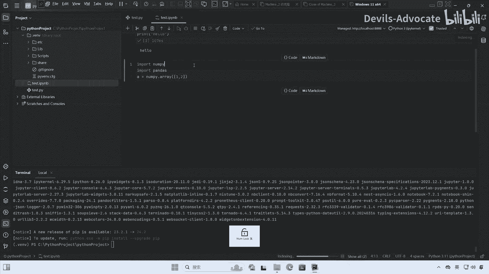

具体的运行可以，没问题。

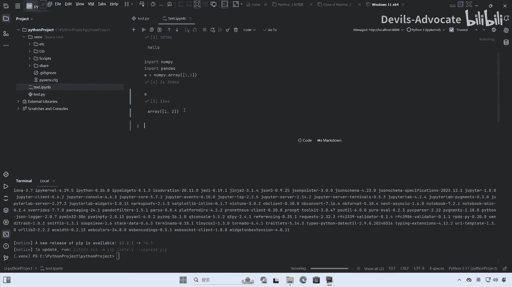

行，那后面就应该能跟我用一样的东西了。大家可以跟上我的步骤，然后一点点往后操作，这个可以关掉，这样就有一个比较干净的界面。

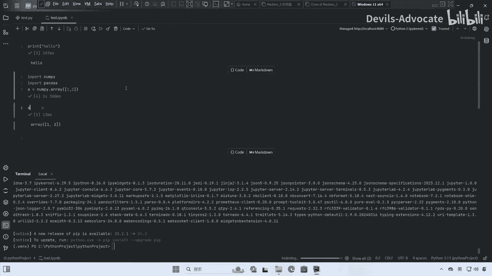

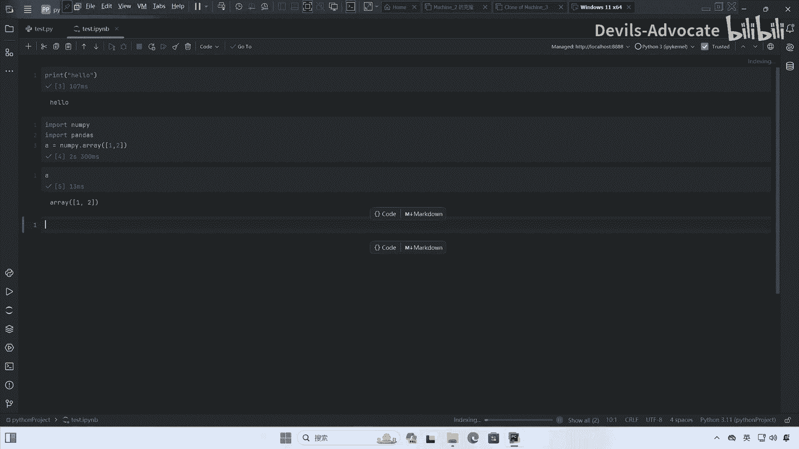