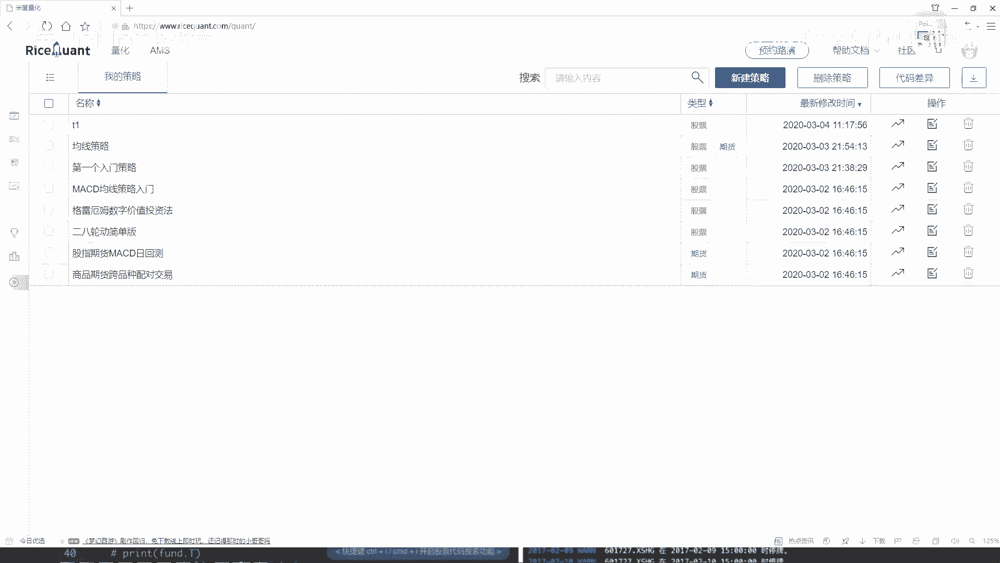
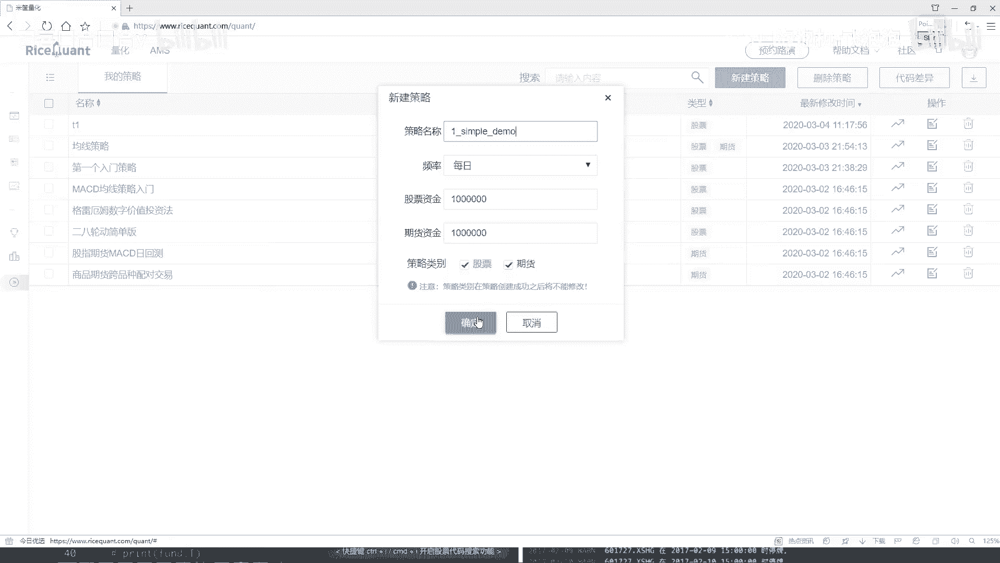
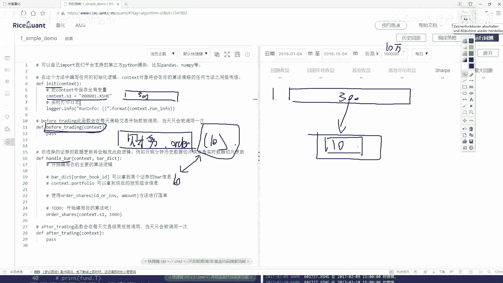
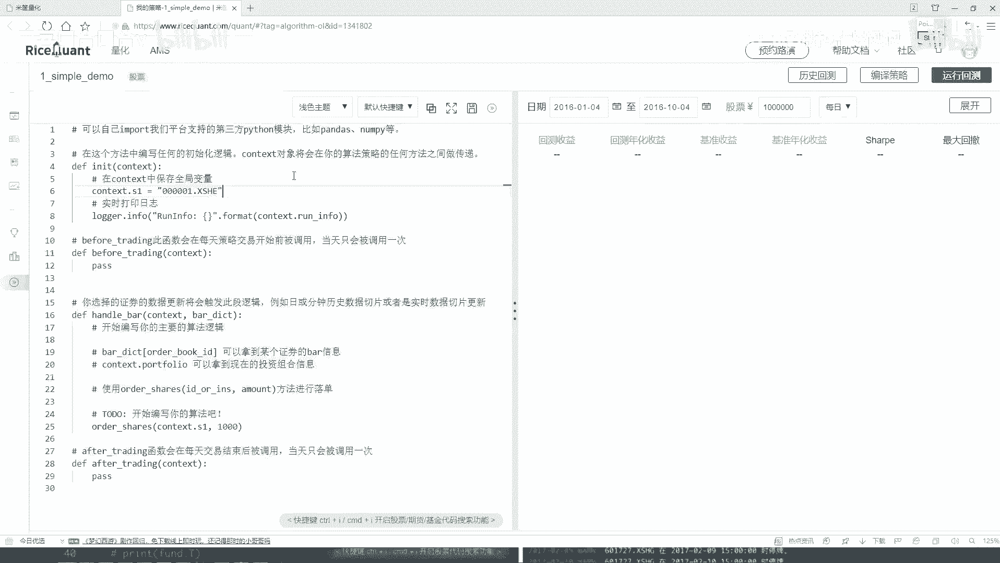

# 【量化交易教程】全100集（完整版）清华大佬耗时一月讲完的系统python金融分析与量化交易实战课程，包含基础教程，进阶学习，项目实战案例讲解，存下吧，比啃书好 - P24：24.24.策略任务分析(Av1302064773,P24) - 萍乡树里女装 - BV1dx4y1q7iG

这节课咱们就给大家演示一下怎么样用这个交易平台啊做一个简单的小策略，并且呢把这些API让大家先都给它熟悉起来。首先啊第一步啊，你看这一块它有一个新建策略，咱们点一下现这当中啊，你去写一个名字。

比如说这是咱们第一个例子啊，它是一个simple，然后它是一个简单的小例子啊，simple demo就可以了。然后我们对股票玩就行。😊。

好了，点完确定之后，这块它可以弹出来一个可编译的界面，就是咱们写代码都在这里来去写了。之前是给大家说了，有几个模块，哎，我们的初始化模块，然后before trading，然后还有hand多模块。

这些都是需要咱们自己来完成的吧啊，这是咱们一会儿要做个工作。然后这样我先给大家说一下我们的一个任务的需求。然后呢，基于啊我们这个需求，咱们来做啊。😊，我说这样，咱现在啊要做这样一个策略啊。

我说现在哎呀有好多股票，比如说这个沪深300当中吧，咱们拿这个举例子。在这个沪深300当中啊，那你说哎这么多股票我可能一个去研究吗？好像不太可能吧。那我说我这样吧，在这个股票池当中啊。

哎呀这里边300个，那对我来太多了。我说我这样，我说我能不能啊，在每次哎我想交易的过程当中，比如这是个300个选出来什么？我说每次啊或者说每一天我都看一看，或者每个月我都看一看。

有哪10只股票是表现的更好的。然后呢，我买进这10只股票可不可以啊？像是这样一件事啊，就是我的手里哎始终比如说这是我这个手里吧，我手里啊始终就保持哎我就有10张就就有咱们10个股票吧。

但是这10个股票那可能是每天发生变化的。因为股票可能今天这个股票我看它总是挺好的，我买了然后这些股票呢，我看通过他这些其他指标观察，哎呀它的情况不好，那我就卖掉，行可以吧，也就是说啊现在。😊。

我的手里我的一个任务，哎，就是说始终咱就保证有这么10只股票行吧。那大家来想一想，哎，那你说这个任务我该怎么去做呀，那是不是得哎我一开始。我先把这个300个股票池给它获取到。然后呢。

接下来哎我说在这个30个股票当中，我说我做一些判断吧，查询一下哎这三个个股票当中，比如说啊咱一会儿会用到哪些个特征，哎一些财务方面的特征啊，基本面特征啊，或者是一些哎或者更多的把其他方面特征。

咱们可能一会儿只选择某一个啊，咱不仅那么太多的例子，那选择一个特征，我看看这个特征啊，比如说我说看一下吧，呃当前每个股票，然后它的一些财务数据，财务数据当中呢，比如说有一个盈利吧。

我说这300个股票每一个的盈利都拿出来，然后说按照道具来去排，看看哪些盈利最多的，然后我只买盈利最多的那前十个可以吧。那你想随着咱这个每天的一个变化啊，这300只股票，它的一个盈利情况是不是也在变化呀。

那我每一次哎我是不是都需要去把它的盈利数据拿出来，然后对盈利数据做什么做一个排序，看谁排前十0个了，排前十0个股票我拿到手，然后我去要去买。😊，排在前十0个呀，说要做这样一件事啊。好了。

这是咱们基本的一个目标啊。那你想。有这个基本目标之后，那我们实际做该怎么做呀？在这里这是哎咱们就开始写吧，我就随便先给大家说一说。第一个就是我们的一个构造函数，在这个或者初始化函数，在初始函数当中啊。

我们要做这样一件事儿啊，比如说现在。😊，或者说呀，咱们你看这里啊他这个咱们就拿他这个例子来说啊，他默认会给你生成一个就是简简单的一个小例子。咱们一会儿要去改挺多东西啊。

那你看啊这里哎人家选的是某一个股票，那可能我们不是要去做的，我们要选什么？咱们现在在这个指数当中把这个沪深300全拿到手吧，这咱们第一步啊，在这个出构大数当中，我们要把这个沪深300全拿到手，哎。

这有300只股票了。然后呢接下来。有这股票值之后啊，你看这块有一个before trading，就是在我们做交易之前，在我们做交易之前要干什么呢？那咱们刚才说的，哎，你是不是得把这300只股票。

它所有的一些财务数据想要拿到手啊，这里哎我说我们就要去干什么，拿它的一个啊我们的一个财务的一些数据吧，那可能指标太多了啊，这些哎这里就是300股票，然后这里我要看它的一个财务数据。

然后呢我说在做一个排序吧，排序那就是一个order是吧？然后呢，我说在只取这么10个，行吧，这是我们的一个任务，这些任务都在哪去做的，都不是我们实际的一个交易吧。

所以说啊所有的哎就是但凡跟实际的一个交易是不挂钩的，就是每天都需要去做的一些查询啊处理的操作啊，咱全放到这个before trading当中，我们来去执行。😊，那这里啊咱们再来想一想。

我现在执行完了这个比如说吹ing之后，我是不是手里有什么了。哎，我就知道了，你看这个函数，咱之前讲的时候，是不是说它每天都会执行啊，那我是不是都有每天的什么呀？我们最终可能就要这样一个值。

每天的10个数据，或者说每天10个股票，它的一个呃代码是不就行了，我只需要这个东西吧。好了，接下来。😊，在这个憨豆班当中啊，就是我实际哎要去做一些事情了，这里要干什么啊？

咱们来想一想这块我是不是得先去哎做一些逻辑的判断啊。比如说现在呃咱们初始资金，比如说有10万块钱吧。出入金就10万块钱。然后我说呢在这个10万块钱当中啊，我第一步我是不是先看一看我手里哎有什么东西。

我手里有哪些个股票，并且呢我这些股票是不是什么？比如这点咱们现在这个这个10个股票都是实时进行更新的吧。那每一天我都要判断一下，当前我手里这些股票，这10个股票啊，比如当前我手里拿到这10个股票吧。

跟之前哎不是跟咱们刚才判断的，哎，最好那10个是不是一样的吧。如果是一样呢？是一样的，我接着持有呗，那不是呢？不是情况下，我就给它卖掉，然后再买什么再买新的新的什么新的最好的这10个当中，我还没有的吧。

所以说啊在这个当中啊，我们要做一些呃业务处理了啊，在这块。😊，我们要先去哎判断一下当前。我们有哪些个股票，然后呢，有的跟财务刚才咱们接下来那一个好的结果是一样的，我就继续去买。然后不是一样的。

我就给它卖掉是不是就行了啊，这个就是在咱们这个汉对 bar当中啊，我们要去做的一件事儿。先大家就是从整体上啊，我们概述了一下，咱们要干的一件事儿啊，其实说实挺复杂啊，但是看起来挺简单的。

就是沪深300当中啊，我去始终选10个最好的然后我让我手里有的，一直都是这10个最好的。我看一看我说我设计这样一个策略啊，比如出那个其始资金，我给你10万块钱看你经过了，比如说一年吧。

你咱们能赚多少钱啊，我们要做这样一件事儿方法啊，就是听简来挺简单的吧。行，然后我来看一下，咱们该怎么样去做这样一个事儿。😊。

