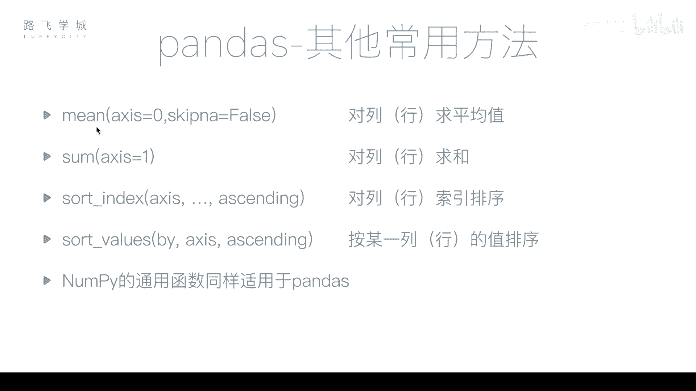
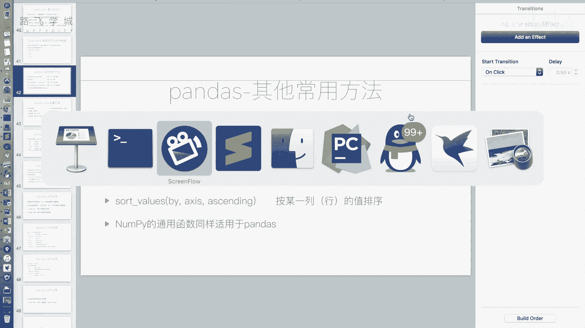
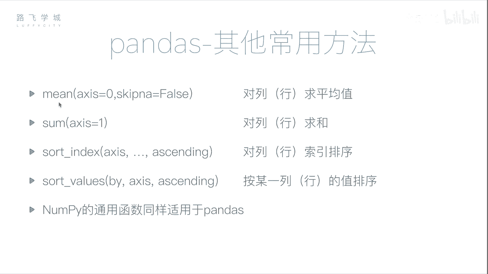

# 【量化交易教程】全100集（完整版）清华大佬耗时一月讲完的系统python金融分析与量化交易实战课程，包含基础教程，进阶学习，项目实战案例讲解，存下吧，比啃书好 - P25：26 pandas常用函数 - 代码001 - BV17563YeEAE

好同学们，接下来我们介绍一些pandas as的一些，其他的常用的方法啊，第一个main函数啊，main方法也就是求平均值啊。

之前我们在number py那个库里演示过了密方法。

我们来看一下data frame的min方法，和它有什么不一样啊，首先DFDF点min好，我们可以看到它返回的不是一个值啊，我们之前说对于一个数组啊，对于一个re对象执行点min。

或者对于一个SIRI执行点名，它返回都是一个值，但是因为我们的data frame对象有两列，那所以我们的main方法，返回的是一个长度为二的series对象，我们可以看到他对于每一列都求了平均值操作。

对于第一列啊，忽略掉首先忽略掉缺失值567，求平均操作16啊，对于第二列12344个数求平均是2。5啊，这是data frame的幂函数，那当然还有如果说跟刚才一样，跟我们这个啊缺失数据处理的时候一样。

如果说我想按照行求平均怎么办，那就是DF点min还是同一个参数，它相当于就是按这四行每一行求平均嗯，好这是第一个求平均数的幂方法好，第二个类似sum方法求和默认是爱，默认是按列求和，xx等于一。

X等于一，是啊，不好意思，xis等于一，是按行求和问题扣好，那接下来还有一些，比如说我们啊非常关心的一个排序，排序的函数有两种排序方式，第一种是按值排序，第二种是按索引排序啊，所谓按值排序比较好理解。

比如说我按照1234按to这一列进行排序，那就是DF点sort values参数by by这个参数，也就是说指定你要指定是哪一列，嗯啊因为我们有好多列，所以你要指定是按照哪一列的执行排序。

好比如说我传派等于to好啊，因为我本身已经是有序的了，他现在排出来还是有序的，倒序哎，那么倒序是什么呢，倒序是acceding，X不好意思，a s c acx tending等于false啊。

XINT就是升序的意思，你把它设置成false，就是说不升序就是降序好，我们可以看到第二列就是4321，可以按行排序吗，可以按行排序，按行排序是什么呢，按行排序的参数就是一样。

但是这个时候你的by要改了，因为你不能按to排序排序了，你可以按比如说按A行排序，可以吧啊什么意思啊，什么叫按A行排序，因为你的data frame你按行排序，你必须按哪一行进行排序，比如你按列排序。

你要按某一列键排序，对不对，但是你按按行是一个意思，你要按哪一行进行排序，不是那按行DC行和D行没有关系，你按C行排序跟D行，你按C行排序，和你按D行排序的结果可能是不一样的。

不列化你排序按列排序要选择一列，按行排序要选择一行，这个是不太好列，因为我们平时不会把按行排，不会做按行排序嗯啊主要还是按键排序，我以为按行排序，就是说按CDCDBA这四个标签来，不不不不不。

那个是按标签排序啊，那个块这是我们说的是按值排序，所谓按行排序，也就是你比如说我指定A这一行啊，然后你看我指定了这个降序，所以它是A这一行，从左往右是降序的七，然后是四，是这样的啊。

那还有一点就是如果我的这个，排序的这一列有NAN怎么办啊，有ANNA有缺失值的时候，所有NAN的行不参与排序，统一放到最后边K好，我们可以看到升序NAN在最后边降序，也在最后面啊。

所以有缺失值的部分不参与排序，统一放到最后好，这是按值进行排序，那刚才ALEX说到了，我怎么按标签按这个ABCD进行排序呢，那是DF点sort index，没有参数传进去之后就是ABCD进行排序啊。

如果降序一样，x ending等于false，那同理如果你想按你想对这个列标签，也就是对列索引进行排序的话，这个时候因为什么，因为我看我们身上是降过序的，降下去的话，T是不是在O的后边嗯。

对所以T的这个值要比就是按排序的话，T要two要比one大，嗯所以他排到了前面，啊这是我说我们说的，按这个索引和按值进行排序，那好关于pandas as的一些常用的方法，我们就讲到这里啊。

那之前我们讲过的number py里的一些通用函数，比如说这个啊，平均值幂函数变幂方法我们讲过了，比如说标准差，方差最大值，最小值等等，这些函数同样也适用于pandas as。

