# 【量化交易教程】全100集（完整版）清华大佬耗时一月讲完的系统python金融分析与量化交易实战课程，包含基础教程，进阶学习，项目实战案例讲解，存下吧，比啃书好 - P44：44.44.数据格式转换(Av1302064773,P44) - 萍乡树里女装 - BV1dx4y1q7iG

现在虽然啊我们已经把数据给它搞定了，但是还有点问题，我们一会儿要什么要用阿那个包吧。那个包当中它需要我们的一个数据格式跟咱们现在的可不太一样。我不给大家看文档了，太麻烦了，我给大家来说人家要的什么格式。

他要求你的数据格式这样。比如现在你看啊就是你这个这是数据，这都是一个date它都是一天的吧，它不是那样，它是这样一个指标。他说哎呀现在这个daate我给大家直接画啊，他说现在这个data得这样。

比如说呃咱们就拿有5只股票吧，那每天都有这5只股票吧。那好了，比如第一天它是2019年，然后这样一个-01-01，然后呢接下来这块它会有5只股票，就是A股票，B股票，C股票D股票B股票是吧？

然后具体有一些值，然后这个value这不写了1点3啊1点几2点多3点多4点多好了，这是什么这是他说现在这是一个2019年1月1号的，然后呢接下来它的数据是这样的，接下来是这。

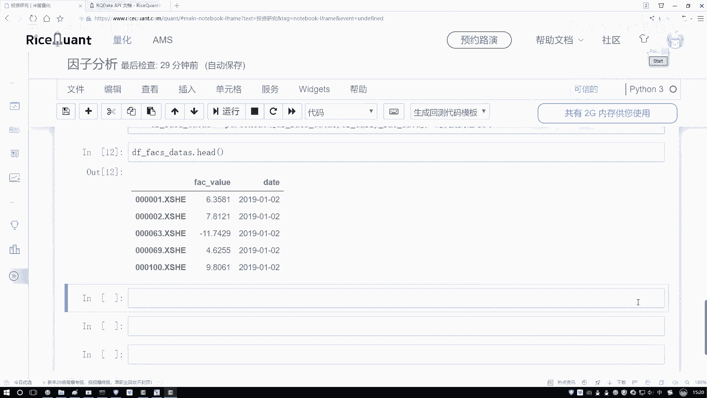

个2019年它的1个01再杠什么？再杠1个02还是这5只股票吧，第一天、第二天、第三天、第四天、第五天还是这些指标值吧。接下来2019年1月1号第三天，那你看人家要求的数据格式，跟咱们现在要做的。

你说一样吗？那肯定不一样吧，我是不是得把这个格式稍微的给它改一改啊，改成什么，按照咱们这个格式要求来去写吧，那怎么去办这件事呢？咱来看吧，在这里。啊，我们得写一下好了，按照我们的要求。

我们得去重新哎大家来看一看。首先首先啊咱别的不用说，你要把谁当做索引啊，肯定是我date这个东西吧。所以说我们得需要重新的设置一下索引，把数据啊转换成我需要的这种格式呃来执行一下吧。

对于当前我的d frame做一点改变。对它呢我说现在啊你得去呃重新设置一下索引了，设置这个索引当中啊，我得是拿谁当索引，那肯定啊我得是拿这个da当做我当前的一个索引吧。好，然后我们来执行一下。

然后这里就是重新的，我说我再执行这样一个赋值，哎，不还还没完。这里不光我是要指定一个daate，还要指定我们的一个就是data，我来找一找，当下咱们的一个data。

把这个data不要忘记把它的一个点 indexdex也拿到手。这是我们的一个实际数据。

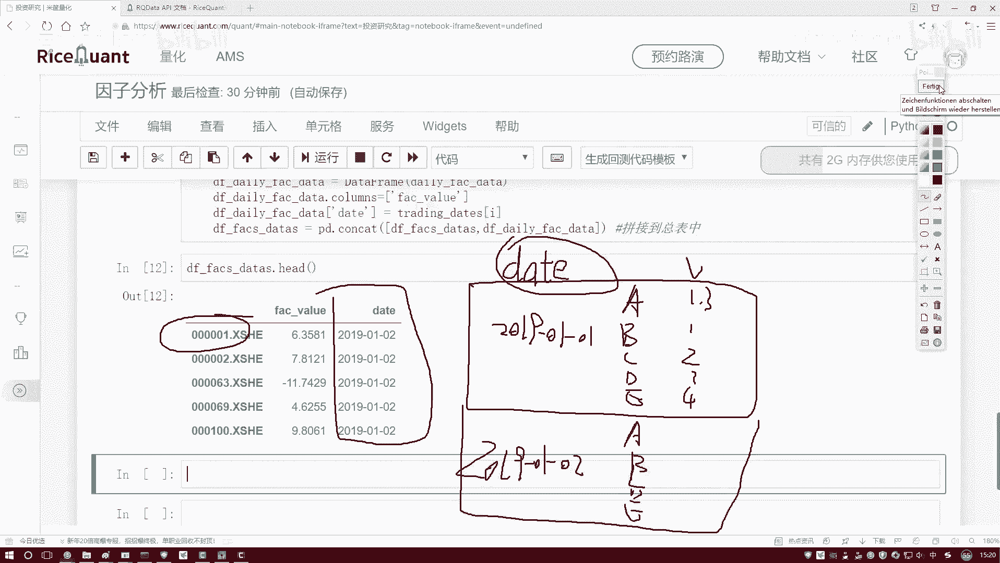

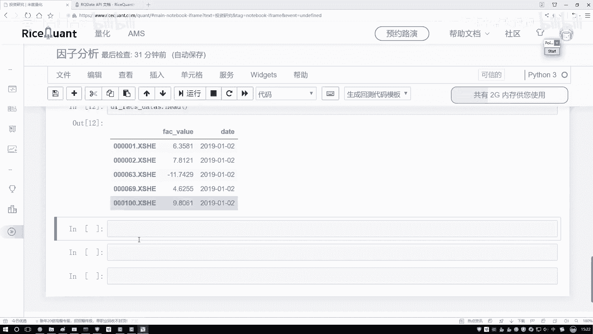

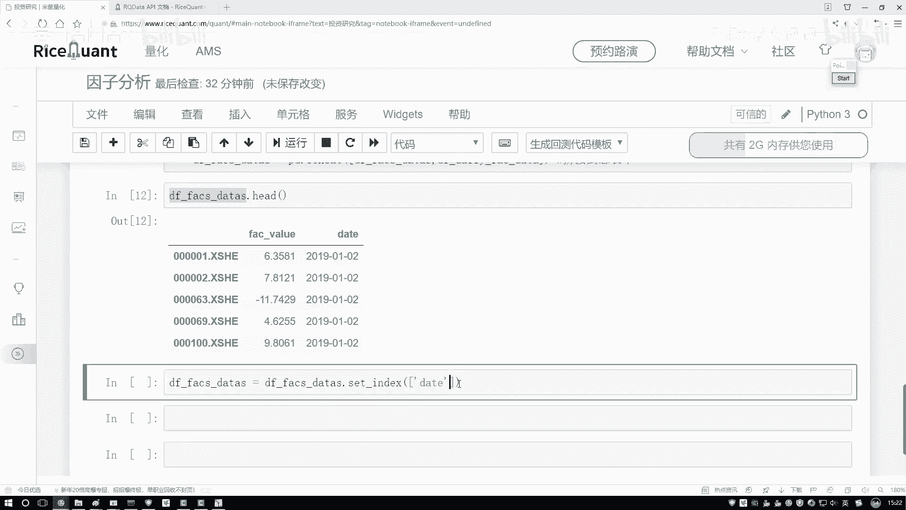

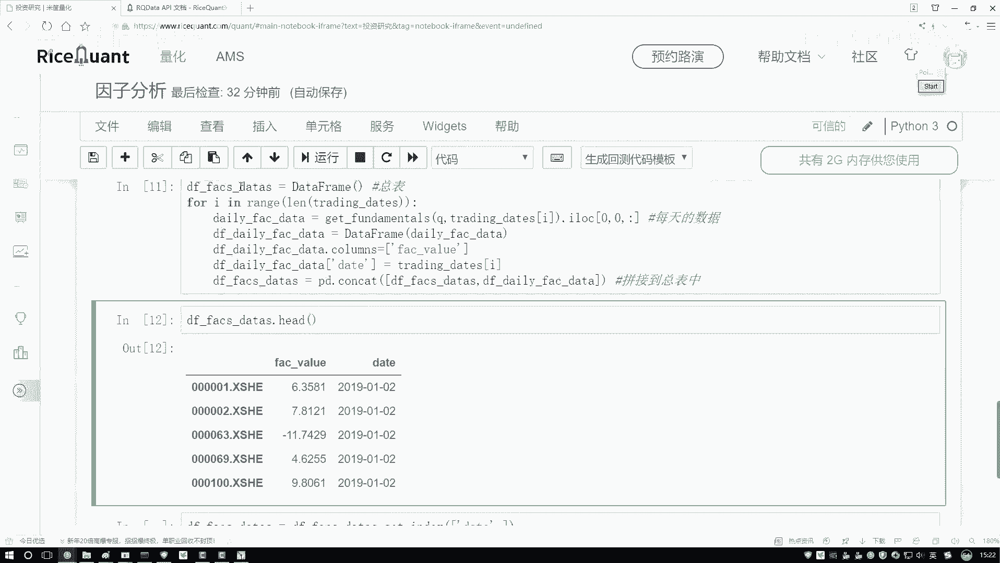

啊，它的一个缩引，这是一个股票吧。好了，那这回是什么？第一个维度。哎就是我们说的一个刚才说的一个日期吧。然后第二呢，咱们是不是这个是我们的一个股票，股票点index，不是股票，就是股票指标。

指标当中的索引是什么？是不是一个股票，一个指标一个股票，一个指标啊。那指标的索引是不就是股票，它的一个编号啊，就这个东西吧。哎，这个就咱们现在说的这个呃指标，它的一个index，咱是不是该画图了。

是先是一个d，然后再是一个股票，它的名字，然后接来再是它的一个实际的一个什么它的一个值吧，相当于是索引所引当中第一个是date，第二个是它的名字，然后值只有一个就是指标实际它是什么值来执行一下吧。

执行完之后一下听我说好像挺啰嗦的，看这个结果。😊。

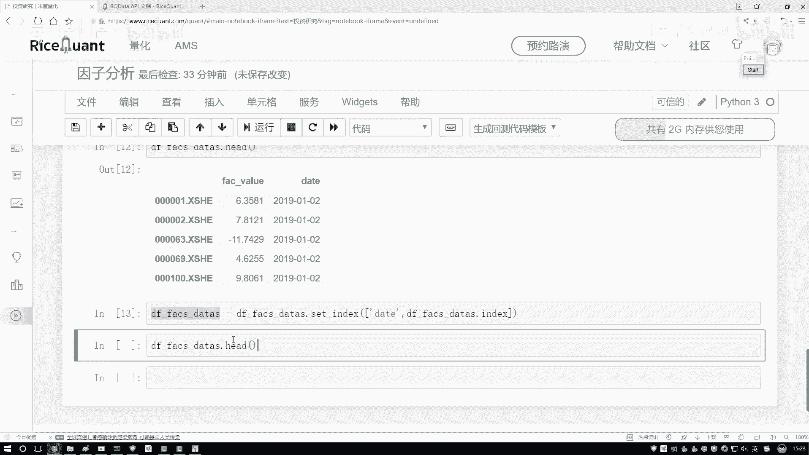

是不跟咱们想要的是一样的，这个是我的一个日期。哎，2019这看的太少了，哎看的太多也没法看了。因为这个数据某一天数据实在太多了，就看这么看得了。这个是我的第一个date是吧？

这个是我的什么我指标点 indexex是我股票名字吧，这是股票名字，那我的value什么value只有一个了，就是当前这个指标值它等于多少吧。那好了，现在我们基本上把咱们要做的事都做出来了吧。

拿到什么了，已经拿到了咱们现在想要的一份输数据了。那一会儿呢咱们就能拿这个阿尔法 learn来去执行啊，我们的一个就是统计的操作，哎，不是就是计算啊那个IC值那个操作，这块我写一下就是。😊。

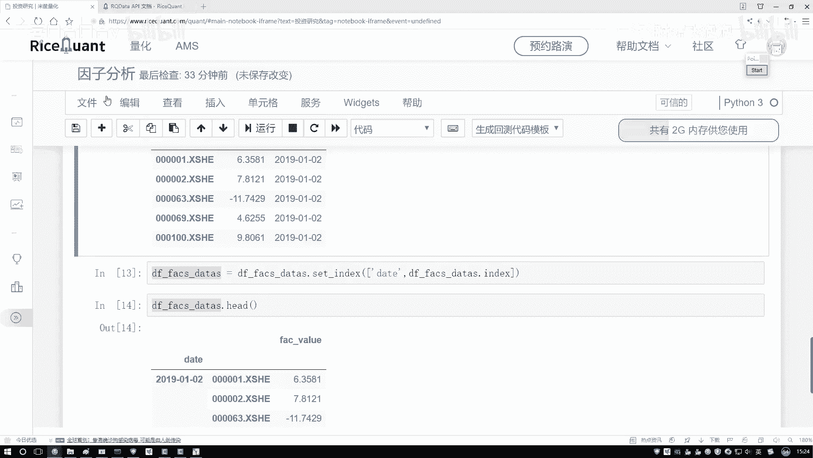

格式转换。呃，格式转换呃，没有为什么，就是为了满足为了满足工具包要求，人家这么定的。所以我也不知道为什么人家那么定的啊，但但是我们必须得去这么去做啊，用人工具包咱也没得选，必须转换成当前这种格式。

你上面这种格式，人家不会自动帮你去转啊。好了，那现在我们拿到这个指标了。

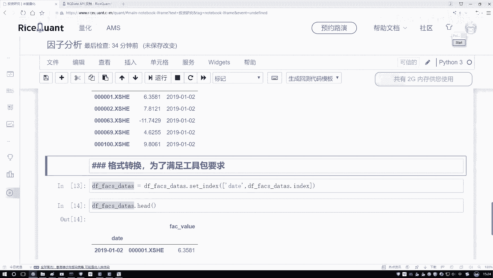

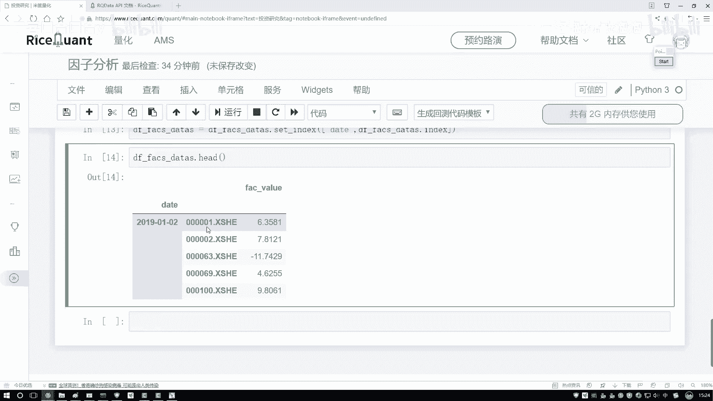

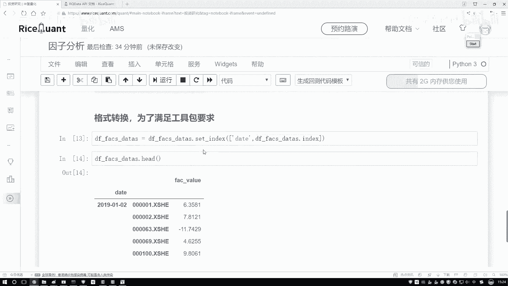

然后呢，在这个调当中啊，再把这个serrus拿一下，再把它的一个实际的一个值给它取下啊。因为一会儿咱们可能在某些计算过程当中会用到啊它的这个值啊，我们的一个指标，然后指定个值吧，然后呃s。

ze是我的一个呃指标，然后它的一个data是等于我当前这个结果，然后点head看一下，看有没有什么问题。

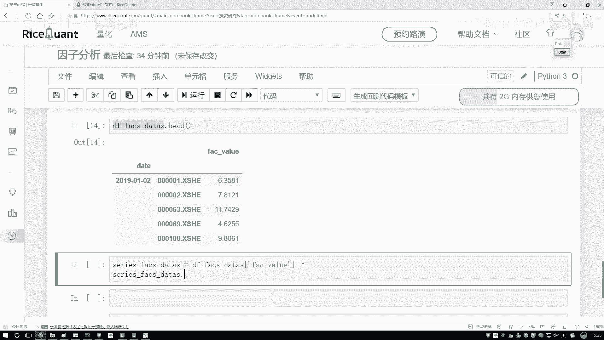

当前拿到这一列行，这一列没问题吧。好了，咱把单独这个数据拿到手了。那接下来啊咱们还有另外一个操作，还有一个叫做呃除去我们的一个异常值，还有咱们的一个标准化的操作吧。这个在这里呃咱因为跟之前啊都是一样的。

就不给大家一个去说了，直接把这个复制款就可以了。这块啊就是它的一个预除理操作啊，咱们就是呃做一个聚集值，还有这样一个标准化操作就行。方而比较简单，这个都不用给去给大家一个去看了。

指定好你的一个上限和下限，然后去判断当前你的一个上线下限是满足要求，不按要求给它做一个规范化吧。然后呢标准化就是呃我的一个X简密比STD属完事了。接下来是不是要对我做的数据，哎，每一天都需要去执行什么。

每一天都要去执行咱的一个标准化，还有咱们的一个规划这样一个操作吧。后如果说大家想把这个它的一个分布情况，把这个图画出来，这块又给你画的直方图，可以简单的做一些观察这个。😊。

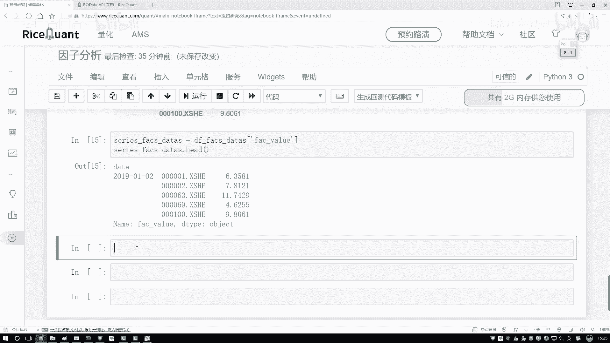

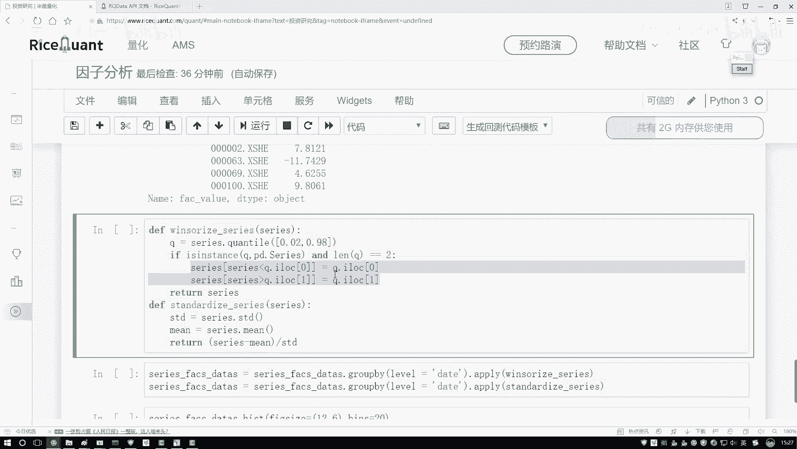

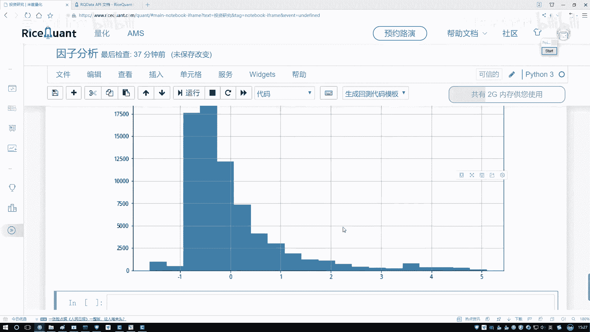

的一些基本操作。咱之前啊都给大家看过了，所以这里哎我们就一步不咱们自这里啊咱们就不一个去看了。然后接下来我们来说下一个。

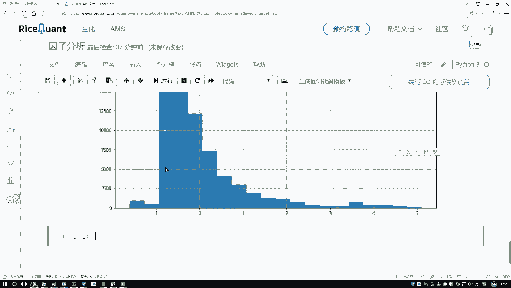