# 【量化交易教程】全100集（完整版）清华大佬耗时一月讲完的系统python金融分析与量化交易实战课程，包含基础教程，进阶学习，项目实战案例讲解，存下吧，比啃书好 - P49：49.49.整体任务流程梳理(Av1302064773,P49) - 萍乡树里女装 - BV1dx4y1q7iG

那有了这个已知条件之后啊，接下来我该怎么做啊？那是不是说我们就要去打分了？那好了，给大家来说一下吧，咱们打分该怎么去打啊。这里啊能打分的方法嗯，其实来说还是蛮多的啊。咱们举几个例子来先看第一个例子。😊。

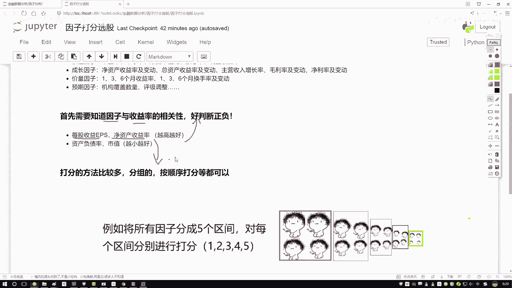

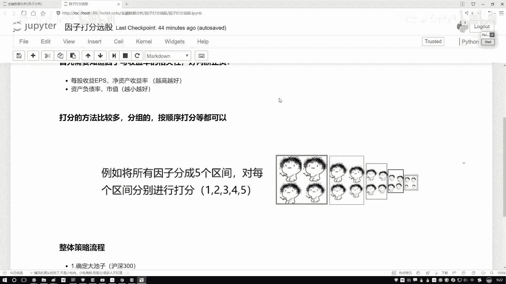

我说这样我先把这个数据给大家画一下吧，咱就拿这个数据举例子。呃，我说这样吧，咱们就有几个数据，有一些降本数据。降本数据当中啊，咱有这个我说有这个IDE啊，第一个第一个股票行吧，然后呢。

我说还有这个ID2第二值，然后我我多写几个ID3，然后假设吧咱们就沪深三00当中啊，我一直到这个ID300啊，咱们3300股票。然后呢咱有几个指标呃，我说咱们就按这几个该说的来了，我说这个是个A啊。

这是越大越好B也是越大越好，然后C和D啊，这个负债率还有一个市值越小越好。然后呢，这里有这个个科成绩ABC啊，还有这样一个D行了，那我说这样一件事，我先办把这些指标拿到手了。

并且我也知道哎他们的一个大小是好还是不好。然后呢，比如说咱们现在有些值吧。😊，呃，是不是说每个股票我ABCD这个值都能拿出来啊，那我随便写啊，我先随便大家举个例子呃，我就拿这个红色写吧。

比如说它的一个值呃，IDE这个它是个0。71页，然后这个是个0。28，然后这个是个0。39，我就当做关规规化的一个结果吧，这是0。11。然后呢那写个ID2得了，这是1个0。45，这是0。17页，这是0。

81，然后这是1个0。02吧。好了，随便每个股票都有个指标值，这一个是在咱们那个数据当中，我们直接可取到的吧，query一下，把这些数据我就用取到了。然后呢我说这样吧，我说呃对于每个英子来说。

那我是不是对于每个英子都要打分啊。我说这样，我说先把咱们的区间分一分，不管这个A它是从小到大的还是从小到小的。哎，我说都分一个区间。那你看下面说这样这样。在这里我列出一个区间，呃，比如说这里吧。

我说咱们先按照一个从大到小的吧。比如说这个呃A因子，咱们就说了哎，它是一个越大越好的。哎，这里写一下对A来说，我希望它是越大越好的，B也是越大越好，C是越小越好，D是越小越好啊，这是咱们的一个方向。

然后呢，我说这样我说对于这个明月来说吧，这里它有一个取值范围，这个取值范围是最大的，最大的一个取值范围就是从呃这个1到0。8，就相当于你可以分成几个区间把这个数值。

我又假设啊咱们的取值范围是从01到就是从0到1之间了，或者说你可以把这个东西当成百分位啊，就是你一旦你的数值不是从0到1从这个0到1的那我们是不是也能做一些百分位啊，啊，从这个零到20%的。

从20%到40%的。这里呢我们就拿0到1的数值给大家举例子了。其实不是01的0和1的数值，你自己写百分位是不到底是一样的。好了，说这个取值范围是从1到0。8%的。然后这个是。

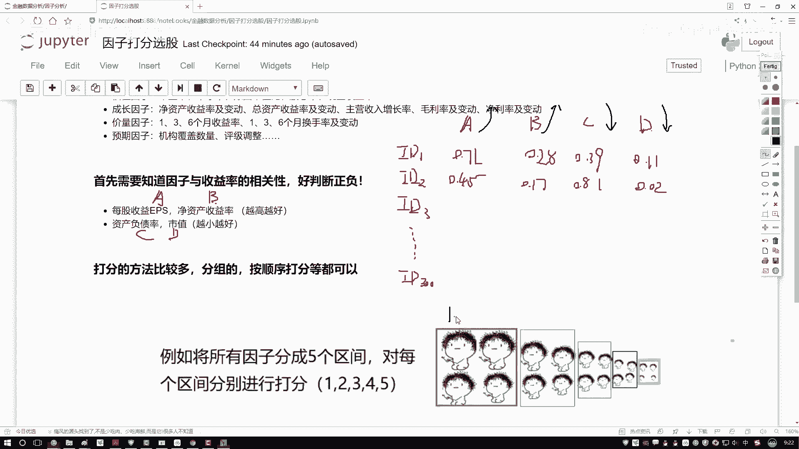

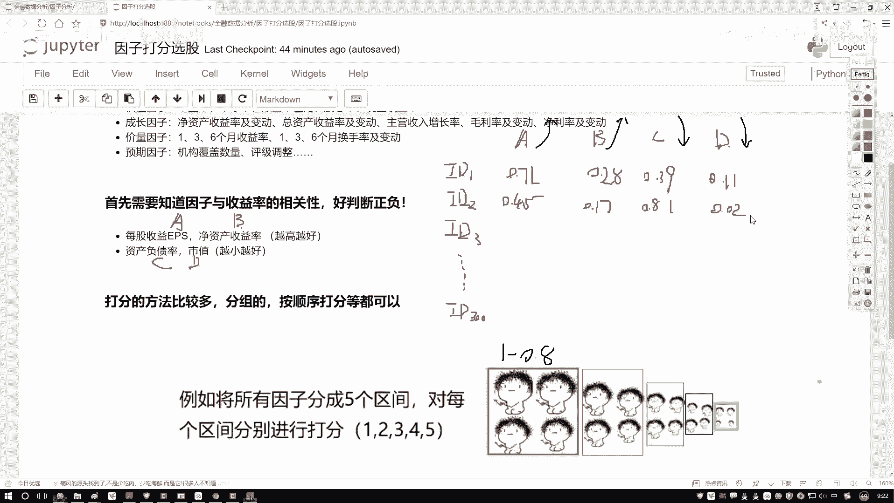

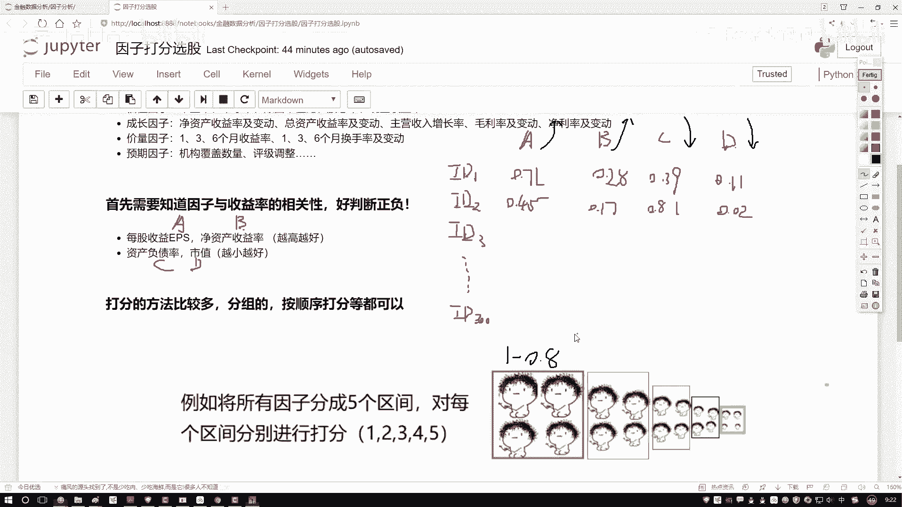

从这个0。8到这个0。6的，然后这个是从这个0。6到0。4的，然后这个是0。4到0。2的，最后呢就是1个0。2到1个零的。好了，这样一个数据给它按大小个先排一下吧。

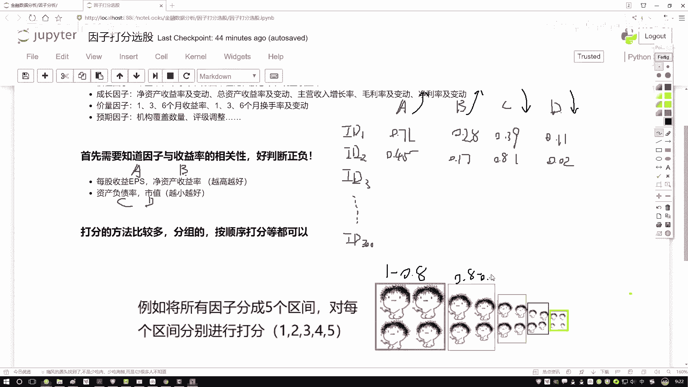

谈完之后，我说哎，咱们是不是里设计一个分值啊？那好了，我说咱有两个方向，一个是呃换一个颜色吧，一个是从小到大，一个从大大小是吧？好了，那我先说这样吧。就是如果说哎我们的指标是越大越好的时候。

越大越好的时候，是不是数值，哎，落到这个1到0。8的，我说他可能打分会越高啊，因为像是你的一个就是你的一个成绩似的，既然越大越好，那我肯定落在大区间当中呢，比如说落到1到0。8的，我说给他一个5分行吧？

然后呢0。8到0。6的，说这四分这三分这两分这一分行吧？那不光那可能在我们这个任务当中啊，咱怎么样，不光有一个错到大数据，还有什么越小越好的数据吧。那这里好了，那我说第二指标。

那如果说这个它是个越小越好的当它是越小越好的时候，那这个打分怎么打，那可能越小的时候分越高吧，那可能这就是个5分，那这是个4分，这是三分，这是两分，这是一分？😊。

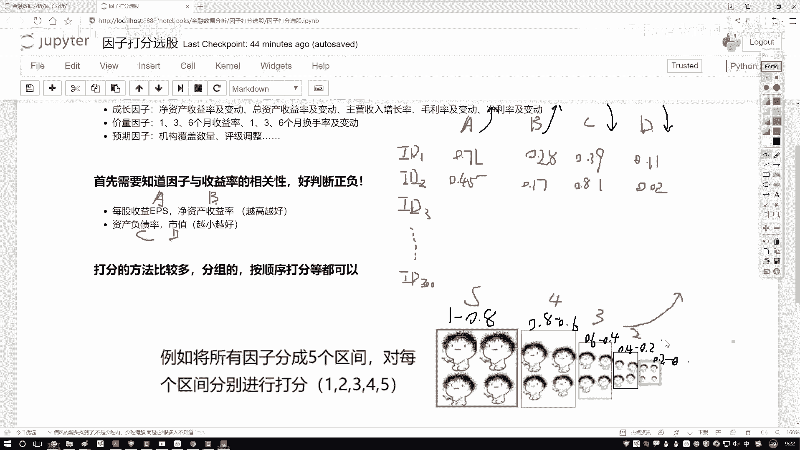

啊，好了，这是啊对于数据来说，我们分了两个分之，哎，越大越好的，还有一个越小越好的。然后呢，既然我们这样方向分完了，那么打分来看一看吧。先看看这个A。第一个值我拿这个黑色来画吧，第一个值它等于1个0。

71落到哪儿了？哎，对于A来说，它是希望越大越好。它落到了这个就是0。8到0。6这个区间。所以说它是个四分行吧，然后0。280。8落到哪了哎D二区间它是个2分，0。39呢0。39落到也是一个两分吧。0。

01是一个一分，那下面的ID2是也1样啊，哎，咱们来写一下呃，哎对对这这这题写错了，这个C和D不是啊C和D你看0。39，0。39落到哪儿了，落到这里就到就是我们是需要越小越好的吧。

所以说此时啊它不是个两分，哎，它应该是一个4分啊，给改过来，然要0。01呢，它不是个一分，它是个5分吧，哎感觉疏忽了，这还有越小越好的。然后呢ID2咱们再算两个得了。ID2，这个0。45，0。45啊。

它落到了是一个这是个三分，只要0。17呢0点17它是个一分，0。810。81啊是什么，是落到这里，但是它是越小越好的，所以它也是个一分吧。然后呢0。02。😊，是最好的。所以说这是个5分。行了。

最终啊我们要干什么？那是不是说把它的总总成绩这一块我写个总分，把他们的一个总分，我再汇总到一起就行了。那第一个4加2得66加4得10，这是个15分，是不是？这样呢4分，然后这个5分，然后这是个10分儿。

那好了，我们现在是不是把两只股票的一个总分算出来了？那其他股票300只股票，我们是不是说它的一个总分，我全部都能算出来啊，那全部算出来总分之后，哎，我说在这个总分当中，我排个序吧，排序完之后。

我说选前十0个排名最高的成绩拿出来，当做我下次调仓当中，哎，我要关注的一个对象，是就行了。这个就是呃咱们的一个打分法基本的计算方法啊，这个是你如果说想去分这个区间或者说啊部分区也行，那部分区怎么办？

那300个股票那第二种方法，比如说300股票。

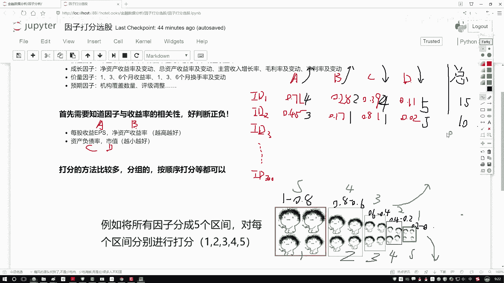

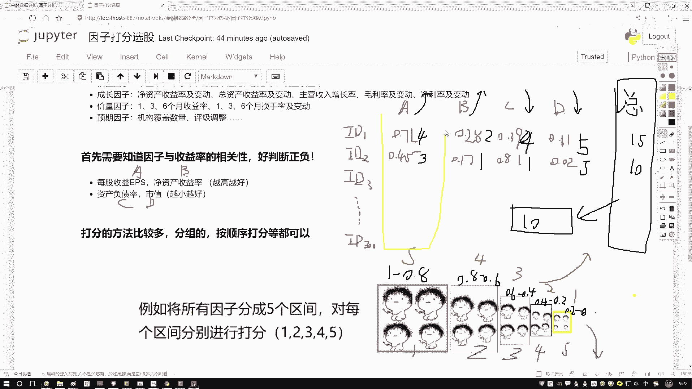

每个值是不是都有的？我把直接把这个300个值，我说按照从大到小就从1到300从大排序吧。如果越大越好，那肯定就是呃第300个我说给他300分。第一个我说给他一分是不是也行啊，按大小个给分呗。

其实方法又挺多啊，你给的分区间去做也行，啊，直接打个分去做也行啊，反正最终我们只要一个指标，你把总分告诉我，汇总出来，我能做排名啊，这就行了。这个就是我们的一个打分法啊，也是在因子策略当中啊。

咱会经常用到的一种方法啊，效果其实来说还是不错的。然后呢我们来看一下整体的流程，这个流程哎就是我们一会儿要去做策略，在这里先给大家捋一遍。

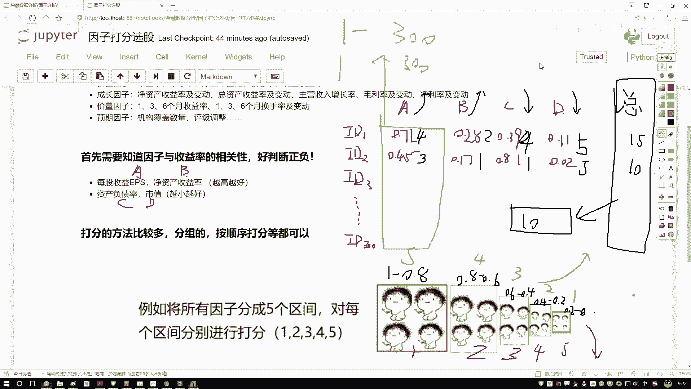

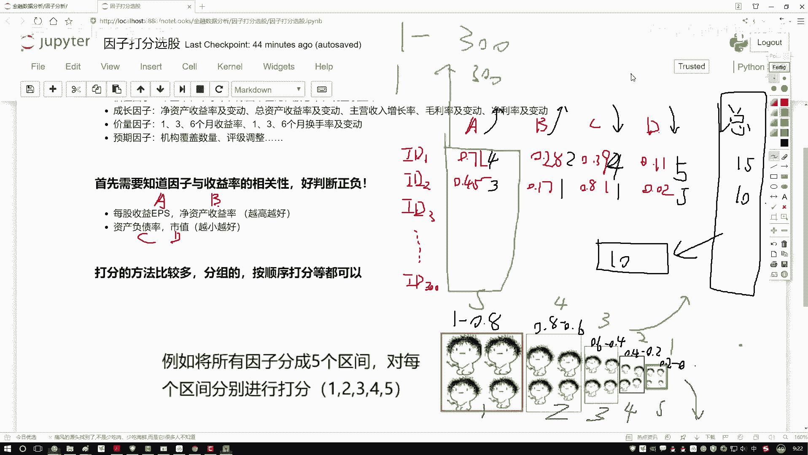

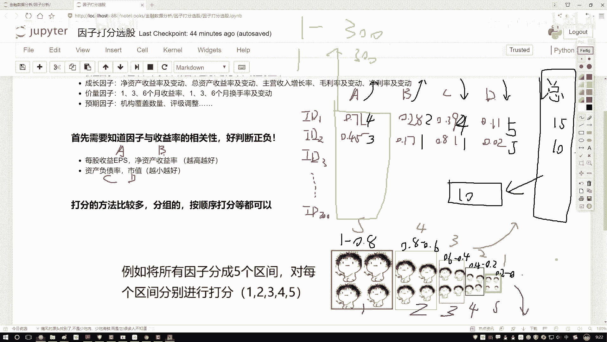

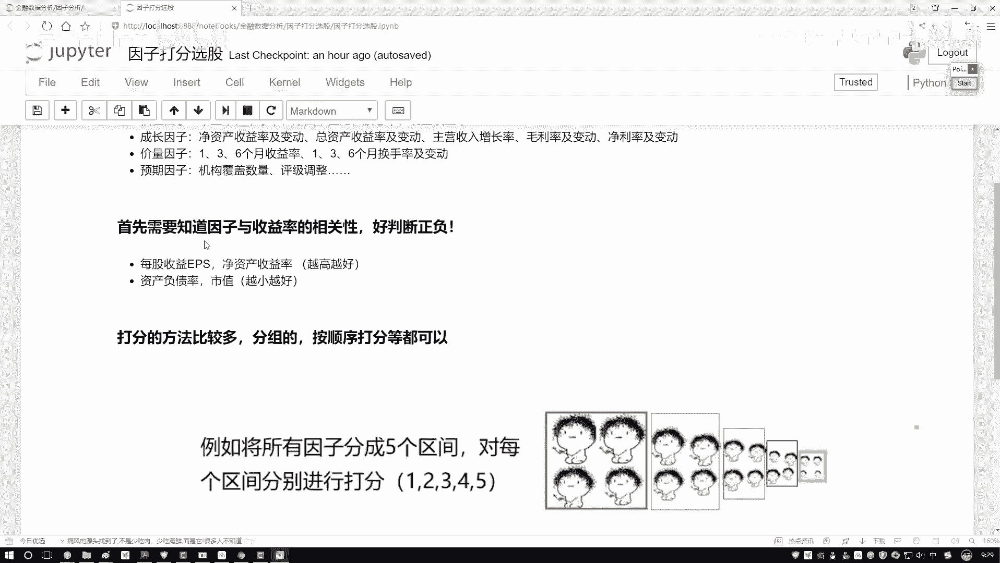

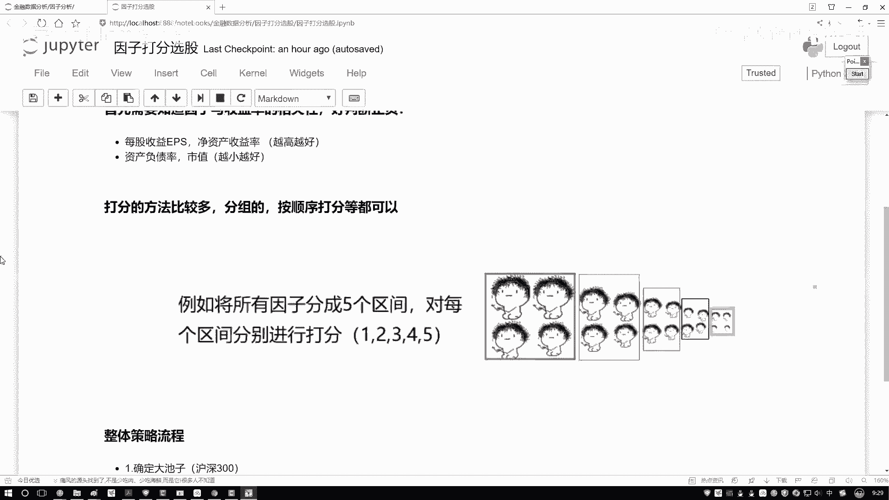

第一步第一步啊，你得告诉我啊，你要去到哪儿找咱们当前的一个数据。一会儿呢我们是到这个大池当中。哎，就是我们第一步在那个count当中啊，咱们先指定好那个沪深300一会儿啊咱们基于这300个股票去选啊。

这是我们现有的一个池子。然后呢既然我们要调仓了。哎，咱们不拿这个每日啊其实正常情况下，每月每个季度是比较常见的啊，每月可能更常见一些，咱拿每月做一个调仓。所以说我们要设置个定日器，哎。

在这里写上一个函数。然后呢我们重点啊其实就要实现这样函数，就是一个rebalalance，在这个rebalance当中啊，我们要去干什么？那首先呢我们是不是说啊哎我们要把数据给它先读进来。

那比如这里我们有几个指标，刚才这给大家说了，我们前三个是越大越好的，后三个是越小越好的。哎，这个当做我们的一个先验知识，或者是我们的一个经验值吧。那读完数据之后，我们是不是要去计算一下。

当前哎每个指标打好分了，打好分完之后还没完，我们是还要汇总得到一个总分。分总分之后，哎，我说买前十的是不是行了，看起来流程哎相对来说还比较简单啊。一会儿呢咱们就拿这种打分法来去试试水，哎，看一看。

用打分法啊，我就随便选了几个指标，看一看能够能不能够使得咱们的收益哎，能够翻多少倍吧啊，这个意思行了，咱们来写一下我们这一个策略。

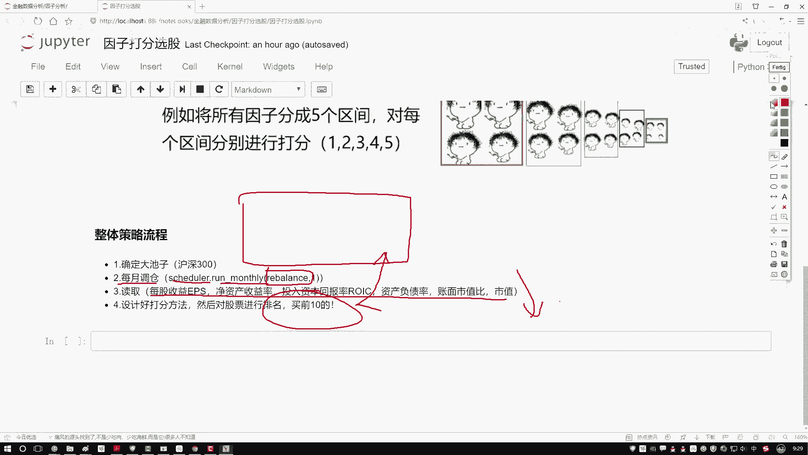

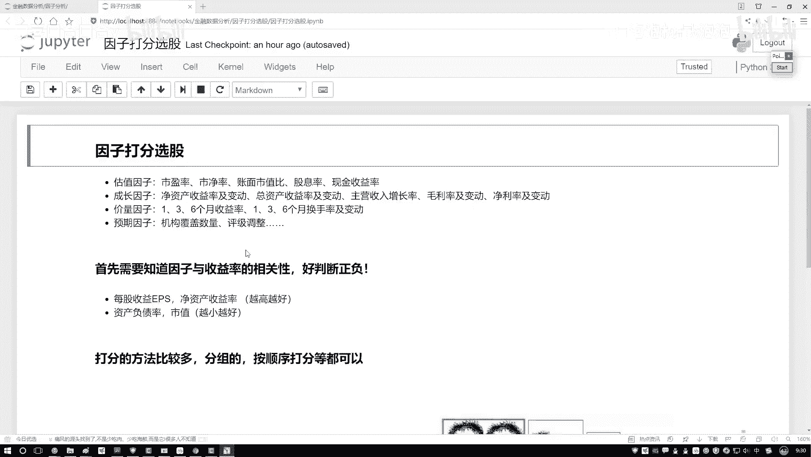