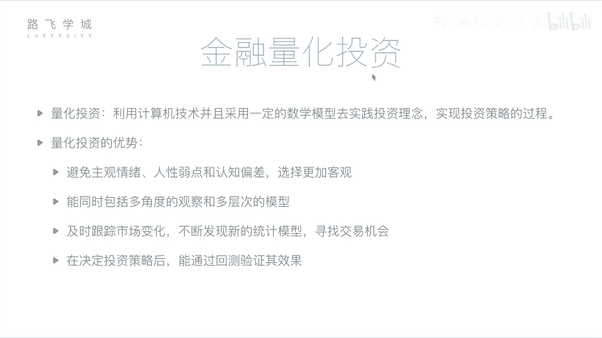
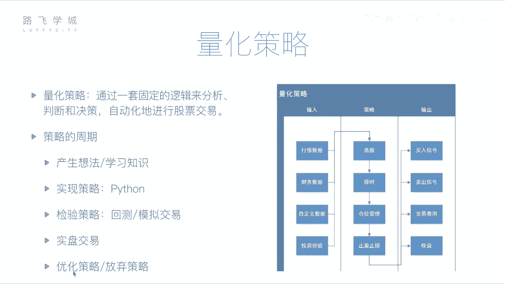

# 【量化交易教程】全100集（完整版）清华大佬耗时一月讲完的系统python金融分析与量化交易实战课程，包含基础教程，进阶学习，项目实战案例讲解，存下吧，比啃书好 - P8：06 金融量化分析-金融量化投资介绍 - 路飞学城Alex小助理 - BV1Zi6AYjEG8

好，然后接下来我们再说一下金融量化投资的概念，那刚才说到金融分析是通过一些，我们可以通过基本面或者是技术面来做一些，这个对公司对这支股票的一些判断呀，啊那这个判断的过程，实际上我们可以交给计算机来做啊。

因为你的一些基本面分析，你的财务报表我们可以获取到行技术面分析，你的历史价格，交易记录，我们都可以获取到，那这个价这些分析的过程，哎我们通过计算机来帮我们做，那这个过程我们叫做量化投资。

或者叫做量化分析，嗯啊所谓量化投资就是说利用计算机技术，并且采用一定的数学模型，去实践投资经验的理念，实现投资策略的过程啊，首先这个投量化投资三点这个重要的部分，第一点计算机技术。

或者说你用计算机编程的方式，第二点是数学模型啊，所谓数学模型其实就是一些策略，一些套路，就是你怎么样通过哪些指标啊，比如说我们可以说刚才的均线，它就是一个数学模型对吧，你取前五天取前六是这样的啊。

就是一个数学模型，第二一个，第三一个你要去实践啊，你要去拿着这个拿着你写好的，这个通过数学模型写好的这个计算机程序啊，你要去实现的对去或者是真正的去做投资，或者是你要先预先做一下尝试。

看看他的策略是不靠谱，对对对啊，这是量化投资，那量化投资相当于相对于我们之前人工的一些，投资商的些好处呢，嗯第一点啊，我们说它可以避免主观情绪，人性弱点和认知偏差，选择更加客观，啥意思呢。

我人是带有一些主观性在里面，比如说啊这个股票啊，这个这个呃举个什么例子呢，平安银行这个股票啊，我买了，我一直拿着呢，各种迹象都表明它要跌了，但是我就是舍不得抛啊，呵呵我拿了两个月了，我有感情了。

就治不着，我就是不舍得慌，我就觉得他得涨，你这个就是对吧，就结果如果你的判就客观的判断正确的话，嗯在下降了，对，或者有的时候，他你买的股票连续两天或三天跌了，那但是可能纯粹是因为一些啊。

技术原因导致它跌了，并不是说真正这只股票不好，但是因为你连着看着两只股票，这支股票连续好几天跌，你心里就觉得卧槽是不是不行了对，所以你就忍不住可能想抛，对我刚才说的这个人情，但你一抛啪就长了。

他说的这叫认知偏差对，就是你人的认识可能没有机器看的多对啊，那也就是说第二点，机器能够同时包括多角度的观察，和多层次的模型呀，它可以同时看看很多事情，他算的东西比你快，他可以同时看很多股票。

他可以看股票的很多方面，比如说看均线，看你的财报等等等，都可以看，那你人可能同时处理不了这么多信件，也就是说你啊你你人去炒股，相当于你时间久了之后，你会总结出一套自己的经验逻辑对吧，也就是套路对。

那这些套路就是说啊怎么讲，你可能如果是真正一个有经验的这个投资者，那他不是像散户一样夸，觉得哎好就买了，他可能经过N多方面的分析啊，从技术角度看各种指标，另外从基本面，从公司的运营强化状况，从那个行业。

Whatever，就反正各种指标，有的时候还就是我跟我做金融同事说，他还要什么玄学，要考虑到什么风水什么的，这都涉及到对啊，当做指标，那当你相当于把那么多指标，那么多层面维度去看一只股票。

才决定它好与坏的话，那你相当于你在这只股票上，花的精力是非常多的，对那你这套呃相当于这套经验，这套套路，你想如果是说能让你去呃，去怎么讲，好几千只股票里都去看这样。

那是不是就更容易帮你筛选出那个哪些股票，对OK的，但你人一天你一天可能就这所有指标走一遍，可能只能看两只股票，但你把这些东西如果总结成这个规律提取出来，变成计算机的程序。

那可能就是那10分钟帮你把全盘过了一遍，对啊对，然后第三一点，这个量化投资可以及时跟踪市场变化啊，不断发现新的同级国家缺乏交易机会，什么意思呢，你人我们说这个你的股票价格，是每时每刻都在变的嘛对吧。

那诶我人如果是盯着这个大盘看的话，我需要一一秒不停的俩眼，一直瞪盯着屏幕，看到就说诶马上是个买入的机会，赶紧买，那你人的操作肯定不如计算机快，嗯啊你从早上九点到下午三点，你盯上连续听他一周。

你可能就累的要死，那计算机你可以程序在那一直监测着他，发现买的结果，他就一直买，他的这个反应要比你及时啊，第二一个你还可以尝试一些新的方法啊，你人的教练你有可能就经验就固定在那里，那你的经验也不一定对。

那对吧，你可能也不不改，或者不想去尝试一些新的方法，但是程序可以啊，你觉得这个策略表现的差一点，或者是可以想想尝试些新的，那你就写一个通过机器学习，帮你去学习新的策略，套路啊。

就是你可以用一些新的套路来长时间啊，第四一点，我们说在决定这个投资策略之后，我们能通过回测验证此效果啊，什么叫回测啊，你金融量化投资的一般都有的这个回测功能，就是说我制定了一个策略。

我直接去拿这个策略真正的去交易吗，有可能你这个特点不可，有可能你这个特点写的不对，那就赔钱了，那你直接去交易，会导致你障碍就被咬了，但是我们可以做一件什么事，做一件回测，所谓回测就是什么诶。

我这个策略一下好了，套路固定在这里了，好我我不知道未来会怎么样，但是我可以拿历史数据去检验一下，你就是我假设现在是17年，我假设我拿这个套路，我从12年开始炒股，诶，我看看到了17年，我拿这个套路。

我是赚钱还是赔钱呢，对那你多试几次啊，比如说我从12年开始，从13年开始，就12年到13年，各种各样的时间段去验证你这个策略，也哎判断你在综合判断你这个策略是不是靠谱，对啊。

所以如果你你经过一系列的回测加上调整，因为回测完你发现哎可能这个感觉涨的不够多，你再调一个指标对吧，再调那个指标哎夸夸，慢慢慢发现直接就能啊，连续要涨好多，对对不对。

那你相当于历史数据已经相当于客观的证明了，这个策略是OK的对，但基本上你在从拿到这个真实的环境中，去跑的话，一般啊也差不太多。

对嗯嗯好，接下来我们就说一下，这个金融量化交易里边的核心，就是我们说的量化策略，就是你的套路嗯，啊那你的量化策略主要包括哪些呢，啊主要输入啊，就是你这个策略，或者你这个程序需要拿哪些数据啊。

就可以拿到哪些数据，比如说我们有行情数据，也就是说你昨天前天就是历史上，你今这个这一天的这支股票的价格是多少，交易量是多少等等等等，相当于你指的这个输入，就是说我先把啊，我这个策略要就是策略的各种就对。

就是就是各种指标维度给他这个数据源，拿到拿到数据源再分析，因为你的程序也是要通过一些数据来判断的，不管是基本面或者基础面对好，那行情数据就是你历史的交易，比如昨天的这个开盘价，收盘价，交易量等等等等啊。

财务数据就是你各个股票，各个公司的财务报表，对啊，包括你还可以自定义哪一些数据，你可以自己想要什么数据，什么数据，比如说你可以不是有机器学习吗，嗯你去做新闻啊，就是你研究分析你这个新闻。

是是你这公司是这几天丑闻多呀，还是好的新闻特别多啊等等啊，包括你个人的投资经验，你都可以放下投资经验，投资经验就是你比如说你这个你你去，你你你这个买股票的时候，你会参考这个这个今天的这个风险。

参考这个什么今天的这个对玄学的东西啊，这真的有有把这个当指标了，对好哎，哎这是出入，那接下来你的策略做哪几件事呢，我们说有这些四件事，第一件事选股嗯，选股是啥，就是说我诶我几千只股票我买哪一只耶对吧。

这叫选股啊，第二一个择时嗯啊什么意思呢，我几千只股票我是哪天买还是哪天卖，我什么时候买出去，什么时候买，什么时候买，因为我总是期望我低价买入，高价卖出差，我能赚钱嘛，就是我什么时候诶。

这个时间选择叫择时，第三一个我们叫仓位管理，这是啥呢，我可能同时不是只买卖一只股票，对我可能同时投了十只股票呀，那是十支股票，我判断他们的个接下来要涨的几率，可能不一样啊。

能够判断这支股票可能接下来肯定会涨，那我是不是把我的钱，我整个有我的钱我多分给他一点，嗯啊那这就叫仓位管理，就是说你这这些资金怎么分配给这些股票耶，啊这叫仓位管理，第四个叫做止盈止损啊，就是什么呢。

一些必要的手段，你的策略要什么呢，哎我就是你可能已经，比如说你已经赔了10%了，那我是不是要考虑要止损了，是不是要赶紧赶紧把它卖出去了，别再接着赔下去了，就是我控制我赔的别超过10%啊，这叫止损。

那止盈也是止盈，是基于什么考虑呢，止盈你觉得赚了30%了，那接下来它是不是不会再涨了，他是不是要回去要落，要回落了呀，那就是只能我适当的诶，我见好就收呀，别等着我不，我等着我赚200%，那不太现实。

对不对，止盈的考虑啊，这是你的策略做的四件事啊，选股则是仓位管理和止盈止损啊，接下来就是你策略输出，所谓输出就是说你这个策略给来给这个股民，有什么这个告诉你一声，今天该买股票了啊。

或者是直接去对应到你的那个券商上哎，直接去给他自动唉发一个信息，我要买入了或者卖出了，这就是买入信号或者卖出信号啊，我判断好时间了，决定要买要卖了，我觉得不管是给你个人发一个。

或者是自自动的连接到券商上，给他发一个信号啊，第三一个交易费用和收益交易，所谓交易费用就是说我这个买卖花多少钱啊，因为你买股票呃，需要我们说需要手续费，需要佣金啊，这个后边都会说到。

就是你要花一些手续中间的价格给那些券商啊，给交易所这些啊交易费用，然后包括收益，就是我这次这个买卖赚了多少钱，还是赔了多少钱，然后我整体的这个就是一个月内是赚了，还是赔了各项指标等等价格啊。

这是一个输出呀，啊，那这个图就是我们说的这个，量化策略的这个结构啊，意思，这个策略啊，我说有一个周期，就是说你怎么产生这个策略怎么用，然后到最后是扔掉还是说在改进啊，有一个过程。

那这个过程首先第一个啊产生想法，然后有一个idea，我或者说我多年的经验啊，这是一个想法，或者说我今天学了一个指标啊，我这个这个这闭关10年看一个指标，我觉得这个指标很有用啊，我学习到的东西啊。

产生想法，然后接下来你把这些想法变成你的，计算机程序啊，就是通过编程的方式，在这里我们用Python啊，接下来一段时间我们给大家用Python来做，就是怎么样哎去实现你这个策略，那实现了策略之后。

哎我有程序了，我们刚才说到，我们不是直接拿去交易，我们现在怎么样检验一下嗯，啊用回测的方式判断你这个历史，这这10年不说，这几年你这个策略放进去是好还是坏嗯，那除了回测，还有一个叫做模拟交易嗯。

模拟交易就是从现在开始，嗯啊我假设我已经开始交易了，我并不是实际交易对，但是你还是比较慎重，对我慎重，我从现在开始，我可能觉得我历史是不是不太靠谱，历史跟现在毕竟不一样，比如说你回测。

我们到时候会看到你放到股灾那一年，你可以看到你很难有策略，所有策略都不好使，可能好多策略都不好使，对那我们从现在开始，哎，我们来做一段模拟，就是我假设我投钱进去，但是我没有从现在开始，一天过过一个月。

我看一下我的模拟交易就赚了10%，你很高兴，但是你并没有收你钱进去，你你用的是实盘数据，对用的是实际的数据，但是你并没有扔钱进去，Yes yes，然后哎检验完了之后，我觉得没测或者模拟交易啊。

表现都不错，那你真正把这个策略运用到实盘开始用了，开始用了，或者把这个策略卖了啊，卖了咱们讲完课就可以把套流卖掉啊，卖给那些金融公司啊，这个对吧，然后别人就这个策略，因为你已经证明了非常有效嘛。

你投1000万1年给你挣个20%，那你就可以实盘交易了，实盘交易啊，交易的过程中，当然你也可以说唉比如说或者是回测的过程中，检验的过程中，你看这个交代这个策略有一点不足的地方，你可以调整一下，优化一下。

或者是哎呦就赔了，这放弃再换下一个啊等等等等，这是你的策略的周期啊，那这就是我们今天讲的这个金融量化啊。

量化策略和量化投资的一些基础知识，那接下来我们会给大家讲，就是如何用Python来做我们的量化交易，当然在讲之前，我们就有几个模块要给大家介绍一下，就是我们数据分析相关的模块。

因为我们接下来的量化分析会用到这些模块，也是一个工具，让我们更好的做这个策略，好的好。