# 【量化交易系列11】交易数据获取（量化交易python实战06）qstock爬取股票交易数据 - P1 - master学堂 - BV1YdHdebEog

大家好，欢迎来到master学堂，很多粉丝问我啊，我们说了这么多的策略，那股票数据是怎么得到的呢，今天啊我们就来分享一下，怎么通过Python去爬取每天的股票交易数据，无论是机器学习也好。

还是量化交易也好，数据都是非常重要的，我们通过数据去构造我们的策略，但也通过数据去检验我们的策略，今天呢我们主要用q stock这样一个API，去爬取股票的交易数据，这些数据主要来源于东方财富网。

同花顺，新浪财经等等，那么大家想一想，我们做量化交易需要的数据都是哪些数据呢，也就是说它最基础的数据是什么呢，首先我们要去跑机器学习，我们要训练构造训练集，测试集，验证集，那肯定需要股票的历史交易数据。

这是非常重要的，那历史的交易数据就包括了它的成交量，周盘价，开盘价等等，这是其一，其二当我们验证某一个策略有效之后，我们要进行一些实盘或者进行一些实时验证，还需要股票它的一个实时的数据，比如说我在啊9。

40，我就能够看到9。40当前的收盘价，当前的成交量等等，所以这两类数据是非常重要的，也就是我们在做量化交易需要的最基本的数据，所以我们沿着这两个方向啊，去看一下。

我们怎么去利用这样一个API去获取这些数据好，首先讲这个API它的安装比较简单，导入也是比较简单的。

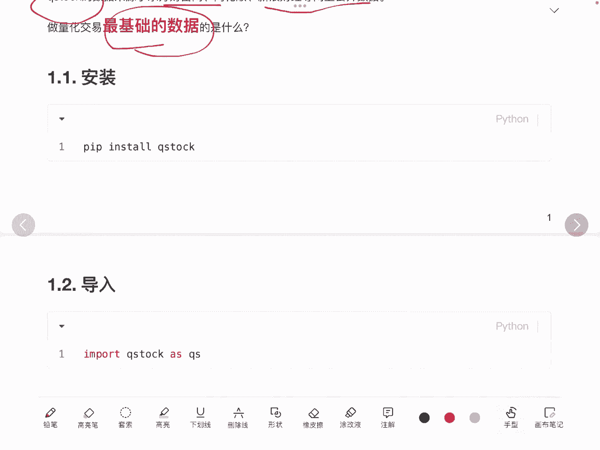

这块简单看一下，我我就不展开了，首先我们需要看历史数据去怎么爬，历史数据比就比较简单了哈，就是直接用这个get data这样一个API，首先我们需要给定我们要爬的是哪些数据，这儿有一个候选集。

这儿有两个股票数据进行一个demo展示，输入股票的股票代码啊，以及我们要爬历史数据嘛，那自然历史数据就要看历史的起始时间，结束时间这块我们自己去指定，要爬的是天级别的数据，当我们爬完之后。

就得到了一个data的一个df data frame，我们来看一下它一共有哪些类啊，它有名称啊，股票代码，开盘价，收盘价和最高价，最低价收盘价，成交量换手等等，大家可以看到我们这儿截取了啊。

这两只股票它的一个数据，这个是符合预期啊，那我们拿到了历史数据。

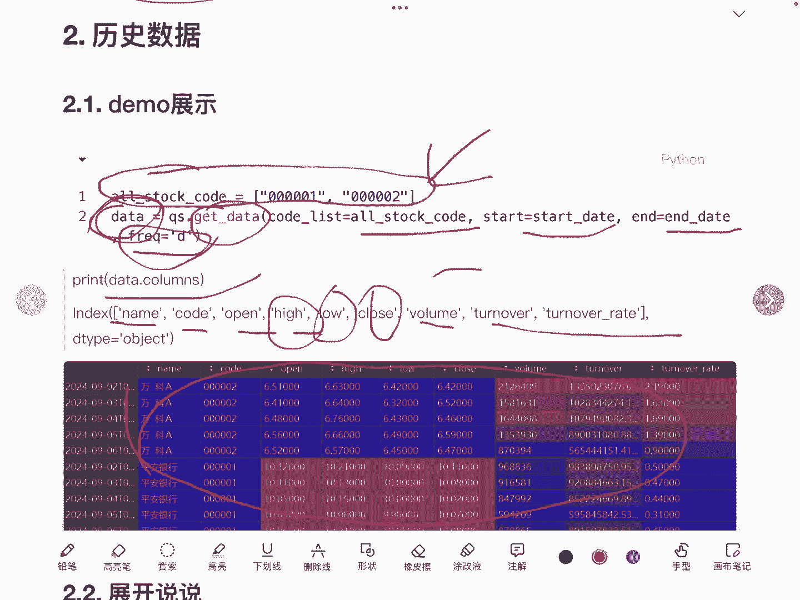

是不是就可以去做一些验证，对这一个API我们还有几点要说明它的候选集呢。

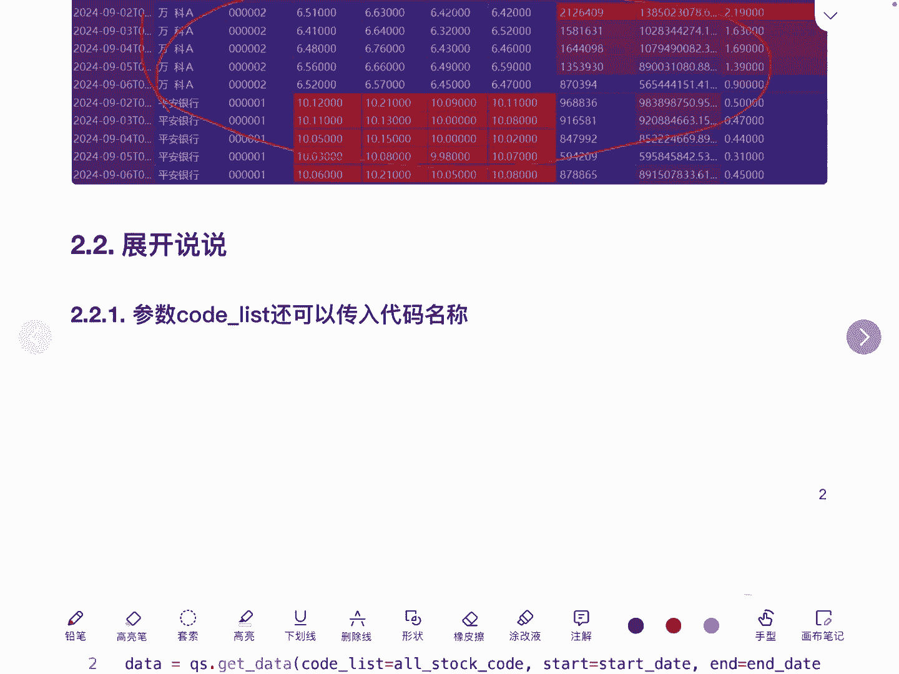

code list啊，也就这个参数它还可以去传的是啊，股票的名称同样啊也是可以得到的。

这是股票的名称，那这就有个问题啊，我们现在传的是这两个股票啊，如果说我们想要去获取啊。

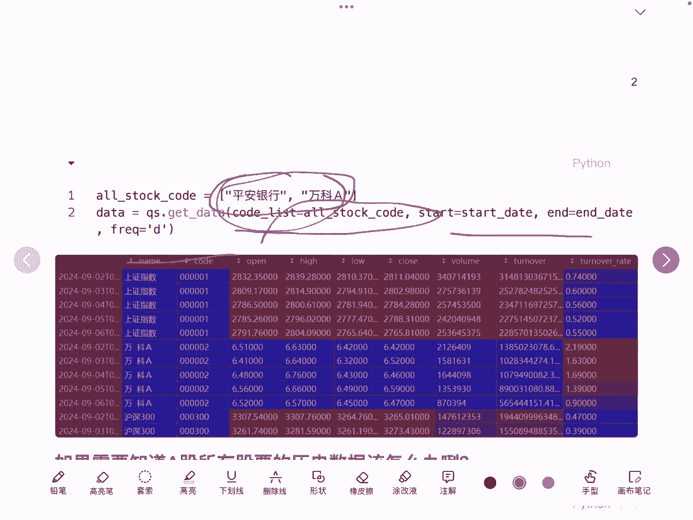

整个A股所有股票呢。

它的历史数据该怎么办，为什么需要有这样一个诉求呢，是因为我们在跑的时候，我们首先是要去做一些股票的一个呃一个筛选，选股嘛，量化交易里面很重要的一环就是选股，那我们肯定候选集是A股的所有的股票。

那我们都想要去知道啊，A股所有股票他的一些历史数据呢怎么办呢，我们是不是需要知道一个候选集啊。

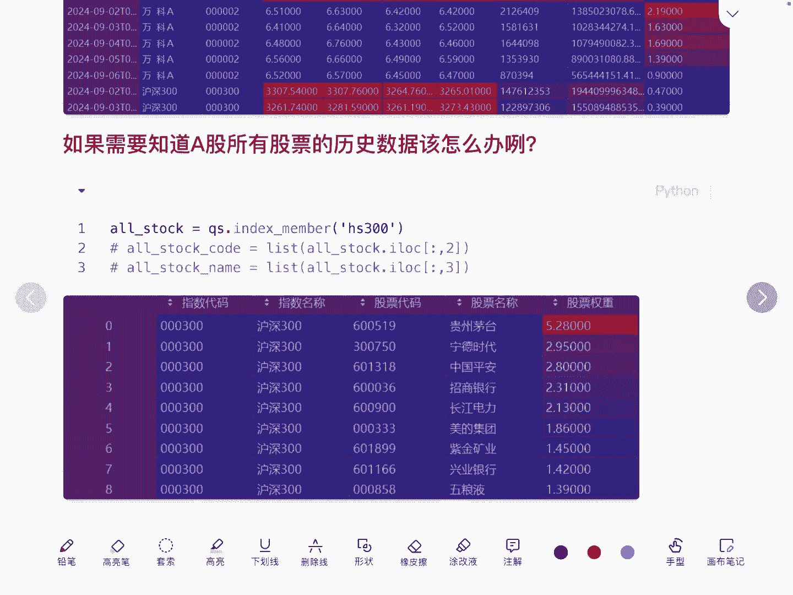

这个候选集就是A股的所有股票了，这儿有一个呃小trick。

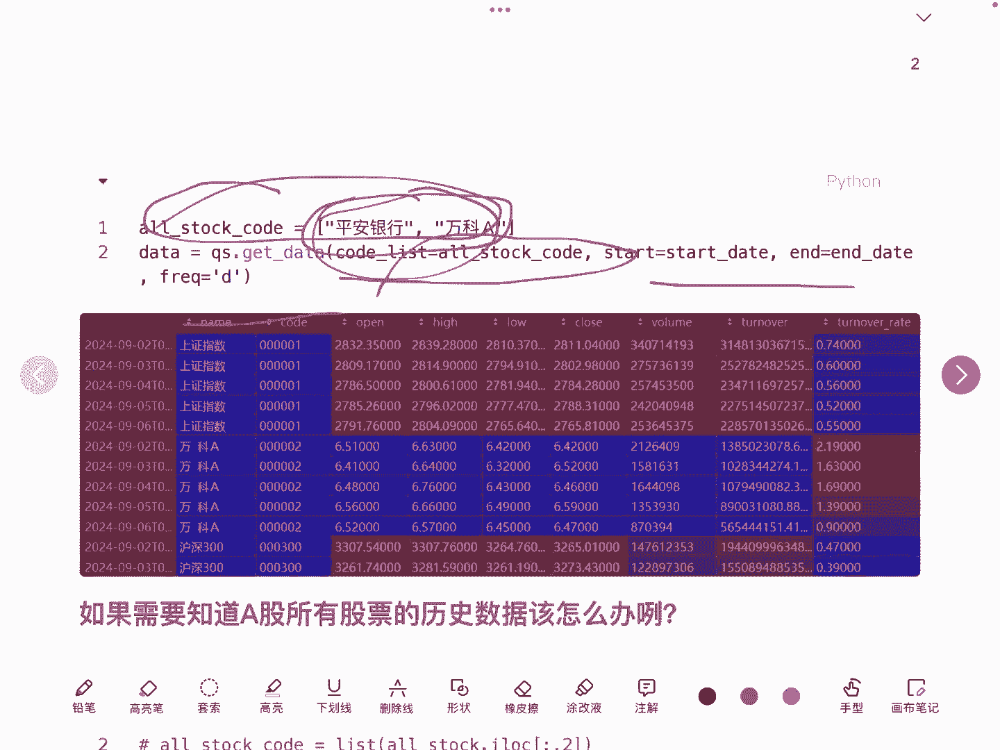

也是我自己找了，发现有一个接口，jindex member这样一个接口，它可以去获取股票的这个候选集，但是我没有找到A股的所有股票，就沪深A的这样一个参数按进去，但我们就以这个沪深300为例啊。

这个接口就可以拿到沪深300，一共300只股票，他的股票的名称，然后我比如说我们要拿到它的代码的话，股票代码的话，是不是就可以相应的用这个第012，是不是第二列是不是就拿到了股票代码。

同样我们如果要拿到股票的名称的话，就是第三列股票的名称，那通过这种方式，是不是可以拿到沪深300的所有股票，然后再去利用刚才的这个API。

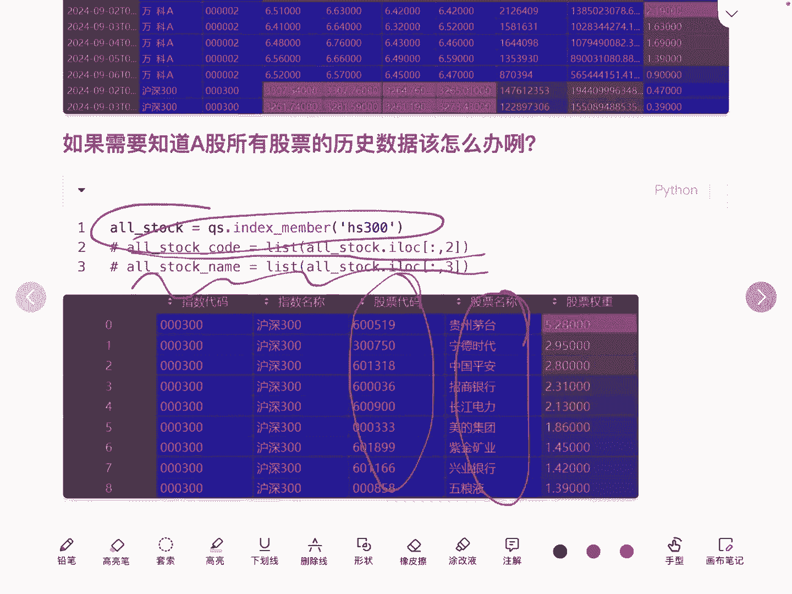

来获取，沪深300的所有300只股票的历史数据好，那怎么去拿到A股所有的股票呢，是不是同样的道理，我们要去拿到A股一共5000多只股票，他的股票代码是什么，对吧，这块我留个悬念啊，我们下面再讲好。

历史数据我们已经解决了，现在就来看实时数据怎么获取呢，这块我们要用这样一个接口叫real time data，在这里我们就可以拿到，比如说沪深A传沪深A，来看一下它最终输出的是什么呢。

输出的一共有哪些字段，第一代码名称，这是是识别出一个股票票，因为它实时数据嘛，那就它有当前的涨幅，最新的价格最高最低开的价格，换手率量比市盈率，成交量，成交额左手总市值，流通市时间。

这个其实就跟同花顺上面。

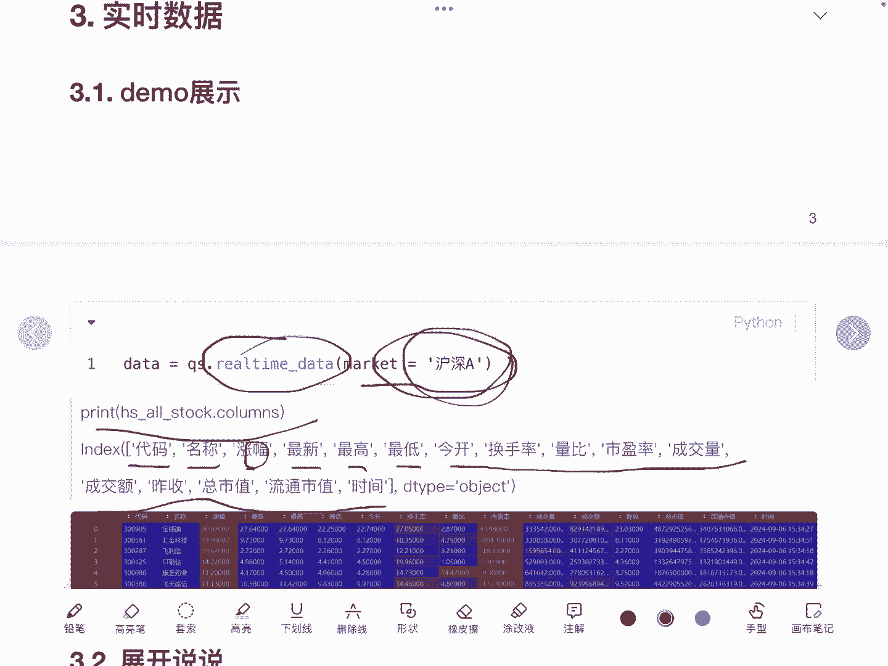

我们大家看到的这个界面的数据是一致的，好这块就展示了一部分数据啊，代码名称，涨幅最新等等，大家可以结合着自己去看一下啊，有没有问题好，针对这个API呢，我们要简单说几句啊。

第一个我们刚才传的是market market。

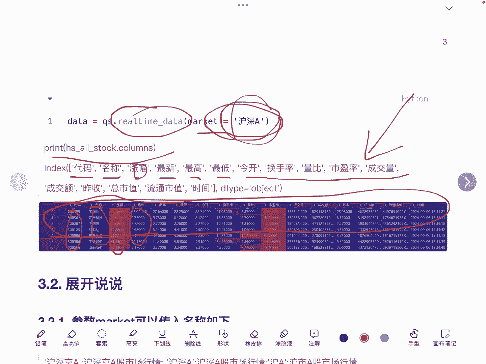

传的是附身A，那这个market呢它还可以传很多的其他的一些名称，比如说有护身金A沪深A沪A深A，甚至还有期货，港股，美股，新股，科创板等等，上证指数等等这样一些市场。

然后第二一个比如我们传这个ETF啊，传ETF，它可以把所有的这个ETF，它的一个情况给他数据拿到，此外我们还可以从这个API去获取某一个指数，或者某个板块的股票集合。

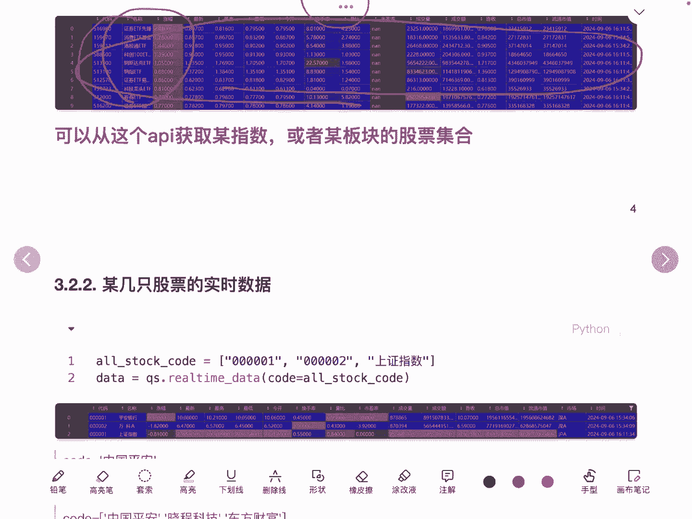

当然还可以获取某些股票，某些股票具体的股票，因为我们本来它的结果就是股票嘛，只不过他拿到的是某一个板块，下面的所有的股票，比如刚才我们看到是沪深AM，它里面的内部所有股票。

所以我们可以用code这个参数，刚才我们传的是market market，现在是用的是code的这样一个参数进行一个传输，这里我们就拿到具体的股票代码，这儿拿到了平安银行，万科以及上证指数。

它其实是个指数，因为他传的是扣的嘛，而不是market的，这注意一定要有区分好，那么刚才想一下，刚才我留的一个思考，就是说怎么去获取A股的所有的股票的集合。

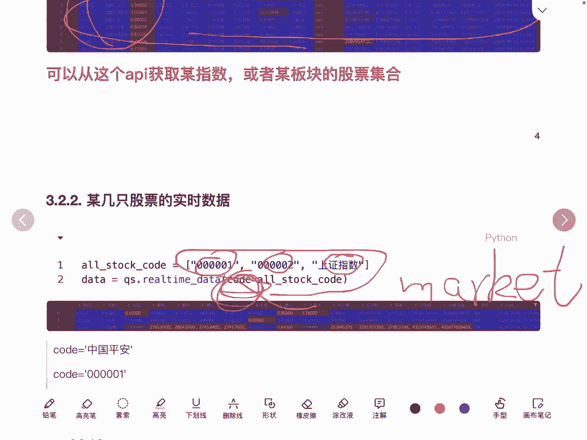

其实在这里沪深A其实就已经拿到了沪深A，它其实就是获取的是整个沪深A下面的，所所有股票的一个集合，看这里啊，其实这里面的股票就是沪深A下面的所有股票，但是这里他只能够获取实时的数据。

也就是当前这个时刻的数据，所以我们要在获取历史数据的话，就通过这样一个去拉所有的股票的代码，然后再进入到历史的数据，就可以得到沪深A所有的历史数据的集合了。

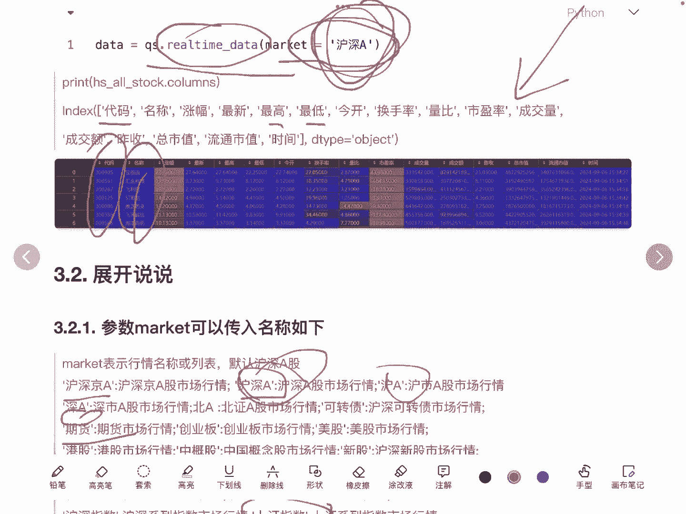

好这儿做一个隐身q stock的这样一个API呢，它还可以拿到其他的一些财务指标，同花顺个股行业概念等等宏观经济指标，大家可以通过这样一个GITHUB网站去看一下。

他这个具体的使用都介介绍的非常的清楚的，有兴趣的话可以去看一下，或者有需要的话。

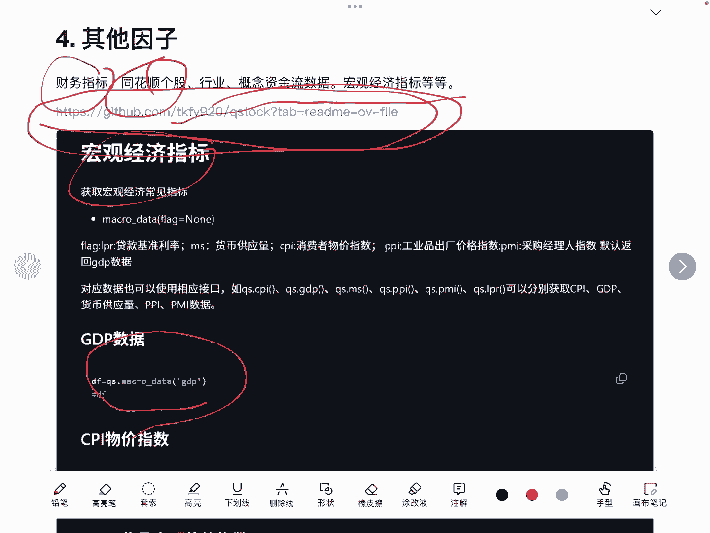

好的，欢迎大家搜索，然后进行交流。

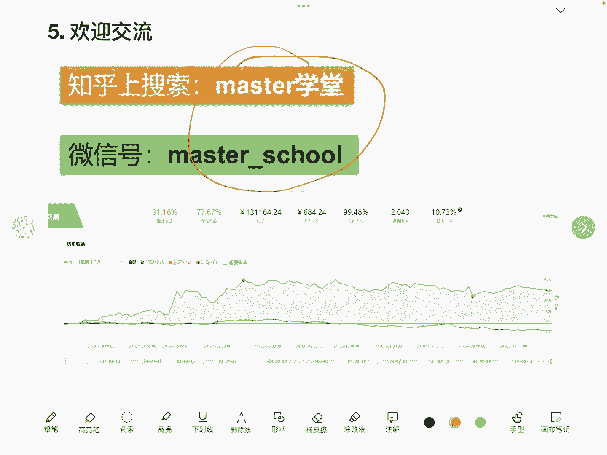