# 【量化交易系列19研报复现】草木皆兵因子研报python复现1（分层实验怎么做） - P1 - master学堂 - BV1Pu2RYJEbq

大家好，欢迎来到master学堂，在研报里面，我们经常看到，作者对设计的因子做了很多分层实验，用来评估因子是否与收益存在线性关系，然后对比不同的分桶之间收益率是否存在差异。

今天我们基于上个视频分享的方正证券，研报里面所涉及到的惊恐因子来完整梳理，怎么去做分层实验，在方正证券这篇研报里面，我们将要复现两个专题，第一个是分层实验怎么去实现，第二个是在我们上个视频卖了一个关子。

原始的惊恐因子，在研报里面使用的是惊恐，收益因子和惊恐波动因子，它们之间的等权求，和我们上个视频讲到这个参数，0。5其实是一个超参，我们可以使用模型训练去优化，找到这个最优的权重是多少。

我们将会在下一个视频去分享超参的训练，以及怎么去构建数据集，其中就包括训练集，验证集，测试集，然后怎么去把模型搭建完成，然后获取最优的这个超参，那在今天这个视频主要分享的是，怎么去实现这个分层实验。

简单的回顾一下，我们上一个视频讲的因子的细节，第一个是惊恐度，惊恐度这一块其实我们在讲凸显性因子的时候，也讲过一个很类似的因子，那么在这里我们就不再赘述了，大概思路就是。

用股票的日收益率减去市场的平均收益率，除以日收益率的绝对值，加上市场收益率水平的直，然后两者相除就得到惊恐度，这里举了一个例子，那么下面这个代码，就是整体的惊恐度的实现形式，我们在这里市场收益率的水平。

取的是整个市场收益率的中位数，使用的是medium这样一个接口进行实现，当我们计算出惊恐度以后，我们很轻松就可以得到原始惊恐因子，原始惊恐因子是基于惊恐度与股票的收益率，之间的乘积，构成一个新的序列。

我们基于这个序列去求取均值，就得到了惊恐收益因子，求标准差就得到了惊恐波动因子，最终用等权求和，得到论文里面使用的原始惊恐因子，那今天我们就基于这个原始惊恐因子，惊恐收益因子和惊恐波动因子。

这三个因子来构建分层实验，我们来看一下今天的实验步骤，首先我们在前面视频讲到了，怎么将数据进行本地存储，那么存储完成之后，这里是使用一个q lab的初始化，初始化完成之后。

我们获取整个股票数据集的所有股票，然后去直接获取收益率，使用的是收盘价除以头一天的收盘价，再减一，就得到了股票每一天的收益率，我们在计算金控因子的时候，其实只使用了收益率。

所以我们在这里只需要用到收益率就可以了，第二步，我们需要基于我们读取到的本地数据。

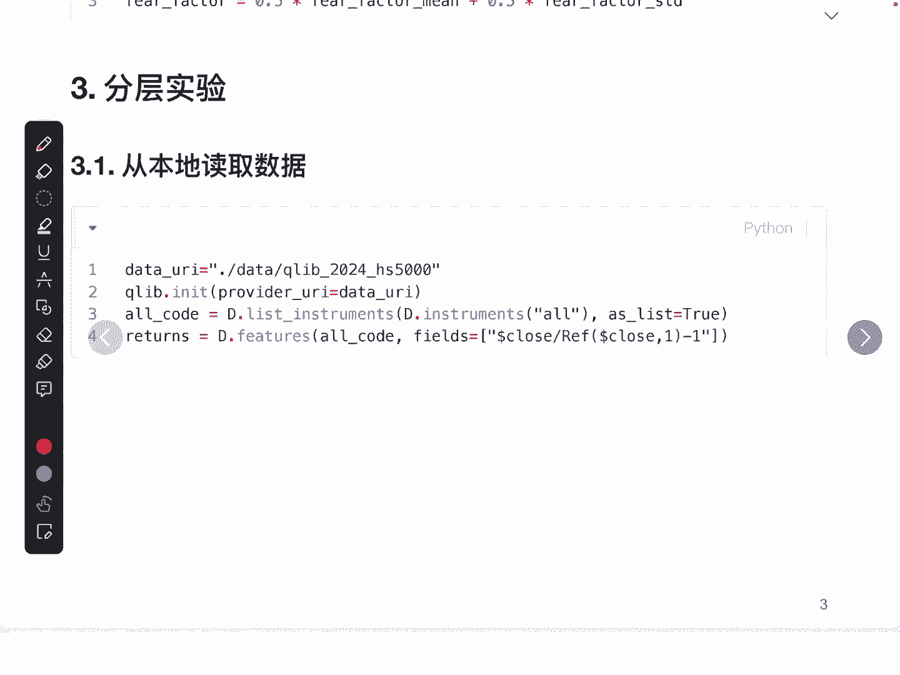

去计算惊恐因子以及构建标签。

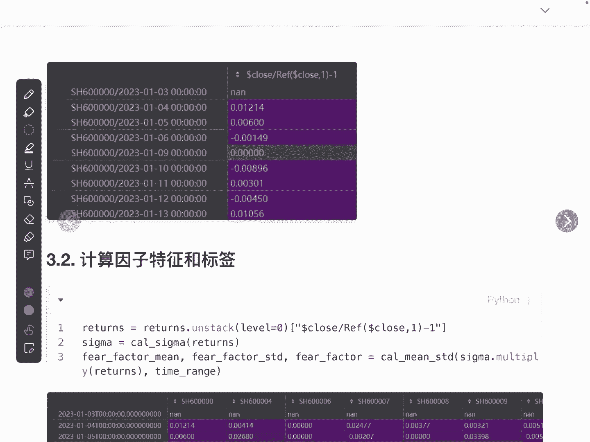

在第一步当中，我们读取到的数据是这样一种形式，它的索引是股票加上时间是一个两层索引，它的值是每一天的收益率，为了便于后面的运算，我们将它展开，那展开完成之后，它的行索引就是时间。

每一类都代表的是一只股票，而每一个元素就代表的是这支股票，当天的收益率，只不过这个当天的收益率是相对于昨天的，所以我们在第一行里面它是空的，因为他昨天没有数据。

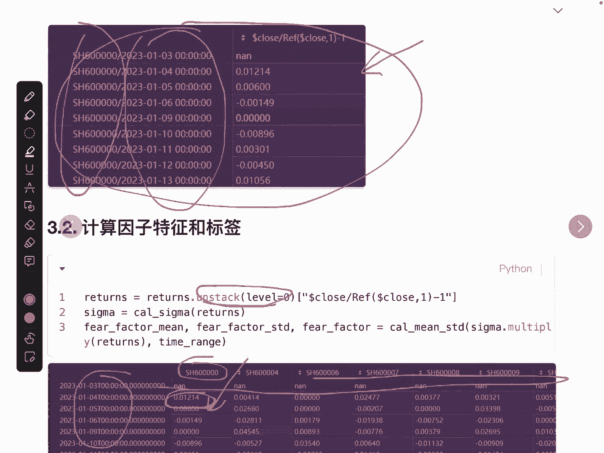

利用我们前面讲的惊恐度的计算。

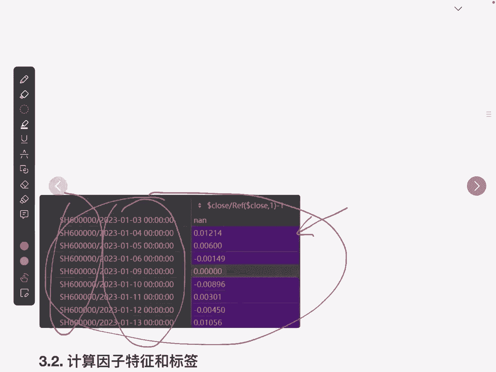

可以得到这个西格玛权重或者叫惊恐度，惊恐度得到完了之后呢，我们就利用收益率和我们的惊恐度，它们之间相乘构成序列去计算它的平均值，标准差以及等权求和，那么就得到这三个因子，那完成了因子的构建。

其实我们也完成了标签，在这里标签收益率，注意这里收益率要使用未来一天的数据啊，不然他就使用了当天的数据，这个是有过滤盒或者叫未来函数的风险的计算。

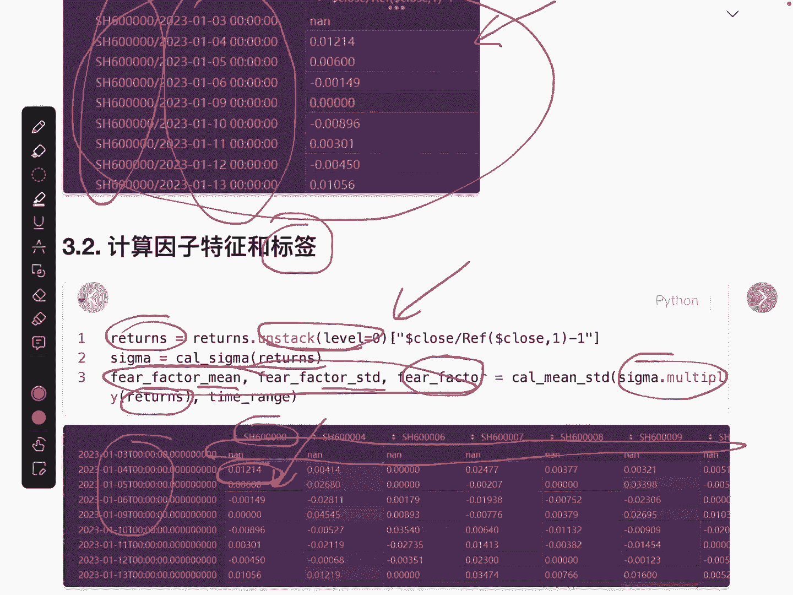

完成因子特征和标签以后呢，我们需要对因子进行分筒，非要怎么去做分桶呢，我们要知道每每只股票，它在每一天的收益率是不同的，那收益率不同就可以得到每一只股票，它的因子也是不同的。

而每一只股票的因子就是我们分桶的依据，我们将这些因子按照从大到小，或者从小到大进行排序，比如说分成五个桶，那么最小的这20%就组成了一个分桶，或者我们把它弄成一个标签，依次到一筒二筒，三筒。

那我们一共有三个音字需要处理，所以我们会做一个循环，依次去处理惊恐收益因子，波动因子以及原始惊恐因子。

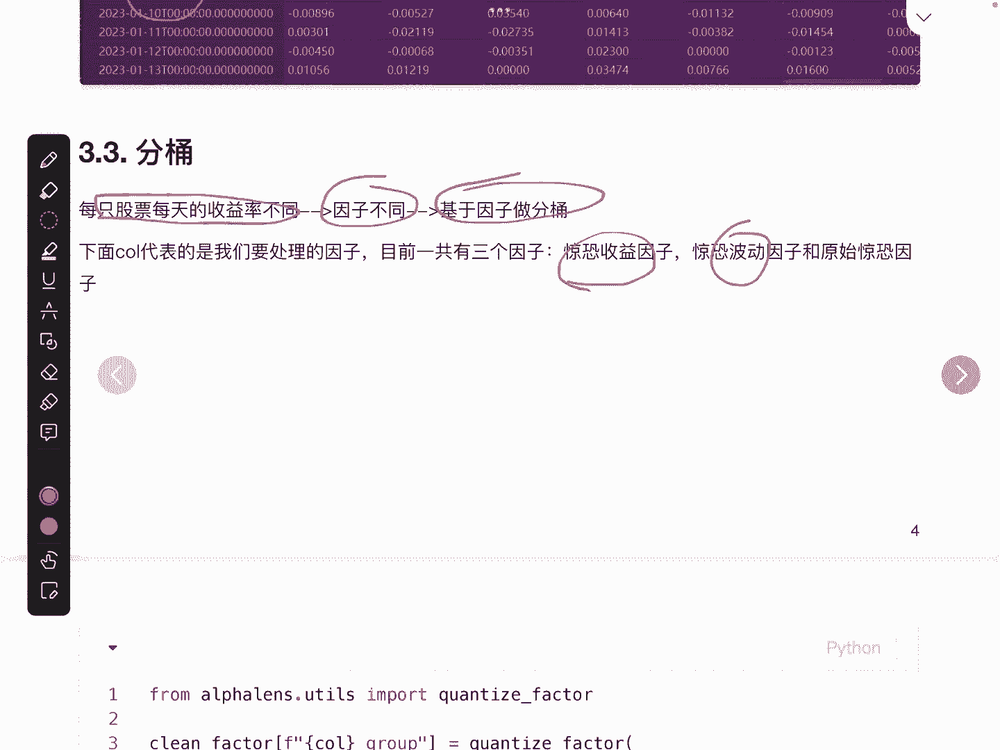

我们来看下代码是怎么实现的，在代码里面，我们使用了阿尔法length这样一个第三方库。

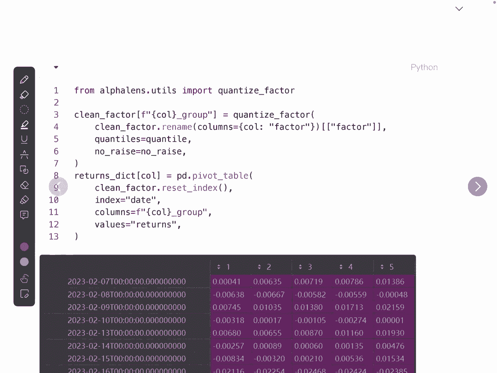

进行辅助，我们的分桶，在这里分桶，我们需要指定我们是对哪一个因子进行处理，比如说我们第一个因子，cover是使用的是惊恐周益因子。

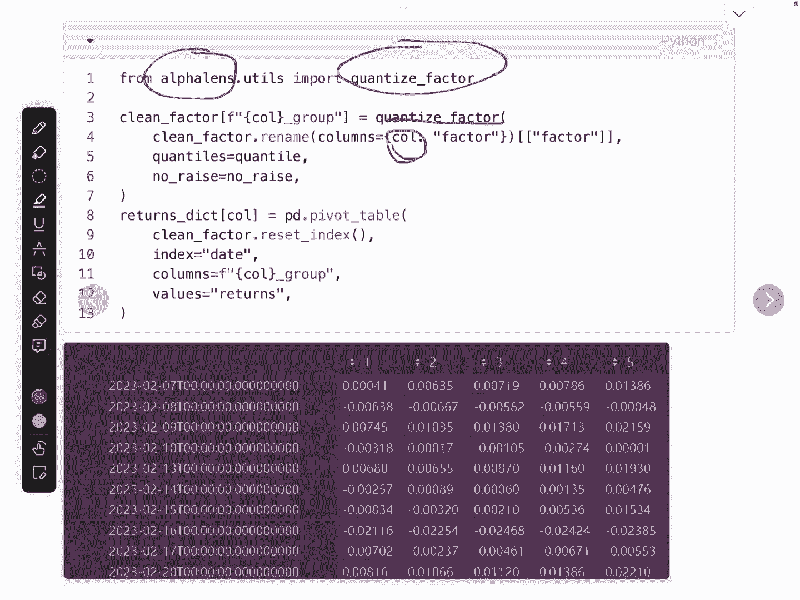

那么在这里就是使用惊恐收益因子那一类，我们把这一个惊恐收益因子作为原始数据输入，然后要指定我们分桶的个数，最终就会得到一个标签，那这个标签就意味着，每一个股票在当天它是属于哪一个桶，桶，拿到了之后呢。

我们需要对每一天每一个桶的收益率进行计算，那么它计算的逻辑是，我们比如说2月7号的这一天，把所有是统一标签的这些股票进行均值处理，就得到了统一在这一天的收益率，我们使用pandas里面的这个API。

拿到每一天每一个桶的收益率，那最终使用这个函数就得到了下面的这个数据，这个数据就代表着每一天，每一个桶的收益率是多少，那我们对它进行求一个一加，求和之后进行一个累乘，就得到了它的净值曲线。

可以理解为是一个累积的一个收益值。

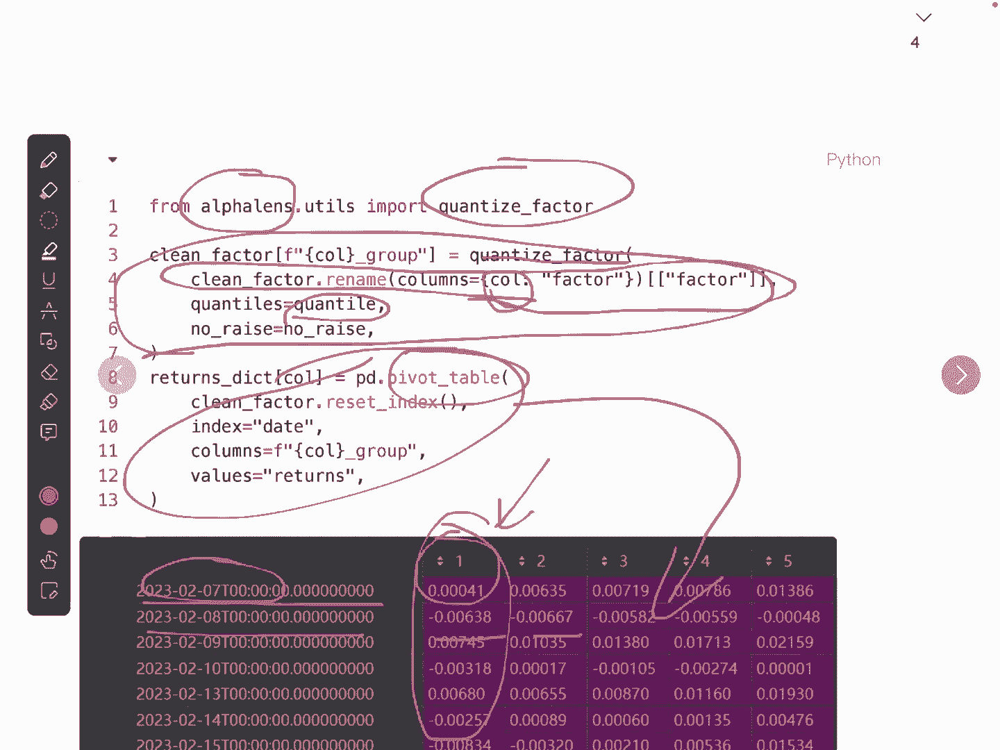

所以我们在下面的这一步骤，就需要去计算这样一个累积的收益值。

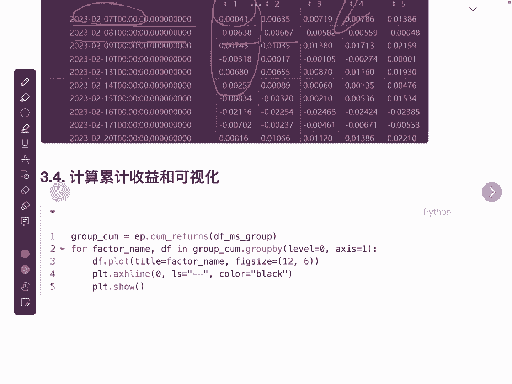

我们使用的coery terms这样一个API，去得到每一天这个股票，它的累积收益值或者叫净值曲线，那最后就简单了，我们直接将这条均值曲线给它绘制出来，这里我们把这个零轴给它绘出来。

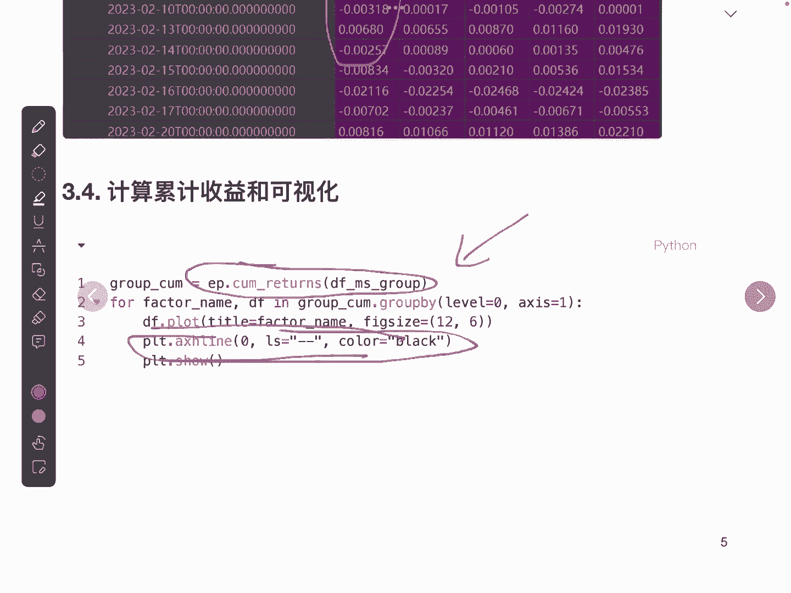

有一共有三个因子，所以有三个图形可以看到的是，我们的因子是可以区分不同股票的一个，收益效果的，那么这就是研报里面所使用的分层实验，它的一个代码，那可以类比到其他的研报里面。

都是可以去复用的好最后完整代码在文章末尾。

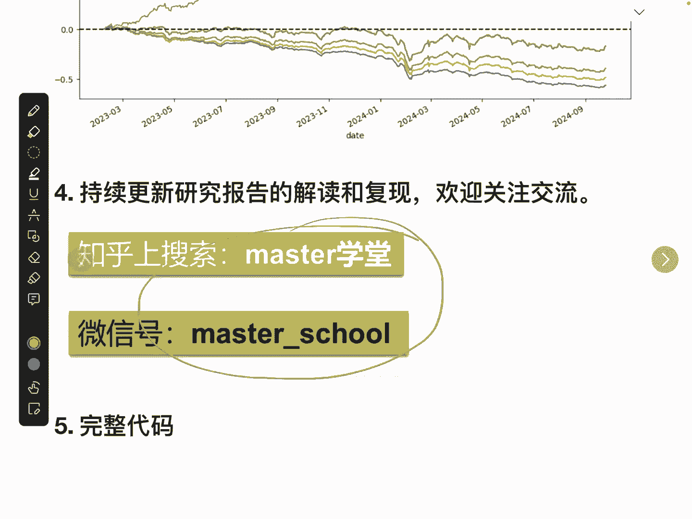