# 【量化交易系列2 研报复现】VMACD指标1年翻9倍，是真是假？（使用python复现） - P1 - 赛博赵唤狮 - BV1gqzpYsEoU

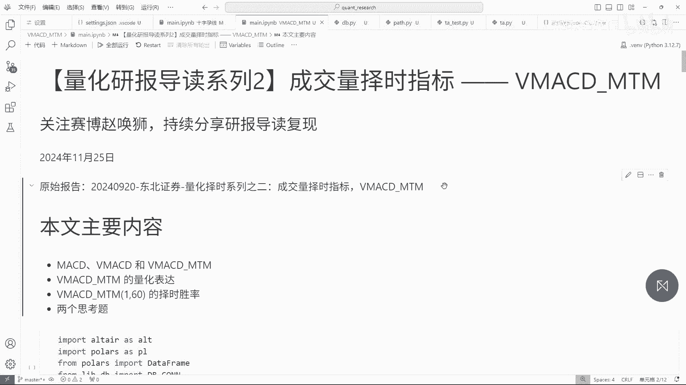

说起MACD指标，你肯定知道，这几乎是同人们入场接触到的第一个指标，他素有指标之王的称号。

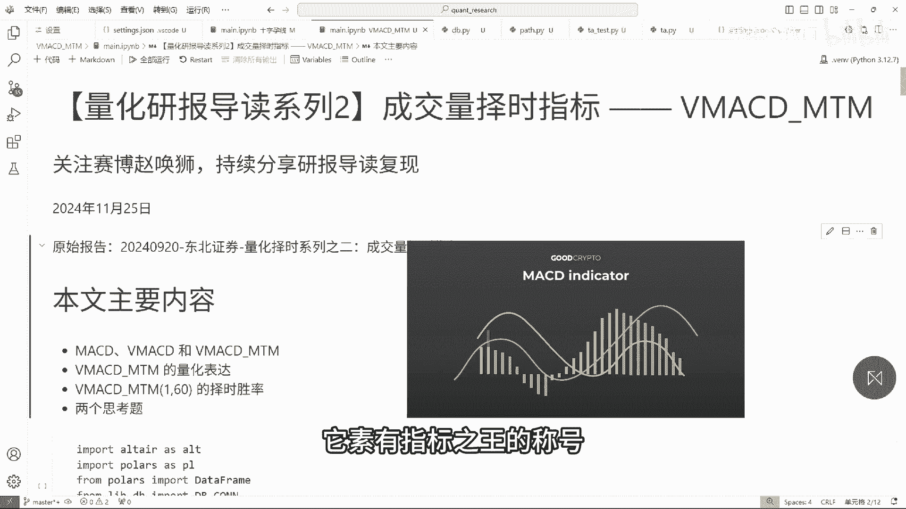

各种基于MACD指标的衍生策略林林总总，看得人眼花缭乱。

然而这其中真正有效的策略又有几分呢，但MACD指标诞生距今已有45年。

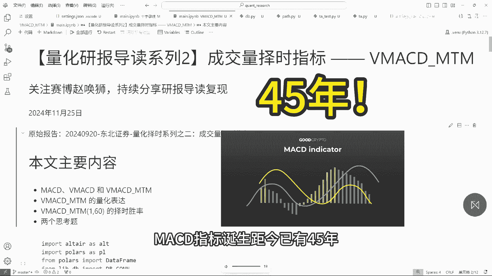

不由得让人发出疑问，但MCD老矣尚能饭否，今年9月20日，东北证券发布的一篇研报，创造性地将MACD指标应用在了成交量上。

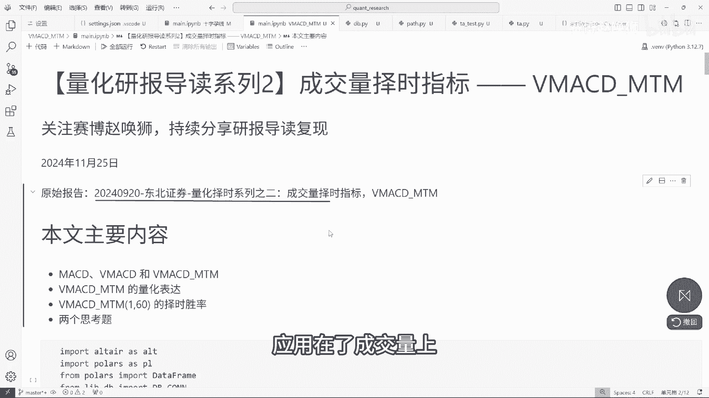

试图捕捉放量缩量信息中可能蕴含的价格变动，择时信息，具体效果如何呢，能否让在梅西帝再续当年金戈铁马，气吞万里之势，大家好，我是召唤师，非常感谢大家的支持，这个系列的第一期视频，就带来了35位粉丝的关注。

这对一个初出茅庐的新手创作者来说。

是很大鼓舞，在这里我由衷地向大家表示感谢，本视频的主角BMCDMTM指标。

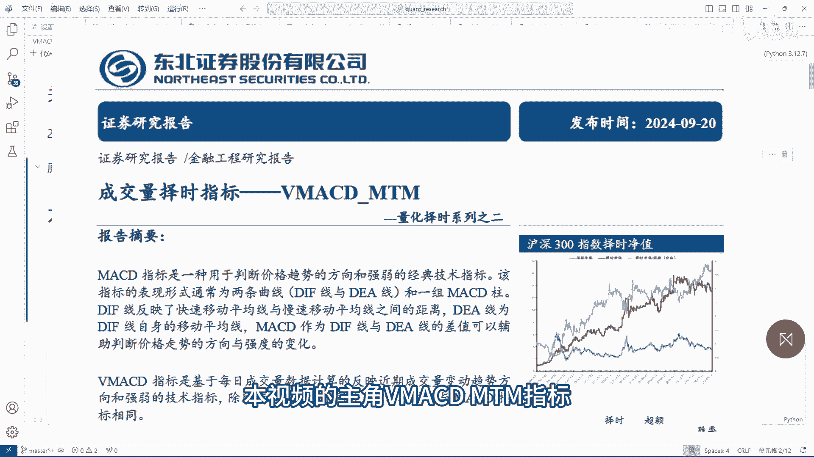

源自东北证券的研报，量化择时系列之二，首先我将为大家简单介绍一下，VMCD的定义和计算方法，然后通过量化手段测试，该指标在过去3年内的有效性，请一定看到最后测试结果非常神奇。

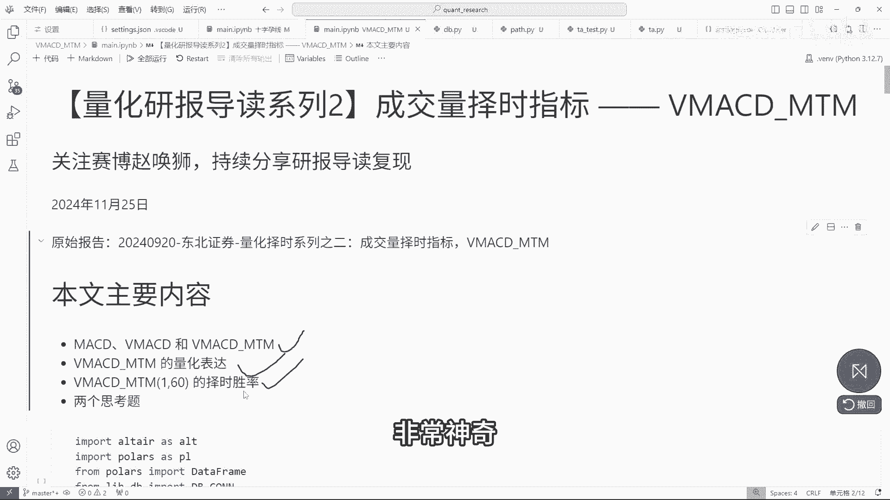

最后我为大家准备了两道思考题，没有固定的答案，期待大家在评论区分享你们的见解。

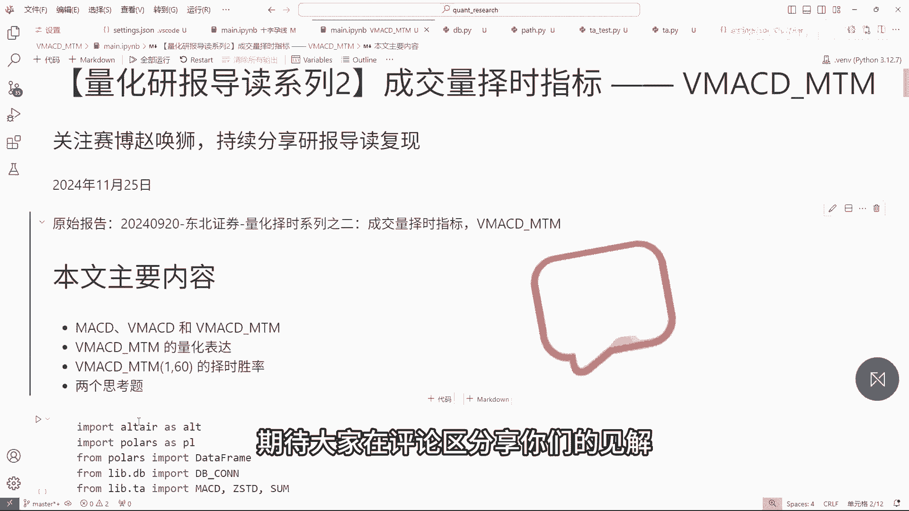

我们先回顾一下MACD指标公式，DMM是快线和慢线的差值，这里的快线和慢线其实就是12日和26日，两个周期收盘价的指数平均值，DA则是DF的指数平均值，最终的MCD是DF和DA差值的二倍。

从公式中我们可以看出，在MACD实际上是一种由双均线衍生出的指标，VMCD其实非常简单，将减may CD公式中的收盘价全部替换为交易量，即获得了VMACD指标，VMCD指标。

表示了近期成交量变化趋势的方向和强弱情况，指标正向越大，说明近期成交量释放强度较大，跟着研报的思路，我们知道，可以通过计算一定窗口之间内的VMC地址，累计增减变化，来刻画出成交量的放量缩量趋势。

进而构造一个择时因子，考虑到指数的成交量数据长以亿计，由此计算得到的VMACD指标数值较大。

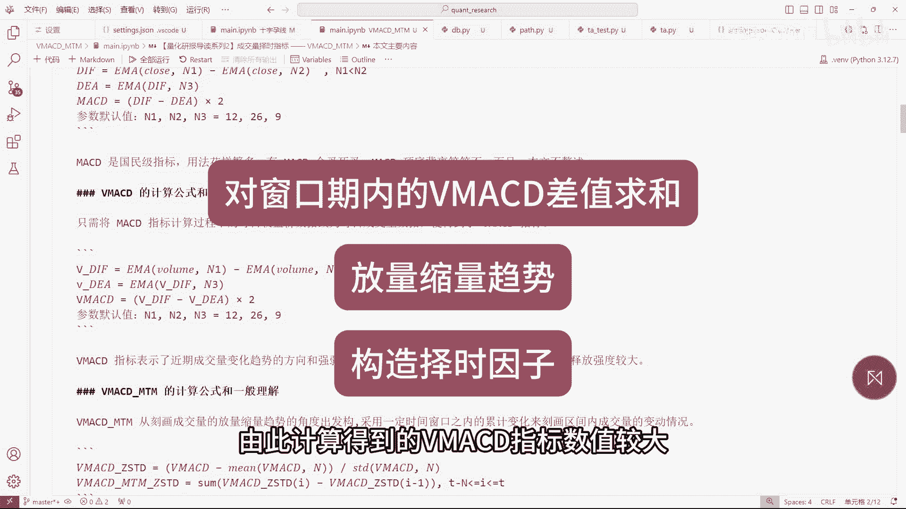

所以在计算之前，我们首先对VMCD指标进行标准化处理。

你看这里就是对VMCD进行标准化处理，标准化是统计学里的一个基本操作，简单来说，它能在保留原始数据分布特征的前提下，把数据转化成0~1之间的数，方便后续处理标准化的细节，不用深究。

一般直接套用现成公式就行，以后我们读研报，标准化操作会经常看到。

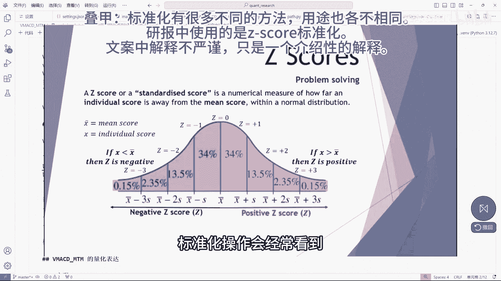

下面一句是计算日内标准化后，相邻两个交易日的BMMCD的差，然后逐项求和，理解起来挺简单的，这里研报认为BMCDMTM大于T，则判断为应当持仓小于负T则判断为应当空仓，根据研报的测算和建议。

我们选择T为一，N为60，当然你拿到这些代码之后，也可以自己多测算几组参数，看看哪个参数更适合自己，接下来我们依据量化描述来编写代码，核心代码就这几行，首先对成交量求在MCD，然后标准化处理。

再然后对两日VMACD之差求和，便得到VMACDMTN指标，然后将指标值超过T的首日标记为买信号日，指标值低于负T的首日即为卖信号日，在这里过滤一些无效数据，只留下触发了买卖信号的交易日数据。

这个位置获取了次日的开盘数据，因为我们假设触发信号后的次日开盘进行调仓，避免偷价，这一行对两次买卖信号之间的次日开盘价做差，求得股价变化率，这一行对两次信号日期做差，求得本次持仓天数。

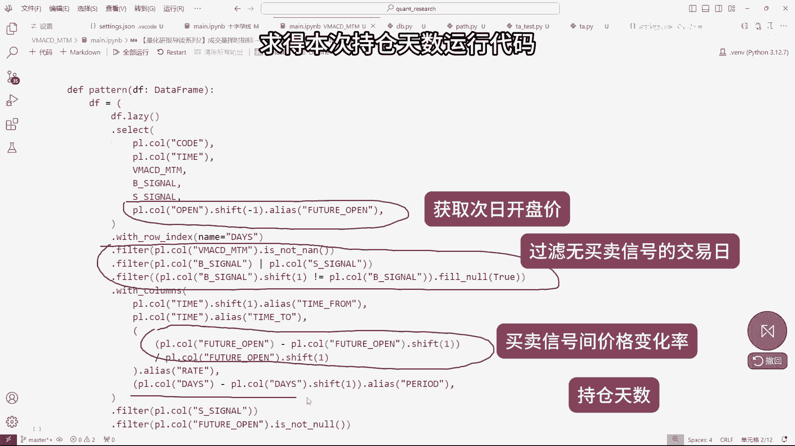

运行代码，我们获得了近3年所有10万多次，V a c d m t m，择时信号指导的交易收益率和持仓周期。

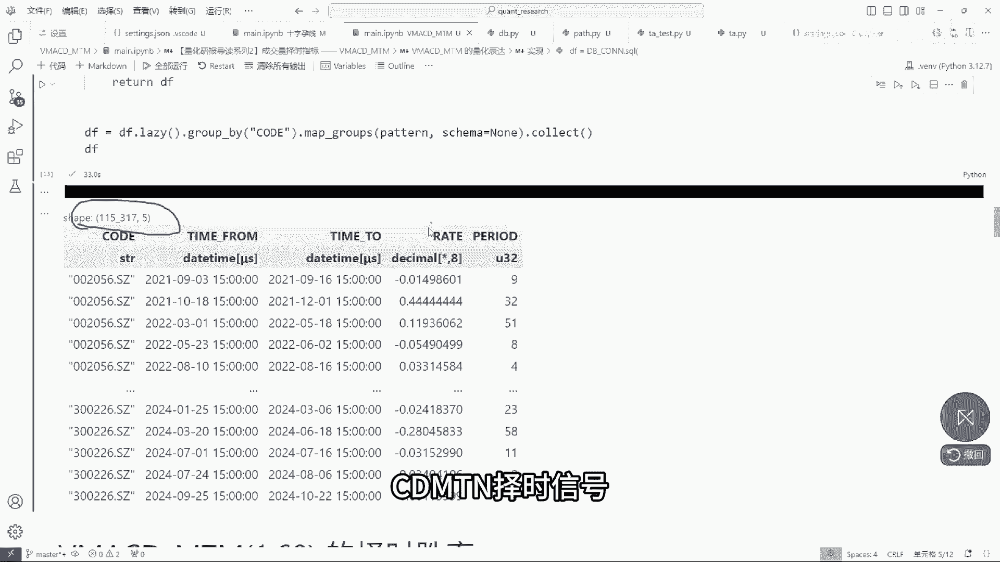

下面我们对数据进行进一步的分析，根据持仓周期统计胜率，将持仓周期以四天为一组，分为八组。

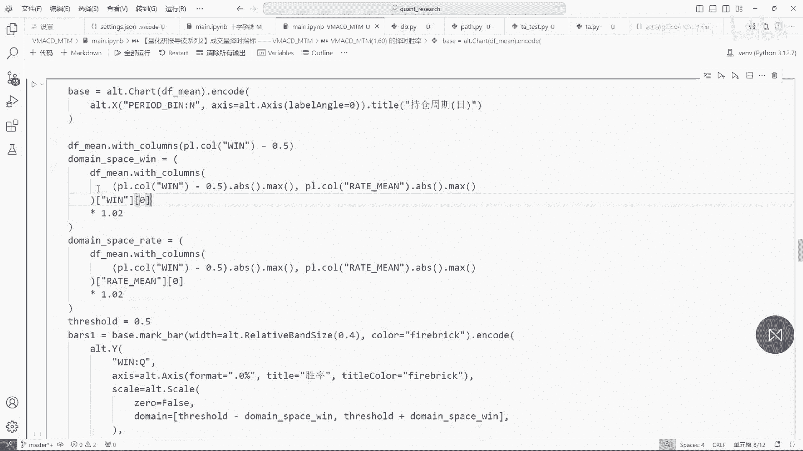

直接看图，整体胜率其实是偏低的，只有45%左右，但是平均变化率是超过零，接近0。4%，到这里我想这可能又是一个不堪大用的因子。

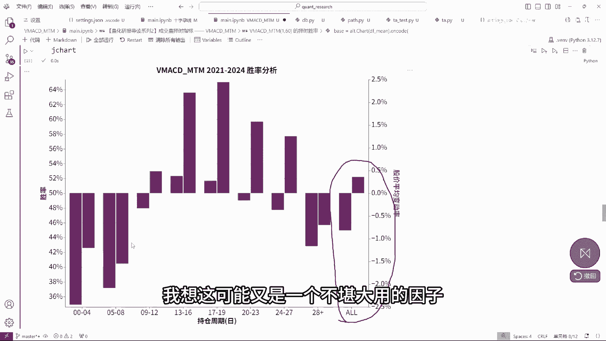

但是神奇的事情来了，一旦将时间范围改为一年内，也就是2024年1月至今。

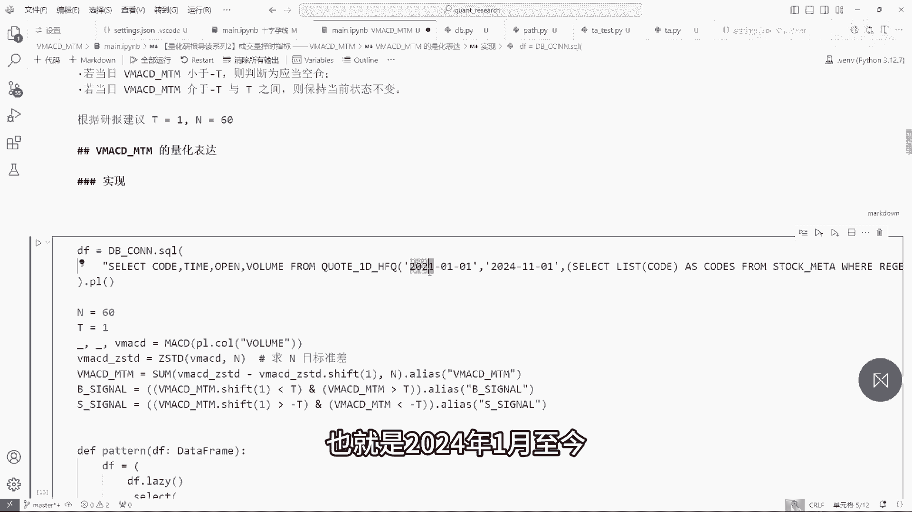

数据就变得很漂亮，九周期以上无论是胜率还是平均变化率。

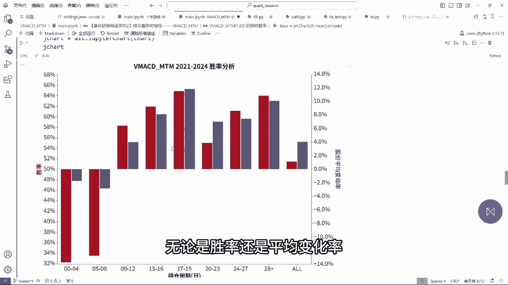

都非常漂亮，有的甚至能达到平均十个点，这可是平均十个点，这就意味着每一次十多日的持仓周期，都有平均十个点的收益，这一年下来就九倍收益，发家致富的道路终于被我找到了慢，千万别高兴的太早，数据也是会骗人的。

这里存在一个量化领域中经典的谬误，引入未来数据，从数据上看，我们能发现长周期持仓的收益率明显比较好，短周期则非常不好，那么试问当买入信号发生时，我们如何能清楚对应的卖出信号，将会在多久后出现。

我们如何保证只操作持仓周期长的情况，而放弃短周期的情况呢，这里我们按照不同持仓周期这个维度做分析的，过程，本身就悄悄地引入了未来数据。

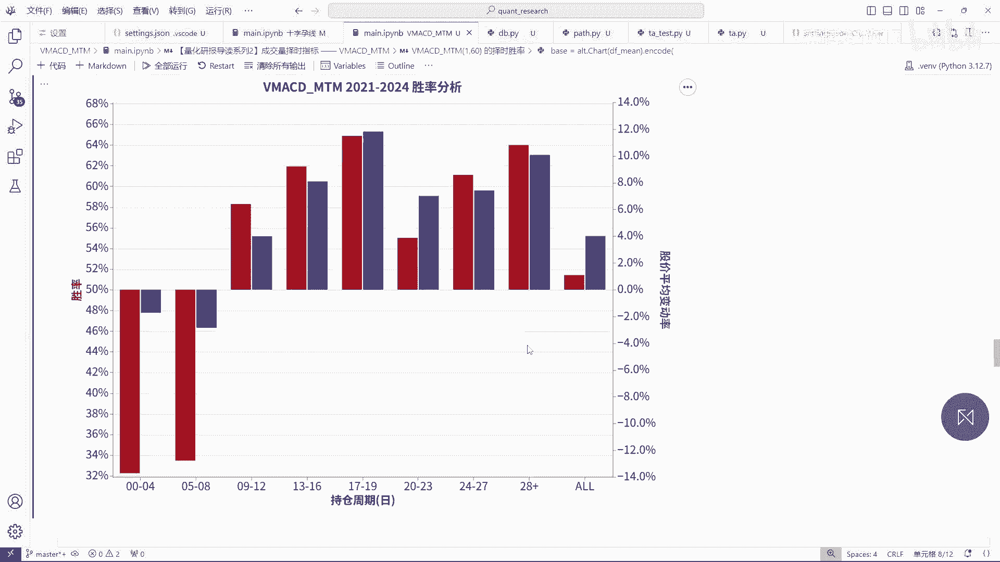

想清楚这一点，我们再回过头来看，持仓周期长，也就是说VMACDNTM处于高位的情况，持续时间比较长，结合BMCDMTM的意义和构造方式，这意味着交易量有向上变化趋势的，持续时间比较长。

从量价关系的角度看。

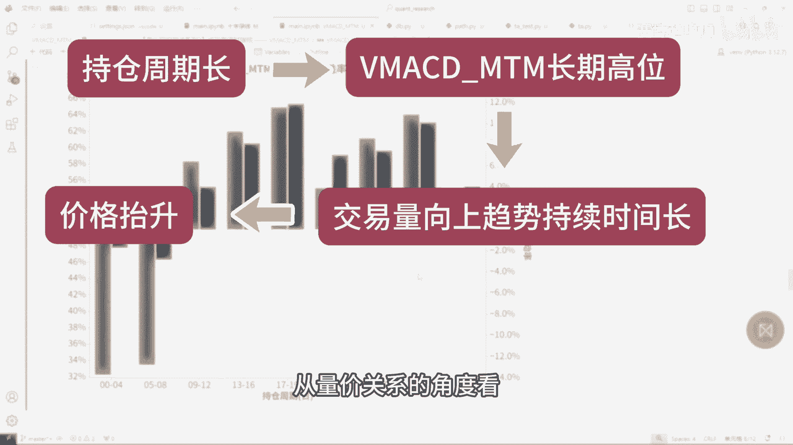

这种情况当然会和价格抬升有较强的相关关系，所以其实经过分析，我们可以得到的结论是，2024年在我们做分析的数据集中，量价相关性相较于前两年更强，并不能认为我们找到了一个闪着金光的因子好。

接下来是我们的思考题，时间一有人可能会想，我能不能通过等待观察的方式，过滤掉短周期的持仓，例如当信号发生时，等待五个交易日，如果5日内产生卖出信号，则放弃掉这次买入操作，如果5日内没有卖出信号。

则此时进场买入，这样既没有引入未来数据，又过滤掉了短期的信号震荡，这确实是一个常用的过滤震荡的手段，朋友们可以尝试通过回测的方式，来判断这种手段是否有效，2BACDMTN的计算过程中。

有一个不太容易被注意到的坑，这个坑可能导致v ma CD m t n的计算结果。

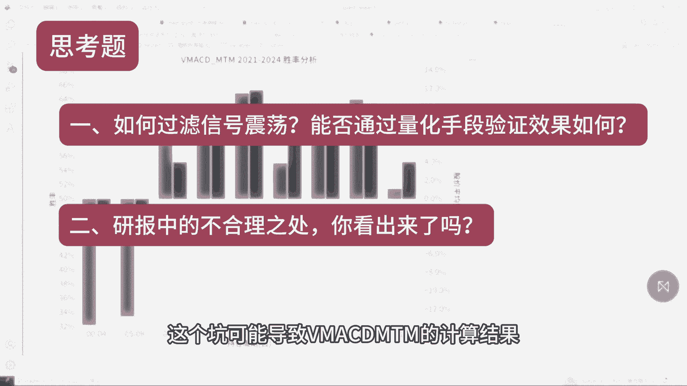

和研报设计初衷不符，你发现了吗，如果本期视频点赞超过30，我就专门出一期视频，谈一下自己对这两个问题的理解，如果我的视频能对你有所启发，请给我一个三连，以示鼓励，作为一个新人创作者，你的每一次点赞评论。

都会让屏幕后面的我偷偷开心，很久都会成为我继续前进的动力源泉。

我是赛博召唤师。