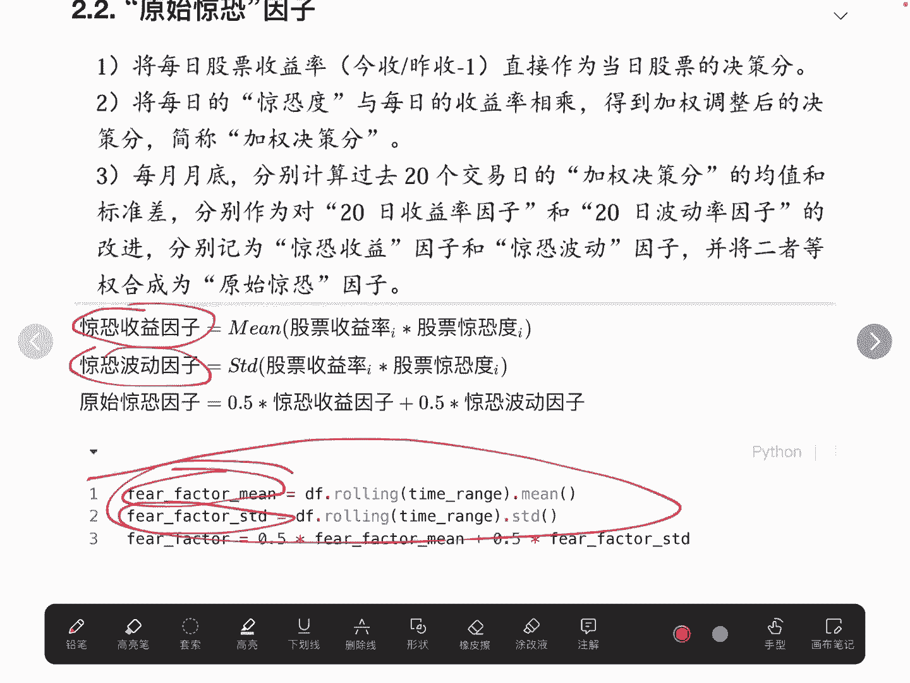
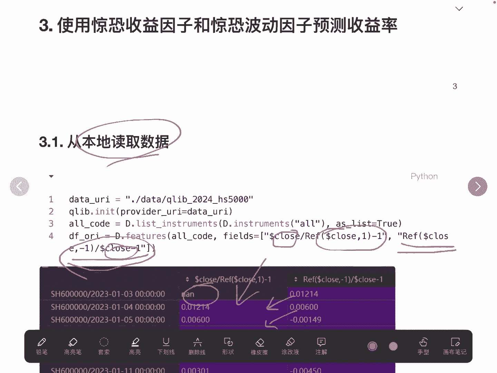
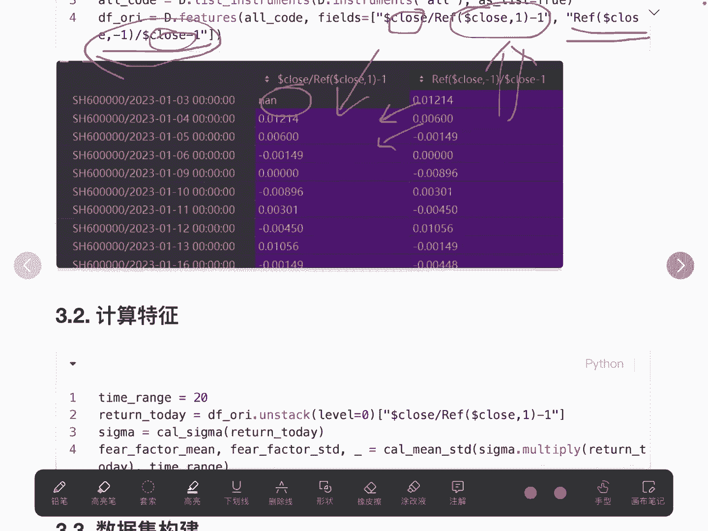
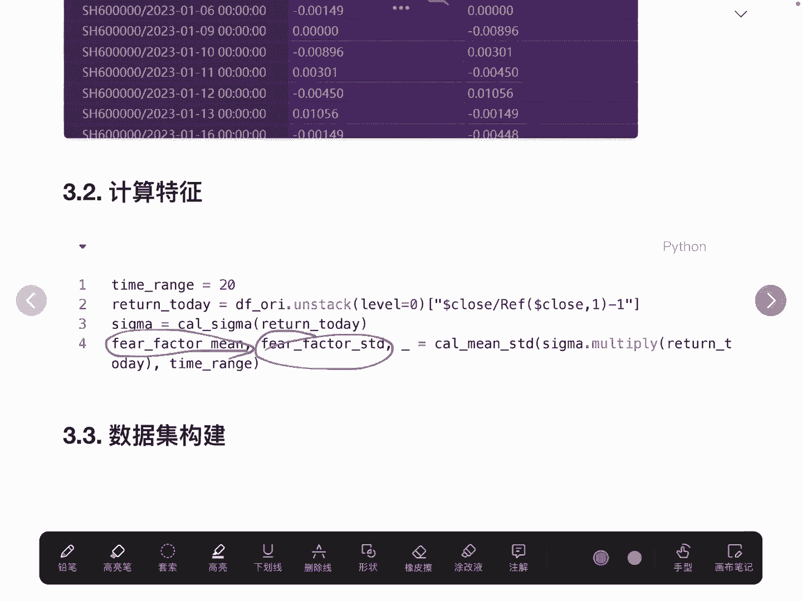
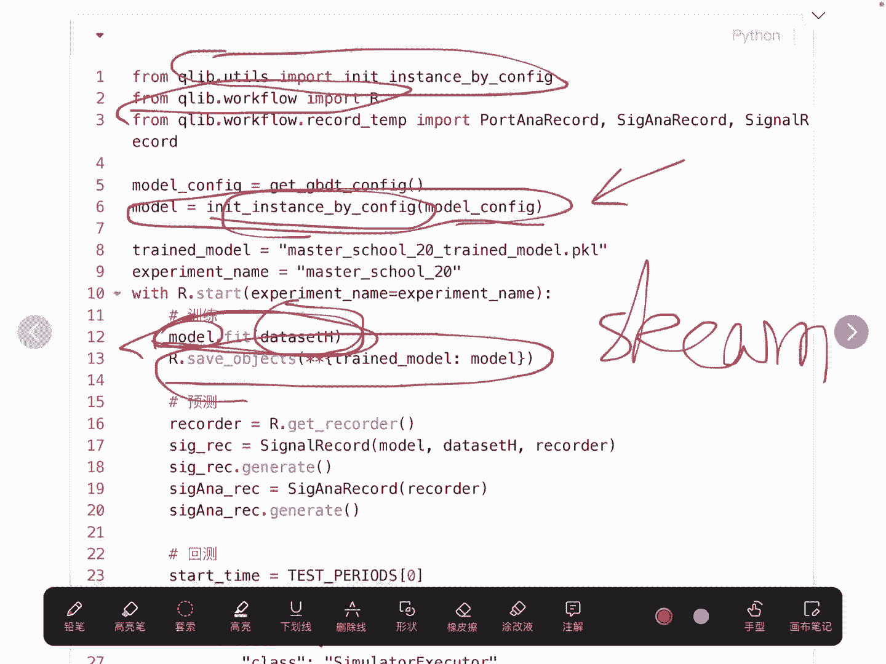
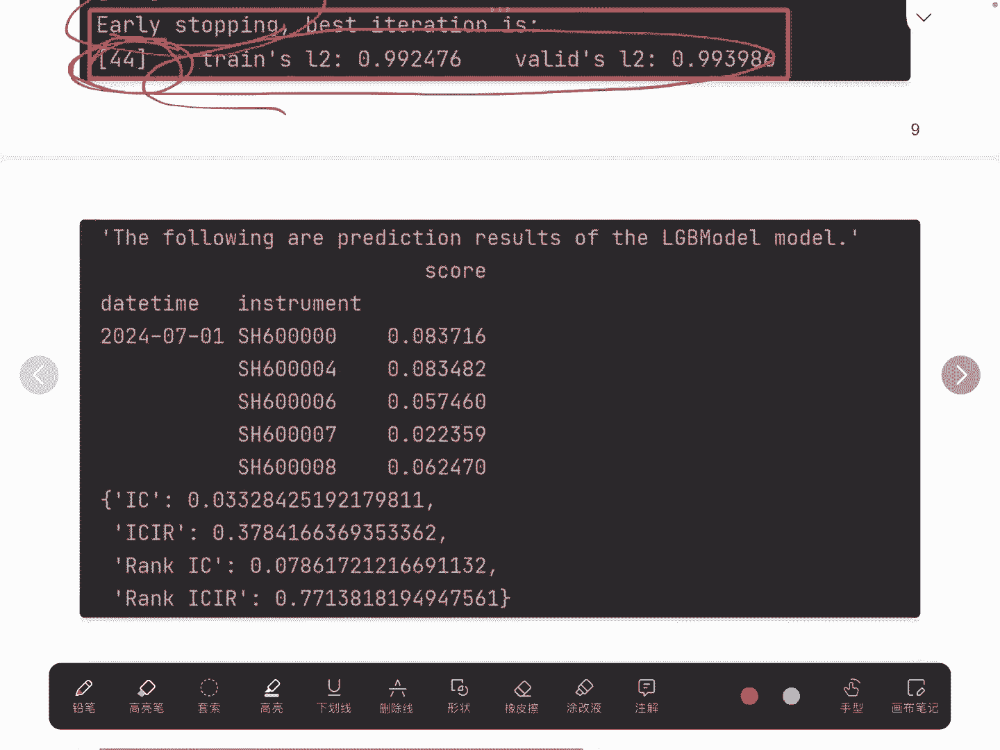

# 【量化交易系列20研报复现】草木皆兵因子研报python复现2（怎么基于机器学习搞量化） - P1 - master学堂 - BV15Y2oYrEbn

大家好，欢迎来到master学堂，在上一个视频里面，我们讲到了怎么用一个因子去做分层实验，那么在这个视频里面，我们分享怎么去训练一个模型，然后去获取超参，还记得在上一个视频里面，我们卖了个关子。

原始惊恐因子，它是由惊恐收益因子和惊恐波动因子，使用等权求和计算得到，那么这个超参0。5，其实是可以用一些模型去进行表达的，这就是我们这个视频分享的内容，那么这个视频分享的内容呢。

可以用在其他的多因子的场景里面，比如说我们有N个因子，这N个因子呢，我们最简单的思路是用N分之一求和，得到最终的终极因子，然后用这个终极因子进行权衡股票的买卖，那在这里其实就有两个因子。

一个是惊恐收益因子，一个是惊恐波动因子，我们可以这么理解，我们分为两步，第一步，我们将原始的惊恐因子，认为是惊恐收因子和惊恐波动因子，的一个函数表达，那么在上个视频里面其实就是0。5+0。5。

它是一种线性函数，那得到了原始监控因子以后，我们再用第二个函数去评价它的收益率，那研报里面比较简单啊，他其实就直接用大小顺序进行衡量，那我们是不是可以把这两步转化为，直接用惊恐收益因子和惊恐波动因子。

它们两个看作是一个因变量，然后利用一个函数最终去推测未来的收益率，如果推测未来收益率比较高，我们就进行持仓，那转化成这个问题以后呢，他其实转化成了数学上的模型表达，这里就可以用很多种模型。

这种其实是一种线性的模型，但我们还可以用什么支持向量机，传统的机器学习，也可以用什么X级boost或者神经网络等等，进行表征，那这个视频就以机器学习GBDT为例子，来进行阐述，怎么去训练这个模型。

怎么去评价这个模型，构建数据集等等，那惊恐收益因子和惊恐波动因子呢，我们就不再详细展开了，我们上个视频也提到了，大概就是用这样一个函数计算得到经孔度，基于惊恐度去计算，惊恐收益因子和惊恐波动因子。

这个比较简单，我就不提了，在这里我们其实只用到了，惊恐收益因子和惊恐波动因子，把它们两个看成因变量，构建收益率与这两个因子的函数表达。

那我们直接看过程吧，第一步啊就是从本地去读取数据，这块儿也不进行展开了，但这块要强调的一个点，我们在这里去构建了当天的收益率，所谓当天的收益率，就是用当天的收盘价减去前面一天的收盘价，这是当天的收益率。

可以理解，这是为什么是空值，因为它前面一天是没有值的，我们还计算出了第二天的收益率，那对照一下，其实它们之间是有一个对应关系的，大家想一下，为什么我们要用第二天的收益率啊。

其实我们是用第二天的收益率作为一个标签的，大家想想。

为什么不能用第一天的收益率作为标签，好这里我们读到了本地的数据以后。

利用当天的收益率，可以很轻松地计算出我们需要使用的两个因子，这块我们在上个视频也讲过，这就不再展开了，我们要构建数据集。

那数据集就分为两个因素，第一个就是特征，第二一个就是标签，而特征我们刚才已经是计算得到了，均值和标准差作为特征，第二天的收益率是标签，这里我们第二天的收益率是做了一个处理，为什么要做这个处理呢。

是因为它的索引本身是一个多层索引，最开始索引是股票在前，时间在后，我们需要让它时间在前，股票在后，与特征保持一致，所以我们做了这样一个专门的处理，这个DFMS就是我们构建的原始的数据集。

我们把它的列的名字进行命名去掉空，这个也是常规操作，我们需要把这个列的名称给它赋值为两极，索引的，这里主要是标识哪一个是特征，哪一个是标签，那么在这里我们就将数据集构建完毕了。

构建完毕之后还需要对它进行一些预处理，然后按照训练集验证集，测试集进行拆分，首先我们要给他指定时间，训练集是从2023年2月7号到，2023年12月31号，验证集是2024年1月1号到6月30号。

测试集是从7月1号到9月24号，这里其实只是一个例子，当我们的数据局多了的话也是可以的，只是一种演示，它的过程，的这样一个API，在这里需要说明一下，configure要传参。

这个参数就是我们上文构建的数据集，第二一次我们再用DAHTERLP，利用这个规范的格式啊，首先是它的股票以及结束的时间，这些就是还要配置的一些参数，这块重点要讲一下，这两个其实是预处理的过程。

要怎么去处理空值标签，怎么去处理一些不规范的数值等等，这都是一个比较常规的预处理，这块相当于是COLAB已经帮我们做好了，不然我们还需要自己去处理一下，大家再去实操的时候可以直接跑一下就行了。

最后一步我们还需要使用data set的H这个API，也是COLAB给我们提供的这个API，传入我们刚才处理好的data hunter lp的这个参数，然后传入我们的训练集，验证集，测试集的一个时间。

得到我们模型训练，最终的一个数据集的一个形式，这个形式就可以直接拿来作为训练了，好下面我们来看一下模型怎么去搭建，怎么去训练，在这里我们需要给模型配置一些参数，因为我们使用GBDT这个模型。

我们需要对一些参数进行指定，大家在模拟的时候，直接把这块复制过去就可以了，也是比较常规的，大家可以先跑起来，再后面去尝试调一些参数，这块都是一些超参，也是通过一些经验得到的，但如果你觉得哪些参数比较好。

可以将它改变就可以了，这是GBDT的一些经典的一些参数，这块我也不展开了，大家感兴趣的话，可以看一下我的之前讲过决策树的一些视频好，这是整体参数超参的一个配置，配置完了之后，我们就要利用这些参数。

首先第一步，我们需要利用这些参数去搭建，我们的GBDT模型，这个init instance by configure，这里我们就搭建好模型了，基于我们刚才指定的一些参数，然后我们就开始做实验了。

那么模型做训练，我们已经有模型了，也有数据集了，直接调用点fit，这个和其他的SKL这些机器学习的库，其实它的做法是一样的啊，直接用model fit就得到了这个模型，或者叫训练出这个完整的模型。

我们在利用这个R也是克lab自带的，它是一个实验训练的管理器，然后利用这个管理器，将我们的模型进行一个存储，存储完之后我们就可以拿来用了。

首先是做一个预测，这个预测是用我们自己的，刚才构建的这个数据集做一些预测，然后调用这些接口，这个接口其实也是K盒的，比较完整的，跟SK2其实是几乎是一样的啊，那在验证集测试集上预测得到预测的收益率。

股票收益率可以基于预测的结果做一些分析，看一下它的评价指标，这个模型到底怎么样，我们可以基于它的结果去调整一些参数，调整一些模型的深度，尤其是GBTT它的一些参数，最后我们再做量化交易。

肯定要有一个回撤，回撤就是用我们训练得到的这些参数，将这些参数去跑历史数据，看它的效果是怎么样子的，这块我们就要指定历史数据，我们要用哪一段时间，那我们这里也指定了一些参数的配置。

大家如果有需要可以直接拿去使用就可以了，需要说明一点的是，这里由于我们的基模型，因为我没有沪深300，没有拉到这个数据，所以这里只指指定了一个另外一个基准，随便找了一个股票作为一个基准去看。

因为这q lab其实是封装的比较好了，所以他的一些在模拟或者叫回撤的时候，佣金等等都是可以通过这些配置进行完整的，回撤的，还是比较简单的，这就是最终回撤结束，调用这两个就进行回撤，最终回车结束。

我们来看一下它有一些日志，这个日志是在训练的过程当中，它会有一个early stopping，相信大家如果了解机器学习，就知道我们在训练的时候，防止他训练的比较过度了，就过离合，我们会有一个提前结束。

那么这个提前结束了，在这里相当于是在第44步的时候，就已经训练达到一个最优的状态了，我们就不需要再额外的训练了，那我们也会把这个第44步的模型会保存，刚才我们讲到。

我们在做预测的时候，其实是用的是它真实的值，和我们预测的值进行对比，然后得到这个模型，它的评价指标，比如ICICIR等等，基于这个评价指标，我们来看这个模型到底怎么样。

好的以上就是今天我要给大家分享的内容，后面是完整的代码，有需要的朋友可以交流，好的。