# 【量化交易系列21研报精度】RSRS指标让你不错过牛市的疯涨（下个视频分享研报python复现） - P1 - master学堂 - BV1CmC1YSEQ5

大家好，欢迎来到master学堂，最近股票有牛市那个味道了，2s rs指标，作为牛市周期一个很不错的择时策略，被很多研报青睐，今天我们以光大证券的这篇研究报告作为基础，来揭开rs rs指标的面上。

看下为啥他能在牛市中表现突出，它背后的底层逻辑是什么。

rs rs的全称是resistance support，Relative strength，那翻译过来就是主力支撑相对强度指标，那顾名思义，这个指标就是基于一只股票的，主力位置和支撑位置这两个位置。

然后再去求解这两个位置的相对强度，进行构建的阻力位和支撑位，实质上是反映了交易者对目前市场状态，顶部和底部的一种预期判断，rs rs指标在前人构建阻力位，支撑位的基础上去衡量这两者之间的相对强度。

如果支撑位的强度小，作用弱于阻力位，这表明市场参与者对于支撑位的分歧，大于对于阻力位的分歧，那么市场接下来就更倾向于向熊市的转变，那相反如果支撑位的强度大，它的作用是强于阻力位的。

那么整个市场就倾向于向牛市的转变，这就是rs rs指标构建的动机还是很好理解，从这个动机里面我们可以看出，要构建rs rs指标，我们就要做两件事，第一怎么去量化支撑位和阻力位。

第二怎么去衡量它们之间的相对强度，这篇研报我们可以从一句话去解读。

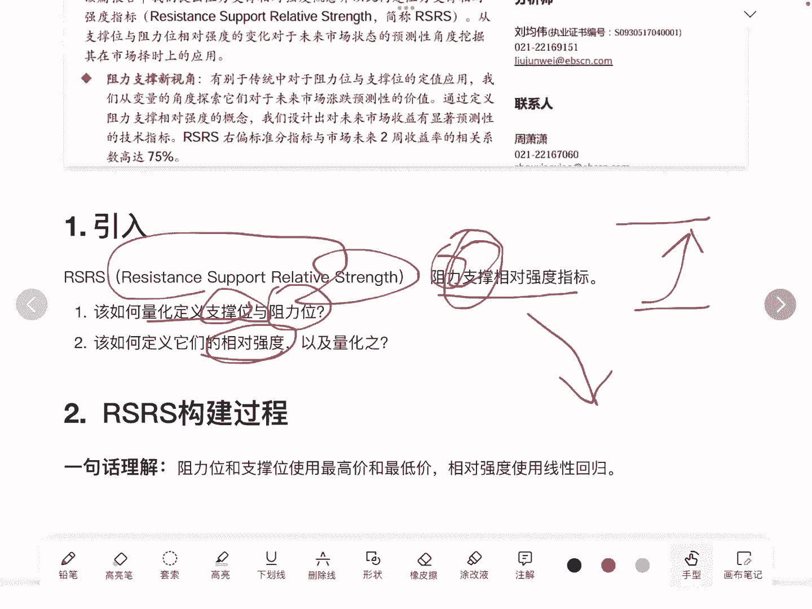

他把阻力位和支撑位定义为最高价和最低价，然后使用线性回归去拟合最高价和最低价，那么线性回归最终得到的这个斜率，就是相对强度，好的不多说啊，我们直接来看论文当中，这个rs rs指标是怎么构建的。

文章对rs rs指标一共做了一个基础版。

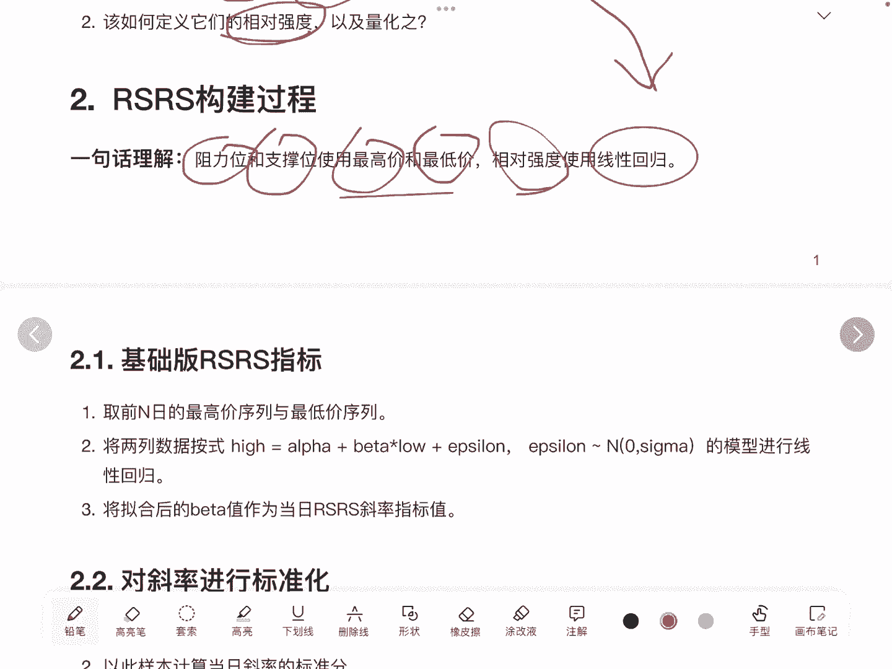

然后基于基础版做了三个优化。

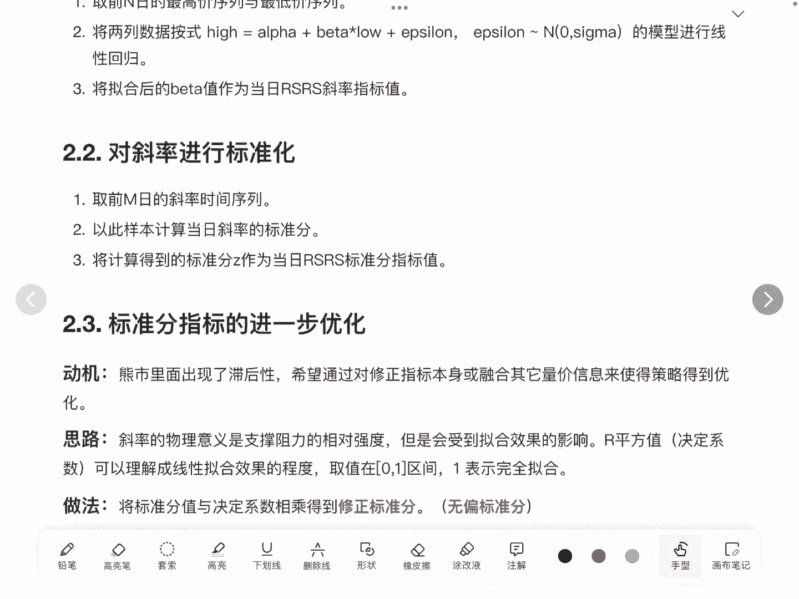

我们首先来看基础版rs rs指标，首先我们去看一只股票，前N天的最高价序列和最低价序列，这个是可以求出的，那得到最高价序列和最低价序列以后呢，我们可以去做一个线性回归，这个式子看起来比较复杂。

其实比较简单，它就是一个一次函数，而这个斜率就是我们当日rs rs的指标值，那这个斜率它其实是跟股票是一一相关的，但是由于不同的行业，它可能涨势是不一样的，所以自然而然就考虑到。

我们可以对斜率进行标准化，那所谓的标准化呢就比较常规了，我们去取这支股票，它前面M天的这个斜率时间序列，我们对这个斜率进行求取标准分，将标准分看作是rs rs标准分指标值，也就是进行了一个标准化处理。

这是原文对rs rs指标的第一个优化。

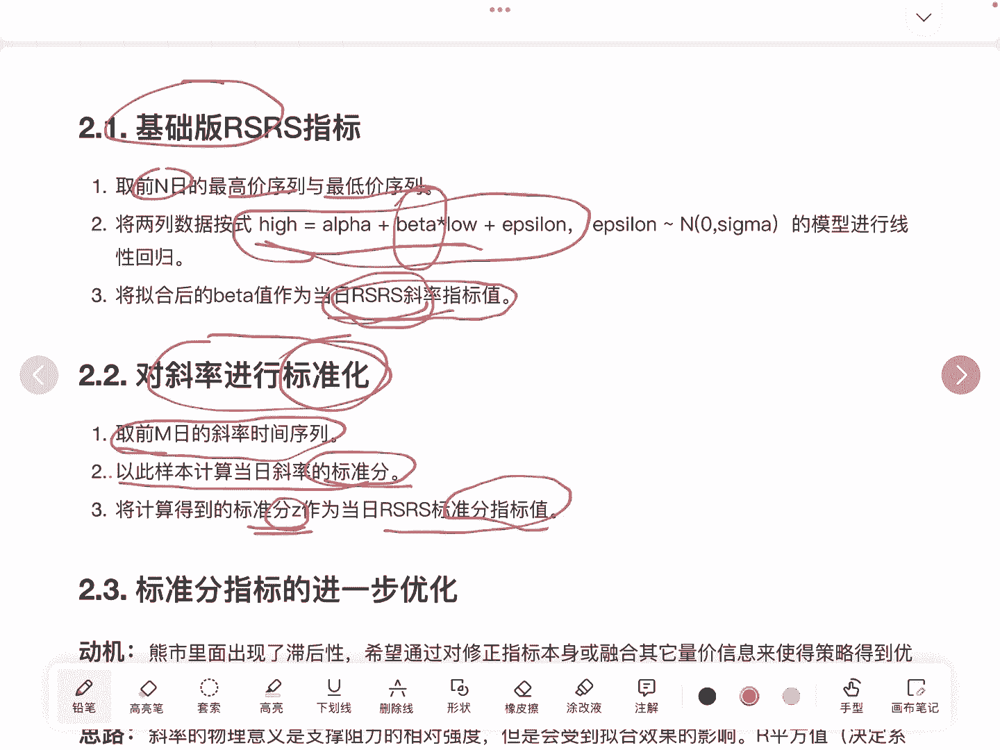

除了斜率以外，当我们将这个标准化的RS，RS指标进行回撤的时候，发现有个问题，他没有去规避到熊市的一个择时里面，那能不能对上面的这两个指标进一步优化，去让他规避到熊市，论文他是想要通过去修正这个指标。

或者去融合其他的一些量价信息，来让这个策略得到优化，让它完美的去规避熊，是大家可以想一想，我们这一个rs rs指标，它是基于线性拟合的斜率构建的，而这个斜率就代表了支撑和阻力的相对强度。

但是并不是所有的这些数据，它回归的效果都是一样的，可能有的回归的效果比较好，有的回归的效果比较差，那对于效果比较差的这些情况，我们应该进行打压，所以原文他引用了R平方值或者叫决定系数。

来对上面的这个指标进行增强或者打压，这一个决定系数，它的取值是在0~1之间的，一就表示完全拟合，那我们认为，当我们的这个数据进行完全拟合的时候，我们不需要做任何改变，而当我们的决定系数处于一个很低的。

也就是礼盒不好的话，我们会对他进行一些打压，所以这里就自然而然就产生了第二一个优化。

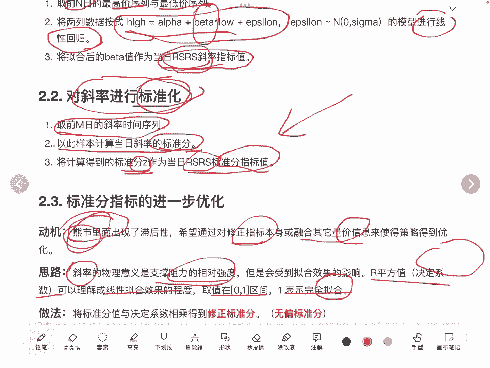

也就是将标准分值。

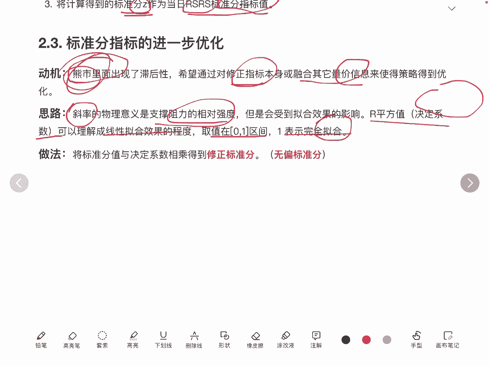

所谓的标准分子，就是2。2里面计算出的这个标准分，就得到了修正标准分或者叫无偏标准分，将无偏标准分和第2。2里面的标准化的。

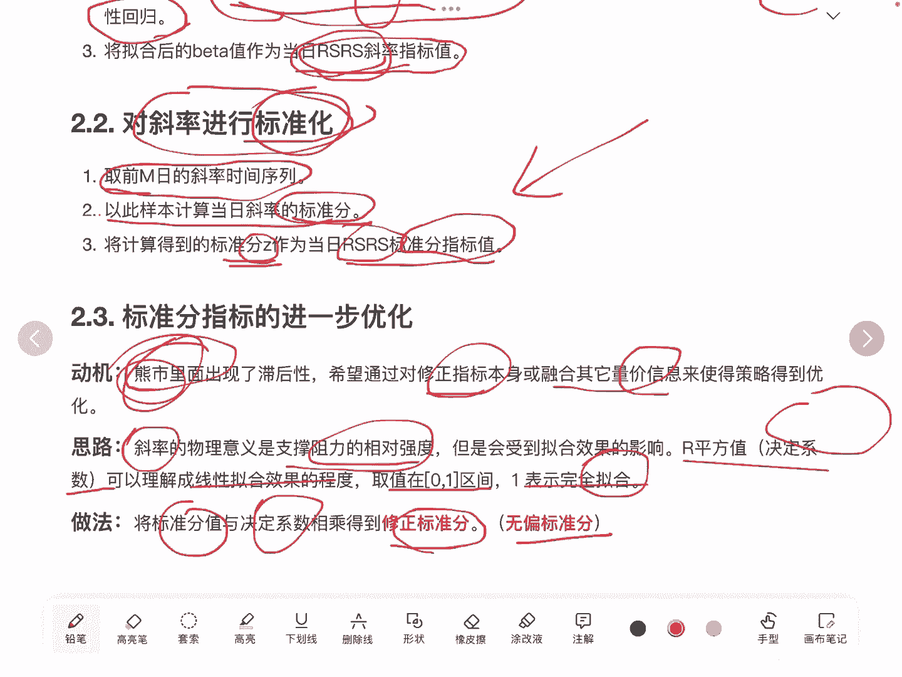

这个标准分进行一个对比，我们来看一下原始的标准和分布，是这样一个图形，经过修正以后，更像是一个标准的正态分布，也可以从这个均值和标准差进行得到，原文利用这个因子啊。

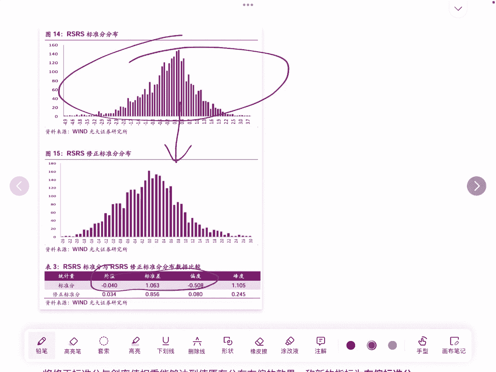

去计算了它跟未来收益率的一个相关性，那么这个相关性可以得到，当我们的因子处于大于零的状态的时候，相关性是非常高的，而取于小于零的时候，相关性比较差，我们能不能够对这个小于零的这部分，进行一些优化了。

这就产生了第三个优化。

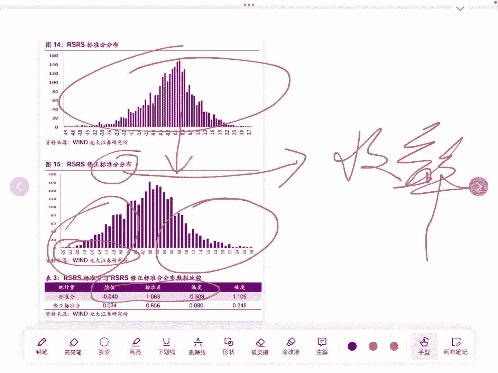

所谓的右偏标准分，右偏标准分呢它就是将修正标准分，也就2。3里面的修正标准分，与原始的斜率相乘，就达到了分布右偏的效果，这样我们的分布右偏，就能够让所有的这些右偏的范围变得更大。

那么与未来的收益率它的相关性也变得更大，这是整体这四个因子的一个构建方式，以及它的构建的思路，或者他的心路历程。

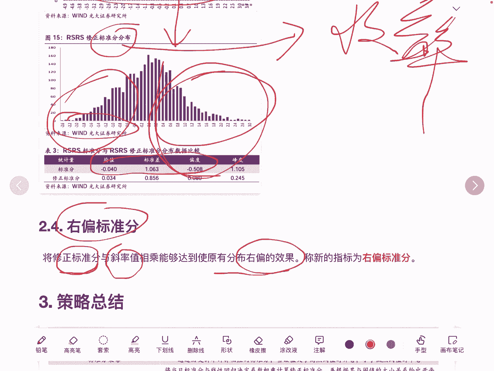

最终我们来看一下策略是怎么做的，这个策略就比较简单了，我们先看第一个斜率策略，那斜率策略就是先去计算这个斜率，而斜率计算完成之后，我们有两个阈值，当我们的斜率值大于高点这个阈值我们就开仓。

而小于低点的预值，就是进行一个平仓，基于这四个因子构成的策略都是一样的，我们再来看一下，所以配合均线他做了一些折时，也就是在我们前面策略的基础之上，还需要加一个约束条件。

什么约束条件用均线进行一些个过滤，就不仅要满足前面这个策略的基础上，还要用均线进行一些过滤，第二一个思路，他去配合了成交量，这里需要整个系统的标准分与交易量，他们要呈现相关性，我们才能够进行开仓。

也就是量和标准分，它们之间是有明显的相关性的，我们才能开仓，相当于是进一步做了一些折时。

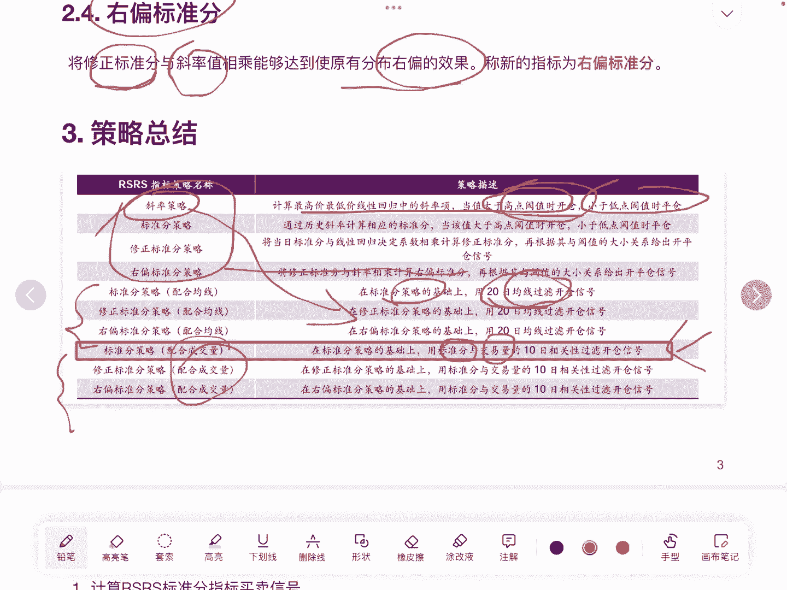

我们以这一个策略为例子，首先是去计算标准分，然后获取买卖信号，那如果说这个指标发出了买入信号，我们还需要去计算值日的交易量，与这个标准分之间的一个相关性，如果他相关性为正就买入，如果指标发出了卖出信号。

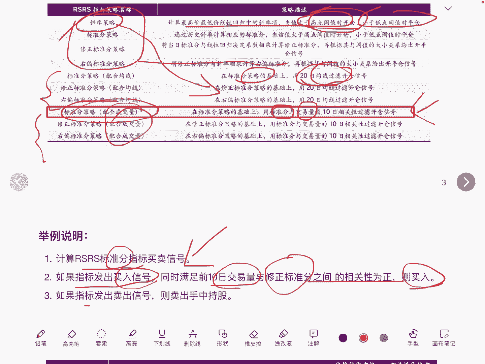

就卖出手中的持股空仓处理，最后我们来看一下这些策略的一个实验效果。

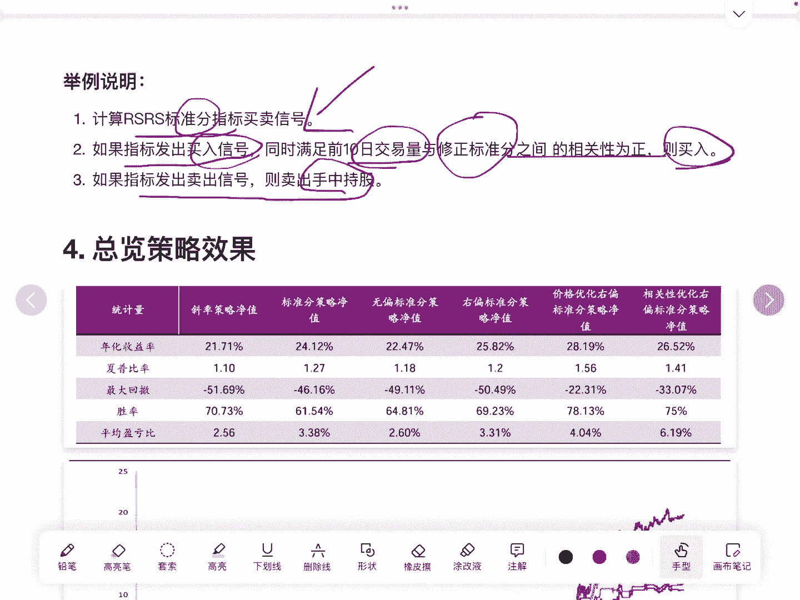

这是第一个没有优化过的rs rs指标，有单独从斜率来看，它的年化收益率，后面我们每一次优化其实都是有效果的，最优的这个效果是又偏标准和策略净值，包括它的收益率以及他的回撤，都是表现比较优秀的。

这是整体跑下来，从2005年到2017年，它的净值的一个曲线看出来。

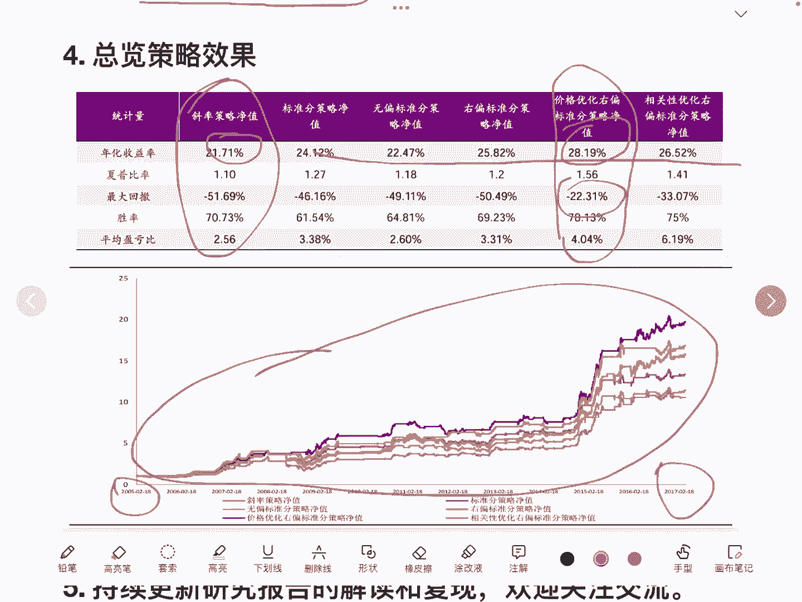

效果还是比较优秀的好的，这就是今天我要给大家分享的内容。

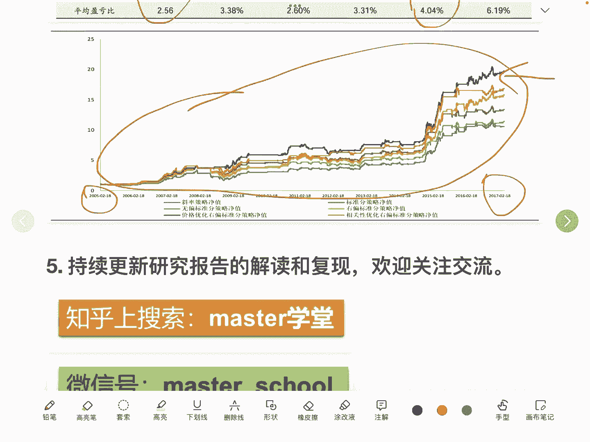