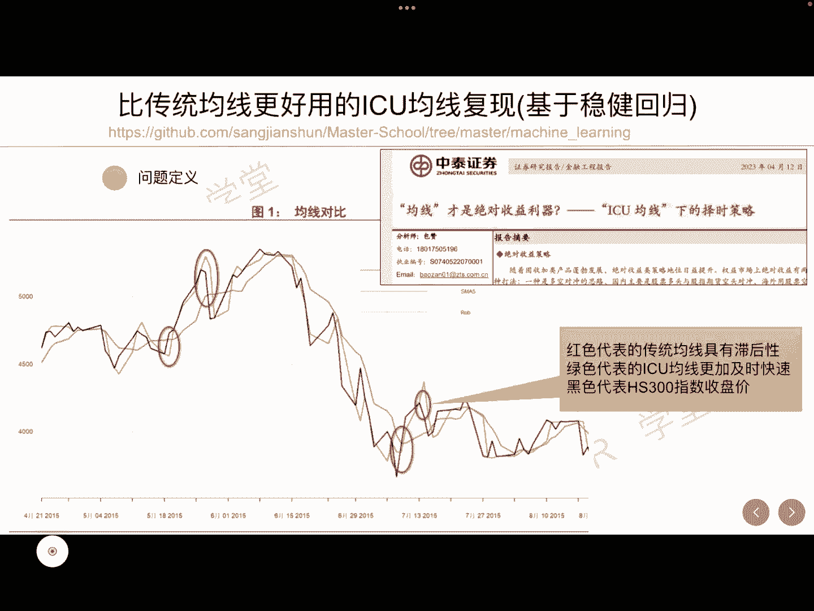
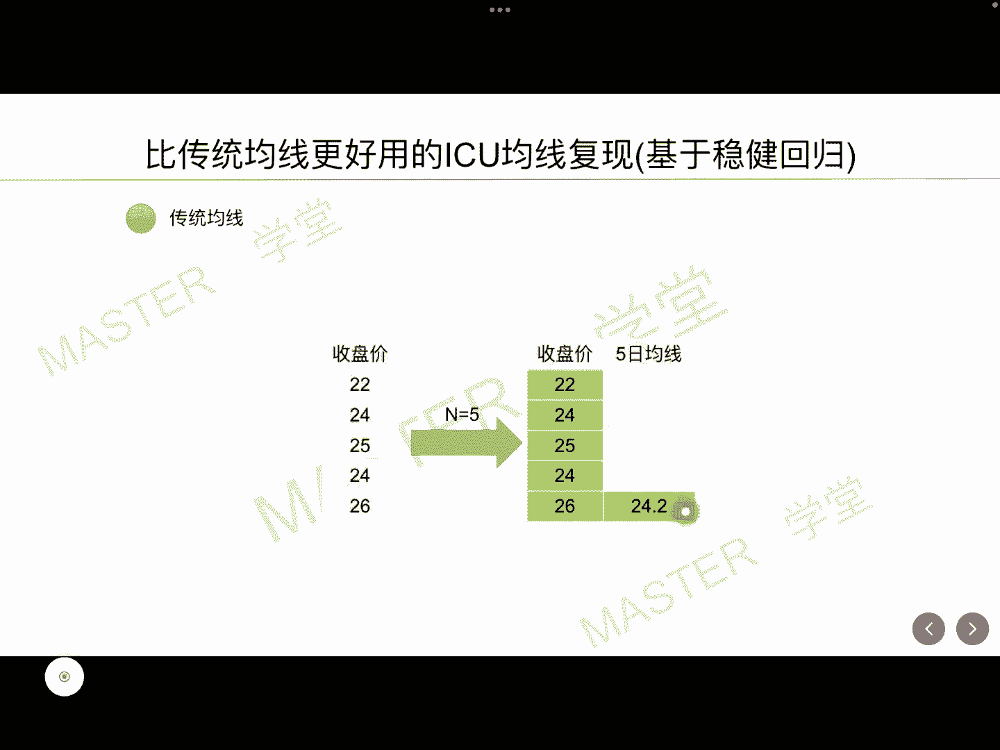
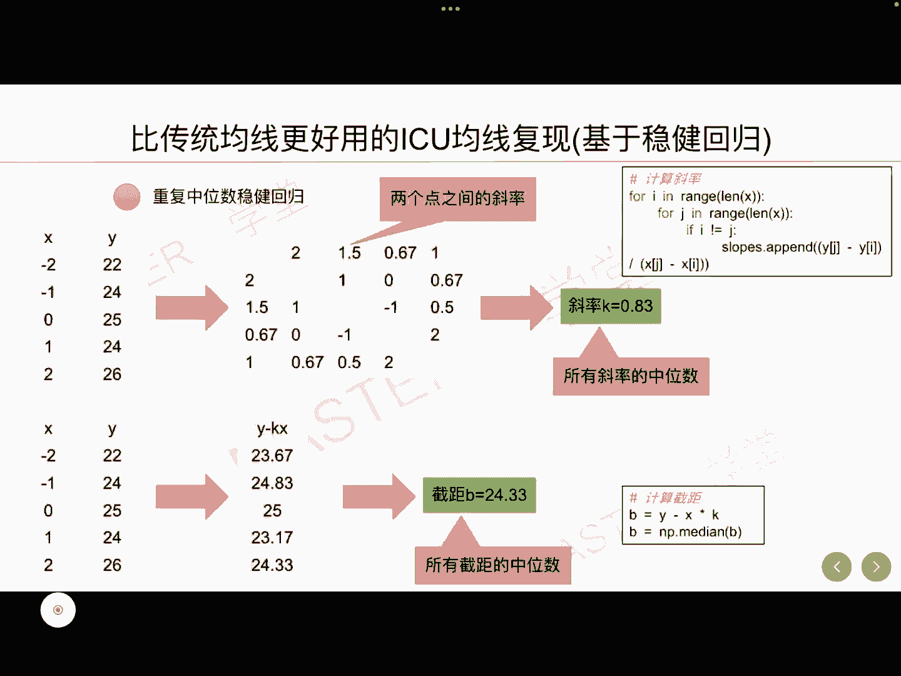
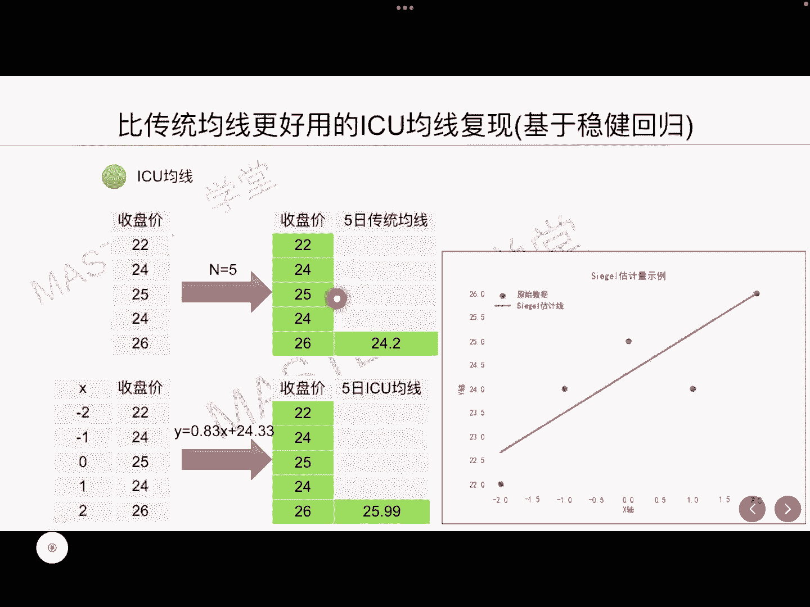
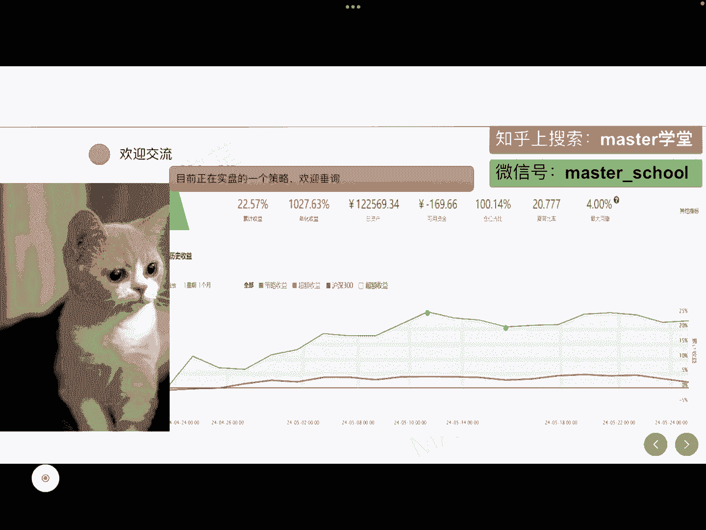

# 【量化交易系列6】比传统均线更好用的ICU均线复现（基于稳健回归） - P1 - master学堂 - BV1TS411P7yD

大家好，欢迎来到master学堂，A股大部分时间都在ICU，于是我突发奇想，去看一下有没有跟ICU相关的研究报告，不出所料，还真有一篇叫做ICU均线下的择时策略，很有意思啊，里面提到。

ICU均线比传统均线对噪音数据更加鲁棒，大家都知道传统均线具有滞后性的缺点，尤其是长周期的均线，它的延迟更加严重，而ICU均线却有效的缓解了这个问题，更加及时快速的反应股价的变化，比如下面这个图啊。

这是沪深300的一个走势图，黑色是代表沪深300的收盘价，从这个图形上看啊，这里面红色代表的是传统均线，绿色代表的是ICU均线，我们看这一个位置，当我们的收盘价已经在上涨的变化的时候，红色需要两天。

三天很长的时间才能够进行一个反应，而绿色的这条线在第二天就已经有感知了，可以看到的是绿色这条曲线啊，它更加及时快速地反映股价的变化，接下来呢我们将手把手一步一步的教你，如何去计算ICU均线。

N同5日均线是近五天收盘价的算术平均值，这个好理解吧，假如我们的收盘价是20 224252426，那么5日均线在这一天的值，就是这五个数的算数，平均值算出来是24。2。

这就是传统均线ICU均线里最核心的技术，就是重复中位数稳健回归，5日ICU均线，就是近五天收盘价的稳健线性回归，礼盒值什么意思呢，假设我们知道这五个收盘价，我们将它绘制在相邻的这个X轴。

比如说我们取二负1012这样一个X轴上，然后收盘价是我们的Y轴，我们使用一条直线去拟合这五个数据点，而这种礼盒的技术就是使用稳健，线性回归的技术，最终我们会求出一条直线，而最近的这一天的均值。

就是将我们的X等于最新的这个值，带入这条直线当中，得到纵坐标的值，就是ICU均线所对应的Y值好，这就是一个感性的认识啊，接下来我将举一个例子来进行一个说明。

它的一个详细的计算过程，首先我们把收盘价给他一个横坐标，这就是取-2~2，一共有五个数据点，那么这里就针对这五个数据点，我们两两去计算它们构成直线的斜率，比如说第一个点和第二个点，它们之间有一个斜率。

而这个斜率就是用纵坐标相减除以横坐标相减，就是24-22=2除以一，那么它的斜率就是二，同样以此类推，我们可以得到，第一个点和第三个点的斜率为1。5，第一个点和第四个点的斜率为0。67。

第一个点和第五个点的斜率为一，那么最终会计算出这样一共十个斜率值，而我们最终的这条直线呢，它的斜率就采用这十个斜率当中的中位数，也就是K等于0。83，这就是计算这个斜率的一个代码。

那我们把斜率计算完了之后，还需要计算截距，所谓的截距呢也是采用中位数的原则，我们使用Y减KX带入到这五个数据点当中，可以计算得到一共有五个截距，同样的道理，我们还是去计算这五个截距的中位数。

最终得到截距等于24。33，那么这条直线的函数表达式就可以得到了。

它就等于I等于0。83。

X加24。33，那么得到了这条直线的公式，就很轻松的把X等于二，他代入进去，最终得到5日ICU均线，在最后一天它的函数值是25。99，那可以看出我们ICU均线所计算的均值，是更加接近于这个收盘价的。

当然相比于5日传统均线好的。

以上就是今天我要给大家分享的内容。

