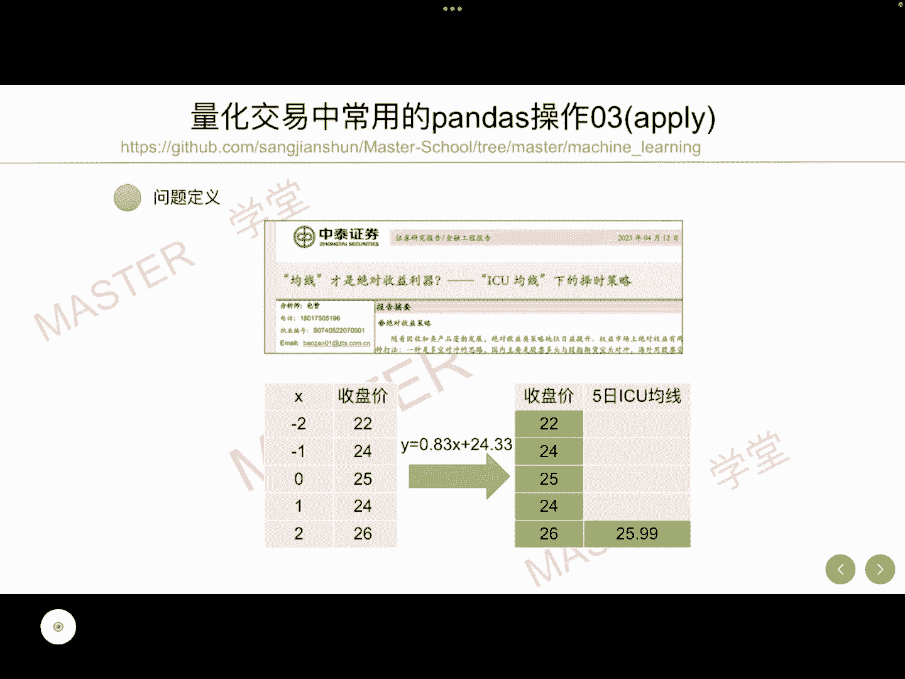
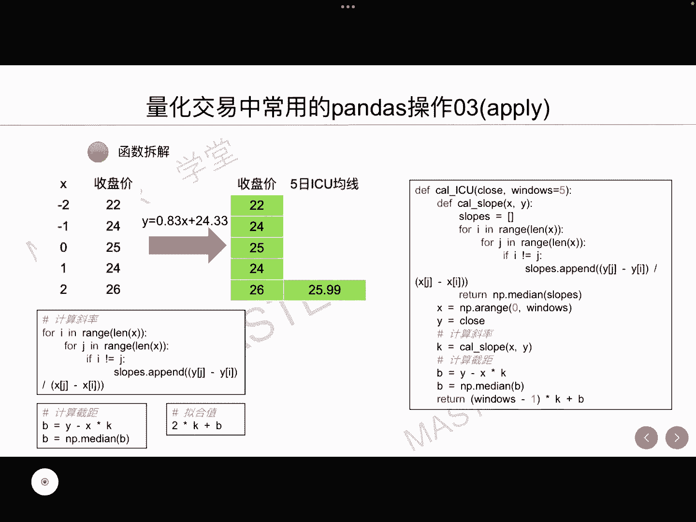
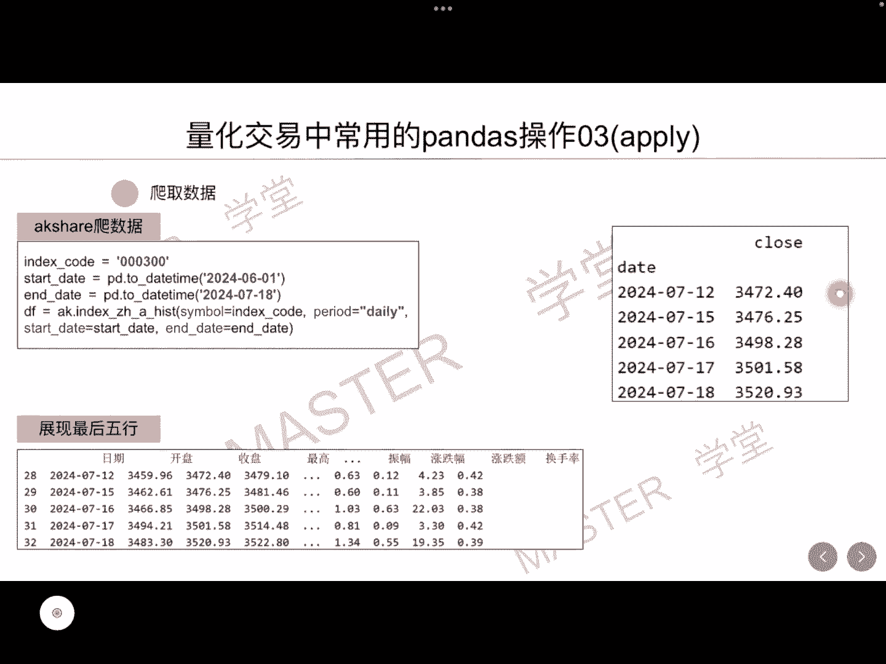
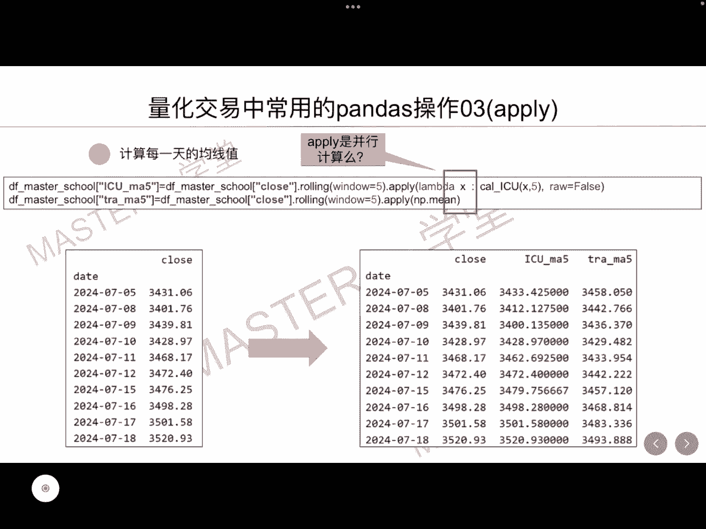
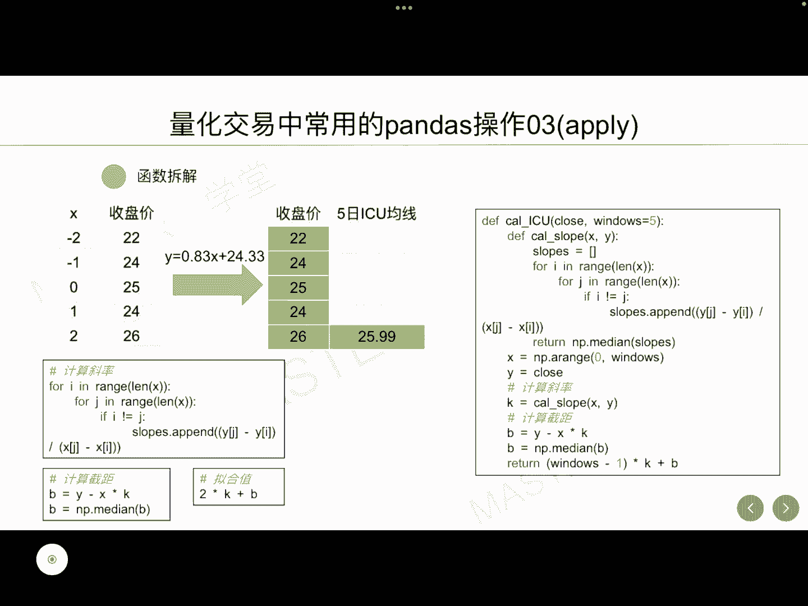
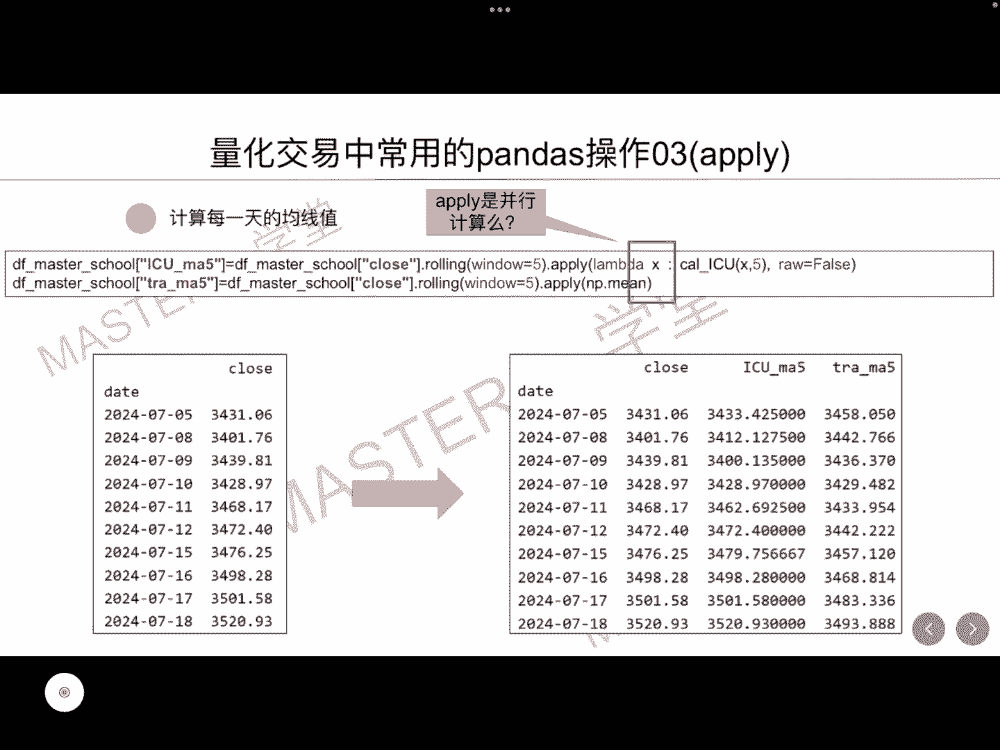
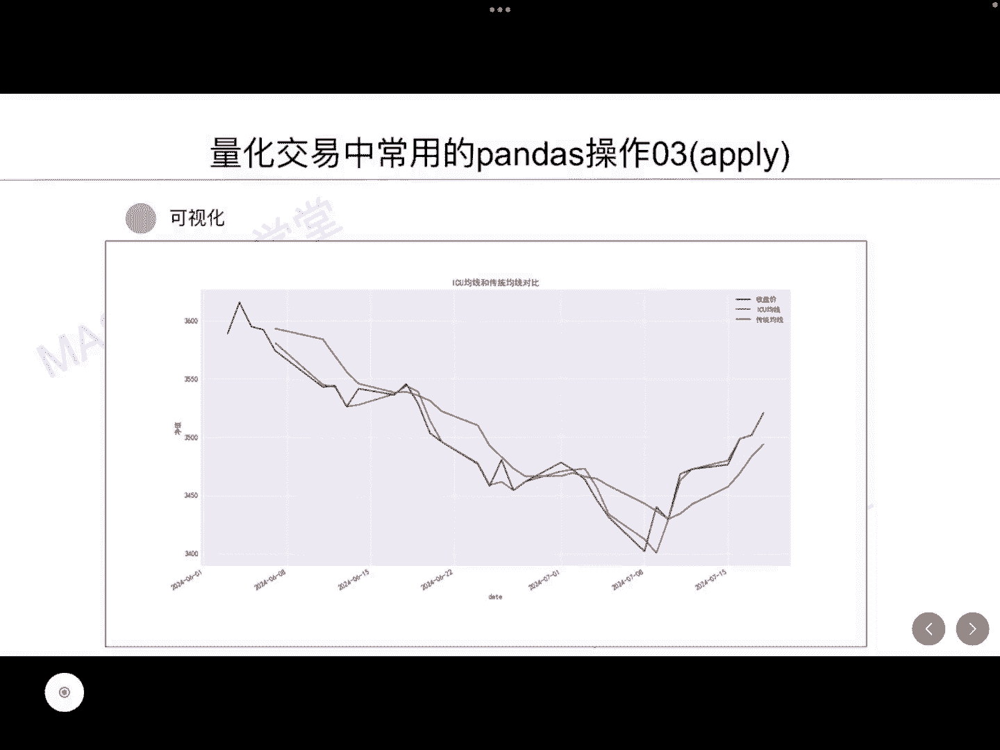

# 【量化交易系列7】量化交易中常用的pandas操作03（apply） - P1 - master学堂 - BV1Tx4y147fD

大家好，欢迎来到master学堂，今天我要给大家分享的是量化交易当中，常用的pas操作，主要是apply的使用，前面我们讲到中泰证券的研究报告，ICU均线下的择时策略，ICU均线呢。

它是比传统均线反应更加，及时和快速的一种均线系统，输入为收盘价，基于ICU均线的计算方式，我们可以去计算收盘价序列，所对应的斜率和截距，然后再利用X轴为二，可以计算出这一天，他的5日ICU均线是25。

99，那么接下来我们将分享，如何将整体5日ICU均线进行丝滑的计算，主要利用了applied这个接口，今天所讲的所有内容都将会分享到我的GITHUB上。

前面我们将计算ICU均线拆解为三个步骤，第一步是计算斜率，这块我们就不展开了，第二步计算截距，第三步与基于斜率和截距计算拟合值，这里就是25。99，我们将整体这三步封装成一个函数。

这里的函数输入为收盘价序列，但这里传入的序列只有五个值，这里还有一个参数为窗口，也就是说，收盘价序列的长度是等于这一个窗口的，所以这里我们可以做一些进一步的简化。

比如说我们把这个windows这个参数进行去掉，也是可以的，那么怎么去计算每一天对应的ICU均线呢，比较容易想到的就是写一个循环，我们每五个收盘价可以计算一个均线，通过这种循环。

我们可以计算出所有的均线，今天我们要讲的内容呢是使用apply这个方式，首先第一步我们会去爬取沪深300，从6月1号到7月18号的收盘价数据，这是爬到的数据的最后五行。

我们很轻松的就可以将这五行的数据转化为，我们所需要的，以时间为索引，收盘价为例的这样一个data frame数据格式。

然后我们就使用rolling和apply这两个接口，以及一个简化的一个函数拉姆达，去得到每一天的均线，具体怎么计算呢，zoning windows等于五，的意思就是我们去抓取长度为五的收盘价序列。

作为一个子data frame，针对这一个子TFRAME，也就是有五条数据去调用，我们刚才封装好的这一个函数，就输入为这五条数据，输出就为这五条数据低于封装的函数，计算得到的ICU均线值。

可以看到这个计算的ICU的值。

它返回的就是一个数值，而这一个数值呢就是礼盒值，也就是输入为五个收盘价，输出就为这一个25。99。

那么通过这种方式，就可以计算出所有的5日均线，然后我们把它赋值到新的列上，同样我们在计算出传统的5日均线，它的计算方式呢也是一样的，我们去取五天的子序列，然后再利用求均值的这样一个函数。

可以得到传统的5日均线，这就是最终计算好的这样一个数据，可以看到的是我们的5日均线数据，它更加接近于我们的收盘价，但这里相对于传统的5日均线而言，最终我们将这两条均线以及收盘价。

进行一个数据可视化展示，符合我们的预期，绿色代表的是ICU均线，它更加接近于我们的收盘价，也就是说反应更加及时和快速好的。

以上就是今天我要给大家分享的内容。