# 【量化面试】 解题的艺术_001：面条一共几个圈 #期望 #概率 #随机过程 #动态规划 - P1 - 大导演哈罗德 - BV12i6RYMEEk

大家好，我是大暖眼哈罗德，欢迎回到我的量化频道，然后呢，欢迎来到我们这个解题的艺术的第一道题啊，这是啊我找的第一道题，然后这道题呢是来自绿皮书的第四章的，第32道题，然后如果你之前做过这道题目。

可以直接来听一下我的一个分析，和我的一个理解，如果大家是第一次看到这个题目，那我建议大家暂停一下，然后先去看一下这个题目，然后尝试先去做一做，差不多五到10分钟或者是15分钟，然后做完了。

如果说没有做出来，也可以开始，然后看我接下来的讲解，所以说我们来把这道题目来看一下啊，我有100根面条在我的一个碗里，然后我被蒙上了眼睛，被要求从碗里随机拿起两个端点。

首先这个题目我觉得他本身在描述的时候，因为他本身是从英文翻译过来的，我觉得可能英文的描述要稍微呃，更加的直接一点，但是本身这个题目，我觉得就有点要花时间去理解，那呃我是习惯一边做题。

一边去把这个题目来形象化的去画一下。

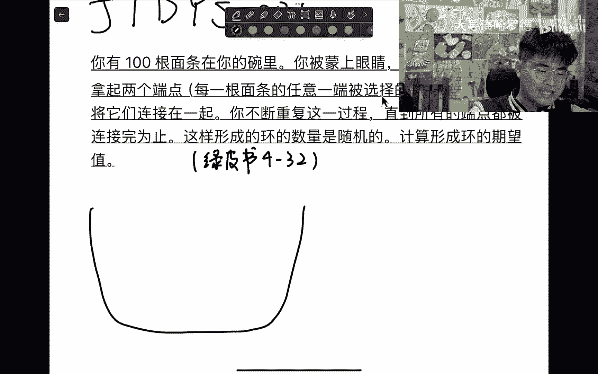

那首先这里面有100根面条吧，这是一个碗，然后先画四根面条，然后我来理解一下，我每次要做的事情是，我每次要从碗里随机拿两个端点，每一根面条的任意一端被选择的概率是相同的，那我能随机拿两个端点。

那有可能就是说我有可能是拿这两个端点，那就是同一根面条嘛，那我接下来就会去把它啊连接在一起哦，那我就会哦就这样连接在一起了，但是呢也有可能我拿的是这两个端点对吧，然后我就会呜把它连接在一起好。

然后我不但重复这一过程，直到所有的端点都被连接完为止，这样形成的环的数量是随机的，计算形成环的期望值好，这里是一道题去算一下这个expectation，那遇到这道题呢。

首先就是说我不知道大家第一反应是什么。

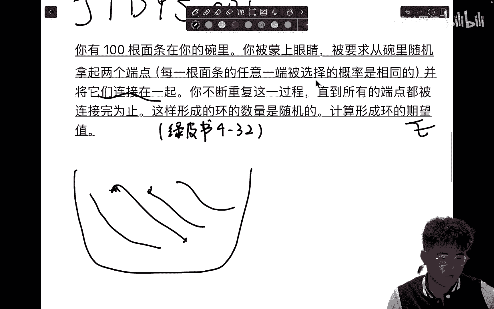

那我会觉得我的第一反应呢是我先想一下，这这道题，就像是一个呃叫state transformation嘛，对吧，就是我每一个每一个state，就是我每一个状态。

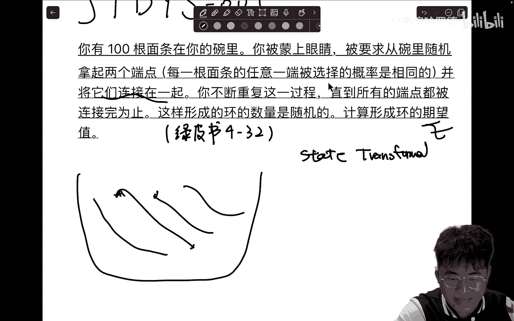

那当我现在有100个面条，这是一个起始的状态，当然这个100根。

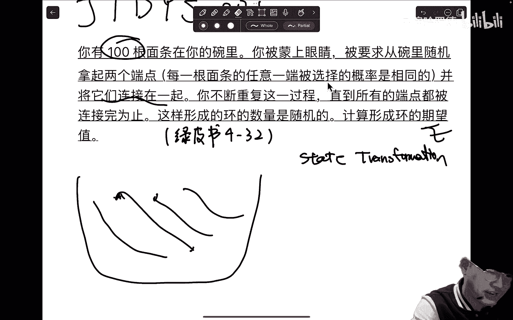

我觉得我想去先把它作为一个N根嘛，我现在有N根面条，那我的有两个想法，第一个想法是这里面如果有一根面条，可能是最简单的一种情况，如果有一根面条，我的expectation我要拿起两端连在一起。

那我的expectation。

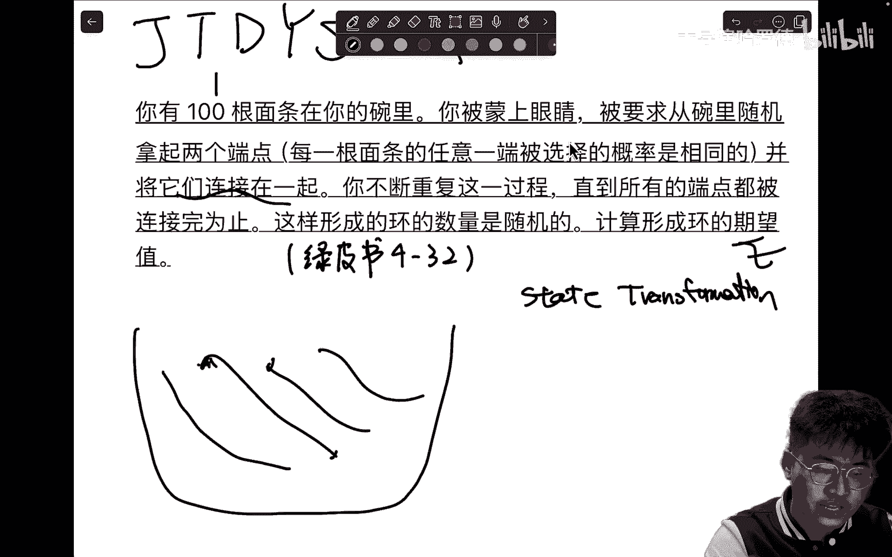

我可能要先定义一个呃这个变量，比如说我把它定义为这个XN。

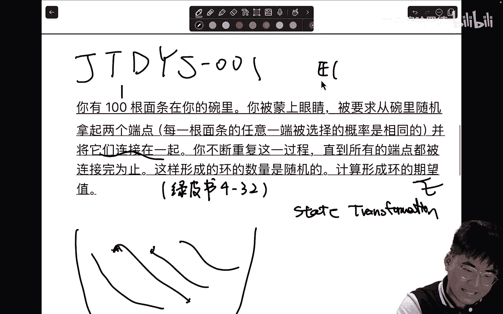

那我XN的意思呢，就是说我有N根面条啊，N根根怎么写啊，Anyway，就是N个面条，然后我最后形成环的一个值，最后形成，环的个数，那首先这个XN它是一个呃random variable。

它是一个随机变量，那我们现在其实最后要求的呢，就是expectation of x n对吧。

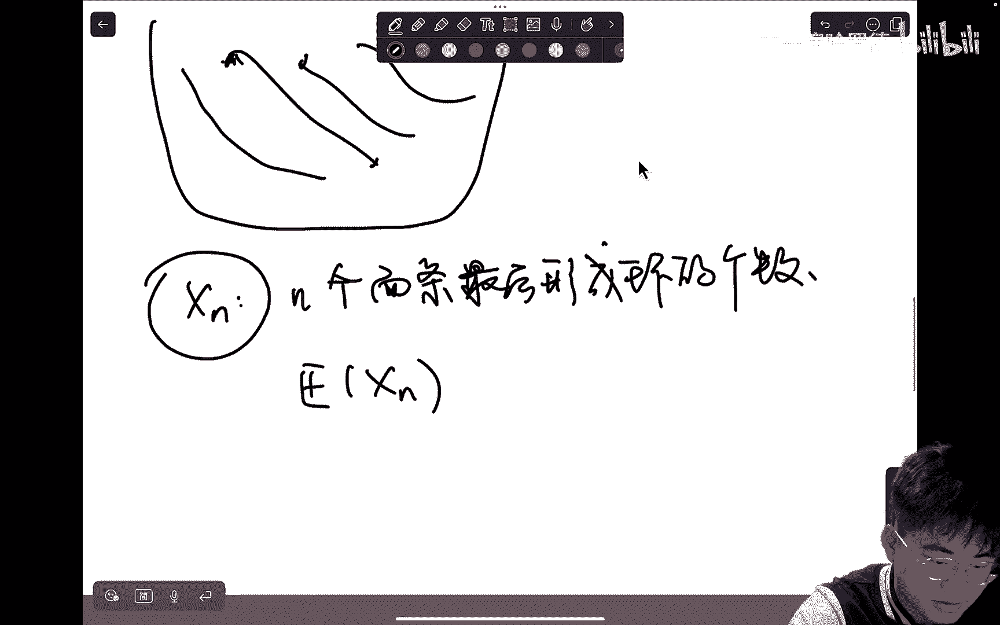

那这里的N呢是100好，那我首先要把这个定义一个抽象，比较抽象的一个问题，稍微其实现在也没有非常的具象的，去把它定义出来，但就是呃稍微要好一点了，那我会有两个思路吧。

第一个思路就是首先从呃一般的简洁化一下，首先你有100根面条在碗里呃，现在我画了四根，它首先就已经非常复杂了，你可能拿这两根，你可能拿这两根，你额那就太复杂，那那如果说我这个首先就是X1嘛。

那我expectation of x1是多少，那它本身和xx1，它这个随机变量它应该就只能取一个值，那就是一对吧，其实你我我我碗里有一根面条，那我把它两端连在一起，那就只能形成一个环。

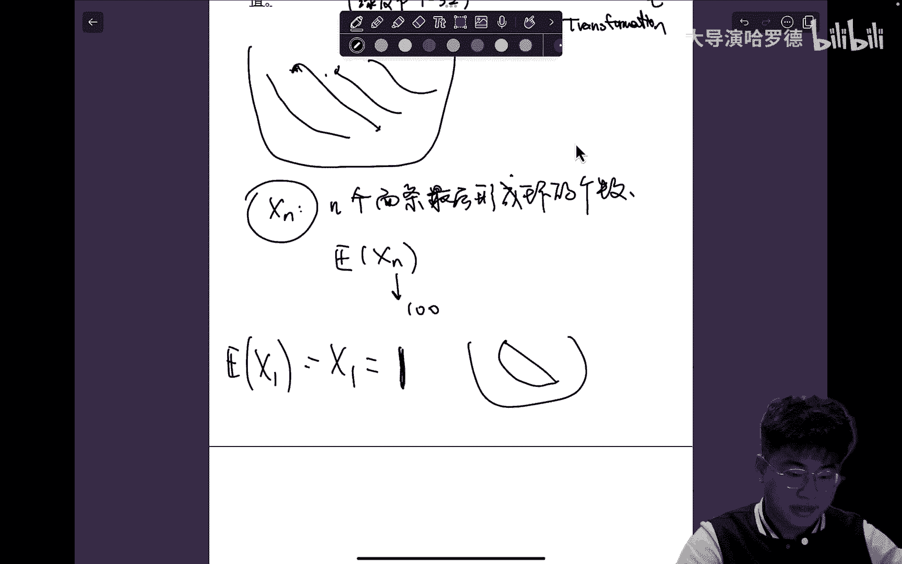

那我现在如果有两根面条呢，两个面条的话，我会发现嗯，首先现在有四个端点对吧，那四个端点最多的环的情况呢，就是我取这两个端点把它连在一起，然后取这两个端点把它连在一起，那这里面就会有啊X2。

最后的这个值应该就是这个小X2吧，因为我们说它是一个这个实例嘛，那它就是等于二，那X啊，如果说他是另外一种连法，就是我比如说我最开始就把这两个连在一起了，那我下一步我现在就只剩这两个端点了对吧。

所以我就会把这两个端点在一起，然后我就最后这个X啊，呃或者就是X12X22就会等于一，所以他一共就这两种情况，那你会发现它的这个取决条件呢，就是在于我的第一次连接会是怎么选择的。

这一点呢其实也就跟这道题，不管你是用一根是用两根，是用三根，是用100根，它就有一个非常非常重要的一个解题的思路，就是我刚刚说的这个state transformation，呃。

我为什么说它每一种state就是一个，就是一个这个state state翻译过来应该是什么，是一种状态，这里面呢就有点像stochastic process，里面讲的一个啊。

比如说像Mark of chain里面的这个state，但我觉得我们可以把它更加的抽象的去理解为，就是一种状态，为什么我会理解为一种状态。

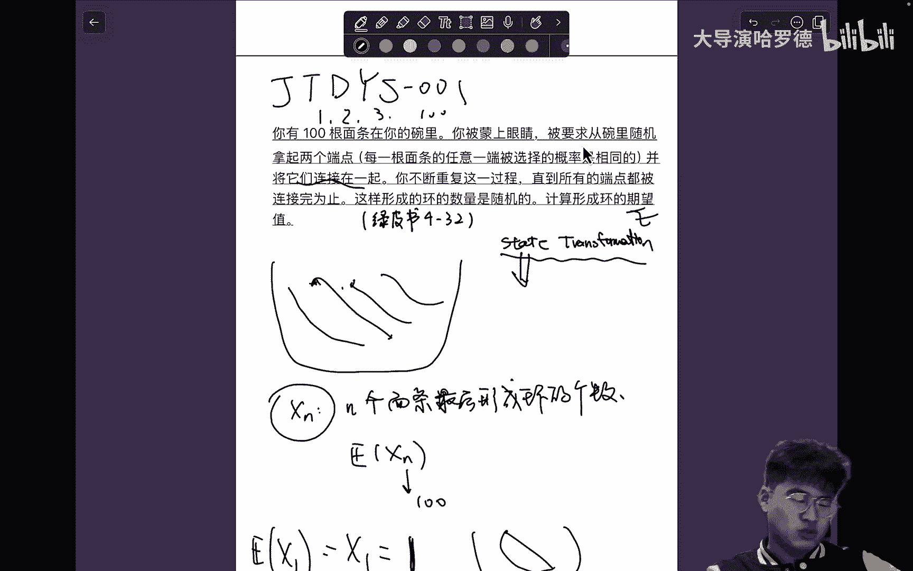

就是因为你看最开始看到这道题的时候，你会觉得100个面条它实在太多了。

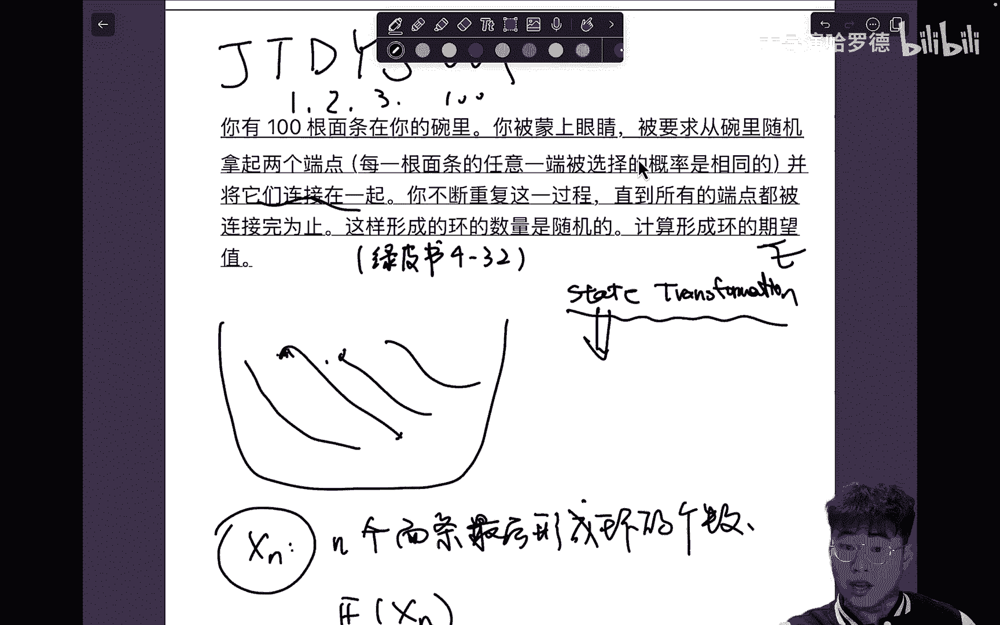

你就不知道有一种什么方式去解决这道题目，但是你如果思考一下的话，我如果把这两个端点连在一起的话，我会发现我的这个X比如说我现在有四根面条，我现在就会被变化为一个什么样的一个新的state。

它就会变换成一加X3这样一个state，那X3指的是什么，就是说我现在碗里有三根链条，我能产生的一个呃期望的一个环数是多少，那再加上一，因为我我我我我我比你这个X3要多一个环。

这是有一个可能的一个state，就是说它会有一个转化为变成这个state，它还会变成哪个state，如果你任意的去把它哦，其他的所有的一种情况，就是哦你连这两个或者呢你连这两个。

或者呢你连这两个或者呢你连这两个，这里面其实就是如果你其实这道题对吧。

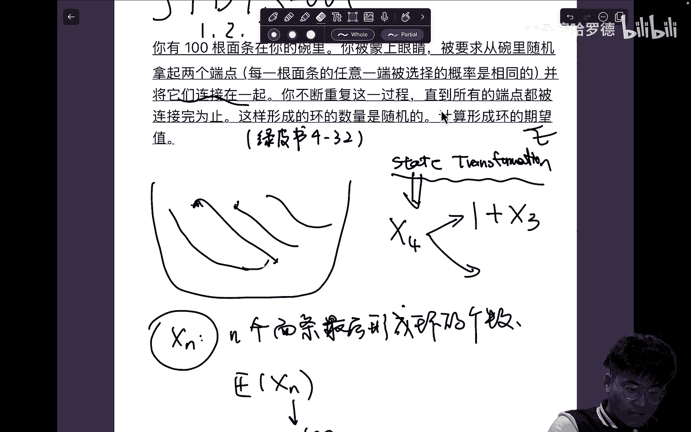

其实也没有那么难嘛，它的最重要的一个点，也就是最难意识到的一个点，就是你这个变化状态，然后它每一个状态是可以整合到一起的，为什么我这么说呢，因为你如果把这两个点连到一起，我这张图不知道你能不能看出来。

如果你的图画的更漂亮一点，你就会能更加的呃清晰的看出来，就是这两根面条，它其实从实质上来讲就变成了一根面条，我这里可能要稍微停一下，大家得仔细思考一下，因为这个是最重要的一点。

那如果他变成E根面条之后呢，其实你转换成了一个state，就会变成了X3这样一个state，就是你有三根面条，最后形成的环数的期望，和现在这个状态下形成环数的期望是一样的，那因为你在四个面条这个状态下。

你变成一加X3和变成X3，它的概率是不一样的对吧，所以那我们最重要的，接下来一个比较重要的点，就是来啊计算出它的一个状态。

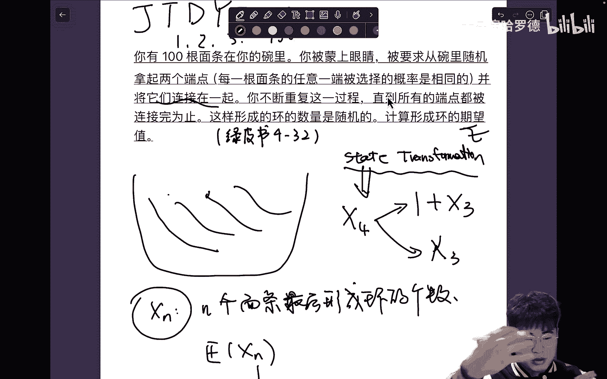

那我这里呢就是大家也可以想到，因为他问的是100，我如果从四开始，那从一从二开始都没有什么关系，那我就直接从N开始，我现在碗里有N根面条对吗，我们来画哦，哦哇好多好多好多的面条，那我们把这些面条。

我们把这个碗再重新画好看一点，然后我们把这个面条我们看看它，他的一个期望会是什么呢，好一共有多少种情况，首先它一共有几个端点，它一共有2N个端点呃，我真怕我写错了，这个是不是2N，然后上面是2N。

下面是N还是下面是2N，上面是N，我这个其实很容易写错，但是我觉得应该是不影响理解的，但我觉得还是挺影响理解的，那我要抽几个出来，我要抽两个，那我要抽两个的话。

这这就是所有的一个呃sample space嘛，这就是所有会发生，因为你是蒙着眼睛，但其实你蒙不蒙眼睛，如果是中国的面的话，他那个汤汁也比较浓，就你你你随便取两个端点嘛，你就直接往里往里往里往里。

那个手插到那个呃碗里面去，这样随便的摸，那你不管怎么样，那一共是有这么多可能性的，2N那也就是2N的端点，如果有N根面条，我有2N个端点，然后从这2N的端点里面选两个，那选两个之后。

它有几种可能性是变成啊，是变成这个，N减一的就是我相当于是哦，我把这两个连在一起，把这两个连在一起啊，我先不算这个，我先说N减111，大家也肯定想到，就这个状态变成这个状态的可能性，肯定要更小一点。

为什么，因为你只要选中了任意一个点，你的第二个点就不需要再去选了，你就是确定你要把这两个点连在一起，它才能形成一个环，再加上N减一跟面条的这样一个状态，那它的一个可能性就是只有。

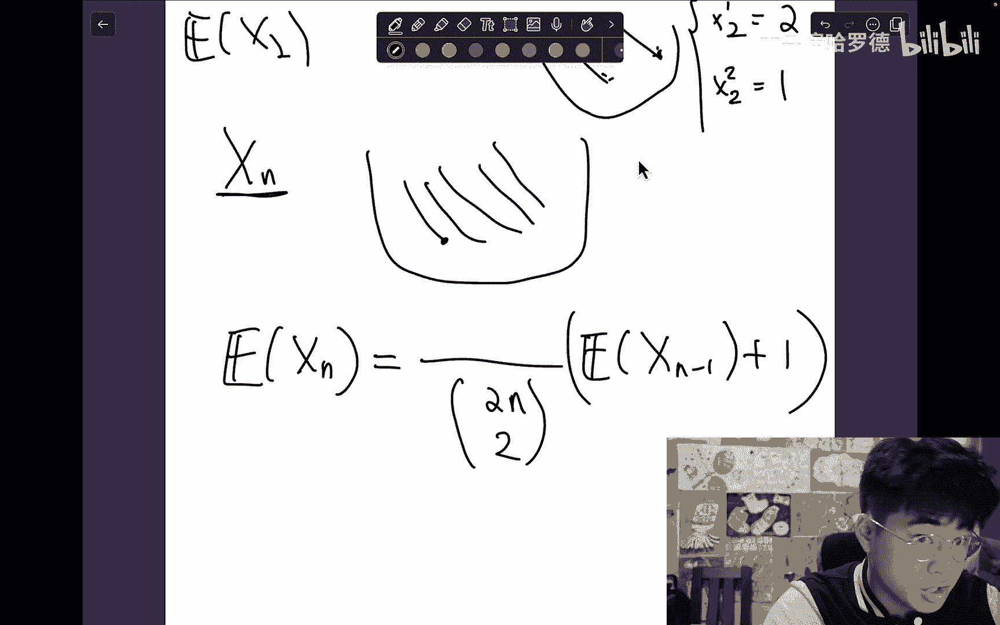

N然后接下来呢就是很简单的，就是其他的所有情况，2n choose to，然后2n choose to减掉N，它们都是会变成同样的一个结果，这里还也稍微有一点点的让人觉得哦，是真的吗。

然后你需要稍微静止的想想，就是你只要选这里，你只要不是选这里，你选任何的一个其他的这个啊，所有的这个这个这个这个这个节点，他都会变成同样的一个结果，那就会变成expectation of n n减一。

好把这个公式写出来之后，你其实就已经把这道题做出来了，然后你就会发现expectation of x n，这边的expectation of x n减一，你如果把它系数相加，它应该是也非常的正常。

它是应该是等于一的，那就是expectation of n减一，再加上多少，那这里的话就是你会发现哦，它是一个呃，就是N除以2N，那你就是2N，然后2N减12，那你会发现最后这里的结果就是加上二。

N减11，那你看一下这个对不对，如果说是呃从最开始的情况，我们知道如果有一根面条，那这个环有且只有一种情况，就是指等于一，然后其实你把N放成一进去，它也是符合的，所以你就会发现哦。

那如果说是如果有两个面条，那它就会是一个一加上啊，把这里是替换成二，那就是1+3分之一，就等于4/3，那这里呢我也想再画蛇添足一下啊。

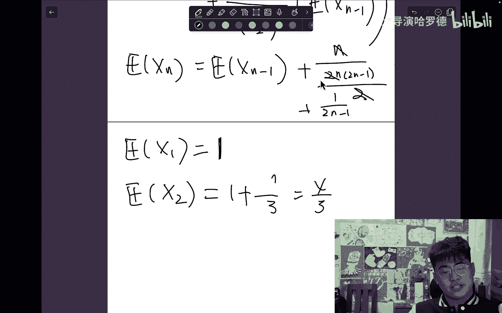

也不叫画蛇添足吧，就是验证一下嘛，那如果我碗里有两根面条，会发生什么情况，那四呃4choose to，那有几种情况下是我会变成一加，然后一加，然后expect变成一，也就是变成二。

你看如果你是选这两个和选这两个，也就是说有这两种情况，它是会最后变成两根的，那剩下的所有那c choose to呃，444选二，它就是六嘛对吧，那就剩下的所有的4/6，也就2/3的情况，它都是一的。

那你这样加起来之后，它的结果的确就是4/3。

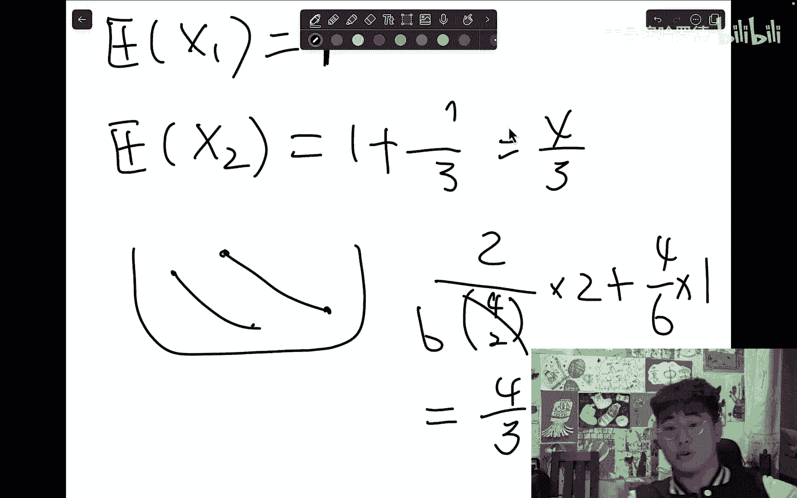

那也就证明了哦，我们这样做是对的，那你得到这个公式之后，如果是100根面条，你就会发现他其实最后的结果就是一，加1/3，加1/5，一直加到2×100减1/1，那这个结果是啊算不出来的。

那你如果用计算器可以算它大概的一个值，但不管怎么样，那我们这样呢就把这道题做完了，呃我觉得这道题其实比较考验的有两个点。

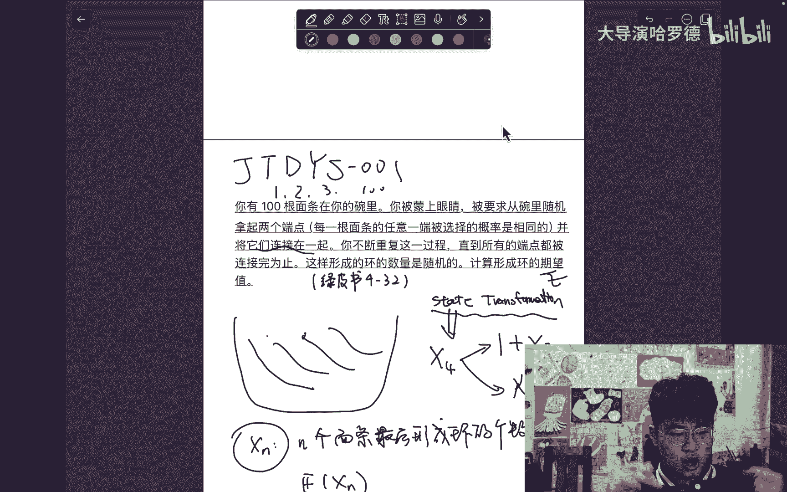

一个点呢就是你对这个state transformation，这个概念的一个理解。

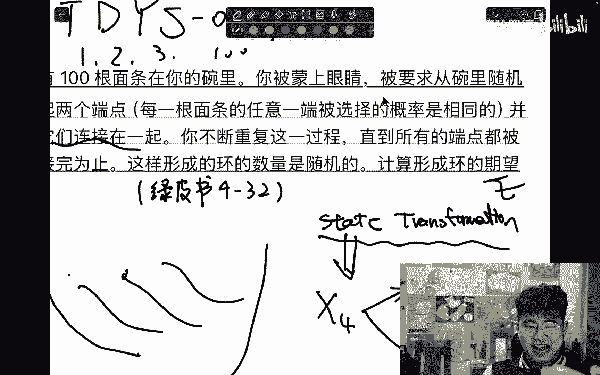

那我觉得其实我都不确定这个概念，是不是真的是一个概念。

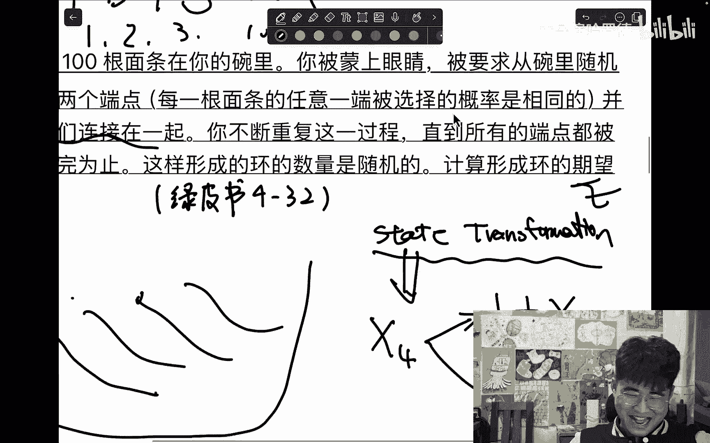

那不管怎么样，因为我在做我的频道，然后我在解我这些题，只要是我能理解的概念。

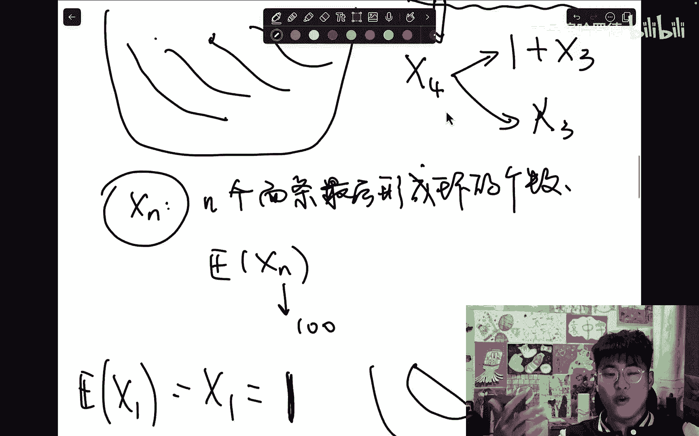

它就是可以，大家可以参考下，如果你觉得啊这个是什么狗屎概念，你也可以用自己的概念去理解。

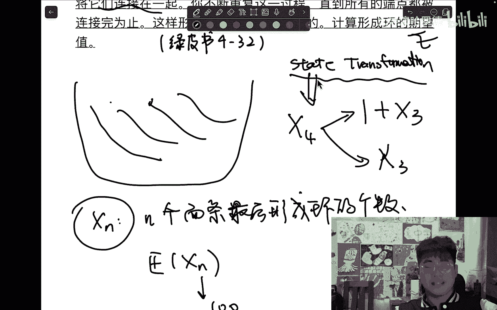

那我我对它的一个定义呢，也是其实也不是我对它的定义，我觉得应该是也有一个专业的定义，是对它有这个定义的，就是你在一个变换的一个process过程中。

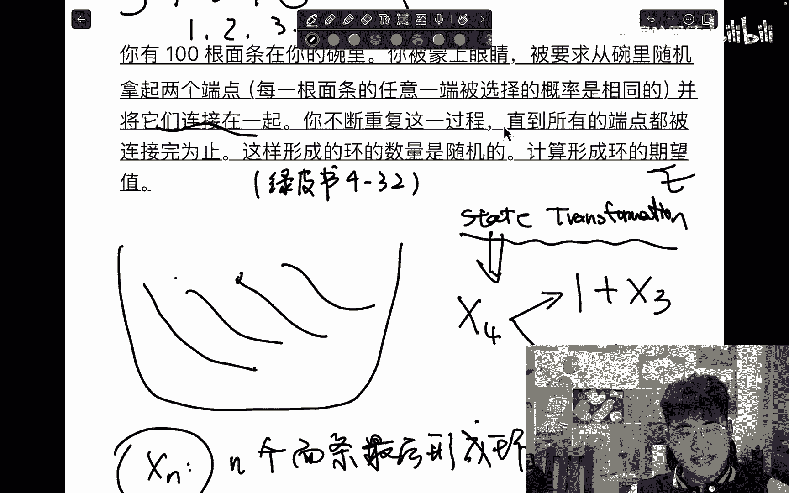

你会觉得那你100根链条，你要去计算它最后形成的一个期望，你最好的一个方法就是可以有一个呃，有一个在一定数量的一个这个state下面，是可以把所有的可能性都算出来。

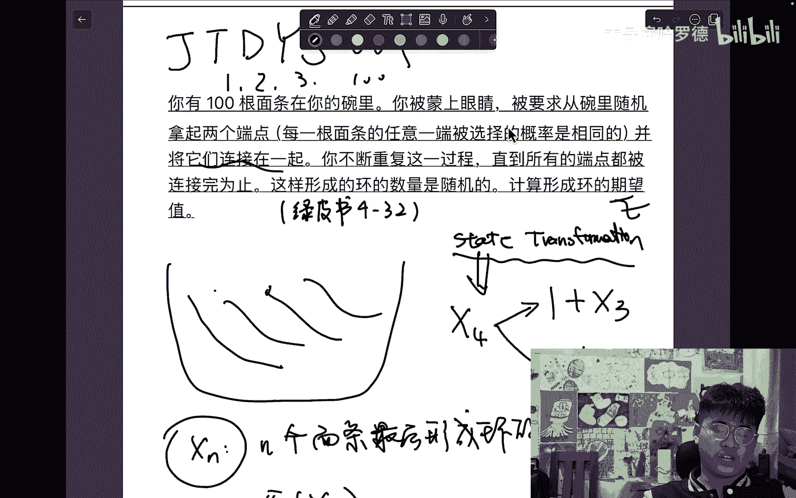

就像这里，那我从X4就是我有四个面条，那我最后形成了环数的这样一个随机变量，它只会变成两种情况。

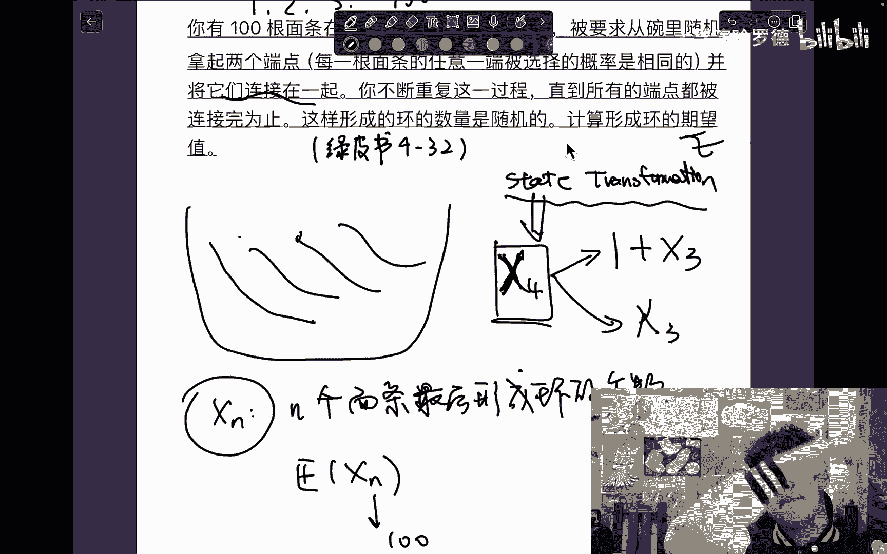

也就是相当于你把所有的这种呃四的话，那有八个，那你从8choose to这样所有的一个sample space，你把它分成了两类情况。

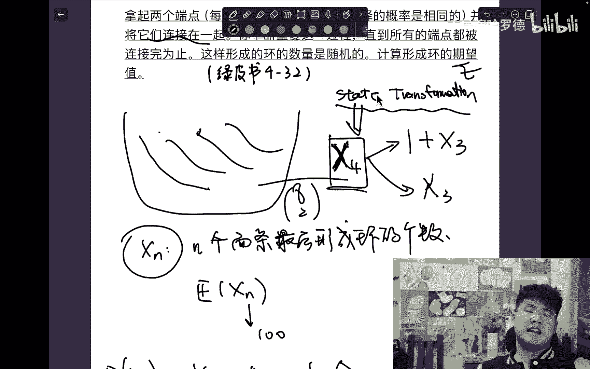

然后这两类情况如果你能把它啊，最后的结果都能把它归类。

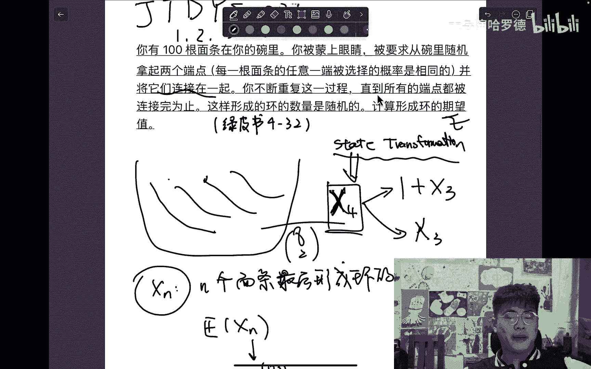

然后并且把它计算出来，你就会从头从从一根面条开始，一直到100根面条。

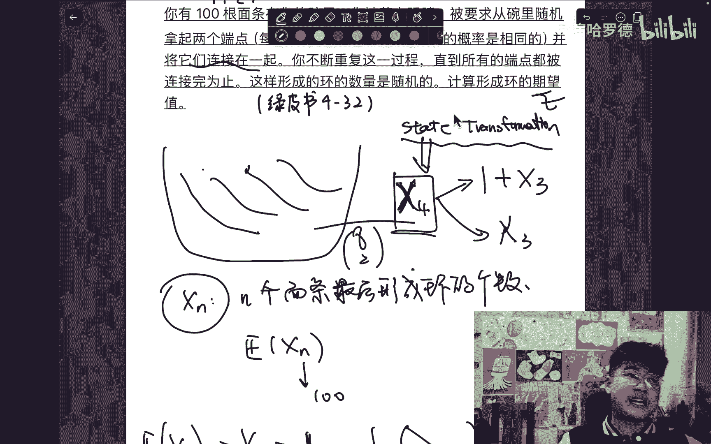

你就有了一个计算的方法，好那这道题我把它作为我们整个系列的开始，也是因为我觉得这道题是一个非常有意思的，我也没有做特别多的铺垫，我也没有说特别多废话呃，算现在在说很多废话，因为这是第一道题啊。

之后可能后面这些废话也都不会说了，因为我也是希望作为一个开头，然后也希望大家喜欢这样的呃风格，然后因为我也是刚开始做的尝试，如果大家有任何的建议，有任何的批评，我都特别希望大家能在留言上说出来。

分享出来，然后也希望大家能够啊对我的做的方法呀，以及讲的方法呀做批评论和指正，然后我是大卫哈罗德，谢谢大家，我们下节课再见。

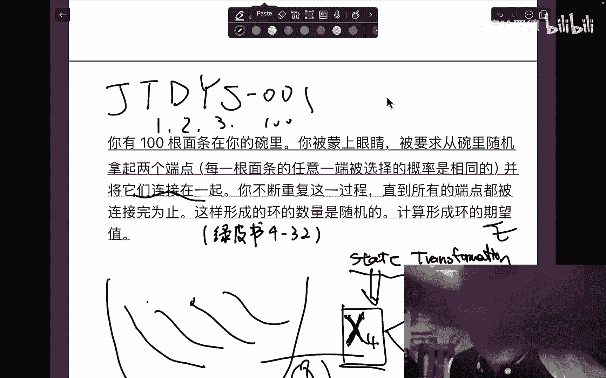