# 【金融数据分析】这太完整了！python金融分析与量化交易实战课程，全程干货无废话，入门到精通一步到位，(数据挖掘分析大数据金融股票) - P21：3-策略初始化与数据读取 - python可视化之路 - BV1omkHYBEiG

这里啊我已经是打开了一个新的策略文件，在这里呢我们一起啊来去动手，实现一下这个因子打分选股行了，然后按照我们的顺序，咱们一步步写啊，第一个咱们现在要做一个触发方法，在这个contest当中。

我们要指定哎当前我们的一个大池子，你要到哪儿当中去选这个股票啊，咱为了使得这个效果能够偏好一点，哎咱们直接在那个呃沪深300当中去选啊。

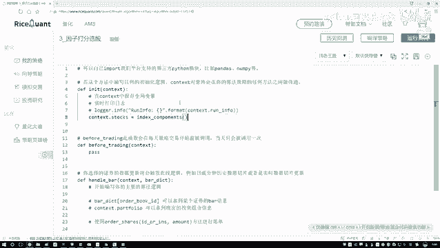

这样咱们使得收益率看着能够更好看一些，好了，咱们写沪深300，这是咱们现在指定好的一个大池子，然后接下来呢哎我说在这个context当中啊，哎一会儿我要做调仓，那调仓里啊，你是不是得告诉我哎。

我到哪儿去选一些好的股票吧，那这一块咱们先指定一个变量名字啊，就是我们上一次哎咱们当前的一个排名情况。

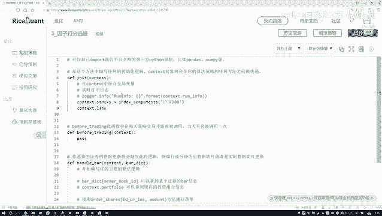

一会儿呢我们会把这个排名情况给得到，哎咱把context当中啊，先指定好，一会在这个当中啊去选啊，那么前十或者是前20个，然后接下来呢咱们来指定一个定时器吧，在这个定时器当中啊，我们去指定一下啊。

它的一个调仓，我们是run方法啊，咱选按月调仓艾条当中啊，第一个就是一会儿咱们要去自己啊。

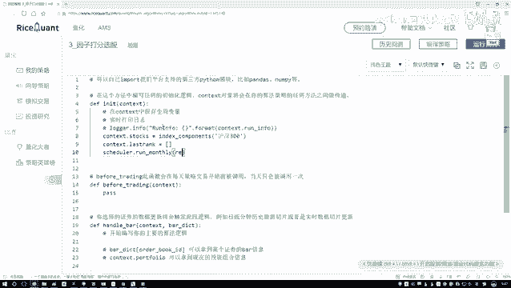

实现的一个函数，我们写个REBALANCE，然后第二个写个一就行了，然后既然我们写这个函数了，来下来是吧，下面我们来定义一下，在这个函数当中，我直接复制一块啊。

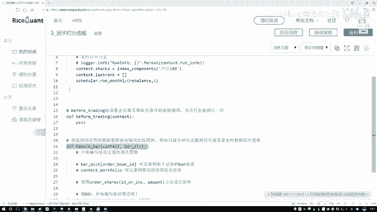

写什么，写一下咱们的一个REBALANCE函数，在这个REBELN函数当中啊，我们要做的事其实还是蛮多的，其实最核心的一个什么最核心的哎。

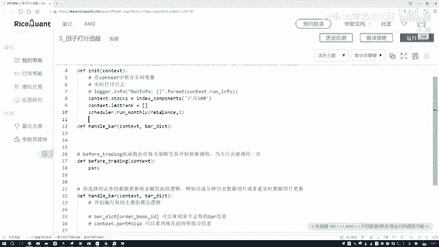

就是咱们怎么样去指定我们的一个评分了好了，REBEAN当中呃，第一步咱们就得先在把呃，那前300个或者说排序好的300个，或者说是那个排名的十个吧，咱得返回出来，在这块我得知道哎呀。

当前你排名完之后的一个股票，那这块咱们自己哎去写个函数吧，比如说啊它就是get socks，我们自己写个函数。

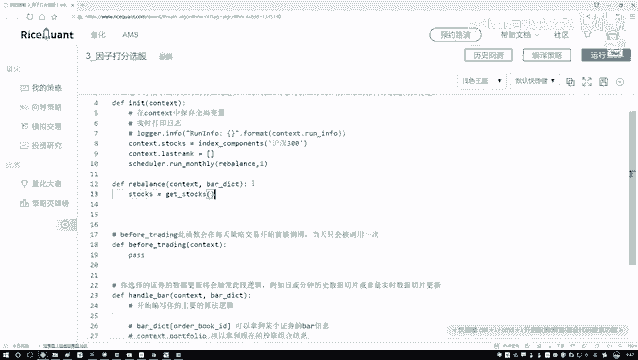

在这个函数当中啊，他要去帮我们去实际的去啊做一个评分操作。

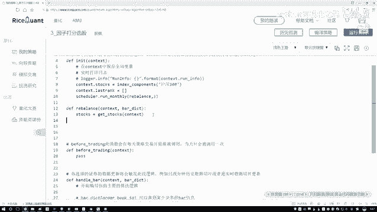

我们来写一下呃，还是把这个复制下来，然后名字改一下，叫做get stop，这函数当中我们就去写吧，第一步干什么，第一步我们是不是说要去获取哎。

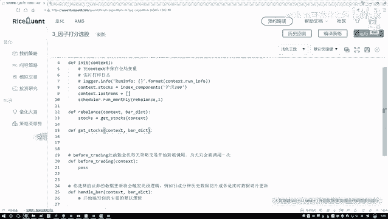

咱们现在需要的一个数据啊，所以说第一步咱们肯定要做一个查询的操作啊，get呃查询操作，查询操作当中咱们来写吧。

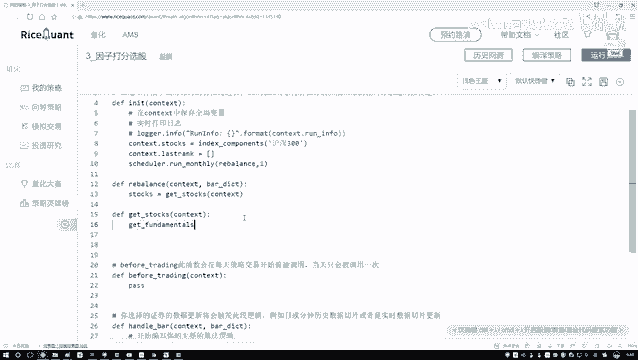

第一个就是你的一个query query，我们自己写query吧，在这块我先写啊，这个query，因为我们要查的比较多啊，这块我单独列出来了，我们查查的就是刚才在notebook当中。

我们是不是哎给大家列出来了，有那么六个指标吧，哎或者是啊有几个指标都行，或者大家自己玩的时候，你愿意多少个多少个，咱就以那六个为例子给大家来说吧。

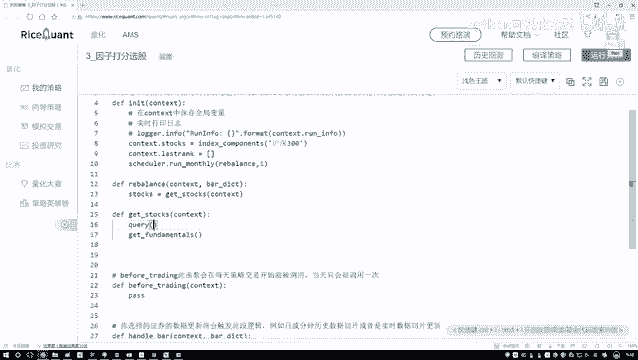

好了再来一个写，第一个，我直接复制了这个fly mal，啊这样算了，直接写吧，Fundamentals。

他应该会给我提示啊，fundamental当中呃，咱们就选的第一个就是那个每股收益。

在那个金融指标当中，哎我们有一个每股收益没有收益啊，看一下它是一个D开头的哦，找一找看一看啊，这这呢这呢对就是当前第一个每股收益是吧，Pershare，哎咱们点进来，这是我们第一个要做的每股收益。

为大家写一下它的一个名字，这就是我的一个每股收益，每股收益啊，EPS指标，然后我们希望它是怎么样，它是越高越好的。

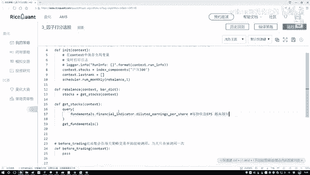

哎这是我们第一个指标好了，然后在这块我们写上个逗号，这里咱们是第一个指标。

然后我们再写第二指标，第二指标像是我们noble当中给大家说的，哎我还有一个呃净资产的收益率啊，跟这个都是一样的，我可以把前面一些全部给它复制过来，好全部复制过来之后。

我来找一找静态收益率也是一个90指标哦，在这不是也它是一个收益率，是一个return开头的，return开头的当on一个这个指标好了，我来注释一下它啊，叫做一个净资产，净资产收益率。

我们也是希望它啊它是一个越高越好的，然后呢再来最后一个吧，最后一个还是哎在这个指标当中都一样的，第三个我们来说哎，就是有一个投入资本的一个回报率，投入资本回报率啊。

那也是一个return还开头的回报率嘛，return一下呃，return一下，然后净资产的回报率来找它是一个on什么啊，最后一个是吧，看一下哎对，这是我们净资产的回报率，然后呢给它指定名字吧。

叫做一个净资产回报率，然后我们也是回报，回报，绿啊我们也是希望它能够越高越好的好了，这是我们现在把这三个指标全部列出来了，那有三个指标之后啊，其实还没完，我们要对这个指标怎么样。

哎是不是说啊得找一下它得在我的股票当中啊，这个操作，估计大家应该相对来说都是比较熟悉了，在这块我们指定一个哦。

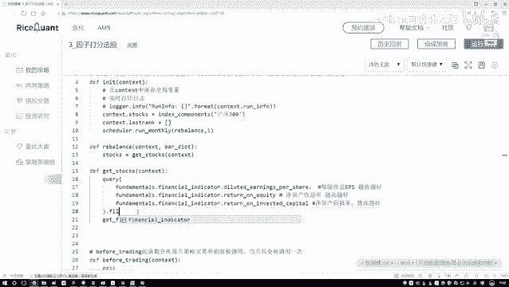

哦filter，在这个filter当中，我们来去指定一下filter当中来指定一下吧。

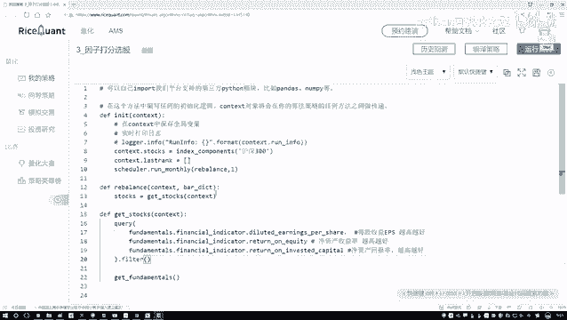

当前哎我们的股票得是带我的这个池子当中，好了，fundamentals点啊，点一下咱们当前的呃statement当中，然后有一个stock stock in哦，Stop code。

然后对它然后点in的一个操作哦，对它啊，然后我们来进行判断一下，是不是在我们的16当中，把我们的一个呃或者300这个池子给拿到手，这就完事了行了，这里啊咱们写了一下。

我们这个query query完之后啊，大家注意点，这还没完，它返回是什么返回的格式哎，最早一次课是给大家说了，我们得把这格式怎么样给转制一下吧，到时候方便我们去取哎它的一个索引的好了。

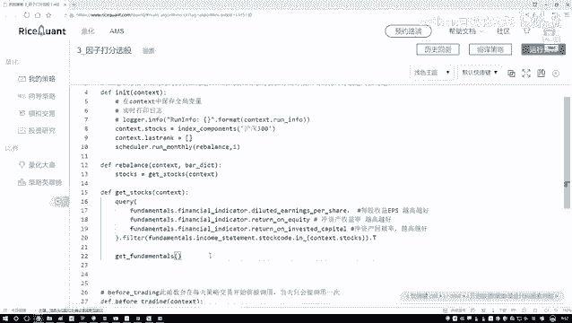

然后这块咱们实际写一下吧，get fal fundamental当中，我们来写在这个get函数当中啊，我们来去把这个query传进去啊。

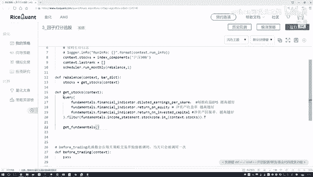

这样吧我直接给它，我复制进来吧，直接把这个query传进去，然后这块正好它是一个点诶，这也完事了，呃括号也没什么问题好了，这是咱完成的第一件事，我们现在把一些越高越好的指标给它拿到手了。

然后我给他指定个名字吧，咱一会儿得区分啊，这个东西呃，它是一个越高越好了。

指定一个fundamental，我们希望当前得到data frame。

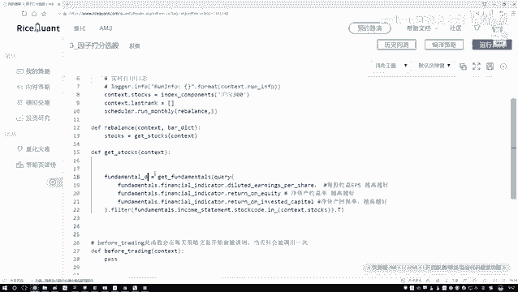

它是越高越好的，指定一个up就行了，然后复制一下吧，就是在我们当前这个鼠标当中啊。

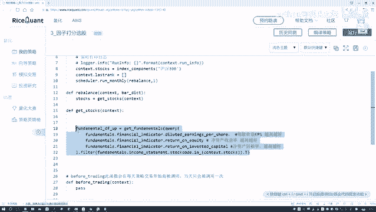

我们不光要拿这个越高越好的，还要拿什么，是不是还有一个是越低越好的呀。

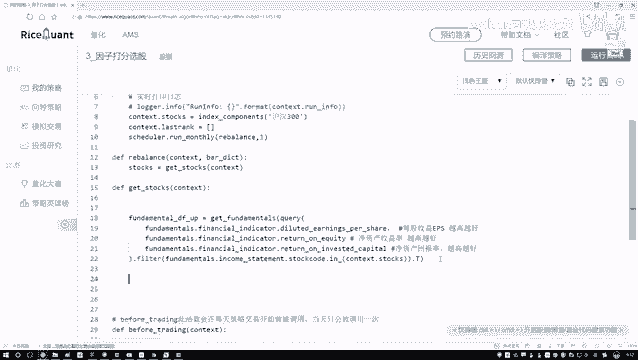

来咱写一个down，我把这些名字啊，呃稍微改一改就行，然后下面基本这些操作，咱都不用去改的几个指标啊，把这个改一改，这个它就不是每股的一个收益率了，我说这个它叫做一个资产的负债率。

资产负债率我们希望这个资产负债率啊，它是一个越低越好的，那这三个其实它都是一个越低越好的，我把这三个值啊拿到手啊，它都是一个越低越好的，这是一个资产负债率，然后还有一个就是呃啊。

PB的一个一比上一个PB吧，啊因为PB我们需要什么PB，我希望越高越好，所以说哦不是就是一比上一个PB，我们希望越高越好，所以说当前的一个PB值，我们希望它是一个越低越好的啊，这是一个pp值。

然后第三个第三个我们再拿到一个市值吧，市值反正也是越小越好的啊，虽然拿着简单的得到改一改吧，第一个我们给给它改成实际的值，叫做一个资产的负债率呃，资产的一个负债率是吧，好了。

找一找它有没有当前诶没给我出他的个提示呢，点一下呃，资产的一个负债率就是哎就是第一个是吧，然后第二个叫做一个pp值，我再点一下哦，点一下就是PB在这里直接点一下，他应该直接会拿到这个PB呃，找一找诶。

这里怎么没有这个PB呢，哦哦当前前面这个不对，前面这个稍微改一改啊，改一下就行了，D然后把这个改成一个PB指标，哎跌就是这是个PB指标，我们也希望越低越好的，然后第三个就是我们的一个市值好。

直接把这个复制过来吧，直接把这个赋值，然后是值它就是一个点market当中的，找一找，第一个就是了好了，我们现在就是已经哎把我们当前的呃，需要查找两个数据全部做好了，一个我们是越低越好的。

第二个我们是一个，那就第一个我们是一个越高越好的，第二个我们是一个越低越好的行了，这样值咱现在就有了呃，这个点T哎有点不太对，大家来观察一下这个点T应该是放哪的，哎是不是我们最后的时候才放这个点T啊。

那不应该是点括号里边吧，应该是你get fundammethod之后，我得到了data frame，对data frame做转制吧，所以这块有点毛病，我们得把这个点T给它放到外面啊。

这刚才差点有点小毛病，转制要到外面，最后我们来去转制的，然后这一块做完之后，这样吧，咱先打印下，结果来看一看，一会儿咱来打印一下，哎算了一会儿啊，一会儿咱来打印吧，等运营运行的时候。

其实这块先跟大家说说结果吧，现在我们得到什么哎，一共300个股票，当前这个data frame它的一个shift值多少，300多少三吧，那下面呢也是一个300逗号三吧，啊这块有个越高越好的。

这块有一个越低越好的，我们现在把这两个啊指标数据，或者是我们的一个因子数据啊。