# 【金融科普／文献阅读】用Python画出Markowitz有效边界 - P1 - 秋名山的喵森 - BV1fx4y1m7Gh

嗨大家好，我是周明山的喵森，上次我们讲到了这个投资组合理论，以及有效边界的概念，今天我们就来用这个Python来，就是试着你和你和我们这个有效边界好，模拟一下，首先这里导入几个包呃。

这里用到的这个数据接口呢是这个呃to share，就是如果大家没有之前没有装这个库的话，就得去在那个呃命令提示符里面去装pip，install to share啊，就这样一个命令去安装它。

然后这里用到了pandas npi啊，MATTPOLIB用来画图的，然后还有一个是生成这个呃随机数的，这个模块叫做random对，然后首先就是利用这个TCL的数据接口呢。

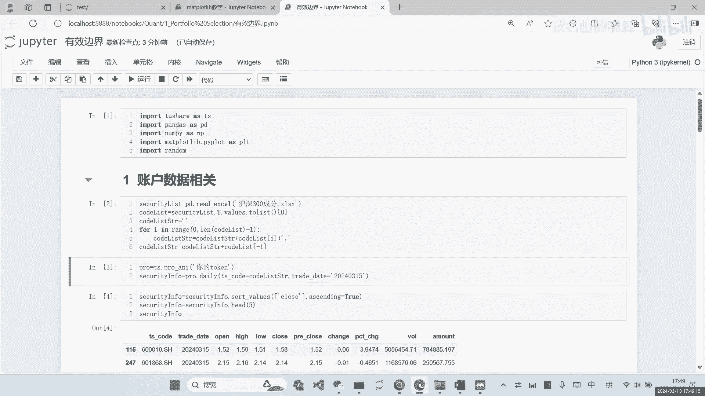

然后，进行一个账户数据，进行一个数据的这个导入啊啊，这里首先是获取了这个我们这里使用这个啊，沪深300的成分股啊，作为我们的这个股票池，从里面选股，选出几只股票，然后来构建我们的这个投资啊，投资组合啊。

看这里的这个沪深300的这个成分，股的这个成分呢，我们是啊从这个choice上面下下来的啊。

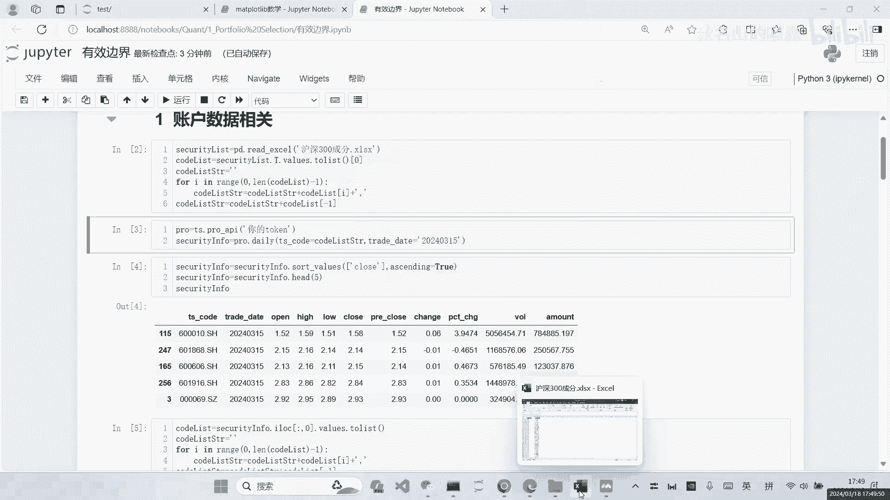

他的数据是长这个样子，就是这包含了他的正确代码，以及这个它的这个正确名称啊。

对应的正确名称，好的，那下面呢就使用这个to share接口啊。

然后每个账户都会有自己的token，然后把你的这个token输进去，然后取得你就是相应的这些股票的一个数据。

然后这里呃这里我们随意选取一个标准。

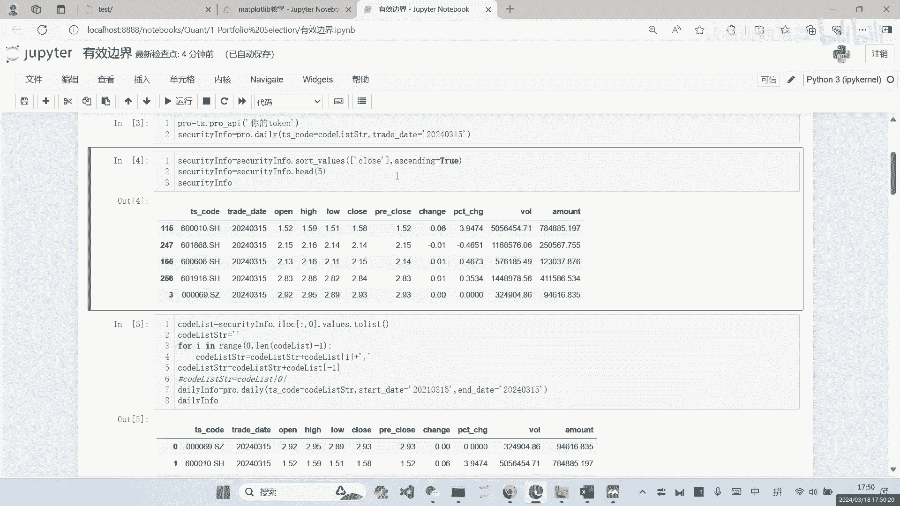

比如说这个啊先去沪深300里面啊，在2024年3月15号的这个呃，这一天收盘价最低的五只股票，好，我们选取这五只股票作为我们的这个啊，构建投资组合的这样一个这个这个股票值。

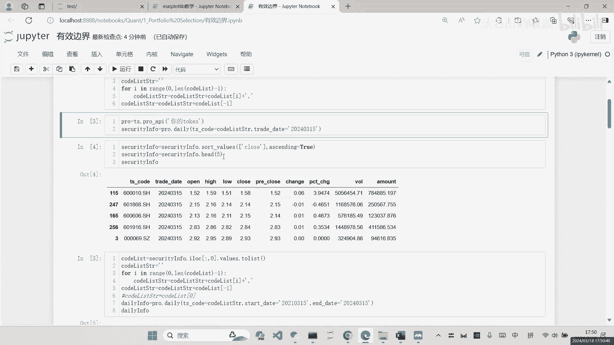

然后我们把它给摘取出来，就是这五条啊。

这五只股票。

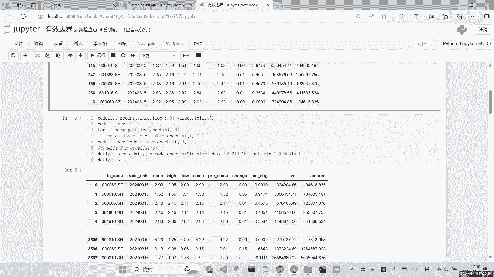

啊然后下面我们再通过这个to shell的接口呢，去获取它这个它的历史数据。

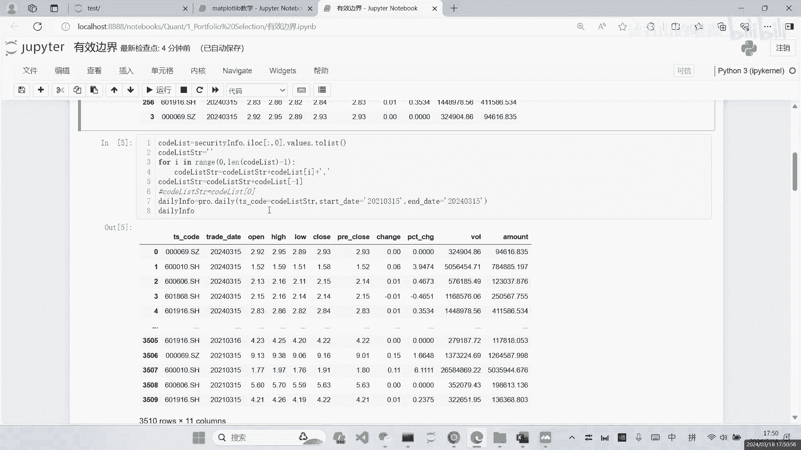

从21年的3月15号，到24年的3月15号啊，这个获取历史数据是为了干什么呢，是啊，为了计算他们的这个基于历史数据的方差，以及均值，以及他们相应的这个协方差的一个矩阵啊，因为在呃之前那篇论文里提到。

是可以拿这个历史数据啊，有时候是可以拿这个历史数据来这个代替的啊，代替我们的这个判断，对的这个股票的判断，然后得出来的这个数据是可以这样做的，我们这里只是为了就是给大家演示一下，这个有效组合。

所以它如何推出一个合理的方差异均值，这个我们啊先不管。

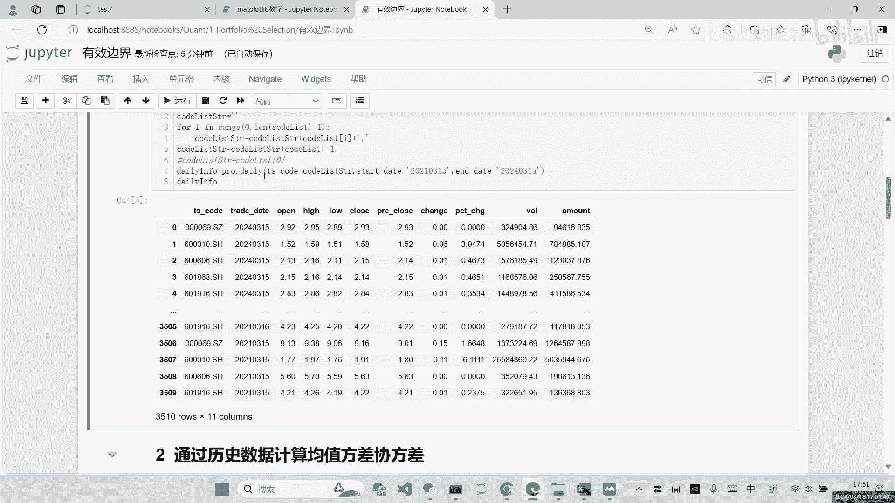

所以这里先拿历史数据来计算啊，作为他的这个合理的方差和均值组合啊。

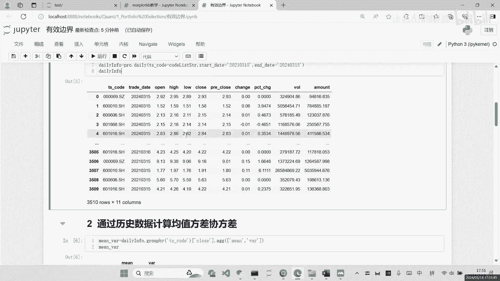

这里就呃，所以呢这个地方首先获取了他的这些啊，日线的数据，这五只股票的日线数据啊，我们可以看到这是一个常数据面板的常数据，他这个第一列它是这个T扣的，这一列是股票的代码。

然后cross这个这一列它指的是收盘价，然后后面的是成交量啊。

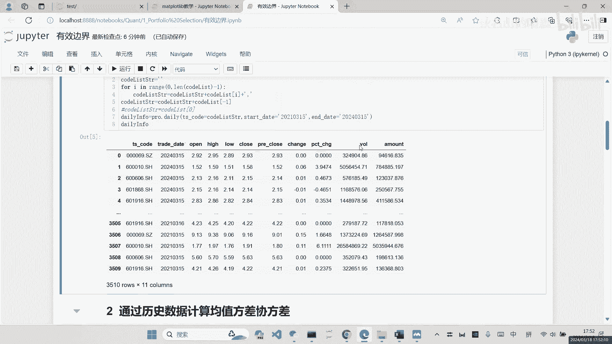

以及这个成交当天的成交额。

然后这个trade date是他的交易日，可以看到这个是从2024年3月15号。

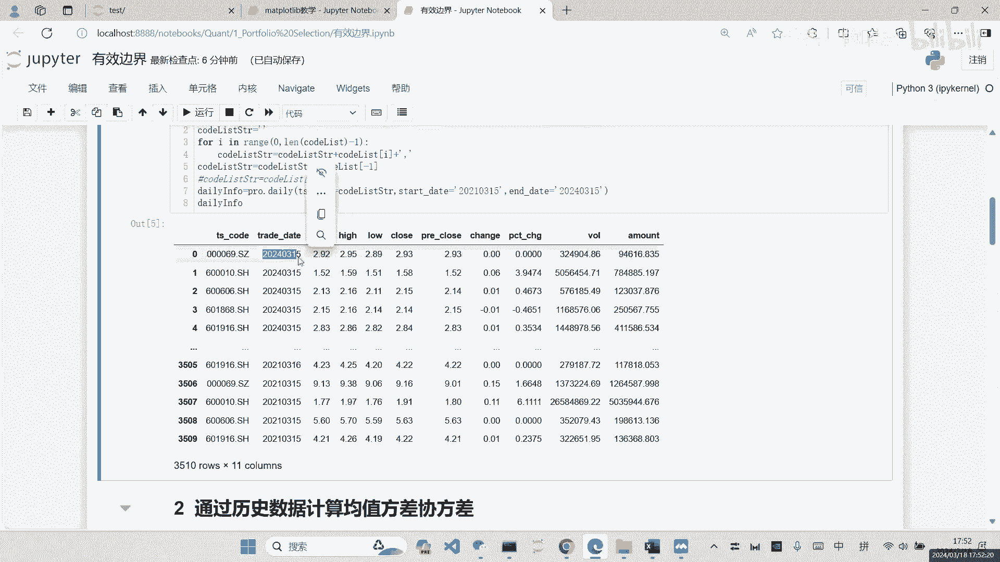

到2021年这个3月15号，有人问为什么不使用更多的历史数据，那是因为我不是会员，如果那如果如果理论上来讲，那肯定是历史数据越全，它反映的信息就越多的啊，但是这里只是做一个演示。

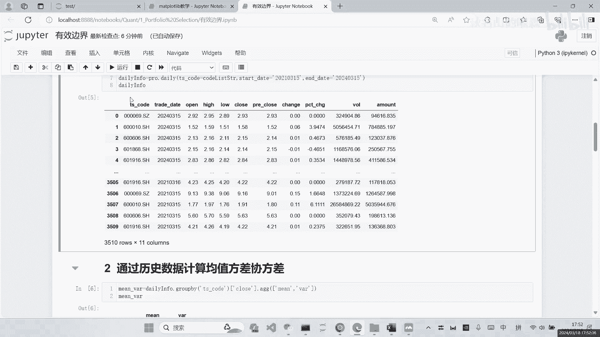

所以啊，我们暂且姑且只拿3年的数据来计算一下哈。

啊然后之后呢获取数据之后，我们就开始算它的均值方差以及他们的协方，他们互相之间的协方差了啊，首先这个啊，这可以通过这个判断所自带的这个group by啊，还有这个聚合的啊这个函数啊。

来把它计算他们五个的均值和方差，他们分别的禁止和方程啊，这里得到一个这个啊，加一个data fra。

下面我们再计算它的协方差矩阵啊，对方的矩阵的函数是这样的，是这个啊，这个CV就是表示计算的协方差啊，类似的，我们也可以计算那个他们之间的相关系数，它的还是这个COR。

其实都是类似的，之后我们就是随机，因为是五只五只股票嘛，所以我们要构建的这个投资组合的话，我们需要确定他们五个的权重啊，所以为了就是画出我们的有效边界，我们就啊随机设一个函数来随机生成这个啊。

一组这个权重啊，这个函数这个random weight，这个函数就是用来随机生成一组权重的函数，可以看到这里，把上面这个名VR这个函数输进去啊。

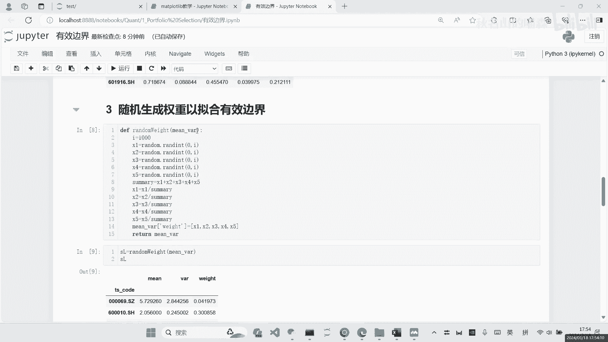

这个这个data frame输进去。

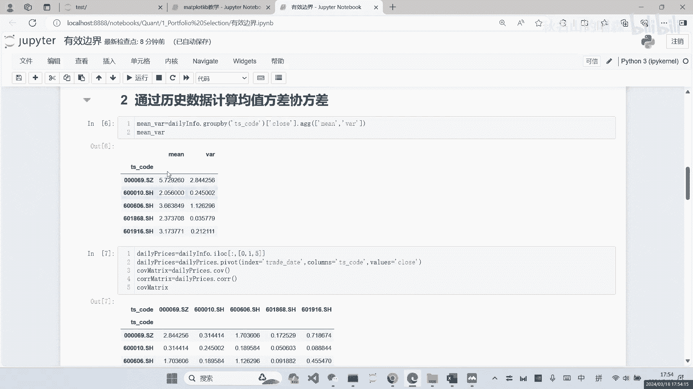

也就是这个啊，然后它会return一个这个呃也是也是一个data frame，只不过他这个data frame在后面又加了一列，这一列就是他们这几支股票，它对应的权重啊，就像这样子啊。

就如同它的结果反馈出来的结果是这样的啊，这个当然这个只是一个投资组合，我们要很多的投资，就像我们如何计算一个投资组合的这个均值啊，然后这个方差呀以及他们的标准差，首先我们就是建了一个类啊。

叫做这个投资和portfolio，然后在里面就是定义了它的函数，计算这个啊均值函数计算大方差的函数，这里计算方差，大家可以看到这些计算方差，就需要用到这个之前嗯，我们计算的那个协方差的矩阵。

只能上说每一个投资组合他自己的方差，具体计算方法这个之前有提到过，然后呢这个呃，啊然后这里，然后然后这个函数是一个呃可行级的函数，生成可行级的函数啊，就是呃你想生成啊，这里的几个参数的意思分别是呢。

这个是这个MVR这个东西，它指的是这个啊函数的，它的而不是函数，就是这五只股票，它的那个均值以及方差的那个data frame，也就是上面我们上面我们提到的。

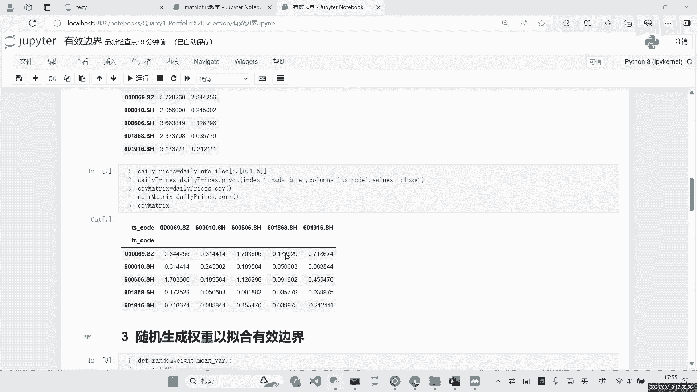

啊这里这个东西，然后呢，这个呢就是那个协方差矩阵了，然后这个portfolio lab指的是我们想啊生成多少组，多少组投资组合啊，因为我们要画图嘛，所以必须要甚至很多的点才能把那个呃，先给他给描出来。

所以我们当然生成越多的点越好了，所以这个也是我们人为设置的，嗯然后下面我们就对，然后这个函数它会返回一个东西叫做AS啊，这个AS是什么呢，这个AS它是一个矩阵，然后它包含的是呃每一个投资组合。

它的这个均值方差以及标准差，所以它应该是一个N乘以三的一个矩阵N，那就是我们要构建的投资组数，也就是这个portfolio n，接下来我们构建了，接下来我们就开始构建这个呃第12块，这里啊。

这一行就是在构建我们的这个可行集，available site啊，可以看到这里我们设定了把这个PO或六，那我们设定为5000啊，也就是说我们之后会看到5000个点在图上面。

然后把这个东西弄出核心就得到以后。

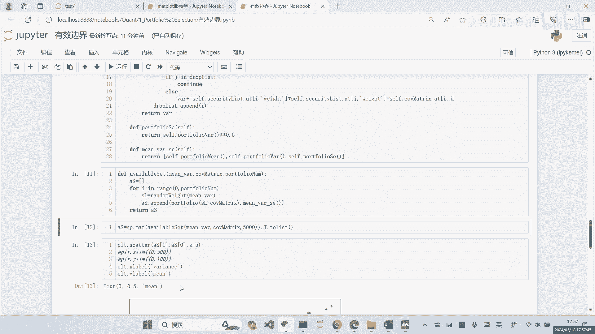

我们就可以开始画图了啊，然后我们我们首先画出这个啊，这个方差和均值的呃这样一个散点图啊，这个图中的难点就是呃组成的这个集合，就是我们的可行集了啊，当然不是全部，只是我们这个5000个点啊。

它的一个集合当然肯定还有更多，但是我们现在只是用一部分，来描述它的有效边界嘛，所以我们可以比较清晰的看到，这里的有效边界是这样的，那它是明显是一个抛物线的一个形状。

这个是这个是符合我们啊论文里提到啊推算的，他这个有效边界呢它是呃当横坐标的变量，它是这个方差的时候，它其实是一个抛物线，嗯这个呃还是很清晰的啊，下面我们再试着使用这个呃，把这个方差换成标准差。

那可以看到这里的啊有效边界就变成了这样啊，啊这是我们通过推算也可以得到，它其实是一个双曲线啊，只不过因为双曲线，它其他复数和以及另一半的部分，另一半的部分就由于这个取值范围的问题，他就没有了。

所以这里只剩下这一段，啊这个文件的它的这个源代码呢我会发送到，我会传到这个百度网盘，然后在简介分享给大家。

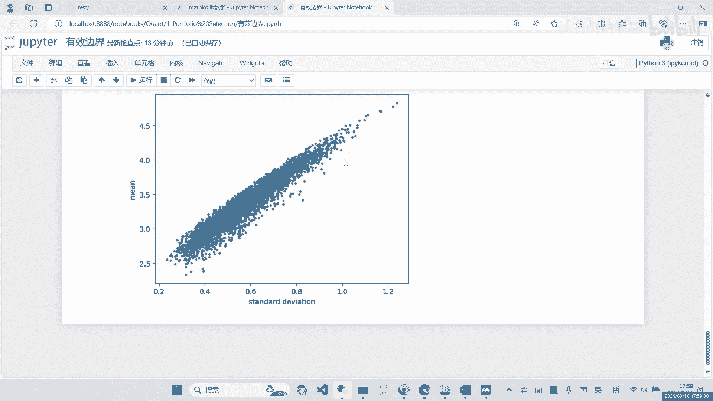

如果有大有需要的话，大家可以自己拿去研究一下，好的今天就大概讲到这里。

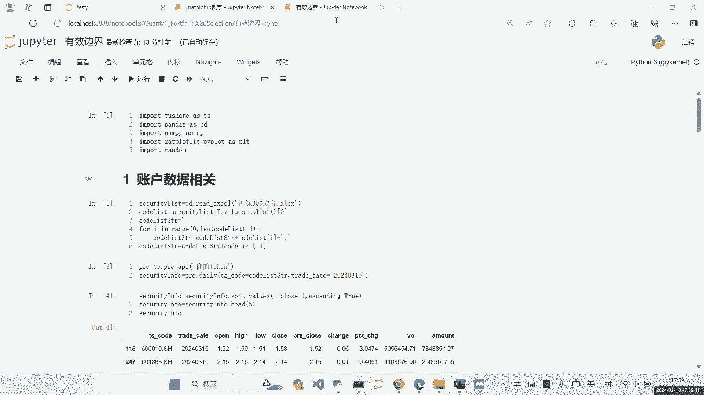