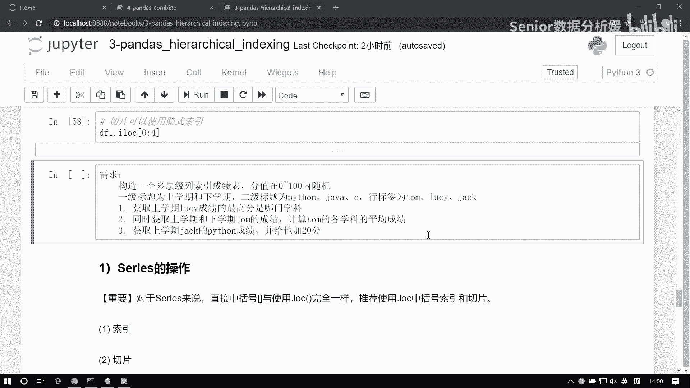
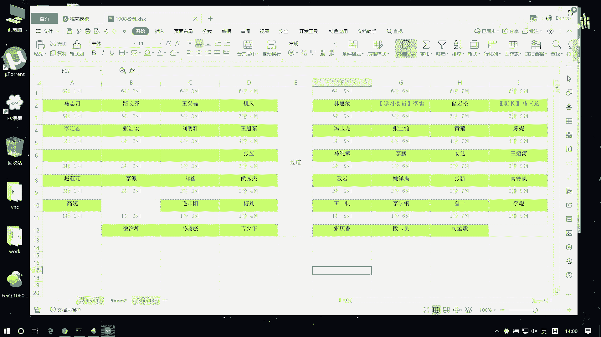
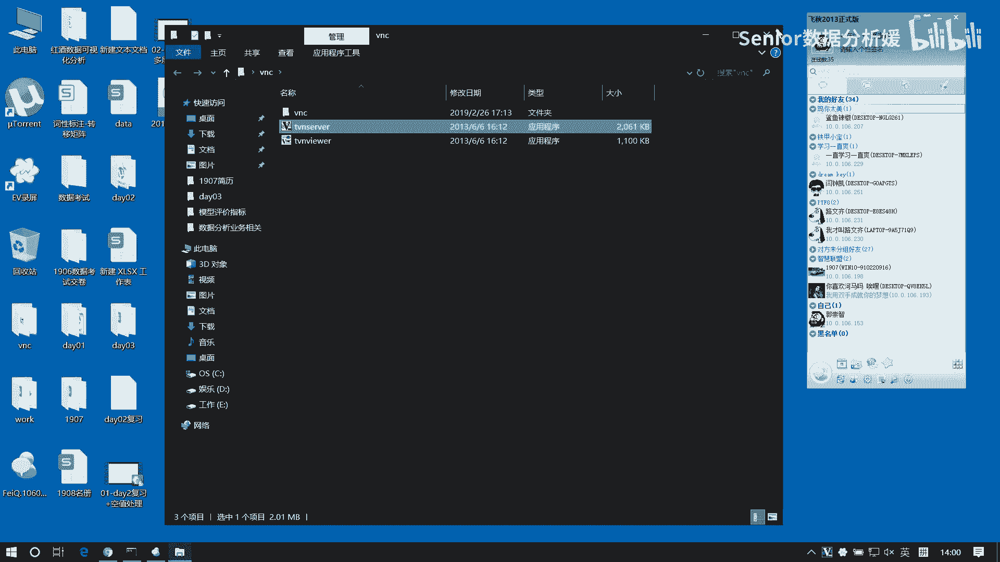

# 数据分析+金融量化+数据清洗，零基础数据分析金融量化从入门到实战课程，带你从金融基础知识到量化项目实战！【入门必备】 - P35：03 上午练习 - Senior数据分析媛 - BV1Ak61YVEYX

先热个身啊啊，我开屏幕了。

热热热身，来把这个练习我们写一下啊，首先啊构造一个多层级列索引，层级表，分值在0~100内，随机一级标题，上学期下学期二级标题，Python java c行标签为航母，如C杰克啊。

那这个这应该都会弄是吧，首先我们要构造一个多层级索引表，咱们直接用这个pd点，multi index点from product就行了，是不是，然后第一层我写什么，写这个上学期和下学期，哎第二层我们写。

Python java c啊，这是一个列多级，那我们给他构造成一个columns，然后index3个人物，汤姆LUCY杰克，然后把这个表构造出来啊，等于data frame。

啊那我们这个分值它是0~100随机的是吧，这个得生成一下啊，NP点random点round int0到100，0~100，然后size等于几行几列啊，是不是三行六列，这个是data啊。

然后这个index等于index，columns等于columns，好，这样就完事了啊，Df，那么现在我看第一个需求啊，首先我们获取上学期LUCY的成绩的最高分，是哪个学科，我们要找的是学科对吧。

找的学科啊，然后要找的是上学期的成绩，那我们是不可以先把上一期读出来啊对吧，因为我们最终要拿的是哪个值，就是LUCY的最高成绩，那就是java呗，是不是我们得把这个java找出来哈，找java的话。

那么我可以先把，我得先把这个上一层索引性消掉是吧，这样我才能拿到这个columns嘛，对不对，先把上一集拿掉啊，这DF那我如果想访问上一期的话，是不是直接访问一级索引就行了，这样我们拿到一个一部分是吧。

这个表是一级索引的表，然后我们在干嘛呢，我们要去找的是LUCY成绩的最高分，那不得把LUCY拿出来啊，那读LUCY的话是不是行行方向读啊，那行方向读数就点lock啊，点lock lucy。

此时是一个serious是吧，然后我们要对这个series做聚合了，求最大值呗，是不是求最大值，max71啊，那学科名字怎么打呀，怎么怎么搞的啊，没搞出来看这么搞行不行啊，哎怎么成LUCY了哈。

哎呀好尴尬呀哈我脑子也混着呢啊，哎这还是个serious是吧，不行这样干不行啊，可以先这么样啊，我先把这个max拿到是吧，拿到这个max干嘛呢，再让这个max我再把这个值查一下不就行了吗，是不是啊。

我可以把这个这部拿到这来，这是不是个series嘛，对不对，Serious，我可以用这个这个值和这个值做一个相等，比较吗，是不是得到一个布尔啊，对不对，得到布尔的话，我再去哎呀，好像好复杂呀是吧。

这样啊，我们这样这样处理一下啊，我这儿拿到一个叫叫LUCY吧，Lucy，然后那，LUCY是这样一个serious对吧，有了这一步就好好办了啊，然后我们再怎么样在这个LUCY我们去点log，求什么呢。

这个LUCY等于等于LUCY点max是不是拿到了，然后对他再去点index，在metals出没出来啊，好好好不咋样啊，其实也没多复杂，就是我们都是都是讲讲过的东西对吧，就是你要变通一下啊。

变蒙了没有啊啊能写肯定能写啊，你以为一个网站你以为是几天事吗，可以啊，你关于你什么东西都得时得得时间性的东西啊，你你不不是你不要笑啊，我们学的东西是不难，是不复杂，但是一个企业的项目。

你以为是一个人干一个月的事吗，一个企业的项目动不动就几十人干几年，维护维护迭代好多次，他是一个时间的问题，他不是说你几天就干完了，不是说你这东西学完了，你就能变现，那1+1我也会，你怎么不造火箭啊对吧。

那不就数学吗，说到底啊，你工作跟工跟工作是工作，学习是学习对吧，你工作有工作环境，学习有学习环境，那你你你投入的时间成本是不一样的，对吧嗯嗯，逻辑你得搞清楚是吧，嗯大家觉得这很复杂吗，啊，是吧，负担。

负不负担你也得会啊，下一个同时获取上学期和下学期汤姆的常见，同时获取上学期和下学期汤姆的成绩，这怎么找啊，那就是直接读行索引呗，是不是把一行读出来对吧，是这样的吧，所有成绩。

然后要找什么计算各学科的平均成绩哎，汤姆的各学科的平均成绩，那其实就是说算什么，算这两三下学期的平均成绩呗，对吧，给他加到一块，这怎么弄的啊，那得先把两边分开，对不对，分开，然后再做聚合呗，是吧。

我可以先把上一期拿出来，再把下载器拿出来，是吧，把这两边的汤姆都拿出来，这个是tom1，等于他去点lock啊，汤姆是吧，然后这个点log汤姆，tom2好了，然后呢求这个平均值数直接相加就行了。

tom1加上tom2，然后再除个二，下一个杰克和Python成绩给他加20分，杰克的Python成绩给他加20分，上学期这就是一个元素访问对吧，杰克上学期的Python程序找到他，那元素访问的话。

先行后列呗对吧，先去lock杰克找到，然后括号上学期逗号Python找到它了对吧，给他做个加，等20。

