# 【python数据分析精华版来了（附文档代码）】10小时学会Python数据分析、挖掘、清洗、可视化从入门到项目实战（完整版）学会可做项目 - P37：09 RFM分析模型 - Python万能胶 - BV1YAUuYkEAH

嗯。哎，同学们，哎，我们接下来讲解RFM分析模型。那什么是RFM分析模型呢？它其实就是对于用户行为的呃一个呃分析的模型的评估。那它有三部分组成，一个叫R，一个叫F，一个叫M。那。呃，是谁？不等他了啊。

呃，那他的最近一次时间间隔呢就是啊它的三个指标就是一个叫最近一次时间间隔，一个叫消费频率，一个叫消费金额。那这三个指标构成了该模型的三个组成部分。我们可以看一下最近一次消费啊间隔。消费时间间隔啊。

它代表的是最近一次消费，然后到当前时间的一个间隔。比如说你在淘宝上买东西，那嗯你在淘宝上买东西，然后你是3天前买的，那你距离当今啊今天啊那已经是间隔3天了。

如果说你是去年买的那你就是相当于已经间隔时间特别久了。如果间隔的时间特别久的话，说明这个客户有可能就已经流失了，对不对？只有他间隔的时间比较近的时候，他才有可能给给这个呃产品带来价值。

那第二个就是频呃频度，也就是说我们一般情况下会统计一段时间内他的一个消费的次数，如果他消费的次数比较频繁的话，说明他这个客户还比较优质的，对不对？如果说他一年买一回，那对于我们来说。

其实价值也不是特别大。我们看第三个是额度，也就是说你消费啊，你消费的次数很多，但是你每一次都是花一2块钱，203050的这种其实价值也不是特别大，对不对？

我们还要看他最近呃他最近一段时间内的一个消费金额情况。如果他的金额特别大，那说明肯定是我们的大客户，对吧？啊，那我们就要好好的去维护他，他流失了对于公司的损失还是比较大的啊，这就这三个指标。

然后我们再来看就是。嗯，就是对于不同的用户啊，就是他对于企业带来的收益啊也差别特别大。我们都知道啊，你们我不知道你们知不知道哈，反正我是知道有一个叫28定律的。

也就是20%的有价值的客户能带来80%的一个收益。所以说我们要把那20%的有价值的用户一定要维护好。这也是我们作为2FM分析模型的一个很重要的价值。就是对于用户进行不同水平的分层，然后去精细化运营嗯。

OK这就是RFM我们举个例子哈。比如说哎小王最近有两个月的一个消费记录，相当于是我们调取了两个月内，他的一个一段时间内啊，两个月作为一段时间，他的整个的一个消费情况。那我们看RFM分别是什么？

R是最近一次购买时间间隔，我们看他最近一次购买的时间是3月20号，那就是今天啊，因为我当时写博客的时候是3月30号哈啊，那就是3月30号减去3月20号就等于10天。那那他的时间间隔就是10。

最近一段时间内，他的消费的频次，我们可以看到他消费了是3次，对不对？那他的那他消费的金额就是我们这个金额相加，很明显啊，这个就比较简单一些。这就是我们的RFMF模型。我们可以看到。

其实计算相对来说还是比较简单的那我们该怎么对它进行一个分层呢？你只有这三个指标，我们该怎么对应分对它进行分层。因为我们会有很多个用户，对不对？我们要把这个用户分为不同的层次。哎，我们看一下这张图哈。

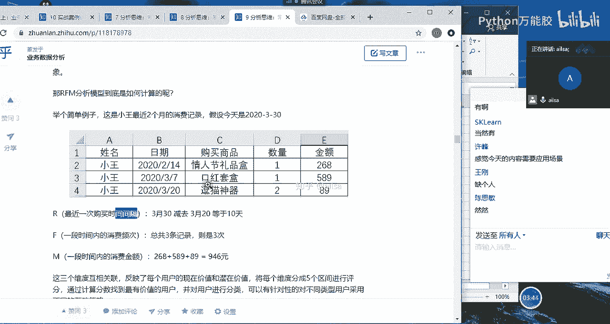

啊，这张图哎大家应该是能看清楚的哈啊，我们看一下就是。就是RFM作为我们的一个标准。如果说他的啊最近一次交易距离当前的时间哎比较近，或者是你比如说昨天买的这我们就称之为高啊。最近一次交费的频数啊。

就是他这个频率也比较高。那我们也如果次数比较多，我们也是说明它很高。然后最近一次交费的呃交易的金额啊也量也比较大，我们也是定义为高哈。那如果说三个都比较好的话，数据都比较好看的话。

那就说明它是我们的重要价值客户。对于这类客户而言，我们要呃我们要怎么着呢？他就是我们的优优质客户，我们需要保持。那我们可以呃精细化运营的方案，就是倾斜更多的资源啊，然后呃去VIP服务。

然后附加一些额外的销售啊，三高啊。对，就是三个指标都比较好的时候，他就是我们的我们就可以把它升级为我们的什么VIP啊，什么什么VVIP啊这样的一个呃好的客户去维护他，然后给大家制定一些个性化的服务啊。

这是我们的重要价值客户。那第二个就是如果他最近一次消费的一个嗯距离当前的时间还不错，但是他最近消费的次数有点少，但是它金额金额还在，说明他最近消费的次数少的话，那他就是我们需要深耕的啊。

或者是需要发展的客户，那我们该采取怎么样的一个操作呢，就是说我们要给他提供一些呃呃提供一些呃优惠或者是推荐其他商品。有可能他是他是对某类商品需求量比较大。但是这类商品，他要购买的一个频率比较低的时候。

我们可以给他推荐其他商品，让他的一个交易的呃交易的一个次数提高一下。这样的话，对于企业来说，我们也可以赚他的钱，对不对？啊，我们也可以赚他的钱，这就属于我们要深耕和发展的客户。

就是针对他交易的频率不高的时候，我们可以提供什么会员终诚计划。因为如果说这个指标一直低，一直低，低着低着，他就可能就不在我们的平台去购买产品了，有可能就去别的平台去购买了。

那那个时候他就是我们的流失客户了，对于这样一个消费金额比较大的客户而言，对于企业的一个损失还是很大的，所以我们一定要重点发展它。那第三个就是重要保持客户，重要保持客户。啊，我们看一下他的他的特点。

就是他距离啊最近一次交那个当前的一个时间呢就比较久远了啊，比较久远。但是他后面的呃交易的频率和他的交易金额也都比较高。这种的话就是需要换回。

因为他距离当前的一个消费的时间已经比较久远的那这种的话他慢慢的就有可能就会流失了。所以说我们要给他发短信，哎，我们给他发那个什么什么其他的一些提醒类短信，说，哎，我们这边搞活动，哎。

你要不要过来参与一下，让他注意的或者是让他重新回到他原来的一个平台上拉回来，就要换回啊，重要保持客户也叫重要换回客户。哎，那第四个就是重要挽留客户，这是什么呢？

就是他的距离当前的一个消费的时间的天数也比较久远，然后消费的频次也没那么高，但是它的金额还在。那说明哎这个客户就很有大有很大可能就要走了哈，比上面所有的客户都要危险。因为他也不消费了。

然后消费的频次也比较低。但是他是我们的呃就是很有价值的一些客户的时候，我们一定要啊就要就要重点去联系和拜访了，要提高我们的留存，不能让他跑了啊，我们可以看到这个前面四个都是很重要的什么么客户。

那他的是针对他的呃金额而言比较高，所以说他叫重要客户。接下来的话就是一般的客户的那你看一般的客户，他的。交易的金额都比较低一些。我们看一下，第一个就是一般价值客户。

就是他的交易的距离当前的时间呢还算呃还算比较近，然后也消费的频率比较高。但是它的金额就比较小，也就是说他就买的10块20块这种的话，那其实他是对于整个的一个产品或者是APP是认可的对吧？

只是说他没有他不具备这样的一个强有力的购买力。那我们就要给他推荐一些有高价值的产品，说明他有可能啊是我们的一个潜力用户啊，潜在用户，我们深度的去给他推荐一些比较好的产品啊，价值比较高的。

说明他也有可能会购买，因为他对我们的平台是认可的。他相信我们的产品啊是这样的啊，这是我们的潜力用户。那再要接着往下来说，如果说他距离当前的一个消费的天数比较近，但是其他的比较低的时候啊。

那这个时候我们就可以把它定义为是一般发展，也可以定义为是新客户就有可能是刚来，哎，刚来的话，你这个频率和你这个金额肯定都低。所以说对于新客户而言的话，我们就要给他一些诱导性。哎。

比如说提供一些呃免费试用，然后提高客户的一个兴趣，然后创建品牌的一个知名度啊，就是让他逐渐的去认可我们这个平台，就是新客户。然后第呃倒数第二个的话就是一般保持客户了。也就是说他的消费的频率啊是在的。

但是他的距离当前的一个时间，还有就是消费金额都比较低。那这种的话就明显就是他就是每一次过来啊呃消费呢也频率还可以，但是它的金额啊比较低。而且呢距离最近一次消费呢又也比较久远了。

那说明他整个的一个贡献价值啊不是太多啊啊我们呃我们可以给他进行什么呢？哎，我们如果想保留住这样的一个客户的话，可以采用积分制。因为呃积分制的话，就可以让用户啊不断的啊就是为了为了积积分。

然后不断的去消费，然后提高他整个的一个呃距离当前一次的一个消费的天数呃，用户的粘性啊，然后呢我们跟他就是打折促销啊，保持联系啊这样的一些活动，然后尽量不让他流失。那对于最后一个哈。

最后一个就是三啊三个维度都比较低啊，就是用户的粘性忠诚度和消费力都比较低的时候。那这个时候我们就就可以把它定义为是流失用户了。那对于流失呃流失用户而言，我们要去评估它是否有挽留的价值。如果有挽留的价值。

我们就采取啊相应的手段去给他进行挽留，比如说发短信啊啊，然后什么呃就是广告啊等等这些。等等这些，然后去给他挽回。如果说他挽回的成本还没有你你这个客户自身产生的价值大呢，那就会考虑啊就会考虑不去挽留了啊。

明白了吧？

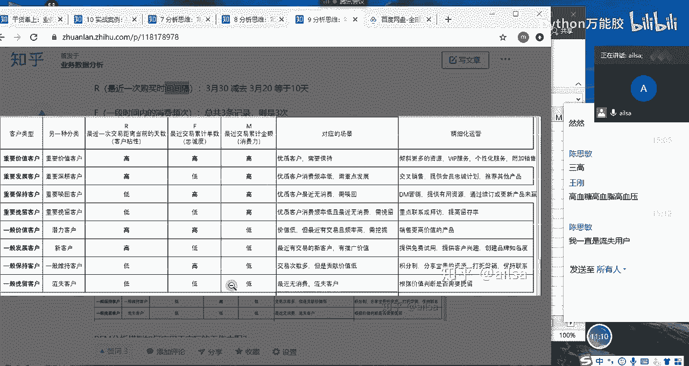

嗯啊这就是我们不同维度的一个客户精细化啊分层，然后采取不同的一个营销策略。那我们该怎么呃给他进行一个划分层次呢？啊，这边采用的方法有呃有两个哈啊，第一个就是评分法。

第二个就是呃将用户啊呃就是这就是根据均值进行个判断哈，这个我需要简单举一个例子哈。我需要简单举一个例子啊。啊，兄弟你好，你们俩干啥呢？啊，你比如说啊这有这有三个用户哈。张三啊。假设哈我给他直接写了哈。

我们有1个RFM。2。F。FM。然后呢，他这个张三的一个最近的一个时间间隔是呃，假设哈是10天啊，然后消费频率是3次，然后消费金额呢是300。哎，假设张三是这样的，然后李四。

李四呢最近一次时间间隔呢是呃18，然后呃他的消费的频率呢是5，然后他的金额呢啊金额是600啊。OK那是呃再有个网五哈。王五的话，他的最近一次的呃时间间隔是7啊，然后消费的频率呢是10啊。

然后他的金额呢假设是200。O哈。😊，那我们根据这个例子跟大家讲一下，我们该怎么去计算。哎，我们的整个的RFM分析模型哈，就是说我现在要把张三分到哪个层次上去，李四在哪个层次上，然后王五在哪个层次上啊。

那首先呢我们的第一种方法叫平分法。评分啊。这种就有一定的主观性哈，什么意思呢？你比如说现在这个的一个消费啊，时间间隔是从呃7到呃18不等。那我们就把它定义为。啊，0到10哈0到啊0到5吧，0到5啊。

我们定义为因为这个0到5之间，它相当于就是频率比较高，我们可以定义为5分啊，就是价值比较大嘛，然后是5到10，哎，我们定义为4分啊。歌着刷一下。哎。我们定义为4分啊，他这是文本类型。嗯，是5到10啊。

我们定义为是4分，然后10到15啊，我们定义为是3分啊。哎呀，什么情况？😔，他识别为他识别为日期了。嗯，是10-15啊，对应的是3分啊，然后15。15-20。定义的是两分啊。

假设哈假设我们是这么来定定义分的那我们就要去做判断这个张三在这里面得了多少分，张三是在十，那他又得了3分，对吧？然后。啊，然后李四是18，然后他又得了啊他又得了2分啊啊，然后王五是7，他又得了4分啊。

这样的话我们每一个呃分支给他计算出来。然后我们再按F哈F这边的一个评分，啊，假设还是跟这个一样哈，我们假设跟这个一样啊，就是0到55分啊，5到10是4分。那这个时候他这个是3，它得到的就是5分。

然后5他得到的也是5分。然后啊然后这个是1啊，他得到的是4分啊，这样的一个评分。然后我们再看金额啊，金额的话，我们就呃我们就给他乘以100就可以了。然后比如说0到500是5分，那这边就是5分。

然后这也是5分，然后这个是4分啊，我们打完分之后。嗯，打完分之后，我们可以对它进行一个呃计算或者加和，然后按照不同的分值，然后再进行一个分层就可以了。啊。我们在后面真正呃做到项目的时候会给大家讲，哎。

我该怎么使用这个RFM分析模型，这是其中一个方法。然后我再讲第二个方法，第二个方法就比较简单了。嗯，第二个方法是按均值法哈。均值法什么意思呢？我先把它的均值算出来，AV12AGE。啊。不在吗？

咱们人又少了吗？我把它均值算出来之后啊，跟大家说均值算出来之后，然后如果说这个值小于均值，我就记为零啊，这个均值小于均值，我就记为0。你看它是。嗯，因为它这个是呃频率哈，它这个频是时间间隔越小越好。

所以说这个是比它小的，我们就记为一啊啊，然后十八是比它大，我们就记为0啊。然后这个七比它小，我们就记为一。还没有来吗？顶哥。啊，然后这个以上这是6啊6这是频率啊，三次啊比6次要更少一些，所以就定义为0。

然后5也是0，然后十是1啊，然后我们的金额是366是平均那那300的话就是0啊，然后600就是啊1啊，200就是0然后我们根据这不同的100001和110，然后就在这里面做判断啊，什么判断呢？我的表呢？

啊。

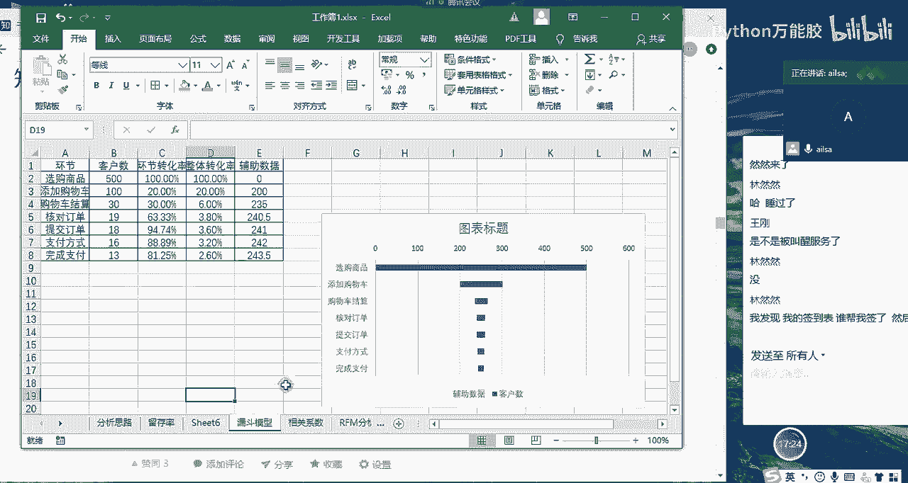

这里。啊，去做判断，就这里面的高啊，我们就定义为是一低的话就定义为是0。然后再进行一个逐个的判断。你比如说我们可以啊拿这个实际的例子，这个是100的话，那他就是100，那他就是我们的一般发展客户啊。

一般发展客户高低低嘛，对不对？然后再往下来走。001啊，001就是我们的重要挽留客户，也叫重要啊，重要挽留客户啊，就是这个啊水平的。然后再往下走是110。

那这个的话就是我们的啊110就是我们的潜力客户啊，这样子哈。

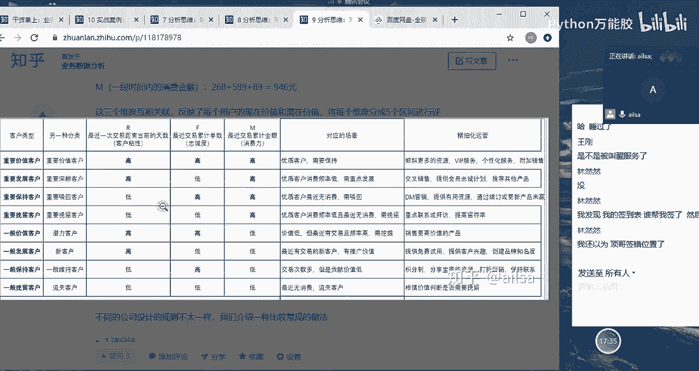

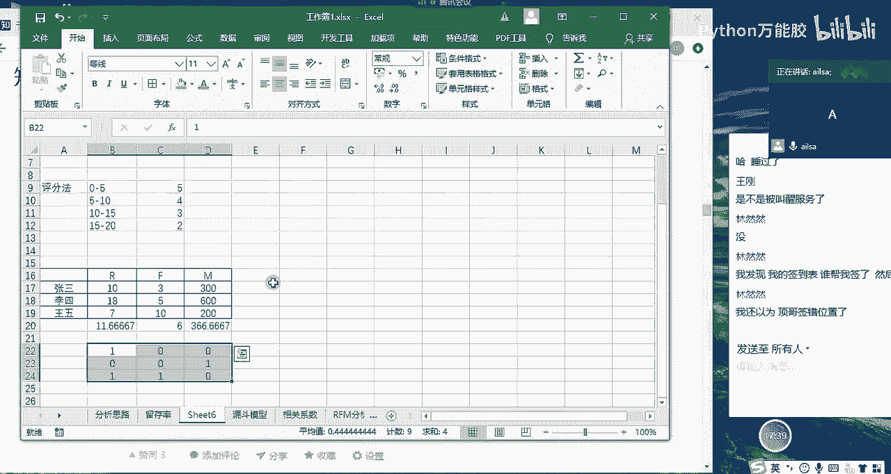

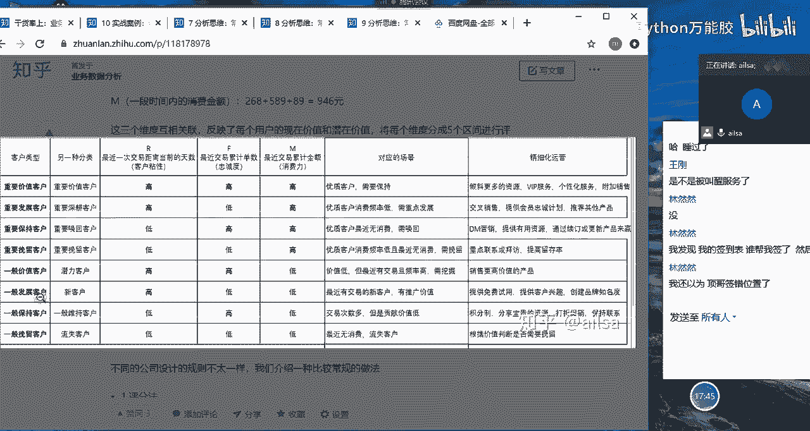

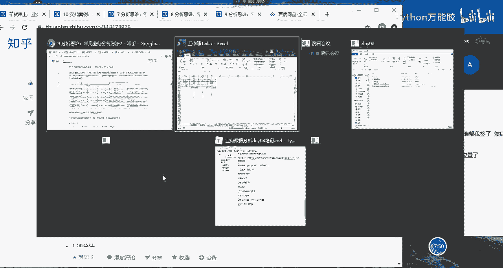

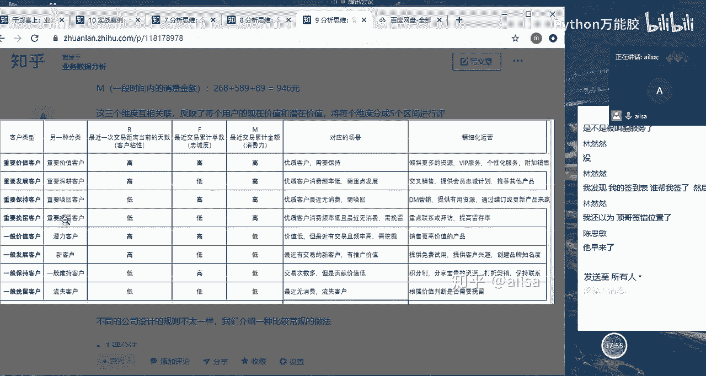

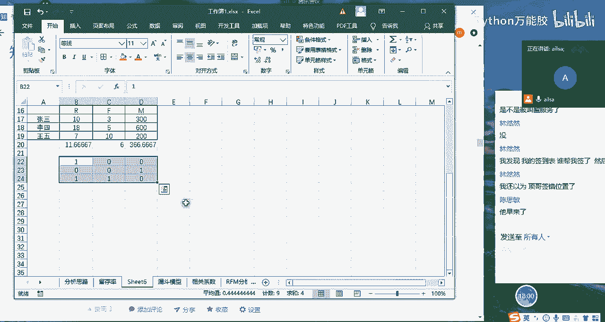

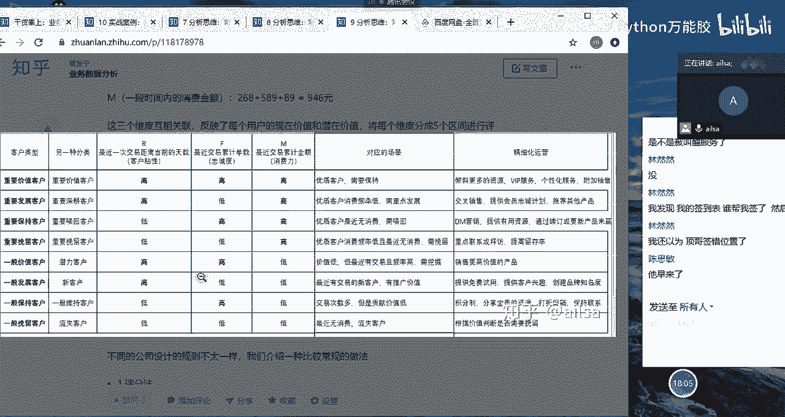

啊，根据这个标准，我们就可以计算。那在这里我只是给你给大家简单进行一个呃介绍。我们在后面项目当中会专门有实际的数据来计算我们的RFM分析模型。到时候你们再根据那个去实际的操作也是可以的，好吧。

大家对于RFM分析模型有听明白吗？同志们听明白给我扣个一，你们在聊啥，确定听明白了哈。嗯，它这个原理是比较简单的啊，原理是比较简单的。然后具体当中去计算的话，我们只要有数据。

你们就可以简单的去计算出来啊。这个可能呃也不是一个呃很就是很难的一个点。但是它的意义非常大哈，他也是一个经常常用的一个分析模型，通过这个模型，你能够呃清晰的了解到谁是你最好的客户。

你哪些客户正在流失的边缘，然后谁谁有可能转化为你更有利可图的客户，然后谁是你不需要关注的无价值的客户啊，还有就是哪些客户，你需要保留，谁是你的忠实的客户啊。

哪些客户可能呃对当前的一个营销动作做出回应等等这些你就可以明确的知道你客户目前处于哪些状态。然后哪些客户是什么样的水平。然后你针对不同的用户应该采取不同的营销手段，你达到你最呃呃就是你最以最小的成本。

然后获取。最大的收益这样的一个目的。O哈O那我们2FM2FM说完了哈，我断一下。

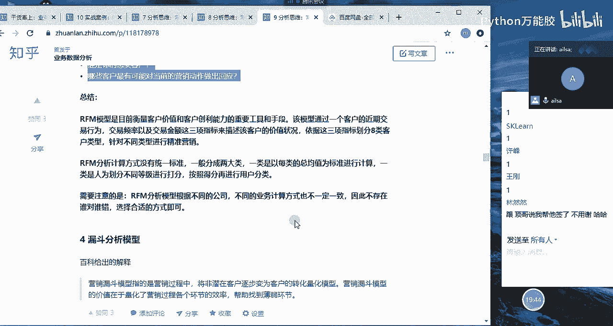