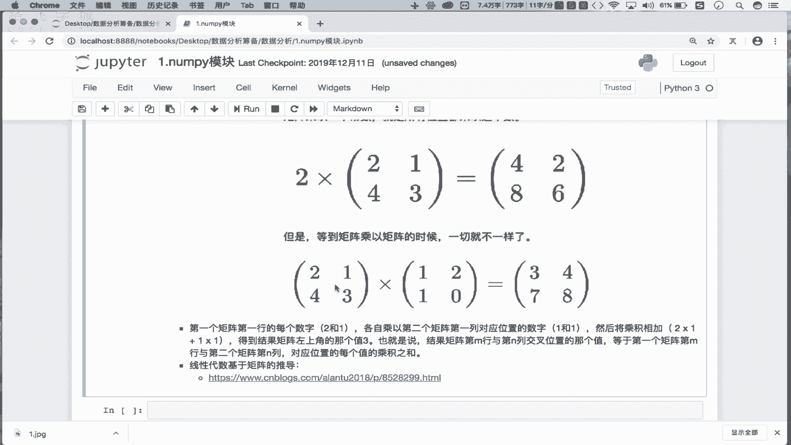
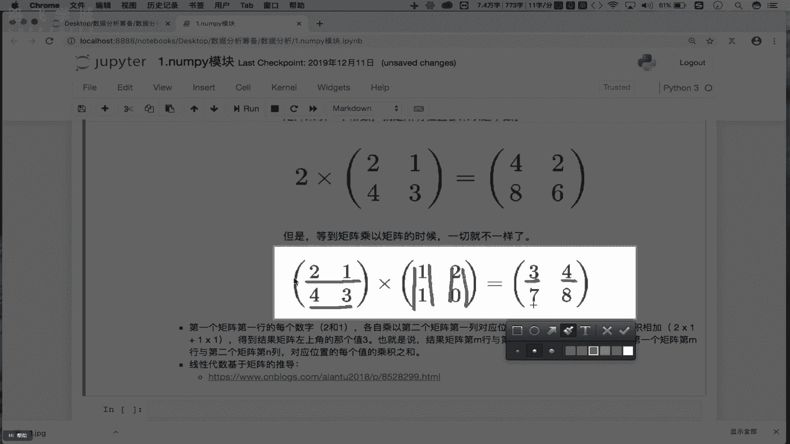
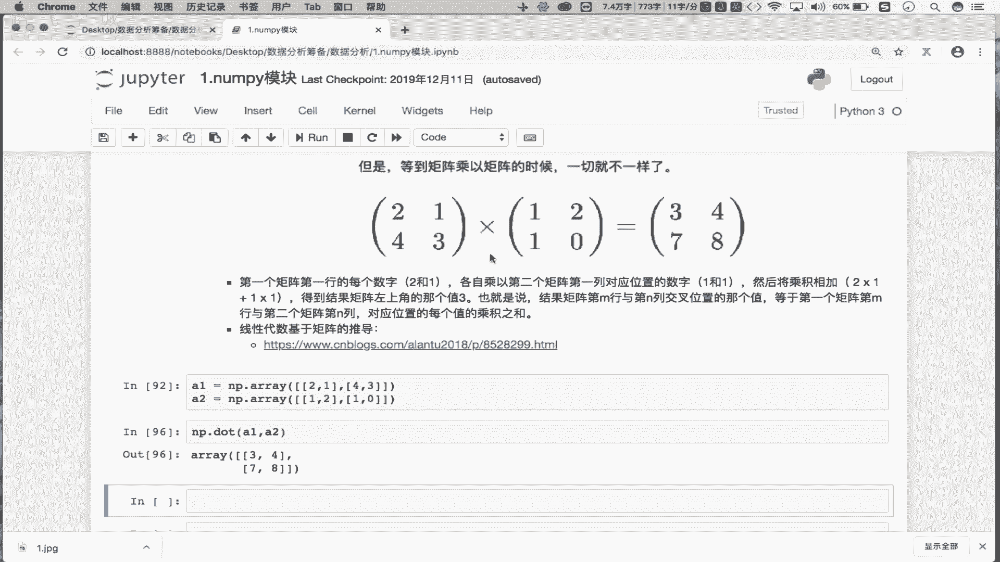
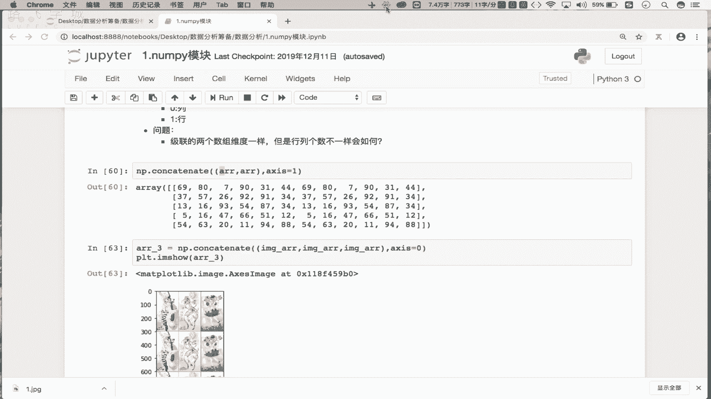

# 【附源码可运行】Python金融量化+股票交易，一口气学完，比刷剧还爽！2025最新Python金融分析与量化交易实战教程！AI人工智能丨数据分析丨数据挖掘 - P6：06 统计&聚合&矩阵操作 - python青云 - BV1GxqfYDEtC

咱们继续NAPPI模块的一个讲解，接下来我们来看一下，nip模块变形的一个操作啊，这块的行指的是我们所谓的行政吧，对不对，则是形状，你比如说现在我有一个error，那error目前它的形状是什么呢。

是不是一个二维的形状啊对吧，它是由这个五五行啊，五行六列组成的吧对吧，五行六列组成，那这块的话啊，我们先写一下，那现在原始的error啊，是一个五行啊，六列的二维数组吧是吧，二维数组。

那接下来我们可以对其进行一个形状的，一个变化啊，什么意思呢，比如说我现在就想将什么呢，将将，二维的什么呢，数组变形成一维的，OK吧，那变形指的是改变形状吧对吧，我们可以将一维变成多维。

也可以把多维变形成一维吧对吧，道理都是一样的，那我们就把二维变形成一维去试一下，怎么变形呢，error是原始数组吧，点一个什么呢，worship啊，V是不是重新制定形状啊，这里边看一下它就有一个什么的。

sheep的一个参数吧，shift是你重新制定好那个形状到底是什么吧，对吧好，那我们制定好的形状是啥呢，你看原始的二维啊，原始的二维我们需要给它变形一维，那甭管是你的维度是多少。

你最终所对应的数组的这容器，一定需要将所有的元素都进行一个盛放吧，那我们原始的二维数组一共是有五行，右列是563十个元素吧，那变形成一维的话，那是不是需要让一维，它需要有30个位置去存放这30个元素啊。

走看一下，那现在的话，我们就对其进行了一个变形的一个操作，现在这变形完了之后，返回的不就是一个一维的数组吗，看见了吗，是一维的数组啊，那这个一维数组它内部是不是有30个元素啊，对吧。

那我如果这把称改成31行不行，就是原始有三种元素，把它放到31的一个位置当中，行不行呢，不行，这只能是刚好不能多也不能少，OK吧，这个是一个基本的变形的一个操作，当然一维也可以变形，多维是吧。

比如说在这啊，现在我有一个error是error杠一，error杠一是不是一个一维的数组啊对吧，那接下来啊将一维变形成什么呢，多维吧，那怎么变呢，好error杠一点reshape是不是好。

我重新给它指定一形状吧是吧，可以是什么呢，可以是两行15列，可以吧，因为2×15是不算十啊，两行15列吧对吧，也可以是什么呢，可以是六行五列吧，对不对，可以任意去指定它的形状吧对吧。

只要最终你变形之后的容器，也是由30个元素组成即可吧，OK吧，这个是我们所谓的一个变形，那么这个变形在我们的机器学习当中会用到，那么在我们这个nip的基础当中啊，我们几乎是不会用到变形的。

那我们只需要有变知道有变形这样的操作即可，OK吧好下边呢有一个节点激连是啥意思呢，好我们这写一下啊，这个所谓机连的操作指的就是说将什么的，将，多个啊，将多个这个nip数组进行横向或者纵向的拼接。

那么来试一下什么叫拼接呢，你比如现在啊我这有一个什么呢，error它是不是一个五行六列的二维数组啊，对吧，那我们就可以对两个error，进行一个横向或纵向拼接。

比如说np d r concatenate，使用这样的函数进行节点啊，好它的参数一是一个什么是元组吧，这里边需要放即将进行基连的数组，比如说我就将error跟error进行一个节连吧。

那进行横向节连还是纵向节连呢，我们要知道横向记忆，那就是说拿这个LR数组，跟另一个L数组是行行放一起拼接啊，纵向是不是列个列放一起拼接啊，那么这个这个级别的方向怎么指定呢，X如果X等于零，好看一下。

走不进行了什么呢，是不是进行列跟列的拼接啊，听了吗，是不是第一个error，是不是第二个error，是不是列个列拼一起了对吧，那如果是一呢，是指定的方向是行啊，是不行行拼写啊，二是啥呢，二就报错了。

因为没有第二个轴项，OK吧，那零和一分别表示啥意思呢，零表示的是列列，是不是纵向的意思呀是吧，一是行是不是横向的意思啊，对不对，所以说我们这可以通过xis，进行这个基连方向的一个指令吧对吧。

是行行接点呢，还是列跟列接连的，OK吧啊，当然我们现在基点的是不是两个二维数组啊，那二维数组只能是有两个轴向了吧是吧，就像我们的二维坐标，是不是有X轴和Y轴两个轴向对吧，那如果是一个三维立体的空间的话。

是不是有三个轴下对吧，如果我们这接连的是两个三维的数组，那么意味着轴向就可以选择二了吧对吧，因为它有三种可能吧对吧，在想，那我们的二维数组能不能跟三维数组进行一个，横向或纵向的节点呢，不可以啊。

这儿的基点只能是同一维度进行节点操作OK吧，同一维度进行几点操作OK吧，然后大家也可以想一个问题，如果是同一维度进行横向或纵向的拼接，那如果拼接的这两个数组维度一样，那它的行跟列的个数不一样会怎么办呢。

各位自己去试一下，OK吧，自己试一下，所以在这我我会保留一个问题啊，问题也就是说这个吉连的两个数组维度一样啊，但是行列个数不一样，会如何，各位自己去试啊，比如说有一个数组是五行三列是吧。

另一个数组是五行四列，那么这两个数组是不列不一样啊，那能继连吗对吧，各位自己去试一下啊，自己试一下好，那这块几点有什么用呢，比如说几点我们可以做一个什么呢，做一个三宫格，就三张图片可以给他拼一起对吧。

你想三张图片拼一起的话，可以横着拼一起，也可以竖着拼写吧，那到底怎么拼呢，这咱们去试一下，比如说在这啊，我们看一下image error，是不是咱们之前所加载的那个那个那个。

卡通图片的一个数组数据啊对吧，那在这的话我们就可以这样，你看NP点contact at cat好，在这的话我们就把什么。

把image array跟image array跟image array进行一个什么呢，比如说我们进行一个这个横向的拼接吧对吧，那这块返回的是拼接之后的大的数组啊，你看在前边的案例当中。

我们进行积累之后返回的是一个新的数组吧，对吧好，我们叫做error杠三，OK吧，那现在我们就来把PLRT点m show，进行error杠三的一个显示走，你显示的是三张图片拼一起了对吧。

因为你看这是一张图片，两张图片数据，三张图片数据是以轴向为一的，就是拼写啊对吧，那如果是零呢，不竖着拼写啊，对不对，你能做三宫格，能不能做九宫格呢，是不是也可以啊对吧，也是OK的啊。

那么这个是我们的一个IP数组基点，所对应的一个操作，OK吧好那么基连完事之后呢，下边来看一下我们常用的聚合操作啊，聚合操作，那从聚合操作开始，我们就需要啊，需要去学习我们nip数组当中。

所给我们封装好的，一些基于数值运算的相关的操作，你比如说现在我有一个什么呢，原始的数组是error，它是一个五行六列的数组吧对吧，那如果哈我在这点一个什么呢，SAM干嘛使啊。

走不求所有的数组元素之和呀对吧，那sum当中还有一个xis轴向的意思吧是吧，那如果xis等于一个理应啥意思，是不计算出零，是不是列呀，是不是计算出二维数组每一列的和啊，那一呢不是计算出每一行的和啊。

这是sum吧，那后边的min max是不都是一样的呀，是不求最大值，最小值和求平均值啊，我可以求所有元素的最大值，最小值平均值，也可以求某一行或某一列，它的最大值最小值平均值吧对吧。

SAM会用到后边的三个是不是都会用了，OK吧，比如在这求下最大值吧，error点r max找不求出所有元素的最大值，OK吧，那我能不能求出每一行的最大值呢，走求出了每一行的最大值啊，只需要指定一下轴向。

是不是就可以了，OK吧好这是我们所常用的聚合操作，接下来是常用的数学函数啊，那这些常用的数学函数有哪些呢，比如说在这啊，error还是我们的一个五行六列，五行六列的一个二维数组吧，对吧好。

那么在这的话我们可以点一个什么呢，点一个sin求一下什么呢，求一下我们的这个正弦NP点sin，OK吧，调下NP点三，这传啥呢，我们在这呢需要给它传入一个传入一个数组吧，比如传入一个error走。

看这返回的是说，对我们数组当中的每一个数组元素，进行了一个正弦的计算，是不是包括有我们的余弦和co和这个tan，是不是都有啊，对不对，都有啊，然后呢当然你看这块有SN，除了SN之外的话，还有什么呢。

还有我们的这个，还有这个还有什么，还有这个SC，对不对啊，SC啊是这sin c求的是我们的反射角函数啊，对吧好，都可以自己的去试一下啊，试一下，我这不放error，比如放一个22。5，是不是也可以啊。

对吧也可以啊，好然后呢，接下来还有一个是什么叫做around，Around，是说可以返回指定数字四舍五入的结果对吧，试一下啊，看一下NP点，好比如说这我传入一个什么，传入一个3。14，OK吧，好走执行。

你看返回的值是不是三，是不是进行了四舍五入啊，那如果是一个3。84呢，返回的不就是四了吗，对吧好，那他还有一个参数叫做什么，叫做DC disdecimals对吧。

Disc abs disdecimals，看它可以等于零，也可以等于一，OK吧，那这个零跟一啥意思呢，如果是零的话，那么就意味着我们舍弃小数的位数对吧，那如果是负数的话。

那就是说它可以将整数进行四舍五入，到小数点左侧的一个指定位置吧对吧，你各位啊也可以自己在这传入一个什么呢，正数和负数去试一下，比如我这传入一个什么，传入一个零，传入个一吧对吧，是3。8这样的结果吧。

乘以二呢，3。84吧对吧，那传入一个一呢，返回是0。0吧，就是基于我们的整数进行的四舍五入吧，OK吧，好自己呢去适当的理解一下就可以了啊，好下边是常用的统计数，这个常用的统计函数。

我们重点就来看一下咱们的标准差和方差，OK吧，看一下标准差和方差，那剩下的就不是特别重要了，OK吧，你看比如说前面有一个叫做AME跟max，它就可以返回我们数组当中指定轴向的最大值，最小值。

那这个admin跟a max是跟我们的上边的聚合当中的，max跟min操作是一样的呀，对吧一样的啊，那么这个PDP啊，它可以返回我们数组当中的最大值，跟最小值的一个差，OK吧，试一下PDP吧。

NP点NP点叫做什么呢，PDP是不是啊，我们来看一下啊，PDP啊，PTP好，这我们传入一个error走，看这儿我指定一下轴向吧，它就可以返回我们每一列最大值，最小值的一个差，OK吧好重点在这。

我们看的是什么呢，看的是我们的方差跟我们的标准差，OK吧，那首先看一下我们的标准差，那各位你知不知道什么叫标准差呢，所谓的标准差，它指的是需要计算一组数据，平均值的一个什么呢，分散程度的度量啊对吧。

那比如说咱们举个例子哈，比如说那我们如果一个班是吧，期末考试成绩出来了，咱们能不能对期末考试成绩的语文成绩，进行一个标准上的计算呢，如果标准差比较大，说明咱们班同学的语文成绩有的人考的特别高。

有的人考的特别低，是不是对吧，那么这个高低只得就是我们的这个语文成绩，对应的什么的平均值分散程度的一种度量，是不是，那么这个标准差它的计算公式是什么呢，看一下啊，这个是它标准差的一个计算公式，OK吧。

那在这的话我们需要先让我们的什么呢，X减去X点min x是一组数对吧，一组数减去这组数当中的均值，OK吧，然后再进行一个均值计算，再平方再开根号，这个就是我们标准差它的一个计算公式。

那最终这个公式返回的结果，指的就是X对应这组数据平均值，分散程度的一种度量，OK吧，咱们去试一下吧，看现在我这有个array是不是array啊，假如这个array这是我们的一组数据呗，对吧。

一组数据啊啊这样吧，array1啊，这是一组数据，我们想计算这组数据的一个标准差，怎么算呢，D二一个STD即可走，看这返回的R6，就是我们这组数据的标准差还是比较大的，是不是OK吧，标准差啊。

那标准差你知道了之后，接下来看方差，方差跟标准差其实表示的含义是一样的，只不过啊，只不过你看我们的标准差在这开了个根号，是不是我们的方差只有后边的部分，没有开根号的部分，OK吧。

所以说我们的这个什么的标准差去除根号，指的就是我们的方差也是一样的，error1先拿到一组值是不是好，我在这的话就不STT的点一个什么呢，点一个冒，VR啊看一下，这就是我们的方差。

你会发现711不就是26的一个平方吗，对不对，OK吧，这个是我们的方差，跟我们所谓的一个标准差对应的一个衡量计算，OK吧，所以说标准差和方差是比较重要的，各位一定要懂什么意思，OK吧。

在我们的数学统计当中，我们的标准差和方差是最常使用的工具好，那么最后一块内容就是我们的一个矩阵啊，就是我们矩阵那nip模块当中，我们重点要掌握矩阵的乘法运算即可啊，掌握矩阵的乘法运算就可以了，OK吧。

那首先什么是矩阵呢，对吧，这个矩阵在我们的线性代数当中，是不是是不是一定是基于咱们的矩阵，进行了一个实现啊对吧，所以说这块啊，我就不再对矩阵进行一个系统介绍了，OK吧，各位如果懂的话啊，你就接着往下听。

如果矩阵它的一个含义或概念不懂的话，你只需要掌握接下来我讲的矩阵，乘法怎么运算就可以了，OK吧我们首先在这的话，我们可以干什么呢，可以在这呢啊，使用我们的这个啊对应的工具，去创建一个单位矩阵，可以吧。

我们先创建一个矩阵啊，好那这块的话我们的矩阵怎么创建呢，可以NP点一个什么呢，Might，Matlab，NP点MATLABDI，真题啊，这样啊这样吧，NP点S吧，你选他吧，这个比较简单啊。

比如在这啊看一下，我给他传入一个什么呢，比如说我传入一个传出一个六，看一下，那现在这返回的就是一个标准的单位矩阵，OK吧，我们就不用它了啊，我们这就换一个吧，用这个I啊。

EYE可以返回一个标准的单位矩阵，OK吧，单位这个单位矩阵就是说我们的行列是一样的，包括对角线都是一，其他都是零，他是一个标准的这个单位矩阵啊，那么当矩阵你看起来，他是不是一个这个二维的一个数组啊对吧。

所以说我们的矩阵它就是一个表格，表格就是一个这个二维的数组，是不是OK吧，那我们在这就创建好了一个矩阵啊，创建好了一个二维数组，那接下来矩阵的转置可以用下点T转制，啥意思呢，你看一下转制。

就是说我们可以把我们的行变成列列，变成行就转制，OK吧，那怎么转制呢，在这的话看一下，在这我就点一个什么呢，点一个大T即可看一下，现在你看这返回的是说把行列进行了一个翻转，啊对吧，把行列进行反转。

你看在这把行列进行反转，好像效果不明显，是不是我们换一个啊，比如说我在这有一个np error吧，error error的话是原始的数据吧，是不是69是第一个呀，80是不是第二个元素D1个T走。

看行变成列列就变成了行，这个叫转制，OK吧，转制啊好，那么这个转制也是一个常用的一个操作，OK吧，它不光能够用在我们的组当中，也可以用在咱们的数组里边吧对吧，那这个矩阵乘法到底是怎么算的。

首先咱们这个矩阵的加法啊，加法跟我们的一个常数乘以矩阵咱们就不说了，这个比较简单，看这个图就可以了，重点是说两个矩阵进行相乘，它的一个含义是什么，OK吧，那两个矩阵啊，这这块看一下两个矩阵如果相同的话。

最终他得到的结果是啥呢，比如说这有一个什么呢，2143还有一个什么呢，1210这两个矩阵如果进行相乘的话，得到的结果是3478，怎么算的呢对吧。

它的算法是这样的啊，是这样的，首先让第一个矩阵的第一行OK吧，乘以第二个矩阵的第一列，就是让2×1加上什么呢，1×1是不是得到的是三对吧，就得到了三这样的值了吧对吧，再怎么做呢。

再让我们的第一个矩阵的第二行，乘以第二个矩阵的第二列吧对吧，相乘相加就是4×2加上3×0，最终得到的一个值，这样啊，这样这样，你看我们一开始说第一行是不是乘以第一列啊，是吧。

再让我们的第一行乘以我们第二列啊，这样第一行乘以第二列啊，就是2×2加上1×08，是不是我们的四啊，多是四，OK吧，那就说第一行啊，第一个矩阵，第一行，依次乘了第二个矩阵的第一列和第二列了吧。

那接下来呢接下来就是说我们的第一个矩阵，第二行依次要乘以，第二个矩阵的第一列跟第二列吧，线性增加是不是得到几，是不是4×1加上3×1，是不是得到七对吧，然后的话就是3×2加上这个3×0。

得到我们的一个八对吧，那这样的话就进行了一个线程下，得到了一个结果吧，对不对，好在这啊，在这首先是我们的第一行乘以第一列是吧，然后第一行是乘第二列，是不是得到三次这两个值，第二行乘以第一列。

第二行乘以第二列，是不是得到七八这两个值对吧，这可能写错了啊。

不是七八，这可能写错了，OK吧，这个图啊大概是这样的意思，那么咱们接下来去算一下子啊，算一下子，比如说在这啊，我们需要有两个矩阵啊，好A1等于A等于一个NP点二，OK吧好这里边我们就放谁呢。

就放我们的这个跟上图一样，放一个二一和一个四三，可以吧，好A2就是NP点array好，这里边我们就放一二，和10OK吧，那现在我们的A1跟A2是不是都有了啊，我看这是不是少个括号啊，嗯这是一个括号啊。

写错了，OK啊看一下A1是不是它对吧，A2是不是它对吧好，那么现在我们的A1A2都有了，那么我们让A1乘以我们A2，看一下结果是什么啊，那这个矩阵相乘的话，咱们用的是什么。

用的是我们的这个dot这样的一个方法啊，那这块就是NP点dot好，这传入我们的A1跟A2就可以了，A1和A2好走，返回的结果是不是3478呀对吧，那现在我们就拿到了这个矩阵相乘，对应的一个结果了吧对吧。

矩形上对的结果啊，在这我们再看一下啊，怎么算的呢，是不是第一行乘以第一列，2×1加上1×1啊，是不是得到的是个三，然后第一行乘以第二个矩阵，第二列是吧，2×2是四吧对吧，然后的话然后4×1是零。

对不对啊，好，那这个矩阵乘法就先到这里啊，先到这里，这会儿啊第一行再说一下，第一行乘以第一列是不是2×1，加上1×1，是不是我们的三对吧，第一行是不是乘以第二列，2×2加上1×0，是不是四啊对吧。

然后第二行是不是乘以第一列是吧，4×1加上3×1是不是七啊，对吧好，第一行是不是乘第二列是不是四乘以我们的二，然后加上3×0。

是不是我们八对吧，所以说这个再说一下啊，刚才我说的有点乱啊，再说一下，那这一块的话就是什么，就是我们的第一行，第一行啊乘以第一列是吧，加上第一行乘以第一行，乘以第一列的值是不是三对吧，三啊。

然后第一行乘以第二列的值是2×2，加上1×02，是不是四对吧，好，然后第二行是不是乘以第二行，是不是乘以这第一行对吧，然后这块是4×1，加上一个3×1，是不是七对吧，然后的话是不是这一行乘以第二列是吧。

就是4×2加上我们的这个3×0，是不是我们八对吧。

这个就是我们所谓矩阵的一个乘法，OK吧，那么至此的话咱们整个的这个NIPPP模块啊，到这就已经结束了，所以说在nap模块当中重点有这么几个，第一个是我们的矩阵乘法，你要知道它所表示的含义是什么。

因为矩阵乘法在我们的机器学习当中，会经常会被用到啊，第二个重点就是说我们的这个什么呢，我们的这个nip数组它的常用的统计函数，包括它的聚合函数，你也知道它有哪些，OK吧。

第三点就是说我们的这个nip模块，它的一个索引跟切片的操作，你也要知道它的一个常规的用法是怎样的，OK吧，这个就是我们整个nip模块，它对应的一些个重点，OK吧好那么至此的话。

咱们nip模块的一个讲解就先到这里啊。

