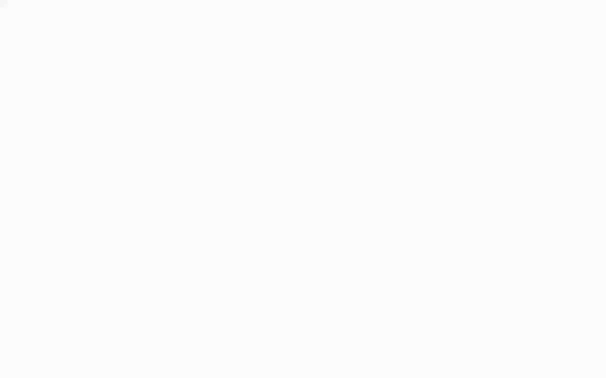
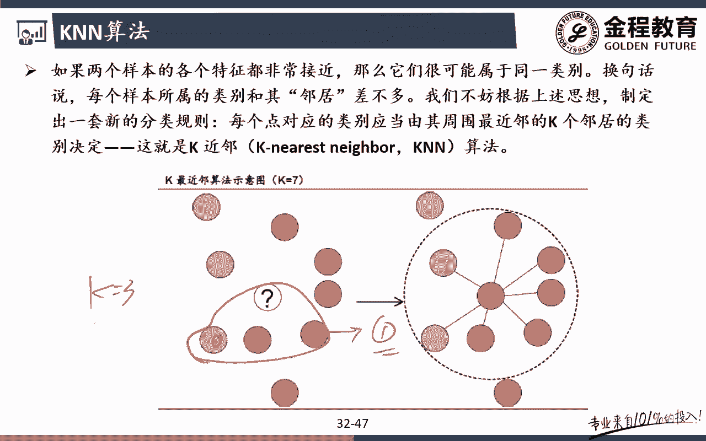
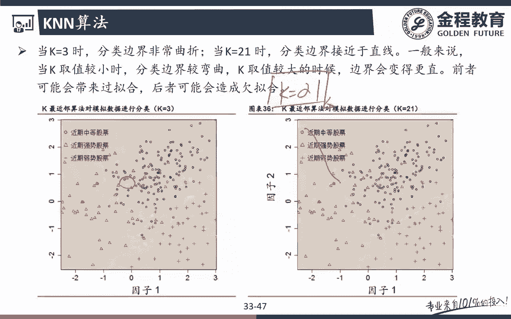

# 2024年金融大神老师讲解量化金融分析师.AQF—量化金融专业知识与实务 - P10：《人工智能与机器学习策略》04.机器学习算法原理_4KNN算法原理 - 量化沿前 - BV1oU411U7QM

好，那么接下来的话呢，我们来跟大家讲一个非常简单的一个算法，录了，前面应该把他跟角色书放在一起讲对吧，这个单独作为一个视频，可能时间就特别短，可能两三句话就能说明白的一个算法，就是为数不多的。

这个不用让我们特别纠结的一个算法对吧，因为它太简单了，那么这个算法的话呢，我们把它叫做KN算法，叫做K近零对吧，或者叫做什么K最近邻啊，whatever无所谓，KNN的话代表的就是k nearest。

neighborhood对吧，neighborhood就是我要判断，你注意km算法的话呢，它其实也种也是一个分类问题的一个算法啊，它指的就是呃他的想法很简单，就怎么样，我要判断你一个新的数据呃。

到底是呃它的label到底是零还是一呢，很简单，我就在我这个周围找什么，离我最近的这几个数字，或者离我最近的这几个邻居，看看我的邻居都是哪一个类型的对吧，如果说我的类邻居都是长的。

那么呃我这周的那个label的判断也是这样的，如果说我的额label是跌的话呢，那么我最，那么我这里的最终的那个标签label也是D的，能理解意思吧，哎那么这个K近邻啊。

这个KNN其实它有一个非常重要的一个参数，就是这个参数什么哎，就是这个参数K，也就是说这个参K的这个参数就决定了，我看的是呃我的邻居，我要看几个邻居对吧，那么最呃比如说我这里的邻居。

你可以看三个K额K等于三，或者说你可以K1等于四，K等于五，K等于六，K等于七都可以，当然要看啊，如果你的分类如果只有三类的话呢，呃又要看你有几类的分类啊，如果我的分类有两个。

那么你就K就不能等于二对吧，因为你的分类就两个，你要K等于二呃，你让K等于二的话，那你就分不出来了啊，所以呢在这个里面嗯这个K的选择的话呢，相对来说嗯，你也可以通过一些像我们之前所说的那个嗯。

参数是额参数优化的一些方法对吧，哎可以去设定这个参数啊，但是有些时候有些分类的问题的时候，比如说我们这里的两分类，两分类的话，那你就不能让K等于二，你必须得是K等于三对吧，比如说我们来举个例子啊。

在我们这个里面额给大家看到的是K等于七，也就是说呃在这个里面原来的数据集啊，我的这里feature4，它的label是什么，我是不是都已经有标好了，对吧好，那么现在有一个新的数据进来了，就是这个问号。

那么对于我来说，我要判断一下，我这个问号到底是属于哪一个label呢，那很简单，因为我这里设定的这个K是不是等于七啊，所以我要看我周围七个，那么看我周围离我最近的这七个。

是不是就是我这里的neighbor，没问题吧，好那么看了我周围的这七个里面，我们发现因为你是两分类啊，你这里的是奇数对吧好，那么这个时候我们就会发现怎么样，额这个七个里面两个是呃，比如说两个是零。

那么剩下五个都是什么一嗯，或者说两个是跌，剩下五个都是涨，所以我最终的判断这一个我也应该是什么涨，是这意思吧，哎这里呢就是我这里的K近邻哎，简单吧，这个实在找不到另外一个算法。

比这个算法更简单的一个算法，对吧好，那么在这个里面啊，如果呃就只跟大家提一点啊，那么这个kn的话呢，我们后面会带着大家去跑一下呃，在我们的数据集上，在我们扣的实现的时候也是有的啊。

那么在这个里面值得大家提一提醒一点，比如说我这里是两分类的方法的话呢，你就不能让K等于二提白是吧，K等于二，我要比如说这个新新的数据进来了，我要怎么看邻居只看几个啊，哎只看两个邻居，只看两个邻居的话呢。

我们可能会发现呃，离我最近的这两个邻居可能是这两个，或者可能是这两个YY啊，反正这两个可能是离我嗯最近的这两个邻居，对吧，好一个是零，一个是一，那最终我是不是没法判断了，所以对我们来说。

如果是两分类的话，你得奇数啊，比如说我这里K等于三啊，离我最近的三个，那就OK了，离我最近的三个是不是可能就是这三个啊，那么这三个的话呢对我们来说这是011，我们就可以通过少数服从多数的一个问题。

我们就可以判断出来，这是我们的一个什么一问题吧。

哎好那么在我们这个例子里面，我们也跟大家去看了啊，另外一个点KN的算法里面跟大家讲的一点，就是在于如果你K等于三的话，非常小的话呢，我们这最终分类出来的边界会非常曲折啊，很有可能。

很有可能会带来这样一个过拟合的一个情况，因为什么我只看最最离我最近的三个对吧，哎那么大家可以看到，这里是K等于三的这样一个近邻，还有一个呢呃这个里面是K等于21的，也就是说一个是看我最近的三个。

还有一个呢是看我最近20一个，我判断我自己是属于哪一个类型的股票，没问题吧，哎那么在这个里面是我们看到什么中期呃，近期中等强势强势和近期弱势的这些股票好，那对我们来说怎么去画。

比如说我现在有一个新的一个数据，我怎么判断是属于我哪个类型的呢，所以动漫说在这个里面，我们有这样三个两个参数可以去设定，对吧好，那么会会发现如果我只看最近三个的话，那么对我们来说，我们会发现它的怎么样。

它的边界是不是相对来说是非常非常扭曲的，而且在当中你看在当中的话呢，也会有一些呃这种细小的一个点在里面对吧好，但是如果说我这里的额K，如果是说是等于21的话呢，那么看我附近20一个我的一个邻居。

那这个时候我们会发现。

他可能是不是已经相对来说，它的边界就比较平滑对吧，哎所以比较平滑的这种的话呢，那我们认为你可能会发生一个叫做欠拟合，但是呢如果我这里的K特别小的话呢，我们认为你更有可能发生的是这样的一个。

什么过拟合的一个情况，哎好那么KN的话呢，我们就讲到这里啊，很简单啊，那么我们就不多说了。

