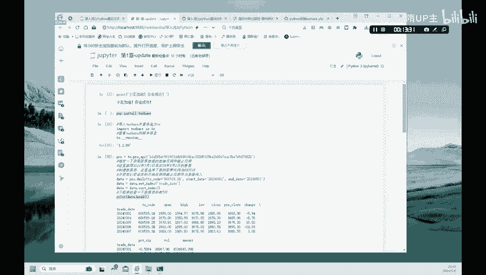

# 1.【金融科技】快速掌握Python交易的方法 - P1 - 隋UP主 - BV19T421k7Rj

大家好，我们来学习一下Python量化，我们使用的教材是这本深入浅出，Python量化交易实战是由清华大学出版社出版的。

好我们看一下这本书它的一个结构目录，这本书呢它主要是从这个一个小瓦的故事开始，他是从零开始，一步一步的向大家介绍一下这个Python的一些用法，以及如何用Python进行一些简单的策略的一些应用。

然后呢我们还会用到，据宽交易平台来进行进一步的这种量化和回测，好，我们这节课用的是这个Python的一个，网络的一个版本啊，我们看一下这个网络的版本，notebook是怎么样来操作的，首先呢我们在这里。

这样进入这样的一个界面，然后呢我们找到upload，这个upload，我们可以上传在本地的这个，我们的这个Python的一些文件啊，第一章第二章啊，一直到第14章，我们可以上传好。

这里呢我们还可以使用啊，这个python3的一个啊解释器啊，好我们看一下，我们进到第一章，我们第一章呢主要就是让大家熟悉一下，回顾一下这个Python语言。

首先呢第一条命令呢这个就和hello world差不多啊，这里呢print一个小瓦，加油，你会成功啊，小瓦就是这本书的一个主人公，就是小瓦学习量化一定会成功的，好我们呢第一章呢使用的这种数据库呢。

也是使用的这种to share这个数据库，好在这本书原来的版本，因为这本书呢它出版日期呢是2021年，它使用的前三章使用的数据呢，书中使用的数据呢是用的国外的雅虎数据。

但是雅虎数据呢啊在国内已经不能够使用了，所以我们会把代码替换为这个，to share的一个数据库啊，to share数据库呢嗯在国内使用的非常广泛，我在另一门课里面也用到了这个to share数据库啊。

所以大家如果不太熟悉to share数据的同学啊，可以看我另一个视频好，这里呢这几行代码是说一下导入这个to share啊，这个然后查看一下to share这个版本，如果大家地没有。

就是在电脑中从来没有安装过to share这个的话，我们要首先对这个to share进行一个安装好，我们看一下这条命令，Pip install to share。

这个呢就是首次安装to share数据库，然后下面import这个to share as ts，然后ts的version它的版本号我们可以在这里显示啊，这里就说明你to share数据库已经安装成功。

好，to share数据库安装成功之后呢，大家就可以下载数据啊，好我们这本书呢他在提供了免费的这种程序，还有这种学习视频啊，大家呢就是在书的背后有这二维码，大家扫这个扫码就可以下载他这种程序啊。

但是这个程序呢就是可能运行还有一些问题啊，稍微有一些问题的话，大家可以看一下我这个视频，我重新的就是来改了一下这个这个to share，这个数据的这种使用的链接口嗯，大家呢可以用这种pro这种形式。

这是to share，目前就是主要的下载数据的一个端口啊，好这个pro等于TS点pro API，这个API下面这个是大家呢可以自己注册一个，注册一个这个图share数据库。

就会得到这样的一个API的一个一个接口，这是我自己的，大家可以自自己下，自己使用自己的这种这个API的这个接口，这个接口的话啊，它大家可以这个问客服寻求一定的这种啊，这种积分，有了积分之后呢。

大家就可以使用这种数据，好我们开始下载数据，数据呢data我们下载这样的一个数据，什么样的数据呢，pro就是前面这个数据库的连接连接，我们下载的是股票的一个每天daily的一个数据啊，每天的一个数据。

然后这个ts code呢就是股票的一个代码，这个代码是什么呢，啊600519SH啊，我们我之前的另一门课啊会用到这个，我们也以茅台公司为例啊，这个第一章呢我们也以这个茅台公司为例，来简单的看一下。

回顾一下我们之前学过的内容，好，这个我们设定一个数据的起止时间，是2024年3月1号，到2024年5月1号啊，这样的一个茅台公司他股票的一个起止时间，然后呢我们把这个trade trade date。

就是把这个日期啊变成一个索引啊，我们Python的一个索引方式呢，它是从01234这样排列的，我们不用那样的数字的方式，我们用时间作为时间序列作为它的一个索引好，然后我们排这个对这种索引进行一个排序。

我们是这个从日期呢是从3月啊，往5月排啊，如果大家如果就是不排序的话，有可能他是从5月啊，4月3月二月这样排排下来好好，我们进行一个排序之后呢，然后我们就可以得到啊，这个点击运行大家可以看一下。

我们就可以得到下面这样的一个数据啊，我们只提取前五项的一个这个数据啊，只提取前五项，这里有什么t s code，然后呃这个茅台股票的代码，还有它开盘价最高价收盘价啊，这个最低价收盘价等等啊。

这些成交量啊等等交易的这个总的一个数额啊，都会在这里呈现好，我们下面做一个什么，下面就来做一个，做一个股票的一个计算，每日股价的一个变化情况，用这样的一个啊difference的一个函数。

我们就是啊data d i f f这个data d i f f，大家可以看一下这一列最后一列，这个数据最后一列，这就是我们新生成的一个，这个每日股价的一个变化，大家可以看一下他什么意思。

好比说第第二行负的8。76，它是怎么算出来的，就是用啊，2024年3月4号的一个收盘价来啊，减去2024年3月1号的一个收盘价，我们就得到了一个第一个difference是吧。

这就是然后依次向下都是这样来计算是吧啊，用5号减去4号，6号减去5号，这样获得的一列就是这个DIFF的值，然后我们把它再打印出来好，就得到这样的一个表格好，有了这样的一个表格之后呢，我们继续来做。

我们呢做量化交易呢主要是来找一个交易信号，所以说呢我们根据这个difference这一列，然后来判断一下他什么时候可以交易，什么时候买入，什么时候卖出啊，这个时间点呢它就是一个信号好。

我们这首先呢定义这个信号的，它是怎么样定义的，这个signal这个这一列是怎么样定义的是吧，就是在这个difference啊，大于零的话是吧，就是difference这一这一列，如果它大于零的话。

我们呢就把它在signal这个地方标为一，如果它是负值的话，小于零的话，还有我们这个signal就定义为零好，如果它是一个空值的话，我们也赋值它为一个零，好吧。

这就是这个定义一个信交易信号signal好，有了这个signal信号的话，我们呢就可以来画一个图啊，画一个什么样的图呢，就是用之前我们学过的啊。

matt plot lab这个函数来画一个这样的一个折线图，好这个折线图大家可以看一下啊，Import，先把这个这个折线图的一个画图的工具给导入，然后呢我们设置画布是10×5的一个画布啊。

画布的一个大小是这个画布的大小，然后呢我们开始画这个折线图，好这个折线图，首先我们画的第一个折线图呢，就是绘制这个根据这个收盘价，这个close来绘制一个这样的一个折线图，然后就是这个黑色这条线。

就是这条命令啊画出来的，然后呢我们第二要标出啊，如果当天股价上涨就标标出啊，卖出信号用倒三角，就是这个绿色的是吧，就是说如果这个signal这个信号为一的时候，信号为一的时候，我们那就标一个什么马克。

一个这个向下的一个绿色的这样的一个箭头啊，一个倒三角好，如果当天的这种股价这个下跌，股价下跌啊，就是这个signal为零的时候啊，这个difference是负的是吧，的时候signal为零的时候。

我们呢就用正三角这个红色来标出啊，它就是红色的向上的三角就是一个买入的信号，然后这个倒三角呢向下，它就是一个卖出的一个信号，然后呢然后再设置一下这个X轴，X轴的这种区间，这个啊3月1号，3月19号。

4月8号，4月24号，这四条线呢就是分别就是零十二二十四，三十六四十八啊，这个竖线就是这样的设设定好的，然后呢我们就可以来展示这个图片啊，我们就可以得到这样的一个，这个买入和卖出点的一个。

这种带有信号的一个折线图，好这就是我们第一章啊，回顾一下这个Python，它的一个这个基本的这种用法吧，我们后面呢还会继续啊。

