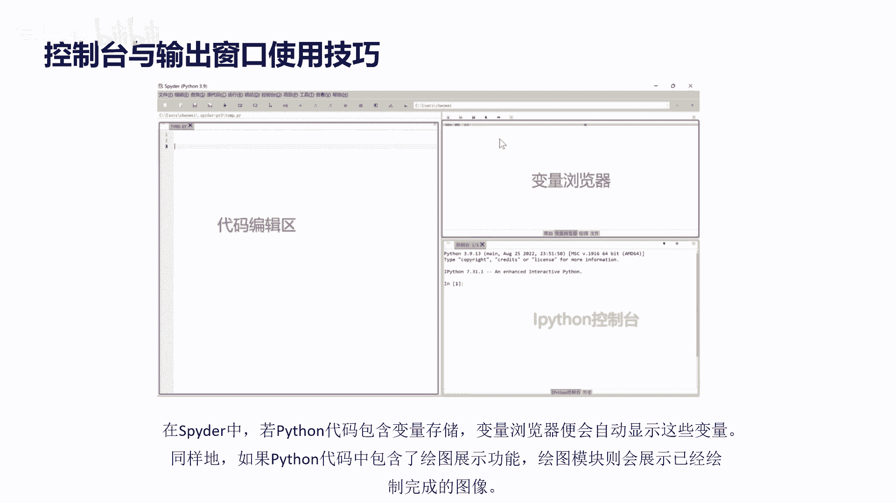
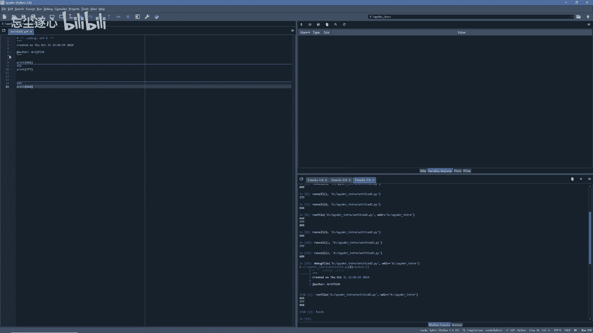
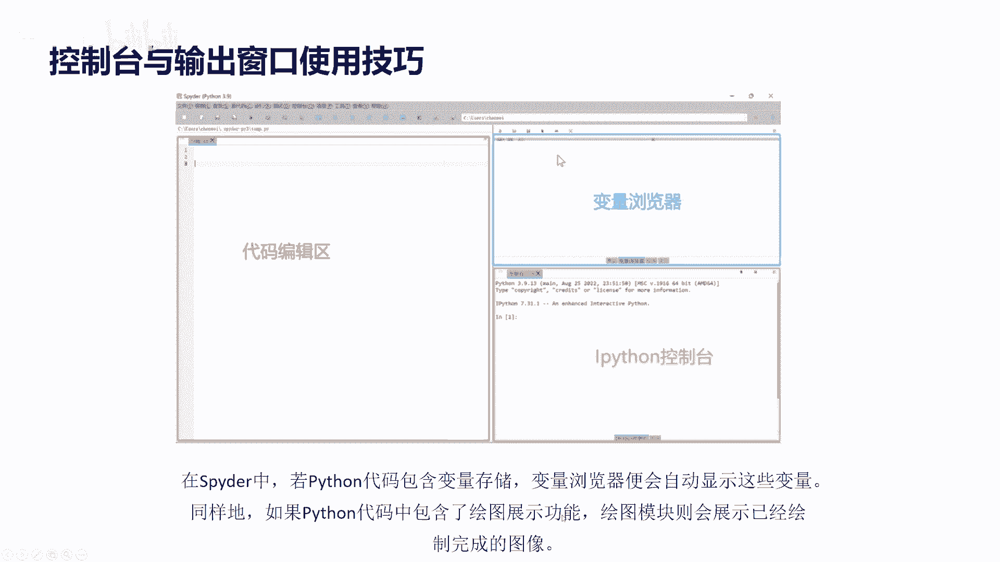
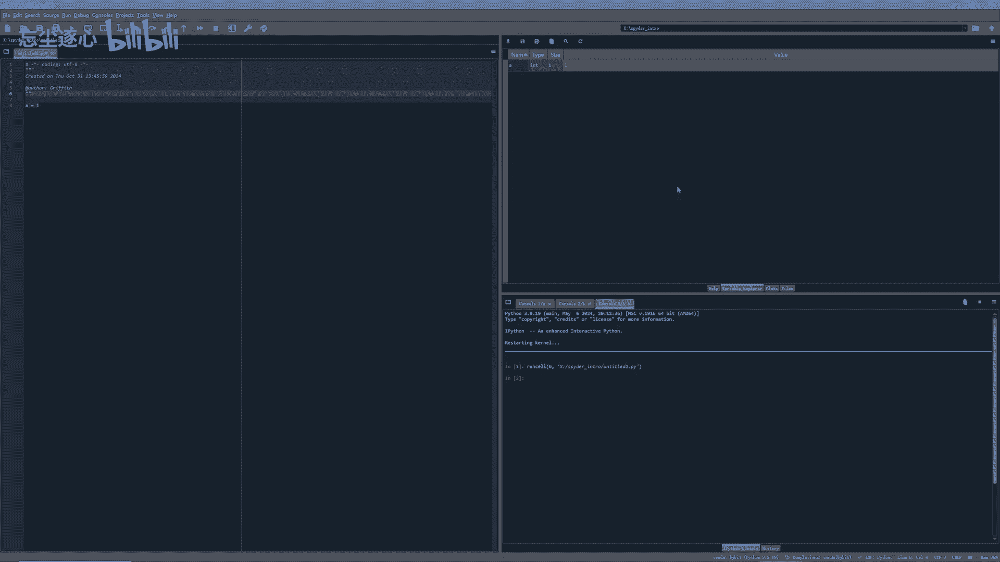
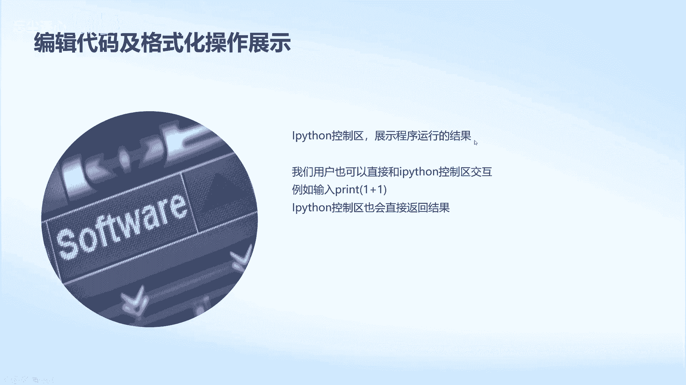
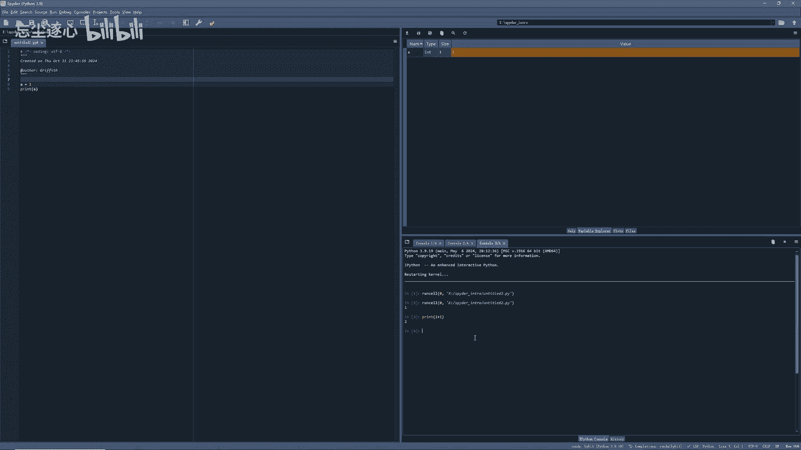
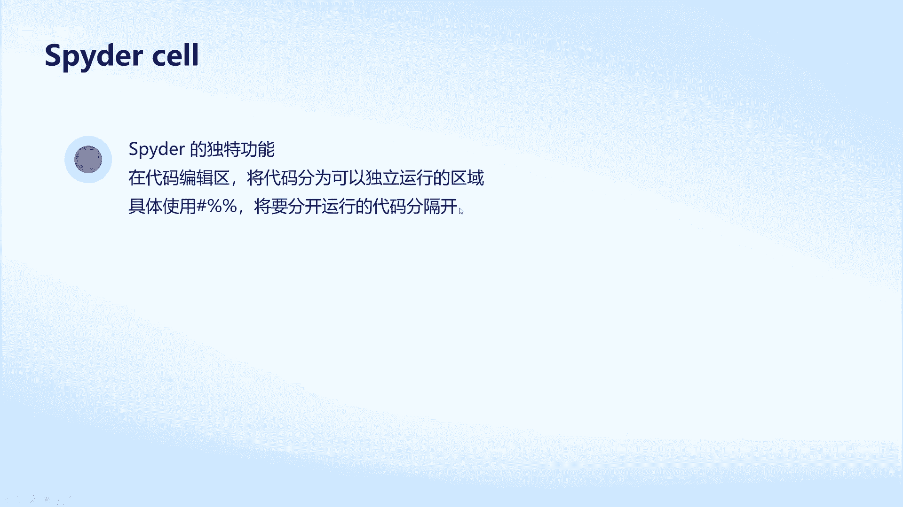
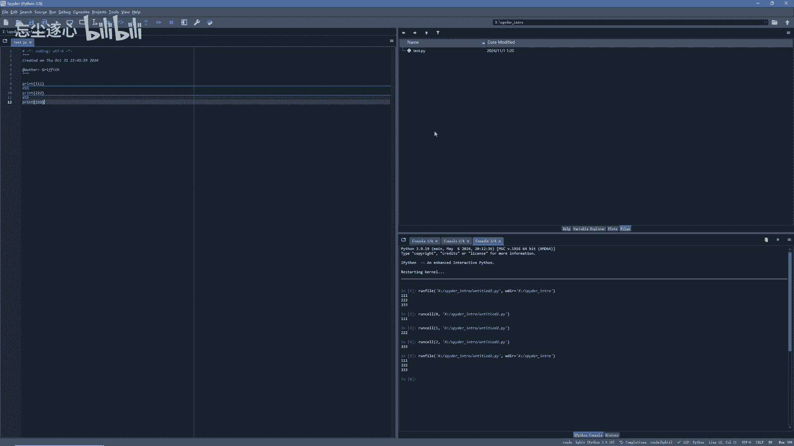
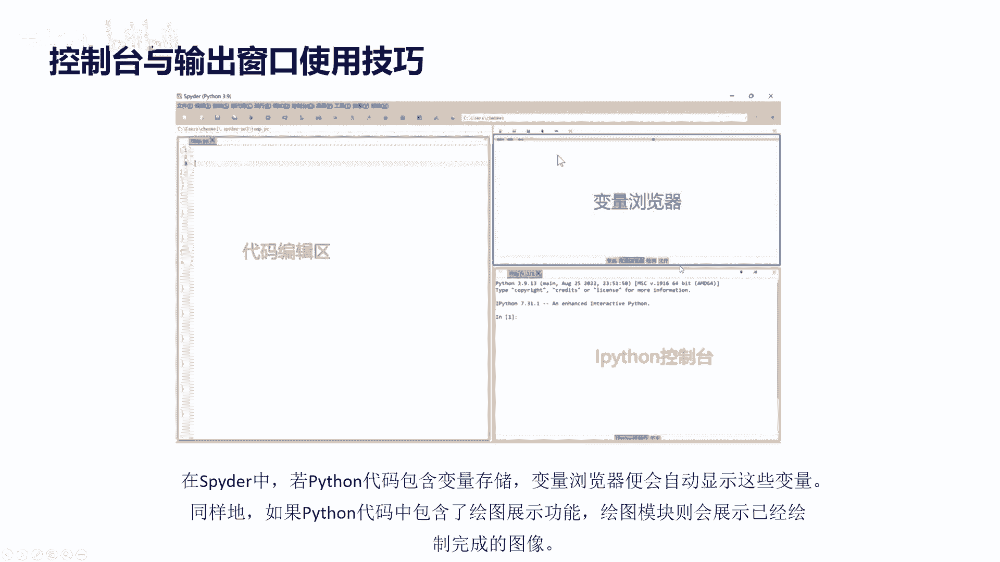
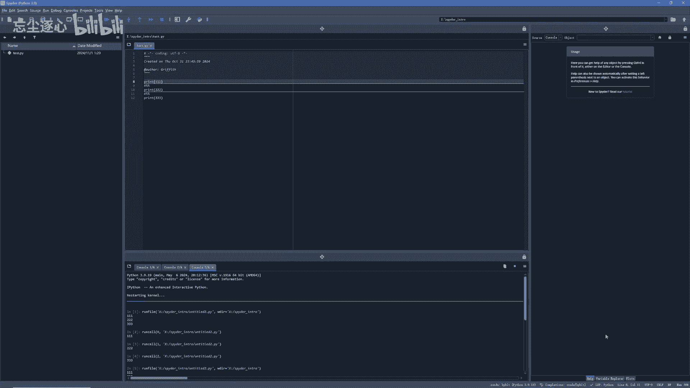

# 1.1Spyder界面介绍及简单使用 - P1 - 忘尘逐心 - BV1FKS2YFE4i

大家好，我是AI unit的griffins，今天和大家分享spider页面介绍，spider是一个功能强大的集成开发环境，专为科学家，数据分析师和工程师设计。

提供了一套完整的工具来支持Python语言开发，我们把spider分为四个区域，最上方的是菜单栏，红色代码编辑区，蓝色变量浏览器。

黄色IPYTHON控制台，我们在做新的编程项目，不会是一个单独的文件，通常是创建新的独立文件夹，其中再创建多个文件，spider右上方打开文件夹，打开目标文件夹。

现在我用的是spider intro文件夹，在菜单栏的左上方，我们通常使用file和run按钮，使用file，我们可以创建新的文件，打开已有文件并且保存文件，使用run，我们可以运行代码代码编辑区。

我们通常用来撰写代码。

并且运行在spider中，若Python代码包含变量存储变量，浏览器便会自动显示这些变量，同样的，如果Python代码中包含了绘图展示功能。

绘图模块则会展示已经绘制完成的图像，我们现在实验一下，把一的变量赋值给A，可以看到变量浏览器已经显示了A的值。

在IPAD控制区可以展示程序运行的结果。

我们现在运行程序让代码打印A的值，查看结果，我们可以看到IPAD控制区已经打印了，结果我们可以直接与IPAON进行交互。

我们可以看到IPAD已经打印出了结果，spider cell spider的独特功能，在代码编辑区将代码分为可以独立运行的区域，具体使用仅百分比，百分比符号将要分开运行的代码分隔开。

在没有使用spider的cell功能时。

我们运行这段代码，打印三行分别是112233，我们看到这三行都已经打印出来了，然后我们添加cell的分隔功能，我们可以看到这三行代码都被单独分割出来，每次运行都只会打印一行代码。

当然我也可以一次运行所有代码，点击上方的run run，全部代码也可以run单独代码，RUSELL就只会运行这一个单元区域的代码，直接run的话就是全部代码，此时我们可以选择保存文件。

点击file save编辑想要保存的文件名，我们可以看到文件已经保存好，也可以直接按键盘的CTRLS保存文件，我们可以点击右上方的变量浏览器，绘图浏览器文件夹中的文件，查看不同的信息代码。

编辑区变量浏览器ipad on控制台，它们的相对位置都是可以移动的，我们可以根据各自的喜好来改变它们的位置。

点击will unlock解锁他们的位置，我比较喜欢把fail放到最左端，平移过去，左边拉一下位置，把console放到中下方，稍微再调整一下它的位置，我不太喜欢history，我不需要这个东西。

我就把它关掉，再调整一下它的位置，这个布局我就非常满意，我可以在左边看到我需要编辑的文件，在这里编写代码，在右边查看变量。

最后点击will lock，锁定它们的相对位置，想要获取更多课程信息，如课件，Python软件，课程代码量化开源代码答疑解惑，加入交流社区。

