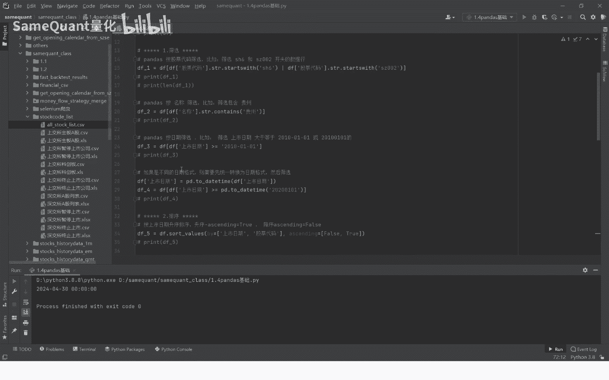

# 1.4 pandas基础入门 - P1 - SameQuant量化 - BV1qi421X7j6

大家好，欢迎来到西部矿场量化，我是打板哥，这节课为大家分享，Python量化交易过程中最重要的一个包，pandas这个包的一些用法以及它的一些功能，首先我们来到第一个功能。

就是一个用pandas读取本机的一个CSV文件，我们读的这个CSV文件是所有的一个个股的，一个我们A股的一个股票的一个列表啊，也就是这个文件夹，stock list这个文件夹。

首先呢我们复制一下这个文件夹，所在的一个本机的一个完整路径，好copy pass the root pass哈，复制完之后直接粘贴到这里来完，接下来啊。

因为我们读取的是一个data frame的一个表格，我们就是一个变量啊，DF等于PDD要瑞的这个pass有运行下，我们可以看一下，那么简单啊，你可以看一下，这里面已经读出来了，包含了这段是这个代码名称。

上市日期丧失状态，他是终止上市还是正常交易，还是说以及他终止或暂停上市的一个日期啊，这里都显示了，如果是烂的话，NA烂的话，表示他目前正在正常杀死他们，没有退市或者是怎么样的哈，好这个功能很简单。

我们就做掉好，接下来第二个功能是什么呢，比如说我们刚刚已经读了这个CSV了，那么接下来要筛选筛选什么呢，筛选出比如说一个是啊筛选出上海六开头的，也就是股票代码里面上海六开头。

也就是上交所的代码或者是什么呢，或者说它是深交所的，但是它是002开头的，我们只保留说这个上海以及深圳，深交所002开头好，它的写法其实也特别简单的。

就是这个你用这个股票代码这一列要string starts with，也就是说这个字符串它以什么开头了，以这个SH6开头，或者一个竖杠或者的意思，或者就是说starts with这个深圳002哈。

同样也是运行一下啊，我们可以看到这他已经筛选了啊，筛选之后你看这里就是深圳006，这个就是深圳002，我们可以看看其他的已经没了，我们再打印一下它的一个长度啊，这个表的一个长度LLEN正就行了。

那个DF啊，一看它长长度是3344，那么我们来再来看一下，最初始的一个长度是多少呢，没有筛选之前的长度是多少啊，没有筛选之前，那是5353长度，筛选之后是3340，因为其他的已经过滤掉了哈。

这个应该说非常好理解了哈，接下来我们进行下一个功能，第二个功能呢我们做一个什么呢，就是说做一个筛选，筛选什么呢，意义刚刚是以股票代码筛选，我们现在用名称进行筛选，那你就是名称筛选，就DF这名称这一列啊。

电视剧在content content就是包含比如说包含贵州的对吧，那你就是包含这个将这个包含这个名字，股票名字包含贵州的全部给你筛选出来，好，我们按一下，你看这个下面这个对吧对吧。

包含贵州的总共也就是在这五个票，五个票筛选的pa的一个筛选功能，说我们是按日期，按上市日期筛选上市日期这一列，我们按上市日期筛选，这个2010年1月1日之后上市的对吧，筛选功能啊，在筛选上市日期的时候。

你们在运用的过程中会遇到一个什么问题呢，就比如说对不对，但是你要筛选的那个词的一个日期，它可能是不带杠的，比如说这种对吧，那那这种两种格式不统一的时候，你再去筛选，那肯定会遇到错误的，不一定会支持。

所以说这个时候你就需要什么呢，这一列转换成日期列，转换成日期列之后，同时你将这个你要筛选的这个这个参数，它也转换成统一转换成日期格式，就是转换成日期格式之后，你再去筛选，报错了好。

我们再改成2020年的对吧，2020年之后了哈是吧，他就更少了，你看他这个2021年5月五月25，到后面的到二零对吧，你2月28日对吧，2日上市了对吧，这个就就就更少了，这个是一格式，然后再筛选。

就是当遇到筛选了报错之后，那你就要分别建议你分别打印去一下，它两者的一个格式，你也就是你用去这个type去打印一下，它是什么格式对吧，你是字符串跟这种格式，它两者格式不统一，那就对比了对吧。

那你就先统一格，然后再去对比做一个排序，看到对吧，这个日期你看到没，这是4月8号，然后这是2月28，这个排序，这个日上市日期的这个排序是乱的对吧，那么我们接下来对吧。

我们就按照上市日期的一个顺序进行一个排序，15日四月十一四月八，这就是按照升序排列，最早1990年12月一，这个就是按升序哈，这是一个排序哈，那如果你是按照降序呢，你就把这个。

然后你这个排序的这个功能是叫做，就是这个这个老师就是这个value，然后by意思就是你用一列哪个字段去排序，比如说上市日期对吧，你就把这个上市日期当然除了支持单列以外，还支持什么来支持你，比如上市日期。

然后再来一个什么上市状态对吧，或者是股票代码对吧，你比如说两个的话，你对应的对吧，你是怎么排序排序的规则，你比如说这个日期，那你是force force，就是降序对吧，上市日期然按降序。

然后相同的上市日期，那你就再来匹配这个股票代码，股票代码是按顺序对吧，你这样的就说这个排序支持一个字段，也支持多个字段，它首先是按照第一个字段进行排序，如果这个算比如说上市日期同一天有五个。

那么他再根据这个股票代码，然后这个是升序进行排序，比如说这样你运行一下一样的对吧，首先这个上市日期是一个降序，对不对，看到没有降序，应该来说也是非常好理解，就是说成values这个方法好好。

我们接下来是降序和名称，升序刚刚已经演示过了，我们就过滤下来，就是一个是索引的一个功能对吧，我们这个排序嘛，排序是按照日上市日期和名称这个排序，它排序完之后前面的一个缩影，所以也就是默认的序号啊。

也就这你看你就这个位置哈，5338这个数字的这个东西，默认的这个东西它是不是就乱掉了，你一排序或者怎么样说这个就乱掉了，乱掉之后对吧，你通过重置索引，把这个在注意这个索引是从零开始的。

011D到最后再重新重置一下，那么这个重置索引就是reset index，index就是索引的意思，reset就是重置索引，reset index或者是true，drop等于true。

就是把老的这个索引删掉，in place的true，就是用新的这个索引给替换掉，老的好，我们再运行一下，重新的这个怎么样重置了是吧，他总共是有5353行数据，然后他从零开始的，所以最后一个是5352。

就是重置索引，这个重置索引这个功能也是我们经常要遇到的，这个因为这个索引这个东西还是很关键的，如果你这个索引值不对，你有时候就会遇到一些错误哈，好接下来呢我们进行一个分组统计哈，啊这个是复制的这个DF。

这个最开始的那个DF表，然后呢像这个上市日期一个什么呢，是按年统计当年上市的一个数量，也就是我们把所有的上市公司，就是根据年份去统计，每年上市了多少数量做个汇总，首先呢这里面这个是什么呢。

这里面上市日期是年月日的，首先我们要转换成什么，转换成连的这个连的，它是不是就是这个上市日期的四个对吧，那么就首先我们来到一个获取一个新阵列，然后把首先他把类型我们转换成，转换成这个字符串。

强制转换成字符串，而是按字符串，然后呢我们再来命名一列叫DF上市年份，上市年份，那么等于什么，等于上市日期点，也就是字符串的前四个就是这样的四对吧，他就跟这个对应的一一对应的是2024年。

在2024年对吧，一一对应的是20232311对应好，完成之后，接下来对吧，接下来就进行正式分组统计了，这个分组统计这个方法名叫grow统计好，那分组统计我们是按照什么分组统计，按照这个按照这一列。

但是这一列按哪一列呢，等于上市年份，然后按照什么呢，按照这个代码对吧，我按照上市年份分组统计统计什么，统计这个字段统计这个股票代码它在什么，它的size也就是它的一个数量。

接下来预计一下今年24年26讲，2023年16讲，我们可以看到对吧，你从这个上市公司你可以看对吧，最近这几年涨多了哈，年份统计它上市的一个数量哈，纳是这个功能是非常强大的，我们今天介绍的是非常一本。

另外就是说不是经常遇到的啊，这个这一堆数字，17143200，这其实是一个时间，把时间戳时间戳，那么我们现在这是一个数值的时间戳，那么我们现在要转换成时间对吧，那你就是用这个pandas to东丽。

然后要特别注意，这后面一定要加一个八，也就是加一个八小时的时差啊，要转换成北京时间啊，如果你不加这个，你肯定会出错了，这个要特别注意，很多人他如果不加这个就会出错，因为你要转换成这个点。

如果你是通过这个文献言或切GBT你获取的，这个按这个时间的这个格式，它没有加这些没有加，最后这一句它就是错的，这个要特别注意哈，其实就是2024年4月29日对吧，当然你改一下这个值。

你比如说你改一下这个15，那他肯定这个时间日期就变了对吧，这就变成5月10日0：46分对吧，你这个只要这个变一下对吧，你只要这个值变一下，这个时间出来，对应的时间就变了，明白吗，那如果说你加这一句的话。

那你这个时间对吧，黑子变成电脑少了半个小时，他就错了，所以说这个要特别注意啊，如果是北京时间，我们用的是北京时间，一定是要在后面要加这一句的，否则就是错的，这个要特别注意，很多人这个很容易犯这个错误。

如果这个时间一个地方错了，那其他的结果都错了，这个时间这个时间相比之前的这个时间，它是也是去那三个零，就是是它是带带上这个毫秒了，带上毫秒了，那这个带上如果是带上毫秒了。

那你这个位置unity你这个位置改成要毫秒了对吧，那如果说这个这种是十一十一位的对吧，11位一位是不带毫秒，那你这就是秒，那你这个贵的就带了毫秒了，你这就写成毫秒，你这个参数设置你不设置。

那肯定就错了哈，然后你运行一下对吧，那所以说所以说你这个时间戳的长度，你这个一定要对应哈，你是毫秒的话，你这位置就要设计成毫秒，就是思维就是这毫秒偏要比这个复杂强大得多，那后期我们这个当中呢。

会介绍更多的一个潘大师功能啊。

