# 1-CCXT基础使用 - P1 - Crypto小白书 - BV1wD421J7MZ

大家好，这里是加密小白书，专注于web3AI及个人提升，欢迎来到本次课程，今天我将带领大家学习如何使用cc xt库，进行交易数据获取和整理，那首先呢我们来介绍一下CCXT哦。

它是一个非常流行的加密货币交易所API封装库，提供了一个统一的接口，使得我们可以方便地与多个交易所进行交，互和数据获取，然后他也支持众多交易所，比如KX火币币安等。

通过CCXD我们可以获取交易所的市场数据啊，订单部执行交易等等，好，现在我们来学习，如何使用CCXT来获取交易数据，以及进行交易数据的整理，首先我们需要创建一个CCXT交易所对象。

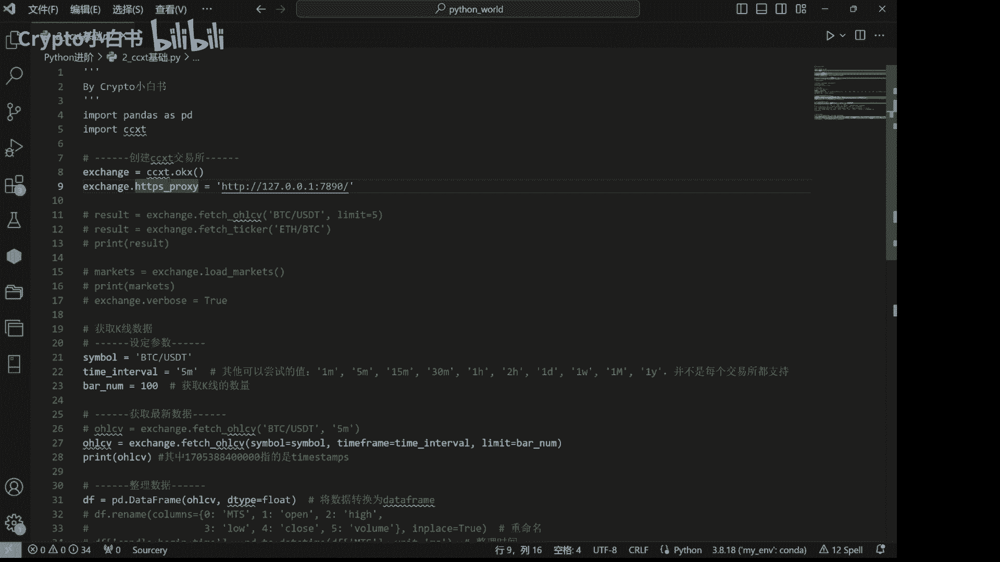

在这个例子中，我们使用KX小于所进行示范。

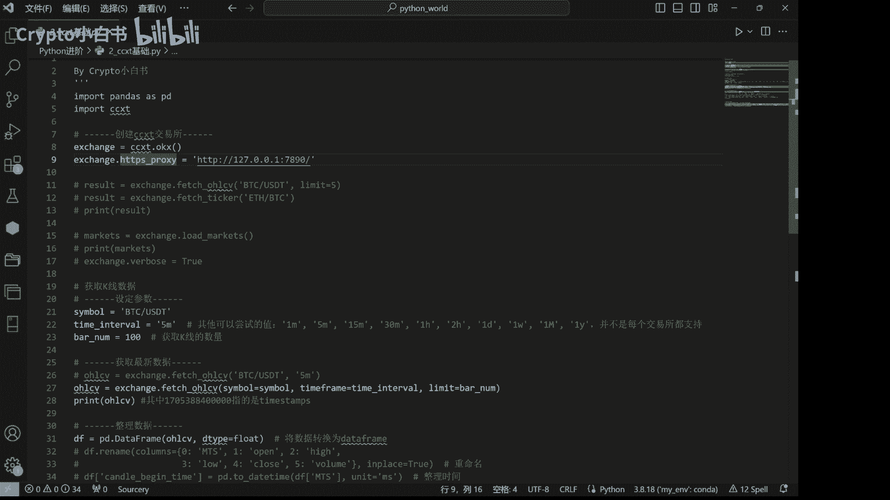

需要注意的是，这里我们设置了一个代理服务器。

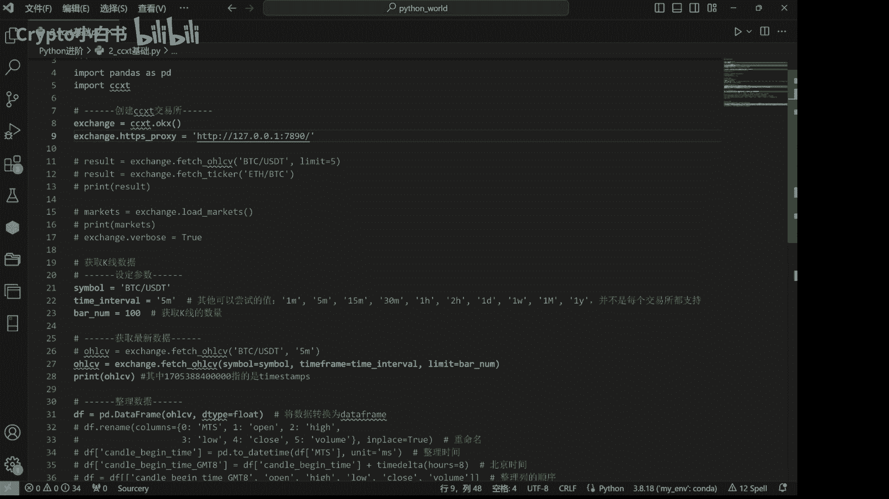

以便在国内的环境下进行代理访问，接下来我们可以通过CCXT提供的方法，获取交易所的市场数据，例如我们可以获取最近的K线数据。

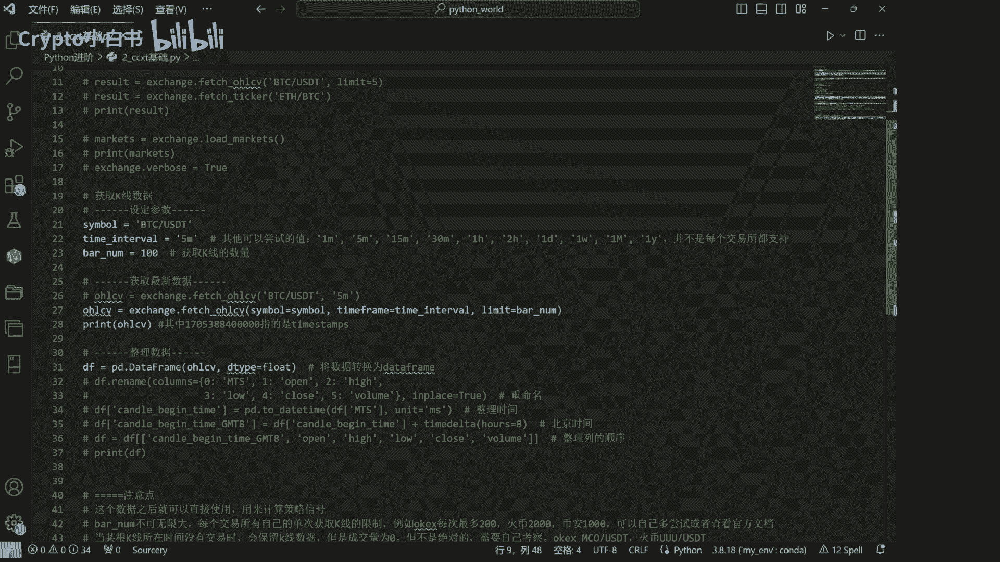

在这里我们设定了一些参数，包括交易对symbol和时间间隔，Time interval，你可以根据自己的需要更改这些参数，symbol呢是指我们想要获取的交易，对这里我们想要获取BDCUSD交易对。

tom interval呢，则是指获取的K线数据是什么类型的，比如5分钟的K线数据，分钟的K线数据，15分钟，30分钟一小时，这都可以自己设置，然后我们可以通过8number设置获取K线的数量。

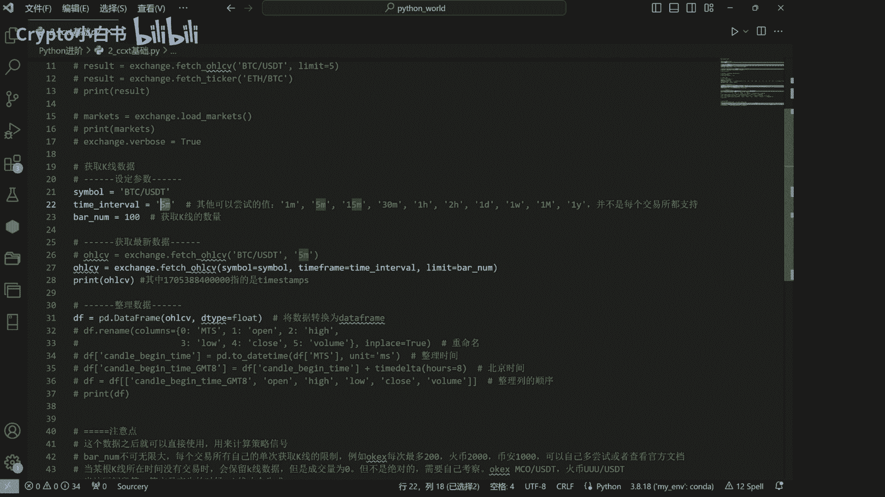

然后呢我们通过cc xt的exchange dot，fetch o h l CV方法来获取最新的K线数据，并将其打印出来，那么这些数据有什么用呢。

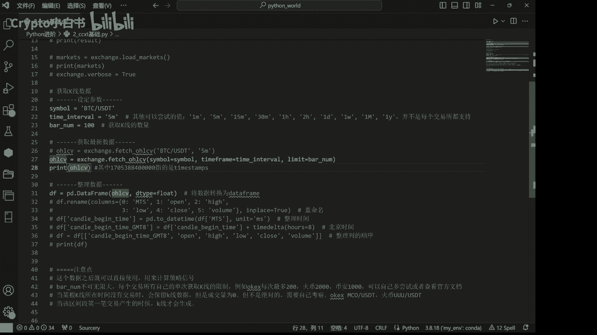

它可以用于后续的策略信号计算好，那我们BRT下我们获取到的OHLCV数据。

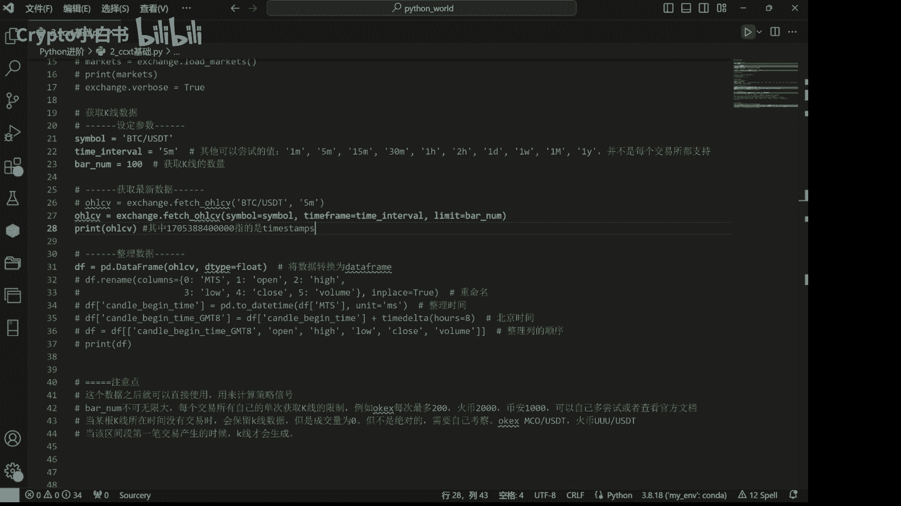

也就是我们的K线数据运行一下。

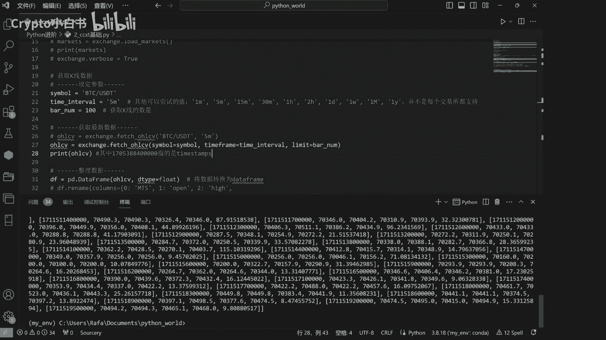

可以看到我们获取到的数据长这个样子，可能大家看起来不是很舒服，我们可以对数据进行一个整理操作，将获得的数据转化为pandas from the data frame，然后做一个重命名操作。

以及做一个整理时间的操作。

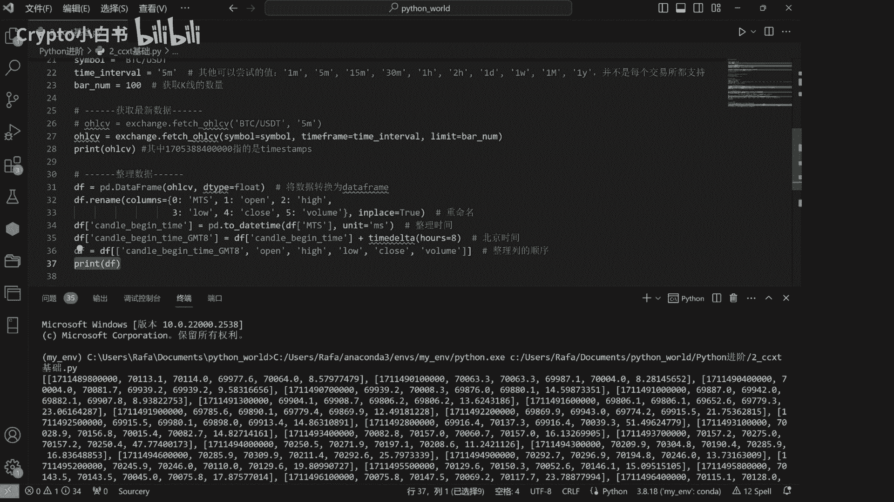

再次print一下看看。

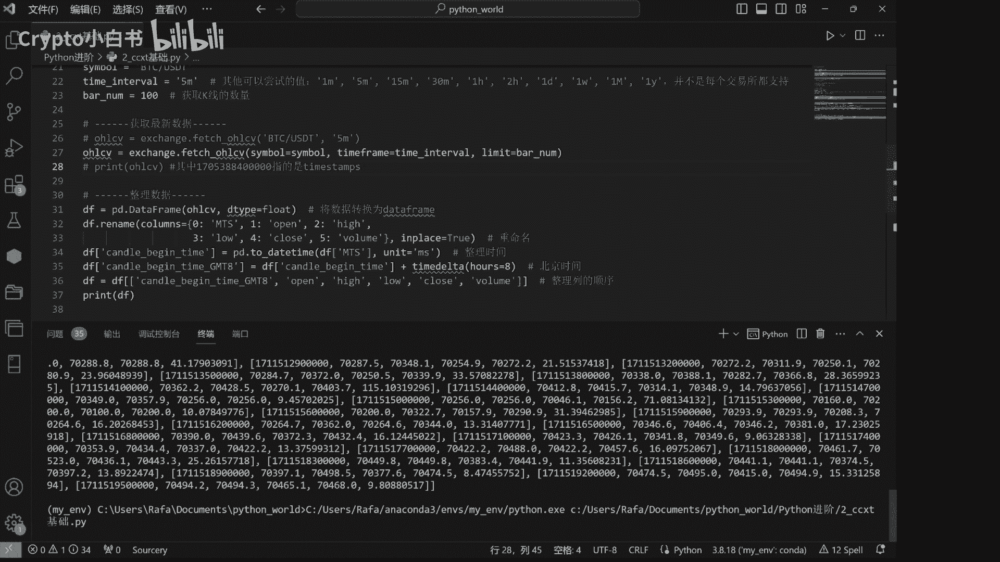

OK我们看到我们运行之后有一个报错，Name error，Name，Time delta is not defined，也就是在这一行中就time data没有啊，没有经过定义。

那这个的话我们需要从从最开始进行import操作，From daytime，Import time delta，再运行一下，好的这样的话我们就整理了我们获取的数据。

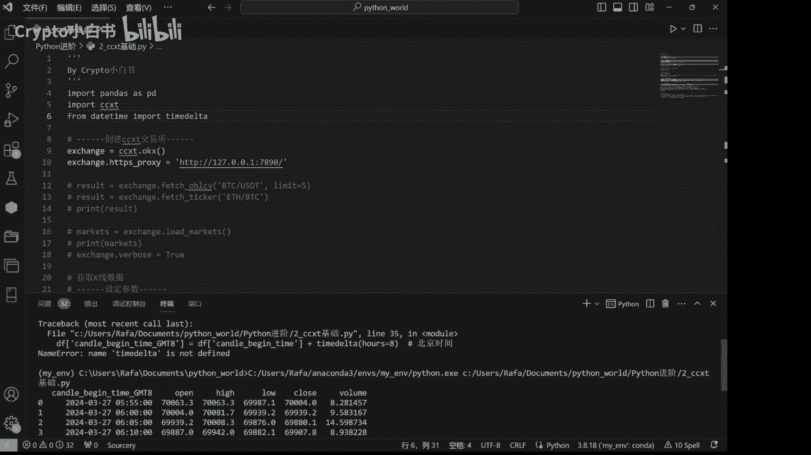

可以看一下整理的数据，Kindle begin time gmt eight，也就是说，这个K线的开始时间点是北京时间的，2024年3月27日5点55分嗯，它的开盘价是什么，最高点。

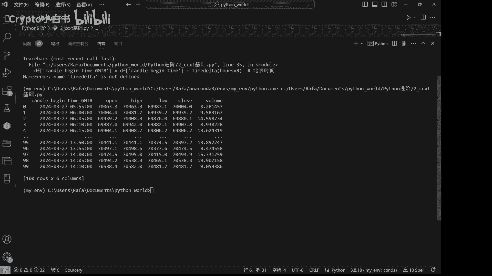