# 1.1python安装 - P1 - SameQuant量化 - BV12m421u7uQ

大家好，这里是sim矿场，我是打板哥，量化交易的，最开始的第一步就是Python程序的一个安装，那么今天呢我们就手把手的演示一下啊。

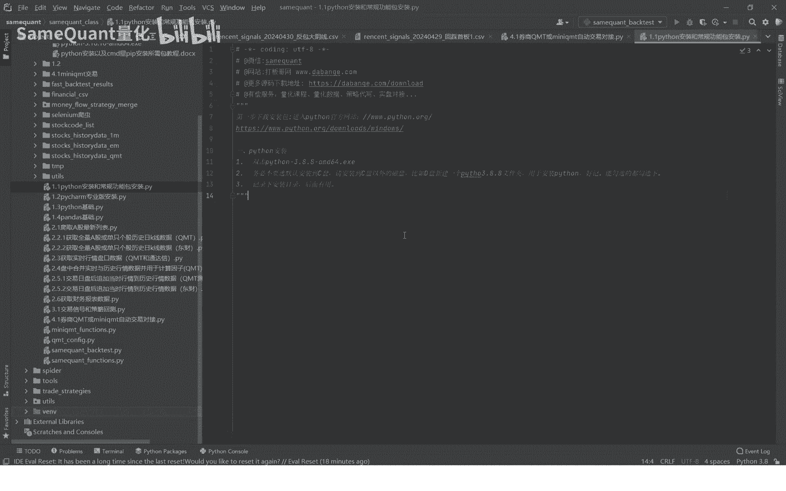

我们先来到这个Python的官网，也就是这个网址，然后进到这个页面了之后呢，你这里有很多这个版本啊，你比如说我现在选择的是windows的一个版本，很多版本你都可以选择下载，比如说我就这个版本啊。

就直接点这个，然后他就开始下载了，因为这个我之前已经下载过了，所以呢就不用下载了啊，我就下载到这个位置，就是我们课程里面这个一点一节的这个里面啊，就是这个安装包那个，然后呢我们现在就开始安装啊。

直接双击，大家一定要注意啊，我们在安装过程中会有一些细节，有重要的一些细节，然后这里呢我们选择这个Python也可以true pass，然后下面注意啊，一定要选择下面这个啊，不要图简单选择上面那个。

因为上面那个路径太长了，不好记啊，我们一定要选择一个啊，我们自定义的一个路径，那样呢你好记，然后我们以后用到的时候就比较方便好，这些都勾选没有任何问题啊，这不就很关键了啊，这里这位置还是一样啊。

你不要选这个默认的这个路径啊，你要自己来对吧，自己选这个路径，然后你自己制定一个数据，比如说我放在D盘，然后呢这里呢我就建议是像我这样，然后新建一个文件夹，文件夹的名字就叫什么呢。

也就是你把这个版本号啊，这个写清楚写上去，因为你可能安装多个版本是吧，所以每个版本你把它写清楚啊，然后点确定，然后进行安装好确定，然后就是耐心的等待安装，我们先耐心的等待一下好，现在就可以关掉了啊。

这已经安装完成了，接下来就是我们要安装一些常用的包啊，或者说我们量化交易过程中最重要的几个包，我们来安装一下这个包，就说一定是先安装了这个Python程序之后，你再去这个基础上安装包的啊。

这些包你比如说潘大师或者兰帕，这是很重要的一些，包括量化交易过程中啊，这个word文档呢，这里面有详细的Python安装，以及这个包的安装的一个啊教程，现在来演示安装所需要的包啊。

比如说我们要安装一个pandas一个包，首先呢我们就是我们刚刚的那个啊，Python的这个目录，双击进去，然后找到这个script啊，找到下面，因为这个下面有，你看有pip啊。

这几个ex e找到这个位置，接下来呢在地址栏输入CMD，然后按下enter，也就是这样就直接在这个地址栏输入CMD。

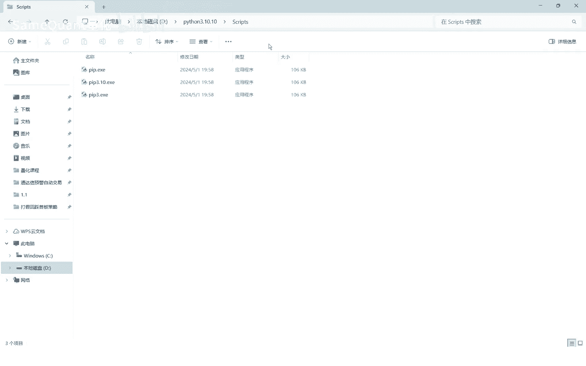

然后按下N键。

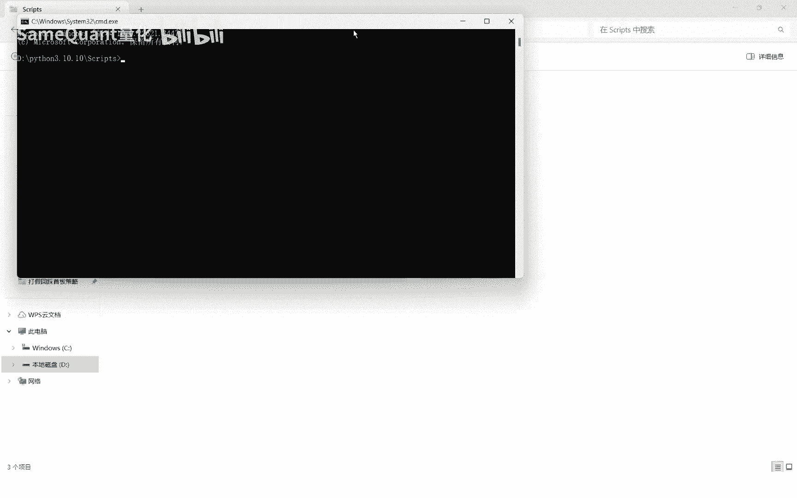

然后就来到这里了，接下来我们就要安装一个包，比如说我们要安装这个pandas as这个包，然后这里呢呃我们就直接复制过来啊。

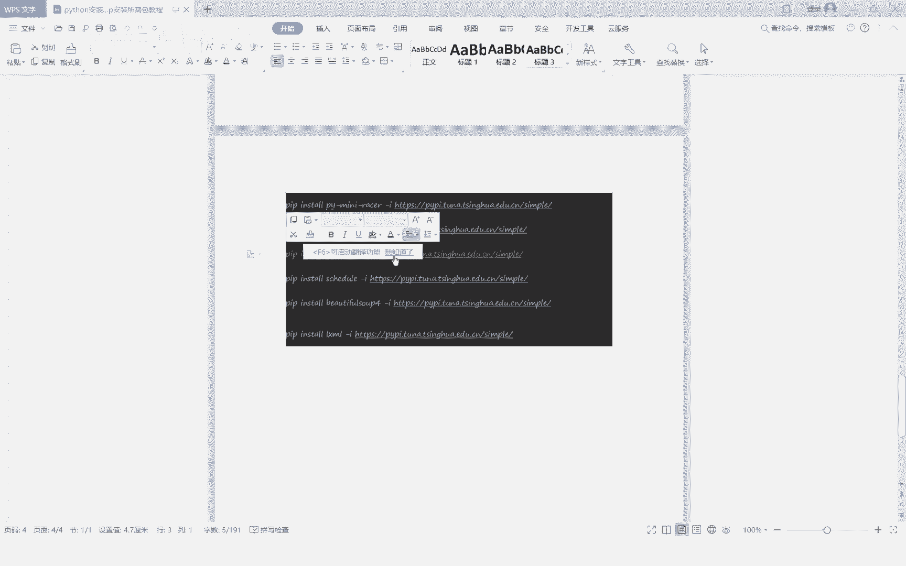

你正常来讲你就是直接这样就行了对吧，直接这样就可以安装了，但是呢这个安装的话是它是从这个Python官网，也就是国外去下载这个pandas as网速会比较慢，所以呢我们在后面啊加上这个镜像源。

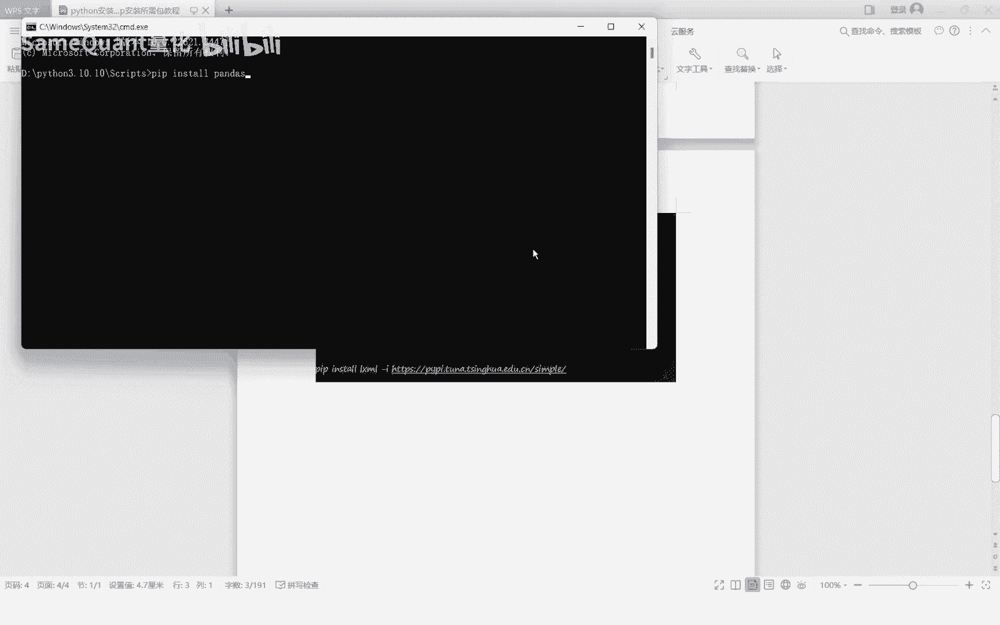

比如说我们这加加的是这个清华的镜像源。

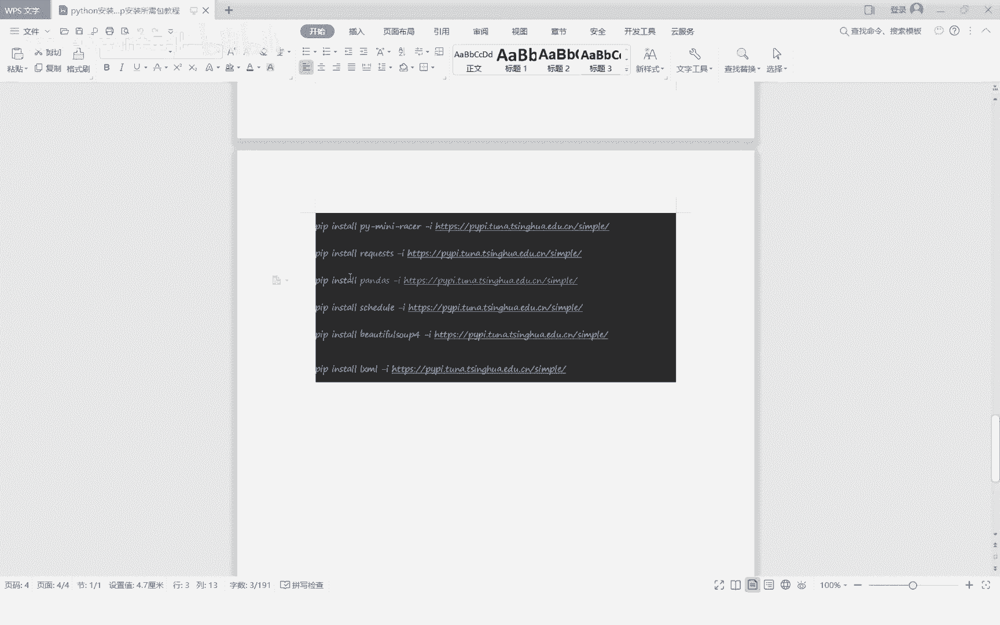

国内的镜像源，那样的话呃，安装起来会比较快，然后是这样去安装，这样的话就会快速的把这个pandas安装了。

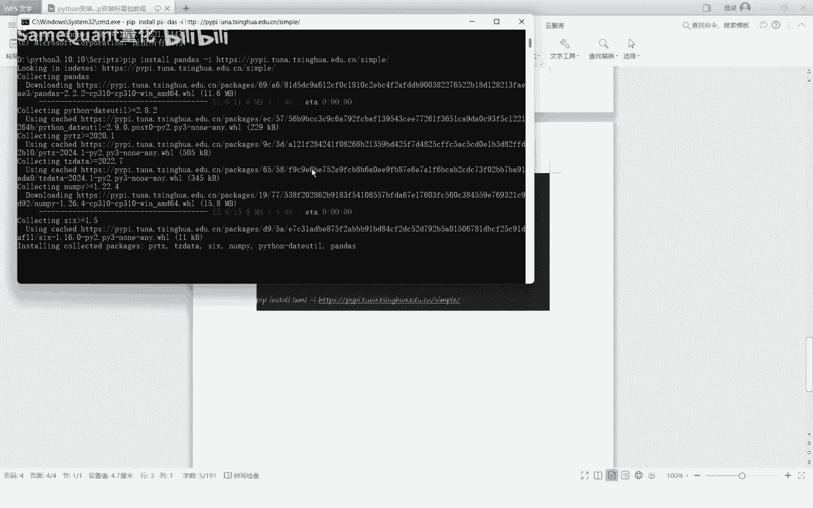

下面去，我们耐心等一下好，现在就安装完成了，安装完成之后是吧，你这个我们来到这个里面就可以看了啊，这跟这个lib，然后再在package下面啊，你就可以找到，你看它这就是pandas，看到没。

这里就显示了安装的时间，这都有了pandas as相关的全部都有了啊，这个说明你已经安装好了，好这节课程呢就啊讲结束了啊。

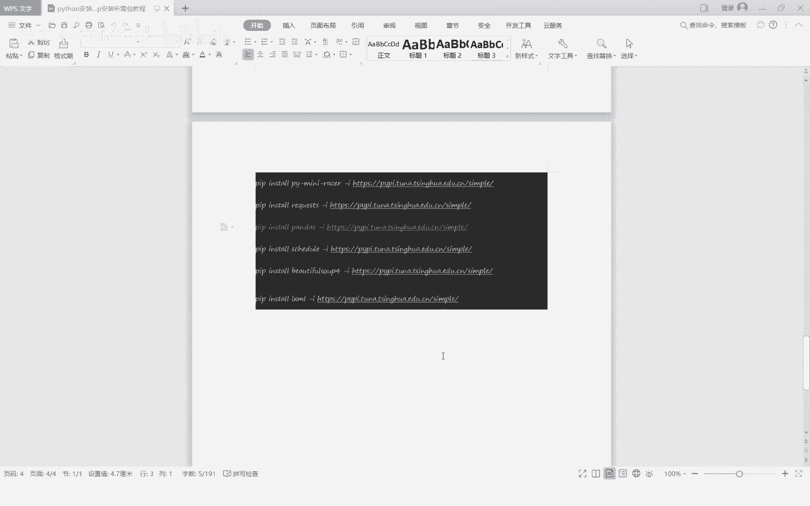

嗯这个就是Python的一个安装啊，以及这个相应的包的一个安装啊，这里有完整的一个word文档的一个教程，然后我们在使用的时候呢，就说这个Python程序对吧，我们要用的时候。

第一你可以用这个PYTHM，去关联这个Python程序去用，还有就是说如果说你不用拍cam，你直接就把我直接在电脑里面用对吧，用这个Python调出来用也是可以的，虽然不方便，通常我们也不这么用。

那也是可以的，那怎么怎么弄呢。

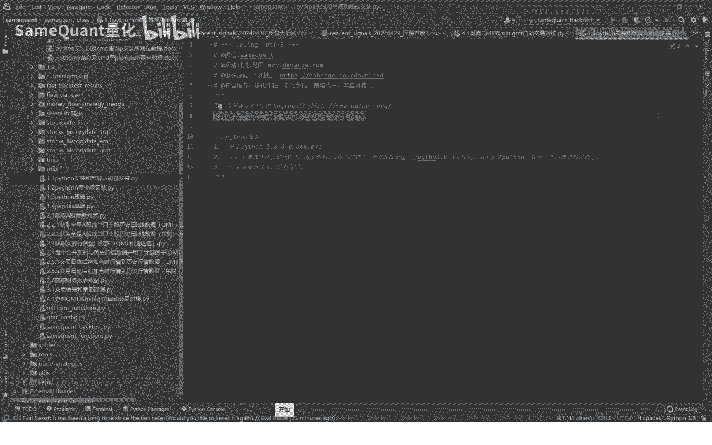

你找到这里啊，还是你直接再输入一个Python好，然后比如说我们刚刚安装了3。10嘛。

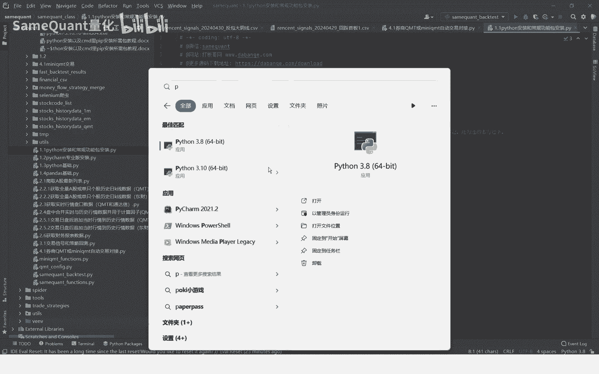

你点开啊，然后直接双击啊，会有一个窗口嘛，你直接直接在这里啊，输入i n t print print11吧，你看这里就显示二了。

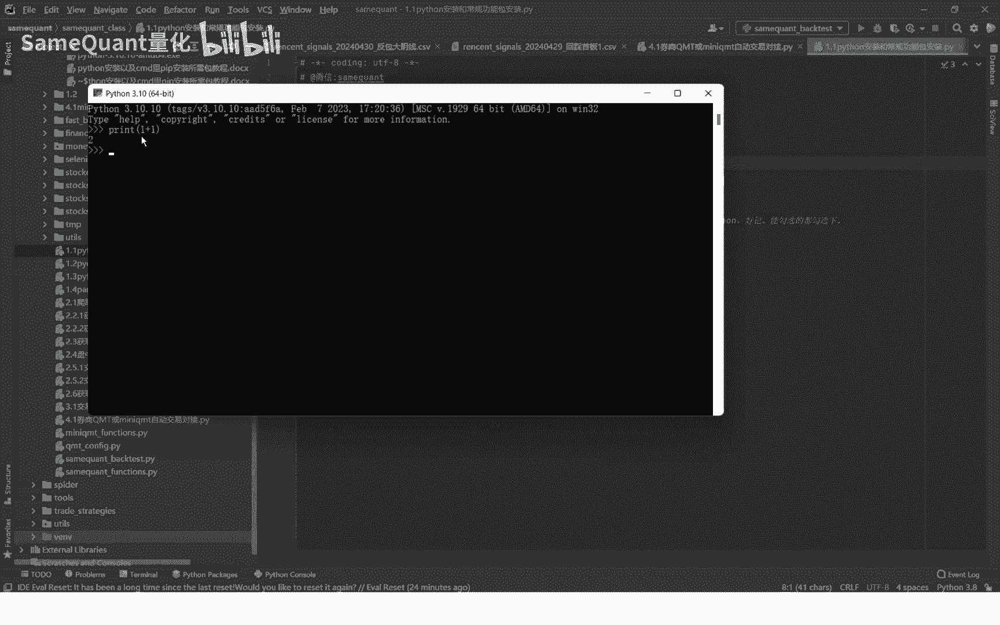

他就说明他就已经安装好了，因为它已经运行了好，本节就演示到这里了，我们下节会讲这个PYTHM的专业版安装。

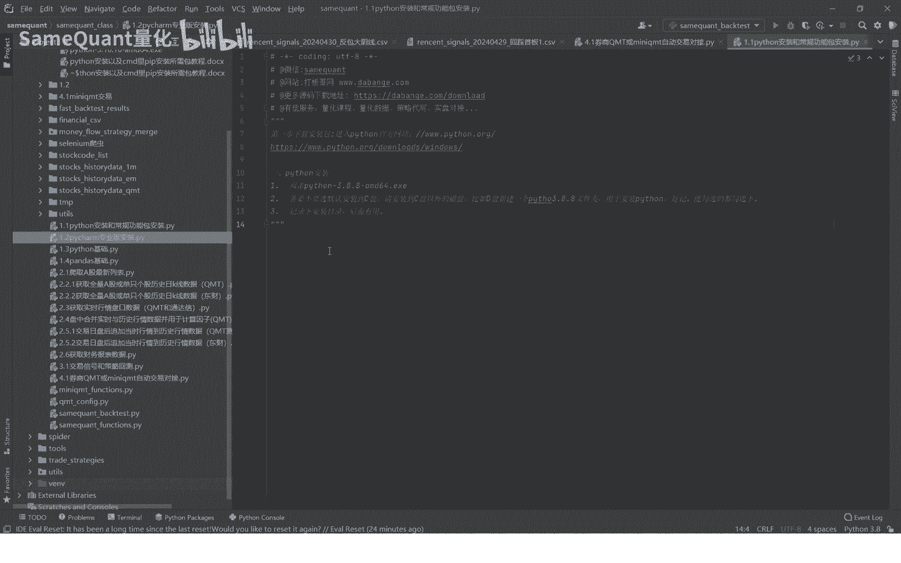