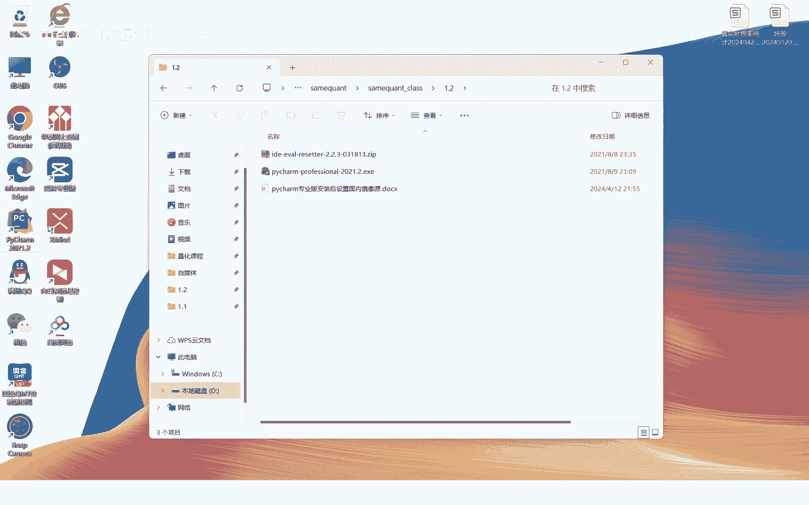
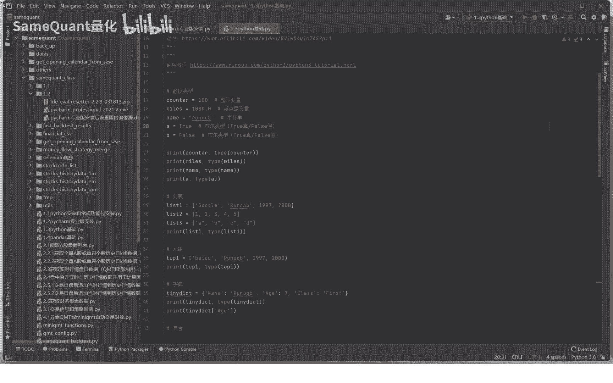
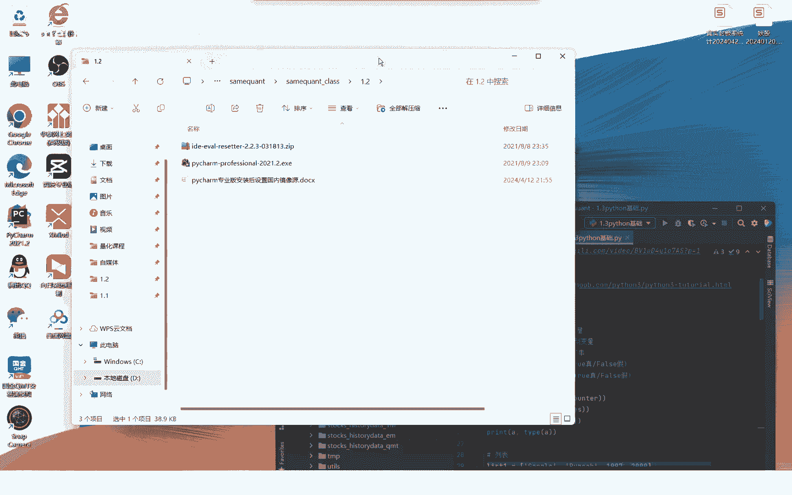
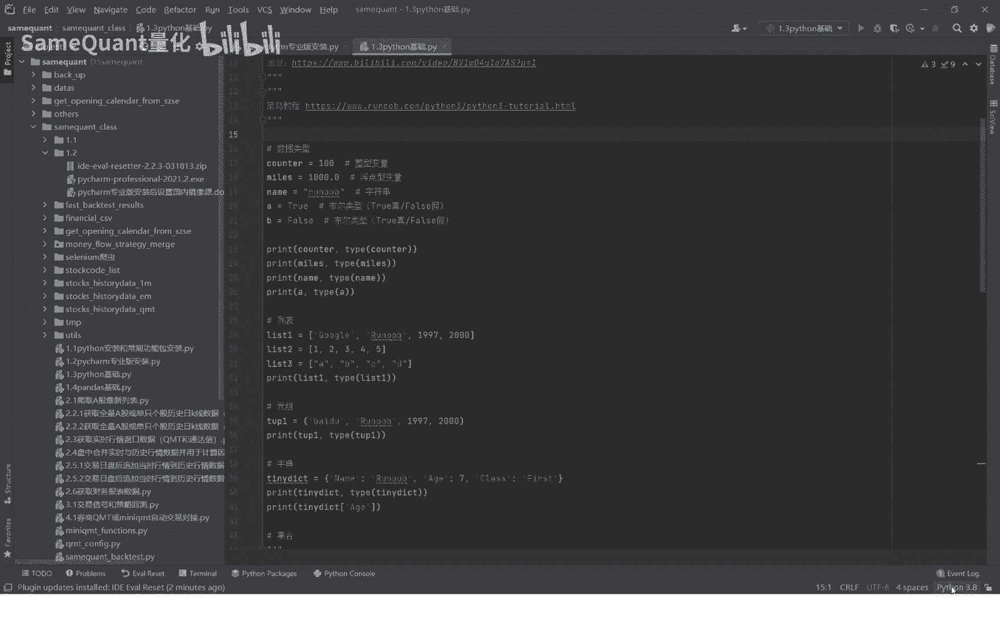
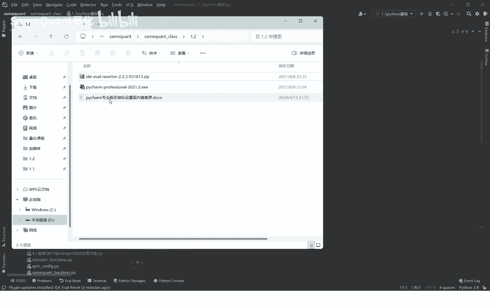
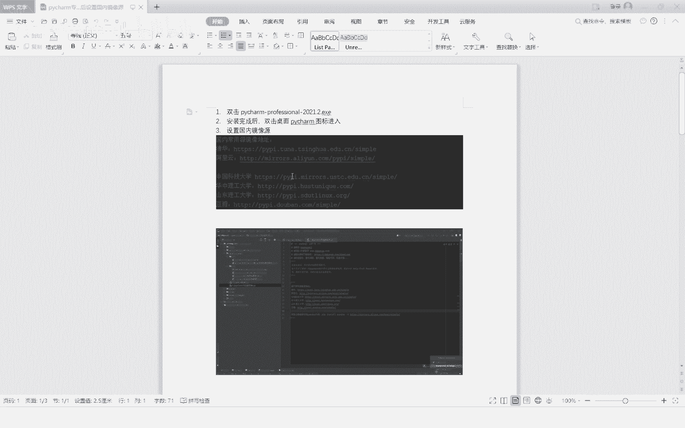
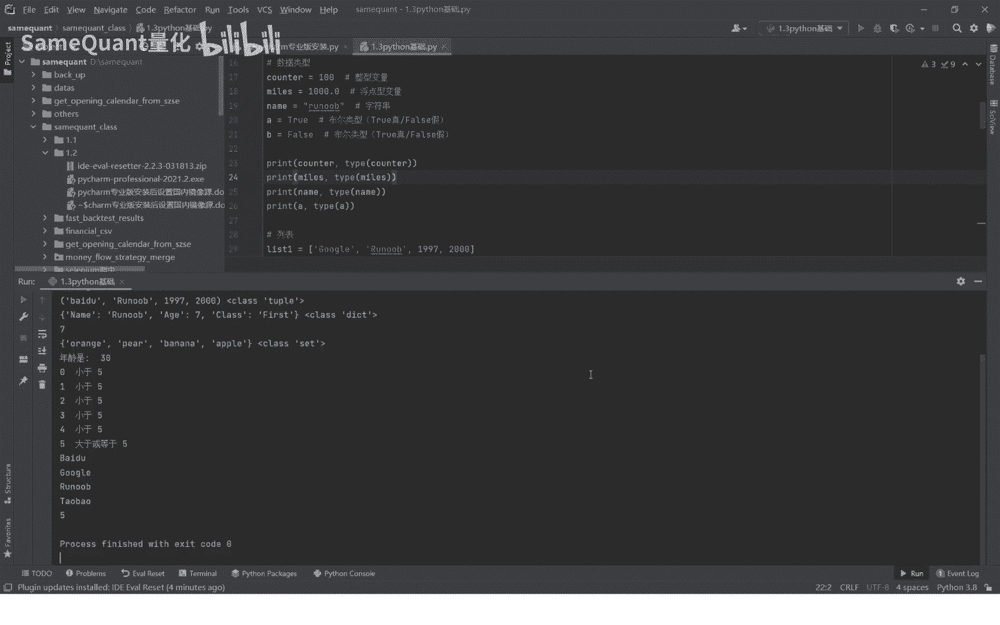
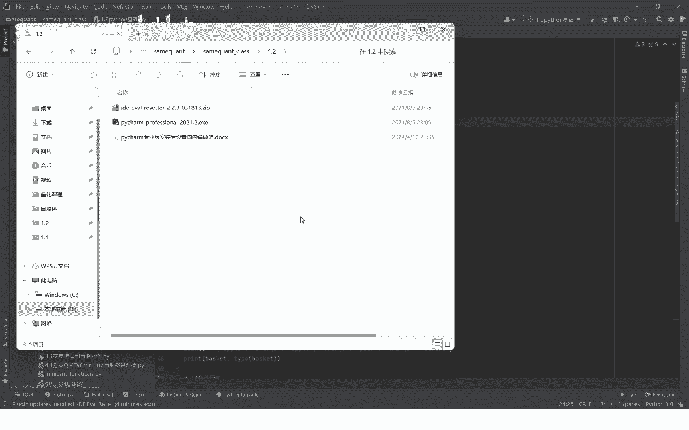

# 1.2 pycharm专业版免费使用 - P1 - SameQuant量化 - BV1MT421D7zE

大家好，这期为大家分享如何安装和使用Python编辑器，专业版的软件，HTM专业版的一些安装以及永久的免费使用，来到我们课程的1。2这个文件夹，下面这里准备好了，第一个是这个HTM专业版的一个安装包。

注意啊，一定要用这个安装包，2021版的啊，上面这个zip文件也就是压缩包的id开头的，这个是一个插件，让你免费使用PHM的一个插件啊，安装这个插件之后，你每次重启这个PYTHM程序。

它就会自动的延期一个月，下面这个文档呢是你拍X5安装完成之后，如何设置PCM的一个在里面安装Python包，如何使用国内的镜像源好，接下来呢我们就双击这个EXE程序，先进行一个拍项目的安装。

由于我本机已经安装了PYTHM，所以我这里就不再安装了啊，各位就按照这个电脑的一个指示，你就自动进行安装，安装完成后啊，他这个桌面上会出现这样的一个图标啊，我们接下来就安装好之后，就双击这个图标。

双击图标之后会进入这个软件，它会有一个提示，你选择这个就先不用输入那个license，先进入好，接下来呢可以把这个窗口缩小一点啊。

这个啊你看一下这个zip文件啊，你就怎么样呢。

就直接用鼠标拖拖到这个拍下里面来好，脱了之后它就会显示它会安装这个插件好，你就可以选择这个立即重启好，他现在已经重启了，那重启完成之后呢，就说我们插线也就安装完成，接下来我们看下咱们的有效期。

你用help这个这里点一下，You are restart，你可以看到这里的已经是最新的，这个K已经更新到有效期，已经到了2024年的6月6号，也就是在一个月之后，你就在一个月之内可以免费使用。

接下来呢你在这里有一个你看auto Rest prada，也就是每次每次重启的时候，它就这个你要勾选上，勾选上之后，每次就拍拍cam的时候，它就会自动的向后延期，你就可以专业使用了。

好接下来呢还有一个重要的一个步骤是什么呢，就是说我们拍摄安装好之后，要比本机的Python程序怎么样给关联起来，你就怎么关联呢，你就是这样的啊，点击这个右下角是interpret settings。

这里点这个点菜的增加A的增加的时候，你点啥系统的，你比如说点这个，比如说如果是3。8。8的啊，你就看到你D盘，比如说我D盘的3。8。8的，一个拍摄的一个程序，安装在你选中下面的啊。

一个Python点ex e k ok就可以了，因为我之前加过，所以说他又增加了一个啊，这样的这个PYTHM，就跟我们本机安装这个Python程序就关联起来了。

那么这个PYTHM它就可以调用本机的这个Python，程序进行Python的一些运行调试了，好由于我们增加了一个，那我们就把这个删除掉啊，避免重复，好好接下来呢还有一个问题。

我们在PYTHM里面安装Python的一个功能包，因为我们之前讲解的是在本机这个Python里面安装，并再次再增加一种渠道。

是在Python里面安装这个包好，我们先呢要进行这样的一个操作。

先要设置成你个安装包，先要设置成国内的镜像源，那为什么呢，因为这个PYTHM它默认的下载这个包的，他原地的设计在国外，也就是Python在国外啊，所以会比较慢啊，所以我们倒置成国内的镜像源。

那如何设置呢，这里有一个word文档，大家可以对着word文档去里面进行操作就可以了。

那么我们现在再演示一遍哈，还是一样，点击右下角这个位置上，Interpreter settings，再点击这个加号，再点击这个manager哈，这里就是一个镜像源的一些地址，你点击加号。

把这个镜像源的地址给复制进来啊，就OK了啊，因为我们之前已经加过了，所以说这里就不再重复了哈，点击确定就加好了，加好之后，接下来就是要在这个拍下里面安装包了，那如何安装这个包呢。

低音来到这个蔡MINAL点一下，直接在这里要按，比如说我们安装pandas这个包哈，比in store b a n d a s这个包哈，你认可一下就安装好了，因为我已经安装了，所以他提示已经安装过了。

如果你没有安装它就会下载安装的好，安装完之后呢，我们就直接啊直接就可以在这里面写啊，运行这个PY程序哈，你直接点击这样重新再演示一遍，直接点击右键run啊，这个PY文件哈，你看他这里就运行出来了好了。

开项目的一个安装以及免费的一个使用啊。

就到这里了。