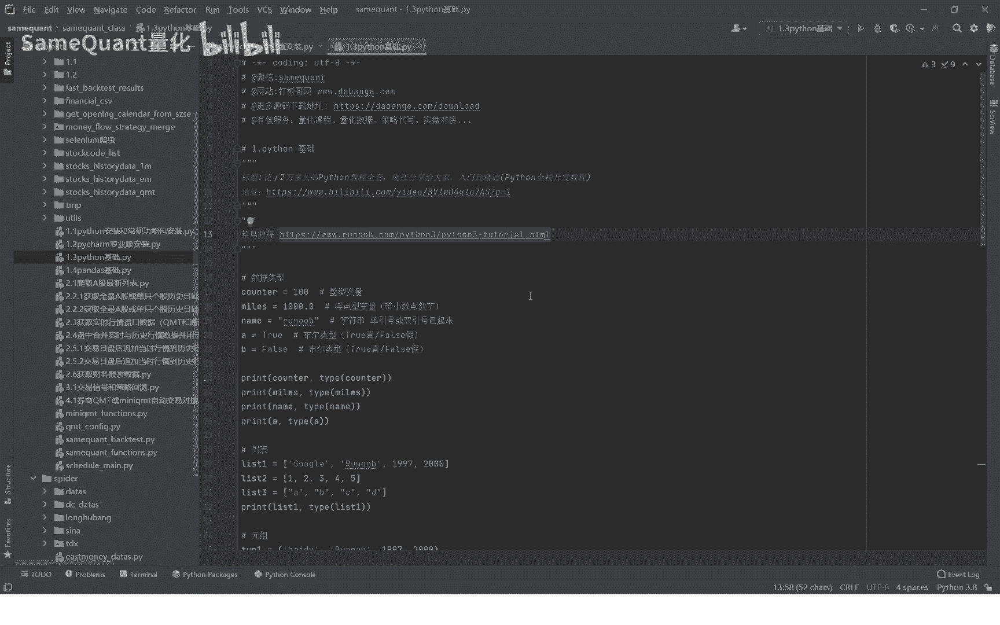
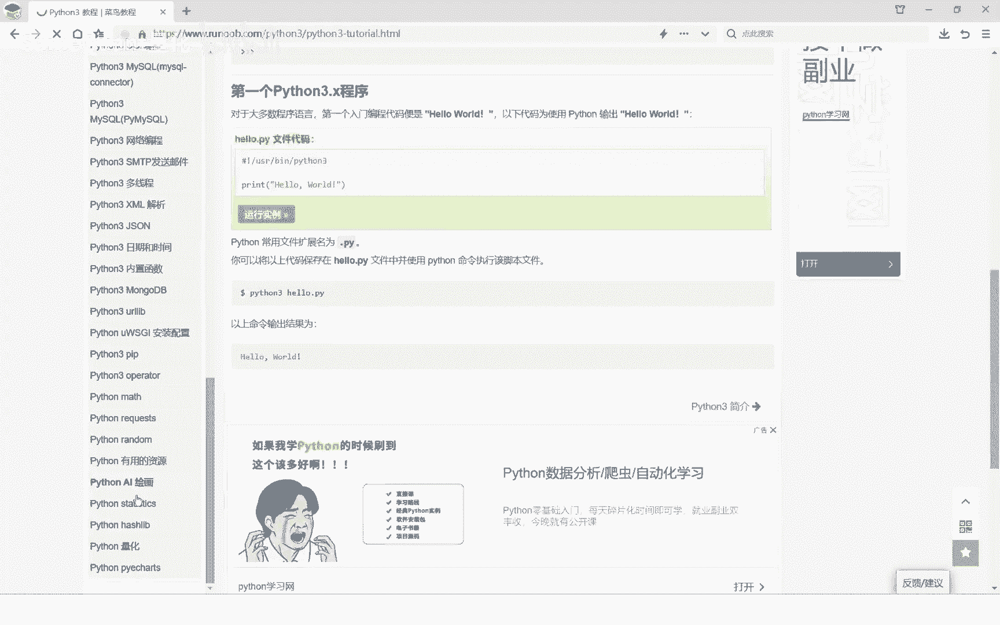
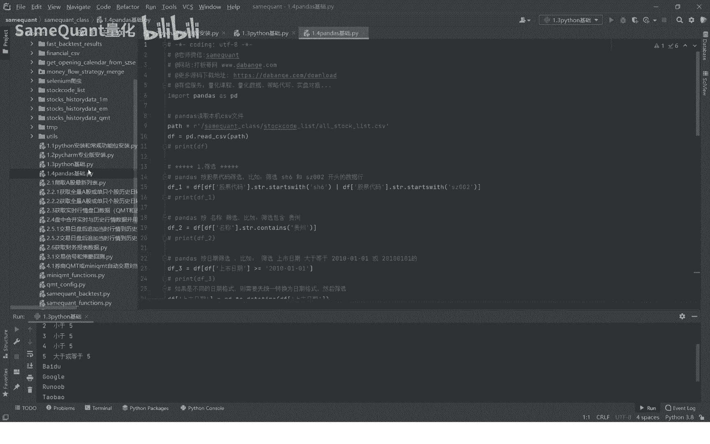

# 1.3 python基础入门 - P1 - SameQuant量化 - BV1aZ421475y

大家好，我是sim矿造量化，也是打板哥，现在我们正式进入这个课程的1。3节，也就是Python的一个基础，那么这节课呢主要是针对，就是说对于Python0基础的一个同学，一个Python的一个入门。

首先呢要说一下啊，因为Python的基础的话，不是一时半会能够轻易掌握了，这个大概需要几个月的时间，一个月就说你认真的去学习去啊，去头顶啊，去写代码，去调试，差不多一个月时间啊。

你可以熟练掌握一个Python一个基础，今天呢我们只是真的啊，真的是一个入门级的更加详细的一个教程呢，我提供了两个啊，一个是网页版的教程，菜鸟教程啊。

可以看一下，我们直接打开看一下啊，你直接在网址，你进来之后，这是python3，也就是python3。0以上的一个版本的一个教程，这里面的教程相对来说是比较完整的啊，你从头看到尾啊。

从这开始一直到到到最后就看到尾啊。

这里面也有代码，你就对着代码去调试啊，你把这个代码比如说点一下复制，你新建一个PY文件啊，在这里面你新建一个PY文件，这里六这个PSG file，新建一个文件啊，随便起个名字，你进来再运行一下。

你就可以对照课程啊，他最后是运行之后什么样的人你就可以看到了，这样你可以去菜鸟教程里面，去进行这样的一个学习啊，这个是一个网页版教程，另外一个视频版的教程啊，这里我也分享了一个网址啊。

这是一个哔哩哔哩的一个视频教程，这个教程是很火，将近有几个亿的播放，这个视频是很专业的，你对照这个视频去学习啊，学习效率也是很高的，这个大概一个星期就能学完了，这个视频教程当然也需要你认真的学好。

接下来呢我们就先来简单的讲解一些，财神的一些基础知识啊，比如说数据类型的话，一种是整形的啊，你比如说首先这个是一个变量啊，前面一个变量这个变量你怎么命名呢，你这个有一些命名的规则啊。

比如说这个重量你比如说设置100，这个100，这就是整形的变量啊，另外第二个一个类型的数据类型，比如说这是小数点，就是浮点型变量，也就是带小数点的，比如说一千一千。01小数点就是浮点型的，第三种。

你看这个加了一个双引号，是加双引号或者单引号啊，都可以啊，比如说是我们改成单引号，这种都叫字符串，字符串一般就是等双引号叫字符串，第四组这个叫布尔类型，布尔类型就说是真是假。

这个在Python里面就叫编程里面啊，这叫布尔类型，他说出了这个代表是真，这个boss代表是这个假，我们分别运行一下，打印输出一下啊，也就是这个print这个括号，把这里面这个参数这个写进来了。

这个逗号加个tab可以打印它的一个类型，我们先打印第一个参数，你如果将第二只只运行到这里，那你就是在这里啊，加一个ex1XIT是一个退出，这个的退出运行，也就是运行到这里的意思啊，我们点击运行好。

我们可以看到这个首先他打印的是这个counter，也就是这个变量啊，你定义的这个变量，这个变量因为它等于100嘛，所以说它打印出来它就是等于100，它是什么类型呢。

这个class class类型类型就是int，也就是整形变量啊，这就是它的类型就是int，也就是说如果你要想知道某一个变量，它是什么类型，那么你用这个print加个type，括号里面把这个变量加进去。

它就可以打印出类型了，好好，接下来，让我们把剩下的几个也通通的打印一遍哈，再运行一遍，我们可以看到对吧，第一个是int类型，第二个1000。01是这个float类型，就是浮点型类型，第三个ob啊。

这个是plus，也就是string string，也就是字符串啊，STR就表示字符串啊，这个就是TAR就是符串，这floor还可以啊，这样这个布尔类型就是DOLL，你这就是基本的一个类型，好到这里了。

说你比如说你要想把这个代码注释掉，就不打印，你把这几个数据打印的注释掉，那你就按你就直接按下CTRL加斜杠键哈，他就注释掉，注释掉之后，他这个位置就不会运行了，这个代码就不会运行，这个好。

我们接下来介绍另外的类型，另外的类型叫什么呢，叫列表列表呢，是这个你看是这种这种叫这个中括号，起个中括号列表里面，你可以把这个列表里面的任意类型，都放到列表里面去。

比如说我还可以再加一个true是吧是吧，加进来啊，这叫列表啊，你比如这个你列表里面可以混，你可以字符串也可以，数字也可以把这个这个小数点的练习也可以，布尔型的啊，这个东西你你甚至还可以。

列表里面还可以再放一个列表，就比如说一这种啊啊这都是可以的哈，这个列表我们三个列表，我们就分别我们先打印一下第一个列表，这里print列表列出一它的类型，我们再看一下，你看这个首先他这边是打印的。

是第一个列表的内容，第二后面是它的类型，就是这个语句哈，好那我们接下来再打印这个，直接打印这个列表二，这是只打印列表而不打印类型，那么它就是把列表二显示出来，列表三显示打印也是一样啊，直接运行打印好。

接下来我们就注释掉哈，我们就介绍下一个类型，下一个类型的话就是这个号原主是一个括号，你看这是括号的，就说括号里面你什么类型也能放哈，好我们接下来这个也是来打印一下哈，你看他这边就打印了出来了。

它的一个类型也是这叫top，这个叫原主，这个列表意识差一起，英文的叫这个，还有原主有一个特性，你比如说这个是里面有个2000是吧，那假设再输一个2000，现在他这里面有两个2000，他总共有五个元素。

我们现在再打印一下，看一下他打印的是几个，他打印的也还是这个五个，我们可以看到啊，打印的也还是五个啊，这就是原组的一个类型啊，接下来我们来介绍这个另外一种类型叫做字典，字典就是value。

也就是键值对的一个形式，这点也是DICT啊，首先呢你看这是有逗号啊，它是一对一对的，首先这个这个叫K这个叫按钮啊，一一对应的一个逗号，字典的第二个是这个年龄7class2号这样的。

但是用这个大括号来表示的，我们来打印一下啊，这个它打印出来了哈，你看它的一个类型是这个叫DIOR，这个就是字典的一个类型好，接下来就是说我们如果说要，我们要打印出这个A级，也就是年龄是几，那你怎么写呢。

你就把第一你把这个字典的变量的名字加进来，再写一个括号，括号把这个A级也就是这个K啊，你把它复制到这来，一打印怎么样，它就显示了这个七，如果说你要打印这个找到这个class对应的一个值。

那你就这输class对吧，如果你要是找到这个字典里面内部对应的值，那么你就是这样的就打印出来了，这个你看这rainbow它的名字叫rainbow，是不是特别简单哈，当然这只是一个基础哈。

接下来呢新的一种类型叫集合，我们可以看到啊，这个集合它集合呢它也是用大括号，但是呢它跟字典不一样，字典是逗号，每个逗号分隔的，它有一个冒号，B和Y6之间有一个冒号，那么这个集合呢它是就就是一个啊。

他这个没有逗号，它就是这样的集合啊，它集合有什么特性呢，大家注意看一下，你们可以看一下这个集合里面有apple，这也有apple，这有orange，这有P啊，这有orange，这个banana相交流。

打印一下，看一下，这个时候他就不一样了，你会发现我们这里面总共1234567，总共有七七个，七个元素里面总共有七个哈是吧，但是他只打印出来四个，而且你观察这四个是什么，这四个是没有重复的。

所以说集合的元素它不会去重，会自动去重，你在写代码过程中，如果遇到一个你要自动去重的一个东西，那你就你就用集合嘛，你把加入到这个集合里面，那么它就会自动去除，那就没有重复的，所以说啊集合的类型叫set。

这个就叫集合哈，好接下来呢我们来演示这个if条件语句啊，这个if else语句好，你比如说我们先设置这个EDG，这个年龄等于30，那接下来这个判断，如果说这个年龄小于12呢，我们是打印输出，你是个儿童。

如果这个年龄小于16了，那你就是一个未成年，这个小于等于16，I2是if小识，就是他这句话实际的意思是，因为前面有个if嘛，这个l if其实就是大于12，小于等于16，那你是未成年。

那么这个AE小于等于28，这个它其实是意思是大于16，小于等于28，你是青年，那么如果大于28的L是大于，也就是大于28，那么你的年龄就直接给你打印出来，我们现在是三十三十的话，是不是大于28。

应该运行的运行的最后这么一运行在这里，其他的你看这这几都不符合条，那不会运行，你看所以说就直接运行，这句是A级30好，那样我们改一下，改成十变成十，这些条件里面是不是只有这个符合啊，因为小于12符合啊。

就应该是运行这一句，只运行这其他的不会运行是吧，我们再运行一下哈，我们可以看到他就只打印了这一句，你是儿童是吧，那我们来到如果是13呢，他是不是就打印这一句啊，因为他是13，是大于12，小于16嘛是吧。

那你就是未成年，那么我们来是二十二十一呢，那就是你是青年嘛，这运行者是吧，这就是条件语句，根据你条件你去判断我要运行什么代码啊，运行哪一块的代码，这就条件语句符合条件，它就进入这个程序。

进入这里面去运行，如果它不会进入不符合条件里面去运行啊，好接下来我们还有一个叫循环语句啊，循环呢比如说l else循环，循环语有好几种，while循环，还有这个for循环，当然还有其他的一些循环。

我先来演示一下这个while else啊，比如说我们先设置一个count初始值的一个参数，它等于零，这是个整形的艾尔count，它只要这个L它小于五，我们就打印出来，它小于五，每运行一次之后。

我们就count会给它加个一啊，每次运行到加个一，再接下来继续循环去运行哈，直到什么呢，直到它大于等于五之后，它就运行到大于等于五，它就不再运行了啊，我们来算一下啊，他这里首先呢从0~4大概率再要运行。

首先要运行五次，第六次来运行这个啊是吧，因为是从零开始的哈，直接运行一下，看一下中间是零小于等于五，四小于等于五，五大于等于五，你看前面的这五个啊是运行的这一块的代码，后面的最后一个五大于等于五。

是运行的这个代码，这就是循环语句啊，它循环语句里面其实包含了有条件语句，如果你思考一下哈，好我们接下来来给大家讲解for循环，for循环，比如说首先这个我们定义一个变量啊，它你看这个变量类型是什么。

这个变量你看是中括号，就是列表在列表里面有四个元素，那么我们接下来就是一个for循环，For sin sets print，这个set它是什么意思，他这个就是逐个打印列表里面的元素啊，第一个第二个。

第三个，第四个，当然你比如说做循环里面这个东西，你可以随便输，你比如说Q啊，Q in size，那你这里也是Q嘛，你如果改成A啊，你改成这个A这里也改成A也是一样，都是可以运行的哈。

你直接运行他就会运行四次，你看运行这四次，知道吧，运行这运行四次啊，好那比如说我们这改成A，它毫还毫无疑问它也是一模一样，也就是说这个他是无所谓，他只不过说这个代表的是它的一个元素。

这个东西你怎么定义都是OK的哈，你看这也是一样啊，你比如说你把它改成这个改成这个集合，我们说改成集合，我们看一下改成集合之后它会怎么样啊，他也是要运营这，那如果说我们集合里面有重复的，有五个元素。

它有重复的，那我这样他现在是变成五个了，但是有重复的，大家觉得会运行几次啊，我们可以看一下，再运行一下，你觉得会运行几次，它实际上也只运行四次，而且的话你会发现它顺序是乱的，你看到没有，顺序是乱的。

他因为集合它有一个去除的一个功能哈，所以说我们一般就说要循环一个列，循环的时候我们一般用列表去动画哈，别的哈列表做循环列表，对对环进行环，那么我们接下来啊教定义函数，自定义一个函数，一个方法。

Python里面自定义函数前面加一个EFDF标识符，表示啊，后面这个东西是定义一个函数，比如说这个max a b，也就是比如说我们第一个函数是什么，比较大小的，返回较大的，那么就是max大小。

假设输入两个参数，一个是A1个是B参数一和参数二哈，两个参数如果A带B了，那就返回A，如果否则，那就返回B，否则等于小于等于B嘛，那就返回B，那就是返回最大的那个值嘛是吧，那这就是定义一个函数了。

就这个就是一个计算两个两个值之间较大的啊，返回较大的，比如说我A设置它，我接下来我这复制A等于四，B等于五，那这个A怎么样传给这个max这个函数，就然后我再复制给C打印一下C好。

那么这个C肯定就是等于五嘛，因为四跟五我最大，你看这就是五，那当然了，有人说啊，这是A这是B这也是A，这是B这个不会混，当然比如说你把这个改成什么，改成一行不行，X1你这个改成X2行不行啊，这改成X1。

当然这里也改成要对应的改成X1和X2啊，不行了，这还是11对，就是把四也就是把这个X1传给ax2，传给这个B去，比较运行C好，你看这个还是五，当然你还有一种更为清晰的写法，这是我个人比较喜欢的写法。

就是A等于11，B等于X2，也就是说我把这个X1赋值给这个这个函数的，AX2复制函数B然后去运行运算，这样的，还有这样一种选这样一种写法是比较清晰的，你比如说我现在改成六。

那么接下来打回来C应该就是六了，这就是比较大小，这就是一个函数的一个方法好了，这一节的一个Python的一个基础了，就给大家演示到这里啊，这个是非常入门的，非常基础的一个东西啊。

大家呢就是说演示运行先去玩一玩啊，最重要的是大家一定要看这两个教程，菜鸟教程这个网页版，一个是视频版的教程，就说你学Python基础，如果你想你的基础打得比较牢的话，你就把这两个地方都看完啊，认真看完。

认认真真学习一个月哈，你的Python基础就OK了，在你的Python基础没有打牢之前，不建议你去学后面的课程，PTHON基础一定要牢固一点，不然呢，你后面的课程相对来说就说不是那么轻松哈，你容易卡壳。

当然如果你有卡壳之后，你随时问我们群里面呃，一个助教就可以了好了，这节我们拍摄的基础就到这里，下一节我们会讲解潘大师技术，潘大师是我们量化交易过程中，用的最多的一个包啊，就是这个潘大师一个包。

也就是一个表格处理的一个包，好，这期我们先到这里。